NXP logo

M68000PM/AD  
REV. 1

# PROGRAMMER'S REFERENCE MANUAL

(Includes **CPU32** Instructions)


Motorola logo


The NXP logo, consisting of the letters 'NXP' in a stylized font with a blue 'N', an orange 'X', and a green 'P'.

NXP logo

# **MOTOROLA M68000 FAMILY****Programmer's Reference Manual**

**(Includes CPU32 Instructions)**

# TABLE OF CONTENTS

| Paragraph Number    | Title                                                                      | Page Number |
|---------------------|----------------------------------------------------------------------------|-------------|
| <b>Section 1</b>    |                                                                            |             |
| <b>Introduction</b> |                                                                            |             |
| 1.1                 | Integer Unit User Programming Model.....                                   | 1-2         |
| 1.1.1               | Data Registers (D7 – D0) .....                                             | 1-2         |
| 1.1.2               | Address Registers (A7 – A0).....                                           | 1-2         |
| 1.1.3               | Program Counter.....                                                       | 1-3         |
| 1.1.4               | Condition Code Register .....                                              | 1-3         |
| 1.2                 | Floating-Point Unit User Programming Model .....                           | 1-4         |
| 1.2.1               | Floating-Point Data Registers (FP7 – FP0).....                             | 1-4         |
| 1.2.2               | Floating-Point Control Register (FPCR) .....                               | 1-5         |
| 1.2.2.1             | Exception Enable Byte.....                                                 | 1-5         |
| 1.2.2.2             | Mode Control Byte. ....                                                    | 1-5         |
| 1.2.3               | Floating-Point Status Register (FPSR) .....                                | 1-5         |
| 1.2.3.1             | Floating-Point Condition Code Byte.....                                    | 1-5         |
| 1.2.3.2             | Quotient Byte. ....                                                        | 1-6         |
| 1.2.3.3             | Exception Status Byte.....                                                 | 1-6         |
| 1.2.3.4             | Accrued Exception Byte.....                                                | 1-7         |
| 1.2.4               | Floating-Point Instruction Address Register (FPIAR) .....                  | 1-8         |
| 1.3                 | Supervisor Programming Model.....                                          | 1-8         |
| 1.3.1               | Address Register 7 (A7) .....                                              | 1-10        |
| 1.3.2               | Status Register .....                                                      | 1-10        |
| 1.3.3               | Vector Base Register (VBR) .....                                           | 1-11        |
| 1.3.4               | Alternate Function Code Registers (SFC and DFC) .....                      | 1-11        |
| 1.3.5               | Acu Status Register (MC68EC030 only).....                                  | 1-11        |
| 1.3.6               | Transparent Translation/access Control Registers .....                     | 1-12        |
| 1.3.6.1             | Transparent Translation/access Control Register Fields for the M68030..... | 1-12        |
| 1.3.6.2             | Transparent Translation/access Control Register Fields for the M68040..... | 1-13        |
| 1.4                 | Integer Data Formats .....                                                 | 1-14        |
| 1.5                 | Floating-Point Data Formats .....                                          | 1-15        |
| 1.5.1               | Packed Decimal Real Format .....                                           | 1-15        |
| 1.5.2               | Binary Floating-Point Formats.....                                         | 1-16        |
| 1.6                 | Floating-Point Data Types .....                                            | 1-17        |
| 1.6.1               | Normalized Numbers.....                                                    | 1-18        |
| 1.6.2               | Denormalized Numbers.....                                                  | 1-18        |
| 1.6.3               | Zeros .....                                                                | 1-19        |
| 1.6.4               | Infinities .....                                                           | 1-19        |
| 1.6.5               | Not-A-Numbers .....                                                        | 1-19        |
| 1.6.6               | Data Format and Type Summary .....                                         | 1-20        |
| 1.7                 | Organization of Data in Registers .....                                    | 1-25        |
| 1.7.1               | Organization of Integer Data Formats in Registers .....                    | 1-25        |

# TABLE OF CONTENTS (Continued)

| Paragraph Number                                   | Title                                                             | Page Number |
|----------------------------------------------------|-------------------------------------------------------------------|-------------|
| 1.7.2                                              | Organization of Integer Data Formats in Memory .....              | 1-27        |
| 1.7.3                                              | Organization of Fpu Data Formats in Registers and Memory .....    | 1-30        |
| <b>Section 2</b><br><b>Addressing Capabilities</b> |                                                                   |             |
| 2.1                                                | Instruction Format .....                                          | 2-1         |
| 2.2                                                | Effective Addressing Modes .....                                  | 2-4         |
| 2.2.1                                              | Data Register Direct Mode .....                                   | 2-5         |
| 2.2.2                                              | Address Register Direct Mode .....                                | 2-5         |
| 2.2.3                                              | Address Register Indirect Mode .....                              | 2-5         |
| 2.2.4                                              | Address Register Indirect with Postincrement Mode .....           | 2-6         |
| 2.2.5                                              | Address Register Indirect with Predecrement Mode .....            | 2-7         |
| 2.2.6                                              | Address Register Indirect with Displacement Mode .....            | 2-8         |
| 2.2.7                                              | Address Register Indirect with Index (8-Bit Displacement) Mode .. | 2-9         |
| 2.2.8                                              | Address Register Indirect with Index (Base Displacement) Mode...  | 2-10        |
| 2.2.9                                              | Memory Indirect Postindexed Mode .....                            | 2-11        |
| 2.2.10                                             | Memory Indirect Preindexed Mode .....                             | 2-12        |
| 2.2.11                                             | Program Counter Indirect with Displacement Mode .....             | 2-13        |
| 2.2.12                                             | Program Counter Indirect with Index (8-Bit Displacement) Mode ... | 2-14        |
| 2.2.13                                             | Program Counter Indirect with Index (Base Displacement) Mode...   | 2-15        |
| 2.2.14                                             | Program Counter Memory Indirect Postindexed Mode .....            | 2-16        |
| 2.2.15                                             | Program Counter Memory Indirect Preindexed Mode .....             | 2-17        |
| 2.2.16                                             | Absolute Short Addressing Mode .....                              | 2-18        |
| 2.2.17                                             | Absolute Long Addressing Mode .....                               | 2-18        |
| 2.2.18                                             | Immediate Data .....                                              | 2-19        |
| 2.3                                                | Effective Addressing Mode Summary .....                           | 2-19        |
| 2.4                                                | Brief Extension Word Format Compatibility .....                   | 2-21        |
| 2.5                                                | Full Extension Addressing Modes .....                             | 2-22        |
| 2.5.1                                              | No Memory Indirect Action Mode .....                              | 2-24        |
| 2.5.2                                              | Memory Indirect Modes .....                                       | 2-25        |
| 2.5.2.1                                            | Memory Indirect with Preindex .....                               | 2-25        |
| 2.5.2.2                                            | Memory Indirect with Postindex .....                              | 2-26        |
| 2.5.2.3                                            | Memory Indirect with Index Suppressed .....                       | 2-27        |
| 2.6                                                | Other Data Structures .....                                       | 2-28        |
| 2.6.1                                              | System Stack .....                                                | 2-28        |
| 2.6.2                                              | Queues .....                                                      | 2-29        |
| <b>Section 3</b><br><b>Instruction Set Summary</b> |                                                                   |             |
| 3.1                                                | Instruction Summary .....                                         | 3-1         |
| 3.1.1                                              | Data Movement Instructions .....                                  | 3-5         |
| 3.1.2                                              | Integer Arithmetic Instructions .....                             | 3-6         |

# TABLE OF CONTENTS (Continued)

| Paragraph Number | Title                                                       | Page Number |
|------------------|-------------------------------------------------------------|-------------|
| 3.1.3            | Logical Instructions . . . . .                              | 3-8         |
| 3.1.4            | Shift and Rotate Instructions . . . . .                     | 3-8         |
| 3.1.5            | Bit Manipulation Instructions . . . . .                     | 3-10        |
| 3.1.6            | Bit Field Instructions . . . . .                            | 3-10        |
| 3.1.7            | Binary-Coded Decimal Instructions . . . . .                 | 3-11        |
| 3.1.8            | Program Control Instructions . . . . .                      | 3-11        |
| 3.1.9            | System Control Instructions . . . . .                       | 3-12        |
| 3.1.10           | Cache Control Instructions (MC68040) . . . . .              | 3-14        |
| 3.1.11           | Multiprocessor Instructions . . . . .                       | 3-14        |
| 3.1.12           | Memory Management Unit (MMU) Instructions . . . . .         | 3-15        |
| 3.1.13           | Floating-Point Arithmetic Instructions . . . . .            | 3-15        |
| 3.2              | Integer Unit Condition Code Computation . . . . .           | 3-17        |
| 3.3              | Instruction Examples . . . . .                              | 3-20        |
| 3.3.1            | Using the Cas and Cas2 Instructions . . . . .               | 3-20        |
| 3.3.2            | Using the Moves Instruction . . . . .                       | 3-20        |
| 3.3.3            | Nested Subroutine Calls . . . . .                           | 3-20        |
| 3.3.4            | Bit Field Instructions . . . . .                            | 3-20        |
| 3.3.5            | Pipeline Synchronization with the Nop Instruction . . . . . | 3-21        |
| 3.4              | Floating-Point Instruction Details . . . . .                | 3-21        |
| 3.5              | Floating-Point Computational Accuracy . . . . .             | 3-23        |
| 3.5.1            | Intermediate Result . . . . .                               | 3-24        |
| 3.5.2            | Rounding the Result . . . . .                               | 3-25        |
| 3.6              | Floating-Point Postprocessing . . . . .                     | 3-27        |
| 3.6.1            | Underflow, Round, Overflow . . . . .                        | 3-28        |
| 3.6.2            | Conditional Testing . . . . .                               | 3-28        |
| 3.7              | Instruction Descriptions . . . . .                          | 3-32        |

# Section 4 Integer Instructions

# Section 5 Floating Point Instructions

# Section 6 Supervisor (Privileged) Instructions

# Section 7 CPU32 Instructions

# Section 8 Instruction Format Summary

|     |                              |     |
|-----|------------------------------|-----|
| 8.1 | Instruction Format . . . . . | 8-1 |
|-----|------------------------------|-----|

# TABLE OF CONTENTS (Continued)

| Paragraph Number | Title                                   | Page Number |
|------------------|-----------------------------------------|-------------|
| 8.1.1            | Coprocessor ID Field. . . . .           | 8-1         |
| 8.1.2            | Effective Address Field . . . . .       | 8-1         |
| 8.1.3            | Register/Memory Field . . . . .         | 8-1         |
| 8.1.4            | Source Specifier Field . . . . .        | 8-1         |
| 8.1.5            | Destination Register Field . . . . .    | 8-2         |
| 8.1.6            | Conditional Predicate Field . . . . .   | 8-2         |
| 8.1.7            | Shift and Rotate Instructions . . . . . | 8-2         |
| 8.1.7.1          | Count Register Field. . . . .           | 8-2         |
| 8.1.7.2          | Register Field. . . . .                 | 8-2         |
| 8.1.8            | Size Field. . . . .                     | 8-4         |
| 8.1.9            | Opmode Field . . . . .                  | 8-4         |
| 8.1.10           | Address/Data Field . . . . .            | 8-4         |
| 8.2              | Operation Code Map . . . . .            | 8-4         |

# Appendix A

## Processor Instruction Summary

|       |                                                          |      |
|-------|----------------------------------------------------------|------|
| A.1   | MC68000, MC68008, MC68010 Processors . . . . .           | A-12 |
| A.1.1 | M68000, MC68008, and MC68010 Instruction Set . . . . .   | A-12 |
| A.1.2 | MC68000, MC68008, and MC68010 Addressing Modes . . . . . | A-16 |
| A.2   | MC68020 Processors. . . . .                              | A-17 |
| A.2.1 | MC68020 Instruction Set. . . . .                         | A-17 |
| A.2.2 | MC68020 Addressing Modes . . . . .                       | A-20 |
| A.3   | MC68030 Processors. . . . .                              | A-21 |
| A.3.1 | MC68030 Instruction Set. . . . .                         | A-21 |
| A.3.2 | MC68030 Addressing Modes . . . . .                       | A-24 |
| A.4   | MC68040 Processors. . . . .                              | A-25 |
| A.4.1 | MC68040 Instruction Set. . . . .                         | A-25 |
| A.4.2 | MC68040 Addressing Modes . . . . .                       | A-29 |
| A.5   | MC68881/MC68882 Coprocessors . . . . .                   | A-30 |
| A.5.1 | MC68881/MC68882 Instruction Set . . . . .                | A-30 |
| A.5.2 | MC68881/MC68882 Addressing Modes . . . . .               | A-31 |
| A.6   | MC68851 Coprocessors. . . . .                            | A-31 |
| A.6.1 | MC68851 Instruction Set. . . . .                         | A-31 |
| A.6.2 | MC68851 Addressing Modes . . . . .                       | A-31 |

### Appendix B

#### Exception Processing Reference

|     |                                                              |      |
|-----|--------------------------------------------------------------|------|
| B.1 | Exception Vector Assignments for the M68000 Family . . . . . | B-1  |
| B.2 | Exception Stack Frames . . . . .                             | B-3  |
| B.3 | Floating-Point Stack Frames . . . . .                        | B-10 |

## TABLE OF CONTENTS (Concluded)

| Paragraph Number              | Title                       | Page Number |
|-------------------------------|-----------------------------|-------------|
| <b>Appendix C</b>             |                             |             |
| <b>S-Record Output Format</b> |                             |             |
| C.1                           | S-Record Content. . . . .   | C-1         |
| C.2                           | S-Record Types . . . . .    | C-2         |
| C.3                           | S-Record Creation . . . . . | C-3         |

## LIST OF FIGURES

| Figure Number | Title                                                                                        | Page Number |
|---------------|----------------------------------------------------------------------------------------------|-------------|
| 1-1           | M68000 Family User Programming Model.....                                                    | 1-2         |
| 1-2           | M68000 Family Floating-Point Unit User Programming Model .....                               | 1-4         |
| 1-3           | Floating-Point Control Register .....                                                        | 1-5         |
| 1-4           | FPSR Condition Code Byte.....                                                                | 1-6         |
| 1-5           | FPSR Quotient Code Byte .....                                                                | 1-6         |
| 1-6           | FPSR Exception Status Byte .....                                                             | 1-6         |
| 1-7           | FPSR Accrued Exception Byte .....                                                            | 1-7         |
| 1-8           | Status Register.....                                                                         | 1-11        |
| 1-9           | MC68030 Transparent Translation/MC68EC030 Access Control Register Format.....                | 1-12        |
| 1-10          | MC68040 and MC68LC040 Transparent Translation/MC68EC040 Access Control Register Format ..... | 1-13        |
| 1-11          | Packed Decimal Real Format .....                                                             | 1-16        |
| 1-12          | Binary Floating-Point Data Formats .....                                                     | 1-16        |
| 1-13          | Normalized Number Format.....                                                                | 1-18        |
| 1-14          | Denormalized Number Format.....                                                              | 1-18        |
| 1-15          | Zero Format .....                                                                            | 1-19        |
| 1-16          | Infinity Format .....                                                                        | 1-19        |
| 1-17          | Not-A-Number Format.....                                                                     | 1-19        |
| 1-19          | Organization of Integer Data Formats in Address Registers.....                               | 1-26        |
| 1-18          | Organization of Integer Data Formats in Data Registers .....                                 | 1-26        |
| 1-20          | Memory Operand Addressing .....                                                              | 1-27        |
| 1-21          | Memory Organization for Integer Operands.....                                                | 1-29        |
| 1-22          | Organization of FPU Data Formats in Memory .....                                             | 1-30        |
| 2-1           | Instruction Word General Format.....                                                         | 2-1         |
| 2-2           | Instruction Word Specification Formats .....                                                 | 2-2         |
| 2-3           | M68000 Family Brief Extension Word Formats.....                                              | 2-21        |
| 2-4           | Addressing Array Items.....                                                                  | 2-23        |
| 2-5           | No Memory Indirect Action.....                                                               | 2-24        |
| 2-6           | Memory Indirect with Preindex.....                                                           | 2-26        |
| 2-7           | Memory Indirect with Postindex .....                                                         | 2-27        |
| 2-8           | Memory Indirect with Index Suppress .....                                                    | 2-27        |
| 3-1           | Intermediate Result Format.....                                                              | 3-24        |
| 3-2           | Rounding Algorithm Flowchart.....                                                            | 3-26        |
| 3-3           | Instruction Description Format .....                                                         | 3-33        |
| B-1           | MC68000 Group 1 and 2 Exception Stack Frame .....                                            | B-3         |
| B-2           | MC68000 Bus or Address Error Exception Stack Frame.....                                      | B-3         |
| B-3           | Four-Word Stack Frame, Format \$0 .....                                                      | B-3         |
| B-4           | Throwaway Four-Word Stack Frame, Format \$1 .....                                            | B-3         |

## LIST OF FIGURES (Concluded)

| Figure Number | Title                                                                              | Page Number |
|---------------|------------------------------------------------------------------------------------|-------------|
| B-5           | Six-Word Stack Frame, Format \$2.....                                              | B-4         |
| B-6           | MC68040 Floating-Point Post-Instruction Stack Frame, Format \$3.....               | B-4         |
| B-7           | MC68EC040 and MC68LC040 Floating-Point Unimplemented Stack Frame, Format \$4 ..... | B-5         |
| B-8           | MC68040 Access Error Stack Frame, Format \$7 .....                                 | B-5         |
| B-9           | MC68010 Bus and Address Error Stack Frame, Format \$8 .....                        | B-6         |
| B-10          | MC68020 Bus and MC68030 Coprocessor Mid-Instruction Stack Frame, Format \$9 .....  | B-6         |
| B-11          | MC68020 and MC68030 Short Bus Cycle Stack Frame, Format \$A.....                   | B-7         |
| B-12          | MC68020 and MC68030 Long Bus Cycle Stack Frame, Format \$B.....                    | B-8         |
| B-13          | CPU32 Bus Error for Prefetches and Operands Stack Frame, Format \$C....            | B-8         |
| B-14          | CPU32 Bus Error on MOVE Operand Stack Frame, Format \$C .....                      | B-9         |
| B-15          | CPU32 Four- and Six-Word Bus Error Stack Frame, Format \$C.....                    | B-9         |
| B-16          | MC68881/MC68882 and MC68040 Null Stack Frame.....                                  | B-10        |
| B-17          | MC68881 Idle Stack Frame .....                                                     | B-10        |
| B-18          | MC68881 Busy Stack Frame .....                                                     | B-11        |
| B-19          | MC68882 Idle Stack Frame .....                                                     | B-11        |
| B-20          | MC68882 Busy Stack Frame .....                                                     | B-11        |
| B-21          | MC68040 Idle Busy Stack Frame .....                                                | B-12        |
| B-22          | MC68040 Unimplemented Instruction Stack Frame.....                                 | B-12        |
| B-23          | MC68040 Busy Stack Frame .....                                                     | B-13        |
| C-1           | Five Fields of an S-Record.....                                                    | C-1         |
| C-2           | Transmission of an S1 Record.....                                                  | C-4         |

## LIST OF TABLES

| Table Number | Title                                                             | Page Number |
|--------------|-------------------------------------------------------------------|-------------|
| 1-1          | Supervisor Registers Not Related To Paged Memory Management ..... | 1-9         |
| 1-2          | Supervisor Registers Related To Paged Memory Management.....      | 1-10        |
| 1-3          | Integer Data Formats .....                                        | 1-15        |
| 1-4          | Single-Precision Real Format Summary Data Format .....            | 1-21        |
| 1-5          | Double-Precision Real Format Summary.....                         | 1-22        |
| 1-6          | Extended-Precision Real Format Summary.....                       | 1-23        |
| 1-6          | Extended-Precision Real Format Summary (Continued) .....          | 1-24        |
| 1-7          | Packed Decimal Real Format Summary .....                          | 1-24        |
| 1-8          | MC68040 FPU Data Formats and Data Types .....                     | 1-30        |
| 2-1          | Instruction Word Format Field Definitions .....                   | 2-3         |
| 2-2          | IS-I/IS Memory Indirect Action Encodings.....                     | 2-4         |
| 2-3          | Immediate Operand Location.....                                   | 2-19        |
| 2-4          | Effective Addressing Modes and Categories .....                   | 2-20        |
| 3-1          | Notational Conventions .....                                      | 3-2         |
| 3-1          | Notational Conventions (Continued) .....                          | 3-3         |
| 3-1          | Notational Conventions (Concluded) .....                          | 3-4         |
| 3-2          | Data Movement Operation Format.....                               | 3-6         |
| 3-3          | Integer Arithmetic Operation Format.....                          | 3-7         |
| 3-4          | Logical Operation Format.....                                     | 3-8         |
| 3-5          | Shift and Rotate Operation Format .....                           | 3-9         |
| 3-6          | Bit Manipulation Operation Format .....                           | 3-10        |
| 3-7          | Bit Field Operation Format.....                                   | 3-10        |
| 3-8          | Binary-Coded Decimal Operation Format.....                        | 3-11        |
| 3-9          | Program Control Operation Format.....                             | 3-12        |
| 3-10         | System Control Operation Format .....                             | 3-13        |
| 3-11         | Cache Control Operation Format .....                              | 3-14        |
| 3-12         | Multiprocessor Operations .....                                   | 3-14        |
| 3-13         | MMU Operation Format .....                                        | 3-15        |
| 3-14         | Dyadic Floating-Point Operation Format.....                       | 3-16        |
| 3-15         | Dyadic Floating-Point Operations .....                            | 3-16        |
| 3-16         | Monadic Floating-Point Operation Format .....                     | 3-16        |
| 3-17         | Monadic Floating-Point Operations.....                            | 3-17        |
| 3-18         | Integer Unit Condition Code Computations.....                     | 3-18        |
| 3-19         | Conditional Tests .....                                           | 3-19        |
| 3-20         | Operation Table Example (FADD Instruction).....                   | 3-22        |
| 3-21         | FPCR Encodings.....                                               | 3-25        |
| 3-22         | FPCC Encodings.....                                               | 3-29        |
| 3-23         | Floating-Point Conditional Tests .....                            | 3-31        |
| 5-1          | Directly Supported Floating-Point Instructions .....              | 5-2         |
| 5-2          | Indirectly Supported Floating-Point Instructions.....             | 5-3         |

## LIST OF TABLES (Continued)

| Table Number | Title                                                            | Page Number |
|--------------|------------------------------------------------------------------|-------------|
| 7-1          | MC68020 Instructions Not Supported .....                         | 7-1         |
| 7-2          | M68000 Family Addressing Modes.....                              | 7-2         |
| 7-3          | CPU32 Instruction Set.....                                       | 7-3         |
| 8-1          | Conditional Predicate Field Encoding .....                       | 8-3         |
| 8-2          | Operation Code Map.....                                          | 8-4         |
| A-1          | M68000 Family Instruction Set And Processor Cross-Reference..... | A-1         |
| A-2          | M68000 Family Instruction Set.....                               | A-8         |
| A-3          | MC68000 and MC68008 Instruction Set.....                         | A-12        |
| A-4          | MC68010 Instruction Set.....                                     | A-14        |
| A-5          | MC68000, MC68008, and MC68010 Data Addressing Modes .....        | A-16        |
| A-6          | MC68020 Instruction Set Summary .....                            | A-17        |
| A-7          | MC68020 Data Addressing Modes .....                              | A-20        |
| A-8          | MC68030 Instruction Set Summary .....                            | A-21        |
| A-9          | MC68030 Data Addressing Modes .....                              | A-24        |
| A-10         | MC68040 Instruction Set.....                                     | A-25        |
| A-11         | MC68040 Data Addressing Modes .....                              | A-29        |
| A-12         | MC68881/MC68882 Instruction Set.....                             | A-30        |
| A-13         | MC68851 Instruction Set.....                                     | A-31        |
| B-1          | Exception Vector Assignments for the M68000 Family.....          | B-2         |
| C-1          | Field Composition of an S-Record .....                           | C-1         |
| C-2          | ASCII Code .....                                                 | C-5         |

## SECTION 1 INTRODUCTION

This manual contains detailed information about software instructions used by the microprocessors and coprocessors in the M68000 family, including:

|           |   |                                                  |
|-----------|---|--------------------------------------------------|
| MC68000   | — | 16-/32-Bit Microprocessor                        |
| MC68EC000 | — | 16-/32-Bit Embedded Controller                   |
| MC68HC000 | — | Low Power 16-/32-Bit Microprocessor              |
| MC68008   | — | 16-Bit Microprocessor with 8-Bit Data Bus        |
| MC68010   | — | 16-/32-Bit Virtual Memory Microprocessor         |
| MC68020   | — | 32-Bit Virtual Memory Microprocessor             |
| MC68EC020 | — | 32-Bit Embedded Controller                       |
| MC68030   | — | Second-Generation 32-Bit Enhanced Microprocessor |
| MC68EC030 | — | 32-Bit Embedded Controller                       |
| MC68040   | — | Third-Generation 32-Bit Microprocessor           |
| MC68LC040 | — | Third-Generation 32-Bit Microprocessor           |
| MC68EC040 | — | 32-Bit Embedded Controller                       |
| MC68330   | — | Integrated CPU32 Processor                       |
| MC68340   | — | Integrated Processor with DMA                    |
| MC68851   | — | Paged Memory Management Unit                     |
| MC68881   | — | Floating-Point Coprocessor                       |
| MC68882   | — | Enhanced Floating-Point Coprocessor              |

### NOTE

All references to the MC68000, MC68020, and MC68030 include the corresponding embedded controllers, MC68EC000, MC68EC020, and MC68EC030. All references to the MC68040 include the MC68LC040 and MC68EC040. This referencing method applies throughout the manual unless otherwise specified.

The M68000 family programming model consists of two register groups: user and supervisor. User programs executing in the user mode only use the registers in the user group. System software executing in the supervisor mode can access all registers and uses the control registers in the supervisor group to perform supervisor functions. The following paragraphs provide a brief description of the registers in the user and supervisor models as well as the data organization in the registers.

## 1.1 INTEGER UNIT USER PROGRAMMING MODEL

Figure 1-1 illustrates the integer portion of the user programming model. It consists of the following registers:

- 16 General-Purpose 32-Bit Registers (D7 – D0, A7 – A0)
- 32-Bit Program Counter (PC)
- 8-Bit Condition Code Register (CCR)

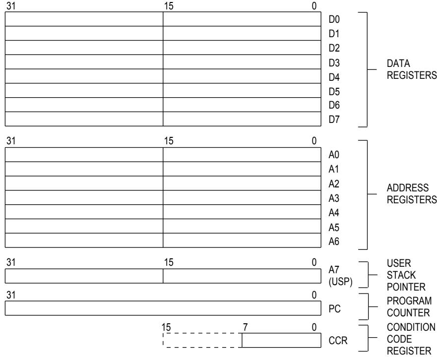

The diagram illustrates the bit fields and groupings of the M68000 Family User Programming Model. It shows the following registers and their bit fields:

- DATA REGISTERS (D7 – D0):** Each is a 32-bit register divided into two 16-bit halves. The top half (bits 31-16) is labeled D7, and the bottom half (bits 15-0) is labeled D0.
- ADDRESS REGISTERS (A7 – A0):** Each is a 32-bit register divided into two 16-bit halves. The top half (bits 31-16) is labeled A7, and the bottom half (bits 15-0) is labeled A0.
- USER STACK POINTER (A7 (USP)):** A 32-bit register divided into two 16-bit halves. The top half (bits 31-16) is labeled A7, and the bottom half (bits 15-0) is labeled (USP).
- PROGRAM COUNTER (PC):** A 32-bit register divided into two 16-bit halves. The top half (bits 31-16) is labeled A7, and the bottom half (bits 15-0) is labeled PC.
- CONDITION CODE REGISTER (CCR):** An 8-bit register divided into three fields: bits 7-4 (labeled 15), bits 3-0 (labeled 7), and a single bit (labeled 0).

Diagram of the M68000 Family User Programming Model showing register bit fields and groupings.

**Figure 1-1. M68000 Family User Programming Model**

### 1.1.1 Data Registers (D7 – D0)

These registers are for bit and bit field (1 – 32 bits), byte (8 bits), word (16 bits), long-word (32 bits), and quad-word (64 bits) operations. They also can be used as index registers.

### 1.1.2 Address Registers (A7 – A0)

These registers can be used as software stack pointers, index registers, or base address registers. The base address registers can be used for word and long-word operations. Register A7 is used as a hardware stack pointer during stacking for subroutine calls and exception handling. In the user programming model, A7 refers to the user stack pointer (USP).

### 1.1.3 Program Counter

The PC contains the address of the instruction currently executing. During instruction execution and exception processing, the processor automatically increments the contents or places a new value in the PC. For some addressing modes, the PC can be used as a pointer for PC relative addressing.

### 1.1.4 Condition Code Register

Consisting of five bits, the CCR, the status register's lower byte, is the only portion of the status register (SR) available in the user mode. Many integer instructions affect the CCR, indicating the instruction's result. Program and system control instructions also use certain combinations of these bits to control program and system flow. The condition codes meet two criteria: consistency across instructions, uses, and instances and meaningful results with no change unless it provides useful information.

Consistency across instructions means that all instructions that are special cases of more general instructions affect the condition codes in the same way. Consistency across uses means that conditional instructions test the condition codes similarly and provide the same results whether a compare, test, or move instruction sets the condition codes. Consistency across instances means that all instances of an instruction affect the condition codes in the same way.

The first four bits represent a condition of the result generated by an operation. The fifth bit or the extend bit (X-bit) is an operand for multiprecision computations. The carry bit (C-bit) and the X-bit are separate in the M68000 family to simplify programming techniques that use them (refer to Table 3-18 as an example). In the instruction set definitions, the CCR is illustrated as follows:


|                          |                          |                          |                          |                          |
|--------------------------|--------------------------|--------------------------|--------------------------|--------------------------|
| X                        | N                        | Z                        | V                        | C                        |
| <input type="checkbox"/> | <input type="checkbox"/> | <input type="checkbox"/> | <input type="checkbox"/> | <input type="checkbox"/> |

#### X—Extend

Set to the value of the C-bit for arithmetic operations; otherwise not affected or set to a specified result.

#### N—Negative

Set if the most significant bit of the result is set; otherwise clear.

#### Z—Zero

Set if the result equals zero; otherwise clear.

#### V—Overflow

Set if an arithmetic overflow occurs implying that the result cannot be represented in the operand size; otherwise clear.

**C—Carry**

Set if a carry out of the most significant bit of the operand occurs for an addition, or if a borrow occurs in a subtraction; otherwise clear.

## 1.2 FLOATING-POINT UNIT USER PROGRAMMING MODEL

The following paragraphs describe the registers for the floating-point unit user programming model. Figure 1-2 illustrates the M68000 family user programming model's floating-point portion for the MC68040 and the MC68881/MC68882 floating-point coprocessors. It contains the following registers:

- 8 Floating-Point Data Registers (FP7 – FP0)
- 16-Bit Floating-Point Control Register (FPCR)
- 32-Bit Floating-Point Status Register (FPSR)
- 32-Bit Floating-Point Instruction Address Register (FPIAR)

![Figure 1-2: M68000 Family Floating-Point Unit User Programming Model. The diagram shows the bit layout of the floating-point registers. At the top is a 64-bit register block (bits 79-63 and 63-0) containing 8 Floating-Point Data Registers (FP0-FP7). Below this are three 32-bit registers: FPCR (bits 31-0), FPSR (bits 31-0), and FPIAR (bits 31-0). The FPCR register is divided into two 16-bit fields: EXCEPTION ENABLE (bits 15-0) and MODE CONTROL (bits 7-0). The FPSR register is divided into four 8-bit fields: CONDITION CODE (bits 31-24), QUOTIENT (bits 23-16), EXCEPTION STATUS (bits 15-8), and ACCRUED EXCEPTION (bits 7-0).](M68000PRM.images/bffdddb47fced140f8d17fdc2a29f592_img.jpg)

Figure 1-2: M68000 Family Floating-Point Unit User Programming Model. The diagram shows the bit layout of the floating-point registers. At the top is a 64-bit register block (bits 79-63 and 63-0) containing 8 Floating-Point Data Registers (FP0-FP7). Below this are three 32-bit registers: FPCR (bits 31-0), FPSR (bits 31-0), and FPIAR (bits 31-0). The FPCR register is divided into two 16-bit fields: EXCEPTION ENABLE (bits 15-0) and MODE CONTROL (bits 7-0). The FPSR register is divided into four 8-bit fields: CONDITION CODE (bits 31-24), QUOTIENT (bits 23-16), EXCEPTION STATUS (bits 15-8), and ACCRUED EXCEPTION (bits 7-0).

**Figure 1-2. M68000 Family Floating-Point Unit User Programming Model**

### 1.2.1 Floating-Point Data Registers (FP7 – FP0)

These floating-point data registers are analogous to the integer data registers for the M68000 family. They always contain extended-precision numbers. All external operands, despite the data format, are converted to extended-precision values before being used in any calculation or being stored in a floating-point data register. A reset or a null-restore operation sets FP7 – FP0 positive, nonsignaling not-a-numbers (NaNs).

## 1.2.2 Floating-Point Control Register (FPCR)

The FPCR (see Figure 1-3) contains an exception enable (ENABLE) byte and a mode control (MODE) byte. The user can read or write to the FPCR. Motorola reserves bits 31 – 16 for future definition; these bits are always read as zero and are ignored during write operations. The reset function or a restore operation of the null state clears the FPCR. When cleared, this register provides the IEEE 754 Standard for Binary Floating-Point Arithmetic defaults.

**1.2.2.1 EXCEPTION ENABLE BYTE.** Each bit of the ENABLE byte (see Figure 1-3) corresponds to a floating-point exception class. The user can separately enable traps for each class of floating-point exceptions.

**1.2.2.2 MODE CONTROL BYTE.** MODE (see Figure 1-3) controls the user-selectable rounding modes and precisions. Zeros in this byte select the IEEE 754 standard defaults. The rounding mode (RND) field specifies how inexact results are rounded, and the rounding precision (PREC) field selects the boundary for rounding the mantissa. Refer to Table 3-21 for encoding information. .

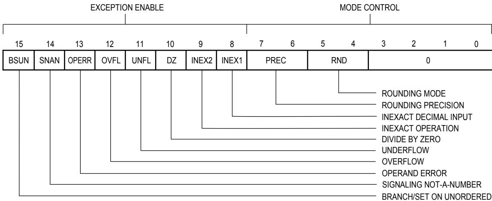

The diagram illustrates the 16-bit Floating-Point Control Register (FPCR) structure. It is divided into two main sections: EXCEPTION ENABLE (bits 15-8) and MODE CONTROL (bits 7-0).

| EXCEPTION ENABLE |      |       |      |      |    |       |       | MODE CONTROL |     |   |   |   |   |   |   |
|------------------|------|-------|------|------|----|-------|-------|--------------|-----|---|---|---|---|---|---|
| 15               | 14   | 13    | 12   | 11   | 10 | 9     | 8     | 7            | 6   | 5 | 4 | 3 | 2 | 1 | 0 |
| BSUN             | SNAN | OPERR | OVFL | UNFL | DZ | INEX2 | INEX1 | PREC         | RND |   | 0 |   |   |   |   |

Legend for Mode Control bits (bits 7-0):

- ROUNDING MODE: Bit 4 (RND)
- ROUNDING PRECISION: Bit 5 (PREC)
- INEXACT DECIMAL INPUT: Bit 6
- INEXACT OPERATION: Bit 7
- DIVIDE BY ZERO: Bit 8 (INEX1)
- UNDERFLOW: Bit 9 (INEX2)
- OVERFLOW: Bit 10
- OPERAND ERROR: Bit 11
- SIGNALING NOT-A-NUMBER: Bit 12
- BRANCH/SET ON UNORDERED: Bit 13

Figure 1-3: Floating-Point Control Register (FPCR) diagram showing bit fields for Exception Enable and Mode Control.

Figure 1-3. Floating-Point Control Register

## 1.2.3 Floating-Point Status Register (FPSR)

The FPSR (see Figure 1-2) contains a floating-point condition code (FPCC) byte, a floating-point exception status (EXC) byte, a quotient byte, and a floating-point accrued exception (AEXC) byte. The user can read or write to all the bits in the FPSR. Execution of most floating-point instructions modifies this register. The reset function or a restore operation of the null state clears the FPSR.

**1.2.3.1 FLOATING-POINT CONDITION CODE BYTE.** The FPCC byte, illustrated in Figure 1-4, contains four condition code bits that set after completion of all arithmetic instructions involving the floating-point data registers. The move floating-point data register

to effective address, move multiple floating-point data register, and move system control register instructions do not affect the FPCC.


Figure 1-4: FPSR Condition Code Byte. A 32-bit register with bits 31-24 labeled. Bit 31 is 0. Bits 28-24 are labeled N, Z, I, and NAN respectively. Lines from these bits point to labels: NOT-A-NUMBER OR UNORDERED (NAN), INFINITY (I), ZERO (Z), and NEGATIVE (N).

**Figure 1-4. FPSR Condition Code Byte**

**1.2.3.2 QUOTIENT BYTE.** The quotient byte contains the seven least significant bits of the unsigned quotient as well as the sign of the entire quotient (see Figure 1-5). The quotient bits can be used in argument reduction for transcendental and other functions. For example, seven bits are more than enough to figure out the quadrant of a circle in which an operand resides. The quotient bits remain set until the user clears them.


Figure 1-5: FPSR Quotient Code Byte. A 32-bit register with bits 23-16 labeled. Bit 23 is labeled S. Bits 22-16 are labeled QUOTIENT. Lines from these bits point to labels: SEVEN LEAST SIGNIFICANT BITS OF QUOTIENT (bits 22-16) and SIGN OF QUOTIENT (bit 23).

**Figure 1-5. FPSR Quotient Code Byte**

**1.2.3.3 EXCEPTION STATUS BYTE.** The EXC byte, illustrated in Figure 1-6, contains a bit for each floating-point exception that might have occurred during the most recent arithmetic instruction or move operation. This byte is cleared at the start of all operations that generate floating-point exceptions. Operations that do not generate floating-point exceptions do not clear this byte. An exception handler can use this byte to determine which floating-point exception(s) caused a trap.


Figure 1-6: FPSR Exception Status Byte. A 32-bit register with bits 15-8 labeled. Bits 15-8 are labeled BSUN, SNAN, OPERR, OVFL, UNFL, DZ, INEX2, and INEX1 respectively. Lines from these bits point to labels: BRANCH/SET ON UNORDERED (BSUN), SIGNALING NOT-A-NUMBER (SNAN), OPERAND ERROR (OPERR), OVERFLOW (OVFL), UNDERFLOW (UNFL), DIVIDE BY ZERO (DZ), INEXACT DECIMAL INPUT (INEX2), and INEXACT OPERATION (INEX1).

**Figure 1-6. FPSR Exception Status Byte**

**1.2.3.4 ACCRUED EXCEPTION BYTE.** The AEXC byte contains five exception bits (see Figure 1-7) required by the IEEE 754 standard for trap disabled operations. These exceptions are logical combinations of the bits in the EXC byte. The AEXC byte contains a history of all floating-point exceptions that have occurred since the user last cleared the AEXC byte. In normal operations, only the user clears this byte by writing to the FPSR; however, a reset or a restore operation of the null state can also clear the AEXC byte.

Many users elect to disable traps for all or part of the floating-point exception classes. The AEXC byte makes it unnecessary to poll the EXC byte after each floating-point instruction. At the end of most operations (FMOVEM and FMOVE excluded), the bits in the EXC byte are logically combined to form an AEXC value that is logically ORed into the existing AEXC byte. This operation creates "sticky" floating-point exception bits in the AEXC byte that the user needs to poll only once—i.e., at the end of a series of floating-point operations.


Figure 1-7: FPSR Accrued Exception Byte. A diagram showing an 8-bit byte with bits 7 through 0. Bits 7, 6, 5, 4, and 3 are labeled IOP, OVFL, UNFL, DZ, and INEX respectively. Lines connect these bits to their corresponding exception names on the right: IOP to INVALID OPERATION, OVFL to OVERFLOW, UNFL to UNDERFLOW, DZ to DIVIDE BY ZERO, and INEX to INEXACT. Bits 2, 1, and 0 are empty boxes.

**Figure 1-7. FPSR Accrued Exception Byte**

Setting or clearing the AEXC bits neither causes nor prevents an exception. The following equations show the comparative relationship between the EXC byte and AEXC byte. Comparing the current value in the AEXC bit with a combination of bits in the EXC byte derives a new value in the corresponding AEXC bit. These equations apply to setting the AEXC bits at the end of each operation affecting the AEXC byte:

| New AEXC Bit | = Old AEXC Bit | V EXC Bits               |
|--------------|----------------|--------------------------|
| IOP          | = IOP          | V (SNAN V OPERR)         |
| OVFL         | = OVFL         | V (OVFL)                 |
| UNFL         | = UNFL         | V (UNFL L INEX2)         |
| DZ           | = DZ           | V (DZ)                   |
| INEX         | = INEX         | V (INEX1 V INEX2 V OVFL) |

### 1.2.4 Floating-Point Instruction Address Register (FPIAR)

The integer unit can be executing instructions while the FPU is simultaneously executing a floating-point instruction. Additionally, the FPU can concurrently execute two floating-point instructions. Because of this nonsequential instruction execution, the PC value stacked by the FPU, in response to a floating-point exception trap, may not point to the offending instruction.

For the subset of the FPU instructions that generate exception traps, the 32-bit FPIAR is loaded with the logical address of the instruction before the processor executes it. The floating-point exception handler can use this address to locate the floating-point instruction that caused an exception. Since the FPU FMOVE to/from the FPCR, FPSR, or FPIAR and FMOVEM instructions cannot generate floating-point exceptions, these instructions do not modify the FPIAR. A reset or a null-restore operation clears the FPIAR.

## 1.3 SUPERVISOR PROGRAMMING MODEL

System programmers use the supervisor programming model to implement sensitive operating system functions—e.g., I/O control and memory management unit (MMU) subsystems. The following paragraphs briefly describe the registers in the supervisor programming model. They can only be accessed via privileged instructions. Table 1-1 lists the supervisor registers and the processors not related to paged memory management. For information concerning page memory management programming, refer to the device-specific user's manual. Table 1-2 lists the supervisor registers and the processors related to paged memory management.

**Table 1-1. Supervisor Registers  
Not Related To Paged Memory Management**

| Registers       | Devices                                         |       |                  |       |       |         |       |         |         |
|-----------------|-------------------------------------------------|-------|------------------|-------|-------|---------|-------|---------|---------|
|                 | 68000<br>68008<br>68HC000<br>68HC001<br>68EC000 | 68010 | 68020<br>68EC020 | CPU32 | 68030 | 68EC030 | 68040 | 68EC040 | 68LC040 |
| AC1, AC0        |                                                 |       |                  |       |       | x       |       |         |         |
| ACUSR           |                                                 |       |                  |       |       | x       |       |         |         |
| CAAR            |                                                 |       | x                |       | x     | x       |       |         |         |
| CACR            |                                                 |       | x                |       | x     | x       | x     | x       | x       |
| DACR1,<br>DACR0 |                                                 |       |                  |       |       |         |       | x       |         |
| DFC             |                                                 | x     | x                | x     | x     | x       | x     | x       | x       |
| DTT1, DTT0      |                                                 |       |                  |       |       |         | x     |         | x       |
| IACR1,<br>IACR0 |                                                 |       |                  |       |       |         |       | x       |         |
| ITT1, ITT0      |                                                 |       |                  |       |       |         | x     |         | x       |
| MSP             |                                                 |       | x                |       | x     | x       | x     | x       | x       |
| SFC             |                                                 | x     | x                | x     | x     | x       | x     | x       | x       |
| SR              | x                                               | x     | x                | x     | x     | x       | x     | x       | x       |
| SSP/ISP         | x                                               | x     | x                | x     | x     | x       | x     | x       | x       |
| TT1, TT0        |                                                 |       |                  |       | x     |         |       |         |         |
| VBR             |                                                 | x     | x                | x     | x     | x       | x     | x       | x       |

AC1, AC0 = Access Control Registers  
 ACUSR = Access Control Unit Status Register  
 CAAR = Cache Address Register  
 CACR = Cache Control Register  
 DACR1, DACR0 = Data Access Control Registers  
 DFC = Destination Function Code Register  
 DTT1, DTT0 = Data Transparent Translation Registers  
 IACR1, IACR0 = Instruction Access Control Registers

ITT1, ITT0 = Instruction Transparent  
 Translation Registers  
 MSP = Master Stack Pointer Register  
 SFC = Source Function Code Register  
 SR = Status Register  
 SSP/ISP = Supervisor and Interrupt Stack Pointer  
 TT1, TT0 = Transparent Translation Registers  
 VBR = Vector Base Register

**Table 1-2. Supervisor Registers  
Related To Paged Memory Management**

| Registers        | Devices |       |       |         |
|------------------|---------|-------|-------|---------|
|                  | 68851   | 68030 | 68040 | 68LC040 |
| AC               | x       |       |       |         |
| CAL              | x       |       |       |         |
| CRP              | x       | x     |       |         |
| DRP              | x       |       |       |         |
| PCSR             | x       |       |       |         |
| PMMUSR,<br>MMUSR | x       | x     | x     | x       |
| SCC              | x       |       |       |         |
| SRP              | x       | x     | x     | x       |
| TC               | x       | x     | x     | x       |
| URP              |         |       | x     | x       |
| VAL              | x       |       |       |         |

AC = Access Control Register  
 CAL = Current Access Level Register  
 CRP = CPU Root Pointer  
 DRP = DMA Root Pointer  
 PCSR = PMMU Control Register  
 PMMUSR = Paged Memory Management Unit Status Register  
 MMUSR = Memory Management Unit Status Register  
 SCC = Stack Change Control Register  
 SRP = Supervisor Root Pointer Register  
 TC = Translation Control Register  
 URP = User Root Pointer  
 VAL = Valid Access Level Register

### 1.3.1 Address Register 7 (A7)

In the supervisor programming model register, A7 refers to the interrupt stack pointer, A7'(ISP) and the master stack pointer, A7" (MSP). The supervisor stack pointer is the active stack pointer (ISP or MSP). For processors that do not support ISP or MSP, the system stack is the system stack pointer (SSP). The ISP and MSP are general-purpose address registers for the supervisor mode. They can be used as software stack pointers, index registers, or base address registers. The ISP and MSP can be used for word and long-word operations.

### 1.3.2 Status Register

Figure 1-8 illustrates the SR, which stores the processor status and contains the condition codes that reflect the results of a previous operation. In the supervisor mode, software can access the full SR, including the interrupt priority mask and additional control bits. These bits indicate the following states for the processor: one of two trace modes (T1, T0), supervisor or user mode (S), and master or interrupt mode (M). For the MC68000, MC68EC000, MC68008, MC68010, MC68HC000, MC68HC001, and CPU32, only one trace mode

supported, where T0 is always zero, and only one system stack where the M-bit is always zero. I2, I1, and I0 define the interrupt mask level.

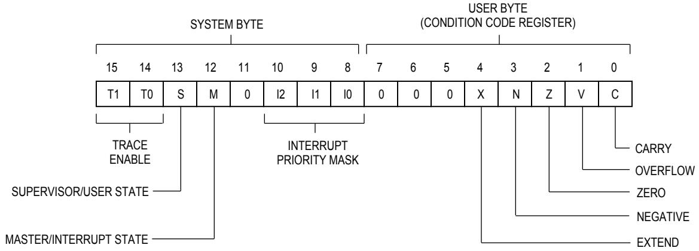

The diagram illustrates the 16-bit Status Register (Condition Code Register) divided into two sections: SYSTEM BYTE (bits 15-8) and USER BYTE (bits 7-0). The SYSTEM BYTE contains bits T1, T0, S, M, 0, I2, I1, and I0. The USER BYTE contains bits 0, 0, 0, X, N, Z, V, and C. Lines connect specific bits to their functions:

- TRACE ENABLE:** T1 and T0.
- SUPERVISOR/USER STATE:** S.
- MASTER/INTERRUPT STATE:** M.
- INTERRUPT PRIORITY MASK:** I2, I1, and I0.
- Flags (User Byte):** X, N, Z, V, and C are mapped to CARRY, OVERFLOW, ZERO, NEGATIVE, and EXTEND respectively.

Diagram of the Status Register (Condition Code Register) showing bit fields and their mapping to system states and flags.

| T1 | T0 | TRACE MODE               |
|----|----|--------------------------|
| 0  | 0  | NO TRACE                 |
| 1  | 0  | TRACE ON ANY INSTRUCTION |
| 0  | 1  | TRACE ON CHANGE OF FLOW  |
| 1  | 1  | UNDEFINED                |

| S | M | ACTIVE STACK |
|---|---|--------------|
| 0 | x | USP          |
| 1 | 0 | ISP          |
| 1 | 1 | MSP          |
|   |   |              |

**Figure 1-8. Status Register**

### 1.3.3 Vector Base Register (VBR)

The VBR contains the base address of the exception vector table in memory. The displacement of an exception vector adds to the value in this register, which accesses the vector table.

### 1.3.4 Alternate Function Code Registers (SFC and DFC)

The alternate function code registers contain 3-bit function codes. Function codes can be considered extensions of the 32-bit logical address that optionally provides as many as eight 4-Gbyte address spaces. The processor automatically generates function codes to select address spaces for data and programs at the user and supervisor modes. Certain instructions use SFC and DFC to specify the function codes for operations.

### 1.3.5 Acu Status Register (MC68EC030 only)

The access control unit status register (ACUSR) is a 16-bit register containing the status information returned by execution of the PTEST instruction. The PTEST instruction searches the access control (AC) registers to determine a match for a specified address. A match in either or both of the AC registers sets bit 6 in the ACUSR. All other bits in the ACUSR are undefined and must not be used.

### 1.3.6 Transparent Translation/access Control Registers

Transparent translation is actually a misnomer since the whole address space transparently translates in an embedded control environment with no on-chip MMU present as well as in processors that have built-in MMUs. For processors that have built-in MMUs, such as the MC68030, MC68040, and MC68LC040, the transparent translation (TT) registers define blocks of logical addresses that are transparently translated to corresponding physical addresses. These registers are independent of the on-chip MMU. For embedded controllers, such as the MC68EC030 and MC68EC040, the access control registers (AC) are similar in function to the TT registers but just named differently. The AC registers, main function are to define blocks of address space that control address space properties such as cachability. The following paragraphs describe these registers.

#### NOTE

For the paged MMU related supervisor registers, please refer to the appropriate user's manual for specific programming detail.

**1.3.6.1 TRANSPARENT TRANSLATION/ACCESS CONTROL REGISTER FIELDS FOR THE M68030.** Figure 1-9 illustrates the MC68030 transparent translation/MC68EC030 access control register format.

| 31           |    |    |    |    |    |    |     |     |   | 24           |  |   |         | 23 |   |  | 16 |  |  |  |
|--------------|----|----|----|----|----|----|-----|-----|---|--------------|--|---|---------|----|---|--|----|--|--|--|
| ADDRESS BASE |    |    |    |    |    |    |     |     |   | ADDRESS MASK |  |   |         |    |   |  |    |  |  |  |
| E            | 0  | 0  | 0  | 0  | 0  | CI | R/W | RWM | 0 | FC BASE      |  | 0 | FC MASK |    |   |  |    |  |  |  |
| 15           | 14 | 13 | 12 | 11 | 10 | 9  | 8   | 7   | 6 | 4            |  | 3 | 2       |    | 0 |  |    |  |  |  |

**Figure 1-9. MC68030 Transparent Translation/MC68EC030 Access Control Register Format**

#### Address Base

This 8-bit field is compared with address bits A31 – A24. Addresses that match in this comparison (and are otherwise eligible) are transparently translated/access controlled.

#### Address Mask

This 8-bit field contains a mask for the address base field. Setting a bit in this field causes the corresponding bit of the address base field to be ignored. Blocks of memory larger than 16 Mbytes can be transparently translated/accessed controlled by setting some logical address mask bits to ones. The low-order bits of this field normally are set to define contiguous blocks larger than 16 Mbytes, although this is not required.

E—Enable

- 0 = Transparent translation/access control disabled
- 1 = Transparent translation/access control enabled

CI—Cache Inhibit

- 0 = Caching allowed
- 1 = Caching inhibited

R/W—Read/Write

- 0 = Only write accesses permitted
- 1 = Only read accesses permitted

R/WM—Read/Write Mask

- 0 = R/W field used
- 1 = R/W field ignored

FC BASE—Function Code Base

This 3-bit field defines the base function code for accesses to be transparently translated with this register. Addresses with function codes that match the FC BASE field (and are otherwise eligible) are transparently translated.

FC MASK—Function Code Mask

This 3-bit field contains a mask for the FC BASE field. Setting a bit in this field causes the corresponding bit of the FC BASE field to be ignored.

**1.3.6.2 TRANSPARENT TRANSLATION/ACCESS CONTROL REGISTER FIELDS FOR THE M68040.** Figure 1-10 illustrates the MC68040 and MC68LC040 transparent translation/ MC68EC040 access control register format.

| 31           |         |    |    |    |    |    |   | 24           |    | 23 |   | 16 |   |   |   |  |  |  |  |
|--------------|---------|----|----|----|----|----|---|--------------|----|----|---|----|---|---|---|--|--|--|--|
| ADDRESS BASE |         |    |    |    |    |    |   | ADDRESS MASK |    |    |   |    |   |   |   |  |  |  |  |
| E            | S FIELD | 0  | 0  | 0  | U1 | U0 |   | 0            | CM | 0  | 0 | W  | 0 | 0 | 0 |  |  |  |  |
| 15           | 14      | 13 | 12 | 11 | 10 | 9  | 8 | 7            | 6  | 5  | 4 | 3  | 2 | 1 | 0 |  |  |  |  |

**Figure 1-10. MC68040 and MC68LC040 Transparent Translation/MC68EC040 Access Control Register Format**

Address Base

This 8-bit field is compared with address bits A31 – A24. Addresses that match in this comparison (and are otherwise eligible) are transparently translated/access controlled.

**Address Mask**

This 8-bit field contains a mask for the address base field. Setting a bit in this field causes the corresponding bit in the address base field to be ignored. Blocks of memory larger than 16 Mbytes can be transparently translated/access controlled by setting some logical address mask bits to ones. The low-order bits of this field normally are set to define contiguous blocks larger than 16 Mbytes, although this not required.

**E—Enable**

This bit enables and disables transparent translation/access control of the block defined by this register.

- 0 = Transparent translation/access control disabled
- 1 = Transparent translation/access control enabled

**S—Supervisor/User Mode**

This field specifies the use of the FC2 in matching an address.

- 00 = Match only if FC2 is 0 (user mode access)
- 01 = Match only if FC2 is 1 (supervisor mode access)
- 1X = Ignore FC2 when matching

**U1, U2—User Page Attributes**

The MC68040, MC68E040, MC68LC040 do not interpret these user-defined bits. If an external bus transfer results from the access, U0 and U1 are echoed to the UPA0 and UPA1 signals, respectively.

**CM—Cache Mode**

This field selects the cache mode and access serialization for a page as follows:

- 00 = Cachable, Writethrough
- 01 = Cachable, Copyback
- 10 = Noncachable, Serialized
- 11 = Noncachable

**W—Write Protect**

This bit indicates if the block is write protected. If set, write and read-modify-write accesses are aborted as if the resident bit in a table descriptor were clear.

- 0 = Read and write accesses permitted
- 1 = Write accesses not permitted

## 1.4 INTEGER DATA FORMATS

The operand data formats supported by the integer unit, as listed in Table 1-3, include those supported by the MC68030 plus a new data format (16-byte block) for the MOVE16 instruction. Integer unit operands can reside in registers, memory, or instructions themselves. The operand size for each instruction is either explicitly encoded in the instruction or implicitly defined by the instruction operation.

**Table 1-3. Integer Data Formats**

| Operand Data Format        | Size        | Notes                                         |
|----------------------------|-------------|-----------------------------------------------|
| Bit                        | 1 Bit       | —                                             |
| Bit Field                  | 1 – 32 Bits | Field of Consecutive Bit                      |
| Binary-Coded Decimal (BCD) | 8 Bits      | Packed: 2 Digits/Byte; Unpacked: 1 Digit/Byte |
| Byte Integer               | 8 Bits      | —                                             |
| Word Integer               | 16 Bits     | —                                             |
| Long-Word Integer          | 32 Bits     | —                                             |
| Quad-Word Integer          | 64 Bits     | Any Two Data Registers                        |
| 16-Byte                    | 128 Bits    | Memory Only, Aligned to 16- Byte Boundary     |

## 1.5 FLOATING-POINT DATA FORMATS

The following paragraphs describe the FPU's operand data formats. The FPU supports seven data formats. There are three signed binary integer formats (byte, word, and long word) that are identical to those supported by the integer unit. The FPU supports the use of the packed decimal real format. The MC68881 and MC68882 support this format in hardware and the processors starting with the MC68040 support it in software. The FPU also supports three binary floating-point formats (single, double, and extended precision) that fully comply with the IEEE 754 standard. All references in this manual to extended-precision format imply the double-extended-precision format defined by the IEEE 754 standard.

### 1.5.1 Packed Decimal Real Format

Figure 1-11 illustrates the packed decimal real format which is three long words consisting of a 3-digit base 10 exponent and a 17-digit base 10 mantissa. The first two long words, digits 15 – 0, are 64 bits and map directly to bit positions 63 – 0 of the extended-precision real format. There are two separate sign bits, one for the exponent, the other for the mantissa. An extra exponent (EXP3) is defined for overflows that can occur when converting from the extended-precision real format to the packed decimal real format.


|          |          |          |          |          |          |         |         |      |          |  |    |
|----------|----------|----------|----------|----------|----------|---------|---------|------|----------|--|----|
| 96       |          |          |          |          |          |         |         |      |          |  | 65 |
| SM       | SE       | YY       | EXP 0    | EXP 1    | EXP 0    | (EXP 3) | XXXX    | XXXX | DIGIT 16 |  |    |
| DIGIT 15 | DIGIT 14 | DIGIT 13 | DIGIT 12 | DIGIT 11 | DIGIT 10 | DIGIT 9 | DIGIT 8 |      |          |  |    |
| DIGIT 7  | DIGIT 6  | DIGIT 5  | DIGIT 4  | DIGIT 3  | DIGIT 2  | DIGIT 1 | DIGIT 0 |      |          |  |    |
| 32       |          |          |          |          |          |         |         |      |          |  | 0  |

Labels: SIGN OF MANTISSA, SIGN OF EXPONENT, USED ONLY FOR ± INFINITY OR NAN, IMPLICIT DECIMAL POINT.

Figure 1-11: Packed Decimal Real Format. A 96-bit wide table showing bit positions 96 to 0. The table is divided into fields: SM, SE, YY, EXP 0, EXP 1, EXP 0, (EXP 3), XXXX, XXXX, DIGIT 16, DIGIT 15, DIGIT 14, DIGIT 13, DIGIT 12, DIGIT 11, DIGIT 10, DIGIT 9, DIGIT 8, DIGIT 7, DIGIT 6, DIGIT 5, DIGIT 4, DIGIT 3, DIGIT 2, DIGIT 1, and DIGIT 0. Labels indicate: SIGN OF MANTISSA (SM), SIGN OF EXPONENT (SE), USED ONLY FOR ± INFINITY OR NAN (YY), and IMPLICIT DECIMAL POINT (between EXP 0 and EXP 1).

NOTE: XXXX indicates “don't care”, which is zero when written and ignored when read.

**Figure 1-11. Packed Decimal Real Format**

## 1.5.2 Binary Floating-Point Formats

Figure 1-12 illustrates the three binary floating-point data formats. The exponent in the three binary floating-point formats is an unsigned binary integer with an implied bias added to it. When subtracting the bias from the exponent's value, the result represents a signed twos complement power of two. This yields the magnitude of a normalized floating-point number when multiplied by the mantissa. A program can execute a CMP instruction that compares floating-point numbers in memory using biased exponents, despite the absolute magnitude of the exponents.


|    |                 |                 |                 |             |               |
|----|-----------------|-----------------|-----------------|-------------|---------------|
| 30 |                 | 22              | 0               | SINGLE REAL |               |
| S  | 8-BIT EXPONENT  | 23-BIT FRACTION |                 |             |               |
| 62 |                 | 51              | 0               | DOUBLE REAL |               |
| S  | 11-BIT EXPONENT | 52-BIT FRACTION |                 |             |               |
| 94 |                 | 80              | 63              | 0           | EXTENDED REAL |
| S  | 15-BIT EXPONENT | ZERO            | 64-BIT MANTISSA |             |               |

Labels: SIGN OF FRACTION, SIGN OF MANTISSA, EXPLICIT INTEGER PART BIT.

Figure 1-12: Binary Floating-Point Data Formats. Three formats are shown: SINGLE REAL (32 bits), DOUBLE REAL (64 bits), and EXTENDED REAL (96 bits). Each format includes a Sign bit (S), an Exponent field, and a Fraction field. Labels indicate: SIGN OF FRACTION, SIGN OF MANTISSA, and EXPLICIT INTEGER PART BIT.

**Figure 1-12. Binary Floating-Point Data Formats**

Data formats for single- and double-precision numbers differ slightly from those for extended-precision numbers in the representation of the mantissa. For all three precisions, a normalized mantissa is always in the range (1.0...2.0). The extended-precision data format represents the entire mantissa, including the explicit integer part bit. Single- and double-precision data formats represent only a fractional portion of the mantissa (the fraction) and always imply the integer part as one.

The IEEE 754 standard has created the term significand to bridge the difference between mantissa and fraction and to avoid the historical implications of the term mantissa. The IEEE 754 standard defines a significand as the component of a binary floating-point number that includes an explicit or implicit leading bit to the left of the implied binary point. However, this manual uses the term mantissa for extended-precision formats and fraction for single- and double- precision formats instead of the IEEE term significand.

#### NOTE

This section specifies ranges using traditional set notation with the format "bound...bound" specifying the boundaries of the range. The bracket types enclosing the range define whether the endpoint is inclusive or exclusive. A square bracket indicates inclusive, and a parenthesis indicates exclusive. For example, the range specification "[1.0...2.0]" defines the range of numbers greater than or equal to 1.0 and less than or equal to 2.0. The range specification "(0.0... + inf)" defines the range of numbers greater than 0.0 and less than positive infinity, but not equal to.

## 1.6 FLOATING-POINT DATA TYPES

Each floating-point data format supports five, unique, floating-point data types: 1) normalized numbers, 2) denormalized numbers, 3) zeros, 4) infinities, and 5) NaNs. Exponent values in each format represent these special data types. The normalized data type never uses the maximum or minimum exponent value for a given format, except the extended-precision format. The packed decimal real data format does not support denormalized numbers.

There is a subtle difference between the definition of an extended- precision number with an exponent equal to zero and a single- or double-precision number with an exponent equal to zero. The zero exponent of a single- or double-precision number denormalizes the number's definition, and the implied integer bit is zero. An extended- precision number with an exponent of zero may have an explicit integer bit equal to one. This results in a normalized number, though the exponent is equal to the minimum value. For simplicity, the following discussion treats all three floating-point formats in the same manner, where an exponent value of zero identifies a denormalized number. However, remember the extended-precision format can deviate from this rule.

## 1.6.1 Normalized Numbers

Normalized numbers encompass all numbers with exponents laying between the maximum and minimum values. Normalized numbers can be positive or negative. For normalized numbers in single and double precision the implied integer bit is one. In extended precision, the mantissa's MSB, the explicit integer bit, can only be a one (see Figure 1-13); and the exponent can be zero.

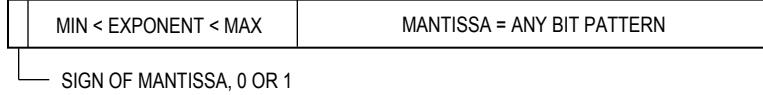

|                          |                            |
|--------------------------|----------------------------|
| MIN < EXPONENT < MAX     | MANTISSA = ANY BIT PATTERN |
| SIGN OF MANTISSA, 0 OR 1 |                            |

**Figure 1-13. Normalized Number Format**

## 1.6.2 Denormalized Numbers

Denormalized numbers represent real values near the underflow threshold. The detection of the underflow for a given data format and operation occurs when the result's exponent is less than or equal to the minimum exponent value. Denormalized numbers can be positive or negative. For denormalized numbers in single and double precision the implied integer bit is a zero. In extended precision, the mantissa's MSB, the explicit integer bit, can only be a zero (see Figure 1-14).

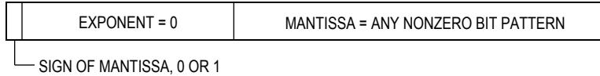

|                          |                                    |
|--------------------------|------------------------------------|
| EXPONENT = 0             | MANTISSA = ANY NONZERO BIT PATTERN |
| SIGN OF MANTISSA, 0 OR 1 |                                    |

**Figure 1-14. Denormalized Number Format**

Traditionally, the detection of underflow causes floating-point number systems to perform a "flush-to-zero". This leaves a large gap in the number line between the smallest magnitude normalized number and zero. The IEEE 754 standard implements gradual underflows: the result mantissa is shifted right (denormalized) while the result exponent is incremented until reaching the minimum value. If all the mantissa bits of the result are shifted off to the right during this denormalization, the result becomes zero. Usually a gradual underflow limits the potential underflow damage to no more than a round-off error. This underflow and denormalization description ignores the effects of rounding and the user-selectable rounding modes. Thus, the large gap in the number line created by "flush-to-zero" number systems is filled with representable (denormalized) numbers in the IEEE "gradual underflow" floating-point number system.

Since the extended-precision data format has an explicit integer bit, a number can be formatted with a nonzero exponent, less than the maximum value, and a zero integer bit. The IEEE 754 standard does not define a zero integer bit. Such a number is an unnormalized number. Hardware does not directly support denormalized and unnormalized numbers, but implicitly supports them by trapping them as unimplemented data types, allowing efficient conversion in software.

### 1.6.3 Zeros

Zeros can be positive or negative and represent the real values + 0.0 and – 0.0 (see Figure 1-15).

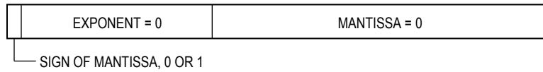

|               |              |
|---------------|--------------|
| EXPOONENT = 0 | MANTISSA = 0 |
|---------------|--------------|

SIGN OF MANTISSA, 0 OR 1

**Figure 1-15. Zero Format**

### 1.6.4 Infinities

Infinities can be positive or negative and represent real values that exceed the overflow threshold. A result's exponent greater than or equal to the maximum exponent value indicates the overflow for a given data format and operation. This overflow description ignores the effects of rounding and the user-selectable rounding models. For single- and double-precision infinities the fraction is a zero. For extended-precision infinities, the mantissa's MSB, the explicit integer bit, can be either one or zero (see Figure 1-16).

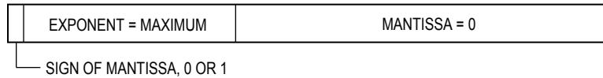

|                     |              |
|---------------------|--------------|
| EXPOONENT = MAXIMUM | MANTISSA = 0 |
|---------------------|--------------|

SIGN OF MANTISSA, 0 OR 1

**Figure 1-16. Infinity Format**

### 1.6.5 Not-A-Numbers

When created by the FPU, NANs represent the results of operations having no mathematical interpretation, such as infinity divided by infinity. All operations involving a NAN operand as an input return a NAN result. When created by the user, NANs can protect against uninitialized variables and arrays or represent user-defined data types. For extended-precision NANs, the mantissa's MSB, the explicit integer bit, can be either one or zero (see Figure 1-17).

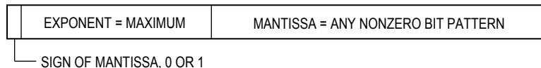

|                     |                                    |
|---------------------|------------------------------------|
| EXPOONENT = MAXIMUM | MANTISSA = ANY NONZERO BIT PATTERN |
|---------------------|------------------------------------|

SIGN OF MANTISSA, 0 OR 1

**Figure 1-17. Not-A-Number Format**

The FPU implements two different types of NANs identified by the value of the MSB of the mantissa for single- and double-precision, and the MSB of the mantissa minus one for extended-precision. If the bit is set, it is a nonsignaling NAN, otherwise, it is an SNAN. An

SNAN can be used as an escape mechanism for a user-defined, non-IEEE data type. The FPU never creates an SNAN resulting from an operation.

The IEEE specification defines NAN processing used as an input to an operation. A nonsignaling NAN must be returned when using an SNAN as an input and there is a disabled SNAN trap. The FPU does this by using the source SNAN, setting the MSB of the mantissa, and storing the resulting nonsignaling NAN in the destination. Because of the IEEE formats for NANs, the result of setting an SNAN MSB is always a nonsignaling NAN.

When the FPU creates a NAN, the NAN always contains the same bit pattern in the mantissa. All bits of the mantissa are ones for any precision. When the user creates a NAN, any nonzero bit pattern can be stored in the mantissa.

### 1.6.6 Data Format and Type Summary

Tables 1-4 through 1-6 summarize the data type specifications for single-, double-, and extended-precision data formats. Packed decimal real formats support all data types except denormalized numbers. Table 1-7 summarizes the data types for the packed decimal real format.

**Table 1-4. Single-Precision Real Format Summary Data Format**

| Data Format                                |                                                                  |
|--------------------------------------------|------------------------------------------------------------------|
| 31 30                                      | 23 22 0                                                          |
| s                                          | e f                                                              |
| Field Size In Bits                         |                                                                  |
| Sign (s)                                   | 1                                                                |
| Biased Exponent (e)                        | 8                                                                |
| Fraction (f)                               | 23                                                               |
| Total                                      | 32                                                               |
| Interpretation of Sign                     |                                                                  |
| Positive Fraction                          | s = 0                                                            |
| Negative Fraction                          | s = 1                                                            |
| Normalized Numbers                         |                                                                  |
| Bias of Biased Exponent                    | +127 (\$7F)                                                      |
| Range of Biased Exponent                   | 0 < e < 255 (\$FF)                                               |
| Range of Fraction                          | Zero or Nonzero                                                  |
| Fraction                                   | 1.f                                                              |
| Relation to Representation of Real Numbers | $(-1)^s \times 2^{e-127} \times 1.f$                             |
| Denormalized Numbers                       |                                                                  |
| Biased Exponent Format Minimum             | 0 (\$00)                                                         |
| Bias of Biased Exponent                    | +126 (\$7E)                                                      |
| Range of Fraction                          | Nonzero                                                          |
| Fraction                                   | 0.f                                                              |
| Relation to Representation of Real Numbers | $(-1)^s \times 2^{-126} \times 0.f$                              |
| Signed Zeros                               |                                                                  |
| Biased Exponent Format Minimum             | 0 (\$00)                                                         |
| Fraction                                   | 0.f = 0.0                                                        |
| Signed Infinities                          |                                                                  |
| Biased Exponent Format Maximum             | 255 (\$FF)                                                       |
| Fraction                                   | 0.f = 0.0                                                        |
| NANs                                       |                                                                  |
| Sign                                       | Don't Care                                                       |
| Biased Exponent Format Maximum             | 255 (\$FF)                                                       |
| Fraction                                   | Nonzero                                                          |
| Representation of Fraction                 | 0.1xxxx...xxxx<br>0.0xxxx...xxxx<br>xxxxx...xxxx<br>11111...1111 |
| Nonsignaling                               |                                                                  |
| Signaling                                  |                                                                  |
| Nonzero Bit Pattern Created by User        |                                                                  |
| Fraction When Created by FPCP              |                                                                  |
| Approximate Ranges                         |                                                                  |
| Maximum Positive Normalized                | $3.4 \times 10^{38}$                                             |
| Minimum Positive Normalized                | $1.2 \times 10^{-38}$                                            |
| Minimum Positive Denormalized              | $1.4 \times 10^{-45}$                                            |

**Table 1-5. Double-Precision Real Format Summary**

| <b>Data Format</b>                         |                                                                                                                                                                   |
|--------------------------------------------|-------------------------------------------------------------------------------------------------------------------------------------------------------------------|
| 63 62                                      | 52 51 0                                                                                                                                                           |
| s                                          | e f                                                                                                                                                               |
| <b>Field Size (in Bits)</b>                |                                                                                                                                                                   |
| Sign (s)                                   | 1                                                                                                                                                                 |
| Biased Exponent (e)                        | 11                                                                                                                                                                |
| Fraction (f)                               | 52                                                                                                                                                                |
| Total                                      | 64                                                                                                                                                                |
| <b>Interpretation of Sign</b>              |                                                                                                                                                                   |
| Positive Fraction                          | s = 0                                                                                                                                                             |
| Negative Fraction                          | s = 1                                                                                                                                                             |
| <b>Normalized Numbers</b>                  |                                                                                                                                                                   |
| Bias of Biased Exponent                    | +1023 (\$3FF)                                                                                                                                                     |
| Range of Biased Exponent                   | 0 < e < 2047 (\$7FF)                                                                                                                                              |
| Range of Fraction                          | Zero or Nonzero                                                                                                                                                   |
| Fraction                                   | 1.f                                                                                                                                                               |
| Relation to Representation of Real Numbers | $(-1)^s \times 2^{e-1023} \times 1.f$                                                                                                                             |
| <b>Denormalized Numbers</b>                |                                                                                                                                                                   |
| Biased Exponent Format Minimum             | 0 (\$000)                                                                                                                                                         |
| Bias of Biased Exponent                    | +1022 (\$3FE)                                                                                                                                                     |
| Range of Fraction                          | Nonzero                                                                                                                                                           |
| Fraction                                   | 0.f                                                                                                                                                               |
| Relation to Representation of Real Numbers | $(-1)^s \times 2^{-1022} \times 0.f$                                                                                                                              |
| <b>Signed Zeros</b>                        |                                                                                                                                                                   |
| Biased Exponent Format Minimum             | 0 (\$00)                                                                                                                                                          |
| Fraction (Mantissa/Significand)            | 0.f = 0.0                                                                                                                                                         |
| <b>Signed Infinities</b>                   |                                                                                                                                                                   |
| Biased Exponent Format Maximum             | 2047 (\$7FF)                                                                                                                                                      |
| Fraction                                   | 0.f = 0.0                                                                                                                                                         |
| <b>NANs</b>                                |                                                                                                                                                                   |
| Sign                                       | 0 or 1                                                                                                                                                            |
| Biased Exponent Format Maximum             | 255 (\$7FF)                                                                                                                                                       |
| Fraction                                   | Nonzero                                                                                                                                                           |
| Representation of Fraction                 | Nonsignaling<br>Signaling<br>Nonzero Bit Pattern Created by User<br>Fraction When Created by FPCP<br>1xxxx...xxxx<br>0xxxx...xxxx<br>xxxxx...xxxx<br>11111...1111 |
| <b>Approximate Ranges</b>                  |                                                                                                                                                                   |
| Maximum Positive Normalized                | $18 \times 10^{308}$                                                                                                                                              |
| Minimum Positive Normalized                | $2.2 \times 10^{-308}$                                                                                                                                            |
| Minimum Positive Denormalized              | $4.9 \times 10^{-324}$                                                                                                                                            |

**Table 1-6. Extended-Precision Real Format Summary**

| <b>Data Format</b>                            |                                        |
|-----------------------------------------------|----------------------------------------|
| 95 94                                         | 80 79                                  |
| 64 63 62                                      | 0                                      |
| s                                             | e                                      |
|                                               | z                                      |
|                                               | i                                      |
|                                               | f                                      |
| <b>Field Size (in Bits)</b>                   |                                        |
| Sign (s)                                      | 1                                      |
| Biased Exponent (e)                           | 15                                     |
| Zero, Reserved (u)                            | 16                                     |
| Explicit Integer Bit (j)                      | 1                                      |
| Mantissa (f)                                  | 63                                     |
| Total                                         | 96                                     |
| <b>Interpretation of Unused Bits</b>          |                                        |
| Input                                         | Don't Care                             |
| Output                                        | All Zeros                              |
| <b>Interpretation of Sign</b>                 |                                        |
| Positive Mantissa                             | $s = 0$                                |
| Negative Mantissa                             | $s = 1$                                |
| <b>Normalized Numbers</b>                     |                                        |
| Bias of Biased Exponent                       | +16383 (\$3FFF)                        |
| Range of Biased Exponent                      | $0 \le e < 32767$ (\$7FFF)             |
| Explicit Integer Bit                          | 1                                      |
| Range of Mantissa                             | Zero or Nonzero                        |
| Mantissa (Explicit Integer Bit and Fraction ) | 1.f                                    |
| Relation to Representation of Real Numbers    | $(-1)^s \times 2^{e-16383} \times 1.f$ |
| <b>Denormalized Numbers</b>                   |                                        |
| Biased Exponent Format Minimum                | 0 (\$0000)                             |
| Bias of Biased Exponent                       | +16383 (\$3FFF)                        |
| Explicit Integer Bit                          | 0                                      |
| Range of Mantissa                             | Nonzero                                |
| Mantissa (Explicit Integer Bit and Fraction ) | 0.f                                    |
| Relation to Representation of Real Numbers    | $(-1)^s \times 2^{-16383} \times 0.f$  |
| <b>Signed Zeros</b>                           |                                        |
| Biased Exponent Format Minimum                | 0 (\$0000)                             |
| Mantissa (Explicit Integer Bit and Fraction ) | 0.0                                    |
| <b>Signed Infinities</b>                      |                                        |
| Biased Exponent Format Maximum                | 32767 (\$7FFF)                         |
| Explicit Integer Bit                          | Don't Care                             |
| Mantissa (Explicit Integer Bit and Fraction ) | x.000...0000                           |

**Table 1-6. Extended-Precision Real Format Summary (Continued)**

| NANS                           |                                                                                                                                                                           |
|--------------------------------|---------------------------------------------------------------------------------------------------------------------------------------------------------------------------|
| Sign                           | Don't Care                                                                                                                                                                |
| Explicit Integer Bit           | Don't Care                                                                                                                                                                |
| Biased Exponent Format Maximum | 32767 (\$7FFF)                                                                                                                                                            |
| Mantissa                       | Nonzero                                                                                                                                                                   |
| Representation of Fraction     | Nonsignaling<br>x.1xxxx...xxxx<br>Signaling<br>x.0xxxx...xxxx<br>Nonzero Bit Pattern Created by User<br>x.xxxxx...xxxx<br>Fraction When Created by FPCP<br>1.11111...1111 |
| Approximate Ranges             |                                                                                                                                                                           |
| Maximum Positive Normalized    | $1.2 \times 10^{4932}$                                                                                                                                                    |
| Minimum Positive Normalized    | $1.7 \times 10^{-4932}$                                                                                                                                                   |
| Minimum Positive Denormalized  | $3.7 \times 10^{4951}$                                                                                                                                                    |

**Table 1-7. Packed Decimal Real Format Summary**

| Data Type | SM  | SE  | Y | Y | 3-Digit Exponent | 1-Digit Integer | 16-Digit Fraction   |
|-----------|-----|-----|---|---|------------------|-----------------|---------------------|
| ±Infinity | 0/1 | 1   | 1 | 1 | \$FFF            | \$XXXX          | \$00...00           |
| ±NAN      | 0/1 | 1   | 1 | 1 | \$FFF            | \$XXXX          | Nonzero             |
| ±SNAN     | 0/1 | 1   | 1 | 1 | \$FFF            | \$XXXX          | Nonzero             |
| +Zero     | 0   | 0/1 | X | X | \$000-\$999      | \$XXX0          | \$00...00           |
| -Zero     | 1   | 0/1 | X | X | \$000-\$999      | \$XXX0          | \$00...00           |
| +In-Range | 0   | 0/1 | X | X | \$000-\$999      | \$XXX0-\$XXX9   | \$00...01-\$99...99 |
| -In-Range | 1   | 0/1 | X | X | \$000-\$999      | \$XXX0-\$XXX9   | \$00...01-\$99...99 |

A packed decimal real data format with the SE and both Y bits set, an exponent of \$FFF, and a nonzero 16-bit decimal fraction is a NAN. When the FPU uses this format, the fraction of the NAN is moved bit-by-bit into the extended-precision mantissa of a floating-point data register. The exponent of the register is set to signify a NAN, and no conversion occurs. The MSB of the most significant digit in the decimal fraction (the MSB of digit 15) is a don't care, as in extended-precision NANs, and the MSB of minus one of digit 15 is the SNAN bit. If the NAN bit is a zero, then it is an SNAN.

If a non-decimal digit (\$A – \$F) appears in the exponent of a zero, the number is a true zero. The FPU does not detect non-decimal digits in the exponent, integer, or fraction digits of an in-range packed decimal real data format. These non-decimal digits are converted to binary in the same manner as decimal digits; however, the result is probably useless although it is repeatable. Since an in-range number cannot overflow or underflow when converted to extended precision, conversion from the packed decimal real data format always produces normalized extended-precision numbers.

## 1.7 ORGANIZATION OF DATA IN REGISTERS

The following paragraphs describe data organization within the data, address, and control registers.

### 1.7.1 Organization of Integer Data Formats in Registers

Each integer data register is 32 bits wide. Byte and word operands occupy the lower 8- and 16-bit portions of integer data registers, respectively. Long-word operands occupy the entire 32 bits of integer data registers. A data register that is either a source or destination operand only uses or changes the appropriate lower 8 or 16 bits (in byte or word operations, respectively). The remaining high-order portion does not change and goes unused. The address of the least significant bit (LSB) of a long-word integer is zero, and the MSB is 31. For bit fields, the address of the MSB is zero, and the LSB is the width of the register minus one (the offset). If the width of the register plus the offset is greater than 32, the bit field wraps around within the register. Figure 1-18 illustrates the organization of various data formats in the data registers.

An example of a quad word is the product of a 32-bit multiply or the quotient of a 32-bit divide operation (signed and unsigned). Quad words may be organized in any two integer data registers without restrictions on order or pairing. There are no explicit instructions for the management of this data format, although the MOVEM instruction can be used to move a quad word into or out of registers.

Binary-coded decimal (BCD) data represents decimal numbers in binary form. Although there are many BCD codes, the BCD instructions of the M68000 family support two formats, packed and unpacked. In these formats, the LSBs consist of a binary number having the numeric value of the corresponding decimal number. In the unpacked BCD format, a byte defines one decimal number that has four LSBs containing the binary value and four undefined MSBs. Each byte of the packed BCD format contains two decimal numbers; the least significant four bits contain the least significant decimal number and the most significant four bits contain the most significant decimal number.

![Figure 1-18: Organization of Integer Data Formats in Data Registers. This diagram shows the bit organization of a 32-bit register for various data formats. The register is divided into several fields: a 2-bit field (31-30) for a bit modulo operation; a 1-bit field (31) for 'NOT USED'; a 16-bit field (31-16) for a 'LOW-ORDER WORD'; a 32-bit field (31-0) for a 'LONG WORD'; a 64-bit field (63-32) for a 'QUAD WORD' (ANY DX and ANY DY); a 32-bit field (31-0) for a 'BIT FIELD' (OFFSET and WIDTH*); and two 16-bit fields (31-16 and 15-0) for 'UNPACKED BCD' and 'PACKED BCD' respectively.](M68000PRM.images/145d00f59802048185303f15937ea65c_img.jpg)

31 30 1 0  
MSB | | | LSB BIT (0 ≤ MODULO (OFFSET) < 31, OFFSET OF 0 = MSB)

31 7 0  
NOT USED MSB | | LSB BYTE

31 15 0  
NOT USED MSB | LOW-ORDER WORD LSB 16-BIT WORD

31 0  
MSB | LONG WORD LSB LONG WORD

63 32  
MSB | ANY DX QUAD WORD

31 0  
ANY DY LSB

31 0  
OFFSET WIDTH\* BIT FIELD (0 < OFFSET < 32, 0 < WIDTH ≤ 32)

31 8 7 4 3 0  
UNDEFINED LEAST SIGNIFICANT DIGIT UNPACKED BCD

31 8 7 4 3 0  
MOST SIGNIFICANT DIGIT LEAST SIGNIFICANT DIGIT PACKED BCD

Figure 1-18: Organization of Integer Data Formats in Data Registers. This diagram shows the bit organization of a 32-bit register for various data formats. The register is divided into several fields: a 2-bit field (31-30) for a bit modulo operation; a 1-bit field (31) for 'NOT USED'; a 16-bit field (31-16) for a 'LOW-ORDER WORD'; a 32-bit field (31-0) for a 'LONG WORD'; a 64-bit field (63-32) for a 'QUAD WORD' (ANY DX and ANY DY); a 32-bit field (31-0) for a 'BIT FIELD' (OFFSET and WIDTH\*); and two 16-bit fields (31-16 and 15-0) for 'UNPACKED BCD' and 'PACKED BCD' respectively.

\* IF WIDTH + OFFSET > 32, BIT FIELD WRAPS AROUND WITHIN THE REGISTER.

**Figure 1-18. Organization of Integer Data Formats in Data Registers**

Because address registers and stack pointers are 32 bits wide, address registers cannot be used for byte-size operands. When an address register is a source operand, either the low-order word or the entire long-word operand is used, depending upon the operation size. When an address register is the destination operand, the entire register becomes affected, despite the operation size. If the source operand is a word size, it is sign-extended to 32 bits and then used in the operation to an address register destination. Address registers are primarily for addresses and address computation support. The instruction set includes instructions that add to, compare, and move the contents of address registers. Figure 1-19 illustrates the organization of addresses in address registers.


31 16 15 0  
SIGN-EXTENDED 16-BIT ADDRESS OPERAND

31 0  
FULL 32-BIT ADDRESS OPERAND

Figure 1-19: Organization of Integer Data Formats in Address Registers. This diagram shows the bit organization of a 32-bit register for address formats. The register is divided into a 16-bit 'SIGN-EXTENDED' field (31-16) and a 16-bit '16-BIT ADDRESS OPERAND' field (15-0). Below this, a separate 32-bit field (31-0) is labeled 'FULL 32-BIT ADDRESS OPERAND'.

**Figure 1-19. Organization of Integer Data Formats in Address Registers**

Control registers vary in size according to function. Some control registers have undefined bits reserved for future definition by Motorola. Those particular bits read as zeros and must be written as zeros for future compatibility.

All operations to the SR and CCR are word-size operations. For all CCR operations, the upper byte is read as all zeros and is ignored when written, despite privilege mode. The alternate function code registers, supervisor function code (SFC) and data function code (DFC), are 32-bit registers with only bits 0P2 implemented. These bits contain the address space values for the read or write operands of MOVES, PFLUSH, and PTEST instructions. Values transfer to and from the SFC and DFC by using the MOVEC instruction. These are long-word transfers; the upper 29 bits are read as zeros and are ignored when written.

### 1.7.2 Organization of Integer Data Formats in Memory

The byte-addressable organization of memory allows lower addresses to correspond to higher order bytes. The address N of a long-word data item corresponds to the address of the highest order wordUs MSB. The lower order word is located at address N + 2, leaving the LSB at address N + 3 (see Figure 1-20). Organization of data formats in memory is consistent with the M68000 family data organization. The lowest address (nearest \$00000000) is the location of the MSB, with each successive LSB located at the next address (N + 1, N + 2, etc.). The highest address (nearest \$FFFFFFF) is the location of the LSB.

![Diagram illustrating Memory Operand Addressing for the M68000 family. The diagram shows a vertical stack of memory locations. At the top, a LONG WORD at address $00000000 is shown, containing two WORDs ($00000000 and $00000002) and four BYTES ($00000000 through $00000003). Below this is a LONG WORD at address $00000004, containing two WORDs ($00000004 and $00000006) and four BYTES ($00000004 through $00000007). A series of dots indicates intermediate memory locations. At the bottom, a LONG WORD at address $FFFFFFFC is shown, containing two WORDs ($FFFFFFFC and $FFFFFFFE) and four BYTES ($FFFFFFFC through $FFFFFFFF). The bit positions 31, 23, 15, 7, and 0 are marked along the top edge of the diagram.](M68000PRM.images/5d782eeb9d1e5871d7f09e0ccdd4cdf1_img.jpg)

Diagram illustrating Memory Operand Addressing for the M68000 family. The diagram shows a vertical stack of memory locations. At the top, a LONG WORD at address \$00000000 is shown, containing two WORDs (\$00000000 and \$00000002) and four BYTES (\$00000000 through \$00000003). Below this is a LONG WORD at address \$00000004, containing two WORDs (\$00000004 and \$00000006) and four BYTES (\$00000004 through \$00000007). A series of dots indicates intermediate memory locations. At the bottom, a LONG WORD at address \$FFFFFFFC is shown, containing two WORDs (\$FFFFFFFC and \$FFFFFFFE) and four BYTES (\$FFFFFFFC through \$FFFFFFFF). The bit positions 31, 23, 15, 7, and 0 are marked along the top edge of the diagram.

**Figure 1-20. Memory Operand Addressing**

Figure 1-21 illustrates the organization of IU data formats in memory. A base address that selects one byte in memory, the base byte, specifies a bit number that selects one bit, the bit operand, in the base byte. The MSB of the byte is seven.

The following conditions specify a bit field operand:

1. A base address that selects one byte in memory.
2. A bit field offset that shows the leftmost (base) bit of the bit field in relation to the MSB of the base byte.
3. A bit field width that determines how many bits to the right of the base bit are in the bit field.

The MSB of the base byte is bit field offset 0; the LSB of the base byte is bit field offset 7; and the LSB of the previous byte in memory is bit field offset -1. Bit field offsets may have values between  $2^{-31}$  to  $2^{31} - 1$ , and bit field widths may range from 1 to 32 bits.

A 16-byte block operand, supported by the MOVE16 instruction, has a block of 16 bytes, aligned to a 16-byte boundary. An address that can point to any byte in the block specifies this operand.

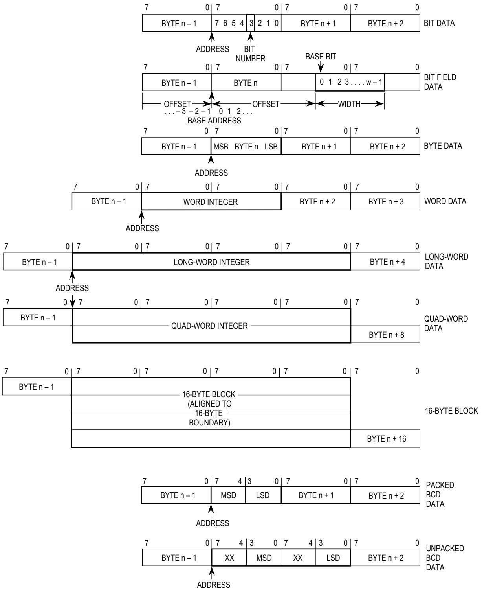

The diagram illustrates the memory organization for integer operands, showing how different data types are aligned to byte boundaries. Each row represents a memory word, with bits 7 down to 0 from left to right. The address of the word is indicated by an arrow pointing to the leftmost bit (bit 7).

- BIT DATA:** A 3-bit field within a word. The address points to the start of the field (bit 7 of BYTE n-1). The bit number is indicated as 7, 6, 5, 4, 3, 2, 1, 0. A base bit is also shown.
- BIT FIELD DATA:** A field of width  $w$  bits. The address points to the start of the field (bit 7 of BYTE n-1). The offset from the base address is indicated as  $\dots-3-2-1$  and the width is  $w$ .
- BYTE DATA:** A single byte. The address points to the start of the byte (bit 7 of BYTE n-1). The byte is divided into MSB and LSB.
- WORD DATA:** Two bytes. The address points to the start of the word (bit 7 of BYTE n-1).
- LONG-WORD DATA:** Four bytes. The address points to the start of the long-word (bit 7 of BYTE n-1).
- QUAD-WORD DATA:** Eight bytes. The address points to the start of the quad-word (bit 7 of BYTE n-1).
- 16-BYTE BLOCK:** Sixteen bytes. The address points to the start of the block (bit 7 of BYTE n-1). The block is aligned to a 16-byte boundary.
- PACKED BCD DATA:** Three bytes. The address points to the start of the data (bit 7 of BYTE n-1). The bytes are labeled MSD, LSD, and BYTE n+2.
- UNPACKED BCD DATA:** Four bytes. The address points to the start of the data (bit 7 of BYTE n-1). The bytes are labeled XX, MSD, XX, LSD, and BYTE n+2.

Diagram illustrating Memory Organization for Integer Operands, showing various data structures and their byte alignment.

**Figure 1-21. Memory Organization for Integer Operands**

### 1.7.3 Organization of Fpu Data Formats in Registers and Memory

The eight, 80-bit floating-point data registers are analogous to the integer data registers and are completely general purpose (i.e., any instruction may use any register). The MC68040 supports only some data formats and types in hardware. Table 1-8 lists the data formats supported by the MC68040.

**Table 1-8. MC68040 FPU Data Formats and Data Types**

| Number Types | Data Formats          |                       |                         |                     |              |              |                   |
|--------------|-----------------------|-----------------------|-------------------------|---------------------|--------------|--------------|-------------------|
|              | Single-Precision Real | Double-Precision Real | Extended-Precision Real | Packed-Decimal Real | Byte Integer | Word Integer | Long-Word Integer |
| Normalized   | *                     | *                     | *                       | †                   | *            | *            | *                 |
| Zero         | *                     | *                     | *                       | †                   | *            | *            | *                 |
| Infinity     | *                     | *                     | *                       | †                   |              |              |                   |
| NAN          | *                     | *                     | *                       | †                   |              |              |                   |
| Denormalized | †                     | †                     | †                       | †                   |              |              |                   |
| Unnormalized |                       |                       | †                       | †                   |              |              |                   |

NOTES:

\* = Data Format/Type Supported by On-Chip MC68040 FPU Hardware

† = Data Format/Type Supported by Software (MC68040FPSP)

Figure 1-22 illustrates the floating-point data format for the single-, double-, and extended-precision binary real data organization in memory.


The diagram illustrates the organization of FPU Data Formats in Memory. It shows three horizontal memory blocks representing different data formats, each divided into bytes and sub-segments:

- SINGLE-PRECISION REAL:** Occupies 4 bytes (BYTEEn-1 to BYTEEn+4). Each byte is divided into segments labeled 7 and 0|7.
- DOUBLE-PRECISION REAL:** Occupies 8 bytes (BYTEEn-1 to BYTEEn+8). Each byte is divided into segments labeled 7 and 0|7.
- EXTENDED-PRECISION REAL:** Occupies 12 bytes (BYTEEn-1 to BYTEEn+12). Each byte is divided into segments labeled 7 and 0|7.

An 'ADDRESS' arrow points to the start of each format block, indicating the starting memory location.

Diagram illustrating the organization of FPU Data Formats in Memory. It shows three horizontal memory blocks representing SINGLE-PRECISION REAL, DOUBLE-PRECISION REAL, and EXTENDED-PRECISION REAL formats. Each block is divided into bytes labeled BYTEEn-1, BYTEEn+4, BYTEEn+8, and BYTEEn+12. The bytes are further divided into 8-bit segments labeled 7 0|7. An 'ADDRESS' arrow points to the start of each format block.

**Figure 1-22. Organization of FPU Data Formats in Memory**

## SECTION 2

# ADDRESSING CAPABILITIES

Most operations take a source operand and destination operand, compute them, and store the result in the destination location. Single-operand operations take a destination operand, compute it, and store the result in the destination location. External microprocessor references to memory are either program references that refer to program space or data references that refer to data space. They access either instruction words or operands (data items) for an instruction. Program space is the section of memory that contains the program instructions and any immediate data operands residing in the instruction stream. Data space is the section of memory that contains the program data. Data items in the instruction stream can be accessed with the program counter relative addressing modes; these accesses classify as program references.

### 2.1 INSTRUCTION FORMAT

M68000 family instructions consist of at least one word; some have as many as 11 words. Figure 2-1 illustrates the general composition of an instruction. The first word of the instruction, called the simple effective address operation word, specifies the length of the instruction, the effective addressing mode, and the operation to be performed. The remaining words, called brief and full extension words, further specify the instruction and operands. These words can be floating-point command words, conditional predicates, immediate operands, extensions to the effective addressing mode specified in the simple effective address operation word, branch displacements, bit number or bit field specifications, special register specifications, trap operands, pack/unpack constants, or argument counts.

![Figure 2-1. Instruction Word General Format. A diagram showing the general format of an instruction word. It is a vertical rectangle divided into four horizontal sections. The top section is labeled 'SINGLE EFFECTIVE ADDRESS OPERATION WORD (ONE WORD, SPECIFIES OPERATION AND MODES)'. The second section is labeled 'SPECIAL OPERAND SPECIFIERS (IF ANY, ONE OR TWO WORDS)'. The third section is labeled 'IMMEDIATE OPERAND OR SOURCE EFFECTIVE ADDRESS EXTENSION (IF ANY, ONE TO SIX WORDS)'. The bottom section is labeled 'DESTINATION EFFECTIVE ADDRESS EXTENSION (IF ANY, ONE TO SIX WORDS)'. The top right corner of the rectangle is labeled '0' and the bottom left corner is labeled '15'.](M68000PRM.images/e05122559f56af5699789b7118d8fe87_img.jpg)

|                                                                                       |   |
|---------------------------------------------------------------------------------------|---|
| 15                                                                                    | 0 |
| SINGLE EFFECTIVE ADDRESS OPERATION WORD<br>(ONE WORD, SPECIFIES OPERATION AND MODES)  |   |
| SPECIAL OPERAND SPECIFIERS<br>(IF ANY, ONE OR TWO WORDS)                              |   |
| IMMEDIATE OPERAND OR SOURCE EFFECTIVE ADDRESS EXTENSION<br>(IF ANY, ONE TO SIX WORDS) |   |
| DESTINATION EFFECTIVE ADDRESS EXTENSION<br>(IF ANY, ONE TO SIX WORDS)                 |   |

Figure 2-1. Instruction Word General Format. A diagram showing the general format of an instruction word. It is a vertical rectangle divided into four horizontal sections. The top section is labeled 'SINGLE EFFECTIVE ADDRESS OPERATION WORD (ONE WORD, SPECIFIES OPERATION AND MODES)'. The second section is labeled 'SPECIAL OPERAND SPECIFIERS (IF ANY, ONE OR TWO WORDS)'. The third section is labeled 'IMMEDIATE OPERAND OR SOURCE EFFECTIVE ADDRESS EXTENSION (IF ANY, ONE TO SIX WORDS)'. The bottom section is labeled 'DESTINATION EFFECTIVE ADDRESS EXTENSION (IF ANY, ONE TO SIX WORDS)'. The top right corner of the rectangle is labeled '0' and the bottom left corner is labeled '15'.

**Figure 2-1. Instruction Word General Format**

An instruction specifies the function to be performed with an operation code and defines the location of every operand. Instructions specify an operand location by register specification, the instruction's register field holds the register's number; by effective address, the instruction's effective address field contains addressing mode information; or by implicit reference, the definition of the instruction implies the use of specific registers.

The single effective address operation word format is the basic instruction word (see Figure 2-2). The encoding of the mode field selects the addressing mode. The register field contains the general register number or a value that selects the addressing mode when the mode field contains opcode 111. Some indexed or indirect addressing modes use a combination of the simple effective address operation word followed by a brief extension word. Other indexed or indirect addressing modes consist of the simple effective address operation word and a full extension word. The longest instruction is a MOVE instruction with a full extension word for both the source and destination effective addresses and eight other extension words. It also contains 32-bit base displacements and 32-bit outer displacements for both source and destination addresses. Figure 2-2 illustrates the three formats used in an instruction word; Table 2-1 lists the field definitions for these three formats.

SINGLE EFFECTIVE ADDRESS OPERATION WORD FORMAT

| 15 | 14 | 13 | 12 | 11 | 10 | 9 | 8 | 7 | 6 | 5 | 4                          | 3 | 2        | 1 | 0 |
|----|----|----|----|----|----|---|---|---|---|---|----------------------------|---|----------|---|---|
| X  | X  | X  | X  | X  | X  | X | X | X | X |   | EFFEC-TIVE ADDRESS<br>MODE |   | REGISTER |   |   |

BRIEF EXTENSION WORD FORMAT

| 15  | 14 | 13       | 12 | 11  | 10 | 9     | 8 | 7 | 6 | 5 | 4 | 3            | 2 | 1 | 0 |
|-----|----|----------|----|-----|----|-------|---|---|---|---|---|--------------|---|---|---|
| D/A |    | REGISTER |    | W/L |    | SCALE | 0 |   |   |   |   | DISPLACEMENT |   |   |   |

FULL EXTENSION WORD FORMAT

| 15                                    | 14 | 13       | 12 | 11  | 10 | 9     | 8 | 7  | 6  | 5       | 4 | 3 | 2 | 1    | 0 |
|---------------------------------------|----|----------|----|-----|----|-------|---|----|----|---------|---|---|---|------|---|
| D/A                                   |    | REGISTER |    | W/L |    | SCALE | 1 | BS | IS | BD SIZE |   | 0 |   | I/IS |   |
| BASE DISPLACEMENT (0, 1, OR 2 WORDS)  |    |          |    |     |    |       |   |    |    |         |   |   |   |      |   |
| OUTER DISPLACEMENT (0, 1, OR 2 WORDS) |    |          |    |     |    |       |   |    |    |         |   |   |   |      |   |

**Figure 2-2. Instruction Word Specification Formats**

**Table 2-1. Instruction Word Format Field Definitions**

| Field              | Definition                                                                                                            |
|--------------------|-----------------------------------------------------------------------------------------------------------------------|
| <b>Instruction</b> |                                                                                                                       |
| Mode               | Addressing Mode                                                                                                       |
| Register           | General Register Number                                                                                               |
| <b>Extensions</b>  |                                                                                                                       |
| D/A                | Index Register Type<br>0 = Dn<br>1 = An                                                                               |
| W/L                | Word/Long-Word Index Size<br>0 = Sign-Extended Word<br>1 = Long Word                                                  |
| Scale              | Scale Factor<br>00 = 1<br>01 = 2<br>10 = 4<br>11 = 8                                                                  |
| BS                 | Base Register Suppress<br>0 = Base Register Added<br>1 = Base Register Suppressed                                     |
| IS                 | Index Suppress<br>0 = Evaluate and Add Index Operand<br>1 = Suppress Index Operand                                    |
| BD SIZE            | Base Displacement Size<br>00 = Reserved<br>01 = Null Displacement<br>10 = Word Displacement<br>11 = Long Displacement |
| I/IS               | Index/Indirect Selection<br>Indirect and Indexing Operand Determined in Conjunction with Bit 6, Index Suppress        |

For effective addresses that use a full extension word format, the index suppress (IS) bit and the index/indirect selection (I/IS) field determine the type of indexing and indirect action. Table 2-2 lists the index and indirect operations corresponding to all combinations of IS and I/IS values.

**Table 2-2. IS-I/IS Memory Indirect Action Encodings**

| IS | Index/Indirect | Operation                                         |
|----|----------------|---------------------------------------------------|
| 0  | 000            | No Memory Indirect Action                         |
| 0  | 001            | Indirect Preindexed with Null Outer Displacement  |
| 0  | 010            | Indirect Preindexed with Word Outer Displacement  |
| 0  | 011            | Indirect Preindexed with Long Outer Displacement  |
| 0  | 100            | Reserved                                          |
| 0  | 101            | Indirect Postindexed with Null Outer Displacement |
| 0  | 110            | Indirect Postindexed with Word Outer Displacement |
| 0  | 111            | Indirect Postindexed with Long Outer Displacement |
| 1  | 000            | No Memory Indirect Action                         |
| 1  | 001            | Memory Indirect with Null Outer Displacement      |
| 1  | 010            | Memory Indirect with Word Outer Displacement      |
| 1  | 011            | Memory Indirect with Long Outer Displacement      |
| 1  | 100–111        | Reserved                                          |

## 2.2 EFFECTIVE ADDRESSING MODES

Besides the operation code, which specifies the function to be performed, an instruction defines the location of every operand for the function. Instructions specify an operand location in one of three ways. A register field within an instruction can specify the register to be used; an instruction's effective address field can contain addressing mode information; or the instruction's definition can imply the use of a specific register. Other fields within the instruction specify whether the register selected is an address or data register and how the register is to be used. **Section 1 Introduction** contains detailed register descriptions.

An instruction's addressing mode specifies the value of an operand, a register that contains the operand, or how to derive the effective address of an operand in memory. Each addressing mode has an assembler syntax. Some instructions imply the addressing mode for an operand. These instructions include the appropriate fields for operands that use only one addressing mode.

## 2.2.1 Data Register Direct Mode

In the data register direct mode, the effective address field specifies the data register containing the operand.

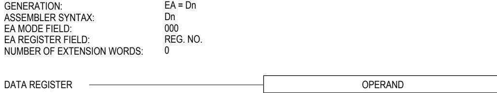

|                            |          |
|----------------------------|----------|
| GENERATION:                | EA = Dn  |
| ASSEMBLER SYNTAX:          | Dn       |
| EA MODE FIELD:             | 000      |
| EA REGISTER FIELD:         | REG. NO. |
| NUMBER OF EXTENSION WORDS: | 0        |

DATA REGISTER ————— OPERAND

## 2.2.2 Address Register Direct Mode

In the address register direct mode, the effective address field specifies the address register containing the operand.

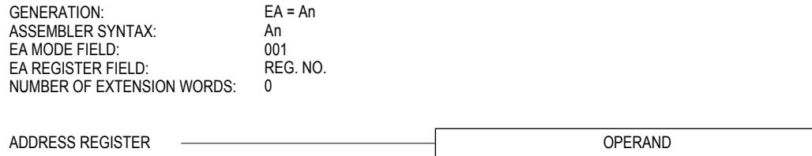

|                            |          |
|----------------------------|----------|
| GENERATION:                | EA = An  |
| ASSEMBLER SYNTAX:          | An       |
| EA MODE FIELD:             | 001      |
| EA REGISTER FIELD:         | REG. NO. |
| NUMBER OF EXTENSION WORDS: | 0        |

ADDRESS REGISTER ————— OPERAND

## 2.2.3 Address Register Indirect Mode

In the address register indirect mode, the operand is in memory. The effective address field specifies the address register containing the address of the operand in memory.

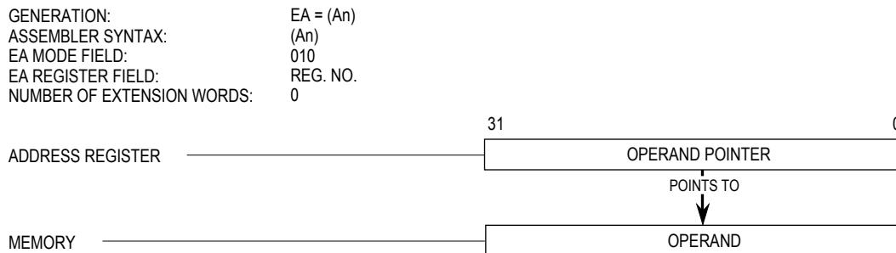

|                            |           |
|----------------------------|-----------|
| GENERATION:                | EA = (An) |
| ASSEMBLER SYNTAX:          | (An)      |
| EA MODE FIELD:             | 010       |
| EA REGISTER FIELD:         | REG. NO.  |
| NUMBER OF EXTENSION WORDS: | 0         |

ADDRESS REGISTER ————— OPERAND POINTER

31 0

POINTS TO

MEMORY ————— OPERAND

## 2.2.4 Address Register Indirect with Postincrement Mode

In the address register indirect with postincrement mode, the operand is in memory. The effective address field specifies the address register containing the address of the operand in memory. After the operand address is used, it is incremented by one, two, or four depending on the size of the operand: byte, word, or long word, respectively. Coprocessors may support incrementing for any operand size, up to 255 bytes. If the address register is the stack pointer and the operand size is byte, the address is incremented by two to keep the stack pointer aligned to a word boundary.


GENERATION: EA = (An) + SIZE  
 ASSEMBLER SYNTAX: (An) +  
 EA MODE FIELD: 011  
 EA REGISTER FIELD: REG. NO.  
 NUMBER OF EXTENSION WORDS: 0

The diagram illustrates the Address Register Indirect with Postincrement Mode. It shows the following components and their interactions:

- ADDRESS REGISTER**: A 32-bit register (bits 31 to 0) containing the **CONTENTS** (the address of the operand in memory).
- OPERAND LENGTH (1, 2, OR 4)**: A value representing the size of the operand, which is used to calculate the effective address.
- OPERAND POINTER**: A 32-bit register (bits 31 to 0) containing the **CONTENTS** (the address of the operand in memory). This register is updated after the operand is fetched.
- MEMORY**: The storage location containing the **OPERAND**.

The process flow is as follows:

- The **ADDRESS REGISTER** provides its **CONTENTS** to a **+** (addition) block.
- The **OPERAND LENGTH** is also provided to the **+** block.
- The result of the addition is the **EA = (An) + SIZE**.
- This result is used to access the **OPERAND** in **MEMORY**.
- After the operand is fetched, the **OPERAND POINTER** is updated to point to the next location in memory.

Diagram illustrating the Address Register Indirect with Postincrement Mode. It shows the flow of data from the Address Register to the Operand Pointer, which points to the Operand in Memory. The Operand Pointer is incremented by the Operand Length after the operand is fetched.

## 2.2.5 Address Register Indirect with Predecrement Mode

In the address register indirect with predecrement mode, the operand is in memory. The effective address field specifies the address register containing the address of the operand in memory. Before the operand address is used, it is decremented by one, two, or four depending on the operand size: byte, word, or long word, respectively. Coprocessors may support decrementing for any operand size up to 255 bytes. If the address register is the stack pointer and the operand size is byte, the address is decremented by two to keep the stack pointer aligned to a word boundary.

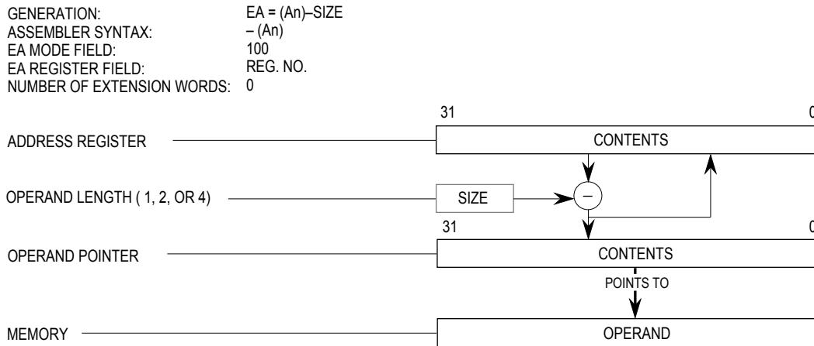

GENERATION:  $EA = (An) - SIZE$   
 ASSEMBLER SYNTAX:  $-(An)$   
 EA MODE FIELD: 100  
 EA REGISTER FIELD: REG. NO.  
 NUMBER OF EXTENSION WORDS: 0

The diagram illustrates the Address Register Indirect with Predecrement Mode. It shows the following components and their interactions:

- ADDRESS REGISTER:** A 32-bit register (bits 31 to 0) containing the **CONTENTS**.
- OPERAND LENGTH (1, 2, OR 4):** A value that determines the **SIZE** of the operand.
- OPERAND POINTER:** A 32-bit register (bits 31 to 0) containing the **CONTENTS**. This register is updated by the result of the decrement operation.
- MEMORY:** A block containing the **OPERAND** that the pointer points to.

The process flow is as follows:

- The **ADDRESS REGISTER** provides its **CONTENTS** to a subtraction operation.
- The **OPERAND LENGTH** is used to determine the **SIZE** for the subtraction.
- The subtraction operation (**CONTENTS** minus **SIZE**) produces a new value.
- This new value is written back to the **OPERAND POINTER**'s **CONTENTS**.
- The **OPERAND POINTER**'s **CONTENTS** then **POINTS TO** the **OPERAND** in **MEMORY**.

Diagram illustrating the Address Register Indirect with Predecrement Mode. It shows the flow of data from the Address Register, through a decrement operation based on Operand Length, to the Operand Pointer, which then points to the Operand in Memory.

## 2.2.6 Address Register Indirect with Displacement Mode

In the address register indirect with displacement mode, the operand is in memory. The sum of the address in the address register, which the effective address specifies, plus the sign-extended 16-bit displacement integer in the extension word is the operand's address in memory. Displacements are always sign-extended to 32 bits prior to being used in effective address calculations.

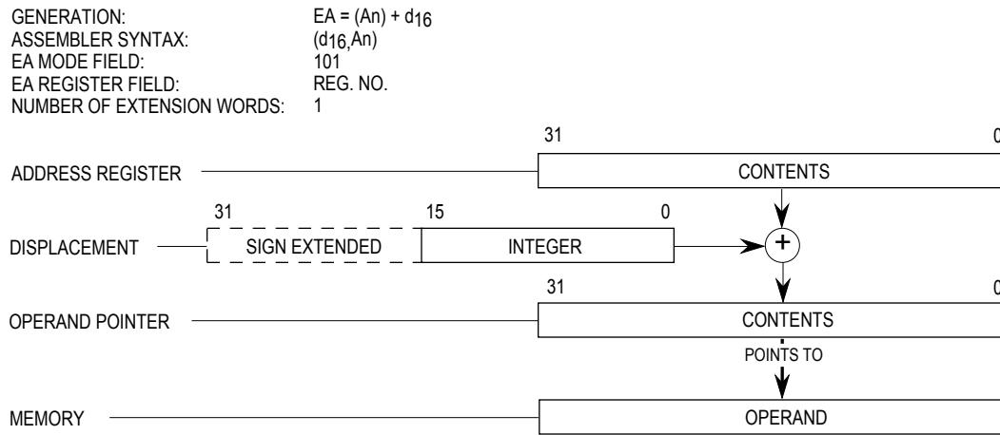

GENERATION:  $EA = (An) + d_{16}$   
 ASSEMBLER SYNTAX:  $(d_{16}, An)$   
 EA MODE FIELD: 101  
 EA REGISTER FIELD: REG. NO.  
 NUMBER OF EXTENSION WORDS: 1

The diagram illustrates the Address Register Indirect with Displacement Mode. It shows the following components and their interactions:

- ADDRESS REGISTER:** A 32-bit register (bits 31 to 0) containing the **CONTENTS**.
- DISPLACEMENT:** A 16-bit value (bits 15 to 0) that is **SIGN EXTENDED** to 32 bits. The extended value is an **INTEGER**.
- OPERAND POINTER:** A 32-bit register (bits 31 to 0) containing the **CONTENTS**, which **POINTS TO** the **OPERAND** in **MEMORY**.
- MEMORY:** A block containing the **OPERAND**.

The process flow is as follows:

- The **ADDRESS REGISTER** and the **SIGN EXTENDED** **DISPLACEMENT** are added together at a **+** (addition) block.
- The result of the addition is stored in the **OPERAND POINTER**.
- The **OPERAND POINTER** points to the **OPERAND** in **MEMORY**.

Diagram illustrating the Address Register Indirect with Displacement Mode addressing scheme. It shows the flow from the Address Register and Displacement to the Operand Pointer, which then points to the Operand in Memory.

## 2.2.7 Address Register Indirect with Index (8-Bit Displacement) Mode

This addressing mode requires one extension word that contains an index register indicator and an 8-bit displacement. The index register indicator includes size and scale information. In this mode, the operand is in memory. The operand's address is the sum of the address register's contents; the sign-extended displacement value in the extension word's low-order eight bits; and the index register's sign-extended contents (possibly scaled). The user must specify the address register, the displacement, and the index register in this mode.

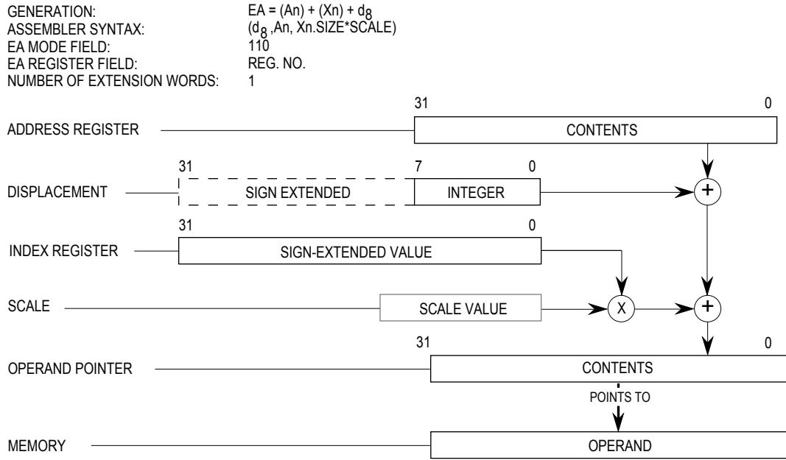

GENERATION:  $EA = (An) + (Xn) + d_8$   
 ASSEMBLER SYNTAX:  $(d_8, An, Xn, \text{SIZE} \cdot \text{SCALE})$   
 EA MODE FIELD: 110  
 EA REGISTER FIELD: REG. NO.  
 NUMBER OF EXTENSION WORDS: 1

The diagram illustrates the calculation of the Effective Address (EA) for the Address Register Indirect with Index (8-Bit Displacement) mode. It shows the following components and their interactions:

- ADDRESS REGISTER**: A 32-bit register labeled "CONTENTS" (bits 31 to 0). Its value is added to the result of the displacement and index register calculations.
- DISPLACEMENT**: An 8-bit value (bits 7 to 0) that is **SIGN EXTENDED** to 32 bits. This extended value is labeled "INTEGER".
- INDEX REGISTER**: A 32-bit register labeled "SIGN-EXTENDED VALUE".
- SCALE**: A value that is multiplied by the sign-extended index register value to produce a **SCALE VALUE**.
- OPERAND POINTER**: A 32-bit register labeled "CONTENTS" (bits 31 to 0). The final EA is stored here.
- MEMORY**: The final EA points to an **OPERAND** in memory.

The calculation process is as follows:

- The **DISPLACEMENT** (8 bits) is **SIGN EXTENDED** to 32 bits and labeled as an **INTEGER**.
- The **INDEX REGISTER** (32 bits) is **SIGN-EXTENDED**.
- The **SCALE** value is multiplied by the **SIGN-EXTENDED INDEX REGISTER** value to produce a **SCALE VALUE**.
- The **INTEGER** (sign-extended displacement) and the **SCALE VALUE** are added together in a **+** block.
- The result of the above addition is added to the **ADDRESS REGISTER** (CONTENTS) in another **+** block.
- The final result is stored in the **OPERAND POINTER** (CONTENTS).
- The **OPERAND POINTER** (CONTENTS) **POINTS TO** the **OPERAND** in **MEMORY**.

Block diagram of Address Register Indirect with Index (8-Bit Displacement) Mode addressing logic.

## 2.2.8 Address Register Indirect with Index (Base Displacement) Mode

This addressing mode requires an index register indicator and an optional 16- or 32-bit sign-extended base displacement. The index register indicator includes size and scaling information. The operand is in memory. The operand's address is the sum of the contents of the address register, the base displacement, and the scaled contents of the sign-extended index register.

In this mode, the address register, the index register, and the displacement are all optional. The effective address is zero if there is no specification. This mode provides a data register indirect address when there is no specific address register and the index register is a data register.

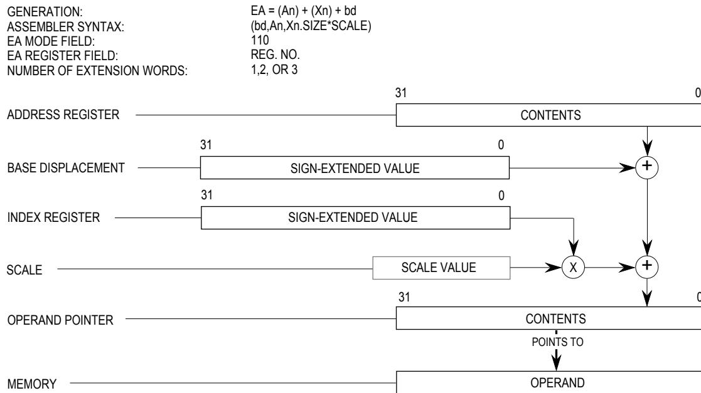

GENERATION:  $EA = (An) + (Xn) + bd$   
 ASSEMBLER SYNTAX:  $(bd, An, Xn, SIZE * SCALE)$   
 EA MODE FIELD: 110  
 EA REGISTER FIELD: REG. NO.  
 NUMBER OF EXTENSION WORDS: 1, 2, OR 3

The diagram illustrates the logic for calculating the effective address (EA) in the Address Register Indirect with Index (Base Displacement) Mode. It shows the following components and their interactions:

- ADDRESS REGISTER:** A 32-bit register (bits 31 to 0) containing the **CONTENTS**. Its output is one input to a top-level addition block.
- BASE DISPLACEMENT:** A 32-bit register (bits 31 to 0) containing a **SIGN-EXTENDED VALUE**. Its output is the second input to the top-level addition block.
- INDEX REGISTER:** A 32-bit register (bits 31 to 0) containing a **SIGN-EXTENDED VALUE**. Its output goes to a multiplication block.
- SCALE:** A signal input that goes to a **SCALE VALUE** block.
- SCALE VALUE:** A block that takes the **SCALE** input and produces a scaled value.
- Multiplication Block (X):** Takes the output of the **INDEX REGISTER** and the **SCALE VALUE** as inputs, producing a scaled index value.
- Bottom Addition Block (+):** Takes the output of the multiplication block and the output of the **ADDRESS REGISTER** as inputs, producing the final effective address.
- OPERAND POINTER:** A 32-bit register (bits 31 to 0) containing the **CONTENTS**. Its output is labeled **POINTS TO** and points to the **MEMORY** block.
- MEMORY:** A block containing the **OPERAND**.

The final output of the bottom addition block is the effective address, which is used to access the operand in memory via the operand pointer.

Block diagram of the Address Register Indirect with Index (Base Displacement) Mode addressing logic.

## 2.2.9 Memory Indirect Postindexed Mode

In this mode, both the operand and its address are in memory. The processor calculates an intermediate indirect memory address using a base address register and base displacement. The processor accesses a long word at this address and adds the index operand ( $Xn.SIZE \times SCALE$ ) and the outer displacement to yield the effective address. Both displacements and the index register contents are sign-extended to 32 bits.

In the syntax for this mode, brackets enclose the values used to calculate the intermediate memory address. All four user-specified values are optional. Both the base and outer displacements may be null, word, or long word. When omitting a displacement or suppressing an element, its value is zero in the effective address calculation.

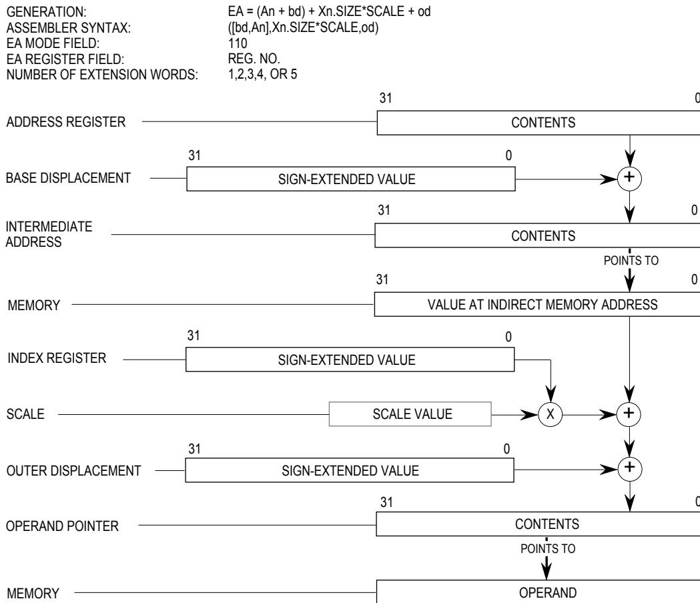

GENERATION:  
 ASSEMBLER SYNTAX:  $EA = (An + bd) + Xn.SIZE \times SCALE + od$   
 EA MODE FIELD: 110  
 EA REGISTER FIELD: REG. NO.  
 NUMBER OF EXTENSION WORDS: 1,2,3,4, OR 5

```

    graph TD
        subgraph Generation
            A[ADDRESS REGISTER] --> AR[ADDRESS REGISTER CONTENTS]
            B[BASE DISPLACEMENT] --> BSD[BASE DISPLACEMENT SIGN-EXTENDED VALUE]
            AR --> S1[+]
            BSD --> S1
            S1 --> IA[INTERMEDIATE ADDRESS]
        end
        IA --> IA_C[INTERMEDIATE ADDRESS CONTENTS]
        IA_C --> M1[MEMORY VALUE AT INDIRECT ADDRESS]
        M1 --> M1_C[MEMORY VALUE AT INDIRECT ADDRESS CONTENTS]
        M1_C --> S2[+]
        M1_C --> S3[+]
        subgraph Indexing
            C[INDEX REGISTER] --> IR[INDEX REGISTER SIGN-EXTENDED VALUE]
            D[SCALE] --> SV[SCALE VALUE]
            IR --> S4[×]
            SV --> S4
            S4 --> S2
            E[OUTER DISPLACEMENT] --> OD[OUTER DISPLACEMENT SIGN-EXTENDED VALUE]
            OD --> S3
        end
        S2 --> OP[OPERAND POINTER CONTENTS]
        S3 --> OP
        OP --> OP_C[OPERAND POINTER CONTENTS]
        OP_C --> M2[MEMORY OPERAND]
        M2 --> M2_C[MEMORY OPERAND CONTENTS]
    
```

The diagram illustrates the calculation of the effective address (EA) for Memory Indirect Postindexed Mode. It shows the following steps:

- Intermediate Address Calculation:** The ADDRESS REGISTER and BASE DISPLACEMENT are sign-extended and added together to form the INTERMEDIATE ADDRESS.
- Memory Access:** The INTERMEDIATE ADDRESS is used to access a long word from MEMORY, resulting in the VALUE AT INDIRECT MEMORY ADDRESS.
- Operand Pointer Calculation:** The VALUE AT INDIRECT MEMORY ADDRESS is added to the sign-extended product of the INDEX REGISTER and SCALE, and then to the sign-extended OUTER DISPLACEMENT to form the OPERAND POINTER.
- Final Memory Access:** The OPERAND POINTER is used to access the final OPERAND from MEMORY.

Block diagram of Memory Indirect Postindexed Mode addressing calculation. It shows the flow from ADDRESS REGISTER and BASE DISPLACEMENT to an intermediate address, then to a memory location, and finally to the OPERAND POINTER and OPERAND.

## 2.2.10 Memory Indirect Preindexed Mode

In this mode, both the operand and its address are in memory. The processor calculates an intermediate indirect memory address using a base address register, a base displacement, and the index operand ( $Xn.SIZE \times SCALE$ ). The processor accesses a long word at this address and adds the outer displacement to yield the effective address. Both displacements and the index register contents are sign-extended to 32 bits.

In the syntax for this mode, brackets enclose the values used to calculate the intermediate memory address. All four user-specified values are optional. Both the base and outer displacements may be null, word, or long word. When omitting a displacement or suppressing an element, its value is zero in the effective address calculation.

GENERATION:  
ASSEMBLER SYNTAX:  $EA = (bd + An) + Xn.SIZE \times SCALE + od$   
EA MODE FIELD: 110  
EA REGISTER FIELD: REG. NO.  
NUMBER OF EXTENSION WORDS: 1,2,3,4, OR 5

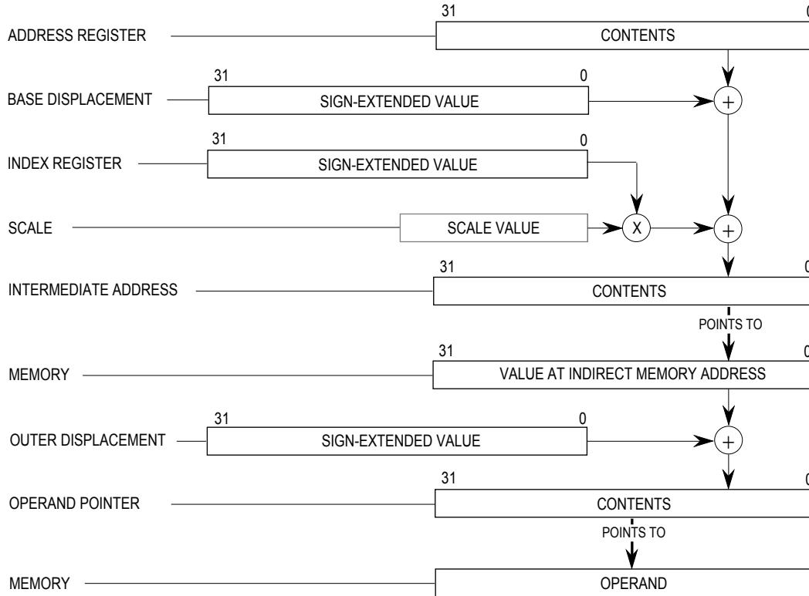

The diagram illustrates the calculation of the effective address in Memory Indirect Preindexed Mode. It shows the following components and their interactions:

- ADDRESS REGISTER** (32 bits, 31-0) provides the **CONTENTS** for the first addition.
- BASE DISPLACEMENT** (32 bits, 31-0) is **SIGN-EXTENDED** and added to the **CONTENTS** of the **ADDRESS REGISTER**.
- INDEX REGISTER** (32 bits, 31-0) is **SIGN-EXTENDED** and multiplied by the **SCALE VALUE**.
- SCALE** provides the **SCALE VALUE** for the multiplication.
- The result of the multiplication is added to the result of the first addition to produce the **INTERMEDIATE ADDRESS**.
- INTERMEDIATE ADDRESS** (32 bits, 31-0) points to the **VALUE AT INDIRECT MEMORY ADDRESS** in **MEMORY**.
- OUTER DISPLACEMENT** (32 bits, 31-0) is **SIGN-EXTENDED** and added to the **VALUE AT INDIRECT MEMORY ADDRESS** to produce the **OPERAND POINTER**.
- OPERAND POINTER** (32 bits, 31-0) points to the **OPERAND** in **MEMORY**.

Block diagram illustrating the Memory Indirect Preindexed Mode addressing calculation. The diagram shows the flow of data from registers and memory to calculate the final operand address.

## 2.2.11 Program Counter Indirect with Displacement Mode

In this mode, the operand is in memory. The address of the operand is the sum of the address in the program counter (PC) and the sign-extended 16-bit displacement integer in the extension word. The value in the PC is the address of the extension word. This is a program reference allowed only for reads.


GENERATION:  $EA = (PC) + d_{16}$   
 ASSEMBLER SYNTAX:  $(d_{16}, PC)$   
 EA MODE FIELD: 111  
 EA REGISTER FIELD: 010  
 NUMBER OF EXTENSION WORDS: 1

The diagram illustrates the addressing process for Program Counter Indirect with Displacement Mode. It shows the following components and their interactions:

- PROGRAM COUNTER**: A 32-bit register (bits 31 to 0) containing the address of the extension word. Its value is  $EA = (PC) + d_{16}$ .
- DISPLACEMENT**: A 16-bit value (bits 15 to 0) from the extension word, which is  $d_{16}$ . This value is **SIGN EXTENDED** to 32 bits.
- OPERAND POINTER**: The result of adding the Program Counter value and the sign-extended displacement, represented by a **+** symbol. This pointer is used to access the operand.
- MEMORY**: The final location where the operand is stored, accessed via the Operand Pointer.

The diagram shows the flow of data: the Program Counter value and the sign-extended displacement are added to form the Operand Pointer, which then points to the Operand in memory.

Diagram illustrating the Program Counter Indirect with Displacement Mode addressing scheme. The Program Counter (PC) provides the address for the first word in memory, which contains the displacement. The Displacement is sign-extended and added to the PC value to form the Operand Pointer. The Operand Pointer then points to the Operand in memory.

## 2.2.12 Program Counter Indirect with Index (8-Bit Displacement) Mode

This mode is similar to the mode described in **2.2.7 Address Register Indirect with Index (8-Bit Displacement) Mode**, except the PC is the base register. The operand is in memory. The operand's address is the sum of the address in the PC, the sign-extended displacement integer in the extension word's lower eight bits, and the sized, scaled, and sign-extended index operand. The value in the PC is the address of the extension word. This is a program reference allowed only for reads. The user must include the displacement, the PC, and the index register when specifying this addressing mode.

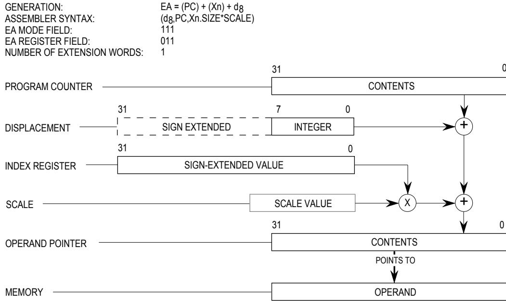

GENERATION:  $EA = (PC) + (Xn) + d_8$   
 ASSEMBLER SYNTAX:  $(d_8, PC, Xn, \text{SIZE} \cdot \text{SCALE})$   
 EA MODE FIELD: 111  
 EA REGISTER FIELD: 011  
 NUMBER OF EXTENSION WORDS: 1

The diagram illustrates the logic for calculating the Effective Address (EA) in Program Counter Indirect with Index (8-Bit Displacement) Mode. It shows the following components and their interactions:

- PROGRAM COUNTER**: A 32-bit register (bits 31-0) labeled **CONTENTS**. Its value is the base address.
- DISPLACEMENT**: An 8-bit value (bits 7-0) labeled **INTEGER**. It is processed by a **SIGN EXTENDED** block to produce a 32-bit value.
- INDEX REGISTER**: A 32-bit register (bits 31-0) labeled **SIGN-EXTENDED VALUE**.
- SCALE**: A 32-bit value (bits 31-0) labeled **SCALE VALUE**.
- OPERAND POINTER**: A 32-bit register (bits 31-0) labeled **CONTENTS**. Its value is the sum of the PC, displacement, and scaled index, and it **POINTS TO** the **OPERAND** in **MEMORY**.
- MEMORY**: A block containing the **OPERAND**.

The logic flow is as follows:

- The **PROGRAM COUNTER** provides its **CONTENTS** to a first **+** (addition) block.
- The **DISPLACEMENT** is **SIGN EXTENDED** and its result is provided to the same first **+** block.
- The **INDEX REGISTER** provides its **SIGN-EXTENDED VALUE** to a **×** (multiplication) block.
- The **SCALE** value is provided to the **×** block.
- The result of the **×** block is provided to a second **+** (addition) block.
- The result of the first **+** block is also provided to the second **+** block.
- The final result of the second **+** block is the **OPERAND POINTER**.
- The **OPERAND POINTER** points to the **OPERAND** in **MEMORY**.

Block diagram of Program Counter Indirect with Index (8-Bit Displacement) Mode addressing logic.

## 2.2.13 Program Counter Indirect with Index (Base Displacement) Mode

This mode is similar to the mode described in **2.2.8 Address Register Indirect with Index (Base Displacement) Mode**, except the PC is the base register. It requires an index register indicator and an optional 16- or 32-bit sign-extended base displacement. The operand is in memory. The operand's address is the sum of the contents of the PC, the base displacement, and the scaled contents of the sign-extended index register. The value of the PC is the address of the first extension word. This is a program reference allowed only for reads.

In this mode, the PC, the displacement, and the index register are optional. The user must supply the assembler notation ZPC (a zero value PC) to show that the PC is not used. This allows the user to access the program space without using the PC in calculating the effective address. The user can access the program space with a data register indirect access by placing ZPC in the instruction and specifying a data register as the index register.


GENERATION:  $EA = (PC) + (Xn) + bd$   
 ASSEMBLER SYNTAX:  $(bd, PC, Xn. SIZE \cdot SCALE)$   
 EA MODE FIELD: 111  
 EA REGISTER FIELD: 011  
 NUMBER OF EXTENSION WORDS: 1, 2, OR 3

The diagram illustrates the addressing logic for the Program Counter Indirect with Index (Base Displacement) Mode. It shows the following components and their interactions:

- PROGRAM COUNTER**: A 32-bit register labeled "CONTENTS" (bits 31 to 0). Its value is added to the sum of the displacement and scaled index register.
- DISPLACEMENT**: A 32-bit register labeled "SIGN-EXTENDED VALUE" (bits 31 to 0). Its value is added to the sum of the program counter and scaled index register.
- INDEX REGISTER**: A 32-bit register labeled "SIGN-EXTENDED VALUE" (bits 31 to 0). Its value is scaled by the **SCALE** field.
- SCALE**: A 32-bit register labeled "SCALE VALUE" (bits 31 to 0). Its value is multiplied by the scaled index register value.
- OPERAND POINTER**: A 32-bit register labeled "CONTENTS" (bits 31 to 0). Its value is the final Effective Address (EA).
- MEMORY**: A register labeled "OPERAND". The Operand Pointer points to the memory location containing the operand.

The logic flow is as follows: The Program Counter and Displacement values are added together. The Index Register value is scaled by the Scale value. The result of the scaling is added to the sum of the Program Counter and Displacement. The final result is the Operand Pointer, which points to the Operand in Memory.

Block diagram illustrating the Program Counter Indirect with Index (Base Displacement) Mode addressing logic. The diagram shows the flow of data from the Program Counter, Displacement, Index Register, and Scale fields to calculate the Effective Address (EA) and then the Operand Pointer to access Memory.

## 2.2.14 Program Counter Memory Indirect Postindexed Mode

This mode is similar to the mode described in **2.2.9 Memory Indirect Postindexed Mode**, but the PC is the base register. Both the operand and operand address are in memory. The processor calculates an intermediate indirect memory address by adding a base displacement to the PC contents. The processor accesses a long word at that address and adds the scaled contents of the index register and the optional outer displacement to yield the effective address. The value of the PC used in the calculation is the address of the first extension word. This is a program reference allowed only for reads.

In the syntax for this mode, brackets enclose the values used to calculate the intermediate memory address. All four user-specified values are optional. The user must supply the assembler notation ZPC (a zero value PC) to show the PC is not used. This allows the user to access the program space without using the PC in calculating the effective address. Both the base and outer displacements may be null, word, or long word. When omitting a displacement or suppressing an element, its value is zero in the effective address calculation.

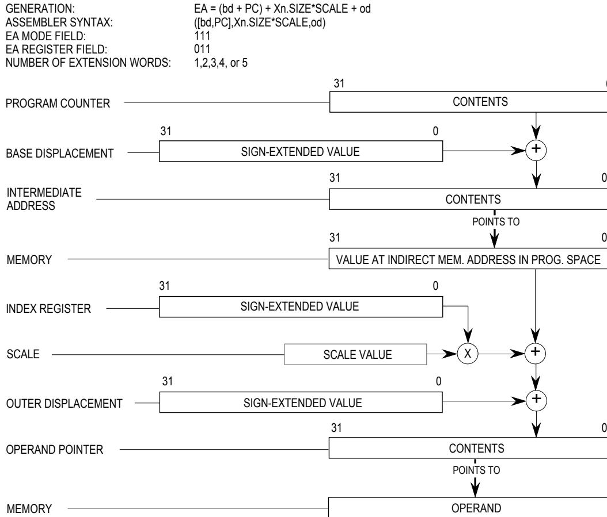

GENERATION:  $EA = (bd + PC) + Xn.SIZE \times SCALE + od$   
 ASSEMBLER SYNTAX:  $((bd,PC],Xn.SIZE \times SCALE,od)$   
 EA MODE FIELD: 111  
 EA REGISTER FIELD: 011  
 NUMBER OF EXTENSION WORDS: 1,2,3,4, or 5

The diagram illustrates the addressing logic for Program Counter Memory Indirect Postindexed Mode. It shows the flow of data from various registers and memory locations through sign extension, addition, and multiplication blocks to calculate the final operand pointer.

- PROGRAM COUNTER** (31:0) provides the **CONTENTS** to an addition block.
- BASE DISPLACEMENT** (31:0) is converted to a **SIGN-EXTENDED VALUE** and added to the PC contents.
- The result of the first addition is the **INTERMEDIATE ADDRESS** (31:0).
- MEMORY** provides the **CONTENTS** at the intermediate address.
- The intermediate address **POINTS TO** the **VALUE AT INDIRECT MEM. ADDRESS IN PROG. SPACE**.
- INDEX REGISTER** (31:0) is converted to a **SIGN-EXTENDED VALUE**.
- SCALE** is converted to a **SCALE VALUE**.
- The sign-extended index value is multiplied by the scale value in a multiplication block (**X**).
- OUTER DISPLACEMENT** (31:0) is converted to a **SIGN-EXTENDED VALUE**.
- The results of the multiplication and the outer displacement are added in a second addition block.
- The result of this second addition is the **OPERAND POINTER** (31:0).
- MEMORY** provides the **CONTENTS** at the operand pointer address.
- The operand pointer **POINTS TO** the **OPERAND**.

Block diagram of Program Counter Memory Indirect Postindexed Mode addressing logic.

## 2.2.15 Program Counter Memory Indirect Preindexed Mode

This mode is similar to the mode described in **2.2.10 Memory Indirect Preindexed Mode**, but the PC is the base register. Both the operand and operand address are in memory. The processor calculates an intermediate indirect memory address by adding the PC contents, a base displacement, and the scaled contents of an index register. The processor accesses a long word at immediate indirect memory address and adds the optional outer displacement to yield the effective address. The value of the PC is the address of the first extension word. This is a program reference allowed only for reads.

In the syntax for this mode, brackets enclose the values used to calculate the intermediate memory address. All four user-specified values are optional. The user must supply the assembler notation ZPC showing that the PC is not used. This allows the user to access the program space without using the PC in calculating the effective address. Both the base and outer displacements may be null, word, or long word. When omitting a displacement or suppressing an element, its value is zero in the effective address calculation.


GENERATION:  $EA = (bd + PC) + Xn.SIZE \times SCALE + od$   
 ASSEMBLER SYNTAX:  $[(bd, PC, Xn.SIZE \times SCALE], od)$   
 EA MODE FIELD: 111  
 EA REGISTER FIELD: 011  
 NUMBER OF EXTENSION WORDS: 1, 2, 3, 4, or 5

The diagram illustrates the addressing calculation for Program Counter Memory Indirect Preindexed Mode. It shows the following components and their interactions:

- PROGRAM COUNTER**: Its contents are added to the **BASE DISPLACEMENT** (after sign extension) and the scaled contents of the **INDEX REGISTER** (after sign extension and scaling by **SCALE**) to produce the **INTERMEDIATE ADDRESS**.
- INTERMEDIATE ADDRESS**: Points to the **VALUE AT INDIRECT MEM. ADDRESS IN PROG. SPACE** in **MEMORY**.
- OUTER DISPLACEMENT**: Its contents (after sign extension) are added to the **VALUE AT INDIRECT MEM. ADDRESS IN PROG. SPACE** to produce the **OPERAND POINTER**.
- OPERAND POINTER**: Points to the **OPERAND** in **MEMORY**.

Key blocks in the diagram include: **CONTENTS** (for PC, Intermediate Address, and Operand Pointer), **SIGN-EXTENDED VALUE** (for Base Displacement and Outer Displacement), **SCALE VALUE** (for Index Register), and **INDIRECT MEMORY ADDRESS** (the result of the first addition).

Block diagram illustrating the Program Counter Memory Indirect Preindexed Mode addressing calculation. The diagram shows the flow of data from various registers and memory locations through arithmetic and logic blocks to determine the final operand address.

## 2.2.16 Absolute Short Addressing Mode

In this addressing mode, the operand is in memory, and the address of the operand is in the extension word. The 16-bit address is sign-extended to 32 bits before it is used.

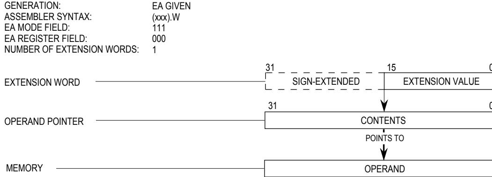

GENERATION: EA GIVEN  
 ASSEMBLER SYNTAX: (xxx).W  
 EA MODE FIELD: 111  
 EA REGISTER FIELD: 000  
 NUMBER OF EXTENSION WORDS: 1

The diagram illustrates the Absolute Short Addressing Mode. An 'EXTENSION WORD' (16 bits, bits 15-0) is sign-extended to 32 bits. This 32-bit value is stored in the 'CONTENTS' register. The 'CONTENTS' register then points to the 'OPERAND' in 'MEMORY'.

Diagram of Absolute Short Addressing Mode showing the flow from the extension word to the operand in memory.

## 2.2.17 Absolute Long Addressing Mode

In this addressing mode, the operand is in memory, and the operand's address occupies the two extension words following the instruction word in memory. The first extension word contains the high-order part of the address; the second contains the low-order part of the address.


GENERATION: EA GIVEN  
 ASSEMBLER SYNTAX: (xxx).L  
 EA MODE FIELD: 111  
 EA REGISTER FIELD: 001  
 NUMBER OF EXTENSION WORDS: 2

The diagram illustrates the Absolute Long Addressing Mode. The 'FIRST EXTENSION WORD' (16 bits, bits 15-0) contains 'ADDRESS HIGH' and the 'SECOND EXTENSION WORD' (16 bits, bits 15-0) contains 'ADDRESS LOW'. These two 16-bit values are combined to form a 32-bit address, which is stored in the 'CONTENTS' register. The 'CONTENTS' register then points to the 'OPERAND' in 'MEMORY'.

Diagram of Absolute Long Addressing Mode showing the flow from two extension words to the operand in memory.

## 2.2.18 Immediate Data

In this addressing mode, the operand is in one or two extension words. Table 2-3 lists the location of the operand within the instruction word format. The immediate data format is as follows:

GENERATION: OPERAND GIVEN  
 ASSEMBLER SYNTAX: #<xxx>  
 EA MODE FIELD: 111  
 EA REGISTER FIELD: 100  
 NUMBER OF EXTENSION WORDS: 1,2,4, OR 6, EXCEPT FOR PACKED DECIMAL REAL OPERANDS

**Table 2-3. Immediate Operand Location**

| Operation Length    | Location                                                                                                           |
|---------------------|--------------------------------------------------------------------------------------------------------------------|
| Byte                | Low-order byte of the extension word.                                                                              |
| Word                | The entire extension word.                                                                                         |
| Long Word           | High-order word of the operand is in the first extension word; the low-order word is in the second extension word. |
| Single-Precision    | In two extension words.                                                                                            |
| Double-Precision    | In four extension words.                                                                                           |
| Extended-Precision  | In six extension words.                                                                                            |
| Packed-Decimal Real | In six extension words.                                                                                            |

## 2.3 EFFECTIVE ADDRESSING MODE SUMMARY

Effective addressing modes are grouped according to the use of the mode. Data addressing modes refer to data operands. Memory addressing modes refer to memory operands. Alterable addressing modes refer to alterable (writable) operands. Control addressing modes refer to memory operands without an associated size.

These categories sometimes combine to form new categories that are more restrictive. Two combined classifications are alterable memory (addressing modes that are both alterable and memory addresses) and data alterable (addressing modes that are both alterable and data). Table 2-4 lists a summary of effective addressing modes and their categories.

**Table 2-4. Effective Addressing Modes and Categories**

| Addressing Modes                                                                                                     | Syntax                                          | Mode Field               | Reg. Field                                   | Data             | Memory           | Control          | Alterable        |
|----------------------------------------------------------------------------------------------------------------------|-------------------------------------------------|--------------------------|----------------------------------------------|------------------|------------------|------------------|------------------|
| Register Direct<br>Data Address                                                                                      | Dn<br>An                                        | 000<br>001               | reg. no.<br>reg. no.                         | X<br>—           | —<br>—           | —<br>—           | X<br>X           |
| Register Indirect<br>Address<br>Address with Postincrement<br>Address with Predecrement<br>Address with Displacement | (An)<br>(An)+<br>—(An)<br>(d <sub>16</sub> ,An) | 010<br>011<br>100<br>101 | reg. no.<br>reg. no.<br>reg. no.<br>reg. no. | X<br>X<br>X<br>X | X<br>X<br>X<br>X | X<br>—<br>—<br>X | X<br>X<br>X<br>X |
| Address Register Indirect with Index<br>8-Bit Displacement<br>Base Displacement                                      | (d <sub>8</sub> ,An,Xn)<br>(bd,An,Xn)           | 110<br>110               | reg. no.<br>reg. no.                         | X<br>X           | X<br>X           | X<br>X           | X<br>X           |
| Memory Indirect<br>Postindexed<br>Preindexed                                                                         | ([bd,An],Xn,od)<br>([bd,An,Xn],od)              | 110<br>110               | reg. no.<br>reg. no.                         | X<br>X           | X<br>X           | X<br>X           | X<br>X           |
| Program Counter Indirect with Displacement                                                                           | (d <sub>16</sub> ,PC)                           | 111                      | 010                                          | X                | X                | X                | —                |
| Program Counter Indirect with Index<br>8-Bit Displacement<br>Base Displacement                                       | (d <sub>8</sub> ,PC,Xn)<br>(bd,PC,Xn)           | 111<br>111               | 011<br>011                                   | X<br>X           | X<br>X           | X<br>X           | —<br>—           |
| Program Counter Memory Indirect<br>Postindexed<br>Preindexed                                                         | ([bd,PC],Xn,od)<br>([bd,PC,Xn],od)              | 111<br>111               | 011<br>011                                   | X<br>X           | X<br>X           | X<br>X           | X<br>X           |
| Absolute Data Addressing<br>Short<br>Long                                                                            | (xxx).W<br>(xxx).L                              | 111<br>111               | 000<br>000                                   | X<br>X           | X<br>X           | X<br>X           | —<br>—           |
| Immediate                                                                                                            | #<xxx>                                          | 111                      | 100                                          | X                | X                | —                | —                |

## 2.4 BRIEF EXTENSION WORD FORMAT COMPATIBILITY

Programs can be easily transported from one member of the M68000 family to another in an upward-compatible fashion. The user object code of each early member of the family, which is upward compatible with newer members, can be executed on the newer microprocessor without change. Brief extension word formats are encoded with information that allows the CPU32, MC68020, MC68030, and MC68040 to distinguish the basic M68000 family architecture's new address extensions. Figure 2-3 illustrates these brief extension word formats. The encoding for SCALE used by the CPU32, MC68020, MC68030, and MC68040 is a compatible extension of the M68000 family architecture. A value of zero for SCALE is the same encoding for both extension words. Software that uses this encoding is compatible with all processors in the M68000 family. Both brief extension word formats do not contain the other values of SCALE. Software can be easily migrated in an upward-compatible direction, with downward support only for nonscaled addressing. If the MC68000 were to execute an instruction that encoded a scaling factor, the scaling factor would be ignored and would not access the desired memory address. The earlier microprocessors do not recognize the brief extension word formats implemented by newer processors. Although they can detect illegal instructions, they do not decode invalid encodings of the brief extension word formats as exceptions.

| 15  | 14       | 13 | 12 | 11  | 10 | 9 | 8 | 7                    | 6 | 5 | 4 | 3 | 2 | 1 | 0 |
|-----|----------|----|----|-----|----|---|---|----------------------|---|---|---|---|---|---|---|
| D/A | REGISTER |    |    | W/L | 0  | 0 | 0 | DISPLACEMENT INTEGER |   |   |   |   |   |   |   |

**(a) MC68000, MC68008, and MC68010**

| 15  | 14       | 13 | 12 | 11  | 10    | 9 | 8 | 7                    | 6 | 5 | 4 | 3 | 2 | 1 | 0 |
|-----|----------|----|----|-----|-------|---|---|----------------------|---|---|---|---|---|---|---|
| D/A | REGISTER |    |    | W/L | SCALE |   | 0 | DISPLACEMENT INTEGER |   |   |   |   |   |   |   |

**(b) CPU32, MC68020, MC68030, and MC68040**

**Figure 2-3. M68000 Family Brief Extension Word Formats**

## 2.5 FULL EXTENSION ADDRESSING MODES

The full extension word format provides additional addressing modes for the MC68020, MC68030, and MC68040. There are four elements common to these full extension addressing modes: a base register (BR), an index register (Xn), a base displacement (bd), and an outer displacement (od). Each of these four elements can be suppressed independently of each other. However, at least one element must be active and not suppressed. When an element is suppressed, it has an effective value of zero.

BR can be suppressed through the BS field of the full extension word format. The encoding of bits 0-5 in the single effective address word format (see Figure 2-2) selects BR as either the PC when using program relative addressing modes, or An when using non-program relative addressing modes. The value of the PC is the address of the extension word. For the non-program relative addressing modes, BR is the contents of a selected An.

SIZE and SCALE can be used to modify Xn. The W/L field in the full extension format selects the size of Xn as a word or long word. The SCALE field selects the scaling factor, shifts the value of the Xn left multiplying the value by 1, 2, 4, or 8, respectively, without actually changing the value. Scaling can be used to calculate the address of arrayed structures. Figure 2-4 illustrates the scaling of an Xn.

The bd and od can be either word or long word. The size of od is selected through the encoding of the I/S field in the full extension word format (refer to Table 2-2). There are two main modes of operation that use these four elements in different ways: no memory indirect action and memory indirect. The od is provided only for using memory indirect addressing modes of which there are three types: with preindex, with postindex, and with index suppressed.

SYNTAX: `MOVE.B (A5, A6.L*SCALE), (A7)`  
WHERE

A5 = ADDRESS OF ARRAY STRUCTURE  
A6 = INDEX NUMBER OF ARRAY ITEM  
A7 = STACK POINTER

![Diagram illustrating four array structures and their addressing. Each structure is shown as a vertical stack of bytes, with addresses 7 at the top and 0 at the bottom. Arrows indicate the index (A6) pointing to a specific byte within the structure. The structures are: 1. Simple Array (Scale = 1): 4 bytes, index 0 points to the first byte. 2. Record of 2 Bytes (Scale = 2): 8 bytes, index 0 points to the first byte. 3. Record of 4 Bytes (Scale = 4): 8 bytes, index 0 points to the first byte. 4. Record of 8 Bytes (Scale = 8): 8 bytes, index 0 points to the first byte. A note states: 'Regardless of array structure, software increments index by the appropriate amount to point to next record.'](M68000PRM.images/1f1614411edea7edfc86c839a608e1fc_img.jpg)

**SIMPLE ARRAY (SCALE = 1)**

**RECORD OF 2 BYTES (SCALE = 2)**

**RECORD OF 4 BYTES (SCALE = 4)**

**RECORD OF 8 BYTES (SCALE = 8)**

NOTE: Regardless of array structure, software increments index by the appropriate amount to point to next record.

Diagram illustrating four array structures and their addressing. Each structure is shown as a vertical stack of bytes, with addresses 7 at the top and 0 at the bottom. Arrows indicate the index (A6) pointing to a specific byte within the structure. The structures are: 1. Simple Array (Scale = 1): 4 bytes, index 0 points to the first byte. 2. Record of 2 Bytes (Scale = 2): 8 bytes, index 0 points to the first byte. 3. Record of 4 Bytes (Scale = 4): 8 bytes, index 0 points to the first byte. 4. Record of 8 Bytes (Scale = 8): 8 bytes, index 0 points to the first byte. A note states: 'Regardless of array structure, software increments index by the appropriate amount to point to next record.'

**Figure 2-4. Addressing Array Items**

### 2.5.1 No Memory Indirect Action Mode

No memory indirect action mode uses BR, Xn with its modifiers, and bd to calculate the address of the required operand. Data register indirect (Dn) and absolute address with index (bd,Xn.SIZE\*SCALE) are examples of the no memory indirect action mode. Figure 2-5 illustrates the no memory indirect action mode.

| BR | Xn | bd | Addressing Mode                                            |
|----|----|----|------------------------------------------------------------|
| S  | S  | S  | Not Applicable                                             |
| S  | S  | A  | Absolute Addressing Mode                                   |
| S  | A  | S  | Register Indirect                                          |
| S  | A  | A  | Register Indirect with Constant Index                      |
| An | S  | S  | Address Register Indirect                                  |
| An | S  | A  | Address Register Indirect with Constant Index              |
| An | A  | S  | Address Register Indirect with Variable Index              |
| An | A  | A  | Address Register Indirect with Constant and Variable Index |
| PC | S  | S  | PC Relative                                                |
| PC | S  | A  | PC Relative with Constant Index                            |
| PC | A  | S  | PC Relative with Variable Index                            |
| PC | A  | A  | PC Relative with Constant and Variable Index               |

NOTE: S indicates suppressed and A indicates active.


Diagram illustrating the No Memory Indirect Action mode. An input labeled 'An or PC' points to the top of a vertical stack. The stack consists of three boxes: the top box contains 'bd.BD SIZE', the middle box contains 'Xn.SIZE\*SCALE', and the bottom box contains 'OPERAND'. Arrows indicate a downward flow from the input through the top box to the middle box, and then to the bottom box.

**Figure 2-5. No Memory Indirect Action**

## 2.5.2 Memory Indirect Modes

Memory indirect modes fetch two operands from memory. The BR and bd evaluate the address of the first operand, intermediate memory pointer (IMP). The value of IMP and the od evaluates the address of the second operand.

There are three types of memory indirect modes: pre-index, post-index, and index register suppressed. Xn and its modifiers can be allocated to determine either the address of the IMP (pre-index) or to the address of the second operand (post-index).

**2.5.2.1 MEMORY INDIRECT WITH PREINDEX.** The Xn is allocated to determine the address of the IMP. Figure 2-6 illustrates the memory indirect with pre-indexing mode.

| BR | Xn | bd | od | IMP Addressing Mode                                        | Operand Addressing Mode                                  |
|----|----|----|----|------------------------------------------------------------|----------------------------------------------------------|
| S  | A  | S  | S  | Register Indirect                                          | Memory Pointer Directly to Data Operand                  |
| S  | A  | S  | A  | Register Indirect                                          | Memory Pointer as Base with Displacement to Data Operand |
| S  | A  | A  | S  | Register Indirect with Constant Index                      | Memory Pointer Directly to Data Operand                  |
| S  | A  | A  | A  | Register Indirect with Constant Index                      | Memory Pointer as Base with Displacement to Data Operand |
| An | A  | S  | S  | Address Register Indirect with Variable Index              | Memory Pointer Directly to Data Operand                  |
| An | A  | S  | A  | Address Register Indirect with Variable Index              | Memory Pointer as Base with Displacement to Data Operand |
| An | A  | A  | S  | Address Register Indirect with Constant and Variable Index | Memory Pointer Directly to Data Operand                  |
| An | A  | A  | A  | Address Register Indirect with Constant and Variable Index | Memory Pointer as Base with Displacement to Data Operand |
| PC | A  | S  | S  | PC Relative with Variable Index                            | Memory Pointer Directly to Data Operand                  |
| PC | A  | S  | A  | PC Relative with Variable Index                            | Memory Pointer as Base with Displacement to Data Operand |
| PC | A  | A  | S  | PC Relative with Constant and Variable Index               | Memory Pointer Directly to Data Operand                  |
| PC | A  | A  | A  | PC Relative with Constant and Variable Index               | Memory Pointer as Base with Displacement to Data Operand |

NOTE: S indicates suppressed and A indicates active.


Figure 2-6: Memory Indirect with Preindex. The diagram shows a flow from 'An or PC' into a block labeled 'IMP'. This block contains three stages: 'bd.BD SIZE', 'Xn.SIZE\*SCALE', and 'IMP'. An arrow points from the 'IMP' stage to a second block labeled 'OPERAND', which contains 'od.OD SIZE' and 'OPERAND'. A line connects the output of the 'IMP' block to the input of the 'OPERAND' block.

**Figure 2-6. Memory Indirect with Preindex**

**2.5.2.2 MEMORY INDIRECT WITH POSTINDEX.** The Xn is allocated to evaluate the address of the second operand. Figure 2-7 illustrates the memory indirect with post-indexing mode.

| BR | Xn | bd | od | IMP Addressing Mode                           | Operand Addressing Mode                                         |
|----|----|----|----|-----------------------------------------------|-----------------------------------------------------------------|
| S  | A  | S  | S  | —                                             | —                                                               |
| S  | A  | S  | A  | —                                             | —                                                               |
| S  | A  | A  | S  | Absolute Addressing Mode                      | Memory Pointer with Variable Index to Data Operand              |
| S  | A  | A  | A  | Absolute Addressing Mode                      | Memory Pointer with Constant and Variable Index to Data Operand |
| An | A  | S  | S  | Address Register Indirect                     | Memory Pointer with Variable Index to Data Operand              |
| An | A  | S  | A  | Address Register Indirect                     | Memory Pointer with Constant and Variable Index to Data Operand |
| An | A  | A  | S  | Address Register Indirect with Constant Index | Memory Pointer with Variable Index to Data Operand              |
| An | A  | A  | A  | Address Register Indirect with Constant Index | Memory Pointer with Constant and Variable Index to Data Operand |
| PC | A  | S  | S  | PC Relative                                   | Memory Pointer with Variable Index to Data Operand              |
| PC | A  | S  | A  | PC Relative                                   | Memory Pointer with Constant and Variable Index to Data Operand |
| PC | A  | A  | S  | PC Relative with Constant Index               | Memory Pointer with Variable Index to Data Operand              |
| PC | A  | A  | A  | PC Relative with Constant Index               | Memory Pointer with Constant and Variable Index to Data Operand |

NOTE: S indicates suppressed and A indicates active.


Diagram of Memory Indirect with Postindex addressing mode. An input 'An or PC' enters the IMP block. The IMP block contains 'bd.BD SIZE' and 'IMP'. The output of the IMP block is the address for the OPERAND block. The OPERAND block contains 'od.OD SIZE', 'od.OD SIZE', and 'OPERAND'. The final output is the OPERAND value.

**Figure 2-7. Memory Indirect with Postindex**

**2.5.2.3 MEMORY INDIRECT WITH INDEX SUPPRESSED.** The Xn is suppressed. Figure 2-8 illustrates the memory indirect with index suppressed mode.

| BR | Xn | bd | od | IMP Addressing Mode                           | Operand Addressing Mode                                  |
|----|----|----|----|-----------------------------------------------|----------------------------------------------------------|
| S  | S  | S  | S  | —                                             | —                                                        |
| S  | S  | S  | A  | —                                             | —                                                        |
| S  | S  | A  | S  | Absolute Addressing Mode                      | Memory Pointer Directly to Data Operand                  |
| S  | S  | A  | A  | Absolute Addressing Mode                      | Memory Pointer as Base with Displacement to Data Operand |
| An | S  | S  | S  | Address Register Indirect                     | Memory Pointer Directly to Data Operand                  |
| An | S  | S  | A  | Address Register Indirect                     | Memory Pointer as Base with Displacement to Data Operand |
| An | S  | A  | S  | Address Register Indirect with Constant Index | Memory Pointer Directly to Data Operand                  |
| An | S  | A  | A  | Address Register Indirect with Constant Index | Memory Pointer as Base with Displacement to Data Operand |
| PC | S  | S  | S  | PC Relative                                   | Memory Pointer Directly to Data Operand                  |
| PC | S  | S  | A  | PC Relative                                   | Memory Pointer as Base with Displacement to Data Operand |
| PC | S  | A  | S  | PC Relative with Constant Index               | Memory Pointer Directly to Data Operand                  |
| PC | S  | A  | A  | PC Relative with Constant Index               | Memory Pointer as Base with Displacement to Data Operand |

NOTE: S indicates suppressed and A indicates active.


Diagram of Memory Indirect with Index Suppress addressing mode. An input 'An or PC' enters the IMP block. The IMP block contains 'bd.BD SIZE' and 'IMP'. The output of the IMP block is the address for the OPERAND block. The OPERAND block contains 'od.OD SIZE' and 'OPERAND'. The final output is the OPERAND value.

**Figure 2-8. Memory Indirect with Index Suppress**

## 2.6 OTHER DATA STRUCTURES

Stacks and queues are common data structures. The M68000 family implements a system stack and instructions that support user stacks and queues.

### 2.6.1 System Stack

Address register seven (A7) is the system stack pointer. Either the user stack pointer (USP), the interrupt stack pointer (ISP), or the master stack pointer (MSP) is active at any one time. Refer to **Section 1 Introduction** for details on these stack pointers. To keep data on the system stack aligned for maximum efficiency, the active stack pointer is automatically decremented or incremented by two for all byte-size operands moved to or from the stack. In long-word-organized memory, aligning the stack pointer on a long-word address significantly increases the efficiency of stacking exception frames, subroutine calls and returns, and other stacking operations.

The user can implement stacks with the address register indirect with postincrement and predecrement addressing modes. With an address register the user can implement a stack that fills either from high memory to low memory or from low memory to high memory. Important consideration are:

- Use the predecrement mode to decrement the register before using its contents as the pointer to the stack.
- Use the postincrement mode to increment the register after using its contents as the pointer to the stack.
- Maintain the stack pointer correctly when byte, word, and long-word items mix in these stacks.

To implement stack growth from high memory to low memory, use  $-(A_n)$  to push data on the stack and  $(A_n) +$  to pull data from the stack. For this type of stack, after either a push or a pull operation, the address register points to the top item on the stack.

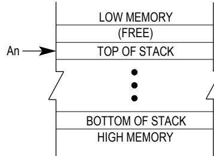

The diagram illustrates a stack structure within memory. It shows a vertical stack of memory blocks. At the top is a block labeled 'LOW MEMORY (FREE)'. Below this is a block labeled 'TOP OF STACK'. An arrow labeled 'A<sub>n</sub>' points to the 'TOP OF STACK' block. Below the 'TOP OF STACK' block is a vertical ellipsis (three dots) indicating the stack grows downwards. At the bottom of the stack is a block labeled 'BOTTOM OF STACK', which is adjacent to a block labeled 'HIGH MEMORY'. The stack is shown growing from high memory to low memory.

Diagram of a stack growing from high memory to low memory.

To implement stack growth from low memory to high memory, use  $(An) +$  to push data on the stack and  $-(An)$  to pull data from the stack. After either a push or pull operation, the address register points to the next available space on the stack. .

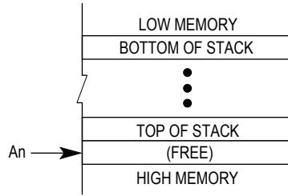

The diagram illustrates a stack structure within memory. It shows a vertical stack of memory blocks. At the top is a block labeled 'LOW MEMORY' and 'BOTTOM OF STACK'. Below this is a series of three dots. Further down is a block labeled 'TOP OF STACK' and '(FREE)'. At the bottom is a block labeled 'HIGH MEMORY'. An arrow labeled 'An' points to the 'TOP OF STACK' block, indicating the current address register value.

Diagram of stack growth from low memory to high memory.

## 2.6.2 Queues

The user can implement queues, groups of information waiting to be processed, with the address register indirect with postincrement or predecrement addressing modes. Using a pair of address registers, the user implements a queue that fills either from high memory to low memory or from low memory to high memory. Two registers are used because the queues get pushed from one end and pulled from the other. One address register contains the put pointer; the other register the get pointer. To implement growth of the queue from low memory to high memory, use the put address register to put data into the queue and the get address register to get data from the queue.

After a put operation, the put address register points to the next available space in the queue; the unchanged get address register points to the next item to be removed from the queue. After a get operation, the get address register points to the next item to be removed from the queue; the unchanged put address register points to the next available space in the queue. .

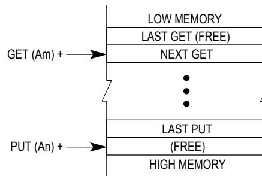

The diagram illustrates a queue structure within memory. It shows a vertical stack of memory blocks. At the top is a block labeled 'LOW MEMORY'. Below this is a block labeled 'LAST GET (FREE)'. Further down is a block labeled 'NEXT GET'. Below this is a series of three dots. Further down is a block labeled 'LAST PUT' and '(FREE)'. At the bottom is a block labeled 'HIGH MEMORY'. An arrow labeled 'GET (Am) +' points to the 'NEXT GET' block, and an arrow labeled 'PUT (An) +' points to the 'LAST PUT' block.

Diagram of queue structure with get and put pointers.

To implement the queue as a circular buffer, the relevant address register should be checked and adjusted. If necessary, do this before performing the put or get operation. Subtracting the buffer length (in bytes) from the register adjusts the address register. To implement growth of the queue from high memory to low memory, use the put address register indirect to put data into the queue and get address register indirect to get data from the queue.

After a put operation, the put address register points to the last item placed in the queue; the unchanged get address register points to the last item removed from the queue. After a get operation, the get address register points to the last item placed in the queue.

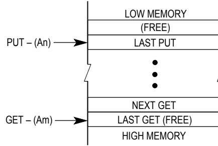

The diagram illustrates a memory queue structure within a vertical stack of memory. The stack is divided into three main sections: LOW MEMORY (FREE) at the top, HIGH MEMORY at the bottom, and a central section containing the queue. The central section is marked with a jagged line on both sides. Within this section, there are four horizontal lines: 'LAST PUT' at the top, followed by three vertical dots, then 'NEXT GET', and finally 'LAST GET (FREE)' at the bottom. Two arrows point into the stack: 'PUT - (An)' points to the 'LAST PUT' line, and 'GET - (Am)' points to the 'LAST GET (FREE)' line.

Diagram of a memory queue structure showing the relationship between put and get addresses.

To implement the queue as a circular buffer, the get or put operation should be performed first. Then the relevant address register should be checked and adjusted, if necessary. Adding the buffer length (in bytes) to the address register contents adjusts the address register.

## SECTION 3

# INSTRUCTION SET SUMMARY

This section briefly describes the M68000 family instruction set, using Motorola's assembly language syntax and notation. It includes instruction set details such as notation and format, selected instruction examples, and an integer condition code discussion. The section concludes with a discussion of floating-point details such as computational accuracy, conditional test definitions, an explanation of the operation table, and a discussion of not-a-numbers (NANs) and postprocessing.

### 3.1 INSTRUCTION SUMMARY

Instructions form a set of tools that perform the following types of operations:

|                                 |                               |
|---------------------------------|-------------------------------|
| Data Movement                   | Program Control               |
| Integer Arithmetic              | System Control                |
| Logical Operations              | Cache Maintenance             |
| Shift and Rotate Operations     | Multiprocessor Communications |
| Bit Manipulation                | Memory Management             |
| Bit Field Manipulation          | Floating-Point Arithmetic     |
| Binary-Coded Decimal Arithmetic |                               |

The following paragraphs describe in detail the instruction for each type of operation. Table 3-1 lists the notations used throughout this manual. In the operand syntax statements of the instruction definitions, the operand on the right is the destination operand.

**Table 3-1. Notational Conventions**

| <b>Single- And Double Operand Operations</b>             |                                                                                                                                                                                                                                                                                                                                       |
|----------------------------------------------------------|---------------------------------------------------------------------------------------------------------------------------------------------------------------------------------------------------------------------------------------------------------------------------------------------------------------------------------------|
| +                                                        | Arithmetic addition or postincrement indicator.                                                                                                                                                                                                                                                                                       |
| –                                                        | Arithmetic subtraction or predecrement indicator.                                                                                                                                                                                                                                                                                     |
| ×                                                        | Arithmetic multiplication.                                                                                                                                                                                                                                                                                                            |
| ÷                                                        | Arithmetic division or conjunction symbol.                                                                                                                                                                                                                                                                                            |
| ~                                                        | Invert; operand is logically complemented.                                                                                                                                                                                                                                                                                            |
| Λ                                                        | Logical AND                                                                                                                                                                                                                                                                                                                           |
| ∨                                                        | Logical OR                                                                                                                                                                                                                                                                                                                            |
| ⊕                                                        | Logical exclusive OR                                                                                                                                                                                                                                                                                                                  |
| →                                                        | Source operand is moved to destination operand.                                                                                                                                                                                                                                                                                       |
| ↔                                                        | Two operands are exchanged.                                                                                                                                                                                                                                                                                                           |
| <op>                                                     | Any double-operand operation.                                                                                                                                                                                                                                                                                                         |
| <operand>tested                                          | Operand is compared to zero and the condition codes are set appropriately.                                                                                                                                                                                                                                                            |
| sign-extended                                            | All bits of the upper portion are made equal to the high-order bit of the lower portion.                                                                                                                                                                                                                                              |
| <b>Other Operations</b>                                  |                                                                                                                                                                                                                                                                                                                                       |
| TRAP                                                     | Equivalent to Format -> (SSP); SSP - 2 → SSP; PC → (SSP); SSP - 4 → SSP; SR → (SSP); SSP - 2 → SSP; (Vector) → PC                                                                                                                                                                                                                     |
| STOP                                                     | Enter the stopped state, waiting for interrupts.                                                                                                                                                                                                                                                                                      |
| <operand> <sub>10</sub>                                  | The operand is BCD; operations are performed in decimal.                                                                                                                                                                                                                                                                              |
| If <condition><br>then <operations><br>else <operations> | Test the condition. If true, the operations after "then" are performed. If the condition is false and the optional "else" clause is present, the operations after "else" are performed. If the condition is false and else is omitted, the instruction performs no operation. Refer to the Bcc instruction description as an example. |
| <b>Register Specifications</b>                           |                                                                                                                                                                                                                                                                                                                                       |
| An                                                       | Any Address Register n (example: A3 is address register 3)                                                                                                                                                                                                                                                                            |
| Ax, Ay                                                   | Source and destination address registers, respectively.                                                                                                                                                                                                                                                                               |
| Dc                                                       | Data register D7–D0, used during compare.                                                                                                                                                                                                                                                                                             |
| Dh, Dl                                                   | Data register's high- or low-order 32 bits of product.                                                                                                                                                                                                                                                                                |
| Dn                                                       | Any Data Register n (example: D5 is data register 5)                                                                                                                                                                                                                                                                                  |
| Dr, Dq                                                   | Data register's remainder or quotient of divide.                                                                                                                                                                                                                                                                                      |
| Du                                                       | Data register D7–D0, used during update.                                                                                                                                                                                                                                                                                              |
| Dx, Dy                                                   | Source and destination data registers, respectively.                                                                                                                                                                                                                                                                                  |
| MRn                                                      | Any Memory Register n.                                                                                                                                                                                                                                                                                                                |
| Rn                                                       | Any Address or Data Register                                                                                                                                                                                                                                                                                                          |
| Rx, Ry                                                   | Any source and destination registers, respectively.                                                                                                                                                                                                                                                                                   |
| Xn                                                       | Index Register                                                                                                                                                                                                                                                                                                                        |

**Table 3-1. Notational Conventions (Continued)**

| <b>Data Format And Type</b>     |                                                                                                                       |
|---------------------------------|-----------------------------------------------------------------------------------------------------------------------|
| + inf                           | Positive Infinity                                                                                                     |
| <fmt>                           | Operand Data Format: Byte (B), Word (W), Long (L), Single (S), Double (D), Extended (X), or Packed (P).               |
| B, W, L                         | Specifies a signed integer data type (twos complement) of byte, word, or long word.                                   |
| D                               | Double-precision real data format (64 bits).                                                                          |
| k                               | A twos complement signed integer (-64 to +17) specifying a number's format to be stored in the packed decimal format. |
| P                               | Packed BCD real data format (96 bits, 12 bytes).                                                                      |
| S                               | Single-precision real data format (32 bits).                                                                          |
| X                               | Extended-precision real data format (96 bits, 16 bits unused).                                                        |
| - inf                           | Negative Infinity                                                                                                     |
| <b>Subfields and Qualifiers</b> |                                                                                                                       |
| #<xxx> or #<data>               | Immediate data following the instruction word(s).                                                                     |
| ()                              | Identifies an indirect address in a register.                                                                         |
| []                              | Identifies an indirect address in memory.                                                                             |
| bd                              | Base Displacement                                                                                                     |
| ccc                             | Index into the MC68881/MC68882 Constant ROM                                                                           |
| d <sub>n</sub>                  | Displacement Value, n Bits Wide (example: d <sub>16</sub> is a 16-bit displacement).                                  |
| LSB                             | Least Significant Bit                                                                                                 |
| LSW                             | Least Significant Word                                                                                                |
| MSB                             | Most Significant Bit                                                                                                  |
| MSW                             | Most Significant Word                                                                                                 |
| od                              | Outer Displacement                                                                                                    |
| SCALE                           | A scale factor (1, 2, 4, or 8 for no-word, word, long-word, or quad-word scaling, respectively).                      |
| SIZE                            | The index register's size (W for word, L for long word).                                                              |
| {offset:width}                  | Bit field selection.                                                                                                  |
| <b>Register Names</b>           |                                                                                                                       |
| CCR                             | Condition Code Register (lower byte of status register)                                                               |
| DFC                             | Destination Function Code Register                                                                                    |
| FPCr                            | Any Floating-Point System Control Register (FPCR, FPSR, or FPIAR)                                                     |
| FPm, FPn                        | Any Floating-Point Data Register specified as the source or destination, respectively.                                |
| IC, DC, IC/DC                   | Instruction, Data, or Both Caches                                                                                     |
| MMUSR                           | MMU Status Register                                                                                                   |
| PC                              | Program Counter                                                                                                       |
| Rc                              | Any Non Floating-Point Control Register                                                                               |
| SFC                             | Source Function Code Register                                                                                         |
| SR                              | Status Register                                                                                                       |

**Table 3-1. Notational Conventions (Concluded)**

| <b>Register Codes</b> |                                                |
|-----------------------|------------------------------------------------|
| *                     | General Case                                   |
| C                     | Carry Bit in CCR                               |
| cc                    | Condition Codes from CCR                       |
| FC                    | Function Code                                  |
| N                     | Negative Bit in CCR                            |
| U                     | Undefined, Reserved for Motorola Use.          |
| V                     | Overflow Bit in CCR                            |
| X                     | Extend Bit in CCR                              |
| Z                     | Zero Bit in CCR                                |
| —                     | Not Affected or Applicable.                    |
| <b>Stack Pointers</b> |                                                |
| ISP                   | Supervisor/Interrupt Stack Pointer             |
| MSP                   | Supervisor/Master Stack Pointer                |
| SP                    | Active Stack Pointer                           |
| SSP                   | Supervisor (Master or Interrupt) Stack Pointer |
| USP                   | User Stack Pointer                             |
| <b>Miscellaneous</b>  |                                                |
| <ea>                  | Effective Address                              |
| <label>               | Assemble Program Label                         |
| <list>                | List of registers, for example D3–D0.          |
| LB                    | Lower Bound                                    |
| m                     | Bit m of an Operand                            |
| m–n                   | Bits m through n of Operand                    |
| UB                    | Upper Bound                                    |

### 3.1.1 Data Movement Instructions

The MOVE and FMOVE instructions with their associated addressing modes are the basic means of transferring and storing addresses and data. MOVE instructions transfer byte, word, and long-word operands from memory to memory, memory to register, register to memory, and register to register. MOVE instructions transfer word and long-word operands and ensure that only valid address manipulations are executed. In addition to the general MOVE instructions, there are several special data movement instructions: MOVE16, MOVEM, MOVEP, MOVEQ, EXG, LEA, PEA, LINK, and UNLK. The MOVE16 instruction is an MC68040 extension to the M68000 instruction set.

The FMOVE instructions move operands into, out of, and between floating-point data registers. FMOVE also moves operands to and from the floating-point control register (FPCR), floating-point status register (FPSR), and floating-point instruction address register (FPIAR). For operands moved into a floating-point data register, FSMOVE and FDMOVE explicitly select single- and double-precision rounding of the result, respectively. FMOVEM moves any combination of either floating-point data registers or floating-point control registers. Table 3-2 lists the general format of these integer and floating-point data movement instructions.

**Table 3-2. Data Movement Operation Format**

| Instruction             | Operand Syntax                                                              | Operand Size                                                | Operation                                                                                                                                                                                                                                                                                                                                  |
|-------------------------|-----------------------------------------------------------------------------|-------------------------------------------------------------|--------------------------------------------------------------------------------------------------------------------------------------------------------------------------------------------------------------------------------------------------------------------------------------------------------------------------------------------|
| EXG                     | Rn, Rn                                                                      | 32                                                          | Rn $\leftrightarrow$ Rn                                                                                                                                                                                                                                                                                                                    |
| FMOVE                   | FPm,FPn<br><ea>,FPn<br>FPm,<ea><br><ea>,FPCr<br>FPCr,<ea>                   | X<br>B, W, L, S, D, X, P<br>B, W, L, S, D, X, P<br>32<br>32 | Source $\to$ Destination                                                                                                                                                                                                                                                                                                                   |
| FSMOVE,<br>FDMOVE       | FPm,FPn<br><ea>,FPn                                                         | X<br>B, W, L, S, D, X                                       | Source $\to$ Destination; round destination to single or double precision.                                                                                                                                                                                                                                                                 |
| FMOVEM                  | <ea>,<list> <sup>1</sup><br><ea>,Dn<br><list> <sup>1</sup> ,<ea><br>Dn,<ea> | 32, X<br>X<br>32, X<br>X                                    | Listed Registers $\to$ Destination<br>Source $\to$ Listed Registers                                                                                                                                                                                                                                                                        |
| LEA                     | <ea>,An                                                                     | 32                                                          | <ea> $\to$ An                                                                                                                                                                                                                                                                                                                              |
| LINK                    | An,#<d>                                                                     | 16, 32                                                      | SP - 4 $\to$ SP; An $\to$ (SP); SP $\to$ An, SP + D $\to$ SP                                                                                                                                                                                                                                                                               |
| MOVE<br>MOVE16<br>MOVEA | <ea>,<ea><br><ea>,<ea><br><ea>,An                                           | 8, 16, 32<br>16 bytes<br>16, 32 $\to$ 32                    | Source $\to$ Destination<br>Aligned 16-Byte Block $\to$ Destination                                                                                                                                                                                                                                                                        |
| MOVEM                   | list,<ea><br><ea>,list                                                      | 16, 32<br>16, 32 $\to$ 32                                   | Listed Registers $\to$ Destination<br>Source $\to$ Listed Registers                                                                                                                                                                                                                                                                        |
| MOVEP                   | Dn, (d <sub>16</sub> ,An)<br><br>(d <sub>16</sub> ,An),Dn                   | 16, 32                                                      | Dn 31-24 $\to$ (An + d <sub>n</sub> ); Dn 23-16 $\to$ (An + d <sub>n</sub> + 2);<br>Dn 15-8 $\to$ (An + d <sub>n</sub> + 4); Dn 7-0 $\to$ (An + d <sub>n</sub> + 6)<br>(An + d <sub>n</sub> ) $\to$ Dn 31-24; (An + d <sub>n</sub> + 2) $\to$ Dn 23-16;<br>(An + d <sub>n</sub> + 4) $\to$ Dn 15-8; (An + d <sub>n</sub> + 6) $\to$ Dn 7-0 |
| MOVEQ                   | #<data>,Dn                                                                  | 8 $\to$ 32                                                  | Immediate Data $\to$ Destination                                                                                                                                                                                                                                                                                                           |
| PEA                     | <ea>                                                                        | 32                                                          | SP - 4 $\to$ SP; <ea> $\to$ (SP)                                                                                                                                                                                                                                                                                                           |
| UNLK                    | An                                                                          | 32                                                          | An $\to$ SP; (SP) $\to$ An; SP + 4 $\to$ SP                                                                                                                                                                                                                                                                                                |

NOTE: A register list includes any combination of the eight floating-point data registers or any combination of three control registers (FPCR, FPSR, and FPIAR). If a register list mask resides in a data register, only floating-point data registers may be specified.

### 3.1.2 Integer Arithmetic Instructions

The integer arithmetic operations include four basic operations: ADD, SUB, MUL, and DIV. They also include CMP, CMPM, CMP2, CLR, and NEG. The instruction set includes ADD, CMP, and SUB instructions for both address and data operations with all operand sizes valid for data operations. Address operands consist of 16 or 32 bits. The CLR and NEG instructions apply to all sizes of data operands. Signed and unsigned MUL and DIV instructions include:

- Word multiply to produce a long-word product.
- Long-word multiply to produce a long-word or quad-word product.
- Long word divided by a word divisor (word quotient and word remainder).
- Long word or quad word divided by a long-word divisor (long-word quotient and long-word remainder).

A set of extended instructions provides multiprecision and mixed-size arithmetic: ADDX, SUBX, EXT, and NEGX. Refer to Table 3-3 for a summary of the integer arithmetic operations. In Table 3-3, X refers to the X-bit in the CCR.

**Table 3-3. Integer Arithmetic Operation Format**

| Instruction | Operand Syntax                   | Operand Size                                 | Operation                                                                      |
|-------------|----------------------------------|----------------------------------------------|--------------------------------------------------------------------------------|
| ADD         | Dn,<ea><br><ea>,Dn               | 8, 16, 32<br>8, 16, 32                       | Source + Destination → Destination                                             |
| ADDA        | <ea>,An                          | 16, 32                                       |                                                                                |
| ADDI        | #<data>,<ea>                     | 8, 16, 32                                    | Immediate Data + Destination → Destination                                     |
| ADDQ        | #<data>,<ea>                     | 8, 16, 32                                    |                                                                                |
| ADDX        | Dn,Dn<br>-(An),-(An)             | 8, 16, 32<br>8, 16, 32                       | Source + Destination + X → Destination                                         |
| CLR         | <ea>                             | 8, 16, 32                                    | 0 → Destination                                                                |
| CMP         | <ea>,Dn                          | 8, 16, 32                                    | Destination - Source                                                           |
| CMPA        | <ea>,An                          | 16, 32                                       |                                                                                |
| CMPI        | #<data>,<ea>                     | 8, 16, 32                                    | Destination - Immediate Data                                                   |
| CMPM        | (An)+,(An)+                      | 8, 16, 32                                    | Destination - Source                                                           |
| CMP2        | <ea>,Rn                          | 8, 16, 32                                    | Lower Bound → Rn → Upper Bound                                                 |
| DIVS/DIVU   | <ea>,Dn<br><ea>,Dr-Dq            | 32 ÷ 16 → 16, 16<br>64 ÷ 32 → 32, 32         | Destination ÷ Source → Destination<br>(Signed or Unsigned Quotient, Remainder) |
| DIVSL/DIVUL | <ea>,Dq<br><ea>,Dr-Dq            | 32 ÷ 32 → 32<br>32 ÷ 32 → 32, 32             |                                                                                |
| EXT         | Dn                               | 8 → 16                                       | Sign-Extended Destination → Destination                                        |
| EXTB        | Dn                               | 16 → 32                                      |                                                                                |
|             | Dn                               | 8 → 32                                       |                                                                                |
| MULS/MULU   | <ea>,Dn<br><ea>,Di<br><ea>,Dh-Dl | 16 x 16 → 32<br>32 x 32 → 32<br>32 x 32 → 64 | Source x Destination → Destination<br>(Signed or Unsigned)                     |
| NEG         | <ea>                             | 8, 16, 32                                    | 0 - Destination → Destination                                                  |
| NEGX        | <ea>                             | 8, 16, 32                                    | 0 - Destination - X → Destination                                              |
| SUB         | <ea>,Dn                          | 8, 16, 32                                    | Destination = Source → Destination                                             |
|             | Dn,<ea>                          | 8, 16, 32                                    |                                                                                |
| SUBA        | <ea>,An                          | 16, 32                                       |                                                                                |
| SUBI        | #<data>,<ea>                     | 8, 16, 32                                    | Destination - Immediate Data → Destination                                     |
| SUBQ        | #<data>,<ea>                     | 8, 16, 32                                    |                                                                                |
| SUBX        | Dn,Dn<br>-(An),-(An)             | 8, 16, 32<br>8, 16, 32                       | Destination - Source - X → Destination                                         |

### 3.1.3 Logical Instructions

The logical operation instructions (AND, OR, EOR, and NOT) perform logical operations with all sizes of integer data operands. A similar set of immediate instructions (ANDI, ORI, and EORI) provides these logical operations with all sizes of immediate data. Table 3-4 summarizes the logical operations.

**Table 3-4. Logical Operation Format**

| Instruction | Operand Syntax     | Operand Size           | Operation                                             |
|-------------|--------------------|------------------------|-------------------------------------------------------|
| AND         | <ea>,Dn<br>Dn,<ea> | 8, 16, 32<br>8, 16, 32 | Source $\Delta$ Destination $\to$ Destination         |
| ANDI        | #<data>,<ea>       | 8, 16, 32              | Immediate Data $\Delta$ Destination $\to$ Destination |
| EOR         | Dn,<ea>            | 8, 16, 32              | Source $\oplus$ Destination $\to$ Destination         |
| EORI        | #<data>,<ea>       | 8, 16, 32              | Immediate Data $\oplus$ Destination $\to$ Destination |
| NOT         | <ea>               | 8, 16, 32              | $\sim$ Destination $\to$ Destination                  |
| OR          | <ea>,Dn<br>Dn,<ea> | 8, 16, 32              | Source $\vee$ Destination $\to$ Destination           |
| ORI         | #<data>,<ea>       | 8, 16, 32              | Immediate Data $\vee$ Destination $\to$ Destination   |

### 3.1.4 Shift and Rotate Instructions

The ASR, ASL, LSR, and LSL instructions provide shift operations in both directions. The ROR, ROL, ROXR, and ROXL instructions perform rotate (circular shift) operations, with and without the CCR extend bit (X-bit). All shift and rotate operations can be performed on either registers or memory.

Register shift and rotate operations shift all operand sizes. The shift count can be specified in the instruction operation word (to shift from 1 – 8 places) or in a register (modulo 64 shift count).

Memory shift and rotate operations shift word operands one bit position only. The SWAP instruction exchanges the 16-bit halves of a register. Fast byte swapping is possible by using the ROR and ROL instructions with a shift count of eight, enhancing the performance of the shift/rotate instructions. Table 3-5 is a summary of the shift and rotate operations. In Table 3-5, C and X refer to the C-bit and X-bit in the CCR.

**Table 3-5. Shift and Rotate Operation Format**

| Instruction | Operand Syntax              | Operand Size                 | Operation                                                                                                                                                                                    |
|-------------|-----------------------------|------------------------------|----------------------------------------------------------------------------------------------------------------------------------------------------------------------------------------------|
| ASL         | Dn, Dn<br>#〈data〉, Dn<br>ea | 8, 16, 32<br>8, 16, 32<br>16 | <p>Image: Diagram of ASL operation: A register shifts left, with the carry bit (X/C) entering from the right and the zero flag (0) entering from the left. The result is stored in X/C.</p>  |
| ASR         | Dn, Dn<br>#〈data〉, Dn<br>ea | 8, 16, 32<br>8, 16, 32<br>16 | <p>Image: Diagram of ASR operation: A register shifts right, with the carry bit (X/C) entering from the left and the zero flag (0) entering from the right. The result is stored in X/C.</p> |
| LSL         | Dn, Dn<br>#〈data〉, Dn<br>ea | 8, 16, 32<br>8, 16, 32<br>16 | <p>Image: Diagram of LSL operation: A register shifts left, with the carry bit (X/C) entering from the right and the zero flag (0) entering from the left. The result is stored in X/C.</p>  |
| LSR         | Dn, Dn<br>#〈data〉, Dn<br>ea | 8, 16, 32<br>8, 16, 32<br>16 | <p>Image: Diagram of LSR operation: A register shifts right, with the carry bit (X/C) entering from the left and the zero flag (0) entering from the right. The result is stored in X/C.</p> |
| ROL         | Dn, Dn<br>#〈data〉, Dn<br>ea | 8, 16, 32<br>8, 16, 32<br>16 | <p>Image: Diagram of ROL operation: A register rotates left, with the carry bit (C) entering from the right and the zero flag (0) entering from the left. The result is stored in C.</p>     |
| ROR         | Dn, Dn<br>#〈data〉, Dn<br>ea | 8, 16, 32<br>8, 16, 32<br>16 | <p>Image: Diagram of ROR operation: A register rotates right, with the carry bit (C) entering from the left and the zero flag (0) entering from the right. The result is stored in C.</p>    |
| ROXL        | Dn, Dn<br>#〈data〉, Dn<br>ea | 8, 16, 32<br>8, 16, 32<br>16 | <p>Image: Diagram of ROXL operation: A register rotates left, with the extend bit (X) entering from the right and the carry bit (C) entering from the left. The result is stored in C.</p>   |
| ROXR        | Dn, Dn<br>#〈data〉, Dn<br>ea | 8, 16, 32<br>8, 16, 32<br>16 | <p>Image: Diagram of ROXR operation: A register rotates right, with the extend bit (X) entering from the left and the carry bit (C) entering from the right. The result is stored in C.</p>  |
| SWAP        | Dn                          | 32                           | <p>Image: Diagram of SWAP operation: A 32-bit register is split into MSW (Most Significant Word) and LSW (Least Significant Word). The MSW and LSW are swapped.</p>                          |

NOTE: X indicates the extend bit and C the carry bit in the CCR.

### 3.1.5 Bit Manipulation Instructions

BTST, BSET, BCLR, and BCHG are bit manipulation instructions. All bit manipulation operations can be performed on either registers or memory. The bit number is specified either as immediate data or in the contents of a data register. Register operands are 32 bits long, and memory operands are 8 bits long. Table 3-6 summarizes bit manipulation operations; Z refers to the zero bit of the CCR.

**Table 3-6. Bit Manipulation Operation Format**

| Instruction | Operand Syntax          | Operand Size   | Operation                                                      |
|-------------|-------------------------|----------------|----------------------------------------------------------------|
| BCHG        | Dn,<ea><br>#<data>,<ea> | 8, 32<br>8, 32 | ~ (<Bit Number> of Destination) → Z →<br>Bit of Destination    |
| BCLR        | Dn,<ea><br>#<data>,<ea> | 8, 32<br>8, 32 | ~ (<Bit Number> of Destination) → Z;<br>0 → Bit of Destination |
| BSET        | Dn,<ea><br>#<data>,<ea> | 8, 32<br>8, 32 | ~ (<Bit Number> of Destination) → Z;<br>1 → Bit of Destination |
| BTST        | Dn,<ea><br>#<data>,<ea> | 8, 32<br>8, 32 | ~ (<Bit Number> of Destination) → Z                            |

### 3.1.6 Bit Field Instructions

The M68000 family architecture supports variable-length bit field operations on fields of up to 32 bits. The BFINS instruction inserts a value into a bit field. BFFFO finds the first set bit in a bit field. Also included are instructions analogous to the bit manipulation operations: BFTST, BFSET, BFCLR, and BFCHG. Table 3-7 summarizes bit field operations.

**Table 3-7. Bit Field Operation Format**

| Instruction | Operand Syntax          | Operand Size | Operation                                      |
|-------------|-------------------------|--------------|------------------------------------------------|
| BFCHG       | <ea> {offset:width}     | 1–32         | ~ Field → Field                                |
| BFCLR       | <ea> {offset:width}     | 1–32         | 0's → Field                                    |
| BFEXTS      | <ea> {offset:width}, Dn | 1–32         | Field → Dn; Sign-Extended                      |
| BFEXTU      | <ea> {offset:width}, Dn | 1–32         | Field → Dn; Zero-Extended                      |
| BFFFO       | <ea> {offset:width}, Dn | 1–32         | Scan for First Bit Set in Field; Offset → Dn.  |
| BFINS       | Dn,<ea> {offset:width}  | 1–32         | Dn → Field                                     |
| BFSET       | <ea> {offset:width}     | 1–32         | 1's → Field                                    |
| BFTST       | <ea> {offset:width}     | 1–32         | Field MSB → N; ~ (OR of All Bits in Field) → Z |

NOTE: All bit field instructions set the CCR N and Z bits as shown for BFTST before performing the specified operation.

### 3.1.7 Binary-Coded Decimal Instructions

Five instructions support operations on binary-coded decimal (BCD) numbers. The arithmetic operations on packed BCD numbers are ABCD, SBCD, and NBCD. PACK and UNPK instructions aid in the conversion of byte-encoded numeric data, such as ASCII or EBCDIC strings to BCD data and vice versa. Table 3-8 summarizes BCD operations. In Table 3- 8 X refers to the X-bit in the CCR.

**Table 3-8. Binary-Coded Decimal Operation Format**

| Instruction | Operand Syntax                        | Operand Size     | Operation                                                                                  |
|-------------|---------------------------------------|------------------|--------------------------------------------------------------------------------------------|
| ABCD        | Dn,Dn<br>-(An), -(An)                 | 8<br>8           | Source <sub>10</sub> + Destination <sub>10</sub> + X → Destination                         |
| NBCD        | <ea>                                  | 8                | 0 - Destination <sub>10</sub> - X → Destination                                            |
| PACK        | -(An), -(An) #<data><br>Dn,Dn,#<data> | 16 → 8<br>16 → 8 | Unpackaged Source + Immediate Data → Packed Destination                                    |
| SBCD        | Dn,Dn<br>-(An), -(An)                 | 8<br>8           | Destination <sub>10</sub> - Source <sub>10</sub> - X → Destination                         |
| UNPK        | -(An),-(An) #<data><br>Dn,Dn,#<data>  | 8 → 16<br>8 → 16 | Packed Source → Unpacked Source<br>Unpacked Source + Immediate Data → Unpacked Destination |

### 3.1.8 Program Control Instructions

A set of subroutine call and return instructions and conditional and unconditional branch instructions perform program control operations. Also included are test operand instructions (TST and FTST), which set the integer or floating-point condition codes for use by other program and system control instructions. NOP forces synchronization of the internal pipelines. Table 3-9 summarizes these instructions.

**Table 3-9. Program Control Operation Format**

| Instruction                                   | Operand Syntax | Operand Size             | Operation                                                                              |
|-----------------------------------------------|----------------|--------------------------|----------------------------------------------------------------------------------------|
| <b>Integer and Floating-Point Conditional</b> |                |                          |                                                                                        |
| Bcc, FBcc                                     | <label>        | 8, 16, 32                | If Condition True, Then $PC + d_n \to PC$                                              |
| DBcc, FDBcc                                   | $D_n, <label>$ | 16                       | If Condition False, Then $D_n - 1 \to D_n$<br>If $D_n \to -1$ , Then $PC + d_n \to PC$ |
| Scc, FScc                                     | <ea>           | 8                        | If Condition True, Then 1's $\to$ Destination;<br>Else 0's $\to$ Destination           |
| <b>Unconditional</b>                          |                |                          |                                                                                        |
| BRA                                           | <label>        | 8, 16, 32                | $PC + d_n \to PC$                                                                      |
| BSR                                           | <label>        | 8, 16, 32                | $SP - 4 \to SP$ ; $PC \to (SP)$ ; $PC + d_n \to PC$                                    |
| JMP                                           | <ea>           | none                     | Destination $\to PC$                                                                   |
| JSR                                           | <ea>           | none                     | $SP - 4 \to SP$ ; $PC \to (SP)$ ; Destination $\to PC$                                 |
| NOP                                           | none           | none                     | $PC + 2 \to PC$ (Integer Pipeline Synchronized)                                        |
| FNOP                                          | none           | none                     | $PC + 4 \to PC$ (FPU Pipeline Synchronized)                                            |
| <b>Returns</b>                                |                |                          |                                                                                        |
| RTD                                           | #<data>        | 16                       | $(SP) \to PC$ ; $SP + 4 + d_n \to SP$                                                  |
| RTR                                           | none           | none                     | $(SP) \to CCR$ ; $SP + 2 \to SP$ ; $(SP) \to PC$ ; $SP + 4 \to SP$                     |
| RTS                                           | none           | none                     | $(SP) \to PC$ ; $SP + 4 \to SP$                                                        |
| <b>Test Operand</b>                           |                |                          |                                                                                        |
| TST                                           | <ea>           | 8, 16, 32                | Set Integer Condition Codes                                                            |
| FTST                                          | <ea><br>FPn    | B, W, L, S, D, X, P<br>X | Set Floating-Point Condition Codes                                                     |

Letters cc in the integer instruction mnemonics Bcc, DBcc, and Scc specify testing one of the following conditions:

|                  |                          |
|------------------|--------------------------|
| CC—Carry clear   | GE—Greater than or equal |
| LS—Lower or same | PL—Plus                  |
| CS—Carry set     | GT—Greater than          |
| LT—Less than     | T—Always true*           |
| EQ—Equal         | HI—Higher                |
| MI—Minus         | VC—Overflow clear        |
| F—Never true*    | LE—Less than or equal    |
| NE—Not equal     | VS—Overflow set          |

\*Not applicable to the Bcc instructions.

### 3.1.9 System Control Instructions

Privileged and trapping instructions as well as instructions that use or modify the CCR provide system control operations. FSAVE and FRESTORE save and restore the nonuser visible portion of the FPU during context switches in a virtual memory or multitasking system. The conditional trap instructions, which use the same conditional tests as their corresponding program control instructions, allow an optional 16- or 32-bit immediate operand to be included as part of the instruction for passing parameters to the operating system. These instructions cause the processor to flush the instruction pipe. Table 3-10 summarizes these instructions. See 3.2 Integer Unit Condition Code Computation for more details on condition codes.

**Table 3-10. System Control Operation Format**

| Instruction                    | Operand Syntax     | Operand Size   | Operation                                                                                                                                                                |
|--------------------------------|--------------------|----------------|--------------------------------------------------------------------------------------------------------------------------------------------------------------------------|
| <b>Privileged</b>              |                    |                |                                                                                                                                                                          |
| ANDI to SR                     | #<data>,SR         | 16             | Immediate Data $\wedge$ SR $\to$ SR                                                                                                                                      |
| EORI to SR                     | #<data>,SR         | 16             | Immediate Data $\oplus$ SR $\to$ SR                                                                                                                                      |
| FRESTORE                       | <ea>               | none           | State Frame $\to$ Internal Floating-Point Registers                                                                                                                      |
| FSAVE                          | <ea>               | none           | Internal Floating-Point Registers $\to$ State Frame                                                                                                                      |
| MOVE to SR                     | <ea>,SR            | 16             | Source $\to$ SR                                                                                                                                                          |
| MOVE from SR                   | SR,<ea>            | 16             | SR $\to$ Destination                                                                                                                                                     |
| MOVE USP                       | USP,An<br>An,USP   | 32<br>32       | USP $\to$ An<br>An $\to$ USP                                                                                                                                             |
| MOVEC                          | Rc,Rn<br>Rn,Rc     | 32<br>32       | Rc $\to$ Rn<br>Rn $\to$ Rc                                                                                                                                               |
| MOVES                          | Rn,<ea><br><ea>,Rn | 8, 16, 32      | Rn $\to$ Destination Using DFC<br>Source Using SFC $\to$ Rn                                                                                                              |
| ORI to SR                      | #<data>,SR         | 16             | Immediate Data $\vee$ SR $\to$ SR                                                                                                                                        |
| RESET                          | none               | none           | Assert Reset Output                                                                                                                                                      |
| RTE                            | none               | none           | (SP) $\to$ SR; SP + 2 $\to$ SP; (SP) $\to$ PC; SP + 4 $\to$ SP;<br>Restore Stack According to Format                                                                     |
| STOP                           | #<data>            | 16             | Immediate Data $\to$ SR; STOP                                                                                                                                            |
| <b>Trap Generating</b>         |                    |                |                                                                                                                                                                          |
| BKPT                           | #<data>            | none           | Run Breakpoint Cycle                                                                                                                                                     |
| CHK                            | <ea>,Dn            | 16, 32         | If Dn < 0 or Dn > (<ea>), Then CHK Exception                                                                                                                             |
| CHK2                           | <ea>,Rn            | 8, 16, 32      | If Rn < Lower Bound or Rn > Upper Bound,<br>Then CHK Exception                                                                                                           |
| ILLEGAL                        | none               | none           | SSP - 2 $\to$ SSP; Vector Offset $\to$ (SSP);<br>SSP - 4 $\to$ SSP; PC $\to$ (SSP);<br>SSP - 2 $\to$ SSP; SR $\to$ (SSP);<br>Illegal Instruction Vector Address $\to$ PC |
| TRAP                           | #<data>            | none           | SSP - 2 $\to$ SSP; Format and Vector Offset $\to$ (SSP)<br>SSP - 4 $\to$ SSP; PC $\to$ (SSP); SSP - 2 $\to$ SSP;<br>SR $\to$ (SSP); Vector Address $\to$ PC              |
| TRAPcc                         | none<br>#<data>    | none<br>16, 32 | If cc True, Then Trap Exception                                                                                                                                          |
| FTRAPcc                        | none<br>#<data>    | none<br>16, 32 | If Floating-Point cc True, Then Trap Exception                                                                                                                           |
| TRAPV                          | none               | none           | If V, Then Take Overflow Trap Exception                                                                                                                                  |
| <b>Condition Code Register</b> |                    |                |                                                                                                                                                                          |
| ANDI to SR                     | #<data>,CCR        | 8              | Immediate Data $\wedge$ CCR $\to$ CCR                                                                                                                                    |
| EORI to SR                     | #<data>,CCR        | 8              | Immediate Data $\oplus$ CCR $\to$ CCR                                                                                                                                    |
| MOVE to SR                     | <ea>,CCR           | 16             | Source $\to$ CCR                                                                                                                                                         |
| MOVE from SR                   | CCR,<ea>           | 16             | CCR $\to$ Destination                                                                                                                                                    |
| ORI to SR                      | #<data>,CCR        | 8              | Immediate Data $\vee$ CCR $\to$ CCR                                                                                                                                      |

Letters cc in the TRAPcc and FTRAPcc specify testing for a condition.

### 3.1.10 Cache Control Instructions (MC68040)

The cache instructions provide maintenance functions for managing the instruction and data caches. CINV invalidates cache entries in both caches, and CPUSH pushes dirty data from the data cache to update memory. Both instructions can operate on either or both caches and can select a single cache line, all lines in a page, or the entire cache. Table 3-11 summarizes these instructions.

**Table 3-11. Cache Control Operation Format**

| Instruction                | Operand Syntax                        | Operand Size         | Operation                                                                  |
|----------------------------|---------------------------------------|----------------------|----------------------------------------------------------------------------|
| CINV                       | caches,(An)                           | none                 | Invalidate cache line                                                      |
| CINVP                      | caches, (An)                          | none                 | Invalidate cache page                                                      |
| CINVA                      | caches                                | none                 | Invalidate entire cache                                                    |
| CPUSHL<br>CPUSHP<br>CPUSHA | caches,(An)<br>caches, (An)<br>caches | none<br>none<br>none | Push selected dirty data cache lines, then invalidate selected cache lines |

### 3.1.11 Multiprocessor Instructions

The TAS, CAS, and CAS2 instructions coordinate the operations of processors in multiprocessing systems. These instructions use read- modify-write bus cycles to ensure uninterrupted updating of memory. Coprocessor instructions control the coprocessor operations. Table 3- 12 summarizes these instructions.

**Table 3-12. Multiprocessor Operations**

| Instruction              | Operand Syntax                 | Operand Size   | Operation                                                                     |
|--------------------------|--------------------------------|----------------|-------------------------------------------------------------------------------|
| <b>Read-Write-Modify</b> |                                |                |                                                                               |
| CAS                      | Dc,Du,<ea>                     | 8, 16, 32      | Destination - Dc → CC<br>If Z, Then Du → Destination<br>Else Destination → Dc |
| CAS2                     | Dc1-Dc2, Du1-Du2,<br>(Rn)-(Rn) | 16, 32         | Dual Operand CAS                                                              |
| TAS                      | <ea>                           | 8              | Destination - 0; Set Condition Codes;<br>1 → Destination [7]                  |
| <b>Coprocessor</b>       |                                |                |                                                                               |
| cpBcc                    | <label>                        | 16, 32         | If cpcc True, Then PC + d <sub>n</sub> → PC                                   |
| cpDBcc                   | <label>,Dn                     | 16             | If cpcc False, Then Dn - 1 → Dn<br>If Dn ≠ -1, Then PC + d <sub>n</sub> → PC  |
| cpGEN                    | User Defined                   | User Defined   | Operand → Coprocessor                                                         |
| cpRESTORE                | <ea>                           | none           | Restore Coprocessor State from <ea>                                           |
| cpSAVE                   | <ea>                           | none           | Save Coprocessor State at <ea>                                                |
| cpScc                    | <ea>                           | 8              | If cpcc True, Then 1's → Destination;<br>Else 0's → Destination               |
| cpTRAPcc                 | none<br>#<data>                | none<br>16, 32 | If cpcc True, Then TRAPcc Exception                                           |

### 3.1.12 Memory Management Unit (MMU) Instructions

The PFLUSH instructions flush the address translation caches (ATCs) and can optionally select only nonglobal entries for flushing. PTEST performs a search of the address translation tables, stores the results in the MMU status register, and loads the entry into the ATC. Table 3-13 summarizes these instructions.

**Table 3-13. MMU Operation Format**

| Instruction | Processor                     | Operand Syntax       | Operand Size | Operation                                               |
|-------------|-------------------------------|----------------------|--------------|---------------------------------------------------------|
| PBcc        | MC68851                       | <label>              | none         | Branch on PMMU Condition                                |
| PDBcc       | MC68851                       | Dn,<label>           | none         | Test, Decrement, and Branch                             |
| PFLUSHA     | MC68030<br>MC68040<br>MC68851 | none                 | none         | Invalidate All ATC Entries                              |
| PFLUSH      | MC68040                       | (An)                 | none         | Invalidate ATC Entries at Effective Address             |
| PFLUSHN     | MC68040                       | (An)                 | none         | Invalidate Nonglobal ATC Entries at Effective Address   |
| PFLUSHAN    | MC68040                       | none                 | none         | Invalidate All Nonglobal ATC Entries                    |
| PFLUSHS     | MC68851                       | none                 | none         | Invalidate All Shared/Global ATC Entries                |
| PFLUSHR     | MC68851                       | <ea>                 | none         | Invalidate ATC and RPT Entries                          |
| LOAD        | MC68030<br>MC68851            | FC,<ea>              | none         | Load an Entry into the ATC                              |
| PMOVE       | MC68030<br>MC68851            | MRn,<ea><br><ea>,MRn | 8,16,32,64   | Move to/from MMU Registers                              |
| PRESTORE    | MC68851                       | <ea>                 | none         | PMMU Restore Function                                   |
| PSAVE       | MC68851                       | <ea>                 | none         | PMMU Save Function                                      |
| PScc        | MC68851                       | <ea>                 | 8            | Set on PMMU Condition                                   |
| PTEST       | MC68030<br>MC68040<br>MC68851 | (An)                 | none         | Information About Logical Address → MMU Status Register |
| PTRAPcc     | MC68851                       | #<data>              | 16,32        | Trap on PMMU Condition                                  |

### 3.1.13 Floating-Point Arithmetic Instructions

The following paragraphs describe the floating-point instructions, organized into two categories of operation: dyadic (requiring two operands) and monadic (requiring one operand).

The dyadic floating-point instructions provide several arithmetic functions that require two input operands, such as add and subtract. For these operations, the first operand can be located in memory, an integer data register, or a floating-point data register. The second operand is always located in a floating-point data register. The results of the operation store in the register specified as the second operand. All FPU operations support all data formats. Results are rounded to either extended-, single-, or double-precision format. Table 3-14 gives the general format of dyadic instructions, and Table 3-15 lists the available operations.

**Table 3-14. Dyadic Floating-Point Operation Format**

| Instruction | Operand Syntax      | Operand Format           | Operation                   |
|-------------|---------------------|--------------------------|-----------------------------|
| F<dop>      | <ea>,FPn<br>FPm,FPn | B, W, L, S, D, X, P<br>X | FPn <Function> Source → FPn |

NOTE: < dop > is any one of the dyadic operation specifiers.

**Table 3-15. Dyadic Floating-Point Operations**

| Instruction        | Operation                         |
|--------------------|-----------------------------------|
| FADD, FSADD, FDADD | Add                               |
| FCMP               | Compare                           |
| FDIV, FSDIV, FDDIV | Divide                            |
| FMOD               | Modulo Remainder                  |
| FMUL, FSMUL, FDMUL | Multiply                          |
| FREM               | IEEE Remainder                    |
| FSCALE             | Scale Exponent                    |
| FSUB, FSSUB, FDSUB | Subtract                          |
| FSGLDIV, FSGLMUL   | Single-Precision Divide, Multiply |

The monadic floating-point instructions provide several arithmetic functions requiring only one input operand. Unlike the integer counterparts to these functions (e.g., NEG < ea > ), a source and a destination can be specified. The operation is performed on the source operand and the result is stored in the destination, which is always a floating-point data register. When the source is not a floating-point data register, all data formats are supported. The data format is always extended precision for register-to-register operations. Table 3-16 lists the general format of these instructions, and Table 3-17 lists the available operations.

**Table 3-16. Monadic Floating-Point Operation Format**

| Instruction | Operand Syntax             | Operand Format                | Operation                                       |
|-------------|----------------------------|-------------------------------|-------------------------------------------------|
| F<mop>      | <ea>,FPn<br>FPm,FPn<br>FPn | B, W, L, S, D, X, P<br>X<br>X | Source → Function → FPn<br>FPn → Function → FPn |

NOTE: < mop > is any one of the monadic operation specifiers.

**Table 3-17. Monadic Floating-Point Operations**

| Instruction | Operation                             | Instruction | Operation          |
|-------------|---------------------------------------|-------------|--------------------|
| FABS        | Absolute Value                        | FLOGN       | $\ln(x)$           |
| FACOS       | Arc Cosine                            | FLOGNP1     | $\ln(x + 1)$       |
| FASIN       | Arc Sine                              | FLOG10      | $\log_{10}(x)$     |
| FATAN       | Hyperbolic Arc Tangent                | FLOG2       | $\log_2(x)$        |
| FCOS        | Cosine                                | FNEG        | Negate             |
| FCOSH       | Hyperbolic Cosine                     | FSIN        | Sine               |
| FETOX       | $e^x$                                 | FSINH       | Hyperbolic Sine    |
| FETOXM1     | $e^x - 1$                             | FSQRT       | Square Root        |
| FGETEXP     | Extract Exponent                      | FTAN        | Tangent            |
| FGETMAN     | Extract Mantissa                      | FTANH       | Hyperbolic Tangent |
| FINT        | Extract Integer Part                  | FTENTOX     | $10^x$             |
| FINTRZ      | Extract Integer Part, Rounded-to-Zero | FTWOTOX     | $2^x$              |

### 3.2 INTEGER UNIT CONDITION CODE COMPUTATION

Many integer instructions affect the CCR to indicate the instruction's results. Program and system control instructions also use certain combinations of these bits to control program and system flow. The condition codes meet consistency criteria across instructions, uses, and instances. They also meet the criteria of meaningful results, where no change occurs unless it provides useful information. Refer to **Section 1 Introduction** for details concerning the CCR.

Table 3-18 lists the integer condition code computations for instructions and Table 3-19 lists the condition names, encodings, and tests for the conditional branch and set instructions. The test associated with each condition is a logical formula using the current states of the condition codes. If this formula evaluates to one, the condition is true. If the formula evaluates to zero, the condition is false. For example, the T condition is always true, and the EQ condition is true only if the Z-bit condition code is currently true.

**Table 3-18. Integer Unit Condition Code Computations**

| Operations                                                                      | X | N | Z | V | C | Special Definition                                                                                                                                                                                                                                                                                            |
|---------------------------------------------------------------------------------|---|---|---|---|---|---------------------------------------------------------------------------------------------------------------------------------------------------------------------------------------------------------------------------------------------------------------------------------------------------------------|
| ABCD                                                                            | * | U | ? | U | ? | C = Decimal Carry<br>Z = $Z \wedge \overline{Rm} \wedge \dots \wedge \overline{R0}$                                                                                                                                                                                                                           |
| ADD, ADDI, ADDQ                                                                 | * | * | * | ? | ? | $V = \overline{Sm} \wedge \overline{Dm} \wedge \overline{Rm} \vee \overline{Sm} \wedge \overline{Dm} \wedge Rm$<br>$C = \overline{Sm} \wedge \overline{Dm} \vee \overline{Rm} \wedge \overline{Dm} \vee \overline{Sm} \wedge \overline{Rm}$                                                                   |
| ADDX                                                                            | * | * | ? | ? | ? | $V = \overline{Sm} \wedge \overline{Dm} \wedge \overline{Rm} \vee \overline{Sm} \wedge \overline{Dm} \wedge Rm$<br>$C = \overline{Sm} \wedge \overline{Dm} \vee \overline{Rm} \wedge \overline{Dm} \vee \overline{Sm} \wedge \overline{Rm}$<br>Z = $Z \wedge \overline{Rm} \wedge \dots \wedge \overline{R0}$ |
| AND, ANDI, EOR, EORI,<br>MOVEQ, MOVE, OR, ORI,<br>CLR, EXT, EXTB, NOT, TAS, TST | — | * | * | 0 | 0 |                                                                                                                                                                                                                                                                                                               |
| CHK                                                                             | — | * | U | U | U |                                                                                                                                                                                                                                                                                                               |
| CHK2, CMP2                                                                      | — | U | ? | U | ? | Z = (R = LB) $\vee$ (R = UB)<br>C = (LB $\le$ UB) $\wedge$ (IR < LB) $\vee$ (R > UB)<br>$\vee$ (UB < LB) $\wedge$ (R > UB) $\wedge$ (R < LB)                                                                                                                                                                  |
| SUB, SUBI, SUBQ                                                                 | * | * | * | ? | ? | $V = \overline{Sm} \wedge \overline{Dm} \wedge \overline{Rm} \vee \overline{Sm} \wedge \overline{Dm} \wedge Rm$<br>$C = \overline{Sm} \wedge \overline{Dm} \vee \overline{Rm} \wedge \overline{Dm} \vee \overline{Sm} \wedge \overline{Rm}$                                                                   |
| SUBX                                                                            | * | * | ? | ? | ? | $V = \overline{Sm} \wedge \overline{Dm} \wedge \overline{Rm} \vee \overline{Sm} \wedge \overline{Dm} \wedge Rm$<br>$C = \overline{Sm} \wedge \overline{Dm} \vee \overline{Rm} \wedge \overline{Dm} \vee \overline{Sm} \wedge \overline{Rm}$<br>Z = $Z \wedge \overline{Rm} \wedge \dots \wedge \overline{R0}$ |
| CAS, CAS2, CMP, CMPA, CMPI,<br>CMPM                                             | — | * | * | ? | ? | $V = \overline{Sm} \wedge \overline{Dm} \wedge \overline{Rm} \vee \overline{Sm} \wedge \overline{Dm} \wedge Rm$<br>$C = \overline{Sm} \wedge \overline{Dm} \vee \overline{Rm} \wedge \overline{Dm} \vee \overline{Sm} \wedge \overline{Rm}$                                                                   |
| DIVS, DUVU                                                                      | — | * | * | ? | 0 | V = Division Overflow                                                                                                                                                                                                                                                                                         |
| MULS, MULU                                                                      | — | * | * | ? | 0 | V = Multiplication Overflow                                                                                                                                                                                                                                                                                   |
| SBCD, NBCD                                                                      | * | U | ? | U | ? | C = Decimal Borrow<br>Z = $Z \wedge \overline{Rm} \wedge \dots \wedge \overline{R0}$                                                                                                                                                                                                                          |
| NEG                                                                             | * | * | * | ? | ? | $V = \overline{Dm} \wedge Rm$<br>$C = \overline{Dm} \vee Rm$                                                                                                                                                                                                                                                  |
| NEGX                                                                            | * | * | ? | ? | ? | $V = \overline{Dm} \wedge Rm$<br>$C = \overline{Dm} \vee Rm$<br>Z = $Z \wedge \overline{Rm} \wedge \dots \wedge \overline{R0}$                                                                                                                                                                                |
| BTST, BCHG, BSET, BCLR                                                          | — | — | ? | — | — | Z = $\overline{Dn}$                                                                                                                                                                                                                                                                                           |
| BFTST, BFCHG, BFSET, BFCLR                                                      | — | ? | ? | 0 | 0 | N = $\overline{Dm}$<br>Z = $\overline{Dn} \wedge \overline{Dm-1} \wedge \dots \wedge \overline{D0}$                                                                                                                                                                                                           |
| BFEXTS, BFEXTU, BFFFO                                                           | — | ? | ? | 0 | 0 | N = $\overline{Sm}$<br>Z = $\overline{Sm} \wedge \overline{Sm-1} \wedge \dots \wedge \overline{S0}$                                                                                                                                                                                                           |
| BFINS                                                                           | — | ? | ? | 0 | 0 | N = $\overline{Dm}$<br>Z = $\overline{Dm} \wedge \overline{Dm-1} \wedge \dots \wedge \overline{D0}$                                                                                                                                                                                                           |
| ASL                                                                             | * | * | * | ? | ? | $V = \overline{Dm} \wedge \overline{Dm-1} \vee \dots \vee \overline{Dm-r} \vee \overline{Dm} \wedge$<br>( $\overline{Dm-1} \vee \dots \vee \overline{Dm-r}$ )<br>C = $\overline{Dm-r+1}$                                                                                                                      |
| ASL (r = 0)                                                                     | — | * | * | 0 | 0 |                                                                                                                                                                                                                                                                                                               |
| LSL, ROXL                                                                       | * | * | * | 0 | ? | C = $\overline{Dm-r+1}$                                                                                                                                                                                                                                                                                       |

**Table 3-18. Integer Unit Condition Code Computations (Continued)**

| Operations       | X | N | Z | V | C | Special Definition         |
|------------------|---|---|---|---|---|----------------------------|
| LSR (r = 0)      | — | * | * | 0 | 0 |                            |
| ROXL (r = 0)     | — | * | * | 0 | ? | X = C                      |
| ROL              | — | * | * | 0 | ? | C = D <sub>m</sub> – r + 1 |
| ROL (r = 0)      | — | * | * | 0 | 0 |                            |
| ASR, LSR, ROXR   | * | * | * | 0 | ? | C = D <sub>r</sub> – 1     |
| ASR, LSR (r = 0) | — | * | * | 0 | 0 |                            |
| ROXR (r = 0)     | — | * | * | 0 | ? | X = C                      |
| ROR              | — | * | * | 0 | ? | C = D <sub>r</sub> – 1     |
| ROR (r = 0)      | — | * | * | 0 | 0 |                            |

? = Other—See Special Definition

N = Result Operand (MSB)

Z =  $\overline{Rm} \land \dots \land R0$

Sm = Source Operand (MSB)

Dm = Destination Operand (MSB)

Rm = Result Operand (MSB)

$\overline{Rm}$  = Not Result Operand (MSB)

R = Register Tested

r = Shift Count

**Table 3-19. Conditional Tests**

| Mnemonic | Condition        | Encoding | Test                                                                        |
|----------|------------------|----------|-----------------------------------------------------------------------------|
| T*       | True             | 0000     | 1                                                                           |
| F*       | False            | 0001     | 0                                                                           |
| HI       | High             | 0010     | $\overline{C} \land \overline{Z}$                                           |
| LS       | Low or Same      | 0011     | C $\lor$ Z                                                                  |
| CC(HI)   | Carry Clear      | 0100     | C                                                                           |
| CS(LO)   | Carry Set        | 0101     | $\overline{C}$                                                              |
| NE       | Not Equal        | 0110     | Z                                                                           |
| EQ       | Equal            | 0111     | $\overline{Z}$                                                              |
| VC       | Overflow Clear   | 1000     | V                                                                           |
| VS       | Overflow Set     | 1001     | $\overline{V}$                                                              |
| PL       | Plus             | 1010     | N                                                                           |
| MI       | Minus            | 1011     | $\overline{N}$                                                              |
| GE       | Greater or Equal | 1100     | $N \land V \lor \overline{N} \land \overline{V}$                            |
| LT       | Less Than        | 1101     | $N \land \overline{V} \lor \overline{N} \land V$                            |
| GT       | Greater Than     | 1110     | $N \land V \land \overline{Z} \lor \overline{N} \land \overline{V} \land Z$ |
| LE       | Less or Equal    | 1111     | $Z \lor N \land \overline{V} \lor \overline{N} \land V$                     |

NOTES:

$\overline{N}$  = Logical Not N

$\overline{V}$  = Logical Not V

$\overline{Z}$  = Logical Not Z

\*Not available for the Bcc instruction.

### 3.3 INSTRUCTION EXAMPLES

The following paragraphs provide examples of how to use selected instructions.

#### 3.3.1 Using the Cas and Cas2 Instructions

The CAS instruction compares the value in a memory location with the value in a data register, and copies a second data register into the memory location if the compared values are equal. This provides a means of updating system counters, history information, and globally shared pointers. The instruction uses an indivisible read-modify-write cycle. After CAS reads the memory location, no other instruction can change that location before CAS has written the new value. This provides security in single-processor systems, in multitasking environments, and in multiprocessor environments. In a single-processor system, the operation is protected from instructions of an interrupt routine. In a multitasking environment, no other task can interfere with writing the new value of a system variable. In a multiprocessor environment, the other processors must wait until the CAS instruction completes before accessing a global pointer.

#### 3.3.2 Using the Moves Instruction

This instruction moves the byte, word, or long-word operand from the specified general register to a location within the address space specified by the destination function code (DFC) register. It also moves the byte, word, or long-word operand from a location within the address space specified by the source function code (SFC) register to the specified general register.

#### 3.3.3 Nested Subroutine Calls

The LINK instruction pushes an address onto the stack, saves the stack address at which the address is stored, and reserves an area of the stack. Using this instruction in a series of subroutine calls results in a linked list of stack frames.

The UNLK instruction removes a stack frame from the end of the list by loading an address into the stack pointer and pulling the value at that address from the stack. When the operand of the instruction is the address of the link address at the bottom of a stack frame, the effect is to remove the stack frame from the stack and from the linked list.

#### 3.3.4 Bit Field Instructions

One of the data types provided by the MC68030 is the bit field, consisting of as many as 32 consecutive bits. An offset from an effective address and a width value defines a bit field. The offset is a value in the range of  $-2^{31}$  through  $2^{31} - 1$  from the most significant bit (bit 7) at the effective address. The width is a positive number, 1 through 32. The most significant bit of a bit field is bit 0. The bits number in a direction opposite to the bits of an integer.

The instruction set includes eight instructions that have bit field operands. The insert bit field (BFINS) instruction inserts a bit field stored in a register into a bit field. The extract bit field signed (BFEXTS) instruction loads a bit field into the least significant bits of a register and

extends the sign to the left, filling the register. The extract bit field unsigned (BFEXTU) also loads a bit field, but zero fills the unused portion of the destination register.

The set bit field (BFSET) instruction sets all the bits of a field to ones. The clear bit field (BFCLR) instruction clears a field. The change bit field (BFCHG) instruction complements all the bits in a bit field. These three instructions all test the previous value of the bit field, setting the condition codes accordingly. The test bit field (BFTST) instruction tests the value in the field, setting the condition codes appropriately without altering the bit field. The find first one in bit field (BFFFO) instruction scans a bit field from bit 0 to the right until it finds a bit set to one and loads the bit offset of the first set bit into the specified data register. If no bits in the field are set, the field offset and the field width is loaded into the register.

An important application of bit field instructions is the manipulation of the exponent field in a floating-point number. In the IEEE standard format, the most significant bit is the sign bit of the mantissa. The exponent value begins at the next most significant bit position; the exponent field does not begin on a byte boundary. The extract bit field (BFEXTU) instruction and the BFTST instruction are the most useful for this application, but other bit field instructions can also be used.

Programming of input and output operations to peripherals requires testing, setting, and inserting of bit fields in the control registers of the peripherals. This is another application for bit field instructions. However, control register locations are not memory locations; therefore, it is not always possible to insert or extract bit fields of a register without affecting other fields within the register.

Another widely used application for bit field instructions is bit-mapped graphics. Because byte boundaries are ignored in these areas of memory, the field definitions used with bit field instructions are very helpful.

### 3.3.5 Pipeline Synchronization with the Nop Instruction

Although the no operation (NOP) instruction performs no visible operation, it serves an important purpose. It forces synchronization of the integer unit pipeline by waiting for all pending bus cycles to complete. All previous integer instructions and floating-point external operand accesses complete execution before the NOP begins. The NOP instruction does not synchronize the FPU pipeline—floating-point instructions with floating-point register operand destinations can be executing when the NOP begins. NOP is considered a change of flow instruction and traps for trace on change of flow. A single-cycle nonsynchronizing operation can be affected with the TRAPF instruction.

## 3.4 FLOATING-POINT INSTRUCTION DETAILS

The following paragraphs describe the operation tables used in the instruction descriptions and the conditional tests that can be used to change program flow based on floating-point conditions. Details on NANs and floating-point condition codes are also discussed. The IEEE 754 standard specifies that each data format must support add, subtract, multiply, divide, remainder, square root, integer part, and compare. In addition to these arithmetic

functions, software supports remainder and integer part; the FPU also supports the nontranscendental operations of absolute value, negate, and test.

Most floating-point instruction descriptions include an operation table. This table lists the resulting data types for the instruction based on the operand,s input. Table 3-20 is an operation table example for the FADD instruction. The operation table lists the source operand type along the top, and the destination operand type along the side. In-range numbers are normalized, denormalized, unnormalized real numbers, or integers that are converted to normalized or denormalized extended-precision numbers upon entering the FPU.

**Table 3-20. Operation Table Example (FADD Instruction)**

| DESTINATION | SOURCE <sup>1</sup> |          |                  |                            |
|-------------|---------------------|----------|------------------|----------------------------|
|             | +                   | In Range | - + Zero -       | + Infinity -               |
| In Range    | +                   | ADD      | ADD              | +inf -inf                  |
|             | -                   |          |                  |                            |
| Zero        | +                   | ADD      | + 0.0            | 0.0 <sup>2</sup> +inf -inf |
|             | -                   |          | 0.0 <sup>2</sup> | -0.0                       |
| Infinity    | +                   | +inf     | +inf             | +inf NAN <sup>3</sup>      |
|             | -                   | -inf     | -inf             | NAN <sup>3</sup> -inf      |

NOTES:

1. If either operand is a NAN, refer to **1.6.5 NANs** for more information.

2. Returns +0.0 in rounding modes RN, RZ, and RP; returns -0.0 in RM.

3. Sets the OPERR bit in the FPSR exception byte.

For example, Table 3-20 illustrates that if both the source and destination operand are positive zero, the result is also a positive zero. If the source operand is a positive zero and the destination operand is an in-range number, then the ADD algorithm is executed to obtain the result. If a label such as ADD appears in the table, it indicates that the FPU performs the indicated operation and returns the correct result. Since the result of such an operation is undefined, a NAN is returned as the result, and the OPERR bit is set in the FPSR EXC byte.

In addition to the data types covered in the operation tables for each floating-point instruction, NANs can also be used as inputs to an arithmetic operation. The operation tables do not contain a row and column for NANs because NANs are handled the same way for all operations. If either operand, but not both operands, of an operation is a nonsignaling NAN, then that NAN is returned as the result. If both operands are nonsignaling NANs, then the destination operand nonsignaling NAN is returned as the result.

If either operand to an operation is a signaling NAN (SNAN), then the SNAN bit is set in the FPSR EXC byte. If the SNAN exception enable bit is set in the FPCR ENABLE byte, then the exception is taken and the destination is not modified. If the SNAN exception enable bit is not set, setting the SNAN bit in the operand to a one converts the SNAN to a nonsignaling NAN. The operation then continues as described in the preceding paragraph for nonsignaling NANs.

### 3.5 FLOATING-POINT COMPUTATIONAL ACCURACY

Representing a real number in a binary format of finite precision is problematic. If the number cannot be represented exactly, a round-off error occurs. Furthermore, when two of these inexact numbers are used in a calculation, the result becomes even more inexact. The IEEE 754 standard defines the error bounds for calculating binary floating-point values so that the result obtained by any conforming device can be predicted exactly for a particular precision and rounding mode. The error bound defined by the IEEE 754 standard is one-half unit in the last place of the destination data format in the RN mode, and one unit in last place in the other rounding modes. The operation's data format must have the same input values, rounding mode, and precision. The standard also specifies the maximum allowable error that can be introduced during a calculation and the manner in which rounding of the result is performed.

The single- and double-precision formats provide emulation for devices that only support those precisions. The execution speed of all instructions is the same whether using single- or double-precision rounding. When using these two data formats, the FPU produces the same results as any other device that conforms to the IEEE standard but does not support extended precision. The results are the same when performing the same operation in extended precision and storing the results in single- or double-precision format.

The FPU performs all floating-point internal operations in extended-precision. It supports mixed-mode arithmetic by converting single- and double-precision operands to extended-precision values before performing the specified operation. The FPU converts all memory data formats to the extended-precision data format and stores the value in a floating-point register or uses it as the source operand for an arithmetic operation. The FPU also converts extended-precision data formats in a floating-point data register to any data format and either stores it in a memory destination or in an integer data register.

Additionally if the external operand is a denormalized number, the number is normalized before an operation is performed. However, an external denormalized number moved into a floating-point data register is stored as a denormalized number. The number is first normalized and then denormalized before it is stored in the designated floating-point data register. This method simplifies the handling of all other data formats and types.

If an external operand is an unnormalized number, the number is normalized before it is used in an arithmetic operation. If the external operand is an unnormalized zero (i.e., with a mantissa of all zeros), the number is converted to a normalized zero before the specified operation is performed. The regular use of unnormalized inputs not only defeats the purpose of the IEEE 754 standard, but also can produce gross inaccuracies in the results.

### 3.5.1 Intermediate Result

All FPU calculations use an intermediate result. When the FPU performs any operation, the calculation is carried out using extended-precision inputs, and the intermediate result is calculated as if to produce infinite precision. After the calculation is complete, the intermediate result is rounded to the selected precision and stored in the destination.

Figure 3-1 illustrates the intermediate result format. The intermediate result's exponent for some dyadic operations (i.e., multiply and divide) can easily overflow or underflow the 15-bit exponent of the designation floating-point register. To simplify the overflow and underflow detection, intermediate results in the FPU maintain a 16-bit (17 bits for the MC68881 and MC68882), twos complement, integer exponent. Detection of an overflow or underflow intermediate result always converts the 16-bit exponent into a 15-bit biased exponent before being stored in a floating-point data register. The FPU internally maintains the 67-bit mantissa for rounding purposes. The mantissa is always rounded to 64 bits (or less, depending on the selected rounding precision) before it is stored in a floating-point data register.

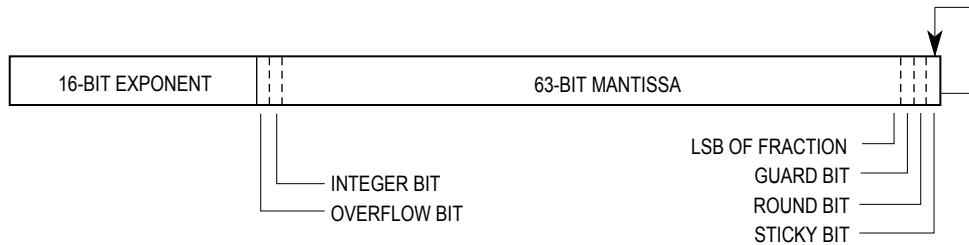

The diagram illustrates the Intermediate Result Format. It consists of a horizontal bar representing the 67-bit mantissa, preceded by a vertical bar for the 16-bit exponent. The mantissa is divided into several sections: an 'INTEGER BIT' (the leftmost bit), an 'OVERFLOW BIT' (the second bit), and the 'LSB OF FRACTION' (the remaining 64 bits). The 'LSB OF FRACTION' section is further divided into 'GUARD BIT', 'ROUND BIT', and 'STICKY BIT'. A vertical arrow points to the rightmost bit of the mantissa, indicating the 'LSB OF FRACTION'.

Diagram of the Intermediate Result Format showing a 16-bit exponent and a 63-bit mantissa. The mantissa is divided into an integer bit, an overflow bit, and the LSB of the fraction (guard, round, and sticky bits).

**Figure 3-1. Intermediate Result Format**

If the destination is a floating-point data register, the result is in the extended-precision format and is rounded to the precision specified by the FPSR PREC bits before being stored. All mantissa bits beyond the selected precision are zero. If the single- or double-precision mode is selected, the exponent value is in the correct range even if it is stored in extended-precision format. If the destination is a memory location, the FPSR PREC bits are ignored. In this case, a number in the extended-precision format is taken from the source floating-point data register, rounded to the destination format precision, and then written to memory.

Depending on the selected rounding mode or destination data format in effect, the location of the least significant bit of the mantissa and the locations of the guard, round, and sticky bits in the 67-bit intermediate result mantissa varies. The guard and round bits are always calculated exactly. The sticky bit is used to create the illusion of an infinitely wide intermediate result. As the arrow illustrates in Figure 3-1, the sticky bit is the logical OR of all the bits in the infinitely precise result to the right of the round bit. During the calculation stage of an arithmetic operation, any non-zero bits generated that are to the right of the round bit set the sticky bit to one. Because of the sticky bit, the rounded intermediate result for all required IEEE arithmetic operations in the RN mode is in error by no more than one half unit in the last place.

### 3.5.2 Rounding the Result

The FPU supports the four rounding modes specified by the IEEE 754 standard. These modes are round to nearest (RN), round toward zero (RZ), round toward plus infinity (RP), and round toward minus infinity (RM). The RM and RP rounding modes are often referred to as "directed rounding modes" and are useful in interval arithmetic. Rounding is accomplished through the intermediate result. Single-precision results are rounded to a 24-bit boundary; double-precision results are rounded to a 53-bit boundary; and extended-precision results are rounded to a 64-bit boundary. Table 3-21 lists the encodings for the FPCR that denote the rounding and precision modes.

**Table 3-21. FPCR Encodings**

| Rounding Mode<br>(RND Field) | Encoding |   | Rounding Precision<br>(PREC Field) |
|------------------------------|----------|---|------------------------------------|
|                              | 0        | 1 |                                    |
| To Nearest (RN)              | 0        | 0 | Extend (X)                         |
| To Zero (RZ)                 | 0        | 1 | Single (S)                         |
| To Minus Infinity (RM)       | 1        | 0 | Double (D)                         |
| To Plus Infinity (RP)        | 1        | 1 | Undefined                          |

Rounding the intermediate result's mantissa to the specified precision and checking the 16-bit intermediate exponent to ensure that it is within the representable range of the selected rounding precision accomplishes range control. Range control is a method used to assure correct emulation of a device that only supports single- or double-precision arithmetic. If the intermediate result's exponent exceeds the range of the selected precision, the exponent value appropriate for an underflow or overflow is stored as the result in the 16-bit extended-precision format exponent. For example, if the data format and rounding mode is single precision RM and the result of an arithmetic operation overflows the magnitude of the single-precision format, the largest normalized single-precision value is stored as an extended-precision number in the destination floating-point data register (i.e., an unbiased 15-bit exponent of \$00FF and a mantissa of \$FFFFFF000000000). If an infinity is the appropriate result for an underflow or overflow, the infinity value for the destination data format is stored as the result (i.e., an exponent with the maximum value and a mantissa of zero).

Figure 3-2 illustrates the algorithm that the FPU uses to round an intermediate result to the selected rounding precision and destination data format. If the destination is a floating-point register, either the selected rounding precision specified by the FPCR PREC status byte or by the instruction itself determines the rounding boundary. For example, FSADD and FDADD specify single- and double-precision rounding regardless of the precision specified in the FPCR PREC status byte. If the destination is external memory or an integer data register, the destination data format determines the rounding boundary. If the rounded result of an operation is not exact, then the INEX2 bit is set in the FPSR EXC status byte.


```

graph TD
    ENTRY([ENTRY]) --> INEX2[INEX2]
    INEX2 --> SELECT_ROUNDING_MODE[SELECT ROUNDING MODE]
    SELECT_ROUNDING_MODE --> RN(( ))
    SELECT_ROUNDING_MODE --> RM(( ))
    SELECT_ROUNDING_MODE --> RP(( ))
    SELECT_ROUNDING_MODE --> RZ(( ))

    RN --> RN_COND{ }
    RN_COND -- "GUARD AND LSB = 1, ROUND AND STICKY = 0 OR GUARD = 1 ROUND OR STICKY = 1" --> ADD1_TO_LSB1[ADD 1 TO LSB]
    ADD1_TO_LSB1 --> CONV1(( ))
    RN_COND --> CONV1

    RM --> RM_COND{ }
    RM_COND -- POS --> RM_INTERMEDIATE[INTERMEDIATE RESULT]
    RM_COND -- NEG --> RM_ADD1[ADD 1 TO LSB]
    RM_ADD1 --> CONV2(( ))
    RM_INTERMEDIATE --> CONV2

    RP --> RP_COND{ }
    RP_COND -- POS --> RP_INTERMEDIATE[INTERMEDIATE RESULT]
    RP_COND -- NEG --> RP_ADD1[ADD 1 TO LSB]
    RP_ADD1 --> CONV3(( ))
    RP_INTERMEDIATE --> CONV3

    RZ --> RZ_COND{ }
    RZ_COND --> RZ_CHOPPED[GUARD, ROUND, AND STICKY ARE CHOPPED]
    RZ_CHOPPED --> CONV4(( ))

    CONV1 --> CONV2
    CONV2 --> CONV3
    CONV3 --> CONV4

    CONV4 --> CONV5(( ))
    CONV5 --> OVERFLOW_CHECK{ }
    OVERFLOW_CHECK -- "OVERFLOW = 1" --> SHIFT_MANTISSA[SHIFT MANTISSA RIGHT 1 BIT, ADD 1 TO EXPONENT]
    SHIFT_MANTISSA --> CONV6(( ))

    CONV6 --> GUARD_ROUND_STICKY[GUARD = 0 ROUND = 0 STICKY = 0]
    GUARD_ROUND_STICKY --> EXIT1([EXIT])

    CONV4 --> EXACT_RESULT[EXACT RESULT]
    EXACT_RESULT --> EXIT2([EXIT])
  
```

Flowchart of the Rounding Algorithm. The process starts at ENTRY, followed by INEX2 and SELECT ROUNDING MODE. It then branches into four paths: RN, RM, RP, and RZ. Each path involves intermediate results and rounding logic (ADD 1 TO LSB or GUARD, ROUND, AND STICKY ARE CHOPPED). The paths converge, and if OVERFLOW = 1, the mantissa is shifted right and the exponent is incremented. Finally, the GUARD, ROUND, and STICKY bits are set to 0, leading to EXIT. An EXACT RESULT path also leads to EXIT.

**Figure 3-2. Rounding Algorithm Flowchart**

The three additional bits beyond the extended-precision format, the difference between the intermediate result's 67-bit mantissa and the storing result's 64-bit mantissa, allow the FPU to perform all calculations as though it were performing calculations using a float engine with infinite bit prec. The result is always correct for the specified destination's data format before performing rounding (unless an overflow or underflow error occurs). The specified rounding operation then produces a number that is as close as possible to the infinitely precise

intermediate value and still representable in the The following tie-case example shows how the 67-bit mantissa allows the FPU to meet the error bound of the IEEE specification:

| Result             | Integer | 63-Bit Fraction | Guard | Round | Sticky |
|--------------------|---------|-----------------|-------|-------|--------|
| Intermediate       | x       | xxx...x00       | 1     | 0     | 0      |
| Rounded-to-Nearest | x       | xxx...x00       | 0     | 0     | 0      |

The LSB of the rounded result does not increment though the guard bit is set in the intermediate result. The IEEE 754 standard specifies that tie cases should be handled in this manner. If the destination data format is extended and there is a difference between the infinitely precise intermediate result and the round-to-nearest result, the relative difference is  $2^{-64}$  (the value of the guard bit). This error is equal to half of the least significant bit's value and is the worst case error that can be introduced when using the RN mode. Thus, the term one-half unit in the last place correctly identifies the error bound for this operation. This error specification is the relative error present in the result; the absolute error bound is equal to  $2^{\text{exponent}} \times 2^{-64}$ . The following example shows the error bound for the other rounding modes:

| Result             | Integer | 63-Bit Fraction | Guard | Round | Sticky |
|--------------------|---------|-----------------|-------|-------|--------|
| Intermediate       | x       | xxx...x00       | 1     | 1     | 1      |
| Rounded-to-Nearest | x       | xxx...x00       | 0     | 0     | 0      |

The difference between the infinitely precise result and the rounded result is  $2^{-64} + 2^{-65} + 2^{-66}$ , which is slightly less than  $2^{-63}$  (the value of the LSB). Thus, the error bound for this operation is not more than one unit in the last place. For all arithmetic operations, the FPU meets these error bounds, providing accurate and repeatable results.

### 3.6 FLOATING-POINT POSTPROCESSING

Most operations end with a postprocessing step. The FPU provides two steps in postprocessing. First, the condition code bits in the FPSR are set or cleared at the end of each arithmetic operation or move operation to a single floating-point data register. The condition code bits are consistently set based on the result of the operation. Second, the FPU supports 32 conditional tests that allow floating-point conditional instructions to test floating-point conditions in exactly the same way as the integer conditional instructions test the integer condition code The combination of consistently set condition code bits and the simple programming of conditional instructions gives the processor a very flexible, high-performance method of altering program flow based on floating-point results. While reading the summary for each instruction, it should be assumed that an instruction performs postprocessing unless the summary specifically states that the instruction does not do so. The following paragraphs describe postprocessing in detail.

### 3.6.1 Underflow, Round, Overflow

During the calculation of an arithmetic result, the FPU arithmetic logic unit (ALU) has more precision and range than the 80-bit extended precision format. However, the final result of these operations is an extended-precision floating-point value. In some cases, an intermediate result becomes either smaller or larger than can be represented in extended precision. Also, the operation can generate a larger exponent or more bits of precision than can be represented in the chosen rounding precision. For these reasons, every arithmetic instruction ends by rounding the result and checking for overflow and underflow.

At the completion of an arithmetic operation, the intermediate result is checked to see if it is too small to be represented as a normalized number in the selected precision. If so, the underflow (UNFL) bit is set in the FPSR EXC byte. It is also denormalized unless denormalization provides a zero value. Denormalizing a number causes a loss of accuracy, but a zero is not returned unless absolutely necessary. If a number is grossly underflowed, the FPU returns a zero or the smallest denormalized number with the correct sign, depending on the rounding mode in effect.

If no underflow occurs, the intermediate result is rounded according to the user-selected rounding precision and rounding mode. After rounding, the inexact bit (INEX2) is set appropriately. Lastly, the magnitude of the result is checked to see if it is too large to be represented in the current rounding precision. If so, the overflow (OVFL) bit is set and a correctly signed infinity or correctly signed largest normalized number is returned, depending on the rounding mode in effect.

### 3.6.2 Conditional Testing

Unlike the integer arithmetic condition codes, an instruction either always sets the floating-point condition codes in the same way or it does not change them at all. Therefore, the instruction descriptions do not include floating-point condition code settings. The following paragraphs describe how floating-point condition codes are set for all instructions that modify condition codes.

The condition code bits differ slightly from the integer condition codes. Unlike the operation type dependent integer condition codes, examining the result at the end of the operation sets or clears the floating-point condition codes accordingly. The M68000 family integer condition codes bits N and Z have this characteristic, but the V and C bits are set differently for different instructions. The data type of the operation's result determines how the four condition code bits are set. Table 3-22 lists the condition code bit setting for each data type. Loading the FPCC with one of the other combinations and executing a conditional instruction can produce an unexpected branch condition.

**Table 3-22. FPCC Encodings**

| Data Type                    | N | Z | I | NAN |
|------------------------------|---|---|---|-----|
| + Normalized or Denormalized | 0 | 0 | 0 | 0   |
| - Normalized or Denormalized | 1 | 0 | 0 | 0   |
| + 0                          | 0 | 1 | 0 | 0   |
| - 0                          | 1 | 1 | 0 | 0   |
| + Infinity                   | 0 | 0 | 1 | 0   |
| - Infinity                   | 1 | 0 | 1 | 0   |
| + NAN                        | 0 | 0 | 0 | 1   |
| - NAN                        | 1 | 0 | 0 | 1   |

The inclusion of the NAN data type in the IEEE floating-point number system requires each conditional test to include the NAN condition code bit in its Boolean equation. Because a comparison of a NAN with any other data type is unordered (i.e., it is impossible to determine if a NAN is bigger or smaller than an in-range number), the compare instruction sets the NAN condition code bit when an unordered compare is attempted. All arithmetic instructions also set the NAN bit if the result of an operation is a NAN. The conditional instructions interpret the NAN condition code bit equal to one as the unordered condition.

The IEEE 754 standard defines four conditions: equal to (EQ), greater than (GT), less than (LT), and unordered (UN). In addition, the standard only requires the generation of the condition codes as a result of a floating-point compare operation. The FPU can test these conditions at the end of any operation affecting the condition codes. For purposes of the floating-point conditional branch, set byte on condition, decrement and branch on condition, and trap on condition instructions, the processor logically combines the four FPCC condition codes to form 32 conditional tests. There are three main categories of conditional tests: IEEE nonaware tests, IEEE aware tests, and miscellaneous. The set of IEEE nonaware tests is best used:

- when porting a program from a system that does not support the IEEE standard to a conforming system, or
- when generating high-level language code that does not support IEEE floating-point concepts (i.e., the unordered condition).

The 32 conditional tests are separated into two groups; 16 that cause an exception if an unordered condition is present when the conditional test is attempted and 16 that do not cause an exception. An unordered condition occurs when one or both of the operands in a floating-point compare operation The inclusion of the unordered condition in floating-point branches destroys the familiar trichotomy relationship (greater than, equal, less than) that exists for integers. For example, the opposite of floating-point branch greater than (FBGT) is not floating-point branch less than or equal (FBLE). Rather, the opposite condition is floating-point branch not greater than (FBNGT). If the result of the previous instruction was unordered, FBNGT is true; whereas, both FBGT and FBLE would be false since unordered fails both of these tests (and sets BSUN). Compiler programmers should be particularly careful of the lack of trichotomy in the floating-point branches since it is common for compilers to invert the sense of conditions.

When using the IEEE nonaware tests, the user receives a BSUN exception whenever a branch is attempted and the NAN condition code bit is set, unless the branch is an FBEQ or an FBNE. If the BSUN exception is enabled in the FPCR, the exception causes another exception. Therefore, the IEEE nonaware program is interrupted if an unexpected condition occurs. Compilers and programmers who are knowledgeable of the IEEE 754 standard should use the IEEE aware tests in programs that contain ordered and unordered conditions. Since the ordered or unordered attribute is explicitly included in the conditional test, the BSUN bit is not set in the FPSR EXC byte when the unordered condition occurs. Table 3-23 summarizes the conditional mnemonics, definitions, equations, predicates, and whether the BSUN bit is set in the FPSR EXC byte for the 32 floating-point conditional tests. The equation column lists the combination of FPCC bits for each test in the form of an equation. All condition codes with an overbar indicate cleared bits; all other bits are set.

**Table 3-23. Floating-Point Conditional Tests**

| Mnemonic                   | Definition                    | Equation                                          | Predicate | BSUN Bit Set |
|----------------------------|-------------------------------|---------------------------------------------------|-----------|--------------|
| <b>IEEE Nonaware Tests</b> |                               |                                                   |           |              |
| EQ                         | Equal                         | Z                                                 | 000001    | No           |
| NE                         | Not Equal                     | $\bar{Z}$                                         | 001110    | No           |
| GT                         | Greater Than                  | $\overline{\text{NAN}} \lor \bar{Z} \lor \bar{N}$ | 010010    | Yes          |
| NGT                        | Not Greater Than              | $\text{NAN} \lor Z \lor N$                        | 011101    | Yes          |
| GE                         | Greater Than or Equal         | $Z \lor (\overline{\text{NAN}} \lor \bar{N})$     | 010011    | Yes          |
| NGE                        | Not Greater Than or Equal     | $\text{NAN} \lor (N \land \bar{Z})$               | 011100    | Yes          |
| LT                         | Less Than                     | $N \land (\overline{\text{NAN}} \lor \bar{Z})$    | 010100    | Yes          |
| NLT                        | Not Less Than                 | $\text{NAN} \lor (Z \lor \bar{N})$                | 011011    | Yes          |
| LE                         | Less Than or Equal            | $Z \lor (N \land \overline{\text{NAN}})$          | 010101    | Yes          |
| NLE                        | Not Less Than or Equal        | $\text{NAN} \lor (\bar{N} \lor \bar{Z})$          | 011010    | Yes          |
| GL                         | Greater or Less Than          | $\overline{\text{NAN}} \lor \bar{Z}$              | 010110    | Yes          |
| NGL                        | Not Greater or Less Than      | $\text{NAN} \lor Z$                               | 011001    | Yes          |
| GLE                        | Greater, Less or Equal        | NAN                                               | 010111    | Yes          |
| NGLE                       | Not Greater, Less or Equal    | NAN                                               | 011000    | Yes          |
| <b>IEEE Aware Tests</b>    |                               |                                                   |           |              |
| EQ                         | Equal                         | Z                                                 | 000001    | No           |
| NE                         | Not Equal                     | $\bar{Z}$                                         | 001110    | No           |
| OGT                        | Ordered Greater Than          | $\overline{\text{NAN}} \lor \bar{Z} \lor \bar{N}$ | 000010    | No           |
| ULE                        | Unordered or Less or Equal    | $\text{NAN} \lor Z \lor N$                        | 001101    | No           |
| OGE                        | Ordered Greater Than or Equal | $Z \lor (\overline{\text{NAN}} \lor \bar{N})$     | 000011    | No           |
| ULT                        | Unordered or Less Than        | $\text{NAN} \lor (N \land \bar{Z})$               | 001100    | No           |
| OLT                        | Ordered Less Than             | $N \land (\overline{\text{NAN}} \lor \bar{Z})$    | 000100    | No           |
| UGE                        | Unordered or Greater or Equal | $\text{NAN} \lor Z \lor N$                        | 001011    | No           |
| OLE                        | Ordered Less Than or Equal    | $Z \lor (N \land \overline{\text{NAN}})$          | 000101    | No           |
| UGT                        | Unordered or Greater Than     | $\text{NAN} \lor (\bar{N} \lor \bar{Z})$          | 001010    | No           |
| OGL                        | Ordered Greater or Less Than  | $\overline{\text{NAN}} \lor \bar{Z}$              | 000110    | No           |
| UEQ                        | Unordered or Equal            | $\text{NAN} \lor Z$                               | 001001    | No           |
| OR                         | Ordered                       | NAN                                               | 000111    | No           |
| UN                         | Unordered                     | NAN                                               | 001000    | No           |
| <b>Miscellaneous Tests</b> |                               |                                                   |           |              |
| F                          | False                         | False                                             | 000000    | No           |
| T                          | True                          | True                                              | 001111    | No           |
| SF                         | Signaling False               | False                                             | 010000    | Yes          |
| ST                         | Signaling True                | True                                              | 011111    | Yes          |
| SEQ                        | Signaling Equal               | Z                                                 | 010001    | Yes          |
| SNE                        | Signaling Not Equal           | $\bar{Z}$                                         | 011110    | Yes          |

### 3.7 INSTRUCTION DESCRIPTIONS

Section 4, 5, 6, and 7 contain detailed information about each instruction in the M68000 family instruction set. Each section arranges the instruction in alphabetical order by instruction mnemonic and includes descriptions of the instruction's notation and format. Figure 3-3 illustrates the format of the instruction descriptions. Note that the illustration is an amalgamation of the various parts that make up an instruction description. Instruction descriptions for the integer unit differ slightly from those for the floating-point unit; i.e. there are no operation tables included for integer unit instruction descriptions.

The size attribute line specifies the size of the operands of an instruction. When an instruction uses operands of more than one size, the mnemonic of the instruction includes a suffix such as:

- .B—Byte Operands
- .W—Word Operands
- .L—Long-Word Operands
- .S—Single-Precision Real Operands
- .D—Double-Precision Real Operands
- .X—Extended-Precision Real Operands
- .P—Packed BCD Real Operands

The instruction format specifies the bit pattern and fields of the operation and command words, and any other words that are always part of the instruction. The effective address extensions are not explicitly illustrated. The extension words, if any, follow immediately after the illustrated portions of the instructions.

| INSTRUCTION NAME                                                     | <b>ABCD</b>                | Add Decimal with Ex<br>(MC68020, MC68030)                                                                                                                                                                                                                                                                      |                  |        |        |    |    |    |   |   |   |   |   |  |   |   |   |                  |  |  |
|----------------------------------------------------------------------|----------------------------|----------------------------------------------------------------------------------------------------------------------------------------------------------------------------------------------------------------------------------------------------------------------------------------------------------------|------------------|--------|--------|----|----|----|---|---|---|---|---|--|---|---|---|------------------|--|--|
| APPLICABLE PROCESSORS                                                |                            |                                                                                                                                                                                                                                                                                                                |                  |        |        |    |    |    |   |   |   |   |   |  |   |   |   |                  |  |  |
| OPERATION DESCRIPTION                                                | <b>Operation:</b>          | Absolute value of s                                                                                                                                                                                                                                                                                            |                  |        |        |    |    |    |   |   |   |   |   |  |   |   |   |                  |  |  |
| INSTRUCTION'S ASSEMBLER SYNTAX                                       | <b>Assembler System:</b>   | FABSXfm tx <ee<br>FABSX FPm<br>FABSX FPn                                                                                                                                                                                                                                                                       |                  |        |        |    |    |    |   |   |   |   |   |  |   |   |   |                  |  |  |
| SIZE ATTRIBUTE                                                       | <b>Attributes:</b>         | Forms = (Byte, Word,                                                                                                                                                                                                                                                                                           |                  |        |        |    |    |    |   |   |   |   |   |  |   |   |   |                  |  |  |
| TEXT DESCRIPTION OF INSTRUCTION OPERATION                            | <b>Description:</b>        | Converts the source c<br>absolute value of that                                                                                                                                                                                                                                                                |                  |        |        |    |    |    |   |   |   |   |   |  |   |   |   |                  |  |  |
| APPLICABLE RESULT OF FLOATING-POINT OPERATION                        | <b>Operation Table:</b>    | <table border="1"> <thead> <tr> <th>Destination</th> <th>Source</th> </tr> </thead> <tbody> <tr> <td>Result</td> <td>A</td> </tr> </tbody> </table> <p>NOTE: If the source operation</p>                                                                                                                       | Destination      | Source | Result | A  |    |    |   |   |   |   |   |  |   |   |   |                  |  |  |
| Destination                                                          | Source                     |                                                                                                                                                                                                                                                                                                                |                  |        |        |    |    |    |   |   |   |   |   |  |   |   |   |                  |  |  |
| Result                                                               | A                          |                                                                                                                                                                                                                                                                                                                |                  |        |        |    |    |    |   |   |   |   |   |  |   |   |   |                  |  |  |
| EFFECTS ON INTEGER CONDITION CODES OR FLOATING-POINT STATUS REGISTER | <b>Status Register:</b>    | <p>Condition Codes: Affected by<br/>Quotient Byte: Not Affected<br/>Exception Byte: BSUN<br/>SNAN<br/>OPERR<br/>OVRL</p> <p>Accrued Exception Byte:</p>                                                                                                                                                        |                  |        |        |    |    |    |   |   |   |   |   |  |   |   |   |                  |  |  |
| INSTRUCTION FORMAT                                                   | <b>Instruction Format:</b> | <table border="1"> <thead> <tr> <th>15</th> <th>14</th> <th>13</th> <th>12</th> <th>11</th> <th>10</th> </tr> </thead> <tbody> <tr> <td>0</td> <td>1</td> <td>1</td> <td>1</td> <td>1</td> <td></td> </tr> <tr> <td>1</td> <td>0</td> <td>0</td> <td colspan="3">SOURCE SPECIFIER</td> </tr> </tbody> </table> | 15               | 14     | 13     | 12 | 11 | 10 | 0 | 1 | 1 | 1 | 1 |  | 1 | 0 | 0 | SOURCE SPECIFIER |  |  |
| 15                                                                   | 14                         | 13                                                                                                                                                                                                                                                                                                             | 12               | 11     | 10     |    |    |    |   |   |   |   |   |  |   |   |   |                  |  |  |
| 0                                                                    | 1                          | 1                                                                                                                                                                                                                                                                                                              | 1                | 1      |        |    |    |    |   |   |   |   |   |  |   |   |   |                  |  |  |
| 1                                                                    | 0                          | 0                                                                                                                                                                                                                                                                                                              | SOURCE SPECIFIER |        |        |    |    |    |   |   |   |   |   |  |   |   |   |                  |  |  |
| DEFINITIONS AND ALLOWED VALUES FOR THE INSTRUCTION FORMAT FIELDS     | <b>Instruction Fields:</b> | Effective Address Field - Determines                                                                                                                                                                                                                                                                           |                  |        |        |    |    |    |   |   |   |   |   |  |   |   |   |                  |  |  |

**Figure 3-3. Instruction Description Format**

## SECTION 4 INTEGER INSTRUCTIONS

This section contains detailed information about the integer instructions for the M68000 family. A detailed discussion of each instruction description is arranged in alphabetical order by instruction mnemonic.

Each instruction description identifies the differences among the M68000 family for that instruction. Noted under the title of the instruction are all specific processors that apply to that instruction—for example:

### Test Bit Field and Change (MC68030, MC68040)

The MC68HC000 is identical to the MC68000 except for power dissipation; therefore, all instructions that apply to the MC68000 also apply to the MC68HC000. All references to the MC68000, MC68020, and MC68030 include references to the corresponding embedded controllers, MC68EC000, MC68EC020, and MC68EC030. All references to the MC68040 include the MC68LC040 and MC68EC040. This referencing applies throughout this section unless otherwise specified.

Identified within the paragraphs are the specific processors that use different instruction fields, instruction formats, etc.—for example:

#### MC68020, MC68030, and MC68040 only

|            |     |                |              |     |     |
|------------|-----|----------------|--------------|-----|-----|
| (bd,An,Xn) | 110 | reg. number:An | (bd,PC,Xn)** | 111 | 011 |
|------------|-----|----------------|--------------|-----|-----|

\*\*Can be used with CPU32 processor

**Appendix A Processor Instruction Summary** provides a listing of all processors and the instructions that apply to them for quick reference.

**ABCD****Add Decimal with Extend  
(M68000 Family)****ABCD**

**Operation:** Source10 + Destination10 + X → Destination

**Assembler Syntax:** ABCD Dy,Dx  
ABCD – (Ay), – (Ax)

**Attributes:** Size = (Byte)

**Description:** Adds the source operand to the destination operand along with the extend bit, and stores the result in the destination location. The addition is performed using binary-coded decimal arithmetic. The operands, which are packed binary-coded decimal numbers, can be addressed in two different ways:

1. Data Register to Data Register: The operands are contained in the data registers specified in the instruction.
2. Memory to Memory: The operands are addressed with the predecrement addressing mode using the address registers specified in the instruction.

This operation is a byte operation only.

**Condition Codes:**

| X | N | Z | V | C |
|---|---|---|---|---|
| * | U | * | U | * |

- X — Set the same as the carry bit.  
 N — Undefined.  
 Z — Cleared if the result is nonzero; unchanged otherwise.  
 V — Undefined.  
 C — Set if a decimal carry was generated; cleared otherwise.

**NOTE**

Normally, the Z condition code bit is set via programming before the start of an operation. This allows successful tests for zero results upon completion of multiple-precision operations.

**ABCD****Add Decimal with Extend**  
(M68000 Family)**ABCD****Instruction Format:**

| 15 | 14 | 13 | 12 | 11          | 10 | 9 | 8 | 7 | 6 | 5 | 4 | 3   | 2           | 1 | 0 |
|----|----|----|----|-------------|----|---|---|---|---|---|---|-----|-------------|---|---|
| 1  | 1  | 0  | 0  | REGISTER Rx |    |   | 1 | 0 | 0 | 0 | 0 | R/M | REGISTER Ry |   |   |

**Instruction Fields:**

Register Rx field—Specifies the destination register.

If R/M = 0, specifies a data register.

If R/M = 1, specifies an address register for the predecrement addressing mode.

R/M field—Specifies the operand addressing mode.

0 — The operation is data register to data register.

1 — The operation is memory to memory.

Register Ry field—Specifies the source register.

If R/M = 0, specifies a data register.

If R/M = 1, specifies an address register for the predecrement addressing mode.

**ADD****Add**  
(M68000 Family)**ADD****Operation:** Source + Destination → Destination**Assembler Syntax:** ADD < ea > ,Dn  
ADD Dn, < ea >**Attributes:** Size = (Byte, Word, Long)**Description:** Adds the source operand to the destination operand using binary addition and stores the result in the destination location. The size of the operation may be specified as byte, word, or long. The mode of the instruction indicates which operand is the source and which is the destination, as well as the operand size.**Condition Codes:**

| X | N | Z | V | C |
|---|---|---|---|---|
| * | * | * | * | * |

X — Set the same as the carry bit.  
 N — Set if the result is negative; cleared otherwise.  
 Z — Set if the result is zero; cleared otherwise.  
 V — Set if an overflow is generated; cleared otherwise.  
 C — Set if a carry is generated; cleared otherwise.

**Instruction Format:**

| 15 | 14 | 13 | 12 | 11       | 10 | 9 | 8      | 7 | 6 | 5                         | 4 | 3 | 2        | 1 | 0 |
|----|----|----|----|----------|----|---|--------|---|---|---------------------------|---|---|----------|---|---|
| 1  | 1  | 0  | 1  | REGISTER |    |   | OPMODE |   |   | EFFECTIVE ADDRESS<br>MODE |   |   | REGISTER |   |   |

**ADD**
**Add**  
**(M68000 Family)**
**ADD**
**Instruction Fields:**

Register field—Specifies any of the eight data registers.

Opmode field

| Byte | Word | Long | Operation                                                                     |
|------|------|------|-------------------------------------------------------------------------------|
| 000  | 001  | 010  | $\langle \text{ea} \rangle + \text{Dn} \rightarrow \text{Dn}$                 |
| 100  | 101  | 110  | $\text{Dn} + \langle \text{ea} \rangle \rightarrow \langle \text{ea} \rangle$ |

Effective Address field—Determines addressing mode.

- a. If the location specified is a source operand, all addressing modes can be used as listed in the following tables:

| Addressing Mode         | Mode | Register       |
|-------------------------|------|----------------|
| Dn                      | 000  | reg. number:Dn |
| An*                     | 001  | reg. number:An |
| (An)                    | 010  | reg. number:An |
| (An) +                  | 011  | reg. number:An |
| – (An)                  | 100  | reg. number:An |
| (d <sub>16</sub> ,An)   | 101  | reg. number:An |
| (d <sub>8</sub> ,An,Xn) | 110  | reg. number:An |

| Addressing Mode         | Mode | Register |
|-------------------------|------|----------|
| (xxx).W                 | 111  | 000      |
| (xxx).L                 | 111  | 001      |
| #<data>                 | 111  | 100      |
|                         |      |          |
|                         |      |          |
| (d <sub>16</sub> ,PC)   | 111  | 010      |
| (d <sub>8</sub> ,PC,Xn) | 111  | 011      |

**MC68020, MC68030, and MC68040 only**

|                 |     |                |                 |     |     |
|-----------------|-----|----------------|-----------------|-----|-----|
| (bd,An,Xn)**    | 110 | reg. number:An | (bd,PC,Xn)†     | 111 | 011 |
| ((bd,An,Xn),od) | 110 | reg. number:An | ((bd,PC,Xn),od) | 111 | 011 |
| ((bd,An),Xn,od) | 110 | reg. number:An | ((bd,PC],Xn,od) | 111 | 011 |

\*Word and long only

\*\*Can be used with CPU32.

**ADD****Add**  
(M68000 Family)**ADD**

b. If the location specified is a destination operand, only memory alterable addressing modes can be used as listed in the following tables:

| Addressing Mode         | Mode | Register       |
|-------------------------|------|----------------|
| Dn                      | —    | —              |
| An                      | —    | —              |
| (An)                    | 010  | reg. number:An |
| (An) +                  | 011  | reg. number:An |
| – (An)                  | 100  | reg. number:An |
| (d <sub>16</sub> ,An)   | 101  | reg. number:An |
| (d <sub>8</sub> ,An,Xn) | 110  | reg. number:An |

| Addressing Mode         | Mode | Register |
|-------------------------|------|----------|
| (xxx).W                 | 111  | 000      |
| (xxx).L                 | 111  | 001      |
| #<data>                 | —    | —        |
|                         |      |          |
|                         |      |          |
| (d <sub>16</sub> ,PC)   | —    | —        |
| (d <sub>8</sub> ,PC,Xn) | —    | —        |

**MC68020, MC68030, and MC68040 only**

|                 |     |                |
|-----------------|-----|----------------|
| (bd,An,Xn)*     | 110 | reg. number:An |
| [(bd,An,Xn],od) | 110 | reg. number:An |
| [(bd,An],Xn,od) | 110 | reg. number:An |

|                 |   |   |
|-----------------|---|---|
| (bd,PC,Xn)*     | — | — |
| [(bd,PC,Xn],od) | — | — |
| [(bd,PC],Xn,od) | — | — |

\*Can be used with CPU32

**NOTE**

The Dn mode is used when the destination is a data register; the destination < ea > mode is invalid for a data register.

ADDA is used when the destination is an address register. ADDI and ADDQ are used when the source is immediate data. Most assemblers automatically make this distinction.

**ADDA****Add Address**  
(M68000 Family)**ADDA**

**Operation:** Source + Destination → Destination

**Assembler Syntax:** ADDA < ea > , An

**Attributes:** Size = (Word, Long)

**Description:** Adds the source operand to the destination address register and stores the result in the address register. The size of the operation may be specified as word or long. The entire destination address register is used regardless of the operation size.

**Condition Codes:**

Not affected.

**Instruction Format:**

| 15 | 14 | 13 | 12 | 11       | 10 | 9      | 8 | 7                 | 6 | 5    | 4 | 3        | 2 | 1 | 0 |
|----|----|----|----|----------|----|--------|---|-------------------|---|------|---|----------|---|---|---|
| 1  | 1  | 0  | 1  | REGISTER |    | OPMODE |   | EFFECTIVE ADDRESS |   | MODE |   | REGISTER |   |   |   |

**Instruction Fields:**

Register field—Specifies any of the eight address registers. This is always the destination.

Opmode field—Specifies the size of the operation.

011—Word operation; the source operand is sign-extended to a long operand and the operation is performed on the address register using all 32 bits.

111—Long operation.

# ADDA

## Add Address (M68000 Family)

# ADDA

Effective Address field—Specifies the source operand. All addressing modes can be used as listed in the following tables:

| Addressing Mode         | Mode | Register       |
|-------------------------|------|----------------|
| Dn                      | 000  | reg. number:Dn |
| An                      | 001  | reg. number:An |
| (An)                    | 010  | reg. number:An |
| (An) +                  | 011  | reg. number:An |
| – (An)                  | 100  | reg. number:An |
| (d <sub>16</sub> ,An)   | 101  | reg. number:An |
| (d <sub>8</sub> ,An,Xn) | 110  | reg. number:An |

| Addressing Mode         | Mode | Register |
|-------------------------|------|----------|
| (xxx).W                 | 111  | 000      |
| (xxx).L                 | 111  | 001      |
| #<data>                 | 111  | 100      |
|                         |      |          |
|                         |      |          |
| (d <sub>16</sub> ,PC)   | 111  | 010      |
| (d <sub>8</sub> ,PC,Xn) | 111  | 011      |

### MC68020, MC68030, and MC68040 only

|                 |     |                |
|-----------------|-----|----------------|
| (bd,An,Xn)*     | 110 | reg. number:An |
| ((bd,An,Xn),od) | 110 | reg. number:An |
| ((bd,An],Xn,od) | 110 | reg. number:An |

|                 |     |     |
|-----------------|-----|-----|
| (bd,PC,Xn)*     | 111 | 011 |
| ((bd,PC,Xn],od) | 111 | 011 |
| ((bd,PC],Xn,od) | 111 | 011 |

\*Can be used with CPU32

# ADDI

## Add Immediate (M68000 Family)

# ADDI

**Operation:** Immediate Data + Destination → Destination

**Assembler Syntax:** ADDI # < data > , < ea >

**Attributes:** Size = (Byte, Word, Long)

**Description:** Adds the immediate data to the destination operand and stores the result in the destination location. The size of the operation may be specified as byte, word, or long. The size of the immediate data matches the operation size.

### Condition Codes:

| X | N | Z | V | C |
|---|---|---|---|---|
| * | * | * | * | * |

- X — Set the same as the carry bit.
- N — Set if the result is negative; cleared otherwise.
- Z — Set if the result is zero; cleared otherwise.
- V — Set if an overflow is generated; cleared otherwise.
- C — Set if a carry is generated; cleared otherwise.

### Instruction Format:

| 15 | 14 | 13 | 12 | 11 | 10 | 9 | 8 | 7                | 6 | 5                 | 4 | 3 | 2 | 1        | 0 |
|----|----|----|----|----|----|---|---|------------------|---|-------------------|---|---|---|----------|---|
| 0  | 0  | 0  | 0  | 0  | 1  | 1 | 0 | SIZE             |   | EFFECTIVE ADDRESS |   |   |   |          |   |
|    |    |    |    |    |    |   |   | 16-BIT WORD DATA |   | MODE              |   |   |   | REGISTER |   |
|    |    |    |    |    |    |   |   | 32-BIT LONG DATA |   | 8-BIT BYTE DATA   |   |   |   |          |   |

# ADDI

## Add Immediate (M68000 Family)

# ADDI

### Instruction Fields:

Size field—Specifies the size of the operation.

00 — Byte operation

01 — Word operation

10 — Long operation

Effective Address field—Specifies the destination operand. Only data alterable addressing modes can be used as listed in the following tables:

| Addressing Mode         | Mode | Register       |
|-------------------------|------|----------------|
| Dn                      | 000  | reg. number:Dn |
| An                      | —    | —              |
| (An)                    | 010  | reg. number:An |
| (An) +                  | 011  | reg. number:An |
| – (An)                  | 100  | reg. number:An |
| (d <sub>16</sub> ,An)   | 101  | reg. number:An |
| (d <sub>8</sub> ,An,Xn) | 110  | reg. number:An |

| Addressing Mode         | Mode | Register |
|-------------------------|------|----------|
| (xxx).W                 | 111  | 000      |
| (xxx).L                 | 111  | 001      |
| #<data>                 | —    | —        |
|                         |      |          |
|                         |      |          |
| (d <sub>16</sub> ,PC)   | —    | —        |
| (d <sub>8</sub> ,PC,Xn) | —    | —        |

#### MC68020, MC68030, and MC68040 only

|                 |     |                |
|-----------------|-----|----------------|
| (bd,An,Xn)*     | 110 | reg. number:An |
| [(bd,An,Xn),od] | 110 | reg. number:An |
| [(bd,An],Xn,od) | 110 | reg. number:An |

|                 |   |   |
|-----------------|---|---|
| (bd,PC,Xn)*     | — | — |
| [(bd,PC,Xn),od] | — | — |
| [(bd,PC],Xn,od) | — | — |

\*Can be used with CPU32

Immediate field—Data immediately following the instruction.

If size = 00, the data is the low-order byte of the immediate word.

If size = 01, the data is the entire immediate word.

If size = 10, the data is the next two immediate words.

**ADDQ****Add Quick**  
(M68000 Family)**ADDQ****Operation:** Immediate Data + Destination → Destination**Assembler Syntax:** ADDQ # < data > , < ea >**Attributes:** Size = (Byte, Word, Long)**Description:** Adds an immediate value of one to eight to the operand at the destination location. The size of the operation may be specified as byte, word, or long. Word and long operations are also allowed on the address registers. When adding to address registers, the condition codes are not altered, and the entire destination address register is used regardless of the operation size.**Condition Codes:**

| X | N | Z | V | C |
|---|---|---|---|---|
| * | * | * | * | * |

- X — Set the same as the carry bit.
- N — Set if the result is negative; cleared otherwise.
- Z — Set if the result is zero; cleared otherwise.
- V — Set if an overflow occurs; cleared otherwise.
- C — Set if a carry occurs; cleared otherwise.

The condition codes are not affected when the destination is an address register.

**Instruction Format:**

| 15 | 14 | 13 | 12 | 11   | 10 | 9 | 8 | 7    | 6 | 5                 | 4 | 3 | 2 | 1 | 0 |
|----|----|----|----|------|----|---|---|------|---|-------------------|---|---|---|---|---|
| 0  | 1  | 0  | 1  | DATA |    |   | 0 | SIZE |   | EFFECTIVE ADDRESS |   |   |   |   |   |
|    |    |    |    |      |    |   |   | MODE |   | REGISTER          |   |   |   |   |   |

# ADDQ

**Add Quick  
(M68000 Family)**

# ADDQ

## Instruction Fields:

**Data field**—Three bits of immediate data representing eight values (0 – 7), with the immediate value zero representing a value of eight.

**Size field**—Specifies the size of the operation.

00— Byte operation

01— Word operation

10— Long operation

**Effective Address field**—Specifies the destination location. Only alterable addressing modes can be used as listed in the following tables:

| Addressing Mode         | Mode | Register       | Addressing Mode         | Mode | Register |
|-------------------------|------|----------------|-------------------------|------|----------|
| Dn                      | 000  | reg. number:Dn | (xxx).W                 | 111  | 000      |
| An                      | 001  | reg. number:An | (xxx).L                 | 111  | 001      |
| (An)                    | 010  | reg. number:An | #<data>                 | —    | —        |
| (An) +                  | 011  | reg. number:An |                         |      |          |
| – (An)                  | 100  | reg. number:An |                         |      |          |
| (d <sub>16</sub> ,An)   | 101  | reg. number:An | (d <sub>16</sub> ,PC)   | —    | —        |
| (d <sub>8</sub> ,An,Xn) | 110  | reg. number:An | (d <sub>8</sub> ,PC,Xn) | —    | —        |

### MC68020, MC68030, and MC68040 only

|                 |     |                |                 |   |   |
|-----------------|-----|----------------|-----------------|---|---|
| (bd,An,Xn**)    | 110 | reg. number:An | (bd,PC,Xn)†     | — | — |
| ((bd,An,Xn],od) | 110 | reg. number:An | ((bd,PC,Xn],od) | — | — |
| ((bd,An],Xn,od) | 110 | reg. number:An | ((bd,PC],Xn,od) | — | — |

\*Word and long only.

\*\*Can be used with CPU32.

**ADDX****Add Extended**  
(M68000 Family)**ADDX**

**Operation:** Source + Destination + X → Destination

**Assembler Syntax:** ADDX Dy,Dx  
ADDX – (Ay), – (Ax)

**Attributes:** Size = (Byte, Word, Long)

**Description:** Adds the source operand and the extend bit to the destination operand and stores the result in the destination location. The operands can be addressed in two different ways:

1. Data register to data register—The data registers specified in the instruction contain the operands.
2. Memory to memory—The address registers specified in the instruction address the operands using the predecrement addressing mode.

The size of the operation can be specified as byte, word, or long.

**Condition Codes:**

| X | N | Z | V | C |
|---|---|---|---|---|
| * | * | * | * | * |

- X — Set the same as the carry bit.  
 N — Set if the result is negative; cleared otherwise.  
 Z — Cleared if the result is nonzero; unchanged otherwise.  
 V — Set if an overflow occurs; cleared otherwise.  
 C — Set if a carry is generated; cleared otherwise.

**NOTE**

Normally, the Z condition code bit is set via programming before the start of an operation. This allows successful tests for zero results upon completion of multiple-precision operations.

**ADDX****Add Extended**  
(M68000 Family)**ADDX****Instruction Format:**

| 15 | 14 | 13 | 12 | 11          | 10 | 9 | 8 | 7    | 6 | 5 | 4 | 3   | 2           | 1 | 0 |
|----|----|----|----|-------------|----|---|---|------|---|---|---|-----|-------------|---|---|
| 1  | 1  | 0  | 1  | REGISTER Rx |    |   | 1 | SIZE |   | 0 | 0 | R/M | REGISTER Ry |   |   |

**Instruction Fields:**

Register Rx field—Specifies the destination register.

If R/M = 0, specifies a data register.

If R/M = 1, specifies an address register for the predecrement addressing mode.

Size field—Specifies the size of the operation.

00 — Byte operation

01 — Word operation

10 — Long operation

R/M field—Specifies the operand address mode.

0 — The operation is data register to data register.

1 — The operation is memory to memory.

Register Ry field—Specifies the source register.

If R/M = 0, specifies a data register.

If R/M = 1, specifies an address register for the predecrement addressing mode.

# AND

## AND Logical (M68000 Family)

# AND

**Operation:** Source L Destination  $\to$  Destination

**Assembler Syntax:** AND < ea > ,Dn  
AND Dn, < ea >

**Attributes:** Size = (Byte, Word, Long)

**Description:** Performs an AND operation of the source operand with the destination operand and stores the result in the destination location. The size of the operation can be specified as byte, word, or long. The contents of an address register may not be used as an operand.

### Condition Codes:

| X | N | Z | V | C |
|---|---|---|---|---|
| — | * | * | 0 | 0 |

X — Not affected.

N — Set if the most significant bit of the result is set; cleared otherwise.

Z — Set if the result is zero; cleared otherwise.

V — Always cleared.

C — Always cleared.

### Instruction Format:

| 15 | 14 | 13 | 12 | 11       | 10 | 9      | 8 | 7                 | 6 | 5    | 4 | 3        | 2 | 1 | 0 |
|----|----|----|----|----------|----|--------|---|-------------------|---|------|---|----------|---|---|---|
| 1  | 1  | 0  | 0  | REGISTER |    | OPMODE |   | EFFECTIVE ADDRESS |   | MODE |   | REGISTER |   |   |   |

### Instruction Fields:

Register field—Specifies any of the eight data registers.

Opmode field

| Byte | Word | Long | Operation                       |
|------|------|------|---------------------------------|
| 000  | 001  | 010  | < ea > $\Delta$ Dn $\to$ Dn     |
| 100  | 101  | 110  | Dn $\Delta$ < ea > $\to$ < ea > |

**AND****AND Logical**  
(M68000 Family)**AND**

Effective Address field—Determines addressing mode.

- a. If the location specified is a source operand, only data addressing modes can be used as listed in the following tables:

| Addressing Mode         | Mode | Register       |
|-------------------------|------|----------------|
| Dn                      | 000  | reg. number:Dn |
| An                      | —    | —              |
| (An)                    | 010  | reg. number:An |
| (An) +                  | 011  | reg. number:An |
| – (An)                  | 100  | reg. number:An |
| (d <sub>16</sub> ,An)   | 101  | reg. number:An |
| (d <sub>8</sub> ,An,Xn) | 110  | reg. number:An |

| Addressing Mode         | Mode | Register |
|-------------------------|------|----------|
| (xxx).W                 | 111  | 000      |
| (xxx).L                 | 111  | 001      |
| #<data>                 | 111  | 100      |
|                         |      |          |
|                         |      |          |
| (d <sub>16</sub> ,PC)   | 111  | 010      |
| (d <sub>8</sub> ,PC,Xn) | 111  | 011      |

**MC68020, MC68030, and MC68040 only**

|                 |     |                |
|-----------------|-----|----------------|
| (bd,An,Xn*)     | 110 | reg. number:An |
| [(bd,An,Xn],od) | 110 | reg. number:An |
| [(bd,An],Xn,od) | 110 | reg. number:An |

|                 |     |     |
|-----------------|-----|-----|
| (bd,PC,Xn)*     | 111 | 011 |
| [(bd,PC,Xn],od) | 111 | 011 |
| [(bd,PC],Xn,od) | 111 | 011 |

\*Can be used with CPU32.

**AND**
**AND Logical**  
**(M68000 Family)**
**AND**

- b. If the location specified is a destination operand, only memory alterable addressing modes can be used as listed in the following tables:

| Addressing Mode         | Mode | Register       |
|-------------------------|------|----------------|
| Dn                      | —    | —              |
| An                      | —    | —              |
| (An)                    | 010  | reg. number:An |
| (An) +                  | 011  | reg. number:An |
| – (An)                  | 100  | reg. number:An |
| (d <sub>16</sub> ,An)   | 101  | reg. number:An |
| (d <sub>8</sub> ,An,Xn) | 110  | reg. number:An |

| Addressing Mode         | Mode | Register |
|-------------------------|------|----------|
| (xxx).W                 | 111  | 000      |
| (xxx).L                 | 111  | 001      |
| #<data>                 | —    | —        |
|                         |      |          |
|                         |      |          |
| (d <sub>16</sub> ,PC)   | —    | —        |
| (d <sub>8</sub> ,PC,Xn) | —    | —        |

**MC68020, MC68030, and MC68040 only**

|                 |     |                |
|-----------------|-----|----------------|
| (bd,An,Xn)*     | 110 | reg. number:An |
| [(bd,An,Xn),od] | 110 | reg. number:An |
| [(bd,An],Xn,od) | 110 | reg. number:An |

|                 |   |   |
|-----------------|---|---|
| (bd,PC,Xn)*     | — | — |
| [(bd,PC,Xn],od) | — | — |
| [(bd,PC],Xn,od) | — | — |

\*Can be used with CPU32.

**NOTE**

The Dn mode is used when the destination is a data register; the destination < ea > mode is invalid for a data register.

Most assemblers use ANDI when the source is immediate data.

**ANDI****AND Immediate  
(M68000 Family)****ANDI**

**Operation:** Immediate Data  $\Delta$  Destination  $\to$  Destination

**Assembler Syntax:** ANDI # < data > , < ea >

**Attributes:** Size = (Byte, Word, Long)

**Description:** Performs an AND operation of the immediate data with the destination operand and stores the result in the destination location. The size of the operation can be specified as byte, word, or long. The size of the immediate data matches the operation size.

**Condition Codes:**

| X | N | Z | V | C |
|---|---|---|---|---|
| — | * | * | 0 | 0 |

X — Not affected.

N — Set if the most significant bit of the result is set; cleared otherwise.

Z — Set if the result is zero; cleared otherwise.

V — Always cleared.

C — Always cleared.

**Instruction Format:**

| 15 | 14 | 13 | 12 | 11 | 10 | 9 | 8 | 7                | 6 | 5                 | 4 | 3 | 2 | 1 | 0 |
|----|----|----|----|----|----|---|---|------------------|---|-------------------|---|---|---|---|---|
| 0  | 0  | 0  | 0  | 0  | 0  | 1 | 0 | SIZE             |   | EFFECTIVE ADDRESS |   |   |   |   |   |
|    |    |    |    |    |    |   |   | 16-BIT WORD DATA |   | MODE   REGISTER   |   |   |   |   |   |
|    |    |    |    |    |    |   |   | 32-BIT LONG DATA |   | 8-BIT BYTE DATA   |   |   |   |   |   |

**ANDI**
**AND Immediate**  
**(M68000 Family)**
**ANDI**
**Instruction Fields:**

Size field—Specifies the size of the operation.

00 — Byte operation

01 — Word operation

10 — Long operation

Effective Address field—Specifies the destination operand. Only data alterable addressing modes can be used as listed in the following tables:

| Addressing Mode         | Mode | Register       |
|-------------------------|------|----------------|
| Dn                      | 000  | reg. number:Dn |
| An                      | —    | —              |
| (An)                    | 010  | reg. number:An |
| (An) +                  | 011  | reg. number:An |
| – (An)                  | 100  | reg. number:An |
| (d <sub>16</sub> ,An)   | 101  | reg. number:An |
| (d <sub>8</sub> ,An,Xn) | 110  | reg. number:An |

| Addressing Mode         | Mode | Register |
|-------------------------|------|----------|
| (xxx).W                 | 111  | 000      |
| (xxx).L                 | 111  | 001      |
| #<data>                 | —    | —        |
|                         |      |          |
|                         |      |          |
| (d <sub>16</sub> ,PC)   | —    | —        |
| (d <sub>8</sub> ,PC,Xn) | —    | —        |

**MC68020, MC68030, and MC68040 only**

|                  |     |                |
|------------------|-----|----------------|
| (bd,An,Xn)*      | 110 | reg. number:An |
| ((bd,An,Xn],od)  | 110 | reg. number:An |
| ([(bd,An],Xn,od) | 110 | reg. number:An |

|                  |   |   |
|------------------|---|---|
| (bd,PC,Xn)*      | — | — |
| ([(bd,PC,Xn],od) | — | — |
| ([(bd,PC],Xn,od) | — | — |

\*Can be used with CPU32

Immediate field—Data immediately following the instruction.

If size = 00, the data is the low-order byte of the immediate word.

If size = 01, the data is the entire immediate word.

If size = 10, the data is the next two immediate words.

**ANDI  
to CCR****CCR AND Immediate  
(M68000 Family)****ANDI  
to CCR**

**Operation:** Source  $\Delta$  CCR  $\to$  CCR

**Assembler  
Syntax:** ANDI # < data > ,CCR

**Attributes:** Size = (Byte)

**Description:** Performs an AND operation of the immediate operand with the condition codes and stores the result in the low-order byte of the status register.

**Condition Codes:**

| X | N | Z | V | C |
|---|---|---|---|---|
| * | * | * | * | * |

X — Cleared if bit 4 of immediate operand is zero; unchanged otherwise.

N — Cleared if bit 3 of immediate operand is zero; unchanged otherwise.

Z — Cleared if bit 2 of immediate operand is zero; unchanged otherwise.

V — Cleared if bit 1 of immediate operand is zero; unchanged otherwise.

C — Cleared if bit 0 of immediate operand is zero; unchanged otherwise.

**Instruction Format:**

| 15 | 14 | 13 | 12 | 11 | 10 | 9 | 8 | 7 | 6 | 5 | 4 | 3 | 2 | 1 | 0 |
|----|----|----|----|----|----|---|---|---|---|---|---|---|---|---|---|
| 0  | 0  | 0  | 0  | 0  | 0  | 1 | 0 | 0 | 0 | 1 | 1 | 1 | 1 | 0 | 0 |
| 0  | 0  | 0  | 0  | 0  | 0  | 0 | 0 |   |   |   |   |   |   |   |   |

8-BIT BYTE DATA

**ASL, ASR****Arithmetic Shift**  
(M68000 Family)**ASL, ASR**

**Operation:** Destination Shifted By Count → Destination

**Assembler Syntax:**  
 ASd Dx,Dy  
 ASd # < data > ,Dy  
 ASd < ea >  
 where d is direction, L or R

**Attributes:** Size = (Byte, Word, Long)

**Description:** Arithmetically shifts the bits of the operand in the direction (L or R) specified. The carry bit receives the last bit shifted out of the operand. The shift count for the shifting of a register may be specified in two different ways:

1. Immediate—The shift count is specified in the instruction (shift range, 1 – 8).
2. Register—The shift count is the value in the data register specified in instruction modulo 64.

The size of the operation can be specified as byte, word, or long. An operand in memory can be shifted one bit only, and the operand size is restricted to a word.

For ASL, the operand is shifted left; the number of positions shifted is the shift count. Bits shifted out of the high-order bit go to both the carry and the extend bits; zeros are shifted into the low-order bit. The overflow bit indicates if any sign changes occur during the shift.


ASL:

Diagram illustrating the ASL (Arithmetic Shift Left) operation. A box labeled 'OPERAND' has an arrow pointing left to a box labeled '0'. A line from the right side of the 'OPERAND' box goes to a junction point. From this junction, one line goes up to a box labeled 'C' (Carry), and another line goes down to a box labeled 'X' (Extend).

**ASL, ASR****Arithmetic Shift**  
(M68000 Family)**ASL, ASR**

For ASR, the operand is shifted right; the number of positions shifted is the shift count. Bits shifted out of the low-order bit go to both the carry and the extend bits; the sign bit (MSB) is shifted into the high-order bit.


Diagram of the ASR instruction logic. An input labeled 'ASR:' points to a register divided into 'MSB' and 'OPERAND' sections. The 'MSB' section has a feedback loop from its output back to its input. The 'OPERAND' section has its output connected to a junction point. From this junction, one line goes to a box labeled 'C' (Carry) and another line goes to a box labeled 'X' (Extend).

**Condition Codes:**

| X | N | Z | V | C |
|---|---|---|---|---|
| * | * | * | * | * |

- X — Set according to the last bit shifted out of the operand; unaffected for a shift count of zero.
- N — Set if the most significant bit of the result is set; cleared otherwise.
- Z — Set if the result is zero; cleared otherwise.
- V — Set if the most significant bit is changed at any time during the shift operation; cleared otherwise.
- C — Set according to the last bit shifted out of the operand; cleared for a shift count of zero.

**Instruction Format:****REGISTER SHIFTS**

| 15 | 14 | 13 | 12 | 11                 | 10 | 9  | 8 | 7    | 6 | 5   | 4 | 3 | 2        | 1 | 0 |
|----|----|----|----|--------------------|----|----|---|------|---|-----|---|---|----------|---|---|
| 1  | 1  | 1  | 0  | COUNT?<br>REGISTER |    | dr |   | SIZE |   | i/r | 0 | 0 | REGISTER |   |   |

**Instruction Fields:**

Count/Register field—Specifies shift count or register that contains the shift count:

If  $i/r = 0$ , this field contains the shift count. The values 1 – 7 represent counts of 1 – 7; a value of zero represents a count of eight.

If  $i/r = 1$ , this field specifies the data register that contains the shift count (modulo 64).

# ASL, ASR

## Arithmetic Shift (M68000 Family)

# ASL, ASR

dr field—Specifies the direction of the shift.

0 — Shift right

1 — Shift left

Size field—Specifies the size of the operation.

00 — Byte operation

01 — Word operation

10 — Long operation

i/r field

If i/r = 0, specifies immediate shift count.

If i/r = 1, specifies register shift count.

Register field—Specifies a data register to be shifted.

### Instruction Format:

#### MEMORY SHIFTS

| 15 | 14 | 13 | 12 | 11 | 10 | 9 | 8  | 7 | 6 | 5 | 4                 | 3        | 2 | 1 | 0 |
|----|----|----|----|----|----|---|----|---|---|---|-------------------|----------|---|---|---|
| 1  | 1  | 1  | 0  | 0  | 0  | 0 | dr | 1 | 1 |   | EFFECTIVE ADDRESS |          |   |   |   |
|    |    |    |    |    |    |   |    |   |   |   | MODE              | REGISTER |   |   |   |

### Instruction Fields:

dr field—Specifies the direction of the shift.

0 — Shift right

1 — Shift left

# ASL, ASR

## Arithmetic Shift (M68000 Family)

# ASL, ASR

Effective Address field—Specifies the operand to be shifted. Only memory alterable addressing modes can be used as listed in the following tables:

| Addressing Mode         | Mode | Register       |
|-------------------------|------|----------------|
| Dn                      | —    | —              |
| An                      | —    | —              |
| (An)                    | 010  | reg. number:An |
| (An) +                  | 011  | reg. number:An |
| – (An)                  | 100  | reg. number:An |
| (d <sub>16</sub> ,An)   | 101  | reg. number:An |
| (d <sub>8</sub> ,An,Xn) | 110  | reg. number:An |

| Addressing Mode         | Mode | Register |
|-------------------------|------|----------|
| (xxx).W                 | 111  | 000      |
| (xxx).L                 | 111  | 001      |
| #<data>                 | —    | —        |
|                         |      |          |
|                         |      |          |
| (d <sub>16</sub> ,PC)   | —    | —        |
| (d <sub>8</sub> ,PC,Xn) | —    | —        |

### MC68020, MC68030, and MC68040 only

|                 |     |                |
|-----------------|-----|----------------|
| (bd,An,Xn)*     | 110 | reg. number:An |
| [(bd,An,Xn],od) | 110 | reg. number:An |
| [(bd,An],Xn,od) | 110 | reg. number:An |

|                 |   |   |
|-----------------|---|---|
| (bd,PC,Xn)*     | — | — |
| [(bd,PC,Xn],od) | — | — |
| [(bd,PC],Xn,od) | — | — |

\*Can be used with CPU32.

**Bcc**
**Branch Conditionally**  
**(M68000 Family)**
**Bcc**

**Operation:** If Condition True  
 Then  $PC + d_n \rightarrow PC$

**Assembler Syntax:** Bcc < label >

**Attributes:** Size = (Byte, Word, Long\*)  
 \*(MC68020, MC68030, and MC68040 only)

**Description:** If the specified condition is true, program execution continues at location (PC) + displacement. The program counter contains the address of the instruction word for the Bcc instruction plus two. The displacement is a twos-complement integer that represents the relative distance in bytes from the current program counter to the destination program counter. If the 8-bit displacement field in the instruction word is zero, a 16-bit displacement (the word immediately following the instruction) is used. If the 8-bit displacement field in the instruction word is all ones (\$FF), the 32-bit displacement (long word immediately following the instruction) is used. Condition code cc specifies one of the following conditional tests (refer to Table 3-19 for more information on these conditional tests):

| Mnemonic | Condition        | Mnemonic | Condition      |
|----------|------------------|----------|----------------|
| CC(HI)   | Carry Clear      | LS       | Low or Same    |
| CS(LO)   | Carry Set        | LT       | Less Than      |
| EQ       | Equal            | MI       | Minus          |
| GE       | Greater or Equal | NE       | Not Equal      |
| GT       | Greater Than     | PL       | Plus           |
| HI       | High             | VC       | Overflow Clear |
| LE       | Less or Equal    | VS       | Overflow Set   |

**Condition Codes:**

Not affected.

**Bcc****Branch Conditionally  
(M68000 Family)****Bcc****Instruction Format:**

| 15                                               | 14 | 13 | 12 | 11        | 10 | 9 | 8 | 7                  | 6 | 5 | 4 | 3 | 2 | 1 | 0 |  |  |  |
|--------------------------------------------------|----|----|----|-----------|----|---|---|--------------------|---|---|---|---|---|---|---|--|--|--|
| 0                                                | 1  | 1  | 0  | CONDITION |    |   |   | 8-BIT DISPLACEMENT |   |   |   |   |   |   |   |  |  |  |
| 16-BIT DISPLACEMENT IF 8-BIT DISPLACEMENT = \$00 |    |    |    |           |    |   |   |                    |   |   |   |   |   |   |   |  |  |  |
| 32-BIT DISPLACEMENT IF 8-BIT DISPLACEMENT = \$FF |    |    |    |           |    |   |   |                    |   |   |   |   |   |   |   |  |  |  |

**Instruction Fields:**

Condition field—The binary code for one of the conditions listed in the table.

8-Bit Displacement field—Twos complement integer specifying the number of bytes between the branch instruction and the next instruction to be executed if the condition is met.

16-Bit Displacement field—Used for the displacement when the 8-bit displacement field contains \$00.

32-Bit Displacement field—Used for the displacement when the 8-bit displacement field contains \$FF.

**NOTE**

A branch to the immediately following instruction automatically uses the 16-bit displacement format because the 8-bit displacement field contains \$00 (zero offset).

**BCHG****Test a Bit and Change**  
(M68000 Family)**BCHG**

**Operation:** TEST ( < number > of Destination) → Z;  
TEST ( < number > of Destination) → < bit number > of Destination

**Assembler Syntax:** BCHG Dn, < ea >  
BCHG # < data > , < ea >

**Attributes:** Size = (Byte, Long)

**Description:** Tests a bit in the destination operand and sets the Z condition code appropriately, then inverts the specified bit in the destination. When the destination is a data register, any of the 32 bits can be specified by the modulo 32-bit number. When the destination is a memory location, the operation is a byte operation, and the bit number is modulo 8. In all cases, bit zero refers to the least significant bit. The bit number for this operation may be specified in either of two ways:

1. Immediate—The bit number is specified in a second word of the instruction.
2. Register—The specified data register contains the bit number.

**Condition Codes:**

| X | N | Z | V | C |
|---|---|---|---|---|
| — | — | * | — | — |

X — Not affected.  
N — Not affected.  
Z — Set if the bit tested is zero; cleared otherwise.  
V — Not affected.  
C — Not affected.

# BCHG

## Test a Bit and Change (M68000 Family)

# BCHG

### Instruction Format:

BIT NUMBER DYNAMIC, SPECIFIED IN A REGISTER

| 15 | 14 | 13 | 12 | 11       | 10 | 9 | 8 | 7 | 6 | 5 | 4                         | 3 | 2        | 1 | 0 |
|----|----|----|----|----------|----|---|---|---|---|---|---------------------------|---|----------|---|---|
| 0  | 0  | 0  | 0  | REGISTER |    |   |   | 1 | 0 | 1 | EFFECTIVE ADDRESS<br>MODE |   | REGISTER |   |   |

### Instruction Fields:

Register field—Specifies the data register that contains the bit number.

Effective Address field—Specifies the destination location. Only data alterable addressing modes can be used as listed in the following tables:

| Addressing Mode         | Mode | Register       | Addressing Mode         | Mode | Register |
|-------------------------|------|----------------|-------------------------|------|----------|
| Dn*                     | 000  | reg. number:Dn | (xxx).W                 | 111  | 000      |
| An                      | —    | —              | (xxx).L                 | 111  | 001      |
| (An)                    | 010  | reg. number:An | #<data>                 | —    | —        |
| (An) +                  | 011  | reg. number:An |                         |      |          |
| – (An)                  | 100  | reg. number:An |                         |      |          |
| (d <sub>16</sub> ,An)   | 101  | reg. number:An | (d <sub>16</sub> ,PC)   | —    | —        |
| (d <sub>8</sub> ,An,Xn) | 110  | reg. number:An | (d <sub>8</sub> ,PC,Xn) | —    | —        |

### MC68020, MC68030, and MC68040 only

|                 |     |                |                 |   |   |
|-----------------|-----|----------------|-----------------|---|---|
| (bd,An,Xn)**    | 110 | reg. number:An | (bd,PC,Xn)†     | — | — |
| ((bd,An,Xn],od) | 110 | reg. number:An | ((bd,PC,Xn],od) | — | — |
| ((bd,An],Xn,od) | 110 | reg. number:An | ((bd,PC],Xn,od) | — | — |

\*Long only; all others are byte only.

\*\*Can be used with CPU32.

**BCHG**
**Test a Bit and Change**  
**(M68000 Family)**
**BCHG**
**Instruction Format:**

BIT NUMBER STATIC, SPECIFIED AS IMMEDIATE DATA

| 15 | 14 | 13 | 12 | 11 | 10 | 9 | 8 | 7          | 6 | 5                 | 4 | 3 | 2        | 1 | 0 |
|----|----|----|----|----|----|---|---|------------|---|-------------------|---|---|----------|---|---|
| 0  | 0  | 0  | 0  | 1  | 0  | 0 | 0 | 0          | 1 | EFFECTIVE ADDRESS |   |   |          |   |   |
| 0  | 0  | 0  | 0  | 0  | 0  | 0 | 0 |            |   | MODE              |   |   | REGISTER |   |   |
|    |    |    |    |    |    |   |   | BIT NUMBER |   |                   |   |   |          |   |   |

**Instruction Fields:**

Effective Address field—Specifies the destination location. Only data alterable addressing modes can be used as listed in the following tables:

| Addressing Mode         | Mode | Register       |
|-------------------------|------|----------------|
| Dn*                     | 000  | reg. number:Dn |
| An                      | —    | —              |
| (An)                    | 010  | reg. number:An |
| (An) +                  | 011  | reg. number:An |
| – (An)                  | 100  | reg. number:An |
| (d <sub>16</sub> ,An)   | 101  | reg. number:An |
| (d <sub>8</sub> ,An,Xn) | 110  | reg. number:An |

| Addressing Mode         | Mode | Register |
|-------------------------|------|----------|
| (xxx).W                 | 111  | 000      |
| (xxx).L                 | 111  | 001      |
| #<data>                 | —    | —        |
|                         |      |          |
|                         |      |          |
| (d <sub>16</sub> ,PC)   | —    | —        |
| (d <sub>8</sub> ,PC,Xn) | —    | —        |

**MC68020, MC68030, and MC68040 only**

|                 |     |                |
|-----------------|-----|----------------|
| (bd,An,Xn)**    | 110 | reg. number:An |
| [(bd,An,Xn],od) | 110 | reg. number:An |
| [(bd,An],Xn,od) | 110 | reg. number:An |

|                 |   |                 |
|-----------------|---|-----------------|
| (bd,PC,Xn)†     | — | (bd,An,Xn)**    |
| [(bd,PC,Xn],od) | — | [(bd,An,Xn],od) |
| [(bd,PC],Xn,od) | — | [(bd,An],Xn,od) |

\*Long only; all others are byte only.

\*\*Can be used with CPU32.

Bit Number field—Specifies the bit number.

**BCLR****Test a Bit and Clear**  
(M68000 Family)**BCLR**

**Operation:** TEST ( < bit number > of Destination) → Z; 0 → < bit number > of Destination

**Assembler Syntax:** BCLR Dn, < ea >  
BCLR # < data > , < ea >

**Attributes:** Size = (Byte, Long)

**Description:** Tests a bit in the destination operand and sets the Z condition code appropriately, then clears the specified bit in the destination. When a data register is the destination, any of the 32 bits can be specified by a modulo 32-bit number. When a memory location is the destination, the operation is a byte operation, and the bit number is modulo 8. In all cases, bit zero refers to the least significant bit. The bit number for this operation can be specified in either of two ways:

1. Immediate—The bit number is specified in a second word of the instruction.
2. Register—The specified data register contains the bit number.

**Condition Codes:**

| X | N | Z | V | C |
|---|---|---|---|---|
| — | — | * | — | — |

X — Not affected.

N — Not affected.

Z — Set if the bit tested is zero; cleared otherwise.

V — Not affected.

C — Not affected.

**BCLR**
**Test a Bit and Clear**  
**(M68000 Family)**
**BCLR**
**Instruction Format:**

BIT NUMBER DYNAMIC, SPECIFIED IN A REGISTER

| 15 | 14 | 13 | 12 | 11       | 10 | 9 | 8 | 7 | 6 | 5 | 4                         | 3 | 2        | 1 | 0 |
|----|----|----|----|----------|----|---|---|---|---|---|---------------------------|---|----------|---|---|
| 0  | 0  | 0  | 0  | REGISTER |    |   |   | 1 | 1 | 0 | EFFECTIVE ADDRESS<br>MODE |   | REGISTER |   |   |

**Instruction Fields:**

Register field—Specifies the data register that contains the bit number.

Effective Address field—Specifies the destination location. Only data alterable addressing modes can be used as listed in the following tables:

| Addressing Mode         | Mode | Register       |
|-------------------------|------|----------------|
| Dn*                     | 000  | reg. number:Dn |
| An                      | —    | —              |
| (An)                    | 010  | reg. number:An |
| (An) +                  | 011  | reg. number:An |
| – (An)                  | 100  | reg. number:An |
| (d <sub>16</sub> ,An)   | 101  | reg. number:An |
| (d <sub>8</sub> ,An,Xn) | 110  | reg. number:An |

| Addressing Mode         | Mode | Register |
|-------------------------|------|----------|
| (xxx).W                 | 111  | 000      |
| (xxx).L                 | 111  | 001      |
| #<data>                 | —    | —        |
|                         |      |          |
|                         |      |          |
| (d <sub>16</sub> ,PC)   | —    | —        |
| (d <sub>8</sub> ,PC,Xn) | —    | —        |

**MC68020, MC68030, and MC68040 only**

|                 |     |                |
|-----------------|-----|----------------|
| (bd,An,Xn)**    | 110 | reg. number:An |
| [(bd,An,Xn),od] | 110 | reg. number:An |
| [(bd,An],Xn,od) | 110 | reg. number:An |

|                 |   |   |
|-----------------|---|---|
| (bd,PC,Xn)†     | — | — |
| [(bd,PC,Xn],od) | — | — |
| [(bd,PC],Xn,od) | — | — |

\*Long only; all others are byte only.

\*\*Can be used with CPU32.

# BCLR

## Test a Bit and Clear (M68000 Family)

# BCLR

### Instruction Format:

BIT NUMBER STATIC, SPECIFIED AS IMMEDIATE DATA

| 15 | 14 | 13 | 12 | 11 | 10 | 9 | 8 | 7 | 6 | 5          | 4                 | 3 | 2        | 1 | 0 |
|----|----|----|----|----|----|---|---|---|---|------------|-------------------|---|----------|---|---|
| 0  | 0  | 0  | 0  | 1  | 0  | 0 | 0 | 1 | 0 |            | EFFECTIVE ADDRESS |   |          |   |   |
| 0  | 0  | 0  | 0  | 0  | 0  | 0 | 0 |   |   |            | MODE              |   | REGISTER |   |   |
|    |    |    |    |    |    |   |   |   |   | BIT NUMBER |                   |   |          |   |   |

### Instruction Fields:

Effective Address field—Specifies the destination location. Only data alterable addressing modes can be used as listed in the following tables:

| Addressing Mode         | Mode | Register       | Addressing Mode         | Mode | Register |
|-------------------------|------|----------------|-------------------------|------|----------|
| Dn*                     | 000  | reg. number:Dn | (xxx).W                 | 111  | 000      |
| An                      | —    | —              | (xxx).L                 | 111  | 001      |
| (An)                    | 010  | reg. number:An | #<data>                 | —    | —        |
| (An) +                  | 011  | reg. number:An |                         |      |          |
| – (An)                  | 100  | reg. number:An |                         |      |          |
| (d <sub>16</sub> ,An)   | 101  | reg. number:An | (d <sub>16</sub> ,PC)   | —    | —        |
| (d <sub>8</sub> ,An,Xn) | 110  | reg. number:An | (d <sub>8</sub> ,PC,Xn) | —    | —        |

#### MC68020, MC68030, and MC68040 only

|                 |     |                |                 |   |   |
|-----------------|-----|----------------|-----------------|---|---|
| (bd,An,Xn)**    | 110 | reg. number:An | (bd,PC,Xn)†     | — | — |
| ((bd,An,Xn],od) | 110 | reg. number:An | ((bd,PC,Xn],od) | — | — |
| ((bd,An],Xn,od) | 110 | reg. number:An | ((bd,PC],Xn,od) | — | — |

\*Long only; all others are byte only.

\*\*Can be used with CPU32.

Bit Number field—Specifies the bit number.

# BFCHG

## Test Bit Field and Change (MC68020, MC68030, MC68040)

# BFCHG

**Operation:** TEST ( < bit field > of Destination) → < bit field > of Destination

**Assembler Syntax:** BFCHG < ea > {offset:width}

**Attributes:** Unsized

**Description:** Sets the condition codes according to the value in a bit field at the specified effective address, then complements the field.

A field offset and a field width select the field. The field offset specifies the starting bit of the field. The field width determines the number of bits in the field.

### Condition Codes:

| X | N | Z | V | C |
|---|---|---|---|---|
| — | * | * | 0 | 0 |

X — Not affected.

N — Set if the most significant bit of the field is set; cleared otherwise.

Z — Set if all bits of the field are zero; cleared otherwise.

V — Always cleared.

C — Always cleared.

### Instruction Format:

| 15 | 14 | 13 | 12 | 11 | 10     | 9 | 8 | 7     | 6  | 5                 | 4 | 3 | 2 | 1 | 0 |
|----|----|----|----|----|--------|---|---|-------|----|-------------------|---|---|---|---|---|
| 1  | 1  | 1  | 0  | 1  | 0      | 1 | 0 | 1     | 1  | EFFECTIVE ADDRESS |   |   |   |   |   |
| 0  | 0  | 0  | 0  | Do | OFFSET |   |   |       | Dw | MODE REGISTER     |   |   |   |   |   |
|    |    |    |    |    |        |   |   | WIDTH |    |                   |   |   |   |   |   |

### NOTE

For the MC68020, MC68030, and MC68040, all bit field instructions access only those bytes in memory that contain some portion of the bit field. The possible accesses are byte, word, 3-byte, long word, and long word with byte (for a 5-byte access).

# BFCHG

**Test Bit Field and Change**  
(MC68020, MC68030, MC68040)

# BFCHG

## Instruction Fields:

Effective Address field—Specifies the base location for the bit field. Only data register direct or control alterable addressing modes can be used as listed in the following table:

| Addressing Mode         | Mode | Register       | Addressing Mode         | Mode | Register |
|-------------------------|------|----------------|-------------------------|------|----------|
| Dn                      | 000  | reg. number:Dn | (xxx).W                 | 111  | 000      |
| An                      | —    | —              | (xxx).L                 | 111  | 001      |
| (An)                    | 010  | reg. number:An | #<data>                 | —    | —        |
| (An) +                  | —    | —              |                         |      |          |
| – (An)                  | —    | —              |                         |      |          |
| (d <sub>16</sub> ,An)   | 101  | reg. number:An | (d <sub>16</sub> ,PC)   | —    | —        |
| (d <sub>8</sub> ,An,Xn) | 110  | reg. number:An | (d <sub>8</sub> ,PC,Xn) | —    | —        |
| (bd,An,Xn)              | 110  | reg. number:An | (bd,PC,Xn)              | —    | —        |
| [(bd,An,Xn),od]         | 110  | reg. number:An | [(bd,PC,Xn),od]         | —    | —        |
| [(bd,An),Xn,od]         | 110  | reg. number:An | [(bd,PC),Xn,od]         | —    | —        |

Do field—Determines how the field offset is specified.

- 0 — The offset field contains the bit field offset.
- 1 — Bits 8 – 6 of the extension word specify a data register that contains the offset; bits 10 – 9 are zero.

Offset field—Specifies the field offset, depending on Do.

- If Do = 0, the offset field is an immediate operand; the operand value is in the range 0 – 31.
- If Do = 1, the offset field specifies a data register that contains the offset. The value is in the range of  $-2^{31}$  to  $2^{31} - 1$ .

Dw field—Determines how the field width is specified.

- 0 — The width field contains the bit field width.
- 1 — Bits 2 – 0 of the extension word specify a data register that contains the width; bits 3 – 4 are zero.

Width field—Specifies the field width, depending on Dw.

- If Dw = 0, the width field is an immediate operand; an operand value in the range 1 – 31 specifies a field width of 1 – 31, and a value of zero specifies a width of 32.
- If Dw = 1, the width field specifies a data register that contains the width. The value is modulo 32; values of 1 – 31 specify field widths of 1 – 31, and a value of zero specifies a width of 32.

# BFCLR

Test Bit Field and Clear  
(MC68020, MC68030, MC68040)

# BFCLR

**Operation:** 0 → < bit field > of Destination

**Assembler Syntax:** BFCLR < ea > {offset:width}

**Attributes:** Unsized

**Description:** Sets condition codes according to the value in a bit field at the specified effective address and clears the field.

The field offset and field width select the field. The field offset specifies the starting bit of the field. The field width determines the number of bits in the field.

**Condition Codes:**

| X | N | Z | V | C |
|---|---|---|---|---|
| — | * | * | 0 | 0 |

X — Not affected.

N — Set if the most significant bit of the field is set; cleared otherwise.

Z — Set if all bits of the field are zero; cleared otherwise.

V — Always cleared.

C — Always cleared.

**Instruction Format:**

| 15 | 14 | 13 | 12 | 11 | 10 | 9 | 8      | 7 | 6 | 5  | 4                 | 3 | 2     | 1        | 0 |  |
|----|----|----|----|----|----|---|--------|---|---|----|-------------------|---|-------|----------|---|--|
| 1  | 1  | 1  | 0  | 1  | 1  | 0 | 0      | 1 | 1 |    | EFFECTIVE ADDRESS |   |       |          |   |  |
|    |    |    |    |    |    |   |        |   |   |    | MODE              |   |       | REGISTER |   |  |
| 0  | 0  | 0  | 0  | Do |    |   | OFFSET |   |   | Dw |                   |   | WIDTH |          |   |  |

# BFCLR

Test Bit Field and Clear  
(MC68020, MC68030, MC68040)

# BFCLR

## Instruction Fields:

Effective Address field—Specifies the base location for the bit field. Only data register direct or control alterable addressing modes can be used as listed in the following table:

| Addressing Mode         | Mode | Register       | Addressing Mode         | Mode | Register |
|-------------------------|------|----------------|-------------------------|------|----------|
| Dn                      | 000  | reg. number:Dn | (xxx).W                 | 111  | 000      |
| An                      | —    | —              | (xxx).L                 | 111  | 001      |
| (An)                    | 010  | reg. number:An | #<data>                 | —    | —        |
| (An) +                  | —    | —              |                         |      |          |
| – (An)                  | —    | —              |                         |      |          |
| (d <sub>16</sub> ,An)   | 101  | reg. number:An | (d <sub>16</sub> ,PC)   | —    | —        |
| (d <sub>8</sub> ,An,Xn) | 110  | reg. number:An | (d <sub>8</sub> ,PC,Xn) | —    | —        |
| (bd,An,Xn)              | 110  | reg. number:An | (bd,PC,Xn)              | —    | —        |
| [(bd,An,Xn],od)         | 110  | reg. number:An | [(bd,PC,Xn],od)         | —    | —        |
| [(bd,An],Xn,od)         | 110  | reg. number:An | [(bd,PC],Xn,od)         | —    | —        |

Do field—Determines how the field offset is specified.

- 0 — The offset field contains the bit field offset.
- 1 — Bits 8 – 6 of the extension word specify a data register that contains the offset; bits 10 – 9 are zero.

Offset field—Specifies the field offset, depending on Do.

- If Do = 0, the offset field is an immediate operand; the operand value is in the range of 0 – 31.
- If Do = 1, the offset field specifies a data register that contains the offset. The value is in the range of  $-2^{31}$  to  $2^{31} - 1$ .

Dw field—Determines how the field width is specified.

- 0 — The width field contains the bit field width.
- 1 — Bits 2 – 0 of the extension word specify a data register that contains the width; bits 3 – 4 are zero.

Width field—Specifies the field width, depending on Dw.

- If Dw = 0, the width field is an immediate operand; operand values in the range of 1 – 31 specify a field width of 1 – 31, and a value of zero specifies a width of 32.
- If Dw = 1, the width field specifies a data register that contains the width. The value is modulo 32; values of 1 – 31 specify field widths of 1 – 31, and a value of zero specifies a width of 32.

# BFEXTS

Extract Bit Field Signed  
(MC68020, MC68030, MC68040)

# BFEXTS

**Operation:** < bit field > of Source → Dn

**Assembler Syntax:** BFEXTS < ea > {offset:width},Dn

**Attributes:** Unsized

**Description:** Extracts a bit field from the specified effective address location, sign extends to 32 bits, and loads the result into the destination data register. The field offset and field width select the bit field. The field offset specifies the starting bit of the field. The field width determines the number of bits in the field.

**Condition Codes:**

| X | N | Z | V | C |
|---|---|---|---|---|
| — | * | * | 0 | 0 |

X — Not affected.

N — Set if the most significant bit of the field is set; cleared otherwise.

Z — Set if all bits of the field are zero; cleared otherwise.

V — Always cleared.

C — Always cleared.

**Instruction Format:**

| 15 | 14 | 13       | 12 | 11 | 10 | 9 | 8      | 7 | 6 | 5  | 4                 | 3 | 2        | 1 | 0 |
|----|----|----------|----|----|----|---|--------|---|---|----|-------------------|---|----------|---|---|
| 1  | 1  | 1        | 0  | 1  | 0  | 1 | 1      | 1 | 1 |    | EFFECTIVE ADDRESS |   |          |   |   |
|    |    |          |    |    |    |   |        |   |   |    | MODE              |   | REGISTER |   |   |
| 0  |    | REGISTER |    | Do |    |   | OFFSET |   |   | Dw |                   |   | WIDTH    |   |   |

**BFEXTS**

**Extract Bit Field Signed**  
(MC68020, MC68030, MC68040)

**BFEXTS**
**Instruction Fields:**

Effective Address field—Specifies the base location for the bit field. Only data register direct or control addressing modes can be used as listed in the following table:

| Addressing Mode         | Mode | Register       | Addressing Mode         | Mode | Register |
|-------------------------|------|----------------|-------------------------|------|----------|
| Dn                      | 000  | reg. number:Dn | (xxx).W                 | 111  | 000      |
| An                      | —    | —              | (xxx).L                 | 111  | 001      |
| (An)                    | 010  | reg. number:An | #<data>                 | —    | —        |
| (An) +                  | —    | —              |                         |      |          |
| — (An)                  | —    | —              |                         |      |          |
| (d <sub>16</sub> ,An)   | 101  | reg. number:An | (d <sub>16</sub> ,PC)   | 111  | 010      |
| (d <sub>8</sub> ,An,Xn) | 110  | reg. number:An | (d <sub>8</sub> ,PC,Xn) | 111  | 011      |
| (bd,An,Xn)              | 110  | reg. number:An | (bd,PC,Xn)              | 111  | 011      |
| [(bd,An,Xn),od]         | 110  | reg. number:An | [(bd,PC,Xn),od]         | 111  | 011      |
| [(bd,An],Xn,od)         | 110  | reg. number:An | [(bd,PC],Xn,od)         | 111  | 011      |

Register field—Specifies the destination register.

Do field—Determines how the field offset is specified.

0 — The offset field contains the bit field offset.

1 — Bits 8 – 6 of the extension word specify a data register that contains the offset; bits 10 – 9 are zero.

Offset field—Specifies the field offset, depending on Do.

If Do = 0, the offset field is an immediate operand; the operand value is in the range of 0 – 31.

If Do = 1, the offset field specifies a data register that contains the offset. The value is in the range of  $-2^{31}$  to  $2^{31} - 1$ .

Dw field—Determines how the field width is specified.

0 — The width field contains the bit field width.

1 — Bits 2 – 0 of the extension word specify a data register that contains the width; bits 4 – 3 are zero.

**BFEXTS**

**Extract Bit Field Signed**  
(MC68020, MC68030, MC68040)

**BFEXTS**

Width field—Specifies the field width, depending on Dw.

If Dw = 0, the width field is an immediate operand; operand values in the range of 1 – 31 specify a field width of 1 – 31, and a value of zero specifies a width of 32.

If Dw = 1, the width field specifies a data register that contains the width. The value is modulo 32; values of 1 – 31 specify field widths of 1 – 31, and a value of zero specifies a width of 32.

# BFEXTU

**Extract Bit Field Unsigned**  
(MC68020, MC68030, MC68040)

# BFEXTU

**Operation:** < bit offset > of Source → Dn

**Assembler**

**Syntax:** BFEXTU < ea > {offset:width},Dn

**Attributes:** Unsized

**Description:** Extracts a bit field from the specified effective address location, zero extends to 32 bits, and loads the results into the destination data register. The field offset and field width select the field. The field offset specifies the starting bit of the field. The field width determines the number of bits in the field.

**Condition Codes:**

| X | N | Z | V | C |
|---|---|---|---|---|
| — | * | * | 0 | 0 |

X — Not affected.

N — Set if the most significant bit of the source field is set; cleared otherwise.

Z — Set if all bits of the field are zero; cleared otherwise.

V — Always cleared.

C — Always cleared.

**Instruction Format:**

| 15 | 14 | 13       | 12 | 11 | 10 | 9 | 8      | 7 | 6 | 5  | 4                 | 3        | 2 | 1 | 0 |  |
|----|----|----------|----|----|----|---|--------|---|---|----|-------------------|----------|---|---|---|--|
| 1  | 1  | 1        | 0  | 1  | 0  | 0 | 1      | 1 | 1 |    | EFFECTIVE ADDRESS |          |   |   |   |  |
|    |    |          |    |    |    |   |        |   |   |    | MODE              | REGISTER |   |   |   |  |
| 0  |    | REGISTER |    | Do |    |   | OFFSET |   |   | Dw |                   | WIDTH    |   |   |   |  |

**BFEXTU**
**Extract Bit Field Unsigned**  
 (MC68020, MC68030, MC68040)

**BFEXTU**
**Instruction Fields:**

Effective Address field—Specifies the base location for the bit field. Only data register direct or control addressing modes can be used as listed in the following table:

| Addressing Mode         | Mode | Register       | Addressing Mode         | Mode | Register |
|-------------------------|------|----------------|-------------------------|------|----------|
| Dn                      | 000  | reg. number:Dn | (xxx).W                 | 111  | 000      |
| An                      | —    | —              | (xxx).L                 | 111  | 001      |
| (An)                    | 010  | reg. number:An | #<data>                 | —    | —        |
| (An) +                  | —    | —              |                         |      |          |
| — (An)                  | —    | —              |                         |      |          |
| (d <sub>16</sub> ,An)   | 101  | reg. number:An | (d <sub>16</sub> ,PC)   | 111  | 010      |
| (d <sub>8</sub> ,An,Xn) | 110  | reg. number:An | (d <sub>8</sub> ,PC,Xn) | 111  | 011      |
| (bd,An,Xn)              | 110  | reg. number:An | (bd,PC,Xn)              | 111  | 011      |
| ([bd,An,Xn],od)         | 110  | reg. number:An | ([bd,PC,Xn],od)         | 111  | 011      |
| ([bd,An],Xn,od)         | 110  | reg. number:An | ([bd,PC],Xn,od)         | 111  | 011      |

Register field—Specifies the destination data register.

Do field—Determines how the field offset is specified.

0 — The offset field contains the bit field offset.

1 — Bits 8 – 6 of the extension word specify a data register that contains the offset; bits 10 – 9 are zero.

Offset field—Specifies the field offset, depending on Do.

If Do = 0, the offset field is an immediate operand; the operand value is in the range of 0 – 31.

If Do = 1, the offset field specifies a data register that contains the offset. The value is in the range of  $-2^{31}$  to  $2^{31} - 1$ .

Dw field—Determines how the field width is specified.

0 — The width field contains the bit field width.

1 — Bits 2 – 0 of the extension word specify a data register that contains the width; bits 4 – 3 are zero.

**BFEXTU****Extract Bit Field Unsigned**  
(MC68020, MC68030, MC68040)**BFEXTU**

Width field—Specifies the field width, depending on Dw.

If Dw = 0, the width field is an immediate operand; operand values in the range of 1 – 31 specify a field width of 1 – 31, and a value of zero specifies a width of 32.

If Dw = 1, the width field specifies a data register that contains the width. The value is modulo 32; values of 1 – 31 specify field widths of 1 – 31, and a value of zero specifies a width of 32.

# BFFFO

**Find First One in Bit Field**  
(MC68020, MC68030, MC68040)

# BFFFO

**Operation:** < bit offset > of Source Bit Scan → Dn

**Assembler Syntax:** BFFFO < ea > {offset:width},Dn

**Attributes:** Unsized

**Description:** Searches the source operand for the most significant bit that is set to a value of one. The bit offset of that bit (the bit offset in the instruction plus the offset of the first one bit) is placed in Dn. If no bit in the bit field is set to one, the value in Dn is the field offset plus the field width. The instruction sets the condition codes according to the bit field value. The field offset and field width select the field. The field offset specifies the starting bit of the field. The field width determines the number of bits in the field.

**Condition Codes:**

| X | N | Z | V | C |
|---|---|---|---|---|
| — | * | * | 0 | 0 |

X — Not affected.

N — Set if the most significant bit of the field is set; cleared otherwise.

Z — Set if all bits of the field are zero; cleared otherwise.

V — Always cleared.

C — Always cleared.

**Instruction Format:**

| 15 | 14       | 13 | 12 | 11 | 10     | 9 | 8 | 7 | 6  | 5                 | 4 | 3        | 2 | 1 | 0 |  |
|----|----------|----|----|----|--------|---|---|---|----|-------------------|---|----------|---|---|---|--|
| 1  | 1        | 1  | 0  | 1  | 0      | 0 | 1 | 1 | 1  | EFFECTIVE ADDRESS |   |          |   |   |   |  |
| 0  | REGISTER |    |    | Do | OFFSET |   |   |   | Dw | MODE              |   | REGISTER |   |   |   |  |
|    |          |    |    |    |        |   |   |   |    |                   |   | WIDTH    |   |   |   |  |

# BFFFO

**Find First One in Bit Field**  
(MC68020, MC68030, MC68040)

# BFFFO

## Instruction Fields:

Effective Address field—Specifies the base location for the bit field. Only data register direct or control addressing modes can be used as listed in the following table:

| Addressing Mode         | Mode | Register       | Addressing Mode         | Mode | Register |
|-------------------------|------|----------------|-------------------------|------|----------|
| Dn                      | 000  | reg. number:Dn | (xxx).W                 | 111  | 000      |
| An                      | —    | —              | (xxx).L                 | 111  | 001      |
| (An)                    | 010  | reg. number:An | #<data>                 | —    | —        |
| (An) +                  | —    | —              |                         |      |          |
| — (An)                  | —    | —              |                         |      |          |
| (d <sub>16</sub> ,An)   | 101  | reg. number:An | (d <sub>16</sub> ,PC)   | 111  | 010      |
| (d <sub>8</sub> ,An,Xn) | 110  | reg. number:An | (d <sub>8</sub> ,PC,Xn) | 111  | 011      |
| (bd,An,Xn)              | 110  | reg. number:An | (bd,PC,Xn)              | 111  | 011      |
| ([bd,An,Xn],od)         | 110  | reg. number:An | ([bd,PC,Xn],od)         | 111  | 011      |
| ([bd,An],Xn,od)         | 110  | reg. number:An | ([bd,PC],Xn,od)         | 111  | 011      |

Register field—Specifies the destination data register operand.

Do field—Determines how the field offset is specified.

0 — The offset field contains the bit field offset.

1 — Bits 8 – 6 of the extension word specify a data register that contains the offset; bits 10 – 9 are zero.

Offset field—Specifies the field offset, depending on Do.

If Do = 0, the offset field is an immediate operand; the operand value is in the range of 0 – 31.

If Do = 1, the offset field specifies a data register that contains the offset. The value is in the range of  $-2^{31}$  to  $2^{31} - 1$ .

Dw field—Determines how the field width is specified.

0 — The width field contains the bit field width.

1 — Bits 2 – 0 of the extension word specify a data register that contains the width; bits 4 – 3 are zero.

**BFFFO****Find First One in Bit Field**  
(MC68020, MC68030, MC68040)**BFFFO**

Width field—Specifies the field width, depending on Dw.

If Dw = 0, the width field is an immediate operand; operand values in the range of 1 – 31 specify a field width of 1 – 31, and a value of zero specifies a width of 32.

If Dw = 1, the width field specifies a data register that contains the width. The value is modulo 32; values of 1 – 31 specify field widths of 1 – 31, and a value of zero specifies a width of 32.

**BFINS****Insert Bit Field**  
(MC68020, MC68030, MC68040)**BFINS****Operation:** Dn → < bit field > of Destination**Assembler Syntax:** BFINS Dn, < ea > {offset:width}**Attributes:** Unsized**Description:** Inserts a bit field taken from the low-order bits of the specified data register into a bit field at the effective address location. The instruction sets the condition codes according to the inserted value. The field offset and field width select the field. The field offset specifies the starting bit of the field. The field width determines the number of bits in the field.**Condition Codes:**

| X | N | Z | V | C |
|---|---|---|---|---|
| — | * | * | 0 | 0 |

X — Not affected.

N — Set if the most significant bit of the field is set; cleared otherwise.

Z — Set if all bits of the field are zero; cleared otherwise.

V — Always cleared.

C — Always cleared.

**Instruction Format:**

| 15 | 14 | 13       | 12 | 11 | 10 | 9 | 8      | 7 | 6 | 5  | 4                 | 3 | 2        | 1 | 0 |  |
|----|----|----------|----|----|----|---|--------|---|---|----|-------------------|---|----------|---|---|--|
| 1  | 1  | 1        | 0  | 1  | 1  | 1 | 1      | 1 | 1 |    | EFFECTIVE ADDRESS |   |          |   |   |  |
|    |    |          |    |    |    |   |        |   |   |    | MODE              |   | REGISTER |   |   |  |
| 0  |    | REGISTER |    | Do |    |   | OFFSET |   |   | Dw |                   |   | WIDTH    |   |   |  |

# BFINS

## Insert Bit Field (MC68020, MC68030, MC68040)

# BFINS

### Instruction Fields:

Effective Address field—Specifies the base location for the bit field. Only data register direct or control alterable addressing modes can be used as listed in the following table:

| Addressing Mode         | Mode | Register       | Addressing Mode         | Mode | Register |
|-------------------------|------|----------------|-------------------------|------|----------|
| Dn                      | 000  | reg. number:Dn | (xxx).W                 | 111  | 000      |
| An                      | —    | —              | (xxx).L                 | 111  | 001      |
| (An)                    | 010  | reg. number:An | #<data>                 | —    | —        |
| (An) +                  | —    | —              |                         |      |          |
| – (An)                  | —    | —              |                         |      |          |
| (d <sub>16</sub> ,An)   | 101  | reg. number:An | (d <sub>16</sub> ,PC)   | —    | —        |
| (d <sub>8</sub> ,An,Xn) | 110  | reg. number:An | (d <sub>8</sub> ,PC,Xn) | —    | —        |
| (bd,An,Xn)              | 110  | reg. number:An | (bd,PC,Xn)              | —    | —        |
| [(bd,An,Xn),od]         | 110  | reg. number:An | [(bd,PC,Xn),od]         | —    | —        |
| [(bd,An),Xn,od]         | 110  | reg. number:An | [(bd,PC),Xn,od]         | —    | —        |

Register field—Specifies the source data register operand.

Do field—Determines how the field offset is specified.

0 — The offset field contains the bit field offset.

1 — Bits 8 – 6 of the extension word specify a data register that contains the offset; bits 10 – 9 are zero.

Offset field—Specifies the field offset, depending on Do.

If Do = 0, the offset field is an immediate operand; the operand value is in the range of 0 – 31.

If Do = 1, the offset field specifies a data register that contains the offset. The value is in the range of  $-2^{31}$  to  $2^{31} - 1$ .

Dw field—Determines how the field width is specified.

0 — The width field contains the bit field width.

1 — Bits 2 – 0 of the extension word specify a data register that contains the width; bits 4 – 3 are zero.

**BFINS****Insert Bit Field**  
(MC68020, MC68030, MC68040)**BFINS**

Width field—Specifies the field width, depending on Dw.

If Dw = 0, the width field is an immediate operand; operand values in the range of 1 – 31 specify a field width of 1 – 31, and a value of zero specifies a width of 32.

If Dw = 1, the width field specifies a data register that contains the width. The value is modulo 32; values of 1 – 31 specify field widths of 1 – 31, and a value of zero specifies a width of 32.

**BFSET****Test Bit Field and Set**  
(MC68020, MC68030, MC68040)**BFSET****Operation:** 1 → < bit field > of Destination**Assembler****Syntax:** BFSET < ea > {offset:width}**Attributes:** Unsized**Description:** Sets the condition codes according to the value in a bit field at the specified effective address, then sets each bit in the field.

The field offset and the field width select the field. The field offset specifies the starting bit of the field. The field width determines the number of bits in the field.

**Condition Codes:**

| X | N | Z | V | C |
|---|---|---|---|---|
| — | * | * | 0 | 0 |

X — Not affected.

N — Set if the most significant bit of the field is set; cleared otherwise.

Z — Set if all bits of the field are zero; cleared otherwise.

V — Always cleared.

C — Always cleared.

**Instruction Format:**

| 15 | 14 | 13 | 12 | 11 | 10     | 9 | 8 | 7     | 6  | 5                 | 4 | 3        | 2 | 1 | 0 |
|----|----|----|----|----|--------|---|---|-------|----|-------------------|---|----------|---|---|---|
| 1  | 1  | 1  | 0  | 1  | 1      | 1 | 0 | 1     | 1  | EFFECTIVE ADDRESS |   |          |   |   |   |
| 0  | 0  | 0  | 0  | Do | OFFSET |   |   |       | Dw | MODE              |   | REGISTER |   |   |   |
|    |    |    |    |    |        |   |   | WIDTH |    |                   |   |          |   |   |   |

# BFSET

## Test Bit Field and Set (MC68020, MC68030, MC68040)

# BFSET

### Instruction Fields:

Effective Address field—Specifies the base location for the bit field. Only data register direct or control alterable addressing modes can be used as listed in the following table:

| Addressing Mode         | Mode | Register       | Addressing Mode         | Mode | Register |
|-------------------------|------|----------------|-------------------------|------|----------|
| Dn                      | 000  | reg. number:Dn | (xxx).W                 | 111  | 000      |
| An                      | —    | —              | (xxx).L                 | 111  | 001      |
| (An)                    | 010  | reg. number:An | #<data>                 | —    | —        |
| (An) +                  | —    | —              |                         |      |          |
| – (An)                  | —    | —              |                         |      |          |
| (d <sub>16</sub> ,An)   | 101  | reg. number:An | (d <sub>16</sub> ,PC)   | —    | —        |
| (d <sub>8</sub> ,An,Xn) | 110  | reg. number:An | (d <sub>8</sub> ,PC,Xn) | —    | —        |
| (bd,An,Xn)              | 110  | reg. number:An | (bd,PC,Xn)              | —    | —        |
| [(bd,An,Xn),od]         | 110  | reg. number:An | [(bd,PC,Xn),od]         | —    | —        |
| [(bd,An),Xn,od]         | 110  | reg. number:An | [(bd,PC),Xn,od]         | —    | —        |

Do field—Determines how the field offset is specified.

- 0 — The offset field contains the bit field offset.
- 1 — Bits 8 – 6 of the extension word specify a data register that contains the offset; bits 10 – 9 are zero.

Offset field—Specifies the field offset, depending on Do.

- If Do = 0, the offset field is an immediate operand; the operand value is in the range of 0 – 31.
- If Do = 1, the offset field specifies a data register that contains the offset. The value is in the range of  $-2^{31}$  to  $2^{31} - 1$ .

Dw field—Determines how the field width is specified.

- 0 — The width field contains the bit field width.
- 1 — Bits 2 – 0 of the extension word specify a data register that contains the width; bits 4 – 3 are zero.

Width field—Specifies the field width, depending on Dw.

- If Dw = 0, the width field is an immediate operand; operand values in the range of 1 – 31 specify a field width of 1 – 31, and a value of zero specifies a width of 32.
- If Dw = 1, the width field specifies a data register that contains the width. The value is modulo 32; values of 1 – 31 specify field widths of 1 – 31, and a value of zero specifies a width of 32.

# BFTST

## Test Bit Field (MC68020, MC68030, MC68040)

# BFTST

**Operation:** < bit field > of Destination

**Assembler Syntax:** BFTST < ea > {offset:width}

**Attributes:** Unsized

**Description:** Sets the condition codes according to the value in a bit field at the specified effective address location. The field offset and field width select the field. The field offset specifies the starting bit of the field. The field width determines the number of bits in the field.

### Condition Codes:

| X | N | Z | V | C |
|---|---|---|---|---|
| — | * | * | 0 | 0 |

X — Not affected.

N — Set if the most significant bit of the field is set; cleared otherwise.

Z — Set if all bits of the field are zero; cleared otherwise.

V — Always cleared.

C — Always cleared.

### Instruction Format:

| 15 | 14 | 13 | 12 | 11 | 10 | 9 | 8      | 7 | 6 | 5  | 4                 | 3 | 2        | 1 | 0 |
|----|----|----|----|----|----|---|--------|---|---|----|-------------------|---|----------|---|---|
| 1  | 1  | 1  | 0  | 1  | 0  | 0 | 0      | 1 | 1 |    | EFFECTIVE ADDRESS |   |          |   |   |
|    |    |    |    |    |    |   |        |   |   |    | MODE              |   | REGISTER |   |   |
| 0  | 0  | 0  | 0  | Do |    |   | OFFSET |   |   | Dw |                   |   | WIDTH    |   |   |

# BFTST

## Test Bit Field (MC68020, MC68030, MC68040)

# BFTST

### Instruction Fields:

Effective Address field—Specifies the base location for the bit field. Only data register direct or control addressing modes can be used as listed in the following table:

| Addressing Mode         | Mode | Register       | Addressing Mode         | Mode | Register |
|-------------------------|------|----------------|-------------------------|------|----------|
| Dn                      | 000  | reg. number:Dn | (xxx).W                 | 111  | 000      |
| An                      | —    | —              | (xxx).L                 | 111  | 001      |
| (An)                    | 010  | reg. number:An | #<data>                 | —    | —        |
| (An) +                  | —    | —              |                         |      |          |
| — (An)                  | —    | —              |                         |      |          |
| (d <sub>16</sub> ,An)   | 101  | reg. number:An | (d <sub>16</sub> ,PC)   | 111  | 010      |
| (d <sub>8</sub> ,An,Xn) | 110  | reg. number:An | (d <sub>8</sub> ,PC,Xn) | 111  | 011      |
| (bd,An,Xn)              | 110  | reg. number:An | (bd,PC,Xn)              | 111  | 011      |
| [(bd,An,Xn),od]         | 110  | reg. number:An | [(bd,PC,Xn),od]         | 111  | 011      |
| [(bd,An],Xn,od)         | 110  | reg. number:An | [(bd,PC],Xn,od)         | 111  | 011      |

Do field—Determines how the field offset is specified.

- 0 — The offset field contains the bit field offset.
- 1 — Bits 8 – 6 of the extension word specify a data register that contains the offset; bits 10 – 9 are zero.

Offset field—Specifies the field offset, depending on Do.

- If Do = 0, the offset field is an immediate operand; the operand value is in the range of 0 – 31.
- If Do = 1, the offset field specifies a data register that contains the offset. The value is in the range of  $-2^{31}$  to  $2^{31} - 1$ .

Dw field—Determines how the field width is specified.

- 0 — The width field contains the bit field width.
- 1 — Bits 2 – 0 of the extension word specify a data register that contains the width; bits 4 – 3 are zero.

Width field—Specifies the field width, depending on Dw.

- If Dw = 0, the width field is an immediate operand, operand values in the range of 1 – 31 specify a field width of 1 – 31, and a value of zero specifies a width of 32.
- If Dw = 1, the width field specifies a data register that contains the width. The value is modulo 32; values of 1 – 31 specify field widths of 1 – 31, and a value of zero specifies a width of 32.

**BKPT****Breakpoint****BKPT**

(MC68EC000, MC68010, MC68020, MC68030, MC68040, CPU32)

**Operation:** Run Breakpoint Acknowledge Cycle; TRAP As Illegal Instruction

**Assembler**

**Syntax:** BKPT # < data >

**Attributes:** Unsized

**Description:** For the MC68010, a breakpoint acknowledge bus cycle is run with function codes driven high and zeros on all address lines. Whether the breakpoint acknowledge bus cycle is terminated with  $\overline{DTACK}$ ,  $\overline{BERR}$ , or  $\overline{VPA}$ , the processor always takes an illegal instruction exception. During exception processing, a debug monitor can distinguish different software breakpoints by decoding the field in the BKPT instruction. For the MC68000 and MC68008, the breakpoint cycle is not run, but an illegal instruction exception is taken.

For the MC68020, MC68030, and CPU32, a breakpoint acknowledge bus cycle is executed with the immediate data (value 0 – 7) on bits 2 – 4 of the address bus and zeros on bits 0 and 1 of the address bus. The breakpoint acknowledge bus cycle accesses the CPU space, addressing type 0, and provides the breakpoint number specified by the instruction on address lines A2 – A4. If the external hardware terminates the cycle with  $\overline{DSACKx}$  or  $\overline{STERM}$ , the data on the bus (an instruction word) is inserted into the instruction pipe and is executed after the breakpoint instruction. The breakpoint instruction requires a word to be transferred so, if the first bus cycle accesses an 8- bit port, a second bus cycle is required. If the external logic terminates the breakpoint acknowledge bus cycle with  $\overline{BERR}$  (i.e., no instruction word available), the processor takes an illegal instruction exception.

For the MC68040, this instruction executes a breakpoint acknowledge bus cycle. Regardless of the cycle termination, the MC68040 takes an illegal instruction exception.

For more information on the breakpoint instruction refer to the appropriate user's manual on bus operation.

This instruction supports breakpoints for debug monitors and real- time hardware emulators.

**BKPT**

**Breakpoint**  
(MC68EC000, MC68010, MC68020,  
MC68030, MC68040, CPU32)

**BKPT****Condition Codes:**

Not affected.

**Instruction Format:**

| 15 | 14 | 13 | 12 | 11 | 10 | 9 | 8 | 7 | 6 | 5 | 4 | 3 | 2 | 1      | 0 |
|----|----|----|----|----|----|---|---|---|---|---|---|---|---|--------|---|
| 0  | 1  | 0  | 0  | 1  | 0  | 0 | 0 | 0 | 1 | 0 | 0 | 1 |   | VECTOR |   |

**Instruction Field:**

Vector field—Contains the immediate data, a value in the range of 0 – 7. This is the breakpoint number.

**BRA****Branch Always**  
(M68000 Family)**BRA****Operation:**  $PC + d_n \rightarrow PC$ **Assembler Syntax:** BRA < label >**Attributes:** Size = (Byte, Word, Long\*)  
(\*MC68020, MC68030, MC68040 only)

**Description:** Program execution continues at location (PC) + displacement. The program counter contains the address of the instruction word of the BRA instruction plus two. The displacement is a twos complement integer that represents the relative distance in bytes from the current program counter to the destination program counter. If the 8-bit displacement field in the instruction word is zero, a 16-bit displacement (the word immediately following the instruction) is used. If the 8-bit displacement field in the instruction word is all ones (\$FF), the 32-bit displacement (long word immediately following the instruction) is used.

**Condition Codes:**

Not affected.

**Instruction Format:**

| 15                                               | 14 | 13 | 12 | 11 | 10 | 9 | 8 | 7                  | 6 | 5 | 4 | 3 | 2 | 1 | 0 |
|--------------------------------------------------|----|----|----|----|----|---|---|--------------------|---|---|---|---|---|---|---|
| 0                                                | 1  | 1  | 0  | 0  | 0  | 0 | 0 | 8-BIT DISPLACEMENT |   |   |   |   |   |   |   |
| 16-BIT DISPLACEMENT IF 8-BIT DISPLACEMENT = \$00 |    |    |    |    |    |   |   |                    |   |   |   |   |   |   |   |
| 32-BIT DISPLACEMENT IF 8-BIT DISPLACEMENT = \$FF |    |    |    |    |    |   |   |                    |   |   |   |   |   |   |   |

**Instruction Fields:**

8-Bit Displacement field—Twos complement integer specifying the number of bytes between the branch instruction and the next instruction to be executed.

16-Bit Displacement field—Used for a larger displacement when the 8-bit displacement is equal to \$00.

32-Bit Displacement field—Used for a larger displacement when the 8-bit displacement is equal to \$FF.

**NOTE**

A branch to the immediately following instruction automatically uses the 16-bit displacement format because the 8-bit displacement field contains \$00 (zero offset).

**BSET****Test a Bit and Set  
(M68000 Family)****BSET**

|                          |                                                                              |
|--------------------------|------------------------------------------------------------------------------|
| <b>Operation:</b>        | TEST ( < bit number > of Destination) → Z; 1 → < bit number > of Destination |
| <b>Assembler Syntax:</b> | BSET Dn, < ea ><br>BSET # < data > , < ea >                                  |
| <b>Attributes:</b>       | Size = (Byte, Long)                                                          |

**Description:** Tests a bit in the destination operand and sets the Z condition code appropriately, then sets the specified bit in the destination operand. When a data register is the destination, any of the 32 bits can be specified by a modulo 32-bit number. When a memory location is the destination, the operation is a byte operation, and the bit number is modulo 8. In all cases, bit zero refers to the least significant bit. The bit number for this operation can be specified in either of two ways:

1. Immediate—The bit number is specified in the second word of the instruction.
2. Register—The specified data register contains the bit number.

**Condition Codes:**

| X | N | Z | V | C |
|---|---|---|---|---|
| — | — | * | — | — |

X — Not affected.  
N — Not affected.  
Z — Set if the bit tested is zero; cleared otherwise.  
V — Not affected.  
C — Not affected.

# BSET

## Test a Bit and Set (M68000 Family)

# BSET

### Instruction Format:

BIT NUMBER DYNAMIC, SPECIFIED IN A REGISTER

| 15 | 14 | 13 | 12 | 11       | 10 | 9 | 8 | 7 | 6 | 5 | 4                         | 3 | 2        | 1 | 0 |
|----|----|----|----|----------|----|---|---|---|---|---|---------------------------|---|----------|---|---|
| 0  | 0  | 0  | 0  | REGISTER |    |   |   | 1 | 1 | 1 | EFFECTIVE ADDRESS<br>MODE |   | REGISTER |   |   |

### Instruction Fields:

Register field—Specifies the data register that contains the bit number.

Effective Address field—Specifies the destination location. Only data alterable addressing modes can be used as listed in the following tables:

| Addressing Mode         | Mode | Register       |
|-------------------------|------|----------------|
| Dn*                     | 000  | reg. number:Dn |
| An                      | —    | —              |
| (An)                    | 010  | reg. number:An |
| (An) +                  | 011  | reg. number:An |
| – (An)                  | 100  | reg. number:An |
| (d <sub>16</sub> ,An)   | 101  | reg. number:An |
| (d <sub>8</sub> ,An,Xn) | 110  | reg. number:An |

| Addressing Mode         | Mode | Register |
|-------------------------|------|----------|
| (xxx).W                 | 111  | 000      |
| (xxx).L                 | 111  | 001      |
| #<data>                 | —    | —        |
|                         |      |          |
|                         |      |          |
| (d <sub>16</sub> ,PC)   | —    | —        |
| (d <sub>8</sub> ,PC,Xn) | —    | —        |

### MC68020, MC68030, and MC68040 only

|                  |     |                |
|------------------|-----|----------------|
| (bd,An,Xn)**     | 110 | reg. number:An |
| ([(bd,An,Xn],od) | 110 | reg. number:An |
| ([(bd,An],Xn,od) | 110 | reg. number:An |

|                  |   |   |
|------------------|---|---|
| (bd,PC,Xn)†      | — | — |
| ([(bd,PC,Xn],od) | — | — |
| ([(bd,PC],Xn,od) | — | — |

\*Long only; all others are byte only.

\*\*Can be used with CPU32.

# BSET

## Test a Bit and Set (M68000 Family)

# BSET

### Instruction Format:

BIT NUMBER STATIC, SPECIFIED AS IMMEDIATE DATA

| 15 | 14 | 13 | 12 | 11 | 10 | 9 | 8 | 7          | 6 | 5                 | 4 | 3        | 2 | 1 | 0 |
|----|----|----|----|----|----|---|---|------------|---|-------------------|---|----------|---|---|---|
| 0  | 0  | 0  | 0  | 1  | 0  | 0 | 0 | 1          | 1 | EFFECTIVE ADDRESS |   |          |   |   |   |
| 0  | 0  | 0  | 0  | 0  | 0  | 0 |   |            |   | MODE              |   | REGISTER |   |   |   |
|    |    |    |    |    |    |   |   | BIT NUMBER |   |                   |   |          |   |   |   |

### Instruction Fields:

Effective Address field—Specifies the destination location. Only data alterable addressing modes can be used as listed in the following tables:

| Addressing Mode         | Mode | Register       | Addressing Mode         | Mode | Register |
|-------------------------|------|----------------|-------------------------|------|----------|
| Dn*                     | 000  | reg. number:Dn | (xxx).W                 | 111  | 000      |
| An                      | —    | —              | (xxx).L                 | 111  | 001      |
| (An)                    | 010  | reg. number:An | #<data>                 | —    | —        |
| (An) +                  | 011  | reg. number:An |                         |      |          |
| – (An)                  | 100  | reg. number:An |                         |      |          |
| (d <sub>16</sub> ,An)   | 101  | reg. number:An | (d <sub>16</sub> ,PC)   | —    | —        |
| (d <sub>8</sub> ,An,Xn) | 110  | reg. number:An | (d <sub>8</sub> ,PC,Xn) | —    | —        |

#### MC68020, MC68030, and MC68040 only

|                 |     |                |                 |   |   |
|-----------------|-----|----------------|-----------------|---|---|
| (bd,An,Xn)**    | 110 | reg. number:An | (bd,PC,Xn)†     | — | — |
| ([bd,An,Xn],od) | 110 | reg. number:An | ([bd,PC,Xn],od) | — | — |
| ([bd,An],Xn,od) | 110 | reg. number:An | ([bd,PC],Xn,od) | — | — |

\*Long only; all others are byte only.

\*\*Can be used with CPU32.

Bit Number field—Specifies the bit number.

**BSR****Branch to Subroutine**  
(M68000 Family)**BSR****Operation:**  $SP - 4 \rightarrow SP; PC \rightarrow (SP); PC + d_n \rightarrow PC$ **Assembler Syntax:** BSR < label >**Attributes:** Size = (Byte, Word, Long\*)  
(MC68020, MC68030, MC68040 only)**Description:** Pushes the long-word address of the instruction immediately following the BSR instruction onto the system stack. The program counter contains the address of the instruction word plus two. Program execution then continues at location (PC) + displacement. The displacement is a twos complement integer that represents the relative distance in bytes from the current program counter to the destination program counter. If the 8-bit displacement field in the instruction word is zero, a 16-bit displacement (the word immediately following the instruction) is used. If the 8-bit displacement field in the instruction word is all ones (\$FF), the 32-bit displacement (long word immediately following the instruction) is used.**Condition Codes:**

Not affected.

**Instruction Format:**

| 15                                               | 14 | 13 | 12 | 11 | 10 | 9 | 8 | 7                  | 6 | 5 | 4 | 3 | 2 | 1 | 0 |
|--------------------------------------------------|----|----|----|----|----|---|---|--------------------|---|---|---|---|---|---|---|
| 0                                                | 1  | 1  | 0  | 0  | 0  | 0 | 1 | 8-BIT DISPLACEMENT |   |   |   |   |   |   |   |
| 16-BIT DISPLACEMENT IF 8-BIT DISPLACEMENT = \$00 |    |    |    |    |    |   |   |                    |   |   |   |   |   |   |   |
| 32-BIT DISPLACEMENT IF 8-BIT DISPLACEMENT = \$FF |    |    |    |    |    |   |   |                    |   |   |   |   |   |   |   |

**BSR****Branch to Subroutine**  
(M68000 Family)**BSR****Instruction Fields:**

8-Bit Displacement field—Twos complement integer specifying the number of bytes between the branch instruction and the next instruction to be executed.

16-Bit Displacement field—Used for a larger displacement when the 8-bit displacement is equal to \$00.

32-Bit Displacement field—Used for a larger displacement when the 8-bit displacement is equal to \$FF.

**NOTE**

A branch to the immediately following instruction automatically uses the 16-bit displacement format because the 8-bit displacement field contains \$00 (zero offset).

**BTST****Test a Bit  
(M68000 Family)****BTST**

**Operation:** TEST ( < bit number > of Destination) → Z

**Assembler Syntax:** BTST Dn, < ea >  
BTST # < data > , < ea >

**Attributes:** Size = (Byte, Long)

**Description:** Tests a bit in the destination operand and sets the Z condition code appropriately. When a data register is the destination, any of the 32 bits can be specified by a modulo 32- bit number. When a memory location is the destination, the operation is a byte operation, and the bit number is modulo 8. In all cases, bit zero refers to the least significant bit. The bit number for this operation can be specified in either of two ways:

1. Immediate—The bit number is specified in a second word of the instruction.
2. Register—The specified data register contains the bit number.

**Condition Codes:**

| X | N | Z | V | C |
|---|---|---|---|---|
| — | — | * | — | — |

X — Not affected.  
N — Not affected.  
Z — Set if the bit tested is zero; cleared otherwise.  
V — Not affected.  
C — Not affected.

# BTST

## Test a Bit (M68000 Family)

# BTST

### Instruction Format:

BIT NUMBER DYNAMIC, SPECIFIED IN A REGISTER

| 15 | 14 | 13 | 12 | 11       | 10 | 9 | 8 | 7 | 6 | 5 | 4                         | 3 | 2        | 1 | 0 |
|----|----|----|----|----------|----|---|---|---|---|---|---------------------------|---|----------|---|---|
| 0  | 0  | 0  | 0  | REGISTER |    |   |   | 1 | 0 | 0 | EFFECTIVE ADDRESS<br>MODE |   | REGISTER |   |   |

### Instruction Fields:

**Register field**—Specifies the data register that contains the bit number.

**Effective Address field**—Specifies the destination location. Only data addressing modes can be used as listed in the following tables:

| Addressing Mode         | Mode | Register       |
|-------------------------|------|----------------|
| Dn*                     | 000  | reg. number:Dn |
| An                      | —    | —              |
| (An)                    | 010  | reg. number:An |
| (An) +                  | 011  | reg. number:An |
| – (An)                  | 100  | reg. number:An |
| (d <sub>16</sub> ,An)   | 101  | reg. number:An |
| (d <sub>8</sub> ,An,Xn) | 110  | reg. number:An |

| Addressing Mode         | Mode | Register |
|-------------------------|------|----------|
| (xxx).W                 | 111  | 000      |
| (xxx).L                 | 111  | 001      |
| #<data>                 | 111  | 100      |
|                         |      |          |
|                         |      |          |
| (d <sub>16</sub> ,PC)   | 111  | 010      |
| (d <sub>8</sub> ,PC,Xn) | 111  | 011      |

### MC68020, MC68030, and MC68040 only

|                 |     |                |
|-----------------|-----|----------------|
| (bd,An,Xn)**    | 110 | reg. number:An |
| ((bd,An,Xn],od) | 110 | reg. number:An |
| ((bd,An],Xn,od) | 110 | reg. number:An |

|                 |     |     |
|-----------------|-----|-----|
| (bd,PC,Xn)†     | 111 | 011 |
| ((bd,PC,Xn],od) | 111 | 011 |
| ((bd,PC],Xn,od) | 111 | 011 |

\*Long only; all others are byte only.

\*\*Can be used with CPU32.

# BTST

## Test a Bit (M68000 Family)

# BTST

### Instruction Format:

BIT NUMBER STATIC, SPECIFIED AS IMMEDIATE DATA

| 15 | 14 | 13 | 12 | 11 | 10 | 9 | 8 | 7 | 6 | 5 | 4                 | 3 | 2        | 1 | 0 |
|----|----|----|----|----|----|---|---|---|---|---|-------------------|---|----------|---|---|
| 0  | 0  | 0  | 0  | 1  | 0  | 0 | 0 | 0 | 0 |   | EFFECTIVE ADDRESS |   |          |   |   |
| 0  | 0  | 0  | 0  | 0  | 0  | 0 | 0 |   |   |   | MODE              |   | REGISTER |   |   |
|    |    |    |    |    |    |   |   |   |   |   | BIT NUMBER        |   |          |   |   |

### Instruction Fields:

Effective Address field—Specifies the destination location. Only data addressing modes can be used as listed in the following tables:

| Addressing Mode         | Mode | Register       |
|-------------------------|------|----------------|
| Dn                      | 000  | reg. number:Dn |
| An                      | —    | —              |
| (An)                    | 010  | reg. number:An |
| (An) +                  | 011  | reg. number:An |
| – (An)                  | 100  | reg. number:An |
| (d <sub>16</sub> ,An)   | 101  | reg. number:An |
| (d <sub>8</sub> ,An,Xn) | 110  | reg. number:An |

| Addressing Mode         | Mode | Register |
|-------------------------|------|----------|
| (xxx).W                 | 111  | 000      |
| (xxx).L                 | 111  | 001      |
| #<data>                 | —    | —        |
|                         |      |          |
|                         |      |          |
| (d <sub>16</sub> ,PC)   | 111  | 010      |
| (d <sub>8</sub> ,PC,Xn) | 111  | 011      |

#### MC68020, MC68030, and MC68040 only

|                 |     |                |
|-----------------|-----|----------------|
| (bd,An,Xn)      | 110 | reg. number:An |
| [(bd,An,Xn],od) | 110 | reg. number:An |
| [(bd,An],Xn,od) | 110 | reg. number:An |

|                 |     |     |
|-----------------|-----|-----|
| (bd,PC,Xn)*     | 111 | 011 |
| [(bd,PC,Xn],od) | 111 | 011 |
| [(bd,PC],Xn,od) | 111 | 011 |

\*Can be used with CPU32.

Bit Number field—Specifies the bit number.

**CALLM****Call Module  
(MC68020)****CALLM**

**Operation:** Save Current Module State on Stack; Load New Module State from Destination

**Assembler Syntax:** CALLM # < data > , < ea >

**Attributes:** Unsized

**Description:** The effective address of the instruction is the location of an external module descriptor. A module frame is created on the top of the stack, and the current module state is saved in the frame. The immediate operand specifies the number of bytes of arguments to be passed to the called module. A new module state is loaded from the descriptor addressed by the effective address.

**Condition Codes:**

Not affected.

**Instruction Format:**

| 15 | 14 | 13 | 12 | 11 | 10 | 9 | 8 | 7 | 6 | 5                 | 4 | 3        | 2 | 1 | 0 |
|----|----|----|----|----|----|---|---|---|---|-------------------|---|----------|---|---|---|
| 0  | 0  | 0  | 0  | 0  | 1  | 1 | 0 | 1 | 1 | EFFECTIVE ADDRESS |   |          |   |   |   |
| 0  | 0  | 0  | 0  | 0  | 0  | 0 | 0 |   |   | MODE              |   | REGISTER |   |   |   |
|    |    |    |    |    |    |   |   |   |   | ARGUMENT COUNT    |   |          |   |   |   |

# CALLM

## Call Module (MC68020)

# CALLM

### Instruction Fields:

Effective Address field—Specifies the address of the module descriptor. Only control addressing modes can be used as listed in the following table:

| Addressing Mode         | Mode | Register       | Addressing Mode         | Mode | Register |
|-------------------------|------|----------------|-------------------------|------|----------|
| Dn                      | —    | —              | (xxx).W                 | 111  | 000      |
| An                      | —    | —              | (xxx).L                 | 111  | 001      |
| (An)                    | 010  | reg. number:An | #<data>                 | —    | —        |
| (An) +                  | —    | —              |                         |      |          |
| — (An)                  | —    | —              |                         |      |          |
| (d <sub>16</sub> ,An)   | 101  | reg. number:An | (d <sub>16</sub> ,PC)   | 111  | 010      |
| (d <sub>8</sub> ,An,Xn) | 110  | reg. number:An | (d <sub>8</sub> ,PC,Xn) | 111  | 011      |
| (bd,An,Xn)              | 110  | reg. number:An | (bd,PC,Xn)              | 111  | 011      |
| ([bd,An,Xn],od)         | 110  | reg. number:An | ([bd,PC,Xn],od)         | 111  | 011      |
| ([bd,An],Xn,od)         | 110  | reg. number:An | ([bd,PC],Xn,od)         | 111  | 011      |

Argument Count field—Specifies the number of bytes of arguments to be passed to the called module. The 8-bit field can specify from 0 to 255 bytes of arguments. The same number of bytes is removed from the stack by the RTM instruction.

# CAS CAS2

## Compare and Swap with Operand (MC68020, MC68030, MC68040)

# CAS CAS2

**Operation:** CAS Destination – Compare Operand  $\to$  cc;  
 If Z, Update Operand  $\to$  Destination  
 Else Destination  $\to$  Compare Operand  
 CAS2 Destination 1 – Compare 1  $\to$  cc;  
 If Z, Destination 2 – Compare 2  $\to$  cc  
 If Z, Update 1  $\to$  Destination 1; Update 2  $\to$  Destination 2  
 Else Destination 1  $\to$  Compare 1; Destination 2  $\to$  Compare 2

**Assembler Syntax:** CAS Dc,Du, < ea >  
 CAS2 Dc1:Dc2,Du1:Du2,(Rn1):(Rn2)

**Attributes:** Size = (Byte\*, Word, Long)

**Description:** CAS compares the effective address operand to the compare operand (Dc). If the operands are equal, the instruction writes the update operand (Du) to the effective address operand; otherwise, the instruction writes the effective address operand to the compare operand (Dc).

CAS2 compares memory operand 1 (Rn1) to compare operand 1 (Dc1). If the operands are equal, the instruction compares memory operand 2 (Rn2) to compare operand 2 (Dc2). If these operands are also equal, the instruction writes the update operands (Du1 and Du2) to the memory operands (Rn1 and Rn2). If either comparison fails, the instruction writes the memory operands (Rn1 and Rn2) to the compare operands (Dc1 and Dc2).

Both operations access memory using locked or read-modify-write transfer sequences, providing a means of synchronizing several processors.

### Condition Codes:

| X | N | Z | V | C |
|---|---|---|---|---|
| — | * | * | * | * |

X — Not affected.

N — Set if the result is negative; cleared otherwise.

Z — Set if the result is zero; cleared otherwise.

V — Set if an overflow is generated; cleared otherwise.

C — Set if a borrow is generated; cleared otherwise.

---

\*. CAS2 cannot use byte operands.

**CAS  
CAS2**
**Compare and Swap with Operand  
(MC68020, MC68030, MC68040)**
**CAS  
CAS2**
**Instruction Format:**

## CAS

| 15 | 14 | 13 | 12 | 11 | 10   | 9 | 8  | 7 | 6 | 5                 | 4 | 3        | 2 | 1  | 0 |
|----|----|----|----|----|------|---|----|---|---|-------------------|---|----------|---|----|---|
| 0  | 0  | 0  | 0  | 1  | SIZE |   | 0  | 1 | 1 | EFFECTIVE ADDRESS |   |          |   |    |   |
| 0  | 0  | 0  | 0  | 0  | 0    | 0 | Du |   | 0 | 0                 | 0 | REGISTER |   |    |   |
|    |    |    |    |    |      |   |    |   |   |                   |   |          |   | Dc |   |

**Instruction Fields:**

Size field—Specifies the size of the operation.

01 — Byte operation

10 — Word operation

11 — Long operation

Effective Address field—Specifies the location of the memory operand. Only memory alterable addressing modes can be used as listed in the following table:

| Addressing Mode         | Mode | Register       |
|-------------------------|------|----------------|
| Dn                      | —    | —              |
| An                      | —    | —              |
| (An)                    | 010  | reg. number:An |
| (An) +                  | 011  | reg. number:An |
| – (An)                  | 100  | reg. number:An |
| (d <sub>16</sub> ,An)   | 101  | reg. number:An |
| (d <sub>8</sub> ,An,Xn) | 110  | reg. number:An |
| (bd,An,Xn)              | 110  | reg. number:An |
| ([(bd,An,Xn),od])       | 110  | reg. number:An |
| ([(bd,An],Xn,od))       | 110  | reg. number:An |
| Addressing Mode         | Mode | Register       |
| (xxx).W                 | 111  | 000            |
| (xxx).L                 | 111  | 001            |
| #<data>                 | —    | —              |
| (d <sub>16</sub> ,PC)   | —    | —              |
| (d <sub>8</sub> ,PC,Xn) | —    | —              |
| (bd,PC,Xn)              | —    | —              |
| ([(bd,PC,Xn),od])       | —    | —              |
| ([(bd,PC],Xn,od))       | —    | —              |

Du field—Specifies the data register that contains the update value to be written to the memory operand location if the comparison is successful.

Dc field—Specifies the data register that contains the value to be compared to the memory operand.

# CAS CAS2

## Compare and Swap with Operand (MC68020, MC68030, MC68040)

# CAS CAS2

### Instruction Format:

#### CAS2

| 15   | 14  | 13 | 12 | 11 | 10   | 9 | 8 | 7   | 6 | 5 | 4 | 3 | 2 | 1   | 0 |  |
|------|-----|----|----|----|------|---|---|-----|---|---|---|---|---|-----|---|--|
| 0    | 0   | 0  | 0  | 1  | SIZE |   |   | 0   | 1 | 1 | 1 | 1 | 1 | 0   | 0 |  |
| D/A1 | Rn1 |    |    |    | 0    | 0 | 0 | Du1 |   |   | 0 | 0 | 0 | Dc1 |   |  |
| D/A2 | Rn2 |    |    |    | 0    | 0 | 0 | Du2 |   |   | 0 | 0 | 0 | Dc2 |   |  |

### Instruction Fields:

Size field—Specifies the size of the operation.

10 — Word operation

11 — Long operation

D/A1, D/A2 fields—Specify whether Rn1 and Rn2 reference data or address registers, respectively.

0 — The corresponding register is a data register.

1 — The corresponding register is an address register.

Rn1, Rn2 fields—Specify the numbers of the registers that contain the addresses of the first and second memory operands, respectively. If the operands overlap in memory, the results of any memory update are undefined.

Du1, Du2 fields—Specify the data registers that contain the update values to be written to the first and second memory operand locations if the comparison is successful.

Dc1, Dc2 fields—Specify the data registers that contain the test values to be compared to the first and second memory operands, respectively. If Dc1 and Dc2 specify the same data register and the comparison fails, memory operand 1 is stored in the data register.

### NOTE

The CAS and CAS2 instructions can be used to perform secure update operations on system control data structures in a multiprocessing environment.

In the MC68040 if the operands are not equal, the destination or destination 1 operand is written back to memory to complete the locked access for CAS or CAS2, respectively.

**CHK**
**Check Register Against Bounds**  
 (M68000 Family)

**CHK**

**Operation:** If  $D_n < 0$  or  $D_n > \text{Source}$   
 Then TRAP

**Assembler Syntax:** CHK < ea > , $D_n$

**Attributes:** Size = (Word, Long\*)  
 \*(MC68020, MC68030, MC68040 only)

**Description:** Compares the value in the data register specified in the instruction to zero and to the upper bound (effective address operand). The upper bound is a twos complement integer. If the register value is less than zero or greater than the upper bound, a CHK instruction exception (vector number 6) occurs.

**Condition Codes:**

| X | N | Z | V | C |
|---|---|---|---|---|
| — | * | U | U | U |

X — Not affected.

N — Set if  $D_n < 0$ ; cleared if  $D_n > \text{effective address operand}$ ; undefined otherwise.

Z — Undefined.

V — Undefined.

C — Undefined.

**Instruction Format:**

| 15 | 14 | 13 | 12 | 11       | 10 | 9    | 8 | 7 | 6                 | 5 | 4    | 3 | 2        | 1 | 0 |
|----|----|----|----|----------|----|------|---|---|-------------------|---|------|---|----------|---|---|
| 0  | 1  | 0  | 0  | REGISTER |    | SIZE |   | 0 | EFFECTIVE ADDRESS |   | MODE |   | REGISTER |   |   |

**CHK**
**Check Register Against Bounds**  
 (M68000 Family)

**CHK**
**Instruction Fields:**

Register field—Specifies the data register that contains the value to be checked.

Size field—Specifies the size of the operation.

11—Word operation

10—Long operation

Effective Address field—Specifies the upper bound operand. Only data addressing modes can be used as listed in the following tables:

| Addressing Mode         | Mode | Register       |
|-------------------------|------|----------------|
| Dn                      | 000  | reg. number:Dn |
| An                      | —    | —              |
| (An)                    | 010  | reg. number:An |
| (An) +                  | 011  | reg. number:An |
| – (An)                  | 100  | reg. number:An |
| (d <sub>16</sub> ,An)   | 101  | reg. number:An |
| (d <sub>8</sub> ,An,Xn) | 110  | reg. number:An |

| Addressing Mode         | Mode | Register |
|-------------------------|------|----------|
| (xxx).W                 | 111  | 000      |
| (xxx).L                 | 111  | 001      |
| #<data>                 | 111  | 100      |
|                         |      |          |
|                         |      |          |
| (d <sub>16</sub> ,PC)   | 111  | 010      |
| (d <sub>8</sub> ,PC,Xn) | 111  | 011      |

**MC68020, MC68030, and MC68040 only**

|                 |     |                |
|-----------------|-----|----------------|
| (bd,An,Xn)*     | 110 | reg. number:An |
| ((bd,An,Xn),od) | 110 | reg. number:An |
| ((bd,An],Xn,od) | 110 | reg. number:An |

|                 |     |     |
|-----------------|-----|-----|
| (bd,PC,Xn)*     | 111 | 011 |
| ((bd,PC,Xn],od) | 111 | 011 |
| ((bd,PC],Xn,od) | 111 | 011 |

\*Can be used with CPU32.

**CHK2****Check Register Against Bounds**  
(MC68020, MC68030, MC68040, CPU32)**CHK2**

**Operation:** If  $Rn < LB$  or  $Rn > UB$   
Then TRAP

**Assembler Syntax:** CHK2 < ea > ,Rn

**Attributes:** Size = (Byte, Word, Long)

**Description:** Compares the value in Rn to each bound. The effective address contains the bounds pair: the upper bound following the lower bound. For signed comparisons, the arithmetically smaller value should be used as the lower bound. For unsigned comparisons, the logically smaller value should be the lower bound.

The size of the data and the bounds can be specified as byte, word, or long. If Rn is a data register and the operation size is byte or word, only the appropriate low-order part of Rn is checked. If Rn is an address register and the operation size is byte or word, the bounds operands are sign-extended to 32 bits, and the resultant operands are compared to the full 32 bits of An.

If the upper bound equals the lower bound, the valid range is a single value. If the register value is less than the lower bound or greater than the upper bound, a CHK instruction exception (vector number 6) occurs.

**Condition Codes:**

| X | N | Z | V | C |
|---|---|---|---|---|
| — | U | * | U | * |

X — Not affected.

N — Undefined.

Z — Set if Rn is equal to either bound; cleared otherwise.

V — Undefined.

C — Set if Rn is out of bounds; cleared otherwise.

# CHK2

## Check Register Against Bounds (MC68020, MC68030, MC68040, CPU32)

# CHK2

### Instruction Format:

| 15  | 14       | 13 | 12 | 11 | 10   | 9 | 8 | 7 | 6 | 5                 | 4    | 3 | 2        | 1 | 0 |
|-----|----------|----|----|----|------|---|---|---|---|-------------------|------|---|----------|---|---|
| 0   | 0        | 0  | 0  | 0  | SIZE |   | 0 | 1 | 1 | EFFECTIVE ADDRESS |      |   |          |   |   |
| D/A | REGISTER |    |    | 1  | 0    | 0 | 0 | 0 | 0 | 0                 | MODE | 0 | 0        | 0 | 0 |
|     |          |    |    |    |      |   |   |   |   |                   |      |   | REGISTER | 0 | 0 |

### Instruction Fields:

Size field—Specifies the size of the operation.

00 — Byte operation

01 — Word operation

10 — Long operation

Effective Address field—Specifies the location of the bounds operands. Only control addressing modes can be used as listed in the following tables:

| Addressing Mode         | Mode | Register       |
|-------------------------|------|----------------|
| Dn                      | —    | —              |
| An                      | —    | —              |
| (An)                    | 010  | reg. number:An |
| (An) +                  | —    | —              |
| – (An)                  | —    | —              |
| (d <sub>16</sub> ,An)   | 101  | reg. number:An |
| (d <sub>8</sub> ,An,Xn) | 110  | reg. number:An |
| (bd,An,Xn)              | 110  | reg. number:An |

| Addressing Mode         | Mode | Register |
|-------------------------|------|----------|
| (xxx).W                 | 111  | 000      |
| (xxx).L                 | 111  | 001      |
| #<data>                 | —    | —        |
|                         |      |          |
|                         |      |          |
| (d <sub>16</sub> ,PC)   | 111  | 010      |
| (d <sub>8</sub> ,PC,Xn) | 111  | 011      |
| (bd,PC,Xn)              | 111  | 011      |

#### MC68020, MC68030, and MC68040 only

|                 |     |                |
|-----------------|-----|----------------|
| [(bd,An,Xn),od] | 110 | reg. number:An |
| [(bd,An],Xn,od) | 110 | reg. number:An |
| [(bd,PC,Xn),od] | 111 | 011            |
| [(bd,PC],Xn,od) | 111 | 011            |

D/A field—Specifies whether an address register or data register is to be checked.

0 — Data register

1 — Address register

Register field—Specifies the address or data register that contains the value to be checked.

**CLR****Clear an Operand  
(M68000 Family)****CLR**

**Operation:** 0 → Destination

**Assembler Syntax:** CLR < ea >

**Attributes:** Size = (Byte, Word, Long)

**Description:** Clears the destination operand to zero. The size of the operation may be specified as byte, word, or long.

**Condition Codes:**

| X | N | Z | V | C |
|---|---|---|---|---|
| — | 0 | 1 | 0 | 0 |

X — Not affected.

N — Always cleared.

Z — Always set.

V — Always cleared.

C — Always cleared.

**Instruction Format:**

| 15 | 14 | 13 | 12 | 11 | 10 | 9 | 8 | 7    | 6 | 5    | 4                 | 3        | 2 | 1 | 0 |
|----|----|----|----|----|----|---|---|------|---|------|-------------------|----------|---|---|---|
| 0  | 1  | 0  | 0  | 0  | 0  | 1 | 0 | SIZE |   |      | EFFECTIVE ADDRESS |          |   |   |   |
|    |    |    |    |    |    |   |   |      |   | MODE |                   | REGISTER |   |   |   |

**CLR****Clear an Operand  
(M68000 Family)****CLR****Instruction Fields:**

Size field—Specifies the size of the operation.

00—Byte operation

01—Word operation

10—Long operation

Effective Address field—Specifies the destination location. Only data alterable addressing modes can be used as listed in the following tables:

| Addressing Mode         | Mode | Register       |
|-------------------------|------|----------------|
| Dn                      | 000  | reg. number:Dn |
| An                      | —    | —              |
| (An)                    | 010  | reg. number:An |
| (An) +                  | 011  | reg. number:An |
| – (An)                  | 100  | reg. number:An |
| (d <sub>16</sub> ,An)   | 101  | reg. number:An |
| (d <sub>8</sub> ,An,Xn) | 110  | reg. number:An |

| Addressing Mode         | Mode | Register |
|-------------------------|------|----------|
| (xxx).W                 | 111  | 000      |
| (xxx).L                 | 111  | 001      |
| #<data>                 | —    | —        |
|                         |      |          |
|                         |      |          |
| (d <sub>16</sub> ,PC)   | —    | —        |
| (d <sub>8</sub> ,PC,Xn) | —    | —        |

**MC68020, MC68030, and MC68040 only**

|                 |     |                |
|-----------------|-----|----------------|
| (bd,An,Xn)*     | 110 | reg. number:An |
| ((bd,An,Xn),od) | 110 | reg. number:An |
| ((bd,An],Xn,od) | 110 | reg. number:An |

|                 |   |   |
|-----------------|---|---|
| (bd,PC,Xn)*     | — | — |
| ((bd,PC,Xn],od) | — | — |
| ((bd,PC],Xn,od) | — | — |

\*Can be used with CPU32.

**NOTE**

In the MC68000 and MC68008 a memory location is read before it is cleared.

# CMP

## Compare (M68000 Family)

# CMP

**Operation:** Destination – Source → cc

**Assembler Syntax:** CMP < ea > , Dn

**Attributes:** Size = (Byte, Word, Long)

**Description:** Subtracts the source operand from the destination data register and sets the condition codes according to the result; the data register is not changed. The size of the operation can be byte, word, or long.

### Condition Codes:

| X | N | Z | V | C |
|---|---|---|---|---|
| — | * | * | * | * |

X — Not affected.

N — Set if the result is negative; cleared otherwise.

Z — Set if the result is zero; cleared otherwise.

V — Set if an overflow occurs; cleared otherwise.

C — Set if a borrow occurs; cleared otherwise.

### Instruction Format:

| 15 | 14 | 13 | 12 | 11       | 10 | 9 | 8      | 7 | 6 | 5                         | 4 | 3        | 2 | 1 | 0 |
|----|----|----|----|----------|----|---|--------|---|---|---------------------------|---|----------|---|---|---|
| 1  | 0  | 1  | 1  | REGISTER |    |   | OPMODE |   |   | EFFECTIVE ADDRESS<br>MODE |   | REGISTER |   |   |   |

### Instruction Fields:

Register field—Specifies the destination data register.

Opmode field

| Byte | Word | Long | Operation   |
|------|------|------|-------------|
| 000  | 001  | 010  | Dn – < ea > |

# CMP

## Compare (M68000 Family)

# CMP

Effective Address field—Specifies the source operand. All addressing modes can be used as listed in the following tables:

| Addressing Mode         | Mode | Register       |
|-------------------------|------|----------------|
| Dn                      | 000  | reg. number:Dn |
| An*                     | 001  | reg. number:An |
| (An)                    | 010  | reg. number:An |
| (An) +                  | 011  | reg. number:An |
| – (An)                  | 100  | reg. number:An |
| (d <sub>16</sub> ,An)   | 101  | reg. number:An |
| (d <sub>8</sub> ,An,Xn) | 110  | reg. number:An |

| Addressing Mode         | Mode | Register |
|-------------------------|------|----------|
| (xxx).W                 | 111  | 000      |
| (xxx).L                 | 111  | 001      |
| #<data>                 | 111  | 100      |
|                         |      |          |
|                         |      |          |
| (d <sub>16</sub> ,PC)   | 111  | 010      |
| (d <sub>8</sub> ,PC,Xn) | 111  | 011      |

### MC68020, MC68030, and MC68040 only

|                 |     |                |
|-----------------|-----|----------------|
| (bd,An,Xn)**    | 110 | reg. number:An |
| [(bd,An,Xn],od) | 110 | reg. number:An |
| [(bd,An],Xn,od) | 110 | reg. number:An |

|                 |     |     |
|-----------------|-----|-----|
| (bd,PC,Xn)†     | 111 | 011 |
| [(bd,PC,Xn],od) | 111 | 011 |
| [(bd,PC],Xn,od) | 111 | 011 |

\*Word and Long only.

\*\*Can be used with CPU32.

### NOTE

CMPA is used when the destination is an address register. CMPI is used when the source is immediate data. CMPM is used for memory-to-memory compares. Most assemblers automatically make the distinction.

# CMPA

## Compare Address (M68000 Family)

# CMPA

**Operation:** Destination – Source → cc

**Assembler Syntax:** CMPA < ea > , An

**Attributes:** Size = (Word, Long)

**Description:** Subtracts the source operand from the destination address register and sets the condition codes according to the result; the address register is not changed. The size of the operation can be specified as word or long. Word length source operands are sign-extended to 32 bits for comparison.

### Condition Codes:

| X | N | Z | V | C |
|---|---|---|---|---|
| — | * | * | * | * |

X — Not affected.

N — Set if the result is negative; cleared otherwise.

Z — Set if the result is zero; cleared otherwise.

V — Set if an overflow is generated; cleared otherwise.

C — Set if a borrow is generated; cleared otherwise.

### Instruction Format:

| 15 | 14 | 13 | 12 | 11       | 10 | 9      | 8 | 7                         | 6 | 5        | 4 | 3 | 2 | 1 | 0 |
|----|----|----|----|----------|----|--------|---|---------------------------|---|----------|---|---|---|---|---|
| 1  | 0  | 1  | 1  | REGISTER |    | OPMODE |   | EFFECTIVE ADDRESS<br>MODE |   | REGISTER |   |   |   |   |   |

# CMPA

## Compare Address (M68000 Family)

# CMPA

### Instruction Fields:

Register field—Specifies the destination address register.

Op mode field—Specifies the size of the operation.

011—Word operation; the source operand is sign-extended to a long operand, and the operation is performed on the address register using all 32 bits.

111—Long operation.

Effective Address field—Specifies the source operand. All addressing modes can be used as listed in the following tables:

| Addressing Mode         | Mode | Register       |
|-------------------------|------|----------------|
| Dn                      | 000  | reg. number:Dn |
| An                      | 001  | reg. number:An |
| (An)                    | 010  | reg. number:An |
| (An) +                  | 011  | reg. number:An |
| – (An)                  | 100  | reg. number:An |
| (d <sub>16</sub> ,An)   | 101  | reg. number:An |
| (d <sub>8</sub> ,An,Xn) | 110  | reg. number:An |

| Addressing Mode         | Mode | Register |
|-------------------------|------|----------|
| (xxx).W                 | 111  | 000      |
| (xxx).L                 | 111  | 001      |
| #<data>                 | 111  | 100      |
|                         |      |          |
|                         |      |          |
| (d <sub>16</sub> ,PC)   | 111  | 010      |
| (d <sub>8</sub> ,PC,Xn) | 111  | 011      |

### MC68020, MC68030, and MC68040 only

|                 |     |                |
|-----------------|-----|----------------|
| (bd,An,Xn)      | 110 | reg. number:An |
| [(bd,An,Xn),od] | 110 | reg. number:An |
| [(bd,An],Xn,od) | 110 | reg. number:An |

|                 |     |     |
|-----------------|-----|-----|
| (bd,PC,Xn)*     | 111 | 011 |
| [(bd,PC,Xn],od) | 111 | 011 |
| [(bd,PC],Xn,od) | 111 | 011 |

\*Can be used with CPU32.

**CMPI****Compare Immediate**  
(M68000 Family)**CMPI****Operation:** Destination – Immediate Data → cc**Assembler Syntax:** CMPI # < data > , < ea >**Attributes:** Size = (Byte, Word, Long)**Description:** Subtracts the immediate data from the destination operand and sets the condition codes according to the result; the destination location is not changed. The size of the operation may be specified as byte, word, or long. The size of the immediate data matches the operation size.**Condition Codes:**

| X | N | Z | V | C |
|---|---|---|---|---|
| — | * | * | * | * |

X — Not affected.

N — Set if the result is negative; cleared otherwise.

Z — Set if the result is zero; cleared otherwise.

V — Set if an overflow occurs; cleared otherwise.

C — Set if a borrow occurs; cleared otherwise.

**Instruction Format:**

| 15               | 14 | 13 | 12 | 11 | 10 | 9 | 8 | 7               | 6 | 5 | 4                         | 3                   | 2 | 1 | 0 |
|------------------|----|----|----|----|----|---|---|-----------------|---|---|---------------------------|---------------------|---|---|---|
| 0                | 0  | 0  | 0  | 1  | 1  | 0 | 0 | SIZE            |   |   | EFFECTIVE ADDRESS<br>MODE | ADDRESS<br>REGISTER |   |   |   |
| 16-BIT WORD DATA |    |    |    |    |    |   |   | 8-BIT BYTE DATA |   |   |                           |                     |   |   |   |
| 32-BIT LONG DATA |    |    |    |    |    |   |   |                 |   |   |                           |                     |   |   |   |

# CMPI

## Compare Immediate (M68000 Family)

# CMPI

### Instruction Fields:

**Size field**—Specifies the size of the operation.

00 — Byte operation

01 — Word operation

10 — Long operation

**Effective Address field**—Specifies the destination operand. Only data addressing modes can be used as listed in the following tables:

| Addressing Mode         | Mode | Register       |
|-------------------------|------|----------------|
| Dn                      | 000  | reg. number:Dn |
| An                      | —    | —              |
| (An)                    | 010  | reg. number:An |
| (An) +                  | 011  | reg. number:An |
| – (An)                  | 100  | reg. number:An |
| (d <sub>16</sub> ,An)   | 101  | reg. number:An |
| (d <sub>8</sub> ,An,Xn) | 110  | reg. number:An |

| Addressing Mode          | Mode | Register |
|--------------------------|------|----------|
| (xxx).W                  | 111  | 000      |
| (xxx).L                  | 111  | 001      |
| #<data>                  | —    | —        |
|                          |      |          |
|                          |      |          |
| (d <sub>16</sub> ,PC)*   | 111  | 010      |
| (d <sub>8</sub> ,PC,Xn)* | 111  | 011      |

### MC68020, MC68030, and MC68040 only

|                 |     |                |
|-----------------|-----|----------------|
| (bd,An,Xn)**    | 110 | reg. number:An |
| [(bd,An,Xn),od] | 110 | reg. number:An |
| [(bd,An],Xn,od) | 110 | reg. number:An |

|                 |     |     |
|-----------------|-----|-----|
| (bd,PC,Xn)†     | 111 | 011 |
| [(bd,PC,Xn),od] | 111 | 011 |
| [(bd,PC],Xn,od) | 111 | 011 |

\*PC relative addressing modes do not apply to MC68000, MC680008, or MC6801.

\*\*Can be used with CPU32.

**Immediate field**—Data immediately following the instruction.

If size = 00, the data is the low-order byte of the immediate word.

If size = 01, the data is the entire immediate word.

If size = 10, the data is the next two immediate words.

# CMPM

## Compare Memory (M68000 Family)

# CMPM

**Operation:** Destination – Source → cc

**Assembler Syntax:** CMPM (Ay) + , (Ax) +

**Attributes:** Size = (Byte, Word, Long)

**Description:** Subtracts the source operand from the destination operand and sets the condition codes according to the results; the destination location is not changed. The operands are always addressed with the postincrement addressing mode, using the address registers specified in the instruction. The size of the operation may be specified as byte, word, or long.

### Condition Codes:

| X | N | Z | V | C |
|---|---|---|---|---|
| — | * | * | * | * |

X — Not affected.  
 N — Set if the result is negative; cleared otherwise.  
 Z — Set if the result is zero; cleared otherwise.  
 V — Set if an overflow is generated; cleared otherwise.  
 C — Set if a borrow is generated; cleared otherwise.

### Instruction Format:

| 15 | 14 | 13 | 12 | 11          | 10 | 9 | 8    | 7 | 6 | 5 | 4 | 3           | 2 | 1 | 0 |
|----|----|----|----|-------------|----|---|------|---|---|---|---|-------------|---|---|---|
| 1  | 0  | 1  | 1  | REGISTER Ax |    | 1 | SIZE |   | 0 | 0 | 1 | REGISTER Ay |   |   |   |

### Instruction Fields:

Register Ax field—(always the destination) Specifies an address register in the postincrement addressing mode.

Size field—Specifies the size of the operation.

00 — Byte operation

01 — Word operation

10 — Long operation

Register Ay field—(always the source) Specifies an address register in the postincrement addressing mode.

**CMP2****Compare Register Against Bounds**  
(MC68020, MC68030, MC68040, CPU32)**CMP2**

**Operation:** Compare  $R_n < LB$  or  $R_n > UB$  and Set Condition Codes

**Assembler Syntax:** CMP2 < ea > , $R_n$

**Attributes:** Size = (Byte, Word, Long)

**Description:** Compares the value in  $R_n$  to each bound. The effective address contains the bounds pair: upper bound following the lower bound. For signed comparisons, the arithmetically smaller value should be used as the lower bound. For unsigned comparisons, the logically smaller value should be the lower bound.

The size of the data and the bounds can be specified as byte, word, or long. If  $R_n$  is a data register and the operation size is byte or word, only the appropriate low-order part of  $R_n$  is checked. If  $R_n$  is an address register and the operation size is byte or word, the bounds operands are sign-extended to 32 bits, and the resultant operands are compared to the full 32 bits of  $A_n$ .

If the upper bound equals the lower bound, the valid range is a single value.

**NOTE**

This instruction is identical to CHK2 except that it sets condition codes rather than taking an exception when the value in  $R_n$  is out of bounds.

**Condition Codes:**

| X | N | Z | V | C |
|---|---|---|---|---|
| — | U | * | U | * |

X — Not affected.

N — Undefined.

Z — Set if  $R_n$  is equal to either bound; cleared otherwise.

V — Undefined.

C — Set if  $R_n$  is out of bounds; cleared otherwise.

# CMP2

## Compare Register Against Bounds (MC68020, MC68030, MC68040, CPU32)

# CMP2

### Instruction Format:

| 15  | 14       | 13 | 12 | 11 | 10   | 9 | 8 | 7 | 6 | 5                 | 4    | 3 | 2        | 1 | 0 |
|-----|----------|----|----|----|------|---|---|---|---|-------------------|------|---|----------|---|---|
| 0   | 0        | 0  | 0  | 0  | SIZE |   | 0 | 1 | 1 | EFFECTIVE ADDRESS |      |   |          |   |   |
| D/A | REGISTER |    |    | 0  | 0    | 0 | 0 | 0 | 0 | 0                 | 0    | 0 | 0        | 0 | 0 |
|     |          |    |    |    |      |   |   |   |   |                   | MODE |   | REGISTER |   |   |

### Instruction Fields:

Size field—Specifies the size of the operation.

00 — Byte operation

01 — Word operation

10 — Long operation

Effective Address field—Specifies the location of the bounds pair. Only control addressing modes can be used as listed in the following tables:

| Addressing Mode         | Mode | Register       |
|-------------------------|------|----------------|
| Dn                      | —    | —              |
| An                      | —    | —              |
| (An)                    | 010  | reg. number:An |
| (An) +                  | —    | —              |
| – (An)                  | —    | —              |
| (d <sub>16</sub> ,An)   | 101  | reg. number:An |
| (d <sub>8</sub> ,An,Xn) | 110  | reg. number:An |
| (bd,An,Xn)              | 110  | reg. number:An |

| Addressing Mode         | Mode | Register |
|-------------------------|------|----------|
| (xxx).W                 | 111  | 000      |
| (xxx).L                 | 111  | 001      |
| #<data>                 | —    | —        |
|                         |      |          |
|                         |      |          |
| (d <sub>16</sub> ,PC)   | 111  | 010      |
| (d <sub>8</sub> ,PC,Xn) | 111  | 011      |
| (bd,PC,Xn)              | 111  | 011      |

#### MC68020, MC68030, and MC68040 only

|                 |     |                |
|-----------------|-----|----------------|
| ([bd,An,Xn],od) | 110 | reg. number:An |
| ([bd,An],Xn,od) | 110 | reg. number:An |

|                 |     |     |
|-----------------|-----|-----|
| ([bd,PC,Xn],od) | 111 | 011 |
| ([bd,PC],Xn,od) | 111 | 011 |

D/A field—Specifies whether an address register or data register is compared.

0 — Data register

1 — Address register

Register field—Specifies the address or data register that contains the value to be checked.

**cpBcc****Branch on Coprocessor Condition**  
(MC68020, MC68030)**cpBcc**

**Operation:** If cpcc True  
Then Scan PC +  $d_n \rightarrow$  PC

**Assembler Syntax:** cpBcc < label >

**Attributes:** Size = (Word, Long)

**Description:** If the specified coprocessor condition is true, program execution continues at location scan PC + displacement. The value of the scan PC is the address of the first displacement word. The displacement is a twos complement integer that represents the relative distance in bytes from the scan PC to the destination program counter. The displacement can be either 16 or 32 bits. The coprocessor determines the specific condition from the condition field in the operation word.

**Condition Codes:**

Not affected.

**Instruction Format:**

| 15                                           | 14 | 13 | 12 | 11             | 10 | 9 | 8 | 7 | 6 | 5    | 4                     | 3 | 2 | 1 | 0 |
|----------------------------------------------|----|----|----|----------------|----|---|---|---|---|------|-----------------------|---|---|---|---|
| 1                                            | 1  | 1  | 1  | COPROCESSOR ID |    |   |   | 0 | 1 | SIZE | COPROCESSOR CONDITION |   |   |   |   |
| OPTIONAL COPROCESSOR-DEFINED EXTENSION WORDS |    |    |    |                |    |   |   |   |   |      |                       |   |   |   |   |
| WORD OR                                      |    |    |    |                |    |   |   |   |   |      |                       |   |   |   |   |
| LONG-WORD DISPLACEMENT                       |    |    |    |                |    |   |   |   |   |      |                       |   |   |   |   |

**Instruction Fields:**

Coprocessor ID field—Identifies the coprocessor for this operation. Coprocessor ID of 000 results in an F-line exception for the MC68030.

Size field—Specifies the size of the displacement.

0 — The displacement is 16 bits.

1 — The displacement is 32 bits.

Coprocessor Condition field—Specifies the coprocessor condition to be tested. This field is passed to the coprocessor, which provides directives to the main processor for processing this instruction.

16-Bit Displacement field—The displacement value occupies 16 bits.

32-Bit Displacement field—The displacement value occupies 32 bits.

**cpDBcc****Test Coprocessor Condition  
Decrement and Branch  
(MC68020, MC68030)****cpDBcc**

**Operation:** If cpcc False  
Then ( $D_n - 1 \rightarrow D_n$ ; If  $D_n \neq -1$  Then Scan  $PC + d_n \rightarrow PC$ )

**Assembler Syntax:** cpDBcc  $D_n$ , < label >

**Attributes:** Size = (Word)

**Description:** If the specified coprocessor condition is true, execution continues with the next instruction. Otherwise, the low-order word in the specified data register is decremented by one. If the result is equal to  $-1$ , execution continues with the next instruction. If the result is not equal to  $-1$ , execution continues at the location indicated by the value of the scan PC plus the sign-extended 16-bit displacement. The value of the scan PC is the address of the displacement word. The displacement is a twos complement integer that represents the relative distance in bytes from the scan PC to the destination program counter. The coprocessor determines the specific condition from the condition word that follows the operation word.

**Condition Codes:**

Not affected.

**Instruction Format:**

| 15                                           | 14 | 13 | 12 | 11             | 10 | 9 | 8 | 7 | 6 | 5                     | 4 | 3 | 2 | 1        | 0 |
|----------------------------------------------|----|----|----|----------------|----|---|---|---|---|-----------------------|---|---|---|----------|---|
| 1                                            | 1  | 1  | 1  | COPROCESSOR ID |    |   |   | 0 | 0 | 1                     | 0 | 0 | 1 | REGISTER |   |
| 0                                            | 0  | 0  | 0  | 0              | 0  | 0 | 0 | 0 | 0 | COPROCESSOR CONDITION |   |   |   |          |   |
| OPTIONAL COPROCESSOR-DEFINED EXTENSION WORDS |    |    |    |                |    |   |   |   |   |                       |   |   |   |          |   |
| 16-BIT DISPLACEMENT                          |    |    |    |                |    |   |   |   |   |                       |   |   |   |          |   |

**Instruction Fields:**

Coprocessor ID field—Identifies the coprocessor for this operation; coprocessor ID of 000 results in an F-line exception for the MC68030.

Register field—Specifies the data register used as the counter.

Coprocessor Condition field—Specifies the coprocessor condition to be tested. This field is passed to the coprocessor, which provides directives to the main processor for processing this instruction.

Displacement field—Specifies the distance of the branch (in bytes).

**cpGEN****Coprocessor General Function**  
(MC68020, MC68030)**cpGEN**

**Operation:** Pass Command Word to Coprocessor

**Assembler Syntax:** cpGEN < parameters as defined by coprocessor >

**Attributes:** Unsized

**Description:** Transfers the command word that follows the operation word to the specified coprocessor. The coprocessor determines the specific operation from the command word. Usually a coprocessor defines specific instances of this instruction to provide its instruction set.

**Condition Codes:**

May be modified by coprocessor; unchanged otherwise.

**Instruction Format:**

| 15                                                               | 14 | 13 | 12 | 11             | 10 | 9 | 8 | 7 | 6 | 5                      | 4 | 3        | 2 | 1 | 0 |
|------------------------------------------------------------------|----|----|----|----------------|----|---|---|---|---|------------------------|---|----------|---|---|---|
| 1                                                                | 1  | 1  | 1  | COPROCESSOR ID |    |   | 0 | 0 | 0 | EFFECTIVE ADDRESS MODE |   | REGISTER |   |   |   |
| COPROCESSOR-DEPENDENT COMMAND WORD                               |    |    |    |                |    |   |   |   |   |                        |   |          |   |   |   |
| OPTIONAL EFFECTIVE ADDRESS OR COPROCESSOR-DEFINED EXTENSIONWORDS |    |    |    |                |    |   |   |   |   |                        |   |          |   |   |   |

**Instruction Fields:**

- Coprocessor ID field—Identifies the coprocessor for this operation; note that coprocessor ID of 000 is reserved for MMU instructions for the MC68030.
- Effective Address field—Specifies the location of any operand not resident in the coprocessor. The allowable addressing modes are determined by the operation to be performed.
- Coprocessor Command field—Specifies the coprocessor operation to be performed. This word is passed to the coprocessor, which in turn provides directives to the main processor for processing this instruction.

**cpScc**
**Set on Coprocessor Condition**  
 (MC68020, MC68030)

**cpScc**

**Operation:** If cpcc True  
 Then 1s → Destination  
 Else 0s → Destination

**Assembler Syntax:** cpScc < ea >

**Attributes:** Size = (Byte)

**Description:** Tests the specified coprocessor condition code. If the condition is true, the byte specified by the effective address is set to TRUE (all ones); otherwise, that byte is set to FALSE (all zeros). The coprocessor determines the specific condition from the condition word that follows the operation word.

**Condition Codes:**

Not affected.

**Instruction Format:**

| 15                                                               | 14 | 13 | 12 | 11             | 10 | 9 | 8 | 7 | 6 | 5                 | 4 | 3 | 2        | 1 | 0 |
|------------------------------------------------------------------|----|----|----|----------------|----|---|---|---|---|-------------------|---|---|----------|---|---|
| 1                                                                | 1  | 1  | 1  | COPROCESSOR ID |    |   | 0 | 0 | 1 | EFFECTIVE ADDRESS |   |   |          |   |   |
| 0                                                                | 0  | 0  | 0  | 0              | 0  | 0 | 0 | 0 | 0 | MODE              |   |   | REGISTER |   |   |
| OPTIONAL EFFECTIVE ADDRESS OR COPROCESSOR-DEFINED EXTENSIONWORDS |    |    |    |                |    |   |   |   |   |                   |   |   |          |   |   |

**cpScc****Set on Coprocessor Condition**  
(MC68020, MC68030)**cpScc****Instruction Fields:**

Coprocessor ID field—Identifies the coprocessor for this operation. Coprocessor ID of 000 results in an F-line exception for the MC68030.

Effective Address field—Specifies the destination location. Only data alterable addressing modes can be used as listed in the following table:

| Addressing Mode         | Mode | Register       | Addressing Mode         | Mode | Register |
|-------------------------|------|----------------|-------------------------|------|----------|
| Dn                      | 000  | reg. number:Dn | (xxx).W                 | 111  | 000      |
| An                      | —    | —              | (xxx).L                 | 111  | 001      |
| (An)                    | 010  | reg. number:An | #<data>                 | —    | —        |
| (An) +                  | 011  | reg. number:An |                         |      |          |
| – (An)                  | 100  | reg. number:An |                         |      |          |
| (d <sub>16</sub> ,An)   | 101  | reg. number:An | (d <sub>16</sub> ,PC)   | —    | —        |
| (d <sub>8</sub> ,An,Xn) | 110  | reg. number:An | (d <sub>8</sub> ,PC,Xn) | —    | —        |
| (bd,An,Xn)              | 110  | reg. number:An | (bd,PC,Xn)              | —    | —        |
| (({bd,An,Xn},od)        | 110  | reg. number:An | (({bd,PC,Xn},od)        | —    | —        |
| (({bd,An},Xn,od)        | 110  | reg. number:An | (({bd,PC},Xn,od)        | —    | —        |

Coprocessor Condition field—Specifies the coprocessor condition to be tested. This field is passed to the coprocessor, which in turn provides directives to the main processor for processing this instruction.

# cpTRAPcc Trap on Coprocessor Condition (MC68020, MC68030)

**Operation:** If cpcc True  
Then TRAP

**Assembler Syntax:** cpTRAPcc  
cpTRAPcc # < data >

**Attributes:** Unsized or Size = (Word, Long)

**Description:** Tests the specified coprocessor condition code; if the selected coprocessor condition is true, the processor initiates a cpTRAPcc exception, vector number 7. The program counter value placed on the stack is the address of the next instruction. If the selected condition is not true, no operation is performed, and execution continues with the next instruction. The coprocessor determines the specific condition from the condition word that follows the operation word. Following the condition word is a user-defined data operand specified as immediate data to be used by the trap handler.

## Condition Codes:

Not affected.

## Instruction Format:

| 15                                           | 14 | 13 | 12 | 11             | 10 | 9 | 8 | 7 | 6 | 5                     | 4 | 3 | 2      | 1 | 0 |
|----------------------------------------------|----|----|----|----------------|----|---|---|---|---|-----------------------|---|---|--------|---|---|
| 1                                            | 1  | 1  | 1  | COPROCESSOR ID |    |   | 0 | 0 | 1 | 1                     | 1 | 1 | OPMODE |   |   |
| 0                                            | 0  | 0  | 0  | 0              | 0  | 0 | 0 | 0 | 0 | COPROCESSOR CONDITION |   |   |        |   |   |
| OPTIONAL COPROCESSOR-DEFINED EXTENSION WORDS |    |    |    |                |    |   |   |   |   |                       |   |   |        |   |   |
| OPTIONAL WORD                                |    |    |    |                |    |   |   |   |   |                       |   |   |        |   |   |
| OR LONG-WORD OPERAND                         |    |    |    |                |    |   |   |   |   |                       |   |   |        |   |   |

## Instruction Fields:

Coprocessor ID field—Identifies the coprocessor for this operation; coprocessor ID of 000 results in an F-line exception for the MC68030.

Opmode field—Selects the instruction form.

010—Instruction is followed by one operand word.

011—Instruction is followed by two operand words.

100—Instruction has no following operand words.

Coprocessor Condition field—Specifies the coprocessor condition to be tested. This field is passed to the coprocessor, which provides directives to the main processor for processing this instruction.

**DBcc****Test Condition, Decrement, and Branch  
(M68000 Family)****DBcc**

**Operation:** If Condition False  
Then ( $D_n - 1 \rightarrow D_n$ ; If  $D_n \neq -1$  Then  $PC + d_n \rightarrow PC$ )

**Assembler Syntax:** DBcc Dn, < label >

**Attributes:** Size = (Word)

**Description:** Controls a loop of instructions. The parameters are a condition code, a data register (counter), and a displacement value. The instruction first tests the condition for termination; if it is true, no operation is performed. If the termination condition is not true, the low-order 16 bits of the counter data register decrement by one. If the result is  $-1$ , execution continues with the next instruction. If the result is not equal to  $-1$ , execution continues at the location indicated by the current value of the program counter plus the sign-extended 16-bit displacement. The value in the program counter is the address of the instruction word of the DBcc instruction plus two. The displacement is a twos complement integer that represents the relative distance in bytes from the current program counter to the destination program counter. Condition code cc specifies one of the following conditional tests (refer to Table 3-19 for more information on these conditional tests):

| Mnemonic | Condition        | Mnemonic | Condition      |
|----------|------------------|----------|----------------|
| CC(HI)   | Carry Clear      | LS       | Low or Same    |
| CS(LO)   | Carry Set        | LT       | Less Than      |
| EQ       | Equal            | MI       | Minus          |
| F        | False            | NE       | Not Equal      |
| GE       | Greater or Equal | PL       | Plus           |
| GT       | Greater Than     | T        | True           |
| HI       | High             | VC       | Overflow Clear |
| LE       | Less or Equal    | VS       | Overflow Set   |

**Condition Codes:**

Not affected.

**DBcc****Test Condition, Decrement, and Branch  
(M68000 Family)****DBcc****Instruction Format:**

| 15                  | 14 | 13 | 12 | 11 | 10        | 9 | 8 | 7 | 6 | 5 | 4 | 3        | 2 | 1 | 0 |
|---------------------|----|----|----|----|-----------|---|---|---|---|---|---|----------|---|---|---|
| 0                   | 1  | 0  | 1  |    | CONDITION |   | 1 | 1 | 0 | 0 | 1 | REGISTER |   |   |   |
| 16-BIT DISPLACEMENT |    |    |    |    |           |   |   |   |   |   |   |          |   |   |   |

**Instruction Fields:**

Condition field—The binary code for one of the conditions listed in the table.

Register field—Specifies the data register used as the counter.

Displacement field—Specifies the number of bytes to branch.

**NOTE**

The terminating condition is similar to the UNTIL loop clauses of high-level languages. For example: DBMI can be stated as "decrement and branch until minus".

Most assemblers accept DBRA for DBF for use when only a count terminates the loop (no condition is tested).

A program can enter a loop at the beginning or by branching to the trailing DBcc instruction. Entering the loop at the beginning is useful for indexed addressing modes and dynamically specified bit operations. In this case, the control index count must be one less than the desired number of loop executions. However, when entering a loop by branching directly to the trailing DBcc instruction, the control count should equal the loop execution count. In this case, if a zero count occurs, the DBcc instruction does not branch, and the main loop is not executed.

**DIVS, DIVSL****Signed Divide**  
(M68000 Family)**DIVS, DIVSL****Operation:** Destination ÷ Source → Destination**Assembler Syntax:**  
DIVS.W < ea > ,Dn32/16 → 16r – 16q  
\*DIVS.L < ea > ,Dq 32/32 → 32q  
\*DIVS.L < ea > ,Dr:Dq 64/32 → 32r – 32q  
\*DIVSL.L < ea > ,Dr:Dq 32/32 → 32r – 32q

\*Applies to MC68020, MC68030, MC68040, CPU32 only

**Attributes:** Size = (Word, Long)**Description:** Divides the signed destination operand by the signed source operand and stores the signed result in the destination. The instruction uses one of four forms. The word form of the instruction divides a long word by a word. The result is a quotient in the lower word (least significant 16 bits) and a remainder in the upper word (most significant 16 bits). The sign of the remainder is the same as the sign of the dividend.

The first long form divides a long word by a long word. The result is a long quotient; the remainder is discarded.

The second long form divides a quad word (in any two data registers) by a long word. The result is a long-word quotient and a long-word remainder.

The third long form divides a long word by a long word. The result is a long-word quotient and a long-word remainder.

Two special conditions may arise during the operation:

1. Division by zero causes a trap.
2. Overflow may be detected and set before the instruction completes. If the instruction detects an overflow, it sets the overflow condition code, and the operands are unaffected.

**Condition Codes:**

| X | N | Z | V | C |
|---|---|---|---|---|
| — | * | * | * | 0 |

X—Not affected.

N — Set if the quotient is negative; cleared otherwise; undefined if overflow or divide by zero occurs.

Z — Set if the quotient is zero; cleared otherwise; undefined if overflow or divide by zero occurs.

V — Set if division overflow occurs; undefined if divide by zero occurs; cleared otherwise.

C — Always cleared.

**DIVS, DIVSL**

 Signed Divide  
(M68000 Family)

**DIVS, DIVSL**
**Instruction Format:**

WORD

| 15 | 14 | 13 | 12 | 11       | 10 | 9 | 8 | 7 | 6 | 5 | 4                         | 3 | 2        | 1 | 0 |
|----|----|----|----|----------|----|---|---|---|---|---|---------------------------|---|----------|---|---|
| 1  | 0  | 0  | 0  | REGISTER |    |   |   | 1 | 1 | 1 | EFFECTIVE ADDRESS<br>MODE |   | REGISTER |   |   |

**Instruction Fields:**

Register field—Specifies any of the eight data registers. This field always specifies the destination operand.

Effective Address field—Specifies the source operand. Only data alterable addressing modes can be used as listed in the following tables:

| Addressing Mode         | Mode | Register       |
|-------------------------|------|----------------|
| Dn                      | 000  | reg. number:Dn |
| An                      | —    | —              |
| (An)                    | 010  | reg. number:An |
| (An) +                  | 011  | reg. number:An |
| – (An)                  | 100  | reg. number:An |
| (d <sub>16</sub> ,An)   | 101  | reg. number:An |
| (d <sub>8</sub> ,An,Xn) | 110  | reg. number:An |

| Addressing Mode         | Mode | Register |
|-------------------------|------|----------|
| (xxx).W                 | 111  | 000      |
| (xxx).L                 | 111  | 001      |
| #<data>                 | 111  | 100      |
|                         |      |          |
|                         |      |          |
| (d <sub>16</sub> ,PC)   | 111  | 010      |
| (d <sub>8</sub> ,PC,Xn) | 111  | 011      |

**MC68020, MC68030, and MC68040 only**

|                 |     |                |
|-----------------|-----|----------------|
| (bd,An,Xn)*     | 110 | reg. number:An |
| ([bd,An,Xn],od) | 110 | reg. number:An |
| ([bd,An],Xn,od) | 110 | reg. number:An |

|                 |     |     |
|-----------------|-----|-----|
| (bd,PC,Xn)*     | 111 | 011 |
| ([bd,PC,Xn],od) | 111 | 011 |
| ([bd,PC],Xn,od) | 111 | 011 |

\*Can be used with CPU32.

**NOTE**

Overflow occurs if the quotient is larger than a 16-bit signed integer.

# DIVS, DIVSL

**Signed Divide**  
(M68000 Family)

# DIVS, DIVSL

## Instruction Format:

**LONG**

| 15 | 14 | 13          | 12 | 11 | 10   | 9 | 8 | 7 | 6 | 5                 | 4 | 3        | 2 | 1           | 0 |
|----|----|-------------|----|----|------|---|---|---|---|-------------------|---|----------|---|-------------|---|
| 0  | 1  | 0           | 0  | 1  | 1    | 0 | 0 | 0 | 1 | EFFECTIVE ADDRESS |   |          |   |             |   |
|    |    |             |    |    |      |   |   |   |   | MODE              |   | REGISTER |   |             |   |
| 0  |    | REGISTER Dq |    | 1  | SIZE | 0 | 0 | 0 | 0 | 0                 | 0 | 0        |   | REGISTER Dr |   |

## Instruction Fields:

**Effective Address field**—Specifies the source operand. Only data alterable addressing modes can be used as listed in the following tables:

### MC68020, MC68030, and MC68040 only

| Addressing Mode         | Mode | Register       |
|-------------------------|------|----------------|
| Dn                      | 000  | reg. number:Dn |
| An                      | —    | —              |
| (An)                    | 010  | reg. number:An |
| (An) +                  | 011  | reg. number:An |
| – (An)                  | 100  | reg. number:An |
| (d <sub>16</sub> ,An)   | 101  | reg. number:An |
| (d <sub>8</sub> ,An,Xn) | 110  | reg. number:An |
| (bd,An,Xn)              | 110  | reg. number:An |

| Addressing Mode         | Mode | Register |
|-------------------------|------|----------|
| (xxx).W                 | 111  | 000      |
| (xxx).L                 | 111  | 001      |
| #<data>                 | 111  | 100      |
|                         |      |          |
|                         |      |          |
| (d <sub>16</sub> ,PC)   | 111  | 010      |
| (d <sub>8</sub> ,PC,Xn) | 111  | 011      |
| (bd,PC,Xn)              | 111  | 011      |

### MC68020, MC68030, and MC68040 only

|                 |     |                |                 |     |     |
|-----------------|-----|----------------|-----------------|-----|-----|
| [(bd,An,Xn),od] | 110 | reg. number:An | [(bd,PC,Xn),od] | 111 | 011 |
| [(bd,An],Xn,od) | 110 | reg. number:An | [(bd,PC],Xn,od) | 111 | 011 |

**Register Dq field**—Specifies a data register for the destination operand. The low-order 32 bits of the dividend comes from this register, and the 32-bit quotient is loaded into this register.

**Size field**—Selects a 32- or 64-bit division operation.

0 — 32-bit dividend is in register Dq.

1 — 64-bit dividend is in Dr – Dq.

**DIVS, DIVSL**

**Signed Divide**  
(M68000 Family)

**DIVS, DIVSL**

Register Dr field—After the division, this register contains the 32-bit remainder. If Dr and Dq are the same register, only the quotient is returned. If the size field is 1, this field also specifies the data register that contains the high-order 32 bits of the dividend.

**NOTE**

Overflow occurs if the quotient is larger than a 32-bit signed integer.

**DIVU, DIVUL****Unsigned Divide**  
(M68000 Family)**DIVU, DIVUL****Operation:** Destination ÷ Source → Destination**Assembler Syntax:**  
DIVU.W < ea > ,Dn32/16 → 16r – 16q  
\*DIVU.L < ea > ,Dq 32/32 → 32q  
\*DIVU.L < ea > ,Dr:Dq 64/32 → 32r – 32q  
\*DIVUL.L < ea > ,Dr:Dq 32/32 → 32r – 32q

\*Applies to MC68020, MC68030, MC68040, CPU32 only.

**Attributes:** Size = (Word, Long)**Description:** Divides the unsigned destination operand by the unsigned source operand and stores the unsigned result in the destination. The instruction uses one of four forms. The word form of the instruction divides a long word by a word. The result is a quotient in the lower word (least significant 16 bits) and a remainder in the upper word (most significant 16 bits).

The first long form divides a long word by a long word. The result is a long quotient; the remainder is discarded.

The second long form divides a quad word (in any two data registers) by a long word. The result is a long-word quotient and a long-word remainder.

The third long form divides a long word by a long word. The result is a long-word quotient and a long-word remainder.

Two special conditions may arise during the operation:

1. Division by zero causes a trap.
2. Overflow may be detected and set before the instruction completes. If the instruction detects an overflow, it sets the overflow condition code, and the operands are unaffected.

**Condition Codes:**

| X | N | Z | V | C |
|---|---|---|---|---|
| — | * | * | * | 0 |

X — Not affected.

N — Set if the quotient is negative; cleared otherwise; undefined if overflow or divide by zero occurs.

Z — Set if the quotient is zero; cleared otherwise; undefined if overflow or divide by zero occurs.

V — Set if division overflow occurs; cleared otherwise; undefined if divide by zero occurs.

C — Always cleared.

**DIVU, DIVUL**

 Unsigned Divide  
(M68000 Family)

**DIVU, DIVUL**
**Instruction Format:**

WORD

| 15 | 14 | 13 | 12 | 11       | 10 | 9 | 8 | 7    | 6 | 5                 | 4 | 3 | 2 | 1 | 0 |
|----|----|----|----|----------|----|---|---|------|---|-------------------|---|---|---|---|---|
| 1  | 0  | 0  | 0  | REGISTER |    |   | 0 | 1    | 1 | EFFECTIVE ADDRESS |   |   |   |   |   |
|    |    |    |    |          |    |   |   | MODE |   | REGISTER          |   |   |   |   |   |

**Instruction Fields:**

Register field—Specifies any of the eight data registers; this field always specifies the destination operand.

Effective Address field—Specifies the source operand. Only data addressing modes can be used as listed in the following tables:

**MC68020, MC68030, and MC68040 only**

| Addressing Mode         | Mode | Register       |
|-------------------------|------|----------------|
| Dn                      | 000  | reg. number:Dn |
| An                      | —    | —              |
| (An)                    | 010  | reg. number:An |
| (An) +                  | 011  | reg. number:An |
| – (An)                  | 100  | reg. number:An |
| (d <sub>16</sub> ,An)   | 101  | reg. number:An |
| (d <sub>8</sub> ,An,Xn) | 110  | reg. number:An |

| Addressing Mode         | Mode | Register |
|-------------------------|------|----------|
| (xxx).W                 | 111  | 000      |
| (xxx).L                 | 111  | 001      |
| #<data>                 | 111  | 100      |
|                         |      |          |
|                         |      |          |
| (d <sub>16</sub> ,PC)   | 111  | 010      |
| (d <sub>8</sub> ,PC,Xn) | 111  | 011      |

**MC68020, MC68030, and MC68040 only**

|                 |     |                |
|-----------------|-----|----------------|
| (bd,An,Xn)*     | 110 | reg. number:An |
| ((bd,An,Xn),od) | 110 | reg. number:An |
| ((bd,An],Xn,od) | 110 | reg. number:An |

|                 |     |     |
|-----------------|-----|-----|
| (bd,PC,Xn)*     | 111 | 011 |
| ((bd,PC,Xn],od) | 111 | 011 |
| ((bd,PC],Xn,od) | 111 | 011 |

\*\*Can be used with CPU32.

**NOTE**

Overflow occurs if the quotient is larger than a 16-bit signed integer.

**DIVU, DIVUL**

 Unsigned Divide  
(M68000 Family)

**DIVU, DIVUL**
**Instruction Format:**

LONG

| 15 | 14 | 13          | 12 | 11 | 10   | 9 | 8 | 7 | 6 | 5 | 4                 | 3 | 2        | 1           | 0 |
|----|----|-------------|----|----|------|---|---|---|---|---|-------------------|---|----------|-------------|---|
| 0  | 1  | 0           | 0  | 1  | 1    | 0 | 0 | 0 | 1 |   | EFFECTIVE ADDRESS |   |          |             |   |
|    |    |             |    |    |      |   |   |   |   |   | MODE              |   | REGISTER |             |   |
| 0  |    | REGISTER Dq |    | 0  | SIZE | 0 | 0 | 0 | 0 | 0 | 0                 | 0 |          | REGISTER Dr |   |

**Instruction Fields:**

Effective Address field—Specifies the source operand. Only data addressing modes can be used as listed in the following tables:

**MC68020, MC68030, and MC68040 only**

| Addressing Mode         | Mode | Register       |
|-------------------------|------|----------------|
| Dn                      | 000  | reg. number:Dn |
| An                      | —    | —              |
| (An)                    | 010  | reg. number:An |
| (An) +                  | 011  | reg. number:An |
| – (An)                  | 100  | reg. number:An |
| (d <sub>16</sub> ,An)   | 101  | reg. number:An |
| (d <sub>8</sub> ,An,Xn) | 110  | reg. number:An |
| (bd,An,Xn)*             | 110  | reg. number:An |

| Addressing Mode         | Mode | Register |
|-------------------------|------|----------|
| (xxx).W                 | 111  | 000      |
| (xxx).L                 | 111  | 001      |
| #<data>                 | 111  | 100      |
|                         |      |          |
|                         |      |          |
| (d <sub>16</sub> ,PC)   | 111  | 010      |
| (d <sub>8</sub> ,PC,Xn) | 111  | 011      |
| (bd,PC,Xn)*             | 111  | 011      |

**MC68020, MC68030, and MC68040 only**

|                 |     |                |
|-----------------|-----|----------------|
| [(bd,An,Xn),od] | 110 | reg. number:An |
| [(bd,An],Xn,od) | 110 | reg. number:An |
| [(bd,PC,Xn],od) | 111 | 011            |
| [(bd,PC],Xn,od) | 111 | 011            |

Register Dq field—Specifies a data register for the destination operand. The low-order 32 bits of the dividend comes from this register, and the 32-bit quotient is loaded into this register.

Size field—Selects a 32- or 64-bit division operation.

0 — 32-bit dividend is in register Dq.

1 — 64-bit dividend is in Dr – Dq.

**DIVU, DIVUL**

Unsigned Divide  
(M68000 Family)

**DIVU, DIVUL**

Register Dr field—After the division, this register contains the 32-bit remainder. If Dr and Dq are the same register, only the quotient is returned. If the size field is 1, this field also specifies the data register that contains the high-order 32 bits of the dividend.

**NOTE**

Overflow occurs if the quotient is larger than a 32-bit unsigned integer.

**EOR****Exclusive-OR Logical  
(M68000 Family)****EOR**

**Operation:** Source  $\oplus$  Destination  $\to$  Destination

**Assembler Syntax:** EOR Dn, < ea >

**Attributes:** Size = (Byte, Word, Long)

**Description:** Performs an exclusive-OR operation on the destination operand using the source operand and stores the result in the destination location. The size of the operation may be specified to be byte, word, or long. The source operand must be a data register. The destination operand is specified in the effective address field.

**Condition Codes:**

| X | N | Z | V | C |
|---|---|---|---|---|
| — | * | * | 0 | 0 |

X — Not affected.

N — Set if the most significant bit of the result is set; cleared otherwise.

Z — Set if the result is zero; cleared otherwise.

V — Always cleared.

C — Always cleared.

**Instruction Format:**

| WORD |    |    |    |          |    |        |   |                   |   |      |   |          |   |   |   |
|------|----|----|----|----------|----|--------|---|-------------------|---|------|---|----------|---|---|---|
| 15   | 14 | 13 | 12 | 11       | 10 | 9      | 8 | 7                 | 6 | 5    | 4 | 3        | 2 | 1 | 0 |
| 1    | 0  | 1  | 1  | REGISTER |    | OPMODE |   | EFFECTIVE ADDRESS |   | MODE |   | REGISTER |   |   |   |

**Instruction Fields:**

Register field—Specifies any of the eight data registers.

Opmode field

| Byte | Word | Long | Operation                       |
|------|------|------|---------------------------------|
| 100  | 101  | 110  | < ea > $\oplus$ Dn $\to$ < ea > |

**EOR**
**Exclusive-OR Logical  
(M68000 Family)**
**EOR**

Effective Address field—Specifies the destination ope data alterable addressing modes can be used as listed in the following tables:

| Addressing Mode         | Mode | Register       |
|-------------------------|------|----------------|
| Dn                      | 000  | reg. number:Dn |
| An                      | —    | —              |
| (An)                    | 010  | reg. number:An |
| (An) +                  | 011  | reg. number:An |
| – (An)                  | 100  | reg. number:An |
| (d <sub>16</sub> ,An)   | 101  | reg. number:An |
| (d <sub>8</sub> ,An,Xn) | 110  | reg. number:An |

| Addressing Mode         | Mode | Register |
|-------------------------|------|----------|
| (xxx).W                 | 111  | 000      |
| (xxx).L                 | 111  | 001      |
| #<data>                 | —    | —        |
|                         |      |          |
|                         |      |          |
| (d <sub>16</sub> ,PC)   | —    | —        |
| (d <sub>8</sub> ,PC,Xn) | —    | —        |

**MC68020, MC68030, and MC68040 only**

|                 |     |                |
|-----------------|-----|----------------|
| (bd,An,Xn)*     | 110 | reg. number:An |
| ([bd,An,Xn],od) | 110 | reg. number:An |
| ([bd,An],Xn,od) | 110 | reg. number:An |

|                 |   |   |
|-----------------|---|---|
| (bd,PC,Xn)*     | — | — |
| ([bd,PC,Xn],od) | — | — |
| ([bd,PC],Xn,od) | — | — |

\*Can be used with CPU32.

**NOTE**

Memory-to-data-register operations are not allowed. Most assemblers use EORI when the source is immediate data.

**EORI****Exclusive-OR Immediate  
(M68000 Family)****EORI**

**Operation:** Immediate Data ⊕ Destination → Destination

**Assembler Syntax:** EORI # < data > , < ea >

**Attributes:** Size = (Byte, Word, Long)

**Description:** Performs an exclusive-OR operation on the destination operand using the immediate data and the destination operand and stores the result in the destination location. The size of the operation may be specified as byte, word, or long. The size of the immediate data matches the operation size.

**Condition Codes:**

| X | N | Z | V | C |
|---|---|---|---|---|
| — | * | * | 0 | 0 |

X — Not affected.

N — Set if the most significant bit of the result is set; cleared otherwise.

Z — Set if the result is zero; cleared otherwise.

V — Always cleared.

C — Always cleared.

**Instruction Format:**

| 15               | 14 | 13 | 12 | 11 | 10 | 9 | 8 | 7                | 6 | 5               | 4                 | 3 | 2 | 1 | 0 |
|------------------|----|----|----|----|----|---|---|------------------|---|-----------------|-------------------|---|---|---|---|
| 0                | 0  | 0  | 0  | 1  | 0  | 1 | 0 | SIZE             |   |                 | EFFECTIVE ADDRESS |   |   |   |   |
|                  |    |    |    |    |    |   |   |                  |   | MODE            | REGISTER          |   |   |   |   |
|                  |    |    |    |    |    |   |   | 16-BIT WORD DATA |   | 8-BIT BYTE DATA |                   |   |   |   |   |
| 32-BIT LONG DATA |    |    |    |    |    |   |   |                  |   |                 |                   |   |   |   |   |

**EORI**
**Exclusive-OR Immediate**  
**(M68000 Family)**
**EORI**
**Instruction Fields:**

Size field—Specifies the size of the operation.

00— Byte operation

01— Word operation

10— Long operation

Effective Address field—Specifies the destination operand. Only data alterable addressing modes can be used as listed in the following tables:

| Addressing Mode         | Mode | Register       |
|-------------------------|------|----------------|
| Dn                      | 000  | reg. number:Dn |
| An                      | —    | —              |
| (An)                    | 010  | reg. number:An |
| (An) +                  | 011  | reg. number:An |
| – (An)                  | 100  | reg. number:An |
| (d <sub>16</sub> ,An)   | 101  | reg. number:An |
| (d <sub>8</sub> ,An,Xn) | 110  | reg. number:An |

| Addressing Mode         | Mode | Register |
|-------------------------|------|----------|
| (xxx).W                 | 111  | 000      |
| (xxx).L                 | 111  | 001      |
| #<data>                 | —    | —        |
|                         |      |          |
|                         |      |          |
| (d <sub>16</sub> ,PC)   | —    | —        |
| (d <sub>8</sub> ,PC,Xn) | —    | —        |

**MC68020, MC68030, and MC68040 only**

|                  |     |                |
|------------------|-----|----------------|
| (bd,An,Xn)       | 110 | reg. number:An |
| ([(bd,An,Xn],od) | 110 | reg. number:An |
| ([(bd,An],Xn,od) | 110 | reg. number:An |

|                  |   |   |
|------------------|---|---|
| (bd,PC,Xn)*      | — | — |
| ([(bd,PC,Xn],od) | — | — |
| ([(bd,PC],Xn,od) | — | — |

\*Can be used with CPU32.

Immediate field—Data immediately following the instruction.

If size = 00, the data is the low-order byte of the immediate word.

If size = 01, the data is the entire immediate word.

If size = 10, the data is next two immediate words.

**EORI  
to CCR****Exclusive-OR Immediate  
to Condition Code  
(M68000 Family)****EORI  
to CCR**

**Operation:** Source  $\oplus$  CCR  $\to$  CCR

**Assembler  
Syntax:** EORI # < data > ,CCR

**Attributes:** Size = (Byte)

**Description:** Performs an exclusive-OR operation on the condition code register using the immediate operand and stores the result in the condition code register (low-order byte of the status register). All implemented bits of the condition code register are affected.

**Condition Codes:**

| X | N | Z | V | C |
|---|---|---|---|---|
| * | * | * | * | * |

- X — Changed if bit 4 of immediate operand is one; unchanged otherwise.
- N — Changed if bit 3 of immediate operand is one; unchanged otherwise.
- Z — Changed if bit 2 of immediate operand is one; unchanged otherwise.
- V — Changed if bit 1 of immediate operand is one; unchanged otherwise.
- C — Changed if bit 0 of immediate operand is one; unchanged otherwise.

**Instruction Format:**

| 15 | 14 | 13 | 12 | 11 | 10 | 9 | 8 | 7 | 6 | 5 | 4 | 3 | 2 | 1 | 0 |
|----|----|----|----|----|----|---|---|---|---|---|---|---|---|---|---|
| 0  | 0  | 0  | 0  | 1  | 0  | 1 | 0 | 0 | 0 | 1 | 1 | 1 | 1 | 0 | 0 |
| 0  | 0  | 0  | 0  | 0  | 0  | 0 | 0 |   |   |   |   |   |   |   |   |

8-BIT BYTE DATA

**EXG****Exchange Registers**  
(M68000 Family)**EXG****Operation:**  $R_x \longleftrightarrow R_y$ **Assembler Syntax:**  
EXG Dx,Dy  
EXG Ax,Ay EXG Dx,Ay**Attributes:** Size = (Long)**Description:** Exchanges the contents of two 32-bit registers. The instruction performs three types of exchanges.

1. Exchange data registers.
2. Exchange address registers.
3. Exchange a data register and an address register.

**Condition Codes:**

Not affected.

**Instruction Format:**

| 15 | 14 | 13 | 12 | 11          | 10 | 9 | 8 | 7      | 6 | 5 | 4 | 3 | 2           | 1 | 0 |
|----|----|----|----|-------------|----|---|---|--------|---|---|---|---|-------------|---|---|
| 1  | 1  | 0  | 0  | REGISTER Rx |    |   | 1 | OPMODE |   |   |   |   | REGISTER Ry |   |   |

**Instruction Fields:**

Register Rx field—Specifies either a data register or an address register depending on the mode. If the exchange is between data and address registers, this field always specifies the data register.

Opmode field—Specifies the type of exchange.

01000—Data registers

01001—Address registers

10001—Data register and address register

Register Ry field—Specifies either a data register or an address register depending on the mode. If the exchange is between data and address registers, this field always specifies the address register.

**EXT, EXTB****Sign-Extend**  
(M68000 Family)**EXT, EXTB**

|                    |                                                                         |
|--------------------|-------------------------------------------------------------------------|
| <b>Operation:</b>  | Destination Sign-Extended → Destination                                 |
| <b>Assembler</b>   | EXT.W Dn extend byte to word                                            |
| <b>Syntax:</b>     | EXT.L Dn extend word to long word                                       |
|                    | EXTB.L Dn extend byte to long word (MC68020, MC68030<br>MC68040, CPU32) |
| <b>Attributes:</b> | Size = (Word, Long)                                                     |

**Description:** Extends a byte in a data register to a word or a long word, or a word in a data register to a long word, by replicating the sign bit to the left. If the operation extends a byte to a word, bit 7 of the designated data register is copied to bits 15 – 8 of that data register. If the operation extends a word to a long word, bit 15 of the designated data register is copied to bits 31 – 16 of the data register. The EXTB form copies bit 7 of the designated register to bits 31 – 8 of the data register.

**Condition Codes:**

| X | N | Z | V | C |
|---|---|---|---|---|
| — | * | * | 0 | 0 |

X — Not affected.  
N — Set if the result is negative; cleared otherwise.  
Z — Set if the result is zero; cleared otherwise.  
V — Always cleared.  
C — Always cleared.

**Instruction Format:**

| 15 | 14 | 13 | 12 | 11 | 10 | 9 | 8      | 7 | 6 | 5 | 4 | 3 | 2 | 1        | 0 |  |
|----|----|----|----|----|----|---|--------|---|---|---|---|---|---|----------|---|--|
| 0  | 1  | 0  | 0  | 1  | 0  | 0 | OPMODE |   |   |   | 0 | 0 | 0 | REGISTER |   |  |

**Instruction Fields:**

Opmode field—Specifies the size of the sign-extension operation.

010—Sign-extend low-order byte of data register to word.

011—Sign-extend low-order word of data register to long.

111—Sign-extend low-order byte of data register to long.

Register field—Specifies the data register is to be sign-extended.

**ILLEGAL****Take Illegal Instruction Trap**  
(M68000 Family)**ILLEGAL**

**Operation:** \*SSP - 2 → SSP; Vector Offset → (SSP);  
 SSP - 4 → SSP; PC → (SSP);  
 SSP - 2 → SSP; SR → (SSP);  
 Illegal Instruction Vector Address → PC

\*The MC68000 and MC68008 cannot write the vector offset and format code to the system stack.

**Assembler**

**Syntax:** ILLEGAL

**Attributes:** Unsized

**Description:** Forces an illegal instruction exception, vector number 4. All other illegal instruction bit patterns are reserved for future extension of the instruction set and should not be used to force an exception.

**Condition Codes:**

Not affected.

**Instruction Format:**

| 15 | 14 | 13 | 12 | 11 | 10 | 9 | 8 | 7 | 6 | 5 | 4 | 3 | 2 | 1 | 0 |
|----|----|----|----|----|----|---|---|---|---|---|---|---|---|---|---|
| 0  | 1  | 0  | 0  | 1  | 0  | 1 | 0 | 1 | 1 | 1 | 1 | 1 | 1 | 0 | 0 |

# JMP

## Jump (M68000 Family)

# JMP

**Operation:** Destination Address → PC

**Assembler Syntax:** JMP < ea >

**Attributes:** Unsized

**Description:** Program execution continues at the effective address specified by the instruction. The addressing mode for the effective address must be a control addressing mode.

**Condition Codes:**

Not affected.

**Instruction Format:**

| 15 | 14 | 13 | 12 | 11 | 10 | 9 | 8 | 7 | 6 | 5                 | 4 | 3 | 2 | 1        | 0 |  |
|----|----|----|----|----|----|---|---|---|---|-------------------|---|---|---|----------|---|--|
| 0  | 1  | 0  | 0  | 1  | 1  | 1 | 0 | 1 | 1 | EFFECTIVE ADDRESS |   |   |   |          |   |  |
|    |    |    |    |    |    |   |   |   |   | MODE              |   |   |   | REGISTER |   |  |

**Instruction Field:**

Effective Address field—Specifies the address of the next instruction. Only control addressing modes can be used as listed in the following tables:

| Addressing Mode         | Mode | Register       |
|-------------------------|------|----------------|
| Dn                      | —    | —              |
| An                      | —    | —              |
| (An)                    | 010  | reg. number:An |
| (An) +                  | —    | —              |
| – (An)                  | —    | —              |
| (d <sub>16</sub> ,An)   | 101  | reg. number:An |
| (d <sub>8</sub> ,An,Xn) | 110  | reg. number:An |

| Addressing Mode         | Mode | Register |
|-------------------------|------|----------|
| (xxx).W                 | 111  | 000      |
| (xxx).L                 | 111  | 001      |
| #<data>                 | —    | —        |
|                         |      |          |
|                         |      |          |
| (d <sub>16</sub> ,PC)   | 111  | 010      |
| (d <sub>8</sub> ,PC,Xn) | 111  | 011      |

**MC68020, MC68030, and MC68040 only**

|                 |     |                |
|-----------------|-----|----------------|
| (bd,An,Xn)*     | 110 | reg. number:An |
| ((bd,An,Xn],od) | 110 | reg. number:An |
| [(bd,An],Xn,od) | 110 | reg. number:An |

|                 |     |     |
|-----------------|-----|-----|
| (bd,PC,Xn)*     | 111 | 011 |
| ((bd,PC,Xn],od) | 111 | 011 |
| [(bd,PC],Xn,od) | 111 | 011 |

\*Can be used with CPU32.

# JSR

## Jump to Subroutine (M68000 Family)

# JSR

**Operation:** SP – 4 → Sp; PC → (SP); Destination Address → PC

**Assembler Syntax:** JSR < ea >

**Attributes:** Unsized

**Description:** Pushes the long-word address of the instruction immediately following the JSR instruction onto the system stack. Program execution then continues at the address specified in the instruction.

**Condition Codes:**

Not affected.

**Instruction Format:**

| 15 | 14 | 13 | 12 | 11 | 10 | 9 | 8 | 7 | 6 | 5                 | 4 | 3 | 2 | 1 | 0 |          |  |  |  |  |  |
|----|----|----|----|----|----|---|---|---|---|-------------------|---|---|---|---|---|----------|--|--|--|--|--|
| 0  | 1  | 0  | 0  | 1  | 1  | 1 | 0 | 1 | 0 | EFFECTIVE ADDRESS |   |   |   |   |   |          |  |  |  |  |  |
|    |    |    |    |    |    |   |   |   |   | MODE              |   |   |   |   |   | REGISTER |  |  |  |  |  |

**Instruction Field:**

Effective Address field—Specifies the address of the next instruction. Only control addressing modes can be used as listed in the following tables:

| Addressing Mode         | Mode | Register       |
|-------------------------|------|----------------|
| Dn                      | —    | —              |
| An                      | —    | —              |
| (An)                    | 010  | reg. number:An |
| (An) +                  | —    | —              |
| – (An)                  | —    | —              |
| (d <sub>16</sub> ,An)   | 101  | reg. number:An |
| (d <sub>8</sub> ,An,Xn) | 110  | reg. number:An |

| Addressing Mode         | Mode | Register |
|-------------------------|------|----------|
| (xxx).W                 | 111  | 000      |
| (xxx).L                 | 111  | 001      |
| #<data>                 | —    | —        |
|                         |      |          |
|                         |      |          |
| (d <sub>16</sub> ,PC)   | 111  | 010      |
| (d <sub>8</sub> ,PC,Xn) | 111  | 011      |

**MC68020, MC68030, and MC68040 only**

|                 |     |                |
|-----------------|-----|----------------|
| (bd,An,Xn)*     | 110 | reg. number:An |
| [(bd,An,Xn],od) | 110 | reg. number:An |
| [(bd,An],Xn,od) | 110 | reg. number:An |

|                 |     |     |
|-----------------|-----|-----|
| (bd,PC,Xn)*     | 111 | 011 |
| [(bd,PC,Xn],od) | 111 | 011 |
| [(bd,PC],Xn,od) | 111 | 011 |

\*Can be used with CPU32.

# LEA

## Load Effective Address (M68000 Family)

# LEA

**Operation:** < ea > → An

**Assembler Syntax:** LEA < ea > ,An

**Attributes:** Size = (Long)

**Description:** Loads the effective address into the specified address register. All 32 bits of the address register are affected by this instruction.

**Condition Codes:**

Not affected.

**Instruction Format:**

| 15 | 14 | 13 | 12 | 11       | 10 | 9 | 8 | 7 | 6 | 5                         | 4 | 3 | 2        | 1 | 0 |
|----|----|----|----|----------|----|---|---|---|---|---------------------------|---|---|----------|---|---|
| 0  | 1  | 0  | 0  | REGISTER |    |   | 1 | 1 | 1 | EFFECTIVE ADDRESS<br>MODE |   |   | REGISTER |   |   |

**Instruction Fields:**

Register field—Specifies the address register to be updated with the effective address.

Effective Address field—Specifies the address to be loaded into the address register. Only control addressing modes can be used as listed in the following tables:

| Addressing Mode         | Mode | Register       |
|-------------------------|------|----------------|
| Dn                      | —    | —              |
| An                      | —    | —              |
| (An)                    | 010  | reg. number:An |
| (An) +                  | —    | —              |
| – (An)                  | —    | —              |
| (d <sub>16</sub> ,An)   | 101  | reg. number:An |
| (d <sub>8</sub> ,An,Xn) | 110  | reg. number:An |

| Addressing Mode         | Mode | Register |
|-------------------------|------|----------|
| (xxx).W                 | 111  | 000      |
| (xxx).L                 | 111  | 001      |
| #<data>                 | —    | —        |
|                         |      |          |
|                         |      |          |
| (d <sub>16</sub> ,PC)   | 111  | 010      |
| (d <sub>8</sub> ,PC,Xn) | 111  | 011      |

**MC68020, MC68030, and MC68040 only**

|                 |     |                |
|-----------------|-----|----------------|
| (bd,An,Xn)      | 110 | reg. number:An |
| ([bd,An,Xn],od) | 110 | reg. number:An |
| ([bd,An],Xn,od) | 110 | reg. number:An |

|                 |     |     |
|-----------------|-----|-----|
| (bd,PC,Xn)*     | 111 | 011 |
| ([bd,PC,Xn],od) | 111 | 011 |
| ([bd,PC],Xn,od) | 111 | 011 |

\*Can be used with CPU32.

# LINK

## Link and Allocate (M68000 Family)

# LINK

**Operation:**  $SP - 4 \rightarrow SP$ ;  $An \rightarrow (SP)$ ;  $SP \rightarrow An$ ;  $SP + d_n \rightarrow SP$

**Assembler Syntax:** LINK An, # < displacement >

**Attributes:** Size = (Word, Long\*)

\*MC68020, MC68030, MC68040 and CPU32 only.

**Description:** Pushes the contents of the specified address register onto the stack. Then loads the updated stack pointer into the address register. Finally, adds the displacement value to the stack pointer. For word-size operation, the displacement is the sign-extended word following the operation word. For long size operation, the displacement is the long word following the operation word. The address register occupies one long word on the stack. The user should specify a negative displacement in order to allocate stack area.

**Condition Codes:**

Not affected.

**Instruction Format:**

WORD

| 15                | 14 | 13 | 12 | 11 | 10 | 9 | 8 | 7 | 6 | 5 | 4 | 3 | 2 | 1        | 0 |
|-------------------|----|----|----|----|----|---|---|---|---|---|---|---|---|----------|---|
| 0                 | 1  | 0  | 0  | 1  | 1  | 1 | 0 | 0 | 1 | 0 | 1 | 0 |   | REGISTER |   |
| WORD DISPLACEMENT |    |    |    |    |    |   |   |   |   |   |   |   |   |          |   |

**Instruction Format:**

LONG

| 15                      | 14 | 13 | 12 | 11 | 10 | 9 | 8 | 7 | 6 | 5 | 4 | 3 | 2 | 1        | 0 |
|-------------------------|----|----|----|----|----|---|---|---|---|---|---|---|---|----------|---|
| 0                       | 1  | 0  | 0  | 1  | 0  | 0 | 0 | 0 | 0 | 0 | 0 | 1 |   | REGISTER |   |
| HIGH-ORDER DISPLACEMENT |    |    |    |    |    |   |   |   |   |   |   |   |   |          |   |
| LOW-ORDER DISPLACEMENT  |    |    |    |    |    |   |   |   |   |   |   |   |   |          |   |

# LINK

## Link and Allocate (M68000 Family)

# LINK

### Instruction Fields:

Register field—Specifies the address register for the link.

Displacement field—Specifies the two's complement integer to be added to the stack pointer.

### NOTE

LINK and UNLK can be used to maintain a linked list of local data and parameter areas on the stack for nested subroutine calls.

**LSL, LSR****Logical Shift**  
(M68000 Family)**LSL, LSR**

**Operation:** Destination Shifted By Count → Destination

**Assembler Syntax:**  
LSd Dx,Dy  
LSd # < data > ,Dy  
LSd < ea >  
where d is direction, L or R

**Attributes:** Size = (Byte, Word, Long)

**Description:** Shifts the bits of the operand in the direction specified (L or R). The carry bit receives the last bit shifted out of the operand. The shift count for the shifting of a register is specified in two different ways:

1. Immediate—The shift count (1 – 8) is specified in the instruction.
2. Register—The shift count is the value in the data register specified in the instruction modulo 64.

The size of the operation for register destinations may be specified as byte, word, or long. The contents of memory, < ea > , can be shifted one bit only, and the operand size is restricted to a word.

The LSL instruction shifts the operand to the left the number of positions specified as the shift count. Bits shifted out of the high-order bit go to both the carry and the extend bits; zeros are shifted into the low-order bit.


LSL:

Diagram of the LSL (Logical Shift Left) instruction logic. A box labeled '0' has an arrow pointing to a box labeled 'OPERAND'. The 'OPERAND' box has an arrow pointing to a dot. From this dot, one arrow points to a box labeled 'C' and another arrow points to a box labeled 'X'.

The LSR instruction shifts the operand to the right the number of positions specified as the shift count. Bits shifted out of the low-order bit go to both the carry and the extend bits; zeros are shifted into the high-order bit.


LSR:

Diagram of the LSR (Logical Shift Right) instruction logic. A box labeled '0' has an arrow pointing to a box labeled 'OPERAND'. The 'OPERAND' box has an arrow pointing to a dot. From this dot, one arrow points to a box labeled 'C' and another arrow points to a box labeled 'X'.

**LSL, LSR****Logical Shift**  
(M68000 Family)**LSL, LSR****Condition Codes:**

| X | N | Z | V | C |
|---|---|---|---|---|
| * | * | * | 0 | * |

X — Set according to the last bit shifted out of the operand; unaffected for a shift count of zero.

N — Set if the result is negative; cleared otherwise.

Z — Set if the result is zero; cleared otherwise.

V — Always cleared.

C — Set according to the last bit shifted out of the operand; cleared for a shift count of zero.

**Instruction Format:****REGISTER SHIFTS**

| 15 | 14 | 13 | 12 | 11                 | 10 | 9  | 8    | 7 | 6   | 5 | 4 | 3        | 2 | 1 | 0 |
|----|----|----|----|--------------------|----|----|------|---|-----|---|---|----------|---|---|---|
| 1  | 1  | 1  | 0  | COUNT/<br>REGISTER |    | dr | SIZE |   | i/r | 0 | 1 | REGISTER |   |   |   |

**Instruction Fields:****Count/Register field**

If *i/r* = 0, this field contains the shift count. The values 1 – 7 represent shifts of 1 – 7; value of zero specifies a shift count of eight.

If *i/r* = 1, the data register specified in this field contains the shift count (modulo 64).

**dr field**—Specifies the direction of the shift.

0 — Shift right

1 — Shift left

**Size field**—Specifies the size of the operation.

00 — Byte operation

01 — Word operation

10 — Long operation *i/r* field

If *i/r* = 0, specifies immediate shift count.

If *i/r* = 1, specifies register shift count.

**Register field**—Specifies a data register to be shifted.

# LSL, LSR

Logical Shift  
(M68000 Family)

# LSL, LSR

## Instruction Format:

### MEMORY SHIFTS

| 15 | 14 | 13 | 12 | 11 | 10 | 9 | 8  | 7 | 6 | 5 | 4                 | 3        | 2 | 1 | 0 |
|----|----|----|----|----|----|---|----|---|---|---|-------------------|----------|---|---|---|
| 1  | 1  | 1  | 0  | 0  | 0  | 1 | dr | 1 | 1 |   | EFFECTIVE ADDRESS |          |   |   |   |
|    |    |    |    |    |    |   |    |   |   |   | MODE              | REGISTER |   |   |   |

## Instruction Fields:

dr field—Specifies the direction of the shift.

0 — Shift right

1 — Shift left

Effective Address field—Specifies the operand to be shifted. Only memory alterable addressing modes can be used as listed in the following tables:

| Addressing Mode         | Mode | Register       |
|-------------------------|------|----------------|
| Dn                      | —    | —              |
| An                      | —    | —              |
| (An)                    | 010  | reg. number:An |
| (An) +                  | 011  | reg. number:An |
| – (An)                  | 100  | reg. number:An |
| (d <sub>16</sub> ,An)   | 101  | reg. number:An |
| (d <sub>8</sub> ,An,Xn) | 110  | reg. number:An |

| Addressing Mode         | Mode | Register |
|-------------------------|------|----------|
| (xxx).W                 | 111  | 000      |
| (xxx).L                 | 111  | 001      |
| #<data>                 | —    | —        |
|                         |      |          |
|                         |      |          |
| (d <sub>16</sub> ,PC)   | —    | —        |
| (d <sub>8</sub> ,PC,Xn) | —    | —        |

### MC68020, MC68030, and MC68040 only

|                 |     |                |
|-----------------|-----|----------------|
| (bd,An,Xn)*     | 110 | reg. number:An |
| ((bd,An,Xn],od) | 110 | reg. number:An |
| ((bd,An],Xn,od) | 110 | reg. number:An |

|                 |   |   |
|-----------------|---|---|
| (bd,PC,Xn)*     | — | — |
| ((bd,PC,Xn],od) | — | — |
| ((bd,PC],Xn,od) | — | — |

\*Can be used with CPU32.

**MOVE**

**Move Data from Source to Destination  
(M68000 Family)**

**MOVE**

**Operation:** Source → Destination

**Assembler Syntax:** MOVE < ea > , < ea >

**Attributes:** Size = (Byte, Word, Long)

**Description:** Moves the data at the source to the destination location and sets the condition codes according to the data. The size of the operation may be specified as byte, word, or long. Condition Codes:

| X | N | Z | V | C |
|---|---|---|---|---|
| — | * | * | 0 | 0 |

X — Not affected.  
 N — Set if the result is negative; cleared otherwise.  
 Z — Set if the result is zero; cleared otherwise.  
 V — Always cleared.  
 C — Always cleared.

**Instruction Format:**

| 15 | 14 | 13   | 12 | 11          | 10 | 9    | 8      | 7 | 6 | 5 | 4    | 3 | 2        | 1 | 0 |
|----|----|------|----|-------------|----|------|--------|---|---|---|------|---|----------|---|---|
| 0  | 0  | SIZE |    | DESTINATION |    |      | SOURCE |   |   |   |      |   |          |   |   |
|    |    |      |    | REGISTER    |    | MODE |        |   |   |   | MODE |   | REGISTER |   |   |

**Instruction Fields:**

Size field—Specifies the size of the operand to be moved.

01 — Byte operation  
 11 — Word operation  
 10 — Long operation

**MOVE**
**Move Data from Source to Destination**  
 (M68000 Family)

**MOVE**

Destination Effective Address field—Specifies the destination location. Only data alterable addressing modes can be used as listed in the following tables:

| Addressing Mode         | Mode | Register       |
|-------------------------|------|----------------|
| Dn                      | 000  | reg. number:Dn |
| An                      | —    | —              |
| (An)                    | 010  | reg. number:An |
| (An) +                  | 011  | reg. number:An |
| – (An)                  | 100  | reg. number:An |
| (d <sub>16</sub> ,An)   | 101  | reg. number:An |
| (d <sub>8</sub> ,An,Xn) | 110  | reg. number:An |

| Addressing Mode         | Mode | Register |
|-------------------------|------|----------|
| (xxx).W                 | 111  | 000      |
| (xxx).L                 | 111  | 001      |
| #<data>                 | —    | —        |
|                         |      |          |
|                         |      |          |
| (d <sub>16</sub> ,PC)   | —    | —        |
| (d <sub>8</sub> ,PC,Xn) | —    | —        |

**MC68020, MC68030, and MC68040 only**

|                 |     |                |
|-----------------|-----|----------------|
| (bd,An,Xn)*     | 110 | reg. number:An |
| ([bd,An,Xn],od) | 110 | reg. number:An |
| ([bd,An],Xn,od) | 110 | reg. number:An |

|                 |   |   |
|-----------------|---|---|
| (bd,PC,Xn)*     | — | — |
| ([bd,PC,Xn],od) | — | — |
| ([bd,PC],Xn,od) | — | — |

\*Can be used with CPU32.

# MOVE

## Move Data from Source to Destination (M68000 Family)

# MOVE

Source Effective Address field—Specifies the source operand. All addressing modes can be used as listed in the following tables:

| Addressing Mode         | Mode | Register       |
|-------------------------|------|----------------|
| Dn                      | 000  | reg. number:Dn |
| An                      | 001  | reg. number:An |
| (An)                    | 010  | reg. number:An |
| (An) +                  | 011  | reg. number:An |
| – (An)                  | 100  | reg. number:An |
| (d <sub>16</sub> ,An)   | 101  | reg. number:An |
| (d <sub>8</sub> ,An,Xn) | 110  | reg. number:An |

| Addressing Mode         | Mode | Register |
|-------------------------|------|----------|
| (xxx).W                 | 111  | 000      |
| (xxx).L                 | 111  | 001      |
| #<data>                 | 111  | 100      |
|                         |      |          |
|                         |      |          |
| (d <sub>16</sub> ,PC)   | 111  | 010      |
| (d <sub>8</sub> ,PC,Xn) | 111  | 011      |

### MC68020, MC68030, and MC68040 only

|                 |     |                |
|-----------------|-----|----------------|
| (bd,An,Xn)**    | 110 | reg. number:An |
| [(bd,An,Xn],od) | 110 | reg. number:An |
| [(bd,An],Xn,od) | 110 | reg. number:An |

|                 |     |     |
|-----------------|-----|-----|
| (bd,PC,Xn)**    | 111 | 011 |
| [(bd,PC,Xn],od) | 111 | 011 |
| [(bd,PC],Xn,od) | 111 | 011 |

\*For byte size operation, address register direct is not allowed.

\*\*Can be used with CPU32.

### NOTE

Most assemblers use MOVEA when the destination is an address register.

MOVEQ can be used to move an immediate 8-bit value to a data register.

**MOVEA****Move Address**  
(M68000 Family)**MOVEA**

**Operation:** Source → Destination

**Assembler Syntax:** MOVEA < ea > ,An

**Attributes:** Size = (Word, Long)

**Description:** Moves the contents of the source to the destination address register. The size of the operation is specified as word or long. Word-size source operands are sign-extended to 32-bit quantities.

**Condition Codes:**

Not affected.

**Instruction Format:**

| 15 | 14 | 13   | 12 | 11                      | 10 | 9 | 8 | 7 | 6 | 5 | 4 | 3              | 2 | 1        | 0 |
|----|----|------|----|-------------------------|----|---|---|---|---|---|---|----------------|---|----------|---|
| 0  | 0  | SIZE |    | DESTINATION<br>REGISTER |    |   | 0 | 0 | 1 |   |   | SOURCE<br>MODE |   | REGISTER |   |

**Instruction Fields:**

Size field—Specifies the size of the operand to be moved.

11 — Word operation; the source operand is sign-extended to a long operand and all 32 bits are loaded into the address register.

10 — Long operation.

Destination Register field—Specifies the destination address register.

# MOVEA

## Move Address (M68000 Family)

# MOVEA

Effective Address field—Specifies the location of the source operand. All addressing modes can be used as listed in the following tables:

| Addressing Mode         | Mode | Register       |
|-------------------------|------|----------------|
| Dn                      | 000  | reg. number:Dn |
| An                      | 001  | reg. number:An |
| (An)                    | 010  | reg. number:An |
| (An) +                  | 011  | reg. number:An |
| – (An)                  | 100  | reg. number:An |
| (d <sub>16</sub> ,An)   | 101  | reg. number:An |
| (d <sub>8</sub> ,An,Xn) | 110  | reg. number:An |

| Addressing Mode         | Mode | Register |
|-------------------------|------|----------|
| (xxx).W                 | 111  | 000      |
| (xxx).L                 | 111  | 001      |
| #<data>                 | 111  | 100      |
|                         |      |          |
|                         |      |          |
| (d <sub>16</sub> ,PC)   | 111  | 010      |
| (d <sub>8</sub> ,PC,Xn) | 111  | 011      |

### MC68020, MC68030, and MC68040 only

|                 |     |                |
|-----------------|-----|----------------|
| (bd,An,Xn)*     | 110 | reg. number:An |
| [(bd,An,Xn),od] | 110 | reg. number:An |
| [(bd,An],Xn,od) | 110 | reg. number:An |

|                 |     |     |
|-----------------|-----|-----|
| (bd,PC,Xn)*     | 111 | 011 |
| [(bd,PC,Xn],od) | 111 | 011 |
| [(bd,PC],Xn,od) | 111 | 011 |

\*Can be used with CPU32.

# MOVE from CCR

Move from the  
Condition Code Register  
(MC68010, MC68020, MC68030, MC68040, CPU32)

# MOVE from CCR

**Operation:** CCR → Destination

**Assembler Syntax:** MOVE CCR, < ea >

**Attributes:** Size = (Word)

**Description:** Moves the condition code bits (zero-extended to word size) to the destination location. The operand size is a word. Unimplemented bits are read as zeros.

**Condition Codes:**

Not affected.

**Instruction Format:**

| 15 | 14 | 13 | 12 | 11 | 10 | 9 | 8 | 7 | 6 | 5 | 4                 | 3 | 2        | 1 | 0 |
|----|----|----|----|----|----|---|---|---|---|---|-------------------|---|----------|---|---|
| 0  | 1  | 0  | 0  | 0  | 0  | 1 | 0 | 1 | 1 |   | EFFECTIVE ADDRESS |   |          |   |   |
|    |    |    |    |    |    |   |   |   |   |   | MODE              |   | REGISTER |   |   |

# MOVE from CCR

Move from the  
Condition Code Register  
(MC68010, MC68020, MC68030, MC68040, CPU32)

# MOVE from CCR

## Instruction Field:

Effective Address field—Specifies the destination location. Only data alterable addressing modes can be used as listed in the following tables:

| Addressing Mode         | Mode | Register       | Addressing Mode         | Mode | Register |
|-------------------------|------|----------------|-------------------------|------|----------|
| Dn                      | 000  | reg. number:Dn | (xxx).W                 | 111  | 000      |
| An                      | —    | —              | (xxx).L                 | 111  | 001      |
| (An)                    | 010  | reg. number:An | #<data>                 | —    | —        |
| (An) +                  | 011  | reg. number:An |                         |      |          |
| – (An)                  | 100  | reg. number:An |                         |      |          |
| (d <sub>16</sub> ,An)   | 101  | reg. number:An | (d <sub>16</sub> ,PC)   | —    | —        |
| (d <sub>8</sub> ,An,Xn) | 110  | reg. number:An | (d <sub>8</sub> ,PC,Xn) | —    | —        |

### MC68020, MC68030, and MC68040 only

|                 |     |                |                 |   |   |
|-----------------|-----|----------------|-----------------|---|---|
| (bd,An,Xn)*     | 110 | reg. number:An | (bd,PC,Xn)*     | — | — |
| [(bd,An,Xn],od) | 110 | reg. number:An | [(bd,PC,Xn],od) | — | — |
| [(bd,An],Xn,od) | 110 | reg. number:An | [(bd,PC],Xn,od) | — | — |

\*Can be used with CPU32.

## NOTE

MOVE from CCR is a word operation. ANDI, ORI, and EORI to CCR are byte operations.

**MOVE  
to CCR**

Move to Condition Code Register  
(M68000 Family)

**MOVE  
to CCR**

**Operation:** Source → CCR

**Assembler  
Syntax:** MOVE < ea > ,CCR

**Attributes:** Size = (Word)

**Description:** Moves the low-order byte of the source operand to the condition code register. The upper byte of the source operand is ignored; the upper byte of the status register is not altered.

**Condition Codes:**

| X | N | Z | V | C |
|---|---|---|---|---|
| * | * | * | * | * |

X — Set to the value of bit 4 of the source operand.  
 N — Set to the value of bit 3 of the source operand.  
 Z — Set to the value of bit 2 of the source operand.  
 V — Set to the value of bit 1 of the source operand.  
 C — Set to the value of bit 0 of the source operand.

**Instruction Format:**

| 15 | 14 | 13 | 12 | 11 | 10 | 9 | 8 | 7 | 6 | 5 | 4                 | 3        | 2 | 1 | 0 |
|----|----|----|----|----|----|---|---|---|---|---|-------------------|----------|---|---|---|
| 0  | 1  | 0  | 0  | 0  | 1  | 0 | 0 | 1 | 1 |   | EFFECTIVE ADDRESS |          |   |   |   |
|    |    |    |    |    |    |   |   |   |   |   | MODE              | REGISTER |   |   |   |

# MOVE to CCR

**Move to Condition Code Register**  
(M68000 Family)

# MOVE to CCR

## Instruction Field:

Effective Address field—Specifies the location of the source operand. Only data addressing modes can be used as listed in the following tables:

| Addressing Mode         | Mode | Register       |
|-------------------------|------|----------------|
| Dn                      | 000  | reg. number:Dn |
| An                      | —    | —              |
| (An)                    | 010  | reg. number:An |
| (An) +                  | 011  | reg. number:An |
| – (An)                  | 100  | reg. number:An |
| (d <sub>16</sub> ,An)   | 101  | reg. number:An |
| (d <sub>8</sub> ,An,Xn) | 110  | reg. number:An |

| Addressing Mode         | Mode | Register |
|-------------------------|------|----------|
| (xxx).W                 | 111  | 000      |
| (xxx).L                 | 111  | 001      |
| #<data>                 | 111  | 100      |
|                         |      |          |
|                         |      |          |
| (d <sub>16</sub> ,PC)   | 111  | 010      |
| (d <sub>8</sub> ,PC,Xn) | 111  | 011      |

## MC68020, MC68030, and MC68040 only

|                 |     |                |
|-----------------|-----|----------------|
| (bd,An,Xn)*     | 110 | reg. number:An |
| [(bd,An,Xn),od] | 110 | reg. number:An |
| [(bd,An],Xn,od) | 110 | reg. number:An |

|                 |     |     |
|-----------------|-----|-----|
| (bd,PC,Xn)*     | 111 | 011 |
| [(bd,PC,Xn],od) | 111 | 011 |
| [(bd,PC],Xn,od) | 111 | 011 |

\*Can be used with CPU32.

## NOTE

MOVE to CCR is a word operation. ANDI, ORI, and EORI to CCR are byte operations.

# MOVE from SR

Move from the Status Register  
(MC68000, MC68008)

# MOVE from SR

**Operation:** SR → Destination

**Assembler Syntax:** MOVE SR, < ea >

**Attributes:** Size = (Word)

**Description:** Moves the data in the status register to the destination location. The destination is word length. Unimplemented bits are read as zeros.

**Condition Codes:**

Not affected.

**Instruction Format:**

| 15 | 14 | 13 | 12 | 11 | 10 | 9 | 8 | 7 | 6 | 5 | 4                          | 3 | 2        | 1 | 0 |
|----|----|----|----|----|----|---|---|---|---|---|----------------------------|---|----------|---|---|
| 0  | 1  | 0  | 0  | 0  | 0  | 0 | 0 | 1 | 1 |   | EFFEC-TIVE ADDRESS<br>MODE |   | REGISTER |   |   |

**Instruction Fields:**

Effective Address field—Specifies the destination location. Only data alterable addressing modes can be used as listed in the following table:

| Addressing Mode         | Mode | Register       | Addressing Mode         | Mode | Register |
|-------------------------|------|----------------|-------------------------|------|----------|
| Dn                      | 000  | reg. number:Dn | (xxx).W                 | 111  | 000      |
| An                      | —    | —              | (xxx).L                 | 111  | 001      |
| (An)                    | 010  | reg. number:An | #<data>                 | —    | —        |
| (An) +                  | 011  | reg. number:An |                         |      |          |
| – (An)                  | 100  | reg. number:An |                         |      |          |
| (d <sub>16</sub> ,An)   | 101  | reg. number:An | (d <sub>16</sub> ,PC)   | —    | —        |
| (d <sub>8</sub> ,An,Xn) | 110  | reg. number:An | (d <sub>8</sub> ,PC,Xn) | —    | —        |

## NOTE

Use the MOVE from CCR instruction to access only the condition codes. Memory destination is read before it is written to.

# MOVE16

## Move 16-Byte Block (MC68040)

# MOVE16

**Operation:** Source Block → Destination Block

**Assembler Syntax:**  
MOVE16 (Ax) + , (Ay) +  
MOVE16 (xxx).L, (An)  
MOVE16 (xxx).L, (An) +  
MOVE16 (An), (xxx).L  
MOVE16 (An) + , (xxx).L

**Attributes:** Size = (Line)

**Description:** Moves the source line to the destination line. The lines are aligned to 16-byte boundaries. Applications for this instruction include coprocessor communications, memory initialization, and fast block copy operations.

MOVE16 has two formats. The postincrement format uses the postincrement addressing mode for both source and destination; whereas, the absolute format specifies an absolute long address for either the source or destination.

Line transfers are performed using burst reads and writes, which begin with the long word pointed to by the effective address of the source and destination, respectively. An address register used in the postincrement addressing mode is incremented by 16 after the transfer.

Example: MOVE16 (A0) + \$FE802 A0 = \$1400F

The line at address \$14000 is read into a temporary holding register by a burst read transfer starting with long-word \$14000. Address values in A0 of \$14000 – \$1400F cause the same line to be read, starting at different long words. The line is then written to the line at address \$FE800 beginning with long-word \$FE800 after the instruction A0 contains \$1401F.

Source line at \$14000:

| \$14000     | \$14004     | \$14008     | \$1400C     |
|-------------|-------------|-------------|-------------|
| LONG WORD 0 | LONG WORD 1 | LONG WORD 2 | LONG WORD 3 |

Destination line at \$FE8000:

| \$FE800     | \$FE804     | \$FE808     | \$FE80C     |
|-------------|-------------|-------------|-------------|
| LONG WORD 0 | LONG WORD 1 | LONG WORD 2 | LONG WORD 3 |

# MOVE16

## Move 16-Byte Block (MC68040)

# MOVE16

### Condition Codes:

Not affected.

### Instruction Format:

#### POSTINCREMENT SOURCE AND DESTINATION

| 15 | 14          | 13 | 12 | 11 | 10 | 9 | 8 | 7 | 6 | 5 | 4 | 3 | 2           | 1 | 0 |
|----|-------------|----|----|----|----|---|---|---|---|---|---|---|-------------|---|---|
| 1  | 1           | 1  | 1  | 0  | 1  | 1 | 0 | 0 | 0 | 1 | 0 | 0 | REGISTER Ax |   |   |
| 1  | REGISTER Ay |    |    | 0  | 0  | 0 | 0 | 0 | 0 | 0 | 0 | 0 | 0           | 0 |   |

### Instruction Fields:

Register Ax—Specifies a source address register for the postincrement addressing mode.

Register Ay—Specifies a destination address register for the postincrement addressing mode.

### Instruction Format:

Absolute Long Address Source or Destination

| 15                 | 14 | 13 | 12 | 11 | 10 | 9 | 8 | 7 | 6 | 5 | 4      | 3           | 2 | 1 | 0 |
|--------------------|----|----|----|----|----|---|---|---|---|---|--------|-------------|---|---|---|
| 1                  | 1  | 1  | 1  | 0  | 1  | 1 | 0 | 0 | 0 | 0 | OPMODE | REGISTER Ay |   |   |   |
| HIGH-ORDER ADDRESS |    |    |    |    |    |   |   |   |   |   |        |             |   |   |   |
| LOW-ORDER ADDRESS  |    |    |    |    |    |   |   |   |   |   |        |             |   |   |   |

### Instruction Fields:

Opmode field—Specifies the addressing modes used for source and destination:

| Opmode | Source  | Destination | Assembler Syntax        |
|--------|---------|-------------|-------------------------|
| 0 0    | (Ay) +  | (xxx).L     | MOVE16 (Ay) + , (xxx).L |
| 0 1    | (xxx).L | (Ay) +      | MOVE16 (xxx).L, (Ay) +  |
| 1 0    | (Ay)    | (xxx).L     | MOVE16 (Ay), (xxx).L    |
| 1 1    | (xxx).L | (Ay)        | MOVE16 (xxx).L, (Ay)    |

Register Ay—Specifies an address register for the indirect and postincrement addressing mode used as a source or destination.

32-Bit Address field—Specifies the absolute address used as a source or destination.

**MOVEM****Move Multiple Registers  
(M68000 Family)****MOVEM**

**Operation:** Registers → Destination; Source → Registers

**Assembler Syntax:** MOVEM < list > , < ea >  
MOVEM < ea > , < list >

**Attributes:** Size = (Word, Long)

**Description:** Moves the contents of selected registers to or from consecutive memory locations starting at the location specified by the effective address. A register is selected if the bit in the mask field corresponding to that register is set. The instruction size determines whether 16 or 32 bits of each register are transferred. In the case of a word transfer to either address or data registers, each word is sign-extended to 32 bits, and the resulting long word is loaded into the associated register.

Selecting the addressing mode also selects the mode of operation of the MOVEM instruction, and only the control modes, the predecrement mode, and the postincrement mode are valid. If the effective address is specified by one of the control modes, the registers are transferred starting at the specified address, and the address is incremented by the operand length (2 or 4) following each transfer. The order of the registers is from D0 to D7, then from A0 to A7.

If the effective address is specified by the predecrement mode, only a register-to-memory operation is allowed. The registers are stored starting at the specified address minus the operand length (2 or 4), and the address is decremented by the operand length following each transfer. The order of storing is from A7 to A0, then from D7 to D0. When the instruction has completed, the decremented address register contains the address of the last operand stored. For the MC68020, MC68030, MC68040, and CPU32, if the addressing register is also moved to memory, the value written is the initial register value decremented by the size of the operation. The MC68000 and MC68010 write the initial register value (not decremented).

If the effective address is specified by the postincrement mode, only a memory-to-register operation is allowed. The registers are loaded starting at the specified address; the address is incremented by the operand length (2 or 4) following each transfer. The order of loading is the same as that of control mode addressing. When the instruction has completed, the incremented address register contains the address of the last operand loaded plus the operand length. If the addressing register is also loaded from memory, the memory value is ignored and the register is written with the postincremented effective address.

# MOVEM

## Move Multiple Registers (M68000 Family)

# MOVEM

### Condition Codes:

Not affected.

### Instruction Format:

| 15                 | 14 | 13 | 12 | 11 | 10 | 9 | 8 | 7 | 6    | 5                 | 4 | 3        | 2 | 1 | 0 |
|--------------------|----|----|----|----|----|---|---|---|------|-------------------|---|----------|---|---|---|
| 0                  | 1  | 0  | 0  | 1  | dr | 0 | 0 | 1 | SIZE | EFFECTIVE ADDRESS |   |          |   |   |   |
|                    |    |    |    |    |    |   |   |   |      | MODE              |   | REGISTER |   |   |   |
| REGISTER LIST MASK |    |    |    |    |    |   |   |   |      |                   |   |          |   |   |   |

### Instruction Fields:

dr field—Specifies the direction of the transfer.

0 — Register to memory.

1 — Memory to register.

Size field—Specifies the size of the registers being transferred.

0 — Word transfer

1 — Long transfer

Effective Address field—Specifies the memory address for the operation. For register-to-memory transfers, only control alterable addressing modes or the predecrement addressing mode can be used as listed in the following tables:

| Addressing Mode         | Mode | Register       |
|-------------------------|------|----------------|
| Dn                      | —    | —              |
| An                      | —    | —              |
| (An)                    | 010  | reg. number:An |
| (An) +                  | —    | —              |
| – (An)                  | 100  | reg. number:An |
| (d <sub>16</sub> ,An)   | 101  | reg. number:An |
| (d <sub>8</sub> ,An,Xn) | 110  | reg. number:An |

| Addressing Mode         | Mode | Register |
|-------------------------|------|----------|
| (xxx).W                 | 111  | 000      |
| (xxx).L                 | 111  | 001      |
| #<data>                 | —    | —        |
|                         |      |          |
|                         |      |          |
| (d <sub>16</sub> ,PC)   | —    | —        |
| (d <sub>8</sub> ,PC,Xn) | —    | —        |

### MC68020, MC68030, and MC68040 only

|                 |     |                |
|-----------------|-----|----------------|
| (bd,An,Xn)*     | 110 | reg. number:An |
| [(bd,An,Xn),od] | 110 | reg. number:An |
| [(bd,An],Xn,od) | 110 | reg. number:An |

|                 |   |   |
|-----------------|---|---|
| (bd,PC,Xn)*     | — | — |
| [(bd,PC,Xn),od] | — | — |
| [(bd,PC],Xn,od) | — | — |

\*Can be used with CPU32.

# MOVEM

## Move Multiple Registers (M68000 Family)

# MOVEM

For memory-to-register transfers, only control addressing modes or the postincrement addressing mode can be used as listed in the following tables:

| Addressing Mode         | Mode | Register       |
|-------------------------|------|----------------|
| Dn                      | —    | —              |
| An                      | —    | —              |
| (An)                    | 010  | reg. number:An |
| (An) +                  | 011  | reg. number:An |
| – (An)                  | —    | —              |
| (d <sub>16</sub> ,An)   | 101  | reg. number:An |
| (d <sub>8</sub> ,An,Xn) | 110  | reg. number:An |

| Addressing Mode         | Mode | Register |
|-------------------------|------|----------|
| (xxx).W                 | 111  | 000      |
| (xxx).L                 | 111  | 001      |
| #<data>                 | —    | —        |
|                         |      |          |
|                         |      |          |
| (d <sub>16</sub> ,PC)   | 111  | 010      |
| (d <sub>8</sub> ,PC,Xn) | 111  | 011      |

### MC68020, MC68030, and MC68040 only

|                 |     |                |
|-----------------|-----|----------------|
| (bd,An,Xn)*     | 110 | reg. number:An |
| [(bd,An,Xn],od) | 110 | reg. number:An |
| [(bd,An],Xn,od) | 110 | reg. number:An |

|                 |     |     |
|-----------------|-----|-----|
| (bd,PC,Xn)*     | 111 | 011 |
| [(bd,PC,Xn],od) | 111 | 011 |
| [(bd,PC],Xn,od) | 111 | 011 |

\*Can be used with CPU32.

**Register List Mask field**—Specifies the registers to be transferred. The low-order bit corresponds to the first register to be transferred; the high-order bit corresponds to the last register to be transferred. Thus, for both control modes and postincrement mode addresses, the mask correspondence is:

| 15 | 14 | 13 | 12 | 11 | 10 | 9  | 8  | 7  | 6  | 5  | 4  | 3  | 2  | 1  | 0  |
|----|----|----|----|----|----|----|----|----|----|----|----|----|----|----|----|
| A7 | A6 | A5 | A4 | A3 | A2 | A1 | A0 | D7 | D6 | D5 | D4 | D3 | D2 | D1 | D0 |

For the predecrement mode addresses, the mask correspondence is reversed:

| 15 | 14 | 13 | 12 | 11 | 10 | 9  | 8  | 7  | 6  | 5  | 4  | 3  | 2  | 1  | 0  |
|----|----|----|----|----|----|----|----|----|----|----|----|----|----|----|----|
| D0 | D1 | D2 | D3 | D4 | D5 | D6 | D7 | A0 | A1 | A2 | A3 | A4 | A5 | A6 | A7 |

**MOVEP****Move Peripheral Data**  
(M68000 Family)**MOVEP****Operation:** Source → Destination**Assembler Syntax:** MOVEP D<sub>x</sub>,(d16,A<sub>y</sub>)  
MOVEP (d16,A<sub>y</sub>),D<sub>x</sub>**Attributes:** Size = (Word, Long)**Description:** Moves data between a data register and alternate bytes within the address space starting at the location specified and incrementing by two. The high-order byte of the data register is transferred first, and the low-order byte is transferred last. The memory address is specified in the address register indirect plus 16-bit displacement addressing mode. This instruction was originally designed for interfacing 8-bit peripherals on a 16-bit data bus, such as the MC68000 bus. Although supported by the MC68020, MC68030, and MC68040, this instruction is not useful for those processors with an external 32-bit bus.

Example: Long transfer to/from an even address.

**Byte Organization in Register**

| 31         | 24 | 23        | 16 | 15        | 8 | 7 | 0         |
|------------|----|-----------|----|-----------|---|---|-----------|
| HIGH ORDER |    |           |    |           |   |   | LOW ORDER |
|            |    | MID UPPER |    | MID LOWER |   |   |           |

**Byte Organization in  
16-Bit Memory  
(Low Address at Top)**

| 15         | 8 | 7 | 0 |
|------------|---|---|---|
| HIGH ORDER |   |   |   |
| MID UPPER  |   |   |   |
| MID LOWER  |   |   |   |
| LOW ORDER  |   |   |   |

# MOVEP

## Move Peripheral Data (M68000 Family)

# MOVEP

### Byte Organization in 32-Bit Memory

|            |    |    |    |    |           |   |   |
|------------|----|----|----|----|-----------|---|---|
| 31         | 24 | 23 | 16 | 15 | 8         | 7 | 0 |
| HIGH ORDER |    |    |    |    | MID UPPER |   |   |
| MID LOWER  |    |    |    |    | LOW ORDER |   |   |

or

|           |    |    |    |    |            |   |   |
|-----------|----|----|----|----|------------|---|---|
| 31        | 24 | 23 | 16 | 15 | 8          | 7 | 0 |
|           |    |    |    |    | HIGH ORDER |   |   |
| MID UPPER |    |    |    |    | MID LOWER  |   |   |
| LOW ORDER |    |    |    |    |            |   |   |

Example: Word transfer to/from (odd address).

### Byte Organization in Register

|    |    |    |    |    |            |   |           |
|----|----|----|----|----|------------|---|-----------|
| 31 | 24 | 23 | 16 | 15 | 8          | 7 | 0         |
|    |    |    |    |    | HIGH ORDER |   | LOW ORDER |

### Byte Organization in 16-Bit Memory (Low Address at Top)

|    |   |            |   |
|----|---|------------|---|
| 15 | 8 | 7          | 0 |
|    |   | HIGH ORDER |   |
|    |   | LOW ORDER  |   |

### Byte Organization in 32-Bit Memory

|    |    |           |    |    |   |   |            |
|----|----|-----------|----|----|---|---|------------|
| 31 | 24 | 23        | 16 | 15 | 8 | 7 | 0          |
|    |    |           |    |    |   |   | HIGH ORDER |
|    |    | LOW ORDER |    |    |   |   |            |

or

|    |    |            |    |    |   |   |           |
|----|----|------------|----|----|---|---|-----------|
| 31 | 24 | 23         | 16 | 15 | 8 | 7 | 0         |
|    |    |            |    |    |   |   | LOW ORDER |
|    |    | HIGH ORDER |    |    |   |   |           |

**MOVEP****Move Peripheral Data**  
(M68000 Family)**MOVEP****Condition Codes:**

Not affected.

**Instruction Format:**

| 15                  | 14 | 13 | 12 | 11            | 10 | 9 | 8      | 7 | 6 | 5 | 4 | 3 | 2                | 1 | 0 |
|---------------------|----|----|----|---------------|----|---|--------|---|---|---|---|---|------------------|---|---|
| 0                   | 0  | 0  | 0  | DATA REGISTER |    |   | OPMODE |   |   | 0 | 0 | 1 | ADDRESS REGISTER |   |   |
| 16-BIT DISPLACEMENT |    |    |    |               |    |   |        |   |   |   |   |   |                  |   |   |

**Instruction Fields:**

Data Register field—Specifies the data register for the instruction.

Opmode field—Specifies the direction and size of the operation.

100—Transfer word from memory to register.

101—Transfer long from memory to register.

110—Transfer word from register to memory.

111—Transfer long from register to memory.

Address Register field—Specifies the address register which is used in the address register indirect plus displacement addressing mode.

Displacement field—Specifies the displacement used in the operand address.

**MOVEQ**

**Move Quick**  
(M68000 Family)

**MOVEQ**

**Operation:** Immediate Data → Destination

**Assembler Syntax:** MOVEQ # < data > ,Dn

**Attributes:** Size = (Long)

**Description:** Moves a byte of immediate data to a 32-bit data register. The data in an 8-bit field within the operation word is sign-extended to a long operand in the data register as it is transferred.

**Condition Codes:**

| X | N | Z | V | C |
|---|---|---|---|---|
| — | * | * | 0 | 0 |

X — Not affected.  
 N — Set if the result is negative; cleared otherwise.  
 Z — Set if the result is zero; cleared otherwise.  
 V — Always cleared.  
 C — Always cleared.

**Instruction Format:**

| 15 | 14 | 13 | 12 | 11       | 10 | 9 | 8 | 7 | 6    | 5 | 4 | 3 | 2 | 1 | 0 |  |
|----|----|----|----|----------|----|---|---|---|------|---|---|---|---|---|---|--|
| 0  | 1  | 1  | 1  | REGISTER |    |   |   | 0 | DATA |   |   |   |   |   |   |  |

**Instruction Fields:**

Register field—Specifies the data register to be loaded.

Data field—Eight bits of data, which are sign-extended to a long operand.

**MULS****Signed Multiply  
(M68000 Family)****MULS**

|                          |                                                                                                                                                                                              |
|--------------------------|----------------------------------------------------------------------------------------------------------------------------------------------------------------------------------------------|
| <b>Operation:</b>        | Source x Destination → Destination                                                                                                                                                           |
| <b>Assembler Syntax:</b> | <p>MULS.W &lt; ea &gt; ,Dn 16 x 16 → 32<br/> * MULS.L &lt; ea &gt; ,DI 32 x 32 → 32<br/> * MULS.L &lt; ea &gt; ,Dh - DI 32 x 32 → 64</p> <p>*Applies to MC68020, MC68030, MC68040, CPU32</p> |
| <b>Attributes:</b>       | Size = (Word, Long)                                                                                                                                                                          |

**Description:** Multiplies two signed operands yielding a signed result. This instruction has a word operand form and a long operand form.

In the word form, the multiplier and multiplicand are both word operands, and the result is a long-word operand. A register operand is the low-order word; the upper word of the register is ignored. All 32 bits of the product are saved in the destination data register.

In the long form, the multiplier and multiplicand are both long-word operands, and the result is either a long word or a quad word. The long-word result is the low-order 32 bits of the quad-word result; the high-order 32 bits of the product are discarded.

**Condition Codes:**

| X | N | Z | V | C |
|---|---|---|---|---|
| — | * | * | * | 0 |

X — Not affected.  
N — Set if the result is negative; cleared otherwise.  
Z — Set if the result is zero; cleared otherwise.  
V — Set if overflow; cleared otherwise.  
C — Always cleared.

**NOTE**

Overflow (V = 1) can occur only when multiplying 32-bit operands to yield a 32-bit result. Overflow occurs if the high-order 32 bits of the quad-word product are not the sign extension of the low-order 32 bits.

# MULS

## Signed Multiply (M68000 Family)

# MULS

### Instruction Format:

WORD

| 15 | 14 | 13 | 12 | 11       | 10 | 9 | 8 | 7 | 6 | 5 | 4                         | 3 | 2        | 1 | 0 |
|----|----|----|----|----------|----|---|---|---|---|---|---------------------------|---|----------|---|---|
| 1  | 1  | 0  | 0  | REGISTER |    |   |   | 1 | 1 | 1 | EFFECTIVE ADDRESS<br>MODE |   | REGISTER |   |   |

### Instruction Fields:

Register field—Specifies a data register as the destination.

Effective Address field—Specifies the source operand. Only data alterable addressing modes can be used as listed in the following tables:

| Addressing Mode         | Mode | Register       |
|-------------------------|------|----------------|
| Dn                      | 000  | reg. number:Dn |
| An                      | —    | —              |
| (An)                    | 010  | reg. number:An |
| (An) +                  | 011  | reg. number:An |
| – (An)                  | 100  | reg. number:An |
| (d <sub>16</sub> ,An)   | 101  | reg. number:An |
| (d <sub>8</sub> ,An,Xn) | 110  | reg. number:An |

| Addressing Mode         | Mode | Register |
|-------------------------|------|----------|
| (xxx).W                 | 111  | 000      |
| (xxx).L                 | 111  | 001      |
| #<data>                 | 111  | 100      |
|                         |      |          |
|                         |      |          |
| (d <sub>16</sub> ,PC)   | 111  | 010      |
| (d <sub>8</sub> ,PC,Xn) | 111  | 011      |

### MC68020, MC68030, and MC68040 only

|                 |     |                |
|-----------------|-----|----------------|
| (bd,An,Xn)*     | 110 | reg. number:An |
| ((bd,An,Xn),od) | 110 | reg. number:An |
| ((bd,An],Xn,od) | 110 | reg. number:An |

|                 |     |     |
|-----------------|-----|-----|
| (bd,PC,Xn)*     | 111 | 011 |
| ((bd,PC,Xn],od) | 111 | 011 |
| ((bd,PC],Xn,od) | 111 | 011 |

\*Can be used with CPU32.

# MULS

## Signed Multiply (M68000 Family)

# MULS

### Instruction Format:

LONG

| 15 | 14 | 13          | 12 | 11 | 10   | 9 | 8 | 7 | 6 | 5                 | 4 | 3 | 2        | 1           | 0 |
|----|----|-------------|----|----|------|---|---|---|---|-------------------|---|---|----------|-------------|---|
| 0  | 1  | 0           | 0  | 1  | 1    | 0 | 0 | 0 | 0 | EFFECTIVE ADDRESS |   |   |          |             |   |
|    |    |             |    |    |      |   |   |   |   | MODE              |   |   | REGISTER |             |   |
| 0  |    | REGISTER DI |    | 1  | SIZE | 0 | 0 | 0 | 0 | 0                 | 0 | 0 |          | REGISTER Dh |   |

### Instruction Fields:

Effective Address field—Specifies the source operand. Only data addressing modes can be used as listed in the following tables:

| Addressing Mode         | Mode | Register       | Addressing Mode         | Mode | Register |
|-------------------------|------|----------------|-------------------------|------|----------|
| Dn                      | 000  | reg. number:Dn | (xxx).W                 | 111  | 000      |
| An                      | —    | —              | (xxx).L                 | 111  | 001      |
| (An)                    | 010  | reg. number:An | #<data>                 | 111  | 100      |
| (An) +                  | 011  | reg. number:An |                         |      |          |
| – (An)                  | 100  | reg. number:An |                         |      |          |
| (d <sub>16</sub> ,An)   | 101  | reg. number:An | (d <sub>16</sub> ,PC)   | 111  | 010      |
| (d <sub>8</sub> ,An,Xn) | 110  | reg. number:An | (d <sub>8</sub> ,PC,Xn) | 111  | 011      |

#### MC68020, MC68030, and MC68040 only

|                 |     |                |                 |     |     |
|-----------------|-----|----------------|-----------------|-----|-----|
| (bd,An,Xn)*     | 110 | reg. number:An | (bd,PC,Xn)*     | 111 | 011 |
| ((bd,An,Xn],od) | 110 | reg. number:An | ((bd,PC,Xn],od) | 111 | 011 |
| ((bd,An],Xn,od) | 110 | reg. number:An | ((bd,PC],Xn,od) | 111 | 011 |

\*Can be used with CPU32.

Register DI field—Specifies a data register for the destination operand. The 32-bit multiplicand comes from this register, and the low-order 32 bits of the product are loaded into this register.

Size field—Selects a 32- or 64-bit product.

0 — 32-bit product to be returned to register DI.

1 — 64-bit product to be returned to Dh – DI.

Register Dh field—If size is one, specifies the data register into which the high-order 32 bits of the product are loaded. If Dh = DI and size is one, the results of the operation are undefined. Otherwise, this field is unused.

**MULU****Unsigned Multiply  
(M68000 Family)****MULU**

**Operation:** Source x Destination → Destination

**Assembler Syntax:**

MULU.W < ea > ,Dn 16 x 16 → 32  
 \*MULU.L < ea > ,DI 32 x 32 → 32  
 \*MULU.L < ea > ,Dh – DI 32 x 32 → 64

\*Applies to MC68020, MC68030, MC68040, CPU32 only

**Attributes:** Size = (Word, Long)

**Description:** Multiplies two unsigned operands yielding an unsigned result. This instruction has a word operand form and a long operand form.

In the word form, the multiplier and multiplicand are both word operands, and the result is a long-word operand. A register operand is the low-order word; the upper word of the register is ignored. All 32 bits of the product are saved in the destination data register.

In the long form, the multiplier and multiplicand are both long-word operands, and the result is either a long word or a quad word. The long-word result is the low-order 32 bits of the quad-word result; the high-order 32 bits of the product are discarded.

**Condition Codes:**

| X | N | Z | V | C |
|---|---|---|---|---|
| — | * | * | * | 0 |

X — Not affected.

N — Set if the result is negative; cleared otherwise.

Z — Set if the result is zero; cleared otherwise.

V — Set if overflow; cleared otherwise.

C — Always cleared.

**NOTE**

Overflow (V = 1) can occur only when multiplying 32-bit operands to yield a 32-bit result. Overflow occurs if any of the high-order 32 bits of the quad-word product are not equal to zero.

# MULU

## Unsigned Multiply (M68000 Family)

# MULU

### Instruction Format:

WORD

| 15 | 14 | 13 | 12 | 11       | 10 | 9 | 8 | 7 | 6                         | 5 | 4        | 3 | 2 | 1 | 0 |
|----|----|----|----|----------|----|---|---|---|---------------------------|---|----------|---|---|---|---|
| 1  | 1  | 0  | 0  | REGISTER |    | 0 | 1 | 1 | EFFECTIVE ADDRESS<br>MODE |   | REGISTER |   |   |   |   |

### Instruction Fields:

Register field—Specifies a data register as the destination.

Effective Address field—Specifies the source operand. Only data addressing modes can be used as listed in the following tables:

| Addressing Mode         | Mode | Register       |
|-------------------------|------|----------------|
| Dn                      | 000  | reg. number:Dn |
| An                      | —    | —              |
| (An)                    | 010  | reg. number:An |
| (An) +                  | 011  | reg. number:An |
| – (An)                  | 100  | reg. number:An |
| (d <sub>16</sub> ,An)   | 101  | reg. number:An |
| (d <sub>8</sub> ,An,Xn) | 110  | reg. number:An |

| Addressing Mode         | Mode | Register |
|-------------------------|------|----------|
| (xxx).W                 | 111  | 000      |
| (xxx).L                 | 111  | 001      |
| #<data>                 | 111  | 100      |
|                         |      |          |
|                         |      |          |
| (d <sub>16</sub> ,PC)   | 111  | 010      |
| (d <sub>8</sub> ,PC,Xn) | 111  | 011      |

### MC68020, MC68030, and MC68040 only

|                  |     |                |
|------------------|-----|----------------|
| (bd,An,Xn)*      | 110 | reg. number:An |
| ([(bd,An,Xn],od) | 110 | reg. number:An |
| ([(bd,An],Xn,od) | 110 | reg. number:An |

|                  |     |     |
|------------------|-----|-----|
| (bd,PC,Xn)*      | 111 | 011 |
| ([(bd,PC,Xn],od) | 111 | 011 |
| ([(bd,PC],Xn,od) | 111 | 011 |

\*Can be used with CPU32.

# MULU

## Unsigned Multiply (M68000 Family)

# MULU

### Instruction Format:

LONG

| 15 | 14 | 13          | 12 | 11 | 10   | 9 | 8 | 7 | 6 | 5 | 4                 | 3 | 2        | 1           | 0 |
|----|----|-------------|----|----|------|---|---|---|---|---|-------------------|---|----------|-------------|---|
| 0  | 1  | 0           | 0  | 1  | 1    | 0 | 0 | 0 | 0 |   | EFFECTIVE ADDRESS |   |          |             |   |
|    |    |             |    |    |      |   |   |   |   |   | MODE              |   | REGISTER |             |   |
| 0  |    | REGISTER DI |    | 0  | SIZE | 0 | 0 | 0 | 0 | 0 | 0                 | 0 |          | REGISTER Dh |   |

### Instruction Fields:

Effective Address field—Specifies the source operand. Only data addressing modes can be used as listed in the following tables:

| Addressing Mode         | Mode | Register       | Addressing Mode         | Mode | Register |
|-------------------------|------|----------------|-------------------------|------|----------|
| Dn                      | 000  | reg. number:Dn | (xxx).W                 | 111  | 000      |
| An                      | —    | —              | (xxx).L                 | 111  | 001      |
| (An)                    | 010  | reg. number:An | #<data>                 | 111  | 100      |
| (An) +                  | 011  | reg. number:An |                         |      |          |
| – (An)                  | 100  | reg. number:An |                         |      |          |
| (d <sub>16</sub> ,An)   | 101  | reg. number:An | (d <sub>16</sub> ,PC)   | 111  | 010      |
| (d <sub>8</sub> ,An,Xn) | 110  | reg. number:An | (d <sub>8</sub> ,PC,Xn) | 111  | 011      |

#### MC68020, MC68030, and MC68040 only

|                 |     |                |                 |     |     |
|-----------------|-----|----------------|-----------------|-----|-----|
| (bd,An,Xn)*     | 110 | reg. number:An | (bd,PC,Xn)*     | 111 | 011 |
| ([bd,An,Xn],od) | 110 | reg. number:An | ([bd,PC,Xn],od) | 111 | 011 |
| ([bd,An],Xn,od) | 110 | reg. number:An | ([bd,PC],Xn,od) | 111 | 011 |

\*Can be used with CPU32.

Register DI field—Specifies a data register for the destination operand. The 32-bit multiplicand comes from this register, and the low-order 32 bits of the product are loaded into this register.

Size field—Selects a 32- or 64-bit product.

0 — 32-bit product to be returned to register DI.

1 — 64-bit product to be returned to Dh – DI.

Register Dh field—If size is one, specifies the data register into which the high-order 32 bits of the product are loaded. If Dh = DI and size is one, the results of the operation are undefined. Otherwise, this field is unused.

**NBCD****Negate Decimal with Extend**  
(M68000 Family)**NBCD**

**Operation:** 0 – Destination<sub>10</sub> – X → Destination

**Assembler Syntax:** NBCD < ea >

**Attributes:** Size = (Byte)

**Description:** Subtracts the destination operand and the extend bit from zero. The operation is performed using binary-coded decimal arithmetic. The packed binary-coded decimal result is saved in the destination location. This instruction produces the tens complement of the destination if the extend bit is zero or the nines complement if the extend bit is one. This is a byte operation only.

**Condition Codes:**

| X | N | Z | V | C |
|---|---|---|---|---|
| * | U | * | U | * |

X — Set the same as the carry bit.  
 N — Undefined.  
 Z — Cleared if the result is nonzero; unchanged otherwise.  
 V — Undefined.  
 C — Set if a decimal borrow occurs; cleared otherwise.

**NOTE**

Normally the Z condition code bit is set via programming before the start of the operation. This allows successful tests for zero results upon completion of multiple-precision operations.

**NBCD**
**Negate Decimal with Extend**  
**(M68000 Family)**
**NBCD**
**Instruction Format:**

| 15 | 14 | 13 | 12 | 11 | 10 | 9 | 8 | 7 | 6 | 5 | 4                 | 3        | 2 | 1 | 0 |  |
|----|----|----|----|----|----|---|---|---|---|---|-------------------|----------|---|---|---|--|
| 0  | 1  | 0  | 0  | 1  | 0  | 0 | 0 | 0 | 0 |   | EFFECTIVE ADDRESS |          |   |   |   |  |
|    |    |    |    |    |    |   |   |   |   |   | MODE              | REGISTER |   |   |   |  |

**Instruction Fields:**

Effective Address field—Specifies the destination operand. Only data alterable addressing modes can be used as listed in the following tables:

| Addressing Mode         | Mode | Register       |
|-------------------------|------|----------------|
| Dn                      | 000  | reg. number:Dn |
| An                      | —    | —              |
| (An)                    | 010  | reg. number:An |
| (An) +                  | 011  | reg. number:An |
| – (An)                  | 100  | reg. number:An |
| (d <sub>16</sub> ,An)   | 101  | reg. number:An |
| (d <sub>8</sub> ,An,Xn) | 110  | reg. number:An |

| Addressing Mode         | Mode | Register |
|-------------------------|------|----------|
| (xxx).W                 | 111  | 000      |
| (xxx).L                 | 111  | 001      |
| #<data>                 | —    | —        |
|                         |      |          |
|                         |      |          |
| (d <sub>16</sub> ,PC)   | —    | —        |
| (d <sub>8</sub> ,PC,Xn) | —    | —        |

**MC68020, MC68030, and MC68040 only**

|                 |     |                |
|-----------------|-----|----------------|
| (bd,An,Xn)*     | 110 | reg. number:An |
| [(bd,An,Xn),od] | 110 | reg. number:An |
| [(bd,An],Xn,od) | 110 | reg. number:An |

|                 |   |   |
|-----------------|---|---|
| (bd,PC,Xn)*     | — | — |
| [(bd,PC,Xn),od] | — | — |
| [(bd,PC],Xn,od) | — | — |

\*Can be used with CPU32.

# NEG

## Negate (M68000 Family)

# NEG

**Operation:** 0 – Destination → Destination

**Assembler Syntax:** NEG < ea >

**Attributes:** Size = (Byte, Word, Long)

**Description:** Subtracts the destination operand from zero and stores the result in the destination location. The size of the operation is specified as byte, word, or long.

### Condition Codes:

| X | N | Z | V | C |
|---|---|---|---|---|
| * | * | * | * | * |

- X — Set the same as the carry bit.
- N — Set if the result is negative; cleared otherwise.
- Z — Set if the result is zero; cleared otherwise.
- V — Set if an overflow occurs; cleared otherwise.
- C — Cleared if the result is zero; set otherwise.

### Instruction Format:

| 15 | 14 | 13 | 12 | 11 | 10 | 9 | 8 | 7    | 6 | 5    | 4                 | 3        | 2 | 1 | 0 |
|----|----|----|----|----|----|---|---|------|---|------|-------------------|----------|---|---|---|
| 0  | 1  | 0  | 0  | 0  | 1  | 0 | 0 | SIZE |   |      | EFFECTIVE ADDRESS |          |   |   |   |
|    |    |    |    |    |    |   |   |      |   | MODE |                   | REGISTER |   |   |   |

# NEG

## Negate (M68000 Family)

# NEG

### Instruction Fields:

Size field—Specifies the size of the operation.

00 — Byte operation

01 — Word operation

10 — Long operation

Effective Address field—Specifies the destination operand. Only data alterable addressing modes can be used as listed in the following tables:

| Addressing Mode         | Mode | Register       |
|-------------------------|------|----------------|
| Dn                      | 000  | reg. number:Dn |
| An                      | —    | —              |
| (An)                    | 010  | reg. number:An |
| (An) +                  | 011  | reg. number:An |
| – (An)                  | 100  | reg. number:An |
| (d <sub>16</sub> ,An)   | 101  | reg. number:An |
| (d <sub>8</sub> ,An,Xn) | 110  | reg. number:An |

| Addressing Mode         | Mode | Register |
|-------------------------|------|----------|
| (xxx).W                 | 111  | 000      |
| (xxx).L                 | 111  | 001      |
| #<data>                 | —    | —        |
|                         |      |          |
|                         |      |          |
| (d <sub>16</sub> ,PC)   | —    | —        |
| (d <sub>8</sub> ,PC,Xn) | —    | —        |

### MC68020, MC68030, and MC68040 only

|                 |     |                |
|-----------------|-----|----------------|
| (bd,An,Xn)      | 110 | reg. number:An |
| [(bd,An,Xn),od] | 110 | reg. number:An |
| [(bd,An],Xn,od) | 110 | reg. number:An |

|                 |   |   |
|-----------------|---|---|
| (bd,PC,Xn)*     | — | — |
| [(bd,PC,Xn],od) | — | — |
| [(bd,PC],Xn,od) | — | — |

\*Can be used with CPU32.

**NEGX****Negate with Extend**  
(M68000 Family)**NEGX**

**Operation:** 0 – Destination – X → Destination

**Assembler Syntax:** NEGX < ea >

**Attributes:** Size = (Byte, Word, Long)

**Description:** Subtracts the destination operand and the extend bit from zero. Stores the result in the destination location. The size of the operation is specified as byte, word, or long.

**Condition Codes:**

| X | N | Z | V | C |
|---|---|---|---|---|
| * | * | * | * | * |

- X — Set the same as the carry bit.
- N — Set if the result is negative; cleared otherwise.
- Z — Cleared if the result is nonzero; unchanged otherwise.
- V — Set if an overflow occurs; cleared otherwise.
- C — Set if a borrow occurs; cleared otherwise.

**NOTE**

Normally the Z condition code bit is set via programming before the start of the operation. This allows successful tests for zero results upon completion of multiple-precision operations.

# NEGX

## Negate with Extend (M68000 Family)

# NEGX

### Instruction Format:

| 15 | 14 | 13 | 12 | 11 | 10 | 9 | 8 | 7    | 6 | 5 | 4                         | 3 | 2        | 1 | 0 |
|----|----|----|----|----|----|---|---|------|---|---|---------------------------|---|----------|---|---|
| 0  | 1  | 0  | 0  | 0  | 0  | 0 | 0 | SIZE |   |   | EFFECTIVE ADDRESS<br>MODE |   | REGISTER |   |   |

### Instruction Fields:

Size field—Specifies the size of the operation.

00 — Byte operation

01 — Word operation

10 — Long operation

Effective Address field—Specifies the destination operand. Only data alterable addressing modes can be used as listed in the following tables:

| Addressing Mode         | Mode | Register       | Addressing Mode         | Mode | Register |
|-------------------------|------|----------------|-------------------------|------|----------|
| Dn                      | 000  | reg. number:Dn | (xxx).W                 | 111  | 000      |
| An                      | —    | —              | (xxx).L                 | 111  | 001      |
| (An)                    | 010  | reg. number:An | #<data>                 | —    | —        |
| (An) +                  | 011  | reg. number:An |                         |      |          |
| – (An)                  | 100  | reg. number:An |                         |      |          |
| (d <sub>16</sub> ,An)   | 101  | reg. number:An | (d <sub>16</sub> ,PC)   | —    | —        |
| (d <sub>8</sub> ,An,Xn) | 110  | reg. number:An | (d <sub>8</sub> ,PC,Xn) | —    | —        |

### MC68020, MC68030, and MC68040 only

|                 |     |                |                 |   |   |
|-----------------|-----|----------------|-----------------|---|---|
| (bd,An,Xn)*     | 110 | reg. number:An | (bd,PC,Xn)*     | — | — |
| [(bd,An,Xn),od] | 110 | reg. number:An | [(bd,PC,Xn),od] | — | — |
| [(bd,An],Xn,od) | 110 | reg. number:An | [(bd,PC],Xn,od) | — | — |

\*Can be used with CPU32.

# NOP

## No Operation (M68000 Family)

# NOP

|                              |         |
|------------------------------|---------|
| <b>Operation:</b>            | None    |
| <b>Assembler<br/>Syntax:</b> | NOP     |
| <b>Attributes:</b>           | Unsized |

**Description:** Performs no operation. The processor state, other than the program counter, is unaffected. Execution continues with the instruction following the NOP instruction. The NOP instruction does not begin execution until all pending bus cycles have completed. This synchronizes the pipeline and prevents instruction overlap.

**Condition Codes:**

Not affected.

**Instruction Format:**

| 15 | 14 | 13 | 12 | 11 | 10 | 9 | 8 | 7 | 6 | 5 | 4 | 3 | 2 | 1 | 0 |
|----|----|----|----|----|----|---|---|---|---|---|---|---|---|---|---|
| 0  | 1  | 0  | 0  | 1  | 1  | 1 | 0 | 0 | 1 | 1 | 1 | 0 | 0 | 0 | 1 |

**NOT****Logical Complement**  
(M68000 Family)**NOT****Operation:** ~ Destination → Destination**Assembler Syntax:** NOT < ea >**Attributes:** Size = (Byte, Word, Long)**Description:** Calculates the ones complement of the destination operand and stores the result in the destination location. The size of the operation is specified as byte, word, or long.**Condition Codes:**

| X | N | Z | V | C |
|---|---|---|---|---|
| — | * | * | 0 | 0 |

X — Not affected.  
 N — Set if the result is negative; cleared otherwise.  
 Z — Set if the result is zero; cleared otherwise.  
 V — Always cleared.  
 C — Always cleared.

**Instruction Format:**

| 15 | 14 | 13 | 12 | 11 | 10 | 9 | 8 | 7    | 6 | 5 | 4                 | 3        | 2 | 1 | 0 |  |
|----|----|----|----|----|----|---|---|------|---|---|-------------------|----------|---|---|---|--|
| 0  | 1  | 0  | 0  | 0  | 1  | 1 | 0 | SIZE |   |   | EFFECTIVE ADDRESS |          |   |   |   |  |
|    |    |    |    |    |    |   |   |      |   |   | MODE              | REGISTER |   |   |   |  |

# NOT

## Logical Complement (M68000 Family)

# NOT

### Instruction Fields:

Size field—Specifies the size of the operation.

00—Byte operation

01—Word operation

10—Long operation

Effective Address field—Specifies the destination operand. Only data alterable addressing modes can be used as listed in the following tables:

| Addressing Mode         | Mode | Register       |
|-------------------------|------|----------------|
| Dn                      | 000  | reg. number:Dn |
| An                      | —    | —              |
| (An)                    | 010  | reg. number:An |
| (An) +                  | 011  | reg. number:An |
| – (An)                  | 100  | reg. number:An |
| (d <sub>16</sub> ,An)   | 101  | reg. number:An |
| (d <sub>8</sub> ,An,Xn) | 110  | reg. number:An |

| Addressing Mode         | Mode | Register |
|-------------------------|------|----------|
| (xxx).W                 | 111  | 000      |
| (xxx).L                 | 111  | 001      |
| #<data>                 | —    | —        |
|                         |      |          |
|                         |      |          |
| (d <sub>16</sub> ,PC)   | —    | —        |
| (d <sub>8</sub> ,PC,Xn) | —    | —        |

### MC68020, MC68030, and MC68040 only

|                 |     |                |
|-----------------|-----|----------------|
| (bd,An,Xn)*     | 110 | reg. number:An |
| [(bd,An,Xn),od] | 110 | reg. number:An |
| [(bd,An],Xn,od) | 110 | reg. number:An |

|                 |   |   |
|-----------------|---|---|
| (bd,PC,Xn)*     | — | — |
| [(bd,PC,Xn],od) | — | — |
| [(bd,PC],Xn,od) | — | — |

\*Can be used with CPU32.

**OR****Inclusive-OR Logical**  
(M68000 Family)**OR****Operation:** Source V Destination → Destination**Assembler Syntax:**  
OR < ea > ,Dn  
OR Dn, < ea >**Attributes:** Size = (Byte, Word, Long)**Description:** Performs an inclusive-OR operation on the source operand and the destination operand and stores the result in the destination location. The size of the operation is specified as byte, word, or long. The contents of an address register may not be used as an operand.**Condition Codes:**

| X | N | Z | V | C |
|---|---|---|---|---|
| — | * | * | 0 | 0 |

X — Not affected.

N — Set if the most significant bit of the result is set; cleared otherwise.

Z — Set if the result is zero; cleared otherwise.

V — Always cleared.

C — Always cleared.

**Instruction Format:**

| 15 | 14 | 13 | 12 | 11       | 10 | 9 | 8 | 7      | 6 | 5                 | 4 | 3        | 2 | 1 | 0 |
|----|----|----|----|----------|----|---|---|--------|---|-------------------|---|----------|---|---|---|
| 1  | 0  | 0  | 0  | REGISTER |    |   |   | OPMODE |   | EFFECTIVE ADDRESS |   |          |   |   |   |
|    |    |    |    |          |    |   |   |        |   | MODE              |   | REGISTER |   |   |   |

**Instruction Fields:**

Register field—Specifies any of the eight data registers.

Opmode field

| Byte | Word | Long | Operation            |
|------|------|------|----------------------|
| 000  | 001  | 010  | < ea > V Dn → Dn     |
| 100  | 101  | 110  | Dn V < ea > → < ea > |

**OR**
**Inclusive-OR Logical**  
**(M68000 Family)**
**OR**

Effective Address field—If the location specified is a source operand, only data addressing modes can be used as listed in the following tables:

| Addressing Mode         | Mode | Register       |
|-------------------------|------|----------------|
| Dn                      | 000  | reg. number:Dn |
| An                      | —    | —              |
| (An)                    | 010  | reg. number:An |
| (An) +                  | 011  | reg. number:An |
| – (An)                  | 100  | reg. number:An |
| (d <sub>16</sub> ,An)   | 101  | reg. number:An |
| (d <sub>8</sub> ,An,Xn) | 110  | reg. number:An |

| Addressing Mode         | Mode | Register |
|-------------------------|------|----------|
| (xxx).W                 | 111  | 000      |
| (xxx).L                 | 111  | 001      |
| #<data>                 | 111  | 100      |
|                         |      |          |
|                         |      |          |
| (d <sub>16</sub> ,PC)   | 111  | 010      |
| (d <sub>8</sub> ,PC,Xn) | 111  | 011      |

**MC68020, MC68030, and MC68040 only**

|                 |     |                |
|-----------------|-----|----------------|
| (bd,An,Xn)*     | 110 | reg. number:An |
| ([bd,An,Xn],od) | 110 | reg. number:An |
| ([bd,An],Xn,od) | 110 | reg. number:An |

|                 |     |     |
|-----------------|-----|-----|
| (bd,PC,Xn)*     | 111 | 011 |
| ([bd,PC,Xn],od) | 111 | 011 |
| ([bd,PC],Xn,od) | 111 | 011 |

\*Can be used with CPU32.

# OR

## Inclusive-OR Logical (M68000 Family)

# OR

If the location specified is a destination operand, only memory alterable addressing modes can be used as listed in the following tables:

| Addressing Mode         | Mode | Register       |
|-------------------------|------|----------------|
| Dn                      | —    | —              |
| An                      | —    | —              |
| (An)                    | 010  | reg. number:An |
| (An) +                  | 011  | reg. number:An |
| – (An)                  | 100  | reg. number:An |
| (d <sub>16</sub> ,An)   | 101  | reg. number:An |
| (d <sub>8</sub> ,An,Xn) | 110  | reg. number:An |

| Addressing Mode         | Mode | Register |
|-------------------------|------|----------|
| (xxx).W                 | 111  | 000      |
| (xxx).L                 | 111  | 001      |
| #<data>                 | —    | —        |
|                         |      |          |
|                         |      |          |
| (d <sub>16</sub> ,PC)   | —    | —        |
| (d <sub>8</sub> ,PC,Xn) | —    | —        |

### MC68020, MC68030, and MC68040 only

|                 |     |                |                 |   |   |
|-----------------|-----|----------------|-----------------|---|---|
| (bd,An,Xn)*     | 110 | reg. number:An | (bd,PC,Xn)*     | — | — |
| [(bd,An,Xn],od) | 110 | reg. number:An | [(bd,PC,Xn],od) | — | — |
| [(bd,An],Xn,od) | 110 | reg. number:An | [(bd,PC],Xn,od) | — | — |

\*Can be used with CPU32.

### NOTE

If the destination is a data register, it must be specified using the destination Dn mode, not the destination < ea > mode.

Most assemblers use ORI when the source is immediate data.

# ORI

## Inclusive-OR (M68000 Family)

# ORI

**Operation:** Immediate Data V Destination → Destination

**Assembler Syntax:** ORI # < data > , < ea >

**Attributes:** Size = (Byte, Word, Long)

**Description:** Performs an inclusive-OR operation on the immediate data and the destination operand and stores the result in the destination location. The size of the operation is specified as byte, word, or long. The size of the immediate data matches the operation size.

**Condition Codes:**

| X | N | Z | V | C |
|---|---|---|---|---|
| — | * | * | 0 | 0 |

X — Not affected.

N — Set if the most significant bit of the result is set; cleared otherwise.

Z — Set if the result is zero; cleared otherwise.

V — Always cleared.

C — Always cleared.

**Instruction Format:**

| 15               | 14 | 13 | 12 | 11 | 10 | 9 | 8 | 7               | 6 | 5 | 4                         | 3        | 2 | 1 | 0 |
|------------------|----|----|----|----|----|---|---|-----------------|---|---|---------------------------|----------|---|---|---|
| 0                | 0  | 0  | 0  | 0  | 0  | 0 | 0 | SIZE            |   |   | EFFECTIVE ADDRESS<br>MODE | REGISTER |   |   |   |
| 16-BIT WORD DATA |    |    |    |    |    |   |   | 8-BIT BYTE DATA |   |   |                           |          |   |   |   |
| 32-BIT LONG DATA |    |    |    |    |    |   |   |                 |   |   |                           |          |   |   |   |

**ORI****Inclusive-OR**  
(M68000 Family)**ORI****Instruction Fields:**

Size field—Specifies the size of the operation.

00—Byte operation

01—Word operation

10—Long operation

Effective Address field—Specifies the destination operand. Only data alterable addressing modes can be used as listed in the following tables:

| Addressing Mode         | Mode | Register       | Addressing Mode         | Mode | Register |
|-------------------------|------|----------------|-------------------------|------|----------|
| Dn                      | 000  | reg. number:Dn | (xxx).W                 | 111  | 000      |
| An                      | —    | —              | (xxx).L                 | 111  | 001      |
| (An)                    | 010  | reg. number:An | #<data>                 | —    | —        |
| (An) +                  | 011  | reg. number:An |                         |      |          |
| – (An)                  | 100  | reg. number:An |                         |      |          |
| (d <sub>16</sub> ,An)   | 101  | reg. number:An | (d <sub>16</sub> ,PC)   | —    | —        |
| (d <sub>8</sub> ,An,Xn) | 110  | reg. number:An | (d <sub>8</sub> ,PC,Xn) | —    | —        |

**MC68020, MC68030, and MC68040 only**

|                 |     |                |                 |   |   |
|-----------------|-----|----------------|-----------------|---|---|
| (bd,An,Xn)*     | 110 | reg. number:An | (bd,PC,Xn)*     | — | — |
| [(bd,An,Xn],od) | 110 | reg. number:An | [(bd,PC,Xn],od) | — | — |
| [(bd,An],Xn,od) | 110 | reg. number:An | [(bd,PC],Xn,od) | — | — |

\*Can be used with CPU32.

Immediate field—Data immediately following the instruction.

If size = 00, the data is the low-order byte of the immediate word.

If size = 01, the data is the entire immediate word.

If size = 10, the data is the next two immediate words.

# ORI to CCR

## Inclusive-OR Immediate to Condition Codes (M68000 Family)

# ORI to CCR

**Operation:** Source V CCR → CCR

**Assembler Syntax:** ORI # < data > ,CCR

**Attributes:** Size = (Byte)

**Description:** Performs an inclusive-OR operation on the immediate operand and the condition codes and stores the result in the condition code register (low-order byte of the status register). All implemented bits of the condition code register are affected.

### Condition Codes:

| X | N | Z | V | C |
|---|---|---|---|---|
| * | * | * | * | * |

X — Set if bit 4 of immediate operand is one; unchanged otherwise.

N — Set if bit 3 of immediate operand is one; unchanged otherwise.

Z — Set if bit 2 of immediate operand is one; unchanged otherwise.

V — Set if bit 1 of immediate operand is one; unchanged otherwise.

C — Set if bit 0 of immediate operand is one; unchanged otherwise.

### Instruction Format:

| 15 | 14 | 13 | 12 | 11 | 10 | 9 | 8 | 7 | 6 | 5 | 4 | 3 | 2 | 1 | 0 |
|----|----|----|----|----|----|---|---|---|---|---|---|---|---|---|---|
| 0  | 0  | 0  | 0  | 0  | 0  | 0 | 0 | 0 | 0 | 1 | 1 | 1 | 1 | 0 | 0 |
| 0  | 0  | 0  | 0  | 0  | 0  | 0 | 0 |   |   |   |   |   |   |   |   |

8-BIT BYTE DATA

**PACK****Pack**  
(MC68020, MC68030, MC68040)**PACK****Operation:** Source (Unpacked BCD) + Adjustment → Destination (Packed BCD)**Assembler Syntax:** PACK – (Ax), – (Ay),# < adjustment >  
PACK Dx,Dy,# < adjustment >**Attributes:** Unsized**Description:** Adjusts and packs the lower four bits of each of two bytes into a single byte.

When both operands are data registers, the adjustment is added to the value contained in the source register. Bits 11 – 8 and 3 – 0 of the intermediate result are concatenated and placed in bits 7 – 0 of the destination register. The remainder of the destination register is unaffected.

Source:

| 15 | 14 | 13 | 12 | 11 | 10 | 9 | 8 | 7 | 6 | 5 | 4 | 3 | 2 | 1 | 0 |
|----|----|----|----|----|----|---|---|---|---|---|---|---|---|---|---|
| x  | x  | x  | x  | a  | b  | c | d | x | x | x | x | e | f | g | h |

Dx

Add Adjustment Word:


|    |                  |  |  |  |  |  |  |  |  |  |  |  |  |  |   |
|----|------------------|--|--|--|--|--|--|--|--|--|--|--|--|--|---|
| 15 | 16-BIT EXTENSION |  |  |  |  |  |  |  |  |  |  |  |  |  | 0 |
|----|------------------|--|--|--|--|--|--|--|--|--|--|--|--|--|---|

Resulting in:

| 15 | 14 | 13 | 12 | 11 | 10 | 9  | 8  | 7  | 6  | 5  | 4  | 3  | 2  | 1  | 0  |
|----|----|----|----|----|----|----|----|----|----|----|----|----|----|----|----|
| x' | x' | x' | x' | a' | b' | c' | d' | x' | x' | x' | x' | e' | f' | g' | h' |

Destination:

| 15 | 14 | 13 | 12 | 11 | 10 | 9 | 8 | 7  | 6  | 5  | 4  | 3  | 2  | 1  | 0  |
|----|----|----|----|----|----|---|---|----|----|----|----|----|----|----|----|
| u  | u  | u  | u  | u  | u  | u | u | a' | b' | c' | d' | e' | f' | g' | h' |

Dy

When the predecrement addressing mode is specified, two bytes from the source are fetched and concatenated. The adjustment word is added to the concatenated bytes. Bits 3 – 0 of each byte are extracted. These eight bits are concatenated to form a new byte which is then written to the destination.

**PACK**

**Pack**  
(MC68020, MC68030, MC68040)

**PACK**

Source:

| 7 | 6 | 5 | 4 | 3 | 2 | 1 | 0 |
|---|---|---|---|---|---|---|---|
| x | x | x | x | a | b | c | d |
| x | x | x | x | e | f | g | h |

Ax

Concatenated Word:

| 15 | 14 | 13 | 12 | 11 | 10 | 9 | 8 | 7 | 6 | 5 | 4 | 3 | 2 | 1 | 0 |
|----|----|----|----|----|----|---|---|---|---|---|---|---|---|---|---|
| x  | x  | x  | x  | a  | b  | c | d | x | x | x | x | e | f | g | h |

Add Adjustment Word:

| 15               | 0 |  |  |  |  |  |  |  |  |  |  |  |  |  |
|------------------|---|--|--|--|--|--|--|--|--|--|--|--|--|--|
| 16-BIT EXTENSION |   |  |  |  |  |  |  |  |  |  |  |  |  |  |

Destination:

| 7  | 6  | 5  | 4  | 3  | 2  | 1  | 0  |
|----|----|----|----|----|----|----|----|
| a' | b' | c' | d' | e' | f' | g' | h' |

Ay

**Condition Codes:**

Not affected.

**Instruction Format:**

| 15 | 14 | 13 | 12 | 11             | 10 | 9 | 8 | 7 | 6 | 5 | 4 | 3   | 2              | 1 | 0 |
|----|----|----|----|----------------|----|---|---|---|---|---|---|-----|----------------|---|---|
| 1  | 0  | 0  | 0  | REGISTER Dy/Ay |    |   | 1 | 0 | 1 | 0 | 0 | R/M | REGISTER Dx/Ax |   |   |

16-BIT ADJUSTMENT EXTENSION:

# PACK

**Pack**  
(MC68020, MC68030, MC68040)

# PACK

## Instruction Fields:

Register Dy/Ay field—Specifies the destination register.

If R/M = 0, specifies a data register.

If R/M = 1, specifies an address register in the predecrement addressing mode.

R/M field—Specifies the operand addressing mode.

0 — The operation is data register to data register.

1 — The operation is memory to memory.

Register Dx/Ax field—Specifies the source register.

If R/M = 0, specifies a data register.

If R/M = 1, specifies an address register in the predecrement addressing mode.

Adjustment field—Immediate data word that is added to the source operand. This word is zero to pack ASCII or EBCDIC codes. Other values can be used for other codes.

**PEA**
**Push Effective Address**  
**(M68000 Family)**
**PEA**

**Operation:** SP – 4 → SP; < ea > → (SP)

**Assembler Syntax:** PEA < ea >

**Attributes:** Size = (Long)

**Description:** Computes the effective address and pushes it onto the stack. The effective address is a long address.

**Condition Codes:**

Not affected.

**Instruction Format:**

| 15 | 14 | 13 | 12 | 11 | 10 | 9 | 8 | 7 | 6 | 5                 | 4 | 3 | 2 | 1        | 0 |
|----|----|----|----|----|----|---|---|---|---|-------------------|---|---|---|----------|---|
| 0  | 1  | 0  | 0  | 1  | 0  | 0 | 0 | 0 | 1 | EFFECTIVE ADDRESS |   |   |   |          |   |
|    |    |    |    |    |    |   |   |   |   | MODE              |   |   |   | REGISTER |   |

**Instruction Field:**

Effective Address field—Specifies the address to be pushed onto the stack. Only control addressing modes can be used as listed in the following tables:

| Addressing Mode         | Mode | Register       | Addressing Mode         | Mode | Register |
|-------------------------|------|----------------|-------------------------|------|----------|
| Dn                      | —    | —              | (xxx).W                 | 111  | 000      |
| An                      | —    | —              | (xxx).L                 | 111  | 001      |
| (An)                    | 010  | reg. number:An | #<data>                 | —    | —        |
| (An) +                  | —    | —              |                         |      |          |
| – (An)                  | —    | —              |                         |      |          |
| (d <sub>16</sub> ,An)   | 101  | reg. number:An | (d <sub>16</sub> ,PC)   | 111  | 010      |
| (d <sub>8</sub> ,An,Xn) | 110  | reg. number:An | (d <sub>8</sub> ,PC,Xn) | 111  | 011      |

**MC68020, MC68030, and MC68040 only**

|                 |     |                |                 |     |     |
|-----------------|-----|----------------|-----------------|-----|-----|
| (bd,An,Xn)*     | 110 | reg. number:An | (bd,PC,Xn)*     | 111 | 011 |
| [(bd,An,Xn],od) | 110 | reg. number:An | [(bd,PC,Xn],od) | 111 | 011 |
| [(bd,An],Xn,od) | 110 | reg. number:An | [(bd,PC],Xn,od) | 111 | 011 |

\*Can be used with CPU32.

**ROL, ROR****Rotate (Without Extend)**  
(M68000 Family)**ROL, ROR**

|                          |                                                                         |
|--------------------------|-------------------------------------------------------------------------|
| <b>Operation:</b>        | Destination Rotated By < count > → Destination                          |
| <b>Assembler Syntax:</b> | ROd Dx,Dy<br>ROd # < data > ,Dy ROd < ea > where d is direction, L or R |
| <b>Attributes:</b>       | Size = (Byte, Word, Long)                                               |

**Description:** Rotates the bits of the operand in the direction specified (L or R). The extend bit is not included in the rotation. The rotate count for the rotation of a register is specified in either of two ways:

1. Immediate—The rotate count (1 – 8) is specified in the instruction.
2. Register—The rotate count is the value in the data register specified in the instruction, modulo 64.

The size of the operation for register destinations is specified as byte, word, or long. The contents of memory, (ROd < ea > ), can be rotated one bit only, and operand size is restricted to a word.

The ROL instruction rotates the bits of the operand to the left; the rotate count determines the number of bit positions rotated. Bits rotated out of the high-order bit go to the carry bit and also back into the low-order bit.


ROL:

Diagram of the ROL (Rotate Left) instruction logic. A long horizontal line represents the operand. The high-order bit of the operand is connected to a carry bit (C) register. The carry bit register has an arrow pointing back to the low-order bit of the operand, indicating feedback.

The ROR instruction rotates the bits of the operand to the right; the rotate count determines the number of bit positions rotated. Bits rotated out of the low-order bit go to the carry bit and also back into the high-order bit.


ROR:

Diagram of the ROR (Rotate Right) instruction logic. A long horizontal line represents the operand. The low-order bit of the operand is connected to a carry bit (C) register. The carry bit register has an arrow pointing back to the high-order bit of the operand, indicating feedback.

**ROL,ROR**

 Rotate (Without Extend)  
 (M68000 Family)

**ROL,ROR**
**Condition Codes:**

| X | N | Z | V | C |
|---|---|---|---|---|
| — | * | * | 0 | * |

X — Not affected.

N — Set if the most significant bit of the result is set; cleared otherwise.

Z — Set if the result is zero; cleared otherwise.

V — Always cleared.

C — Set according to the last bit rotated out of the operand; cleared when the rotate count is zero.

**Instruction Format:**

## REGISTER ROTATE

| 15 | 14 | 13 | 12 | 11                 | 10 | 9  | 8    | 7 | 6   | 5 | 4 | 3        | 2 | 1 | 0 |
|----|----|----|----|--------------------|----|----|------|---|-----|---|---|----------|---|---|---|
| 1  | 1  | 1  | 0  | COUNT/<br>REGISTER |    | dr | SIZE |   | i/r | 1 | 1 | REGISTER |   |   |   |

**Instruction Fields:**

## Count/Register field:

If i/r = 0, this field contains the rotate count. The values 1 – 7 represent counts of 1 – 7, and zero specifies a count of eight.

If i/r = 1, this field specifies a data register that contains the rotate count (modulo 64).

## dr field—Specifies the direction of the rotate.

0 — Rotate right

1 — Rotate left

## Size field—Specifies the size of the operation.

00 — Byte operation

01 — Word operation

10 — Long operation

## i/r field—Specifies the rotate count location.

If i/r = 0, immediate rotate count.

If i/r = 1, register rotate count.

## Register field—Specifies a data register to be rotated.

# ROL, ROR

**Rotate (Without Extend)**  
(M68000 Family)

# ROL, ROR

## Instruction Format:

| MEMORY ROTATE |    |    |    |    |    |   |    |   |   |   |                   |   |          |   |   |
|---------------|----|----|----|----|----|---|----|---|---|---|-------------------|---|----------|---|---|
| 15            | 14 | 13 | 12 | 11 | 10 | 9 | 8  | 7 | 6 | 5 | 4                 | 3 | 2        | 1 | 0 |
| 1             | 1  | 1  | 0  | 0  | 1  | 1 | dr | 1 | 1 |   | EFFECTIVE ADDRESS |   |          |   |   |
|               |    |    |    |    |    |   |    |   |   |   | MODE              |   | REGISTER |   |   |

## Instruction Fields:

**dr field**—Specifies the direction of the rotate.

0 — Rotate right

1 — Rotate left

**Effective Address field**—Specifies the operand to be rotated. Only memory alterable addressing modes can be used as listed in the following tables:

| Addressing Mode         | Mode | Register       |
|-------------------------|------|----------------|
| Dn                      | —    | —              |
| An                      | —    | —              |
| (An)                    | 010  | reg. number:An |
| (An) +                  | 011  | reg. number:An |
| – (An)                  | 100  | reg. number:An |
| (d <sub>16</sub> ,An)   | 101  | reg. number:An |
| (d <sub>8</sub> ,An,Xn) | 110  | reg. number:An |

| Addressing Mode         | Mode | Register |
|-------------------------|------|----------|
| (xxx).W                 | 111  | 000      |
| (xxx).L                 | 111  | 001      |
| #<data>                 | —    | —        |
|                         |      |          |
|                         |      |          |
| (d <sub>16</sub> ,PC)   | —    | —        |
| (d <sub>8</sub> ,PC,Xn) | —    | —        |

## MC68020, MC68030, and MC68040 only

|                 |     |                |
|-----------------|-----|----------------|
| (bd,An,Xn)*     | 110 | reg. number:An |
| ((bd,An,Xn],od) | 110 | reg. number:An |
| ((bd,An],Xn,od) | 110 | reg. number:An |
| (bd,PC,Xn)*     | —   | —              |
| ((bd,PC,Xn],od) | —   | —              |
| ((bd,PC],Xn,od) | —   | —              |

\*Can be used with CPU32.

**ROXL, ROXR****Rotate with Extend**  
(M68000 Family)**ROXL, ROXR****Operation:** Destination Rotated With X By Count → Destination**Assembler Syntax:**  
ROXd Dx,Dy  
ROXd # < data > ,Dy  
ROXd < ea >  
where d is direction, L or R**Attributes:** Size = (Byte, Word, Long)**Description:** Rotates the bits of the operand in the direction specified (L or R). The extend bit is included in the rotation. The rotate count for the rotation of a register is specified in either of two ways:

1. Immediate—The rotate count (1 – 8) is specified in the instruction.
2. Register—The rotate count is the value in the data register specified in the instruction, modulo 64.

The size of the operation for register destinations is specified as byte, word, or long. The contents of memory, < ea > , can be rotated one bit only, and operand size is restricted to a word. The ROXL instruction rotates the bits of the operand to the left; the rotate count determines the number of bit positions rotated. Bits rotated out of the high-order bit go to the carry bit and the extend bit; the previous value of the extend bit rotates into the low-order bit.


Diagram illustrating the ROXL instruction logic. It shows a sequence of three registers: X, OPERAND, and C. An arrow points from X to OPERAND, and another arrow points from OPERAND to C. A feedback loop originates from the right side of the OPERAND register and points back to its left side. The label 'ROXL:' is positioned to the left of the C register.

The ROXR instruction rotates the bits of the operand to the right; the rotate count determines the number of bit positions rotated. Bits rotated out of the low-order bit go to the carry bit and the extend bit; the previous value of the extend bit rotates into the high-order bit.


Diagram illustrating the ROXR instruction logic. It shows a sequence of three registers: X, OPERAND, and C. An arrow points from X to OPERAND, and another arrow points from OPERAND to C. A feedback loop originates from the left side of the OPERAND register and points back to its right side. The label 'ROXR:' is positioned to the left of the X register.

**ROXL, ROXR**

 Rotate with Extend  
 (M68000 Family)

**ROXL, ROXR**
**Condition Codes:**

| X | N | Z | V | C |
|---|---|---|---|---|
| * | * | * | 0 | * |

X — Set to the value of the last bit rotated out of the operand; unaffected when the rotate count is zero.

N — Set if the most significant bit of the result is set; cleared otherwise.

Z — Set if the result is zero; cleared otherwise.

V — Always cleared.

C — Set according to the last bit rotated out of the operand; when the rotate count is zero, set to the value of the extend bit.

**Instruction Format:**

| REGISTER ROTATE |    |    |    |                    |    |    |      |   |     |   |   |          |   |   |   |
|-----------------|----|----|----|--------------------|----|----|------|---|-----|---|---|----------|---|---|---|
| 15              | 14 | 13 | 12 | 11                 | 10 | 9  | 8    | 7 | 6   | 5 | 4 | 3        | 2 | 1 | 0 |
| 1               | 1  | 1  | 0  | COUNT/<br>REGISTER |    | dr | SIZE |   | i/r | 1 | 0 | REGISTER |   |   |   |

**Instruction Fields:**
**Count/Register field:**

If *i/r* = 0, this field contains the rotate count. The values 1 – 7 represent counts of 1 – 7, and zero specifies a count of eight.

If *i/r* = 1, this field specifies a data register that contains the rotate count (modulo 64).

**dr field—Specifies the direction of the rotate.**

- 0 — Rotate right
- 1 — Rotate left

**ROXL, ROXR**

 Rotate with Extend  
(M68000 Family)

**ROXL, ROXR**

Size field—Specifies the size of the operation.

- 00 — Byte operation
- 01 — Word operation
- 10 — Long operation

i/r field—Specifies the rotate count location.

- If i/r = 0, immediate rotate count.
- If i/r = 1, register rotate count.

Register field—Specifies a data register to be rotated.

**Instruction Format:**

| MEMORY ROTATE |    |    |    |    |    |   |    |   |   |      |                   |   |   |   |   |  |
|---------------|----|----|----|----|----|---|----|---|---|------|-------------------|---|---|---|---|--|
| 15            | 14 | 13 | 12 | 11 | 10 | 9 | 8  | 7 | 6 | 5    | 4                 | 3 | 2 | 1 | 0 |  |
| 1             | 1  | 1  | 0  | 0  | 1  | 0 | dr | 1 | 1 |      | EFFECTIVE ADDRESS |   |   |   |   |  |
|               |    |    |    |    |    |   |    |   |   | MODE | REGISTER          |   |   |   |   |  |

**Instruction Fields:**

dr field—Specifies the direction of the rotate.

- 0 — Rotate right
- 1 — Rotate left

Effective Address field—Specifies the operand to be rotated. Only memory alterable addressing modes can be used as listed in the following tables:

| Addressing Mode         | Mode | Register       |
|-------------------------|------|----------------|
| Dn                      | —    | —              |
| An                      | —    | —              |
| (An)                    | 010  | reg. number:An |
| (An) +                  | 011  | reg. number:An |
| – (An)                  | 100  | reg. number:An |
| (d <sub>16</sub> ,An)   | 101  | reg. number:An |
| (d <sub>8</sub> ,An,Xn) | 110  | reg. number:An |

| Addressing Mode         | Mode | Register |
|-------------------------|------|----------|
| (xxx).W                 | 111  | 000      |
| (xxx).L                 | 111  | 001      |
| #<data>                 | —    | —        |
|                         |      |          |
|                         |      |          |
| (d <sub>16</sub> ,PC)   | —    | —        |
| (d <sub>8</sub> ,PC,Xn) | —    | —        |

**MC68020, MC68030, and MC68040 only**

|                 |     |                |                 |   |   |
|-----------------|-----|----------------|-----------------|---|---|
| (bd,An,Xn)*     | 110 | reg. number:An | (bd,PC,Xn)*     | — | — |
| [(bd,An,Xn),od] | 110 | reg. number:An | [(bd,PC,Xn),od] | — | — |
| [(bd,An),Xn,od] | 110 | reg. number:An | [(bd,PC),Xn,od] | — | — |

\*Can be used with CPU32.

**RTD**

**Return and Deallocate**  
(MC68010, MC68020, MC68030, MC68040, CPU32)

**RTD**

**Operation:** (SP) → PC; SP + 4 +  $d_n$  → SP

**Assembler Syntax:** RTD # < displacement >

**Attributes:** Unsized

**Description:** Pulls the program counter value from the stack and adds the sign-extended 16-bit displacement value to the stack pointer. The previous program counter value is lost.

**Condition Codes:**

Not affected.

**Instruction Format:**

| 15 | 14 | 13 | 12 | 11 | 10 | 9 | 8 | 7 | 6 | 5 | 4 | 3 | 2 | 1 | 0 |
|----|----|----|----|----|----|---|---|---|---|---|---|---|---|---|---|
| 0  | 1  | 0  | 0  | 1  | 1  | 1 | 0 | 0 | 1 | 1 | 1 | 0 | 1 | 0 | 0 |

16-BIT DISPLACEMENT

**Instruction Field:**

Displacement field—Specifies the twos complement integer to be sign-extended and added to the stack pointer.

**RTM****Return from Module  
(MC68020)****RTM**

**Operation:** Reload Saved Module State from Stack

**Assembler Syntax:** RTM Rn

**Attributes:** Unsized

**Description:** A previously saved module state is reloaded from the top of stack. After the module state is retrieved from the top of the stack, the caller's stack pointer is incremented by the argument count value in the module state.

**Condition Codes:**

Set according to the content of the word on the stack.

**Instruction Format:**

| 15 | 14 | 13 | 12 | 11 | 10 | 9 | 8 | 7 | 6 | 5 | 4 | 3   | 2        | 1 | 0 |
|----|----|----|----|----|----|---|---|---|---|---|---|-----|----------|---|---|
| 0  | 0  | 0  | 0  | 0  | 1  | 1 | 0 | 1 | 1 | 0 | 0 | D/A | REGISTER |   |   |

**Instruction Fields:**

D/A field—Specifies whether the module data pointer is in a data or an address register.

0 — the register is a data register

1 — the register is an address register

Register field—Specifies the register number for the module data area pointer to be restored from the saved module state. If the register specified is A7 (SP), the updated value of the register reflects the stack pointer operations, and the saved module data area pointer is lost.

**RTR****Return and Restore Condition Codes**  
(M68000 Family)**RTR**

**Operation:** (SP) → CCR; SP + 2 → SP; (SP) → PC; SP + 4 → SP

**Assembler  
Syntax:** RTR

**Attributes:** Unsized

**Description:** Pulls the condition code and program counter values from the stack. The previous condition code and program counter values are lost. The supervisor portion of the status register is unaffected.

**Condition Codes:**

Set to the condition codes from the stack.

**Instruction Format:**

| 15 | 14 | 13 | 12 | 11 | 10 | 9 | 8 | 7 | 6 | 5 | 4 | 3 | 2 | 1 | 0 |
|----|----|----|----|----|----|---|---|---|---|---|---|---|---|---|---|
| 0  | 1  | 0  | 0  | 1  | 1  | 1 | 0 | 0 | 1 | 1 | 1 | 0 | 1 | 1 | 1 |

**RTS****Return from Subroutine**  
(M68000 Family)**RTS**

**Operation:** (SP) → PC; SP + 4 → SP

**Assembler  
Syntax:** RTS

**Attributes:** Unsized

**Description:** Pulls the program counter value from the stack. The previous program counter value is lost.

**Condition Codes:**

Not affected.

**Instruction Format:**

| 15 | 14 | 13 | 12 | 11 | 10 | 9 | 8 | 7 | 6 | 5 | 4 | 3 | 2 | 1 | 0 |
|----|----|----|----|----|----|---|---|---|---|---|---|---|---|---|---|
| 0  | 1  | 0  | 0  | 1  | 1  | 1 | 0 | 0 | 1 | 1 | 1 | 0 | 1 | 0 | 1 |

**SBCD****Subtract Decimal with Extend  
(M68000 Family)****SBCD**

**Operation:** Destination10 – Source10 – X → Destination

**Assembler Syntax:** SBCD Dx,Dy  
SBCD – (Ax), – (Ay)

**Attributes:** Size = (Byte)

**Description:** Subtracts the source operand and the extend bit from the destination operand and stores the result in the destination location. The subtraction is performed using binary-coded decimal arithmetic; the operands are packed binary-coded decimal numbers. The instruction has two modes:

1. Data register to data register—the data registers specified in the instruction contain the operands.
2. Memory to memory—the address registers specified in the instruction access the operands from memory using the predecrement addressing mode.

This operation is a byte operation only.

**Condition Codes:**

| X | N | Z | V | C |
|---|---|---|---|---|
| * | U | * | U | * |

X — Set the same as the carry bit.

N — Undefined.

Z — Cleared if the result is nonzero; unchanged otherwise.

V — Undefined.

C — Set if a borrow (decimal) is generated; cleared otherwise.

**NOTE**

Normally the Z condition code bit is set via programming before the start of an operation. This allows successful tests for zero results upon completion of multiple-precision operations.

**SBCD****Subtract Decimal with Extend**  
(M68000 Family)**SBCD****Instruction Format:**

| 15 | 14 | 13 | 12 | 11             | 10 | 9 | 8 | 7 | 6 | 5 | 4 | 3   | 2              | 1 | 0 |
|----|----|----|----|----------------|----|---|---|---|---|---|---|-----|----------------|---|---|
| 1  | 0  | 0  | 0  | REGISTER Dy/Ay |    |   | 1 | 0 | 0 | 0 | 0 | R/M | REGISTER Dx/Ax |   |   |

**Instruction Fields:**

Register Dy/Ay field—Specifies the destination register.

If R/M = 0, specifies a data register.

If R/M = 1, specifies an address register for the predecrement addressing mode.

R/M field—Specifies the operand addressing mode.

0 — The operation is data register to data register.

1 — The operation is memory to memory.

Register Dx/Ax field—Specifies the source register.

If R/M = 0, specifies a data register.

If R/M = 1, specifies an address register for the predecrement addressing mode.

**Scc****Set According to Condition**  
(M68000 Family)**Scc**

**Operation:** If Condition True  
Then 1s → Destination  
Else 0s → Destination

**Assembler Syntax:** Scc < ea >

**Attributes:** Size = (Byte)

**Description:** Tests the specified condition code; if the condition is true, sets the byte specified by the effective address to TRUE (all ones). Otherwise, sets that byte to FALSE (all zeros). Condition code cc specifies one of the following conditional tests (refer to Table 3-19 for more information on these conditional tests):

| Mnemonic | Condition        | Mnemonic | Condition      |
|----------|------------------|----------|----------------|
| CC(HI)   | Carry Clear      | LS       | Low or Same    |
| CS(LO)   | Carry Set        | LT       | Less Than      |
| EQ       | Equal            | MI       | Minus          |
| F        | False            | NE       | Not Equal      |
| GE       | Greater or Equal | PL       | Plus           |
| GT       | Greater Than     | T        | True           |
| HI       | High             | VC       | Overflow Clear |
| LE       | Less or Equal    | VS       | Overflow Set   |

**Condition Codes:**

Not affected.

**Scc**
**Set According to Condition**  
**(M68000 Family)**
**Scc**
**Instruction Format:**

| 15 | 14 | 13 | 12 | 11        | 10 | 9 | 8 | 7 | 6 | 5                 | 4 | 3        | 2 | 1 | 0 |
|----|----|----|----|-----------|----|---|---|---|---|-------------------|---|----------|---|---|---|
| 0  | 1  | 0  | 1  | CONDITION |    |   |   | 1 | 1 | EFFECTIVE ADDRESS |   |          |   |   |   |
|    |    |    |    |           |    |   |   |   |   | MODE              |   | REGISTER |   |   |   |

**Instruction Fields:**

Condition field—The binary code for one of the conditions listed in the table.

Effective Address field—Specifies the location in which the TRUE/FALSE byte is to be stored. Only data alterable addressing modes can be used as listed in the following tables:

| Addressing Mode         | Mode | Register       |
|-------------------------|------|----------------|
| Dn                      | 000  | reg. number:Dn |
| An                      | —    | —              |
| (An)                    | 010  | reg. number:An |
| (An) +                  | 011  | reg. number:An |
| – (An)                  | 100  | reg. number:An |
| (d <sub>16</sub> ,An)   | 101  | reg. number:An |
| (d <sub>8</sub> ,An,Xn) | 110  | reg. number:An |

| Addressing Mode         | Mode | Register |
|-------------------------|------|----------|
| (xxx).W                 | 111  | 000      |
| (xxx).L                 | 111  | 001      |
| #<data>                 | —    | —        |
|                         |      |          |
|                         |      |          |
| (d <sub>16</sub> ,PC)   | —    | —        |
| (d <sub>8</sub> ,PC,Xn) | —    | —        |

**MC68020, MC68030, and MC68040 only**

|                 |     |                |                 |   |   |
|-----------------|-----|----------------|-----------------|---|---|
| (bd,An,Xn)*     | 110 | reg. number:An | (bd,PC,Xn)*     | — | — |
| [(bd,An,Xn],od) | 110 | reg. number:An | [(bd,PC,Xn],od) | — | — |
| [(bd,An],Xn,od) | 110 | reg. number:An | [(bd,PC],Xn,od) | — | — |

\*Can be used with CPU32.

**NOTE**

A subsequent NEG.B instruction with the same effective address can be used to change the Scc result from TRUE or FALSE to the equivalent arithmetic value (TRUE = 1, FALSE = 0). In the MC68000 and MC68008, a memory destination is read before it is written.

**SUB****Subtract**  
(M68000 Family)**SUB****Operation:** Destination – Source → Destination**Assembler Syntax:** SUB < ea > ,Dn  
SUB Dn, < ea >**Attributes:** Size = (Byte, Word, Long)**Description:** Subtracts the source operand from the destination operand and stores the result in the destination. The size of the operation is specified as byte, word, or long. The mode of the instruction indicates which operand is the source, which is the destination, and which is the operand size.**Condition Codes:**

| X | N | Z | V | C |
|---|---|---|---|---|
| * | * | * | * | * |

X — Set to the value of the carry bit.  
 N — Set if the result is negative; cleared otherwise.  
 Z — Set if the result is zero; cleared otherwise.  
 V — Set if an overflow is generated; cleared otherwise.  
 C — Set if a borrow is generated; cleared otherwise.

**Instruction Format:**

| 15 | 14 | 13 | 12 | 11       | 10 | 9 | 8      | 7 | 6 | 5                         | 4 | 3 | 2        | 1 | 0 |
|----|----|----|----|----------|----|---|--------|---|---|---------------------------|---|---|----------|---|---|
| 1  | 0  | 0  | 1  | REGISTER |    |   | OPMODE |   |   | EFFECTIVE ADDRESS<br>MODE |   |   | REGISTER |   |   |

**SUB**
**Subtract**  
**(M68000 Family)**
**SUB**
**Instruction Fields:**

Register field—Specifies any of the eight data registers.

Opmode field

| Byte | Word | Long | Operation                                                 |
|------|------|------|-----------------------------------------------------------|
| 000  | 001  | 010  | $D_n - \langle ea \rangle \rightarrow D_n$                |
| 100  | 101  | 110  | $\langle ea \rangle - D_n \rightarrow \langle ea \rangle$ |

Effective Address field—Determines the addressing mode. If the location specified is a source operand, all addressing modes can be used as listed in the following tables:

| Addressing Mode | Mode | Register           | Addressing Mode           | Mode | Register |
|-----------------|------|--------------------|---------------------------|------|----------|
| $D_n$           | 000  | reg. number: $D_n$ | $(xxx).W$                 | 111  | 000      |
| $An^*$          | 001  | reg. number: $An$  | $(xxx).L$                 | 111  | 001      |
| $(An)$          | 010  | reg. number: $An$  | $\# \langle data \rangle$ | 111  | 100      |
| $(An) +$        | 011  | reg. number: $An$  |                           |      |          |
| $-(An)$         | 100  | reg. number: $An$  |                           |      |          |
| $(d_{16}, An)$  | 101  | reg. number: $An$  | $(d_{16}, PC)$            | 111  | 010      |
| $(d_8, An, Xn)$ | 110  | reg. number: $An$  | $(d_8, PC, Xn)$           | 111  | 011      |

**MC68020, MC68030, and MC68040 only**

|                      |     |                   |                      |     |     |
|----------------------|-----|-------------------|----------------------|-----|-----|
| $(bd, An, Xn)^{**}$  | 110 | reg. number: $An$ | $(bd, PC, Xn)^{**}$  | 111 | 011 |
| $([bd, An, Xn], od)$ | 110 | reg. number: $An$ | $([bd, PC, Xn], od)$ | 111 | 011 |
| $([bd, An], Xn, od)$ | 110 | reg. number: $An$ | $([bd, PC], Xn, od)$ | 111 | 011 |

\*For byte-sized operation, address register direct is not allowed.

\*\*Can be used with CPU32.

# SUB

## Subtract (M68000 Family)

# SUB

If the location specified is a destination operand, only memory alterable addressing modes can be used as listed in the following tables:

| Addressing Mode         | Mode | Register       |
|-------------------------|------|----------------|
| Dn                      | —    | —              |
| An                      | —    | —              |
| (An)                    | 010  | reg. number:An |
| (An) +                  | 011  | reg. number:An |
| – (An)                  | 100  | reg. number:An |
| (d <sub>16</sub> ,An)   | 101  | reg. number:An |
| (d <sub>8</sub> ,An,Xn) | 110  | reg. number:An |

| Addressing Mode         | Mode | Register |
|-------------------------|------|----------|
| (xxx).W                 | 111  | 000      |
| (xxx).L                 | 111  | 001      |
| #<data>                 | —    | —        |
|                         |      |          |
|                         |      |          |
| (d <sub>16</sub> ,PC)   | —    | —        |
| (d <sub>8</sub> ,PC,Xn) | —    | —        |

### MC68020, MC68030, and MC68040 only

|                 |     |                |                 |   |   |
|-----------------|-----|----------------|-----------------|---|---|
| (bd,An,Xn)*     | 110 | reg. number:An | (bd,PC,Xn)*     | — | — |
| [(bd,An,Xn),od] | 110 | reg. number:An | [(bd,PC,Xn),od] | — | — |
| [(bd,An),Xn,od] | 110 | reg. number:An | [(bd,PC),Xn,od] | — | — |

\*Can be used with CPU32.

### NOTE

If the destination is a data register, it must be specified as a destination Dn address, not as a destination < ea > address.

Most assemblers use SUBA when the destination is an address register and SUBI or SUBQ when the source is immediate data.

**SUBA****Subtract Address**  
(M68000 Family)**SUBA**

**Operation:** Destination – Source → Destination

**Assembler Syntax:** SUBA < ea > ,An

**Attributes:** Size = (Word, Long)

**Description:** Subtracts the source operand from the destination address register and stores the result in the address register. The size of the operation is specified as word or long. Word-sized source operands are sign-extended to 32-bit quantities prior to the subtraction.

**Condition Codes:**

Not affected.

**Instruction Format:**

| 15 | 14 | 13 | 12 | 11       | 10 | 9      | 8 | 7                 | 6 | 5    | 4 | 3        | 2 | 1 | 0 |
|----|----|----|----|----------|----|--------|---|-------------------|---|------|---|----------|---|---|---|
| 1  | 0  | 0  | 1  | REGISTER |    | OPMODE |   | EFFECTIVE ADDRESS |   | MODE |   | REGISTER |   |   |   |

**Instruction Fields:**

Register field—Specifies the destination, any of the eight address registers.

Opmode field—Specifies the size of the operation.

011—Word operation. The source operand is sign-extended to a long operand and the operation is performed on the address register using all 32 bits.

111—Long operation.

**SUBA****Subtract Address  
(M68000 Family)****SUBA**

Effective Address field—Specifies the source operand. All addressing modes can be used as listed in the following tables:

| Addressing Mode         | Mode | Register       |
|-------------------------|------|----------------|
| Dn                      | 000  | reg. number:Dn |
| An                      | 001  | reg. number:An |
| (An)                    | 010  | reg. number:An |
| (An) +                  | 011  | reg. number:An |
| – (An)                  | 100  | reg. number:An |
| (d <sub>16</sub> ,An)   | 101  | reg. number:An |
| (d <sub>8</sub> ,An,Xn) | 110  | reg. number:An |

| Addressing Mode         | Mode | Register |
|-------------------------|------|----------|
| (xxx).W                 | 111  | 000      |
| (xxx).L                 | 111  | 001      |
| #<data>                 | 111  | 100      |
|                         |      |          |
|                         |      |          |
| (d <sub>16</sub> ,PC)   | 111  | 010      |
| (d <sub>8</sub> ,PC,Xn) | 111  | 011      |

**MC68020, MC68030, and MC68040 only**

|                 |     |                |                 |     |     |
|-----------------|-----|----------------|-----------------|-----|-----|
| (bd,An,Xn)*     | 110 | reg. number:An | (bd,PC,Xn)*     | 111 | 011 |
| [(bd,An,Xn],od) | 110 | reg. number:An | [(bd,PC,Xn],od) | 111 | 011 |
| [(bd,An],Xn,od) | 110 | reg. number:An | [(bd,PC],Xn,od) | 111 | 011 |

\*Can be used with CPU32.

**SUBI****Subtract Immediate**  
(M68000 Family)**SUBI****Operation:** Destination – Immediate Data → Destination**Assembler Syntax:** SUBI # < data > , < ea >**Attributes:** Size = (Byte, Word, Long)**Description:** Subtracts the immediate data from the destination operand and stores the result in the destination location. The size of the operation is specified as byte, word, or long. The size of the immediate data matches the operation size.**Condition Codes:**

| X | N | Z | V | C |
|---|---|---|---|---|
| * | * | * | * | * |

- X — Set to the value of the carry bit.
- N — Set if the result is negative; cleared otherwise.
- Z — Set if the result is zero; cleared otherwise.
- V — Set if an overflow occurs; cleared otherwise.
- C — Set if a borrow occurs; cleared otherwise.

**Instruction Format:**

| 15               | 14 | 13 | 12 | 11 | 10 | 9 | 8 | 7                | 6 | 5               | 4                 | 3        | 2 | 1 | 0 |
|------------------|----|----|----|----|----|---|---|------------------|---|-----------------|-------------------|----------|---|---|---|
| 0                | 0  | 0  | 0  | 0  | 1  | 0 | 0 | SIZE             |   |                 | EFFECTIVE ADDRESS |          |   |   |   |
|                  |    |    |    |    |    |   |   |                  |   | MODE            |                   | REGISTER |   |   |   |
|                  |    |    |    |    |    |   |   | 16-BIT WORD DATA |   | 8-BIT BYTE DATA |                   |          |   |   |   |
| 32-BIT LONG DATA |    |    |    |    |    |   |   |                  |   |                 |                   |          |   |   |   |

# SUBI

## Subtract Immediate (M68000 Family)

# SUBI

### Instruction Fields:

Size field—Specifies the size of the operation.

00 — Byte operation

01 — Word operation

10 — Long operation

Effective Address field—Specifies the destination operand. Only data alterable addressing modes can be used as listed in the following tables:

| Addressing Mode         | Mode | Register       | Addressing Mode         | Mode | Register |
|-------------------------|------|----------------|-------------------------|------|----------|
| Dn                      | 000  | reg. number:Dn | (xxx).W                 | 111  | 000      |
| An                      | —    | —              | (xxx).L                 | 111  | 001      |
| (An)                    | 010  | reg. number:An | #<data>                 | —    | —        |
| (An) +                  | 011  | reg. number:An |                         |      |          |
| – (An)                  | 100  | reg. number:An |                         |      |          |
| (d <sub>16</sub> ,An)   | 101  | reg. number:An | (d <sub>16</sub> ,PC)   | —    | —        |
| (d <sub>8</sub> ,An,Xn) | 110  | reg. number:An | (d <sub>8</sub> ,PC,Xn) | —    | —        |

### MC68020, MC68030, and MC68040 only

|                 |     |                |                 |   |   |
|-----------------|-----|----------------|-----------------|---|---|
| (bd,An,Xn)*     | 110 | reg. number:An | (bd,PC,Xn)*     | — | — |
| ((bd,An,Xn],od) | 110 | reg. number:An | ((bd,PC,Xn],od) | — | — |
| ((bd,An],Xn,od) | 110 | reg. number:An | ((bd,PC],Xn,od) | — | — |

\*Can be used with CPU32.

Immediate field—Data immediately following the instruction.

If size = 00, the data is the low-order byte of the immediate word.

If size = 01, the data is the entire immediate word.

If size = 10, the data is the next two immediate words.

**SUBQ****Subtract Quick**  
(M68000 Family)**SUBQ****Operation:** Destination – Immediate Data → Destination**Assembler Syntax:** SUBQ # < data > , < ea >**Attributes:** Size = (Byte, Word, Long)**Description:** Subtracts the immediate data (1 – 8) from the destination operand. The size of the operation is specified as byte, word, or long. Only word and long operations can be used with address registers, and the condition codes are not affected. When subtracting from address registers, the entire destination address register is used, despite the operation size.**Condition Codes:**

| X | N | Z | V | C |
|---|---|---|---|---|
| * | * | * | * | * |

X — Set to the value of the carry bit.  
 N — Set if the result is negative; cleared otherwise.  
 Z — Set if the result is zero; cleared otherwise.  
 V — Set if an overflow occurs; cleared otherwise.  
 C — Set if a borrow occurs; cleared otherwise.

**Instruction Format:**

| 15 | 14 | 13 | 12 | 11   | 10 | 9 | 8 | 7    | 6    | 5                 | 4 | 3        | 2 | 1 | 0 |
|----|----|----|----|------|----|---|---|------|------|-------------------|---|----------|---|---|---|
| 0  | 1  | 0  | 1  | DATA |    |   | 1 | SIZE |      | EFFECTIVE ADDRESS |   | REGISTER |   |   |   |
|    |    |    |    |      |    |   |   |      | MODE |                   |   |          |   |   |   |

# SUBQ

## Subtract Quick (M68000 Family)

# SUBQ

### Instruction Fields:

Data field—Three bits of immediate data; 1 – 7 represent immediate values of 1 – 7, and zero represents eight.

Size field—Specifies the size of the operation.

00 — Byte operation

01 — Word operation

10 — Long operation

Effective Address field—Specifies the destination location. Only alterable addressing modes can be used as listed in the following tables:

| Addressing Mode         | Mode | Register       | Addressing Mode         | Mode | Register |
|-------------------------|------|----------------|-------------------------|------|----------|
| Dn                      | 000  | reg. number:Dn | (xxx).W                 | 111  | 000      |
| An*                     | 001  | reg. number:An | (xxx).L                 | 111  | 001      |
| (An)                    | 010  | reg. number:An | #<data>                 | —    | —        |
| (An) +                  | 011  | reg. number:An |                         |      |          |
| – (An)                  | 100  | reg. number:An |                         |      |          |
| (d <sub>16</sub> ,An)   | 101  | reg. number:An | (d <sub>16</sub> ,PC)   | —    | —        |
| (d <sub>8</sub> ,An,Xn) | 110  | reg. number:An | (d <sub>8</sub> ,PC,Xn) | —    | —        |

### MC68020, MC68030, and MC68040 only

|                 |     |                |                 |   |   |
|-----------------|-----|----------------|-----------------|---|---|
| (bd,An,Xn)**    | 110 | reg. number:An | (bd,PC,Xn)**    | — | — |
| ((bd,An,Xn],od) | 110 | reg. number:An | ((bd,PC,Xn],od) | — | — |
| ((bd,An],Xn,od) | 110 | reg. number:An | ((bd,PC],Xn,od) | — | — |

\*Word and long only.

\*\*Can be used with CPU32.

**SUBX****Subtract with Extend**  
(M68000 Family)**SUBX**

**Operation:** Destination – Source – X → Destination

**Assembler Syntax:** SUBX Dx,Dy  
SUBX – (Ax), – (Ay)

**Attributes:** Size = (Byte, Word, Long)

**Description:** Subtracts the source operand and the extend bit from the destination operand and stores the result in the destination

**location.** The instruction has two modes:

1. Data register to data register—the data registers specified in the instruction contain the operands.
2. Memory to memory—the address registers specified in the instruction access the operands from memory using the predecrement addressing mode.

The size of the operand is specified as byte, word, or long.

**Condition Codes:**

| X | N | Z | V | C |
|---|---|---|---|---|
| * | * | * | * | * |

- X — Set to the value of the carry bit.  
 N — Set if the result is negative; cleared otherwise.  
 Z — Cleared if the result is nonzero; unchanged otherwise.  
 V — Set if an overflow occurs; cleared otherwise.  
 C — Set if a borrow occurs; cleared otherwise.

**NOTE**

Normally the Z condition code bit is set via programming before the start of an operation. This allows successful tests for zero results upon completion of multiple-precision operations.

**SUBX****Subtract with Extend**  
(M68000 Family)**SUBX****Instruction Format:**

| 15 | 14 | 13 | 12 | 11             | 10 | 9 | 8    | 7 | 6 | 5 | 4   | 3 | 2              | 1 | 0 |
|----|----|----|----|----------------|----|---|------|---|---|---|-----|---|----------------|---|---|
| 1  | 0  | 0  | 1  | REGISTER Dy/Ay |    | 1 | SIZE |   | 0 | 0 | R/M |   | REGISTER Dx/Ax |   |   |

**Instruction Fields:**

Register Dy/Ay field—Specifies the destination register.

If R/M = 0, specifies a data register.

If R/M = 1, specifies an address register for the predecrement addressing mode.

Size field—Specifies the size of the operation.

00 — Byte operation

01 — Word operation

10 — Long operation

R/M field—Specifies the operand addressing mode.

0 — The operation is data register to data register.

1 — The operation is memory to memory.

Register Dx/Ax field—Specifies the source register:

If R/M = 0, specifies a data register.

If R/M = 1, specifies an address register for the predecrement addressing mode.

**SWAP****Swap Register Halves**  
(M68000 Family)**SWAP**

**Operation:** Register 31 – 16  $\leftrightarrow$  Register 15 – 0

**Assembler Syntax:** SWAP Dn

**Attributes:** Size = (Word)

**Description:** Exchange the 16-bit words (halves) of a data register.

**Condition Codes:**

| X | N | Z | V | C |
|---|---|---|---|---|
| — | * | * | 0 | 0 |

X — Not affected.

N — Set if the most significant bit of the 32-bit result is set; cleared otherwise.

Z — Set if the 32-bit result is zero; cleared otherwise.

V — Always cleared.

C — Always cleared.

**Instruction Format:**

| 15 | 14 | 13 | 12 | 11 | 10 | 9 | 8 | 7 | 6 | 5 | 4 | 3 | 2 | 1        | 0 |
|----|----|----|----|----|----|---|---|---|---|---|---|---|---|----------|---|
| 0  | 1  | 0  | 0  | 1  | 0  | 0 | 0 | 0 | 1 | 0 | 0 | 0 |   | REGISTER |   |

**Instruction Field:**

Register field—Specifies the data register to swap.

**TAS****Test and Set an Operand  
(M68000 Family)****TAS**

**Operation:** Destination Tested → Condition Codes; 1 → Bit 7 of Destination

**Assembler**

**Syntax:** TAS < ea >

**Attributes:** Size = (Byte)

**Description:** Tests and sets the byte operand addressed by the effective address field. The instruction tests the current value of the operand and sets the N and Z condition bits appropriately. TAS also sets the high-order bit of the operand. The operation uses a locked or read-modify-write transfer sequence. This instruction supports use of a flag or semaphore to coordinate several processors.

**Condition Codes:**

| X | N | Z | V | C |
|---|---|---|---|---|
| — | * | * | 0 | 0 |

X — Not affected.

N — Set if the most significant bit of the operand is currently set; cleared otherwise.

Z — Set if the operand was zero; cleared otherwise.

V — Always cleared.

C — Always cleared.

**Instruction Format:**

| 15 | 14 | 13 | 12 | 11 | 10 | 9 | 8 | 7 | 6 | 5 | 4    | 3                 | 2 | 1 | 0 |  |
|----|----|----|----|----|----|---|---|---|---|---|------|-------------------|---|---|---|--|
| 0  | 1  | 0  | 0  | 1  | 0  | 1 | 0 | 1 | 1 |   | MODE | EFFECTIVE ADDRESS |   |   |   |  |
|    |    |    |    |    |    |   |   |   |   |   |      | REGISTER          |   |   |   |  |

**TAS**
**Test and Set an Operand**  
**(M68000 Family)**
**TAS**
**Instruction Fields:**

Effective Address field—Specifies the location of the tested operand. Only data alterable addressing modes can be used as listed in the following tables:

| Addressing Mode         | Mode | Register       |
|-------------------------|------|----------------|
| Dn                      | 000  | reg. number:Dn |
| An                      | —    | —              |
| (An)                    | 010  | reg. number:An |
| (An) +                  | 011  | reg. number:An |
| — (An)                  | 100  | reg. number:An |
| (d <sub>16</sub> ,An)   | 101  | reg. number:An |
| (d <sub>8</sub> ,An,Xn) | 110  | reg. number:An |

| Addressing Mode         | Mode | Register |
|-------------------------|------|----------|
| (xxx).W                 | 111  | 000      |
| (xxx).L                 | 111  | 001      |
| #<data>                 | —    | —        |
|                         |      |          |
|                         |      |          |
| (d <sub>16</sub> ,PC)   | —    | —        |
| (d <sub>8</sub> ,PC,Xn) | —    | —        |

**MC68020, MC68030, and MC68040 only**

|                 |     |                |
|-----------------|-----|----------------|
| (bd,An,Xn)*     | 110 | reg. number:An |
| [(bd,An,Xn],od) | 110 | reg. number:An |
| [(bd,An],Xn,od) | 110 | reg. number:An |

|                 |   |   |
|-----------------|---|---|
| (bd,PC,Xn)*     | — | — |
| [(bd,PC,Xn],od) | — | — |
| [(bd,PC],Xn,od) | — | — |

\*Can be used with CPU32.

**TRAP****Trap  
(M68000 Family)****TRAP**

**Operation:** 1 → S-Bit of SR  
 \*SSP – 2 → SSP; Format/Offset → (SSP);  
 SSP – 4 → SSP; PC → (SSP); SSP – 2 → SSP;  
 SR → (SSP); Vector Address → PC

\*The MC68000 and MC68008 do not write vector offset or format code to the system stack.

**Assembler Syntax:** TRAP # < vector >

**Attributes:** Unsized

**Description:** Causes a TRAP # < vector > exception. The instruction adds the immediate operand (vector) of the instruction to 32 to obtain the vector number. The range of vector values is 0 – 15, which provides 16 vectors.

**Condition Codes:**

Not affected.

**Instruction Format:**

| 15 | 14 | 13 | 12 | 11 | 10 | 9 | 8 | 7 | 6 | 5 | 4 | 3 | 2      | 1 | 0 |
|----|----|----|----|----|----|---|---|---|---|---|---|---|--------|---|---|
| 0  | 1  | 0  | 0  | 1  | 1  | 1 | 0 | 0 | 1 | 0 | 0 |   | VECTOR |   |   |

**Instruction Fields:**

Vector field—Specifies the trap vector to be taken.

# TRAPcc

**Trap on Condition**  
(MC68020, MC68030, MC68040, CPU32)

# TRAPcc

**Operation:** If cc  
Then TRAP

**Assembler Syntax:**  
TRAPcc  
TRAPcc.W # < data >  
TRAPcc.L # < data >

**Attributes:** Unsized or Size = (Word, Long)

**Description:** If the specified condition is true, causes a TRAPcc exception with a vector number 7. The processor pushes the address of the next instruction word (currently in the program counter) onto the stack. If the condition is not true, the processor performs no operation, and execution continues with the next instruction. The immediate data operand should be placed in the next word(s) following the operation word and is available to the trap handler. Condition code cc specifies one of the following conditional tests (refer to Table 3-19 for more information on these conditional tests):

| Mnemonic | Condition        | Mnemonic | Condition      |
|----------|------------------|----------|----------------|
| CC(HI)   | Carry Clear      | LS       | Low or Same    |
| CS(LO)   | Carry Set        | LT       | Less Than      |
| EQ       | Equal            | MI       | Minus          |
| F        | False            | NE       | Not Equal      |
| GE       | Greater or Equal | PL       | Plus           |
| GT       | Greater Than     | T        | True           |
| HI       | High             | VC       | Overflow Clear |
| LE       | Less or Equal    | VS       | Overflow Set   |

**Condition Codes:**

Not affected.

**TRAPcc**

**Trap on Condition**  
(MC68020, MC68030, MC68040, CPU32)

**TRAPcc****Instruction Format:**

| 15                            | 14 | 13 | 12 | 11        | 10 | 9 | 8 | 7 | 6 | 5 | 4 | 3 | 2      | 1 | 0 |
|-------------------------------|----|----|----|-----------|----|---|---|---|---|---|---|---|--------|---|---|
| 0                             | 1  | 0  | 1  | CONDITION |    |   |   | 1 | 1 | 1 | 1 | 1 | OPMODE |   |   |
| OPTIONAL WORD<br>OR LONG WORD |    |    |    |           |    |   |   |   |   |   |   |   |        |   |   |

**Instruction Fields:**

Condition field—The binary code for one of the conditions listed in the table.

Opmode field—Selects the instruction form.

010—Instruction is followed by word-sized operand.

011—Instruction is followed by long-word-sized operand.

100—Instruction has no operand.

# TRAPV

## Trap on Overflow (M68000 Family)

# TRAPV

**Operation:** If V  
Then TRAP

**Assembler Syntax:** TRAPV

**Attributes:** Unsized

**Description:** If the overflow condition is set, causes a TRAPV exception with a vector number 7. If the overflow condition is not set, the processor performs no operation and execution continues with the next instruction.

**Condition Codes:**

Not affected.

**Instruction Format:**

| 15 | 14 | 13 | 12 | 11 | 10 | 9 | 8 | 7 | 6 | 5 | 4 | 3 | 2 | 1 | 0 |
|----|----|----|----|----|----|---|---|---|---|---|---|---|---|---|---|
| 0  | 1  | 0  | 0  | 1  | 1  | 1 | 0 | 0 | 1 | 1 | 1 | 0 | 1 | 1 | 0 |

**TST****Test an Operand  
(M68000 Family)****TST**

**Operation:** Destination Tested → Condition Codes

**Assembler Syntax:** TST < ea >

**Attributes:** Size = (Byte, Word, Long)

**Description:** Compares the operand with zero and sets the condition codes according to the results of the test. The size of the operation is specified as byte, word, or long.

**Condition Codes:**

| X | N | Z | V | C |
|---|---|---|---|---|
| — | * | * | 0 | 0 |

X — Not affected.

N — Set if the operand is negative; cleared otherwise.

Z — Set if the operand is zero; cleared otherwise.

V — Always cleared.

C — Always cleared.

**Instruction Format:**

| 15 | 14 | 13 | 12 | 11 | 10 | 9 | 8 | 7    | 6                 | 5 | 4 | 3        | 2 | 1 | 0 |
|----|----|----|----|----|----|---|---|------|-------------------|---|---|----------|---|---|---|
| 0  | 1  | 0  | 0  | 1  | 0  | 1 | 0 | SIZE | EFFECTIVE ADDRESS |   |   |          |   |   |   |
|    |    |    |    |    |    |   |   | MODE |                   |   |   | REGISTER |   |   |   |

# TST

## Test an Operand (M68000 Family)

# TST

### Instruction Fields:

Size field—Specifies the size of the operation.

00 — Byte operation

01 — Word operation

10 — Long operation

Effective Address field—Specifies the addressing mode for the destination operand as listed in the following tables:

| Addressing Mode         | Mode | Register       |
|-------------------------|------|----------------|
| Dn                      | 000  | reg. number:Dn |
| An*                     | 001  | reg. number:An |
| (An)                    | 010  | reg. number:An |
| (An) +                  | 011  | reg. number:An |
| – (An)                  | 100  | reg. number:An |
| (d <sub>16</sub> ,An)   | 101  | reg. number:An |
| (d <sub>8</sub> ,An,Xn) | 110  | reg. number:An |

| Addressing Mode           | Mode | Register |
|---------------------------|------|----------|
| (xxx).W                   | 111  | 000      |
| (xxx).L                   | 111  | 001      |
| #<data>*                  | 111  | 100      |
|                           |      |          |
|                           |      |          |
| (d <sub>16</sub> ,PC)**   | 111  | 010      |
| (d <sub>8</sub> ,PC,Xn)** | 111  | 011      |

### MC68020, MC68030, and MC68040 only

|                 |     |                |                 |     |     |
|-----------------|-----|----------------|-----------------|-----|-----|
| (bd,An,Xn)***   | 110 | reg. number:An | (bd,PC,Xn)***   | 111 | 011 |
| ((bd,An,Xn),od) | 110 | reg. number:An | ((bd,PC,Xn),od) | 111 | 011 |
| ((bd,An],Xn,od) | 110 | reg. number:An | ((bd,PC],Xn,od) | 111 | 011 |

\*MC68020, MC68030, MC68040, and CPU32. Address register direct allowed only for word and long.

\*\*PC relative addressing modes do not apply to MC68000, MC680008, or MC68010.

\*\*\*Can be used with CPU32.

**UNLK****Unlink**  
(M68000 Family)**UNLK****Operation:**  $An \rightarrow SP; (SP) \rightarrow An; SP + 4 \rightarrow SP$ **Assembler Syntax:** UNLK An**Attributes:** Unsized**Description:** Loads the stack pointer from the specified address register, then loads the address register with the long word pulled from the top of the stack.**Condition Codes:**

Not affected.

**Instruction Format:**

| 15 | 14 | 13 | 12 | 11 | 10 | 9 | 8 | 7 | 6 | 5 | 4 | 3 | 2 | 1        | 0 |
|----|----|----|----|----|----|---|---|---|---|---|---|---|---|----------|---|
| 0  | 1  | 0  | 0  | 1  | 1  | 1 | 0 | 0 | 1 | 0 | 1 | 1 |   | REGISTER |   |

**Instruction Field:**

Register field—Specifies the address register for the instruction.

# UNPK

## Unpack BCD (MC68020, MC68030, MC68040)

# UNPK

**Operation:** Source (Packed BCD) + Adjustment → Destination (Unpacked BCD)

**Assembler Syntax:** UNPACK – (Ax), – (Ay), # < adjustment >  
UNPK Dx, Dy, # < adjustment >

**Attributes:** Unsized

**Description:** Places the two binary-coded decimal digits in the source operand byte into the lower four bits of two bytes and places zero bits in the upper four bits of both bytes. Adds the adjustment value to this unpacked value. Condition codes are not altered.

When both operands are data registers, the instruction unpacks the source register contents, adds the extension word, and places the result in the destination register. The high word of the destination register is unaffected.

Source:

| 15 | 14 | 13 | 12 | 11 | 10 | 9 | 8 | 7 | 6 | 5 | 4 | 3 | 2 | 1 | 0 |
|----|----|----|----|----|----|---|---|---|---|---|---|---|---|---|---|
| u  | u  | u  | u  | u  | u  | u | u | a | b | c | d | e | f | g | h |
| Dx |    |    |    |    |    |   |   |   |   |   |   |   |   |   |   |

Intermediate Expansion:

| 15 | 14 | 13 | 12 | 11 | 10 | 9 | 8 | 7 | 6 | 5 | 4 | 3 | 2 | 1 | 0 |
|----|----|----|----|----|----|---|---|---|---|---|---|---|---|---|---|
| 0  | 0  | 0  | 0  | a  | b  | c | d | 0 | 0 | 0 | 0 | e | f | g | h |

Add Adjustment Word:

| 15               | 14 | 13 | 12 | 11 | 10 | 9 | 8 | 7 | 6 | 5 | 4 | 3 | 2 | 1 | 0 |
|------------------|----|----|----|----|----|---|---|---|---|---|---|---|---|---|---|
| 16-BIT EXTENSION |    |    |    |    |    |   |   |   |   |   |   |   |   |   |   |

Destination:

| 15 | 14 | 13 | 12 | 11 | 10 | 9  | 8  | 7 | 6 | 5 | 4 | 3  | 2  | 1  | 0  |
|----|----|----|----|----|----|----|----|---|---|---|---|----|----|----|----|
| v  | v  | v  | v  | a' | b' | c' | d' | w | w | w | w | e' | f' | g' | h' |
| Dy |    |    |    |    |    |    |    |   |   |   |   |    |    |    |    |

# UNPK

## Unpack BCD (MC68020, MC68030, MC68040)

# UNPK

When the specified addressing mode is predecrement, the instruction extracts two binary-coded decimal digits from a byte at the source address. After unpacking the digits and adding the adjustment word, the instruction writes the two bytes to the destination address. Source:

| 7  | 6 | 5 | 4 | 3 | 2 | 1 | 0 |
|----|---|---|---|---|---|---|---|
| a  | b | c | d | e | f | g | h |
| Ax |   |   |   |   |   |   |   |

Intermediate Expansion:

| 15 | 14 | 13 | 12 | 11 | 10 | 9 | 8 | 7 | 6 | 5 | 4 | 3 | 2 | 1 | 0 |
|----|----|----|----|----|----|---|---|---|---|---|---|---|---|---|---|
| 0  | 0  | 0  | 0  | a  | b  | c | d | 0 | 0 | 0 | 0 | e | f | g | h |

Add Adjustment Word:

| 15 | 16-BIT EXTENSION |  |  |  |  |  |  |  |  |  |  |  |  |  | 0 |
|----|------------------|--|--|--|--|--|--|--|--|--|--|--|--|--|---|
|    |                  |  |  |  |  |  |  |  |  |  |  |  |  |  |   |

Destination:

| 7  | 6 | 5 | 4 | 3  | 2  | 1  | 0  |
|----|---|---|---|----|----|----|----|
| v  | v | v | v | a' | b' | c' | d' |
| w  | w | w | w | e' | f' | g' | h' |
| Ay |   |   |   |    |    |    |    |

**Condition Codes:**

Not affected.

**Instruction Format:**

| 15                           | 14 | 13 | 12 | 11             | 10 | 9 | 8 | 7 | 6 | 5 | 4 | 3   | 2              | 1 | 0 |
|------------------------------|----|----|----|----------------|----|---|---|---|---|---|---|-----|----------------|---|---|
| 1                            | 0  | 0  | 0  | REGISTER Dy/Ay |    |   | 1 | 1 | 0 | 0 | 0 | R/M | REGISTER Dx/Ax |   |   |
| 16-BIT EXTENSION: ADJUSTMENT |    |    |    |                |    |   |   |   |   |   |   |     |                |   |   |

# UNPK

## Unpack BCD (MC68020, MC68030, MC68040)

# UNPK

### Instruction Fields:

Register Dy/Ay field—Specifies the destination register.

If R/M = 0, specifies a data register.

If R/M = 1, specifies an address register in the predecrement addressing mode.

R/M field—Specifies the operand addressing mode.

0 — The operation is data register to data register.

1 — The operation is memory to memory.

Register Dx/Ax field—Specifies the data register.

If R/M = 0, specifies a data register.

If R/M = 1, specifies an address register in the predecrement addressing mode.

Adjustment field—Immediate data word that is added to the source operand.

Appropriate constants can be used as the adjustment to translate from binary-coded decimal to the desired code. The constant used for ASCII is \$3030; for EBCDIC, \$F0F0.


## SECTION 5 FLOATING POINT INSTRUCTIONS

This section contains information about the floating-point instructions for the MC68881, MC68882, and MC68040. In this section, all references to the MC68040 do not include the MC68LC040 and MC68EC040. Each instruction is described in detail, and the instruction descriptions are arranged in alphabetical order by instruction mnemonic.

All floating-point instructions apply to the MC68881 and MC68882 processors. The MC68040 directly supports part of the floating-point instructions through hardware. It indirectly supports the remainder by providing special traps and/or stack frames for the unimplemented instructions and data types. The following identification is noted under the instruction title for the MC68040:

Directly Supported—(MC6888X, MC68040)

Software Supported—(MC6888X, MC68040FPSW)

For all MC68040 floating-point instructions, the coprocessor ID field must be 001.

Table 5-1 lists the floating-point instructions directly supported by the MC68040, and Table 5-2 lists the floating-point instructions indirectly supported.

**Table 5-1. Directly Supported Floating-Point Instructions**

| Mnemonic  | Description                                          |
|-----------|------------------------------------------------------|
| FABS      | Floating-Point Absolute Value                        |
| FADD      | Floating-Point Add                                   |
| FBcc      | Floating-Point Branch Conditionally                  |
| FCMP      | Floating-Point Compare                               |
| FDBcc     | Floating-Point Test Condition, Decrement, and Branch |
| FDIV      | Floating-Point Divide                                |
| FMOVE     | Move Floating-Point Data Register                    |
| FMOVE     | Move Floating-Point System Control Register          |
| FMOVEM    | Move Multiple Floating-Point System Data Register    |
| FMOVEM    | Move Multiple Floating-Point Control Data Register   |
| FMUL      | Floating-Point Multiply                              |
| FNEG      | Floating-Point Negate                                |
| FNOP      | No Operation                                         |
| FRESTORE* | Restore Internal Floating-Point State*               |
| FSAVE*    | Save Internal Floating-Point State*                  |
| FScc      | Set According to Floating-Point Condition            |
| FSORT     | Floating-Point Square Root                           |
| FSUB      | Floating-Point Subtract                              |
| FSGLDIV   | Floating-Point Single-Precision Divide               |
| FSFLMUL   | Floating-Point Single-Precision Multiply             |
| FTRAPcc   | Trap on Floating-Point Condition                     |
| FTST      | Test Floating-Point Operand                          |

\*These are privileged instructions; refer to **Section 6 Supervisor (Privileged) Instructions** for detailed information.

**Table 5-2. Indirectly Supported Floating-Point Instructions**

| Mnemonic | Description                                        |
|----------|----------------------------------------------------|
| FACOS    | Floating-Point Arc Cosine                          |
| FASIN    | Floating-Point Arc Sine                            |
| FATAN    | Floating-Point Arc Tangent                         |
| FATANH   | Floating-Point Hyperbolic Arc Tangent              |
| FCOS     | Floating-Point Cosine                              |
| FCOSH    | Floating-Point Hyperbolic Cosine                   |
| FETOX    | Floating-Point $e^X$                               |
| FETOXM1  | Floating-Point $e^X - 1$                           |
| FGETEXP  | Floating-Point Get Exponent                        |
| FGETMAN  | Floating-Point Get Mantissa                        |
| FINT     | Floating-Point Integer Part                        |
| FINTRZ   | Floating-Point Integer Part, Round-to- Zero        |
| FLOG10   | Floating-Point Log10                               |
| FLOG2    | Floating-Point Log2                                |
| FLOGN    | Floating-Point Log <sub>e</sub>                    |
| FLOGNP1  | Floating-Point Log <sub>e</sub> <sup>(X + 1)</sup> |
| FMOD     | Floating-Point Modulo Remainder                    |
| FMOVECR  | Floating-Point Move Constant ROM                   |
| FREM     | Floating-Point IEEE Remainder                      |
| FSCALE   | Floating-Point Scale Exponent                      |
| FSIN     | Floating-Point Sine                                |
| FSINCOS  | Floating-Point Simultaneous Sine and Cosine        |
| FSINH    | Floating-Point Hyperbolic Sine                     |
| FTAN     | Floating-Point Tangent                             |
| FTANH    | Floating-Point Hyperbolic Tangent                  |
| FTENTOX  | Floating-Point $10^X$                              |
| FTWOTOX  | Floating-Point $2^X$                               |

**FABS****Floating-Point Absolute Value**  
(MC6888X, MC68040)**FABS****Operation:** Absolute Value of Source → FPn**Assembler Syntax:**

```
FABS. < fmt >      < ea > ,FPn
FABS.X           FPm,FPn
FABS.X           FPn
*FrABS. < fmt >   < ea > ,FPn
*FrABS.X         FPm,FPn
*FrABS.X         Pn
where r is rounding precision, S or D
*Supported by MC68040 only.
```

**Attributes:** Format = (Byte, Word, Long, Single, Quad, Extended, Packed)**Description:** Converts the source operand to extended precision (if necessary) and stores the absolute value of that number in the destination floating-point data register.

FABS will round the result to the precision selected in the floating-point control register. FSABS and FDABS will round the result to single or double precision, respectively, regardless of the rounding precision selected in the floating-point control register.

**Operation Table:**

| DESTINATION | SOURCE         |          |                |   |                |   |                |          |
|-------------|----------------|----------|----------------|---|----------------|---|----------------|----------|
|             | +              | In Range | -              | + | Zero           | - | +              | Infinity |
| Result      | Absolute Value |          | Absolute Value |   | Absolute Value |   | Absolute Value |          |

NOTE: If the source operand is a NAN, refer to **1.6.5 Not-A-Numbers** for more information

**FABS**
**Floating-Point Absolute Value**  
 (MC6888X, MC68040)

**FABS**
**Floating-Point Status Register:**

|                  |                                                             |                                                                                                                                                |
|------------------|-------------------------------------------------------------|------------------------------------------------------------------------------------------------------------------------------------------------|
| Condition Codes: | Affected as described in <b>3.6.2 Conditional Testing</b> . |                                                                                                                                                |
| Quotient Byte:   | Not affected.                                               |                                                                                                                                                |
| Exception Byte:  | BSUN                                                        | Cleared                                                                                                                                        |
|                  | SNAN                                                        | Refer to <b>1.6.5 Not-A-Numbers</b>                                                                                                            |
|                  | OPERR                                                       | Cleared                                                                                                                                        |
|                  | OVFL                                                        | Cleared                                                                                                                                        |
|                  | UNFL                                                        | If the source is an extended-precision denormalized number, refer to exception processing in the appropriate user's manual; cleared otherwise. |
|                  | DZ                                                          | Cleared                                                                                                                                        |
|                  | INEX2                                                       | Cleared                                                                                                                                        |
|                  | INEX1                                                       | If $< \text{fmt} >$ is packed, refer to exception processing in the appropriate user's manual; cleared otherwise.                              |

Accrued Exception Byte: Affected as described in exception processing; refer to the appropriate user's manual.

**Instruction Format:**

| 15 | 14  | 13 | 12               | 11             | 10                   | 9 | 8      | 7 | 6                 | 5 | 4 | 3 | 2 | 1 | 0 |
|----|-----|----|------------------|----------------|----------------------|---|--------|---|-------------------|---|---|---|---|---|---|
| 1  | 1   | 1  | 1                | COPROCESSOR ID |                      | 0 | 0      | 0 | EFFECTIVE ADDRESS |   |   |   |   |   |   |
| 0  | R/M | 0  | SOURCE SPECIFIER |                | DESTINATION REGISTER |   | OPMODE |   | MODE   REGISTER   |   |   |   |   |   |   |

**FABS**
**Floating-Point Absolute Value**  
**(MC6888X, MC68040)**
**FABS**
**Instruction Fields:**

Effective Address field—Determines the addressing mode for external operands.

If R/M = 0, this field is unused and should be all zeros.

If R/M = 1, this field specifies the location of the source operand. Only data addressing modes can be used as listed in the following table:

| Addressing Mode         | Mode | Register       |
|-------------------------|------|----------------|
| Dn                      | 000  | reg. number:Dn |
| An                      | —    | —              |
| (An)                    | 010  | reg. number:An |
| (An) +                  | 011  | reg. number:An |
| – (An)                  | 100  | reg. number:An |
| (d <sub>16</sub> ,An)   | 101  | reg. number:An |
| (d <sub>8</sub> ,An,Xn) | 110  | reg. number:An |
| (bd,An,Xn)              | 110  | reg. number:An |
| [(bd,An,Xn),od]         | 110  | reg. number:An |
| [(bd,An),Xn,od]         | 110  | reg. number:An |

| Addressing Mode         | Mode | Register |
|-------------------------|------|----------|
| (xxx).W                 | 111  | 000      |
| (xxx).L                 | 111  | 001      |
| # < data >              | 111  | 100      |
|                         |      |          |
|                         |      |          |
| (d <sub>16</sub> ,PC)   | 111  | 010      |
| (d <sub>8</sub> ,PC,Xn) | 111  | 011      |
| (bd,PC,Xn)              | 111  | 011      |
| [(bd,PC,Xn),od]         | 111  | 011      |
| [(bd,PC),Xn,od]         | 111  | 011      |

\*Only if < fmt > is byte, word, long, or single.

R/M field—Specifies the source operand address mode.

0 — The operation is register to register.

1 — The operation is < ea > to register.

**FABS****Floating-Point Absolute Value**  
(MC6888X, MC68040)**FABS**

Source Specifier field—Specifies the source register or data format.

If R/M = 0, specifies the source floating-point data register.

If R/M = 1, specifies the source data format:

- 000 — Long-Word Integer (L)
- 001 — Single-Precision Real (S)
- 010 — Extended-Precision Real (X)
- 011 — Packed-Decimal Real (P)\*
- 100 — Word Integer (W)
- 101 — Double-Precision Real (D)
- 110 — Byte Integer (B)

\*This encoding will cause an unimplemented data type exception in the MC68040 to allow emulation in software.

Destination Register field—Specifies the destination floating-point data register.

Opmode field—Specifies the instruction and rounding precision.

|         |       |                                                                      |
|---------|-------|----------------------------------------------------------------------|
| 0011000 | FABS  | Rounding precision specified by the floating-point control register. |
| 1011000 | FSABS | Single-precision rounding specified.                                 |
| 1011100 | FDABS | Double-precision rounding specified.                                 |

**FACOS****Arc Cosine**  
(MC6888X, M68040FPSP)**FACOS****Operation:** Arc Cosine of Source  $\to$  FPn**Assembler Syntax:**  
FACOS. < fmt > < ea > ,FPn  
FACOS.X FPm,FPn  
FACOS.X FPn**Attributes:** Format = (Byte, Word, Long, Single, Double, Extended, Packed)**Description:** Converts the source operand to extended precision (if necessary) and calculates the arc cosine of that number. Stores the result in the destination floating-point data register. This function is not defined for source operands outside of the range  $[-1 \dots +1]$ ; if the source is not in the correct range, a NAN is returned as the result and the OPERR bit is set in the floating-point status register. If the source is in the correct range, the result is in the range of  $[0 \dots \pi]$ .**Operation Table:**

| DESTINATION | SOURCE |            |   |   |           |   |   |          |   |
|-------------|--------|------------|---|---|-----------|---|---|----------|---|
|             | +      | In Range   | - | + | Zero      | - | + | Infinity | - |
| Result      |        | Arc Cosine |   |   | + $\pi/2$ |   |   | NAN      |   |

**NOTES:**

1. If the source operand is a NAN, refer to **1.6.5 Not-A-Numbers** for more information.
2. Sets the OPERR bit in the floating-point status register exception byte.

**Floating-Point Status Register:**

|                  |                                                             |                                                                                                                              |
|------------------|-------------------------------------------------------------|------------------------------------------------------------------------------------------------------------------------------|
| Condition Codes: | Affected as described in <b>3.6.2 Conditional Testing</b> . |                                                                                                                              |
| Quotient Byte:   | Not affected.                                               |                                                                                                                              |
| Exception Byte:  | BSUN                                                        | Cleared                                                                                                                      |
|                  | SNAN                                                        | Refer to <b>1.6.5 Not-A-Numbers</b> .                                                                                        |
|                  | OPERR                                                       | Set if the source is infinity, $> +1$ or $< -1$ ; cleared otherwise.                                                         |
|                  | OVFL                                                        | Cleared                                                                                                                      |
|                  | UNFL                                                        | Cleared                                                                                                                      |
|                  | DZ                                                          | Cleared                                                                                                                      |
|                  | INEX2                                                       | Refer to inexact result in the appropriate user's manual.                                                                    |
|                  | INEX1                                                       | If $< \text{fmt} >$ is packed, refer to inexact result on decimal input in the appropriate user's manual; cleared otherwise. |

Accrued Exception Byte: Affected as described in IEEE exception and trap compatibility in the appropriate user's manual.

# FACOS

## Arc Cosine (MC6888X, M68040FPSP)

# FACOS

### Instruction Format:

| 15 | 14  | 13 | 12               | 11             | 10 | 9                    | 8 | 7 | 6 | 5                 | 4    | 3        | 2 | 1 | 0 |
|----|-----|----|------------------|----------------|----|----------------------|---|---|---|-------------------|------|----------|---|---|---|
| 1  | 1   | 1  | 1                | COPROCESSOR ID |    |                      | 0 | 0 | 0 | EFFECTIVE ADDRESS |      |          |   |   |   |
| 0  | R/M | 0  | SOURCE SPECIFIER |                |    | DESTINATION REGISTER |   |   | 0 | 0                 | MODE | REGISTER |   |   |   |
|    |     |    |                  |                |    |                      |   |   |   |                   | 1    | 1        | 1 | 0 | 0 |

### Instruction Fields:

Coprocessor ID field—Specifies which coprocessor in the system is to execute this instruction. Motorola assemblers default to ID = 1 for the floating-point coprocessor.

Effective Address field—Determines the addressing mode for external operands.

If R/M = 0, this field is unused and should be all zeros.

If R/M = 1, this field is encoded with an M68000 family addressing mode as listed in the following table:

| Addressing Mode         | Mode | Register       |
|-------------------------|------|----------------|
| Dn*                     | 000  | reg. number:Dn |
| An                      | —    | —              |
| (An)                    | 010  | reg. number:An |
| (An) +                  | 011  | reg. number:An |
| – (An)                  | 100  | reg. number:An |
| (d <sub>16</sub> ,An)   | 101  | reg. number:An |
| (d <sub>8</sub> ,An,Xn) | 110  | reg. number:An |
| (bd,An,Xn)              | 110  | reg. number:An |
| [(bd,An,Xn),od]         | 110  | reg. number:An |
| [(bd,An),Xn,od]         | 110  | reg. number:An |

| Addressing Mode         | Mode | Register |
|-------------------------|------|----------|
| (xxx).W                 | 111  | 000      |
| (xxx).L                 | 111  | 001      |
| # < data >              | 111  | 100      |
|                         |      |          |
|                         |      |          |
| (d <sub>16</sub> ,PC)   | 111  | 010      |
| (d <sub>8</sub> ,PC,Xn) | 111  | 011      |
| (bd,PC,Xn)              | 111  | 011      |
| [(bd,PC,Xn),od]         | 111  | 011      |
| [(bd,PC),Xn,od]         | 111  | 011      |

\*Only if < fnt > is byte, word, long, or single.

R/M field—Specifies the source operand address mode.

0 — The operation is register to register.

1 — The operation is < ea > to register.

# FACOS

## Arc Cosine (MC6888X, M68040FPSP)

# FACOS

Source Specifier field—Specifies the source register or data format.

If R/M = 0, specifies the source floating-point data register.

If R/M = 1, specifies the source data format:

- 000 — Long-Word Integer (L)
- 001 — Single-Precision Real (S)
- 010 — Extended-Precision Real (X)
- 011 — Packed-Decimal Real (P)
- 100 — Word Integer (W)
- 101 — Double-Precision Real (D)
- 110 — Byte Integer (B)

Destination Register field—Specifies the destination floating-point data register. If R/M = 0 and the source and destination fields are equal, then the input operand is taken from the specified floating-point data register, and the result is then written into the same register. If the single register syntax is used, Motorola assemblers set the source and destination fields to the same value.

# FADD

## Floating-Point Add (MC6888X, MC68040)

# FADD

**Operation:** Source + FPn  $\to$  FPn

**Assembler Syntax:**

```
FADD. < fmt >    < ea > ,FPn
FADD.X          FPm,FPn
*FrADD. < fmt > < ea > ,FPn
*FrADD.X        FPm,FPn
where r is rounding precision, S or D
*Supported by MC68040 only.
```

**Attributes:** Format = (Byte, Word, Long, Single, Double, Extended, Packed)

**Description:** Converts the source operand to extended precision (if necessary) and adds that number to the number contained in the destination floating-point data register. Stores the result in the destination floating-point data register.

FADD will round the result to the precision selected in the floating-point control register. FSADD and FDADD will round the result to single or double-precision, respectively, regardless of the rounding precision selected in the floating-point control register.

### Operation Table:

| DESTINATION | SOURCE <sup>1</sup> |          |   |                  |                  |   |                  |          |                  |
|-------------|---------------------|----------|---|------------------|------------------|---|------------------|----------|------------------|
|             | +                   | In Range | - | +                | Zero             | - | +                | Infinity | -                |
| In Range    | +                   | Add      |   | Add              |                  |   | + inf            |          | -inf             |
|             | -                   |          |   |                  |                  |   |                  |          |                  |
| Zero        | +                   | Add      |   | + 0.0            | 0.0 <sup>2</sup> |   | + inf            |          | -inf             |
|             | -                   |          |   | 0.0 <sup>2</sup> | - 0.0            |   |                  |          |                  |
| Infinity    | +                   | + inf    |   | + inf            |                  |   | + inf            |          | NAN <sup>3</sup> |
|             | -                   | - inf    |   | - inf            |                  |   | NAN <sup>4</sup> |          | -inf             |

1. If either operand is a NAN, refer to **1.6.5 Not-A-Numbers** for more information.

2. Returns + 0.0 in rounding modes RN, RZ, and RP; returns - 0.0 in RM.

3. Sets the OPERR bit in the floating-point status register exception byte.

**FADD**

**Floating-Point Add**  
(MC6888X, MC68040)

**FADD****Floating-Point Status Register:**

|                  |                                                             |                                                                                                                   |
|------------------|-------------------------------------------------------------|-------------------------------------------------------------------------------------------------------------------|
| Condition Codes: | Affected as described in <b>3.6.2 Conditional Testing</b> . |                                                                                                                   |
| Quotient Byte:   | Not affected.                                               |                                                                                                                   |
| Exception Byte:  | BSUN                                                        | Cleared                                                                                                           |
|                  | SNAN                                                        | Refer to <b>1.6.5 Not-A-Numbers</b> .                                                                             |
|                  | OPERR                                                       | Set if the source and the destination are opposite-signed infinities; cleared otherwise.                          |
|                  | OVFL                                                        | Refer to exception processing in the appropriate user's manual.                                                   |
|                  | UNFL                                                        | Refer to exception processing in the appropriate user's manual.                                                   |
|                  | DZ                                                          | Cleared                                                                                                           |
|                  | INEX2                                                       | Refer to exception processing in the appropriate user's manual.                                                   |
|                  | INEX1                                                       | If $< \text{fmt} >$ is packed, refer to exception processing in the appropriate user's manual; cleared otherwise. |

Accrued Exception Byte: Affected as described in exception processing in the appropriate user's manual.

**Instruction Format:**

| 15 | 14  | 13 | 12        | 11          | 10          | 9 | 8      | 7 | 6 | 5                 | 4 | 3        | 2 | 1 | 0 |
|----|-----|----|-----------|-------------|-------------|---|--------|---|---|-------------------|---|----------|---|---|---|
| 1  | 1   | 1  | 1         | COPROCESSOR |             |   | 0      | 0 | 0 | EFFECTIVE ADDRESS |   |          |   |   |   |
|    |     |    |           | ID          |             |   |        |   |   | MODE              |   | REGISTER |   |   |   |
| 0  | R/M | 0  | SOURCE    |             | DESTINATION |   | OPMODE |   |   |                   |   |          |   |   |   |
|    |     |    | SPECIFIER |             | REGISTER    |   |        |   |   |                   |   |          |   |   |   |

**Instruction Fields:**

Effective Address field—Determines the addressing mode for external operands.

If R/M = 0, this field is unused and should be all zeros.

**FADD**
**Floating-Point Add**  
**(MC6888X, MC68040)**
**FADD**

If R/M = 1, specifies the location of the source operand location. Only data addressing modes can be used as listed in the following table:

| Addressing Mode         | Mode | Register       |
|-------------------------|------|----------------|
| Dn                      | 000  | reg. number:Dn |
| An                      | —    | —              |
| (An)                    | 010  | reg. number:An |
| (An) +                  | 011  | reg. number:An |
| – (An)                  | 100  | reg. number:An |
| (d <sub>16</sub> ,An)   | 101  | reg. number:An |
| (d <sub>8</sub> ,An,Xn) | 110  | reg. number:An |
| (bd,An,Xn)              | 110  | reg. number:An |
| [(bd,An,Xn),od]         | 110  | reg. number:An |
| [(bd,An],Xn,od)         | 110  | reg. number:An |

| Addressing Mode         | Mode | Register |
|-------------------------|------|----------|
| (xxx).W                 | 111  | 000      |
| (xxx).L                 | 111  | 001      |
| # < data >              | 111  | 100      |
|                         |      |          |
|                         |      |          |
| (d <sub>16</sub> ,PC)   | 111  | 010      |
| (d <sub>8</sub> ,PC,Xn) | 111  | 011      |
| (bd,PC,Xn)              | 111  | 011      |
| [(bd,PC,Xn),od]         | 111  | 011      |
| [(bd,PC],Xn,od)         | 111  | 011      |

\*Only if < fmt > is byte, word, long, or single.

R/M field—Specifies the source operand address mode.

0 — The operation is register to register.

1 — The operation is < ea > to register.

Source Specifier field—Specifies the source register or data format.

If R/M = 0, specifies the source floating-point data register.

If R/M = 1, specifies the source data format:

- 000 — Long-Word Integer (L)
- 001 — Single-Precision Real (S)
- 010 — Extended-Precision Real (X)
- 011 — Packed-Decimal Real (P)\*
- 100 — Word Integer (W)
- 101 — Double-Precision Real (D)
- 110 — Byte Integer (B)

\*This encoding will cause an unimplemented data type exception to allow emulation in software.

Destination Register field—Specifies the destination floating-point data register.

Opmode field—Specifies the instruction and rounding precision.

|         |       |                                                                      |
|---------|-------|----------------------------------------------------------------------|
| 0100010 | FADD  | Rounding precision specified by the floating-point control register. |
| 1100010 | FSADD | Single-precision rounding specified.                                 |
| 1100110 | FDADD | Double-precision rounding specified.                                 |

**FASIN****Arc Sine**  
(MC6888X, M68040FPSP)**FASIN****Operation:** Arc Sine of the Source  $\to$  FPn**Assembler Syntax:**  
FASIN. < fmt > < ea > ,FPn  
FASIN.X FPm,FPn  
FASIN.X FPn**Attributes:** Format = (Byte, Word, Long, Single, Double, Extended, Packed)**Description:** Converts the source operand to extended precision (if necessary) and calculates the arc sine of the number. Stores the result in the destination floating-point data register. This function is not defined for source operands outside of the range  $[-1 \dots + 1]$ ; if the source is not in the correct range, a NAN is returned as the result and the OPERR bit is set in the floating-point status register. If the source is in the correct range, the result is in the range of  $[-\pi/2 \dots + \pi/2]$ .**Operation Table:**

| DESTINATION | SOURCE <sup>1</sup> |          |   |       |      |       |   |                  |   |
|-------------|---------------------|----------|---|-------|------|-------|---|------------------|---|
|             | +                   | In Range | - | +     | Zero | -     | + | Infinity         | - |
| Result      |                     | Arc Sine |   | + 0.0 |      | - 0.0 |   | NAN <sup>2</sup> |   |

**NOTES:**

1. If the source operand is a NAN, refer to **1.6.5 Not-A-Numbers** for more information.
2. Sets the OPERR bit in the floating-point status register exception byte.

# FASIN

**Arc Sine**  
(MC6888X, M68040FPSP)

# FASIN

## Floating-Point Status Register:

|                         |                                                                                                  |                                                                                                                              |
|-------------------------|--------------------------------------------------------------------------------------------------|------------------------------------------------------------------------------------------------------------------------------|
| Condition Codes:        | Affected as described in <b>3.6.2 Conditional Testing</b> .                                      |                                                                                                                              |
| Quotient Byte:          | Not affected.                                                                                    |                                                                                                                              |
| Exception Byte:         | BSUN                                                                                             | Cleared                                                                                                                      |
|                         | SNAN                                                                                             | Refer to <b>1.6.5 Not-A-Numbers</b> .                                                                                        |
|                         | OPERR                                                                                            | Set if the source is infinity, $> + 1$ or $< - 1$ ; cleared otherwise                                                        |
|                         | OVFL                                                                                             | Cleared                                                                                                                      |
|                         | UNFL                                                                                             | Can be set for an underflow condition.                                                                                       |
|                         | DZ                                                                                               | Cleared                                                                                                                      |
|                         | INEX2                                                                                            | Refer to inexact result in the appropriate user's manual.                                                                    |
|                         | INEX1                                                                                            | If $< \text{fmt} >$ is packed, refer to inexact result on decimal input in the appropriate user's manual; cleared otherwise. |
| Accrued Exception Byte: | Affected as described in IEEE exception and trap compatibility in the appropriate user's manual. |                                                                                                                              |

## Instruction Format:

| 15 | 14  | 13 | 12               | 11             | 10                   | 9 | 8 | 7 | 6                 | 5 | 4 | 3 | 2 | 1 | 0 |
|----|-----|----|------------------|----------------|----------------------|---|---|---|-------------------|---|---|---|---|---|---|
| 1  | 1   | 1  | 1                | COPROCESSOR ID |                      | 0 | 0 | 0 | EFFECTIVE ADDRESS |   |   |   |   |   |   |
| 0  | R/M | 0  | SOURCE SPECIFIER |                | DESTINATION REGISTER |   | 0 | 0 | 0                 | 1 | 1 | 0 | 0 |   |   |

## Instruction Fields:

Coprocessor ID field—Specifies which coprocessor in the system is to execute this instruction. Motorola assemblers default to ID = 1 for the floating-point coprocessor.

**FASIN**
**Arc Sine**  
**(MC6888X, M68040FPSP)**
**FASIN**

Effective Address field—Determines the addressing mode for external operands.

If R/M = 0, this field is unused and should be all zeros.

If R/M = 1, this field is encoded with an M68000 family addressing mode as listed in the following table:

| Addressing Mode         | Mode | Register       | Addressing Mode         | Mode | Register |
|-------------------------|------|----------------|-------------------------|------|----------|
| Dn*                     | 000  | reg. number:Dn | (xxx).W                 | 111  | 000      |
| An                      | —    | —              | (xxx).L                 | 111  | 001      |
| (An)                    | 010  | reg. number:An | # < data >              | 111  | 100      |
| (An) +                  | 011  | reg. number:An |                         |      |          |
| – (An)                  | 100  | reg. number:An |                         |      |          |
| (d <sub>16</sub> ,An)   | 101  | reg. number:An | (d <sub>16</sub> ,PC)   | 111  | 010      |
| (d <sub>8</sub> ,An,Xn) | 110  | reg. number:An | (d <sub>8</sub> ,PC,Xn) | 111  | 011      |
| (bd,An,Xn)              | 110  | reg. number:An | (bd,PC,Xn)              | 111  | 011      |
| ([bd,An,Xn],od)         | 110  | reg. number:An | ([bd,PC,Xn],od)         | 111  | 011      |
| ([bd,An],Xn,od)         | 110  | reg. number:An | ([bd,PC],Xn,od)         | 111  | 011      |

\*Only if < fmt > is byte, word, long, or single.

R/M field—Specifies the source operand address mode.

0 — The operation is register to register.

1 — The operation is < ea > to register.

Source Specifier field—Specifies the source register or data format.

If R/M = 0, specifies the source floating-point data register.

If R/M = 1, specifies the source data format:

- 000 — Long-Word Integer (L)
- 001 — Single-Precision Real (S)
- 010 — Extended-Precision Real (X)
- 011 — Packed-Decimal Real (P)
- 100 — Word Integer (W)
- 101 — Double-Precision Real (D)
- 110 — Byte Integer (B)

Destination Register field—Specifies the destination floating-point data register. If R/M = 0 and the source and destination fields are equal, then the input operand is

taken from the specified floating-point data register, and the result is then written into the same register. If the single register syntax is used, Motorola assemblers set the source and destination fields to the same value.

# FATAN

## Arc Tangent (MC6888X, M68040FPSP)

# FATAN

**Operation:** Arc Tangent of Source  $\to$  FPn

**Assembler Syntax:**  
 FATAN. < fmt > < ea > ,FPn  
 FATAN.X FPm,FPn  
 FATAN.X FPm,FPnz

**Attributes:** Format = (Byte, Word, Long, Single, Double, Extended, Packed)

**Description:** Converts the source operand to extended precision (if necessary) and calculates the arc tangent of that number. Stores the result in the destination floating-point data register. The result is in the range of  $[-\pi/2 \dots +\pi/2]$ .

### Operation Table:

| DESTINATION | SOURCE      |          |       |       |           |           |   |          |
|-------------|-------------|----------|-------|-------|-----------|-----------|---|----------|
|             | +           | In Range | -     | +     | Zero      | -         | + | Infinity |
| Result      | Arc Tangent |          | + 0.0 | - 0.0 | + $\pi/2$ | - $\pi/2$ |   |          |

NOTE: If the source operand is a NAN, refer to **1.6.5 Not-A-Numbers** for more information.

### Floating-Point Status Register:

Condition Codes: Affected as described in **3.6.2 Conditional Testing**.  
 Quotient Byte: Not affected.  
 Exception Byte:  
 BSUN Cleared  
 SNAN Refer to **1.6.5 Not-A-Numbers**.  
 OPERR Cleared  
 OVFL Cleared  
 UNFL Refer to underflow in the appropriate user's manual.  
 DZ Cleared  
 INEX2 Refer to inexact result in the appropriate user's manual.  
 INEX1 If < fmt > is packed, refer to inexact result on decimal input in the appropriate user's manual; cleared otherwise.  
 Accrued Exception Byte: Affected as described in IEEE exception and trap compatibility in the appropriate user's manual.

# FATAN

## Arc Tangent (MC6888X, M68040FPSP)

# FATAN

### Instruction Format:

| 15 | 14  | 13 | 12               | 11             | 10                   | 9 | 8 | 7 | 6                 | 5 | 4 | 3 | 2 | 1 | 0 |
|----|-----|----|------------------|----------------|----------------------|---|---|---|-------------------|---|---|---|---|---|---|
| 1  | 1   | 1  | 1                | COPROCESSOR ID |                      | 0 | 0 | 0 | EFFECTIVE ADDRESS |   |   |   |   |   |   |
| 0  | R/M | 0  | SOURCE SPECIFIER |                | DESTINATION REGISTER |   | 0 | 0 | 0                 | 1 | 1 | 0 | 0 |   |   |

### Instruction Fields:

**Coprocessor ID field**—Specifies which coprocessor in the system is to execute this instruction. Motorola assemblers default to ID = 1 for the floating-point coprocessor.

**Effective Address field**—Determines the addressing mode for external operands.

If R/M = 0, this field is unused and should be all zeros.

If R/M = 1, this field is encoded with an M68000 family addressing mode as listed in the following table:

| Addressing Mode         | Mode | Register       | Addressing Mode         | Mode | Register |
|-------------------------|------|----------------|-------------------------|------|----------|
| Dn*                     | 000  | reg. number:Dn | (xxx).W                 | 111  | 000      |
| An                      | —    | —              | (xxx).L                 | 111  | 001      |
| (An)                    | 010  | reg. number:An | # < data >              | 111  | 100      |
| (An) +                  | 011  | reg. number:An |                         |      |          |
| – (An)                  | 100  | reg. number:An |                         |      |          |
| (d <sub>16</sub> ,An)   | 101  | reg. number:An | (d <sub>16</sub> ,PC)   | 111  | 010      |
| (d <sub>8</sub> ,An,Xn) | 110  | reg. number:An | (d <sub>8</sub> ,PC,Xn) | 111  | 011      |
| (bd,An,Xn)              | 110  | reg. number:An | (bd,PC,Xn)              | 111  | 011      |
| ([bd,An,Xn],od)         | 110  | reg. number:An | ([bd,PC,Xn],od)         | 111  | 011      |
| ([bd,An],Xn,od)         | 110  | reg. number:An | ([bd,PC],Xn,od)         | 111  | 011      |

\*Only if < fmt > is byte, word, long, or single.

**R/M field**—Specifies the source operand address mode.

0 — The operation is register to register.

1 — The operation is < ea > to register.

# FATAN

## Arc Tangent (MC6888X, M68040FPSP)

# FATAN

Source Specifier field—Specifies the source register or data format.

If R/M = 0, specifies the source floating-point data register.

If R/M = 1, specifies the source data format:

- 000 — Long-Word Integer (L)
- 001 — Single-Precision Real (S)
- 010 — Extended-Precision Real (X)
- 011 — Packed-Decimal Real (P)
- 100 — Word Integer (W)
- 101 — Double-Precision Real (D)
- 110 — Byte Integer (B)

Destination Register field—Specifies the destination floating-point data register. If R/M = 0 and the source and destination fields are equal, then the input operand is taken from the specified floating-point data register, and the result is then written into the same register. If the single register syntax is used, Motorola assemblers set the source and destination fields to the same value.

**FATANH**

**Hyperbolic Arc Tangent**  
(MC6888X, M68040FPSP)

**FATANH**

**Operation:** Hyperbolic Arc Tangent of Source → FPn

**Assembler Syntax:**  
FATANH. < fmt > < ea > ,FPn  
FATANH.X FPm,FPn  
FATANH.X FPn

**Attributes:** Format = (Byte, Word, Long, Single, Double, Extended, Packed)

**Description:** Converts the source operand to extended precision (if necessary) and calculates the hyperbolic arc tangent of that value. Stores the result in the destination floating-point data register. This function is not defined for source operands outside of the range  $(-1 \dots +1)$ ; and the result is equal to  $-\infty$  or  $+\infty$  if the source is equal to  $+1$  or  $-1$ , respectively. If the source is outside of the range  $[-1 \dots +1]$ , a NAN is returned as the result, and the OPERR bit is set in the floating-point status register.

**Operation Table:**

| DESTINATION | SOURCE <sup>1</sup> |                           |   |       |      |       |   |                  |   |
|-------------|---------------------|---------------------------|---|-------|------|-------|---|------------------|---|
|             | +                   | In Range                  | - | +     | Zero | -     | + | Infinity         | - |
| Result      |                     | Hyperbolic<br>Arc Tangent |   | + 0.0 |      | - 0.0 |   | NAN <sup>2</sup> |   |

**NOTES:**

1. If the source operand is a NAN, refer to **1.6.5 Not-A-Numbers** for more information.
2. Sets the OPERR bit in the floating-point status register exception byte.

**Floating-Point Status Register:**

Condition Codes: Affected as described in **3.6.2 Conditional Testing**.  
Quotient Byte: Not affected.

# FATANH

## Hyperbolic Arc Tangent (MC6888X, M68040FPSP)

# FATANH

|                 |       |                                                                                                                              |
|-----------------|-------|------------------------------------------------------------------------------------------------------------------------------|
| Exception Byte: | BSUN  | Cleared                                                                                                                      |
|                 | SNAN  | Refer to <b>1.6.5 Not-A-Numbers</b> .                                                                                        |
|                 | OPERR | Set if the source is $> +1$ or $< -1$ ; cleared otherwise.                                                                   |
|                 | OVFL  | Cleared                                                                                                                      |
|                 | UNFL  | Refer to underflow in the appropriate user's manual.                                                                         |
|                 | DZ    | Set if the source is equal to $+1$ or $-1$ ; cleared otherwise.                                                              |
|                 | INEX2 | Refer to inexact result in the appropriate user's manual.                                                                    |
|                 | INEX1 | If $< \text{fmt} >$ is packed, refer to inexact result on decimal input in the appropriate user's manual; cleared otherwise. |

Accrued Exception Byte: Affected as described in IEEE exception and trap compatibility in the appropriate user's manual.

### Instruction Format:

| 15 | 14  | 13 | 12               | 11             | 10                   | 9 | 8 | 7 | 6                 | 5 | 4 | 3 | 2 | 1 | 0 |
|----|-----|----|------------------|----------------|----------------------|---|---|---|-------------------|---|---|---|---|---|---|
| 1  | 1   | 1  | 1                | COPROCESSOR ID |                      | 0 | 0 | 0 | EFFECTIVE ADDRESS |   |   |   |   |   |   |
| 0  | R/M | 0  | SOURCE SPECIFIER |                | DESTINATION REGISTER |   | 0 | 0 | 0                 | 0 | 1 | 1 | 0 | 1 |   |

### Instruction Fields:

Coprocessor ID field—Specifies which coprocessor in the system is to execute this instruction. Motorola assemblers default to ID = 1 for the floating-point coprocessor.

**FATANH**
**Hyperbolic Arc Tangent**  
(MC6888X, M68040FPSP)

**FATANH**

Effective Address field—Determines the addressing mode for external operands.

If R/M = 0, this field is unused and should be all zeros.

If R/M = 1, this field is encoded with an M68000 family addressing mode as listed in the following table:

| Addressing Mode         | Mode | Register       | Addressing Mode         | Mode | Register |
|-------------------------|------|----------------|-------------------------|------|----------|
| Dn*                     | 000  | reg. number:Dn | (xxx).W                 | 111  | 000      |
| An                      | —    | —              | (xxx).L                 | 111  | 001      |
| (An)                    | 010  | reg. number:An | # < data >              | 111  | 100      |
| (An) +                  | 011  | reg. number:An |                         |      |          |
| – (An)                  | 100  | reg. number:An |                         |      |          |
| (d <sub>16</sub> ,An)   | 101  | reg. number:An | (d <sub>16</sub> ,PC)   | 111  | 010      |
| (d <sub>8</sub> ,An,Xn) | 110  | reg. number:An | (d <sub>8</sub> ,PC,Xn) | 111  | 011      |
| (bd,An,Xn)              | 110  | reg. number:An | (bd,PC,Xn)              | 111  | 011      |
| ([bd,An,Xn],od)         | 110  | reg. number:An | ([bd,PC,Xn],od)         | 111  | 011      |
| ([bd,An],Xn,od)         | 110  | reg. number:An | ([bd,PC],Xn,od)         | 111  | 011      |

\*Only if < fmt > is byte, word, long, or single.

R/M field—Specifies the source operand address mode.

0 — The operation is register to register.

1 — The operation is < ea > to register.

Source Specifier field—Specifies the source register or data format.

If R/M = 0, specifies the source floating-point data register.

If R/M = 1, specifies the source data format:

- 000 — Long-Word Integer (L)
- 001 — Single-Precision Real (S)
- 010 — Extended-Precision Real (X)
- 011 — Packed-Decimal Real (P)
- 100 — Word Integer (W)
- 101 — Double-Precision Real (D)
- 110 — Byte Integer (B)

Destination Register field—Specifies the destination floating-point data register. If R/M = 0 and the source and destination fields are equal, then the input operand is

taken from the specified floating-point data register, and the result is then written into the same register. If the single register syntax is used, Motorola assemblers set the source and destination fields to the same value.

**FBcc****Floating-Point Branch Conditionally**  
(MC6888X, MC68040)**FBcc**

**Operation:** If Condition True  
Then  $PC + d_n \rightarrow PC$

**Assembler:**  
**Syntax:** FBcc. < size > , < label >

**Attributes:** Size = (Word, Long)

**Description:** If the specified floating-point condition is met, program execution continues at the location ( $PC$ ) + displacement. The displacement is a twos-complement integer that counts the relative distance in bytes. The value of the program counter used to calculate the destination address is the address of the branch instruction plus two. If the displacement size is word, then a 16- bit displacement is stored in the word immediately following the instruction operation word. If the displacement size is long word, then a 32-bit displacement is stored in the two words immediately following the instruction operation word. The conditional specifier cc selects any one of the 32 floating- point conditional tests as described in **3.6.2 Conditional Testing**.

**Floating-Point Status Register:**

|                         |                                                                                                                                                                                                                                                                                                                                                                                                                                                                                                               |      |                                                                                           |      |               |       |               |     |               |      |               |    |               |       |               |       |               |
|-------------------------|---------------------------------------------------------------------------------------------------------------------------------------------------------------------------------------------------------------------------------------------------------------------------------------------------------------------------------------------------------------------------------------------------------------------------------------------------------------------------------------------------------------|------|-------------------------------------------------------------------------------------------|------|---------------|-------|---------------|-----|---------------|------|---------------|----|---------------|-------|---------------|-------|---------------|
| Condition Codes:        | Not affected.                                                                                                                                                                                                                                                                                                                                                                                                                                                                                                 |      |                                                                                           |      |               |       |               |     |               |      |               |    |               |       |               |       |               |
| Quotient Byte:          | Not affected.                                                                                                                                                                                                                                                                                                                                                                                                                                                                                                 |      |                                                                                           |      |               |       |               |     |               |      |               |    |               |       |               |       |               |
| Exception Byte:         | <table> <tbody> <tr> <td>BSUN</td> <td>Set if the NAN condition code is set and the condition selected is an IEEE nonaware test.</td> </tr> <tr> <td>SNAN</td> <td>Not Affected.</td> </tr> <tr> <td>OPERR</td> <td>Not Affected.</td> </tr> <tr> <td>OVF</td> <td>Not Affected.</td> </tr> <tr> <td>UNFL</td> <td>Not Affected.</td> </tr> <tr> <td>DZ</td> <td>Not Affected.</td> </tr> <tr> <td>INEX2</td> <td>Not Affected.</td> </tr> <tr> <td>INEX1</td> <td>Not Affected.</td> </tr> </tbody> </table> | BSUN | Set if the NAN condition code is set and the condition selected is an IEEE nonaware test. | SNAN | Not Affected. | OPERR | Not Affected. | OVF | Not Affected. | UNFL | Not Affected. | DZ | Not Affected. | INEX2 | Not Affected. | INEX1 | Not Affected. |
| BSUN                    | Set if the NAN condition code is set and the condition selected is an IEEE nonaware test.                                                                                                                                                                                                                                                                                                                                                                                                                     |      |                                                                                           |      |               |       |               |     |               |      |               |    |               |       |               |       |               |
| SNAN                    | Not Affected.                                                                                                                                                                                                                                                                                                                                                                                                                                                                                                 |      |                                                                                           |      |               |       |               |     |               |      |               |    |               |       |               |       |               |
| OPERR                   | Not Affected.                                                                                                                                                                                                                                                                                                                                                                                                                                                                                                 |      |                                                                                           |      |               |       |               |     |               |      |               |    |               |       |               |       |               |
| OVF                     | Not Affected.                                                                                                                                                                                                                                                                                                                                                                                                                                                                                                 |      |                                                                                           |      |               |       |               |     |               |      |               |    |               |       |               |       |               |
| UNFL                    | Not Affected.                                                                                                                                                                                                                                                                                                                                                                                                                                                                                                 |      |                                                                                           |      |               |       |               |     |               |      |               |    |               |       |               |       |               |
| DZ                      | Not Affected.                                                                                                                                                                                                                                                                                                                                                                                                                                                                                                 |      |                                                                                           |      |               |       |               |     |               |      |               |    |               |       |               |       |               |
| INEX2                   | Not Affected.                                                                                                                                                                                                                                                                                                                                                                                                                                                                                                 |      |                                                                                           |      |               |       |               |     |               |      |               |    |               |       |               |       |               |
| INEX1                   | Not Affected.                                                                                                                                                                                                                                                                                                                                                                                                                                                                                                 |      |                                                                                           |      |               |       |               |     |               |      |               |    |               |       |               |       |               |
| Accrued Exception Byte: | The IOP bit is set if the BSUN bit is set in the exception byte. No other bit is affected.                                                                                                                                                                                                                                                                                                                                                                                                                    |      |                                                                                           |      |               |       |               |     |               |      |               |    |               |       |               |       |               |

**FBcc****Floating-Point Branch Conditionally**  
(MC6888X, MC68040)**FBcc****Instruction Format:**

| 15                                                                  | 14 | 13 | 12 | 11             | 10 | 9 | 8 | 7    | 6 | 5                     | 4 | 3 | 2 | 1 | 0 |
|---------------------------------------------------------------------|----|----|----|----------------|----|---|---|------|---|-----------------------|---|---|---|---|---|
| 1                                                                   | 1  | 1  | 1  | COPROCESSOR ID |    | 0 | 1 | SIZE |   | CONDITIONAL PREDICATE |   |   |   |   |   |
| 16-BIT DISPLACEMENT OR MOST SIGNIFICANT WORD OF 32-BIT DISPLACEMENT |    |    |    |                |    |   |   |      |   |                       |   |   |   |   |   |
| LEAST SIGNIFICANT WORD OF 32-BIT DISPLACEMENT (IF NEEDED)           |    |    |    |                |    |   |   |      |   |                       |   |   |   |   |   |

**Instruction Fields:**

Size field—Specifies the size of the signed displacement.

If Format = 0, then the displacement is 16 bits and is sign-extended before use.

If Format = 1, then the displacement is 32 bits.

Conditional Predicate field—Specifies one of 32 conditional tests as defined in **Table 3-23 Floating-Point Conditional Tests**.

**NOTE**

When a BSUN exception occurs, the main processor takes a preinstruction exception. If the exception handler returns without modifying the image of the program counter on the stack frame (to point to the instruction following the FBcc), then it must clear the cause of the exception (by clearing the NAN bit or disabling the BSUN trap), or the exception will occur again immediately upon return to the routine that caused the exception.

# FCMP

## Floating-Point Compare (MC6888X, MC68040)

# FCMP

**Operation:** F<sub>Pn</sub> – Source

**Assembler Syntax:** FCMP. < f<sub>mt</sub> > < ea > ,F<sub>Pn</sub>  
FCMP.X F<sub>Pm</sub>,F<sub>Pn</sub>

**Attributes:** Format = (Byte, Word, Long, Single, Double, Extended, Packed)

**Description:** Converts the source operand to extended precision (if necessary) and subtracts the operand from the destination floating-point data register. The result of the subtraction is not retained, but it is used to set the floating-point condition codes as described in **3.6.2 Conditional Testing**.

**Operation Table:** The entries in this operation table differ from those of the tables describing most of the floating-point instructions. For each combination of input operand types, the condition code bits that may be set are indicated. If the name of a condition code bit is given and is not enclosed in brackets, then it is always set. If the name of a condition code bit is enclosed in brackets, then that bit is either set or cleared, as appropriate. If the name of a condition code bit is not given, then that bit is always cleared by the operation. The infinity bit is always cleared by the FCMP instruction since it is not used by any of the conditional predicate equations. Note that the NAN bit is not shown since NANs are always handled in the same manner (as described in **1.6.5 Not-A-Numbers**).

| DESTINATION | SOURCE |          |      |      |      |      |   |          |      |
|-------------|--------|----------|------|------|------|------|---|----------|------|
|             | +      | In Range | –    | +    | Zero | –    | + | Infinity | –    |
| In Range    | +      | {NZ}     | none | none | none | none | N | none     | none |
|             | –      | N        | {NZ} | N    | N    | N    | N | none     | none |
| Zero        | +      | N        | none | Z    |      | Z    | N | none     | none |
|             | –      | N        | none | NZ   |      | NZ   | N | none     | none |
| Infinity    | +      | none     | none | none | none | none | Z | none     | none |
|             | –      | N        | N    | N    | N    | N    | N | NZ       |      |

NOTE: If the source operand is a NAN, refer to **1.6.5 Not-A-Numbers** for more information.

**FCMP**
**Floating-Point Compare**  
**(MC6888X, MC68040)**
**FCMP**
**Floating-Point Status Register:**

|                  |                                                         |                                                                                                          |
|------------------|---------------------------------------------------------|----------------------------------------------------------------------------------------------------------|
| Condition Codes: | Affected as described in the preceding operation table. |                                                                                                          |
| Quotient Byte:   | Not affected.                                           |                                                                                                          |
| Exception Byte:  | BSUN                                                    | Cleared                                                                                                  |
|                  | SNAN                                                    | Refer to <b>1.6.5 Not-A-Numbers</b> .                                                                    |
|                  | OPERR                                                   | Cleared                                                                                                  |
|                  | OVFL                                                    | Cleared                                                                                                  |
|                  | UNFL                                                    | Cleared                                                                                                  |
|                  | DZ                                                      | Cleared                                                                                                  |
|                  | INEX2                                                   | Cleared                                                                                                  |
|                  | INEX1                                                   | If < fmt > is packed, refer to exception processing in the appropriate user's manual; cleared otherwise. |

Accrued Exception Byte: Affected as described in exception processing in the appropriate user's manual.

**Instruction Format:**

| 15 | 14  | 13 | 12               | 11             | 10                   | 9 | 8 | 7 | 6                 | 5    | 4        | 3 | 2 | 1 | 0 |
|----|-----|----|------------------|----------------|----------------------|---|---|---|-------------------|------|----------|---|---|---|---|
| 1  | 1   | 1  | 1                | COPROCESSOR ID |                      | 0 | 0 | 0 | EFFECTIVE ADDRESS |      |          |   |   |   |   |
|    |     |    |                  |                |                      |   |   |   |                   | MODE | REGISTER |   |   |   |   |
| 0  | R/M | 0  | SOURCE SPECIFIER |                | DESTINATION REGISTER |   | 0 | 0 | 0                 | 1    | 1        | 0 | 0 |   |   |

**FCMP**
**Floating-Point Compare**  
**(MC6888X, MC68040)**
**FCMP**
**Instruction Fields:**

Effective Address field—Determines the addressing mode for external operands.

If R/M = 0, this field is unused and should be all zeros.

If R/M = 1, specifies the location of the source operand location. Only data addressing modes can be used as listed in the following table:

| Addressing Mode         | Mode | Register       |
|-------------------------|------|----------------|
| Dn*                     | 000  | reg. number:Dn |
| An                      | —    | —              |
| (An)                    | 010  | reg. number:An |
| (An) +                  | 011  | reg. number:An |
| – (An)                  | 100  | reg. number:An |
| (d <sub>16</sub> ,An)   | 101  | reg. number:An |
| (d <sub>8</sub> ,An,Xn) | 110  | reg. number:An |
| (bd,An,Xn)              | 110  | reg. number:An |
| [(bd,An,Xn),od]         | 110  | reg. number:An |
| [(bd,An),Xn,od]         | 110  | reg. number:An |

| Addressing Mode         | Mode | Register |
|-------------------------|------|----------|
| (xxx).W                 | 111  | 000      |
| (xxx).L                 | 111  | 001      |
| # < data >              | 111  | 100      |
|                         |      |          |
|                         |      |          |
| (d <sub>16</sub> ,PC)   | 111  | 010      |
| (d <sub>8</sub> ,PC,Xn) | 111  | 011      |
| (bd,PC,Xn)              | 111  | 011      |
| [(bd,PC,Xn),od]         | 111  | 011      |
| [(bd,PC),Xn,od]         | 111  | 011      |

\*Only if < fmt > is byte, word, long, or single.

R/M field—Specifies the source operand address mode.

0 — The operation is register to register.

1 — The operation is < ea > to register.

Source Specifier field—Specifies the source register or data format.

If R/M = 0, specifies the source floating-point data register.

If R/M = 1, specifies the source data format:

000 — Long-Word Integer (L)

001 — Single-Precision Real (S)

010 — Extended-Precision Real (X)

011 — Packed-Decimal Real (P)\*

100 — Word Integer (W)

101 — Double-Precision Real (D)

110 — Byte Integer (B)

\*This encoding in the MC68040 will cause an unimplemented data type exception to allow emulation in software.

Destination Register field—Specifies the destination floating-point data register.

**FCOS****Cosine**  
(MC6888X, M68040FPSP)**FCOS**

|                          |                                                               |
|--------------------------|---------------------------------------------------------------|
| <b>Operation:</b>        | Cosine of Source $\to$ FPn                                    |
| <b>Assembler Syntax:</b> | FCOS. < fmt > < ea > ,FPn<br>FCOS.X FPm,FPn FCOS.X FPn        |
| <b>Attributes:</b>       | Format = (Byte, Word, Long, Single, Double, Extended, Packed) |

**Description:** Converts the source operand to extended precision (if necessary) and calculates the cosine of that number. Stores the result in the destination floating-point data register. This function is not defined for source operands of  $\pm$  infinity. If the source operand is not in the range of  $[-2\pi \dots +2\pi]$ , then the argument is reduced to within that range before the cosine is calculated. However, large arguments may lose accuracy during reduction, and very large arguments (greater than approximately  $10^{20}$ ) lose all accuracy. The result is in the range of  $[-1 \dots +1]$ .

**Operation Table:**

| DESTINATION | SOURCE <sup>1</sup> |          |       |   |                  |   |   |          |
|-------------|---------------------|----------|-------|---|------------------|---|---|----------|
|             | +                   | In Range | -     | + | Zero             | - | + | Infinity |
| Result      | Cosine              |          | + 1.0 |   | NAN <sup>2</sup> |   |   |          |

**NOTES:**

1. If the source operand is a NAN, refer to **1.6.5 Not-A-Numbers** for more information.
2. Sets the OPERR bit in the floating-point status register exception byte.

# FCOS

## Cosine (MC6888X, M68040FPSP)

# FCOS

### Floating-Point Status Register:

|                         |                                                                                                  |                                                                                                                              |
|-------------------------|--------------------------------------------------------------------------------------------------|------------------------------------------------------------------------------------------------------------------------------|
| Condition Codes:        | Affected as described in <b>3.6.2 Conditional Testing</b> .                                      |                                                                                                                              |
| Quotient Byte:          | Not affected                                                                                     |                                                                                                                              |
| Exception Byte:         | BSUN                                                                                             | Cleared                                                                                                                      |
|                         | SNAN                                                                                             | Refer to <b>1.6.5 Not-A-Numbers</b> .                                                                                        |
|                         | OPERR                                                                                            | Set if the source operand is $\pm\infty$ ; cleared otherwise.                                                                |
|                         | OVFL                                                                                             | Cleared                                                                                                                      |
|                         | UNFL                                                                                             | Cleared                                                                                                                      |
|                         | DZ                                                                                               | Cleared                                                                                                                      |
|                         | INEX2                                                                                            | Refer to inexact result in the appropriate user's manual.                                                                    |
|                         | INEX1                                                                                            | If $< \text{fmt} >$ is packed, refer to inexact result on decimal input in the appropriate user's manual; cleared otherwise. |
| Accrued Exception Byte: | Affected as described in IEEE exception and trap compatibility in the appropriate user's manual. |                                                                                                                              |

### Instruction Format:

| 15 | 14  | 13 | 12               | 11             | 10                   | 9 | 8 | 7 | 6                 | 5 | 4 | 3 | 2 | 1 | 0 |
|----|-----|----|------------------|----------------|----------------------|---|---|---|-------------------|---|---|---|---|---|---|
| 1  | 1   | 1  | 1                | COPROCESSOR ID |                      | 0 | 0 | 0 | EFFECTIVE ADDRESS |   |   |   |   |   |   |
| 0  | R/M | 0  | SOURCE SPECIFIER |                | DESTINATION REGISTER |   | 0 | 0 | 1                 | 1 | 1 | 0 | 1 |   |   |

### Instruction Fields:

Coprocessor ID field—Specifies which coprocessor in the system is to execute this instruction. Motorola assemblers default to ID = 1 for the floating-point coprocessor.

# FCOS

## Cosine (MC6888X, M68040FPSP)

# FCOS

Effective Address field—Determines the addressing mode for external operands.

If R/M = 0, this field is unused and should contain zeros.

If R/M = 1, this field is encoded with an M68000 family addressing mode as listed in the following table:

| Addressing Mode         | Mode | Register       | Addressing Mode         | Mode | Register |
|-------------------------|------|----------------|-------------------------|------|----------|
| Dn*                     | 000  | reg. number:Dn | (xxx).W                 | 111  | 000      |
| An                      | —    | —              | (xxx).L                 | 111  | 001      |
| (An)                    | 010  | reg. number:An | # < data >              | 111  | 100      |
| (An) +                  | 011  | reg. number:An |                         |      |          |
| – (An)                  | 100  | reg. number:An |                         |      |          |
| (d <sub>16</sub> ,An)   | 101  | reg. number:An | (d <sub>16</sub> ,PC)   | 111  | 010      |
| (d <sub>8</sub> ,An,Xn) | 110  | reg. number:An | (d <sub>8</sub> ,PC,Xn) | 111  | 011      |
| (bd,An,Xn)              | 110  | reg. number:An | (bd,PC,Xn)              | 111  | 011      |
| ([bd,An,Xn],od)         | 110  | reg. number:An | ([bd,PC,Xn],od)         | 111  | 011      |
| ([bd,An],Xn,od)         | 110  | reg. number:An | ([bd,PC],Xn,od)         | 111  | 011      |

\*Only if < fmt > is byte, word, long, or single.

R/M field—Specifies the source operand address mode.

0 — The operation is register to register.

1 — The operation is < ea > to register.

Source Specifier field—Specifies the source register or data format.

If R/M = 0, specifies the source floating-point data register.

If R/M = 1, specifies the source data format:

- 000 — Long-Word Integer (L)
- 001 — Single-Precision Real (S)
- 010 — Extended-Precision Real (X)
- 011 — Packed-Decimal Real (P)
- 100 — Word Integer (W)
- 101 — Double-Precision Real (D)
- 110 — Byte Integer (B)

Destination Register field—Specifies the destination floating-point data register. If R/M = 0 and the source and destination fields are equal, then the input operand is

taken from the specified floating-point data register, and the result is written into the same register. If the single register syntax is used, Motorola assemblers set the source and destination fields to the same value.

**FCOSH**

**Hyperbolic Cosine**  
(MC6888X, M68040FPSP)

**FCOSH**

|                          |                                                                                                                                                                                          |
|--------------------------|------------------------------------------------------------------------------------------------------------------------------------------------------------------------------------------|
| <b>Operation:</b>        | Hyperbolic Cosine of Source → FPn                                                                                                                                                        |
| <b>Assembler Syntax:</b> | FCOSH. < fmt > < ea > ,FPn<br>FCOSH.X FPm,FPn FCOSH.X FPn                                                                                                                                |
| <b>Attributes:</b>       | Format = (Byte, Word, Long, Single, Double, Extended, Packed)                                                                                                                            |
| <b>Description:</b>      | Converts the source operand to extended precision (if necessary) and calculates the hyperbolic cosine of that number. Stores the result in the destination floating-point data register. |

**Operation Table:**

| DESTINATION | SOURCE            |          |       |   |       |   |   |          |
|-------------|-------------------|----------|-------|---|-------|---|---|----------|
|             | +                 | In Range | -     | + | Zero  | - | + | Infinity |
| Result      | Hyperbolic Cosine |          | + 1.0 |   | + inf |   |   |          |

NOTE: If the source operand is a NAN, refer to **1.6.5 Not-A-Numbers** for more information.

**Floating-Point Status Register:**

|                         |                                                                                                  |                                                                                                                     |
|-------------------------|--------------------------------------------------------------------------------------------------|---------------------------------------------------------------------------------------------------------------------|
| Condition Codes:        | Affected as described in <b>3.6.2 Conditional Testing</b> .                                      |                                                                                                                     |
| Quotient Byte:          | Not affected.                                                                                    |                                                                                                                     |
| Exception Byte:         | BSUN                                                                                             | Cleared                                                                                                             |
|                         | SNAN                                                                                             | Refer to <b>1.6.5 Not-A-Numbers</b> .                                                                               |
|                         | OPERR                                                                                            | Cleared                                                                                                             |
|                         | OVFL                                                                                             | Refer to overflow in the appropriate user's manual.                                                                 |
|                         | UNFL                                                                                             | Cleared                                                                                                             |
|                         | DZ                                                                                               | Cleared                                                                                                             |
|                         | INEX2                                                                                            | Refer to inexact result in the appropriate user's manual.                                                           |
|                         | INEX1                                                                                            | If < fmt > is packed, refer to inexact result on decimal input in the appropriate user's manual; cleared otherwise. |
| Accrued Exception Byte: | Affected as described in IEEE exception and trap compatibility in the appropriate user's manual. |                                                                                                                     |

# FCOSH

Hyperbolic Cosine  
(MC6888X, M68040FPSP)

# FCOSH

## Instruction Format:

| 15 | 14  | 13 | 12               | 11             | 10                   | 9 | 8 | 7 | 6 | 5 | 4                 | 3 | 2 | 1 | 0 |
|----|-----|----|------------------|----------------|----------------------|---|---|---|---|---|-------------------|---|---|---|---|
| 1  | 1   | 1  | 1                | COPROCESSOR ID |                      | 0 | 0 | 0 |   |   | EFFECTIVE ADDRESS |   |   |   |   |
| 0  | R/M | 0  | SOURCE SPECIFIER |                | DESTINATION REGISTER |   | 0 | 0 | 1 | 1 | 1                 | 0 | 1 |   |   |

## Instruction Fields:

Coprocessor ID field—Specifies which coprocessor in the system is to execute this instruction. Motorola assemblers default to ID = 1 for the floating-point coprocessor.

Effective Address field—Determines the addressing mode for external operands.

If R/M = 0, this field is unused and should be all zeros.

If R/M = 1, this field is encoded with an M68000 family addressing mode as listed in the following table:

| Addressing Mode         | Mode | Register       |
|-------------------------|------|----------------|
| Dn*                     | 000  | reg. number:Dn |
| An                      | —    | —              |
| (An)                    | 010  | reg. number:An |
| (An) +                  | 011  | reg. number:An |
| – (An)                  | 100  | reg. number:An |
| (d <sub>16</sub> ,An)   | 101  | reg. number:An |
| (d <sub>8</sub> ,An,Xn) | 110  | reg. number:An |
| (bd,An,Xn)              | 110  | reg. number:An |
| ([bd,An,Xn],od)         | 110  | reg. number:An |
| ([bd,An],Xn,od)         | 110  | reg. number:An |

| Addressing Mode         | Mode | Register |
|-------------------------|------|----------|
| (xxx).W                 | 111  | 000      |
| (xxx).L                 | 111  | 001      |
| # < data >              | 111  | 100      |
|                         |      |          |
|                         |      |          |
|                         |      |          |
| (d <sub>16</sub> ,PC)   | 111  | 010      |
| (d <sub>8</sub> ,PC,Xn) | 111  | 011      |
| (bd,PC,Xn)              | 111  | 011      |
| ([bd,PC,Xn],od)         | 111  | 011      |
| ([bd,PC],Xn,od)         | 111  | 011      |

\*Only if < fmt > is byte, word, long, or single.

# FCOSH

## Hyperbolic Cosine (MC6888X, M68040FPSP)

# FCOSH

R/M field—Specifies the source operand address mode.

0 — The operation is register to register.

1 — The operation is  $\langle ea \rangle$  to register.

Source Specifier field—Specifies the source register or data format.

If R/M = 0, specifies the source floating-point data register.

If R/M = 1, specifies the source data format:

- 000 — Long-Word Integer (L)
- 001 — Single-Precision Real (S)
- 010 — Extended-Precision Real (X)
- 011 — Packed-Decimal Real (P)
- 100 — Word Integer (W)
- 101 — Double-Precision Real (D)
- 110 — Byte Integer (B)

Destination Register field—Specifies the destination floating-point data register. If R/M = 0 and the source and destination fields are equal, then the input operand is taken from the specified floating-point data register, and the result is written into the same register. If the single register syntax is used, Motorola assemblers set the source and destination fields to the same value.

**FDBcc****Floating-Point Test Condition,  
Decrement, and Branch  
(MC6888X, MC68040)****FDBcc**

**Operation:**  
If Condition True  
Then No Operation  
Else  $D_n - 1 \rightarrow D_n$   
If  $D_n \neq -1$   
Then  $PC + d_n \rightarrow PC$   
Else Execute Next Instruction

**Assembler Syntax:** FDBcc Dn, < label >

**Attributes:** Unsized

**Description:** This instruction is a looping primitive of three parameters: a floating-point condition, a counter (data register), and a 16-bit displacement. The instruction first tests the condition to determine if the termination condition for the loop has been met, and if so, execution continues with the next instruction in the instruction stream. If the termination condition is not true, the low-order 16 bits of the counter register are decremented by one. If the result is  $-1$ , the count is exhausted, and execution continues with the next instruction. If the result is not equal to  $-1$ , execution continues at the location specified by the current value of the program counter plus the sign-extended 16-bit displacement. The value of the program counter used in the branch address calculation is the address of the displacement word.

The conditional specifier cc selects any one of the 32 floating-point conditional tests as described in **3.6.2 Conditional Testing**.

**Floating-Point Status Register:**

|                  |                                                                                                |
|------------------|------------------------------------------------------------------------------------------------|
| Condition Codes: | Not affected.                                                                                  |
| Quotient Byte:   | Not affected.                                                                                  |
| Exception Byte:  | BSUN Set if the NAN condition code is set and the condition selected is an IEEE nonaware test. |
|                  | SNAN Not Affected.                                                                             |
|                  | OPERR Not Affected.                                                                            |
|                  | OVFL Not Affected.                                                                             |
|                  | UNFL Not Affected.                                                                             |
|                  | DZ Not Affected.                                                                               |
|                  | NEX2 Not Affected.                                                                             |
|                  | INEX1 Not Affected.                                                                            |

Accrued Exception Byte: The IOP bit is set if the BSUN bit is set in the exception byte. No other bit is affected.

**FDBcc****Floating-Point Test Condition,  
Decrement, and Branch  
(MC6888X, MC68040)****FDBcc****Instruction Format:**

| 15                  | 14 | 13 | 12 | 11             | 10 | 9 | 8 | 7 | 6 | 5                     | 4 | 3 | 2 | 1              | 0 |
|---------------------|----|----|----|----------------|----|---|---|---|---|-----------------------|---|---|---|----------------|---|
| 1                   | 1  | 1  | 1  | COPROCESSOR ID |    |   |   | 0 | 0 | 1                     | 0 | 0 | 1 | COUNT REGISTER |   |
| 0                   | 0  | 0  | 0  | 0              | 0  | 0 | 0 | 0 | 0 | CONDITIONAL PREDICATE |   |   |   |                |   |
| 16-BIT DISPLACEMENT |    |    |    |                |    |   |   |   |   |                       |   |   |   |                |   |

**Instruction Fields:**

Count Register field—Specifies data register that is used as the counter.

Conditional Predicate field—Specifies one of the 32 floating-point conditional tests as described in **3.6.2 Conditional Testing**.

Displacement field—Specifies the branch distance (from the address of the instruction plus two) to the destination in bytes.

**NOTE**

The terminating condition is like that defined by the UNTIL loop constructs of high-level languages. For example: FDBOLT can be stated as "decrement and branch until ordered less than".

There are two basic ways of entering a loop: at the beginning or by branching to the trailing FDBcc instruction. If a loop structure terminated with FDBcc is entered at the beginning, the control counter must be one less than the number of loop executions desired. This count is useful for indexed addressing modes and dynamically specified bit operations. However, when entering a loop by branching directly to the trailing FDBcc instruction, the count should equal the loop execution count. In this case, if the counter is zero when the loop is entered, the FDBcc instruction does not branch, causing a complete bypass of the main loop.

When a BSUN exception occurs, a preinstruction exception is taken by the main processor. If the exception handler returns without modifying the image of the program counter on the stack frame (to point to the instruction following the FDBcc), then it must clear the cause of the exception (by clearing the NAN bit or disabling the BSUN trap), or the exception will occur again immediately upon return to the routine that caused the exception.

# FDIV

## Floating-Point Divide (MC6888X, MC68040)

# FDIV

**Operation:**  $FPn \div \text{Source} \rightarrow FPn$

**Assembler Syntax:**  
 FDIV. < fmt > < ea > ,FPn  
 FDIV.X FPM,FPn  
 \*FrDIV. < fmt > < ea > ,FPn  
 \*FrDIV.X FPM,FPn  
 where r is rounding precision, S or D  
 \*Supported by MC68040 only

**Attributes:** Format = (Byte, Word, Long, Single, Double, Extended, Packed)

**Description:** Converts the source operand to extended precision (if necessary) and divides that number into the number in the destination floating-point data register. Stores the result in the destination floating-point data register.

FDIV will round the result to the precision selected in the floating-point control register. FSDIV and FDDIV will round the result to single or double precision, respectively, regardless of the rounding precision selected in the floating-point control register.

### Operation Table:

| DESTINATION | SOURCE <sup>1</sup> |          |       |   |                    |                    |   |   |                    |                    |   |       |                  |       |
|-------------|---------------------|----------|-------|---|--------------------|--------------------|---|---|--------------------|--------------------|---|-------|------------------|-------|
|             | +                   | In Range |       | - | +                  | Zero               |   | - | +                  | Infinity           |   | -     |                  |       |
| In Range    | +                   | Divide   |       | - | +                  | + inf <sup>2</sup> |   | - | +                  | - inf <sup>2</sup> |   | -     | + 0.0            | - 0.0 |
|             | -                   |          |       | + | - inf <sup>2</sup> |                    | - | + | + inf <sup>2</sup> |                    | - | - 0.0 | + 0.0            |       |
| Zero        | +                   | + 0.0    | - 0.0 | + | 0.0                | NAN <sup>3</sup>   |   | - | +                  | + 0.0              |   | -     | 0.0              | - 0.0 |
|             | -                   | +        | 0.0   | - | 0.0                |                    |   | + | - 0.0              |                    | - | - 0.0 | + 0.0            |       |
| Infinity    | +                   | + inf    | - inf | + | inf                | + inf              |   | - | +                  | - inf              |   | -     | NAN <sup>4</sup> |       |
|             | -                   | - inf    | + inf | - | inf                | - inf              |   | - | -                  | + inf              |   | -     |                  |       |

#### NOTES:

1. If the source operand is a NAN, refer to **1.6.5 Not-A-Numbers** for more information.
2. Sets the DZ bit in the floating-point status register exception byte.
3. Sets the OPERR bit in the floating-point status register exception byte.

# FDIV

## Floating-Point Divide (MC6888X, MC68040)

# FDIV

### Floating-Point Status Register:

|                  |                                                             |                                                                                                                   |
|------------------|-------------------------------------------------------------|-------------------------------------------------------------------------------------------------------------------|
| Condition Codes: | Affected as described in <b>3.6.2 Conditional Testing</b> . |                                                                                                                   |
| Quotient Byte:   | Not affected.                                               |                                                                                                                   |
| Exception Byte:  | BSUN                                                        | Cleared                                                                                                           |
|                  | SNAN                                                        | Refer to <b>1.6.5 Not-A-Numbers</b> .                                                                             |
|                  | OPERR                                                       | Set for $0 \div 0$ or $\infty \div \infty$ ; cleared otherwise.                                                   |
|                  | OVFL                                                        | Refer to exception processing in the appropriate user's manual.                                                   |
|                  | UNFL                                                        | Refer to exception processing in the appropriate user's manual.                                                   |
|                  | DZ                                                          | Set if the source is zero and the destination is in range; cleared otherwise.                                     |
|                  | INEX2                                                       | Refer to exception processing in the appropriate user's manual.                                                   |
|                  | INEX1                                                       | If $< \text{fmt} >$ is packed, refer to exception processing in the appropriate user's manual; cleared otherwise. |

Accrued Exception Byte: Affected as described in exception processing in the appropriate user's manual.

### Instruction Format:

| 15 | 14  | 13 | 12                  | 11                | 10                      | 9 | 8      | 7 | 6                         | 5 | 4        | 3 | 2 | 1 | 0 |
|----|-----|----|---------------------|-------------------|-------------------------|---|--------|---|---------------------------|---|----------|---|---|---|---|
| 1  | 1   | 1  | 1                   | COPROCESSOR<br>ID |                         | 0 | 0      | 0 | EFFECTIVE ADDRESS<br>MODE |   | REGISTER |   |   |   |   |
| 0  | R/M | 0  | SOURCE<br>SPECIFIER |                   | DESTINATION<br>REGISTER |   | OPMODE |   |                           |   |          |   |   |   |   |

# FDIV

## Floating-Point Divide (MC6888X, MC68040)

# FDIV

### Instruction Fields:

Effective Address field—Determines the addressing mode for external operands.

If R/M = 0, this field is unused and should be all zeros.

If R/M = 1, specifies the location of the source operand location. Only data addressing modes can be used as listed in the following table:

| Addressing Mode         | Mode | Register       | Addressing Mode         | Mode | Register |
|-------------------------|------|----------------|-------------------------|------|----------|
| Dn*                     | 000  | reg. number:Dn | (xxx).W                 | 111  | 000      |
| An                      | —    | —              | (xxx).L                 | 111  | 001      |
| (An)                    | 010  | reg. number:An | # < data >              | 111  | 100      |
| (An) +                  | 011  | reg. number:An |                         |      |          |
| – (An)                  | 100  | reg. number:An |                         |      |          |
| (d <sub>16</sub> ,An)   | 101  | reg. number:An | (d <sub>16</sub> ,PC)   | 111  | 010      |
| (d <sub>8</sub> ,An,Xn) | 110  | reg. number:An | (d <sub>8</sub> ,PC,Xn) | 111  | 011      |
| (bd,An,Xn)              | 110  | reg. number:An | (bd,PC,Xn)              | 111  | 011      |
| ([bd,An,Xn],od)         | 110  | reg. number:An | ([bd,PC,Xn],od)         | 111  | 011      |
| ([bd,An],Xn,od)         | 110  | reg. number:An | ([bd,PC],Xn,od)         | 111  | 011      |

\*Only if < fmt > is byte, word, long, or single.

R/M field—Specifies the source operand address mode.

0 — The operation is register to register.

1 — The operation is < ea > to register.

Source Specifier field—Specifies the source register or data format.

If R/M = 0, specifies the source floating-point data register.

If R/M = 1, specifies the source data format:

000 — Long-Word Integer (L)

001 — Single-Precision Real (S)

010 — Extended-Precision Real (X)

011 — Packed-Decimal Real (P)\*

100 — Word Integer (W)

101 — Double-Precision Real (D)

110 — Byte Integer (B)

\*This encoding in the MC68040 will cause an unimplemented data type exception to allow emulation in software.

**FDIV****Floating-Point Divide**  
(MC6888X, MC68040)**FDIV**

Destination Register field—Specifies the destination floating-point data register.

Opmode field—Specifies the instruction and rounding precision.

|         |       |                                                                      |
|---------|-------|----------------------------------------------------------------------|
| 0100000 | FDIV  | Rounding precision specified by the floating-point control register. |
| 1100000 | FSDIV | Single-precision rounding specified.                                 |
| 1100100 | FDDIV | Double-precision rounding specified.                                 |

# FETOX

$e^x$   
(MC6888X, M68040FPSP)

# FETOX

|                          |                                                               |
|--------------------------|---------------------------------------------------------------|
| <b>Operation:</b>        | $e^{\text{Source}} \rightarrow \text{FPn}$                    |
| <b>Assembler Syntax:</b> | FETOX. < fmt > < ea > ,FPn                                    |
| <b>Syntax:</b>           | FETOX.X FPm,FPn                                               |
| <b>Syntax:</b>           | FETOX.X FPn                                                   |
| <b>Attributes:</b>       | Format = (Byte, Word, Long, Single, Double, Extended, Packed) |

**Description:** Converts the source operand to extended precision (if necessary) and calculates  $e$  to the power of that number. Stores the result in the destination floating-point data register.

### Operation Table:

| DESTINATION | SOURCE |          |   |   |       |   |       |          |       |
|-------------|--------|----------|---|---|-------|---|-------|----------|-------|
|             | +      | In Range | - | + | Zero  | - | +     | Infinity | -     |
| Result      |        | $e^x$    |   |   | + 1.0 |   | + inf |          | + 0.0 |

NOTE: If the source operand is a NAN, refer to **1.6.5 Not-A-Numbers** for more information.

### Floating-Point Status Register:

|                         |                                                                                                  |                                                                                                                      |
|-------------------------|--------------------------------------------------------------------------------------------------|----------------------------------------------------------------------------------------------------------------------|
| Condition Codes:        | Affected as described in <b>3.6.2 Conditional Testing</b> .                                      |                                                                                                                      |
| Quotient Byte:          | Not affected.                                                                                    |                                                                                                                      |
| Exception Byte:         | BSUN                                                                                             | Cleared                                                                                                              |
|                         | SNAN                                                                                             | Refer to <b>1.6.5 Not-A-Numbers</b> .                                                                                |
|                         | OPERR                                                                                            | Cleared                                                                                                              |
|                         | OVFL                                                                                             | Refer to overflow in the appropriate user's manual.                                                                  |
|                         | UNFL                                                                                             | Refer to underflow in the appropriate user's manual.                                                                 |
|                         | DZ                                                                                               | Cleared                                                                                                              |
|                         | INEX2                                                                                            | Refer to inexact result in the appropriate user's manual.                                                            |
|                         | INEX1                                                                                            | If < ffmt > is packed, refer to inexact result on decimal input in the appropriate user's manual; cleared otherwise. |
| Accrued Exception Byte: | Affected as described in IEEE exception and trap compatibility in the appropriate user's manual. |                                                                                                                      |

# FETOX

$e^x$   
(MC6888X, M68040FPSP)

# FETOX

## Instruction Format:

| 15 | 14  | 13 | 12               | 11             | 10 | 9                    | 8 | 7 | 6 | 5                 | 4 | 3        | 2 | 1 | 0 |
|----|-----|----|------------------|----------------|----|----------------------|---|---|---|-------------------|---|----------|---|---|---|
| 1  | 1   | 1  | 1                | COPROCESSOR ID |    |                      | 0 | 0 | 0 | EFFECTIVE ADDRESS |   |          |   |   |   |
| 0  | R/M | 0  | SOURCE SPECIFIER |                |    | DESTINATION REGISTER |   |   | 0 | 0                 | 0 | 1        | 1 | 0 | 0 |
|    |     |    |                  | MODE           |    |                      |   |   |   |                   |   | REGISTER |   |   |   |

## Instruction Fields:

Coprocessor ID field—Specifies which coprocessor in the system is to execute this instruction. Motorola assemblers default to ID = 1 for the floating-point coprocessor.

Effective Address field—Determines the addressing mode for external operands.

If R/M = 0, this field is unused and should be all zeros.

If R/M = 1, this field is encoded with an M68000 family addressing mode as listed in the following table:

| Addressing Mode         | Mode | Register       |
|-------------------------|------|----------------|
| Dn*                     | 000  | reg. number:Dn |
| An                      | —    | —              |
| (An)                    | 010  | reg. number:An |
| (An) +                  | 011  | reg. number:An |
| – (An)                  | 100  | reg. number:An |
| (d <sub>16</sub> ,An)   | 101  | reg. number:An |
| (d <sub>8</sub> ,An,Xn) | 110  | reg. number:An |
| (bd,An,Xn)              | 110  | reg. number:An |
| [(bd,An,Xn),od]         | 110  | reg. number:An |
| [(bd,An),Xn,od]         | 110  | reg. number:An |

| Addressing Mode         | Mode | Register |
|-------------------------|------|----------|
| (xxx).W                 | 111  | 000      |
| (xxx).L                 | 111  | 001      |
| # < data >              | 111  | 100      |
|                         |      |          |
|                         |      |          |
| (d <sub>16</sub> ,PC)   | 111  | 010      |
| (d <sub>8</sub> ,PC,Xn) | 111  | 011      |
| (bd,PC,Xn)              | 111  | 011      |
| [(bd,PC,Xn),od]         | 111  | 011      |
| [(bd,PC),Xn,od]         | 111  | 011      |

\*Only if < fnt > is byte, word, long, or single.

**FETOX**

$e^x$   
(MC6888X, M68040FPSP)

**FETOX**

R/M field—Specifies the source operand address mode.

0 — The operation is register to register.

1 — The operation is  $< ea >$  to register.

Source Specifier Field—Specifies the source register or data format.

If R/M = 0, specifies the source floating-point data register.

If R/M = 1, specifies the source data format:

000 — Long-Word Integer (L)

001 — Single-Precision Real (S)

010 — Extended-Precision Real (X)

011 — Packed-Decimal Real (P)\*

100 — Word Integer (W)

101 — Double-Precision Real (D)

110 — Byte Integer (B)

Destination Register field—Specifies the destination floating-point data register. If R/M = 0 and the source and destination fields are equal, then the input operand is taken from the specified floating-point data register, and the result is written into the same register. If the single register syntax is used, Motorola assemblers set the source and destination fields to the same value.

**FETOXM1**
 $e^X - 1$   
 (MC6888X, M68040FPSP)
**FETOXM1**
**Operation:**  $e^{\text{Source}} - 1 \rightarrow \text{FPn}$ 
**Assembler Syntax:**  
 FETOXM1. < fmt > < ea > ,FPn  
 FETOXM1.X FPm,FPn  
 FETOXM1.X FPn

**Attributes:** Format = (Byte, Word, Long, Single, Double, Extended, Packed)

**Description:** Converts the source operand to extended precision (if necessary) and calculates  $e$  to the power of that number. Subtracts one from the value and stores the result in the destination floating-point data register.

**Operation Table:**

| DESTINATION | SOURCE    |          |       |   |       |   |       |          |       |
|-------------|-----------|----------|-------|---|-------|---|-------|----------|-------|
|             | +         | In Range | -     | + | Zero  | - | +     | Infinity | -     |
| Result      | $e^X - 1$ |          | + 0.0 |   | - 0.0 |   | + inf |          | - 1.0 |

 NOTE: If the source operand is a NAN, refer to **1.6.5 Not-A-Numbers** for more information.

**Floating-Point Status Register:**

Condition Codes: Affected as described in **3.6.2 Conditional Testing**.  
 Quotient Byte: Not affected.  
 Exception Byte:

|       |                                                                                                                      |
|-------|----------------------------------------------------------------------------------------------------------------------|
| BSUN  | Cleared                                                                                                              |
| SNAN  | Refer to <b>1.6.5 Not-A-Numbers</b> .                                                                                |
| OPERR | Cleared                                                                                                              |
| OVFL  | Refer to overflow in the appropriate user's manual.                                                                  |
| UNFL  | Refer to underflow in the appropriate user's manual.                                                                 |
| DZ    | Cleared                                                                                                              |
| INEX2 | Refer to inexact result in the appropriate user's manual.                                                            |
| INEX1 | If < ffmt > is packed, refer to inexact result on decimal input in the appropriate user's manual; cleared otherwise. |

Accrued Exception Byte: Affected as described in IEEE exception and trap compatibility in the appropriate user's manual.

# FETOXM1

$e^x - 1$   
(MC6888X, M68040FPSP)

# FETOXM1

## Instruction Format:

| 15 | 14  | 13 | 12               | 11             | 10                   | 9 | 8 | 7 | 6 | 5 | 4                      | 3 | 2        | 1 | 0 |
|----|-----|----|------------------|----------------|----------------------|---|---|---|---|---|------------------------|---|----------|---|---|
| 1  | 1   | 1  | 1                | COPROCESSOR ID |                      | 0 | 0 | 0 |   |   | EFFECTIVE ADDRESS MODE |   | REGISTER |   |   |
| 0  | R/M | 0  | SOURCE SPECIFIER |                | DESTINATION REGISTER |   | 0 | 0 | 0 | 1 | 1                      | 0 | 0        |   |   |

## Instruction Fields:

Coprocessor ID field—Specifies which coprocessor in the system is to execute this instruction. Motorola assemblers default to ID = 1 for the floating-point coprocessor.

Effective Address field—Determines the addressing mode for external operands.

If R/M = 0, this field is unused and should be all zeros.

If R/M = 1, this field is encoded with an M68000 family addressing mode as listed in the following table:

| Addressing Mode         | Mode | Register       |
|-------------------------|------|----------------|
| Dn*                     | 000  | reg. number:Dn |
| An                      | —    | —              |
| (An)                    | 010  | reg. number:An |
| (An) +                  | 011  | reg. number:An |
| – (An)                  | 100  | reg. number:An |
| (d <sub>16</sub> ,An)   | 101  | reg. number:An |
| (d <sub>8</sub> ,An,Xn) | 110  | reg. number:An |
| (bd,An,Xn)              | 110  | reg. number:An |
| [(bd,An,Xn),od]         | 110  | reg. number:An |
| [(bd,An),Xn,od]         | 110  | reg. number:An |

| Addressing Mode         | Mode | Register |
|-------------------------|------|----------|
| (xxx).W                 | 111  | 000      |
| (xxx).L                 | 111  | 001      |
| # < data >              | 111  | 100      |
|                         |      |          |
|                         |      |          |
| (d <sub>16</sub> ,PC)   | 111  | 010      |
| (d <sub>8</sub> ,PC,Xn) | 111  | 011      |
| (bd,PC,Xn)              | 111  | 011      |
| [(bd,PC,Xn),od]         | 111  | 011      |
| [(bd,PC),Xn,od]         | 111  | 011      |

\*Only if < fmt > is byte, word, long, or single.

**FETOXM1**

$e^X - 1$   
(MC6888X, M68040FPSP)

**FETOXM1**

R/M field—Specifies the source operand address mode.

0 — The operation is register to register.

1 — The operation is  $\langle ea \rangle$  to register.

Source Specifier Field—Specifies the source register or data format.

If R/M = 0, specifies the source floating-point data register.

If R/M = 1, specifies the source data format:

- 000 — Long-Word Integer (L)
- 001 — Single-Precision Real (S)
- 010 — Extended-Precision Real (X)
- 011 — Packed-Decimal Real (P)
- 100 — Word Integer (W)
- 101 — Double-Precision Real (D)
- 110 — Byte Integer (B)

Destination Register field—Specifies the destination floating-point data register. If R/M = 0 and the source and destination fields are equal, then the input operand is taken from the specified floating-point data register, and the result is written into the same register. If the single register syntax is used, Motorola assemblers set the source and destination fields to the same value.

# FGETEXP

**Get Exponent**  
(MC6888X, M68040FPSP)

# FGETEXP

|                          |                                                                    |
|--------------------------|--------------------------------------------------------------------|
| <b>Operation:</b>        | Exponent of Source → FPn                                           |
| <b>Assembler Syntax:</b> | FGETEXP. < fmt > < ea > ,FPn<br>FGETEXP.X FPm,FPn<br>FGETEXP.X FPn |
| <b>Attributes:</b>       | Format = (Byte, Word, Long, Single, Double, Extended, Packed)      |

**Description:** Converts the source operand to extended precision (if necessary) and extracts the binary exponent. Removes the exponent bias, converts the exponent to an extended-precision floating-point number, and stores the result in the destination floating-point data register.

### Operation Table:

| DESTINATION | SOURCE <sup>1</sup> |          |   |       |      |       |   |                  |   |
|-------------|---------------------|----------|---|-------|------|-------|---|------------------|---|
|             | +                   | In Range | - | +     | Zero | -     | + | Infinity         | - |
| Result      |                     | Exponent |   | + 0.0 |      | - 0.0 |   | NAN <sup>2</sup> |   |

#### NOTES:

1. If the source operand is a NAN, refer to **1.6.5 Not-A-Numbers** for more information.
2. Sets the OPERR bit in the floating-point status register exception byte.

### Floating-Point Status Register:

|                         |                                                                                                  |                                                                                                                     |
|-------------------------|--------------------------------------------------------------------------------------------------|---------------------------------------------------------------------------------------------------------------------|
| Condition Codes:        | Affected as described in <b>3.6.2 Conditional Testing</b> .                                      |                                                                                                                     |
| Quotient Byte:          | Not affected.                                                                                    |                                                                                                                     |
| Exception Byte:         | BSUN                                                                                             | Cleared                                                                                                             |
|                         | SNAN                                                                                             | Refer to <b>1.6.5 Not-A-Numbers</b> .                                                                               |
|                         | OPERR                                                                                            | Set if the source is $\pm$ infinity; cleared otherwise.                                                             |
|                         | OVFL                                                                                             | Cleared                                                                                                             |
|                         | UNFL                                                                                             | Cleared                                                                                                             |
|                         | DZ                                                                                               | Cleared                                                                                                             |
|                         | INEX2                                                                                            | Cleared                                                                                                             |
|                         | INEX1                                                                                            | If < fmt > is packed, refer to inexact result on decimal input in the appropriate user's manual; cleared otherwise. |
| Accrued Exception Byte: | Affected as described in IEEE exception and trap compatibility in the appropriate user's manual. |                                                                                                                     |

# FGETEXP

Get Exponent  
(MC6888X, M68040FPSP)

# FGETEXP

## Instruction Format:

| 15 | 14  | 13 | 12               | 11             | 10 | 9 | 8                    | 7 | 6 | 5 | 4                 | 3        | 2 | 1 | 0 |   |   |
|----|-----|----|------------------|----------------|----|---|----------------------|---|---|---|-------------------|----------|---|---|---|---|---|
| 1  | 1   | 1  | 1                | COPROCESSOR ID |    |   |                      | 0 | 0 | 0 | EFFECTIVE ADDRESS |          |   |   |   |   |   |
| 0  | R/M | 0  | SOURCE SPECIFIER |                |    |   | DESTINATION REGISTER |   |   |   | 0                 | 0        | 1 | 1 | 1 | 1 | 0 |
|    |     |    |                  |                |    |   |                      |   |   |   | MODE              | REGISTER |   |   |   |   |   |

## Instruction Fields:

Coprocessor ID field—Specifies which coprocessor in the system is to execute this instruction. Motorola assemblers default to ID = 1 for the floating-point coprocessor.

Effective Address field—Determines the addressing mode for external operands.

If R/M = 0, this field is unused and should be all zeros.

If R/M = 1, this field is encoded with an M68000 family addressing mode as listed in the following table:

| Addressing Mode         | Mode | Register       |
|-------------------------|------|----------------|
| Dn*                     | 000  | reg. number:Dn |
| An                      | —    | —              |
| (An)                    | 010  | reg. number:An |
| (An) +                  | 011  | reg. number:An |
| – (An)                  | 100  | reg. number:An |
| (d <sub>16</sub> ,An)   | 101  | reg. number:An |
| (d <sub>8</sub> ,An,Xn) | 110  | reg. number:An |
| (bd,An,Xn)              | 110  | reg. number:An |
| [(bd,An,Xn),od]         | 110  | reg. number:An |
| [(bd,An),Xn,od]         | 110  | reg. number:An |

| Addressing Mode         | Mode | Register |
|-------------------------|------|----------|
| (xxx).W                 | 111  | 000      |
| (xxx).L                 | 111  | 001      |
| # < data >              | 111  | 100      |
|                         |      |          |
|                         |      |          |
| (d <sub>16</sub> ,PC)   | 111  | 010      |
| (d <sub>8</sub> ,PC,Xn) | 111  | 011      |
| (bd,PC,Xn)              | 111  | 011      |
| [(bd,PC,Xn),od]         | 111  | 011      |
| [(bd,PC),Xn,od]         | 111  | 011      |

\*Only if < fmt > is byte, word, long, or single.

R/M field—Specifies the source operand address mode.

0 — The operation is register to register.

1 — The operation is < ea > to register.

**FGETEXP**

**Get Exponent**  
(MC6888X, M68040FPSP)

**FGETEXP**

Source Specifier field—Specifies the source register or data format.

If R/M = 0, specifies the source floating-point data register.

If R/M = 1, specifies the source data format:

- 000 — Long-Word Integer (L)
- 001 — Single-Precision Real (S)
- 010 — Extended-Precision Real (X)
- 011 — Packed-Decimal Real (P)
- 100 — Word Integer (W)
- 101 — Double-Precision Real (D)
- 110 — Byte Integer (B)

Destination Register field—Specifies the destination floating-point data register. If R/M = 0 and the source and destination fields are equal, then the input operand is

taken from the specified floating-point data register, and the result is written into the same register. If the single register syntax is used, Motorola assemblers set the source and destination fields to the same value.

**FGETMAN**

**Get Mantissa**  
(MC6888X, M68040FPSP)

**FGETMAN**

**Operation:** Mantissa of Source → FPn

**Assembler Syntax:**  
FGETMAN. < fmt > < ea > ,FPn  
FGETMAN.X FPm,FPn  
FGETMAN.X FPn

**Attributes:** Format = (Byte, Word, Long, Single, Double, Extended, Packed)

**Description:** Converts the source operand to extended precision (if necessary) and extracts the mantissa. Converts the mantissa to an extended-precision value and stores the result in the destination floating-point data register. The result is in the range [1.0...2.0] with the sign of the source mantissa, zero, or a NAN.

**Operation Table:**

| DESTINATION | SOURCE <sup>1</sup> |          |   |       |      |       |   |                  |   |
|-------------|---------------------|----------|---|-------|------|-------|---|------------------|---|
|             | +                   | In Range | - | +     | Zero | -     | + | Infinity         | - |
| Result      |                     | Mantissa |   | + 0.0 |      | - 0.0 |   | NAN <sup>2</sup> |   |

NOTES:

1. If the source operand is a NAN, refer to **1.6.5 Not-A-Numbers** for more information.

2. Sets the OPERR bit in the floating-point status register exception byte.

**Floating-Point Status Register:**

Condition Codes: Affected as described in **3.6.2 Conditional Testing**.  
 Quotient Byte: Not affected.  
 Exception Byte: BSUN Cleared  
 SNAN Refer to **1.6.5 Not-A-Numbers**.  
 OPERR Set if the source is  $\pm$  infinity; cleared otherwise.  
 OVFL Cleared  
 UNFL Cleared  
 DZ Cleared  
 INEX2 Cleared  
 INEX1 If < fmt > is packed, refer to inexact result on decimal input in the appropriate user's manual; cleared otherwise.

Accrued Exception Byte: Affected as described in IEEE exception and trap compatibility in the appropriate user's manual.

# FGETMAN

**Get Mantissa**  
(MC6888X, M68040FPSP)

# FGETMAN

## Instruction Format:

| 15 | 14  | 13 | 12               | 11             | 10                   | 9 | 8 | 7 | 6 | 5 | 4                      | 3 | 2        | 1 | 0 |
|----|-----|----|------------------|----------------|----------------------|---|---|---|---|---|------------------------|---|----------|---|---|
| 1  | 1   | 1  | 1                | COPROCESSOR ID |                      | 0 | 0 | 0 |   |   | EFFECTIVE ADDRESS MODE |   | REGISTER |   |   |
| 0  | R/M | 0  | SOURCE SPECIFIER |                | DESTINATION REGISTER |   | 0 | 0 | 1 | 1 | 1                      | 1 | 1        | 1 |   |

## Instruction Fields:

**Coprocessor ID field**—Specifies which coprocessor in the system is to execute this instruction. Motorola assemblers default to ID = 1 for the floating-point coprocessor.

**Effective Address field**—Determines the addressing mode for external operands.

If R/M = 0, this field is unused and should be all zeros.

If R/M = 1, this field is encoded with an M68000 family addressing mode as listed in the following table:

| Addressing Mode         | Mode | Register       | Addressing Mode         | Mode | Register |
|-------------------------|------|----------------|-------------------------|------|----------|
| Dn*                     | 000  | reg. number:Dn | (xxx).W                 | 111  | 000      |
| An                      | —    | —              | (xxx).L                 | 111  | 001      |
| (An)                    | 010  | reg. number:An | # < data >              | 111  | 100      |
| (An) +                  | 011  | reg. number:An |                         |      |          |
| – (An)                  | 100  | reg. number:An |                         |      |          |
| (d <sub>16</sub> ,An)   | 101  | reg. number:An | (d <sub>16</sub> ,PC)   | 111  | 010      |
| (d <sub>8</sub> ,An,Xn) | 110  | reg. number:An | (d <sub>8</sub> ,PC,Xn) | 111  | 011      |
| (bd,An,Xn)              | 110  | reg. number:An | (bd,PC,Xn)              | 111  | 011      |
| ([bd,An,Xn],od)         | 110  | reg. number:An | ([bd,PC,Xn],od)         | 111  | 011      |
| ([bd,An],Xn,od)         | 110  | reg. number:An | ([bd,PC],Xn,od)         | 111  | 011      |

\*Only if < fmt > is byte, word, long, or single.

**R/M field**—Specifies the source operand address mode.

0 — The operation is register to register.

1 — The operation is < ea > to register.

# FGETMAN

## Get Mantissa (MC6888X, M68040FPSP)

# FGETMAN

**Source Specifier field**—Specifies the source register or data format.

If R/M = 0, specifies the source floating-point data register.

If R/M = 1, specifies the source data format:

- 000 — Long-Word Integer (L)
- 001 — Single-Precision Real (S)
- 010 — Extended-Precision Real (X)
- 011 — Packed-Decimal Real (P)
- 100 — Word Integer (W)
- 101 — Double-Precision Real (D)
- 110 — Byte Integer (B)

**Destination Register field**—Specifies the destination floating-point data register. If R/M = 0 and the source and destination fields are equal, then the input operand is taken from the specified floating-point data register, and the result is written into the same register. If the single register syntax is used, Motorola assemblers set the source and destination fields to the same value.

**FINT****Integer Part**  
(MC6888X, M68040FPSP)**FINT****Operation:** Integer Part of Source → FPn**Assembler Syntax:**  
FINT. < fmt > < ea > ,FPn  
FINT.X FPm,FPn  
FINT.X FPn**Attributes:** Format = (Byte, Word, Long, Single, Double, Extended, Packed)**Description:** Converts the source operand to extended precision (if necessary), extracts the integer part, and converts it to an extended-precision floating-point number. Stores the result in the destination floating-point data register. The integer part is extracted by rounding the extended-precision number to an integer using the current rounding mode selected in the floating-point control register mode control byte. Thus, the integer part returned is the number that is to the left of the radix point when the exponent is zero, after rounding. For example, the integer part of 137.57 is 137.0 for the round-to-zero and round-to- negative infinity modes and 138.0 for the round-to-nearest and round-to-positive infinity modes. Note that the result of this operation is a floating-point number.**Operation Table:**

| DESTINATION | SOURCE  |          |       |   |       |   |             |          |
|-------------|---------|----------|-------|---|-------|---|-------------|----------|
|             | +       | In Range | -     | + | Zero  | - | +           | Infinity |
| Result      | Integer |          | + 0.0 |   | - 0.0 |   | + inf - inf |          |

NOTE: If the source operand is a NAN, refer to **1.6.5 Not-A-Numbers** for more information.

# FINT

## Integer Part (MC6888X, M68040FPSP)

# FINT

### Floating-Point Status Register:

|                         |                                                                                                  |                                                                                                                     |
|-------------------------|--------------------------------------------------------------------------------------------------|---------------------------------------------------------------------------------------------------------------------|
| Condition Codes:        | Affected as described in <b>3.6.2 Conditional Testing</b> .                                      |                                                                                                                     |
| Quotient Byte:          | Not affected.                                                                                    |                                                                                                                     |
| Exception Byte:         | BSUN                                                                                             | Cleared                                                                                                             |
|                         | SNAN                                                                                             | Refer to <b>1.6.5 Not-A-Numbers</b> .                                                                               |
|                         | OPERR                                                                                            | Cleared                                                                                                             |
|                         | OVFL                                                                                             | Cleared                                                                                                             |
|                         | UNFL                                                                                             | Cleared                                                                                                             |
|                         | DZ                                                                                               | Cleared                                                                                                             |
|                         | INEX2                                                                                            | Refer to inexact result in the appropriate user's manual.                                                           |
|                         | INEX1                                                                                            | If < fmt > is packed, refer to inexact result on decimal input in the appropriate user's manual; cleared otherwise. |
| Accrued Exception Byte: | Affected as described in IEEE exception and trap compatibility in the appropriate user's manual. |                                                                                                                     |

### Instruction Format:

| 15 | 14  | 13 | 12               | 11             | 10                   | 9 | 8 | 7 | 6                 | 5 | 4 | 3 | 2 | 1 | 0 |
|----|-----|----|------------------|----------------|----------------------|---|---|---|-------------------|---|---|---|---|---|---|
| 1  | 1   | 1  | 1                | COPROCESSOR ID |                      | 0 | 0 | 0 | EFFECTIVE ADDRESS |   |   |   |   |   |   |
| 0  | R/M | 0  | SOURCE SPECIFIER |                | DESTINATION REGISTER |   | 0 | 0 | 0                 | 0 | 0 | 0 | 0 | 1 |   |

### Instruction Fields:

Coprocessor ID field—Specifies which coprocessor in the system is to execute this instruction. Motorola assemblers default to ID = 1 for the floating-point coprocessor.

# FINT

## Integer Part (MC6888X, M68040FPSP)

# FINT

Effective Address field—Determines the addressing mode for external operands.

If R/M = 0, this field is unused and should be all zeros.

If R/M = 1, this field is encoded with an M68000 family addressing mode as listed in the following table:

| Addressing Mode         | Mode | Register       | Addressing Mode         | Mode | Register |
|-------------------------|------|----------------|-------------------------|------|----------|
| Dn*                     | 000  | reg. number:Dn | (xxx).W                 | 111  | 000      |
| An                      | —    | —              | (xxx).L                 | 111  | 001      |
| (An)                    | 010  | reg. number:An | # < data >              | 111  | 100      |
| (An) +                  | 011  | reg. number:An |                         |      |          |
| – (An)                  | 100  | reg. number:An |                         |      |          |
| (d <sub>16</sub> ,An)   | 101  | reg. number:An | (d <sub>16</sub> ,PC)   | 111  | 010      |
| (d <sub>8</sub> ,An,Xn) | 110  | reg. number:An | (d <sub>8</sub> ,PC,Xn) | 111  | 011      |
| (bd,An,Xn)              | 110  | reg. number:An | (bd,PC,Xn)              | 111  | 011      |
| ([bd,An,Xn],od)         | 110  | reg. number:An | ([bd,PC,Xn],od)         | 111  | 011      |
| ([bd,An],Xn,od)         | 110  | reg. number:An | ([bd,PC],Xn,od)         | 111  | 011      |

\*Only if < fmt > is byte, word, long, or single.

R/M field—Specifies the source operand address mode.

0 — The operation is register to register.

1 — The operation is < ea > to register.

Source Specifier field—Specifies the source register or data format.

If R/M = 0, specifies the source floating-point data register.

If R/M = 1, specifies the source data format:

- 000 — Long-Word Integer (L)
- 001 — Single-Precision Real (S)
- 010 — Extended-Precision Real (X)
- 011 — Packed-Decimal Real (P)
- 100 — Word Integer (W)
- 101 — Double-Precision Real (D)
- 110 — Byte Integer (B)

Destination Register field—Specifies the destination floating-point data register.

If R/M = 0 and the source and destination fields are equal, then the input operand is taken from the specified floating-point data register, and the result is written into the same register. If the single register syntax is used, Motorola assemblers set the source and destination fields to the same value.

**FINTRZ**
**Integer Part, Round-to-Zero**  
 (MC6888X, M68040FPS)

**FINTRZ**

**Operation:** Integer Part of Source → FPn

**Assembler Syntax:**  
 FINTRZ. < fmt > < ea > ,FPn  
 FINTRZ.X FPm,FPn  
 FINTRZ.X FPn

**Attributes:** Format = (Byte, Word, Long, Single, Double, Extended, Packed)

**Description:** Converts the source operand to extended precision (if necessary) and extracts the integer part and converts it to an extended-precision floating-point number. Stores the result in the destination floating-point data register. The integer part is extracted by rounding the extended-precision number to an integer using the round-to-zero mode, regardless of the rounding mode selected in the floating-point control register mode control byte (making it useful for FORTRAN assignments). Thus, the integer part returned is the number that is to the left of the radix point when the exponent is zero. For example, the integer part of 137.57 is 137.0; the integer part of 0.1245 x 102 is 12.0. Note that the result of this operation is a floating-point number.

**Operation Table:**

| DESTINATION | SOURCE                        |          |       |   |       |   |       |          |      |
|-------------|-------------------------------|----------|-------|---|-------|---|-------|----------|------|
|             | +                             | In Range | -     | + | Zero  | - | +     | Infinity | -    |
| Result      | Integer, Forced Round-to-Zero |          | + 0.0 |   | - 0.0 |   | + inf |          | -inf |

NOTE: If the source operand is a NAN, refer to **1.6.5 Not-A-Numbers** for more information.

**FINTRZ**

Integer Part, Round-to-Zero  
(MC6888X, M68040FPSP)

**FINTRZ****Floating-Point Status Register:**

|                         |                                                                                                  |                                                                                                                     |
|-------------------------|--------------------------------------------------------------------------------------------------|---------------------------------------------------------------------------------------------------------------------|
| Condition Codes:        | Affected as described in <b>3.6.2 Conditional Testing</b> .                                      |                                                                                                                     |
| Quotient Byte:          | Not affected.                                                                                    |                                                                                                                     |
| Exception Byte:         | BSUN                                                                                             | Cleared                                                                                                             |
|                         | SNAN                                                                                             | Refer to <b>1.6.5 Not-A-Numbers</b> .                                                                               |
|                         | OPERR                                                                                            | Cleared                                                                                                             |
|                         | OVFL                                                                                             | Cleared                                                                                                             |
|                         | UNFL                                                                                             | Cleared                                                                                                             |
|                         | DZ                                                                                               | Cleared                                                                                                             |
|                         | INEX2                                                                                            | Refer to inexact result in the appropriate user's manual.                                                           |
|                         | INEX1                                                                                            | If < fmt > is packed, refer to inexact result on decimal input in the appropriate user's manual; cleared otherwise. |
| Accrued Exception Byte: | Affected as described in IEEE exception and trap compatibility in the appropriate user's manual. |                                                                                                                     |

**Instruction Format:**

| 15 | 14  | 13 | 12               | 11             | 10                   | 9 | 8 | 7 | 6                 | 5 | 4 | 3 | 2 | 1 | 0 |
|----|-----|----|------------------|----------------|----------------------|---|---|---|-------------------|---|---|---|---|---|---|
| 1  | 1   | 1  | 1                | COPROCESSOR ID |                      | 0 | 0 | 0 | EFFECTIVE ADDRESS |   |   |   |   |   |   |
| 0  | R/M | 0  | SOURCE SPECIFIER |                | DESTINATION REGISTER |   | 0 | 0 | 0                 | 0 | 0 | 0 | 0 | 1 | 1 |

**Instruction Fields:**

Coprocessor ID field—Specifies which coprocessor in the system is to execute this instruction. Motorola assemblers default to ID = 1 for the floating-point coprocessor.

**FINTRZ**
**Integer Part, Round-to-Zero**  
**(MC6888X, M68040FPSP)**
**FINTRZ**

Effective Address field—Determines the addressing mode for external operands.

If R/M = 0, this field is unused and should be all zeros.

If R/M = 1, this field is encoded with an M68000 family addressing mode as listed in the following table:

| Addressing Mode         | Mode | Register       | Addressing Mode         | Mode | Register |
|-------------------------|------|----------------|-------------------------|------|----------|
| Dn*                     | 000  | reg. number:Dn | (xxx).W                 | 111  | 000      |
| An                      | —    | —              | (xxx).L                 | 111  | 001      |
| (An)                    | 010  | reg. number:An | # < data >              | 111  | 100      |
| (An) +                  | 011  | reg. number:An |                         |      |          |
| – (An)                  | 100  | reg. number:An |                         |      |          |
| (d <sub>16</sub> ,An)   | 101  | reg. number:An | (d <sub>16</sub> ,PC)   | 111  | 010      |
| (d <sub>8</sub> ,An,Xn) | 110  | reg. number:An | (d <sub>8</sub> ,PC,Xn) | 111  | 011      |
| (bd,An,Xn)              | 110  | reg. number:An | (bd,PC,Xn)              | 111  | 011      |
| [(bd,An,Xn),od]         | 110  | reg. number:An | [(bd,PC,Xn),od]         | 111  | 011      |
| [(bd,An],Xn,od)         | 110  | reg. number:An | [(bd,PC],Xn,od)         | 111  | 011      |

\*Only if < fmt > is byte, word, long, or single.

R/M field—Specifies the source operand address mode.

0 — The operation is register to register.

1 — The operation is < ea > to register.

Source Specifier field—Specifies the source register or data format.

If R/M = 0, specifies the source floating-point data register.

If R/M = 1, specifies the source data format:

- 000 — Long-Word Integer (L)
- 001 — Single-Precision Real (S)
- 010 — Extended-Precision Real (X)
- 011 — Packed-Decimal Real (P)
- 100 — Word Integer (W)
- 101 — Double-Precision Real (D)
- 110 — Byte Integer (B)

Destination Register field—Specifies the destination floating-point data register. If R/M = 0 and the source and destination fields are equal, then the input operand is

taken from the specified floating-point data register, and the result is written into the same register. If the single register syntax is used, Motorola assemblers set the source and destination fields to the same value.

# FLOG10

**Log<sub>10</sub>**  
(MC6888X, M68040FPSP)

# FLOG10

|                          |                                                                 |
|--------------------------|-----------------------------------------------------------------|
| <b>Operation:</b>        | Log <sub>10</sub> of Source → FPn                               |
| <b>Assembler Syntax:</b> | FLOG10. < fmt > < ea > ,FPn<br>FLOG10.X FPm,FPn<br>FLOG10.X FPn |
| <b>Attributes:</b>       | Format = (Byte, Word, Long, Single, Double, Extended, Packed)   |

**Description:** Convert the source operand to extended precision (if necessary) and calculates the logarithm of that number using base 10 arithmetic. Stores the result in the destination floating-point data register. This function is not defined for input values less than zero.

### Operation Table:

| DESTINATION | SOURCE <sup>1</sup> |          |                  |   |                    |   |       |          |                  |
|-------------|---------------------|----------|------------------|---|--------------------|---|-------|----------|------------------|
|             | +                   | In Range | -                | + | Zero               | - | +     | Infinity | -                |
| Result      | Log <sub>10</sub>   |          | NAN <sup>2</sup> |   | - inf <sup>3</sup> |   | + inf |          | NAN <sup>2</sup> |

#### NOTES:

1. If the source operand is a NAN, refer to **1.6.5 Not-A-Numbers** for more information.
2. Sets the OPERR bit in the floating-point status register exception byte.
3. Sets the DZ bit in the floating-point status register exception byte.

### Floating-Point Status Register:

|                         |                                                                                                  |                                                                                                                     |
|-------------------------|--------------------------------------------------------------------------------------------------|---------------------------------------------------------------------------------------------------------------------|
| Condition Codes:        | Affected as described in <b>3.6.2 Conditional Testing</b> .                                      |                                                                                                                     |
| Quotient Byte:          | Not affected.                                                                                    |                                                                                                                     |
| Exception Byte:         | BSUN                                                                                             | Cleared                                                                                                             |
|                         | SNAN                                                                                             | Refer to <b>1.6.5 Not-A-Numbers</b> .                                                                               |
|                         | OPERR                                                                                            | Set if the source operand is < 0; cleared otherwise.                                                                |
|                         | OVFL                                                                                             | Cleared                                                                                                             |
|                         | UNFL                                                                                             | Cleared                                                                                                             |
|                         | DZ                                                                                               | Set if the source is ± 0; cleared otherwise                                                                         |
|                         | INEX2                                                                                            | Refer to inexact result in the appropriate user's manual.                                                           |
|                         | INEX1                                                                                            | If < fmt > is packed, refer to inexact result on decimal input in the appropriate user's manual; cleared otherwise. |
| Accrued Exception Byte: | Affected as described in IEEE exception and trap compatibility in the appropriate user's manual. |                                                                                                                     |

# FLOG10

Log<sub>10</sub>  
(MC6888X, M68040FPSP)

# FLOG10

## Instruction Format:

| 15 | 14  | 13 | 12               | 11             | 10                   | 9 | 8 | 7 | 6                 | 5 | 4 | 3 | 2 | 1 | 0 |
|----|-----|----|------------------|----------------|----------------------|---|---|---|-------------------|---|---|---|---|---|---|
| 1  | 1   | 1  | 1                | COPROCESSOR ID |                      | 0 | 0 | 0 | EFFECTIVE ADDRESS |   |   |   |   |   |   |
| 0  | R/M | 0  | SOURCE SPECIFIER |                | DESTINATION REGISTER |   | 0 | 0 | 1                 | 0 | 1 | 0 | 1 |   |   |

## Instruction Fields:

Coprocessor ID field—Specifies which coprocessor in the system is to execute this instruction. Motorola assemblers default to ID = 1 for the floating-point coprocessor.

Effective Address field—Determines the addressing mode for external operands.

If R/M = 0, this field is unused and should be all zeros.

If R/M = 1, this field is encoded with an M68000 family addressing mode as listed in the following table:

| Addressing Mode         | Mode | Register       |
|-------------------------|------|----------------|
| Dn*                     | 000  | reg. number:Dn |
| An                      | —    | —              |
| (An)                    | 010  | reg. number:An |
| (An) +                  | 011  | reg. number:An |
| – (An)                  | 100  | reg. number:An |
| (d <sub>16</sub> ,An)   | 101  | reg. number:An |
| (d <sub>8</sub> ,An,Xn) | 110  | reg. number:An |
| (bd,An,Xn)              | 110  | reg. number:An |
| [(bd,An,Xn),od]         | 110  | reg. number:An |
| [(bd,An),Xn,od]         | 110  | reg. number:An |

| Addressing Mode         | Mode | Register |
|-------------------------|------|----------|
| (xxx).W                 | 111  | 000      |
| (xxx).L                 | 111  | 001      |
| # < data >              | 111  | 100      |
|                         |      |          |
|                         |      |          |
| (d <sub>16</sub> ,PC)   | 111  | 010      |
| (d <sub>8</sub> ,PC,Xn) | 111  | 011      |
| (bd,PC,Xn)              | 111  | 011      |
| [(bd,PC,Xn),od]         | 111  | 011      |
| [(bd,PC),Xn,od]         | 111  | 011      |

\*Only if < fmt > is byte, word, long, or single.

# FLOG10

$\text{Log}_{10}$   
(MC6888X, M68040FPSP)

# FLOG10

R/M field—Specifies the source operand address mode.

0 — The operation is register to register.

1 — The operation is  $\langle \text{ea} \rangle$  to register.

Source Specifier field—Specifies the source register or data format.

If R/M = 0, specifies the source floating-point data register.

If R/M = 1, specifies the source data format:

000 — Long-Word Integer (L)

001 — Single-Precision Real (S)

010 — Extended-Precision Real (X)

011 — Packed-Decimal Real (P)

100 — Word Integer (W)

101 — Double-Precision Real (D)

110 — Byte Integer (B)

Destination Register field—Specifies the destination floating-point data register. If R/M = 0 and the source and destination fields are equal, then the input operand is taken from the specified floating-point data register, and the result is written into the same register. If the single register syntax is used, Motorola assemblers set the source and destination fields to the same value.

# FLOG2

**Log<sub>2</sub>**  
(MC6888X, M68040FPSP)

# FLOG2

**Operation:** Log<sub>2</sub> of Source → FPn

**Assembler Syntax:**  
FLOG2. < fmt > < ea > ,FPn  
FLOG2.X FPm,FPn  
FLOG2.X FPn

**Attributes:** Format = (Byte, Word, Long, Single, Double, Extended, Packed)

**Description:** Converts the source operand to extended precision (if necessary) and calculates the logarithm of that number using base two arithmetic. Stores the result in the destination floating-point data register. This function is not defined for input values less than zero.

## Operation Table:

| DESTINATION | SOURCE <sup>1</sup> |          |                  |   |                   |   |      |          |                  |
|-------------|---------------------|----------|------------------|---|-------------------|---|------|----------|------------------|
|             | +                   | In Range | -                | + | Zero              | - | +    | Infinity | -                |
| Result      | Log <sub>2</sub>    |          | NAN <sup>2</sup> |   | -inf <sup>3</sup> |   | +inf |          | NAN <sup>2</sup> |

### NOTES:

1. If the source operand is a NAN, refer to **1.6.5 Not-A-Numbers** for more information.
2. Sets the OPERR bit in the floating-point status register exception byte.
3. Sets the DZ bit in the floating-point status register exception byte.

## Floating-Point Status Register:

|                         |                                                                                                  |                                                                                                                     |
|-------------------------|--------------------------------------------------------------------------------------------------|---------------------------------------------------------------------------------------------------------------------|
| Condition Codes:        | Affected as described in <b>3.6.2 Conditional Testing</b> .                                      |                                                                                                                     |
| Quotient Byte:          | Not affected.                                                                                    |                                                                                                                     |
| Exception Byte:         | BSUN                                                                                             | Cleared                                                                                                             |
|                         | SNAN                                                                                             | Refer to <b>1.6.5 Not-A-Numbers</b> .                                                                               |
|                         | OPERR                                                                                            | Set if the source is < 0; cleared otherwise                                                                         |
|                         | OVFL                                                                                             | Cleared                                                                                                             |
|                         | UNFL                                                                                             | Cleared                                                                                                             |
|                         | DZ                                                                                               | Set if the source is ± 0; cleared otherwise                                                                         |
|                         | INEX2                                                                                            | Refer to inexact result in the appropriate user's manual.                                                           |
|                         | INEX1                                                                                            | If < fmt > is packed, refer to inexact result on decimal input in the appropriate user's manual; cleared otherwise. |
| Accrued Exception Byte: | Affected as described in IEEE exception and trap compatibility in the appropriate user's manual. |                                                                                                                     |

# FLOG2

Log<sub>2</sub>  
(MC6888X, M68040FPSP)

# FLOG2

## Instruction Format:

| 15 | 14  | 13 | 12               | 11             | 10                   | 9 | 8 | 7 | 6 | 5 | 4                      | 3 | 2        | 1 | 0 |
|----|-----|----|------------------|----------------|----------------------|---|---|---|---|---|------------------------|---|----------|---|---|
| 1  | 1   | 1  | 1                | COPROCESSOR ID |                      | 0 | 0 | 0 |   |   | EFFECTIVE ADDRESS MODE |   | REGISTER |   |   |
| 0  | R/M | 0  | SOURCE SPECIFIER |                | DESTINATION REGISTER |   | 0 | 0 | 1 | 0 | 1                      | 1 | 0        |   |   |

## Instruction Fields:

Coprocessor ID field—Specifies which coprocessor in the system is to execute this instruction. Motorola assemblers default to ID = 1 for the floating-point coprocessor.

Effective Address field—Determines the addressing mode for external operands.

If R/M = 0, this field is unused and should be all zeros.

If R/M = 1, this field is encoded with an M68000 family addressing mode as listed in the following table:

| Addressing Mode         | Mode | Register       |
|-------------------------|------|----------------|
| Dn*                     | 000  | reg. number:Dn |
| An                      | —    | —              |
| (An)                    | 010  | reg. number:An |
| (An) +                  | 011  | reg. number:An |
| – (An)                  | 100  | reg. number:An |
| (d <sub>16</sub> ,An)   | 101  | reg. number:An |
| (d <sub>8</sub> ,An,Xn) | 110  | reg. number:An |
| (bd,An,Xn)              | 110  | reg. number:An |
| [(bd,An,Xn),od]         | 110  | reg. number:An |
| [(bd,An),Xn,od]         | 110  | reg. number:An |

| Addressing Mode         | Mode | Register |
|-------------------------|------|----------|
| (xxx).W                 | 111  | 000      |
| (xxx).L                 | 111  | 001      |
| # < data >              | 111  | 100      |
|                         |      |          |
|                         |      |          |
|                         |      |          |
| (d <sub>16</sub> ,PC)   | 111  | 010      |
| (d <sub>8</sub> ,PC,Xn) | 111  | 011      |
| (bd,PC,Xn)              | 111  | 011      |
| [(bd,PC,Xn),od]         | 111  | 011      |
| [(bd,PC),Xn,od]         | 111  | 011      |

\*Only if < fmt > is byte, word, long, or single.

# FLOG2

## Log<sub>2</sub> (MC6888X, M68040FPSP)

# FLOG2

R/M field—Specifies the source operand address mode.

0 — The operation is register to register.

1 — The operation is  $\langle \text{ea} \rangle$  to register.

Source Specifier field—Specifies the source register or data format.

If R/M = 0, specifies the source floating-point data register.

If R/M = 1, specifies the source data format:

- 000 — Long-Word Integer (L)
- 001 — Single-Precision Real (S)
- 010 — Extended-Precision Real (X)
- 011 — Packed-Decimal Real (P)
- 100 — Word Integer (W)
- 101 — Double-Precision Real (D)
- 110 — Byte Integer (B)

Destination Register field—Specifies the destination floating-point data register. If R/M = 0 and the source and destination fields are equal, then the input operand is taken from the specified floating-point data register, and the result is written into the same register. If the single register syntax is used, Motorola assemblers set the source and destination fields to the same value.

**FLOGN**

$\text{Log}_e$   
(MC6888X, M68040FPSP)

**FLOGN**

**Operation:**  $\text{Log}_e$  of Source  $\to$  FPn

**Assembler Syntax:**  
FLOGN. < fmt > < ea > ,FPn  
FLOGN.X FPm,FPn  
FLOGN.X FPn

**Attributes:** Format = (Byte, Word, Long, Single, Double, Extended, Packed)

**Description:** Converts the source operand to extended precision (if necessary) and calculates the natural logarithm of that number. Stores the result in the destination floating-point data register. This function is not defined for input values less than zero.

**Operation Table:**

| DESTINATION | SOURCE <sup>1</sup> |                  |   |                    |      |       |   |                  |   |
|-------------|---------------------|------------------|---|--------------------|------|-------|---|------------------|---|
|             | +                   | In Range         | - | +                  | Zero | -     | + | Infinity         | - |
| Result      | ln(x)               | NAN <sup>2</sup> |   | - inf <sup>3</sup> |      | + inf |   | NAN <sup>2</sup> |   |

**NOTES:**

1. If the source operand is a NAN, refer to **1.6.5 Not-A-Numbers** for more information.
2. Sets the OPERR bit in the floating-point status register exception byte.
3. Sets the DZ bit in the floating-point status register exception byte.

**Floating-Point Status Register:**

|                         |                                                                                                  |                                                                                                                     |
|-------------------------|--------------------------------------------------------------------------------------------------|---------------------------------------------------------------------------------------------------------------------|
| Condition Codes:        | Affected as described in <b>3.6.2 Conditional Testing</b> .                                      |                                                                                                                     |
| Quotient Byte:          | Not affected.                                                                                    |                                                                                                                     |
| Exception Byte:         | BSUN                                                                                             | Cleared                                                                                                             |
|                         | SNAN                                                                                             | Refer to <b>1.6.5 Not-A-Numbers</b> .                                                                               |
|                         | OPERR                                                                                            | Set if the source operand is < 0; cleared otherwise.                                                                |
|                         | OVFL                                                                                             | Cleared                                                                                                             |
|                         | UNFL                                                                                             | Cleared                                                                                                             |
|                         | DZ                                                                                               | Set if the source is $\pm 0$ ; cleared otherwise                                                                    |
|                         | INEX2                                                                                            | Refer to inexact result in the appropriate user's manual.                                                           |
|                         | INEX1                                                                                            | If < fmt > is packed, refer to inexact result on decimal input in the appropriate user's manual; cleared otherwise. |
| Accrued Exception Byte: | Affected as described in IEEE exception and trap compatibility in the appropriate user's manual. |                                                                                                                     |

# FLOGN

Log<sub>e</sub>  
(MC6888X, M68040FPSP)

# FLOGN

## Instruction Format:

| 15 | 14  | 13 | 12               | 11             | 10                   | 9 | 8 | 7 | 6                 | 5    | 4        | 3 | 2 | 1 | 0 |
|----|-----|----|------------------|----------------|----------------------|---|---|---|-------------------|------|----------|---|---|---|---|
| 1  | 1   | 1  | 1                | COPROCESSOR ID |                      | 0 | 0 | 0 | EFFECTIVE ADDRESS |      |          |   |   |   |   |
| 0  | R/M | 0  | SOURCE SPECIFIER |                | DESTINATION REGISTER |   | 0 | 0 | 1                 | 0    | 1        | 0 | 0 |   |   |
|    |     |    |                  |                |                      |   |   |   |                   | MODE | REGISTER |   |   |   |   |

## Instruction Fields:

Coprocessor ID field—Specifies which coprocessor in the system is to execute this instruction. Motorola assemblers default to ID = 1 for the floating-point coprocessor.

Effective Address field—Determines the addressing mode for external operands.

If R/M = 0, this field is unused and should be all zeros.

If R/M = 1, this field is encoded with an M68000 family addressing mode as listed in the following table:

| Addressing Mode         | Mode | Register       |
|-------------------------|------|----------------|
| Dn*                     | 000  | reg. number:Dn |
| An                      | —    | —              |
| (An)                    | 010  | reg. number:An |
| (An) +                  | 011  | reg. number:An |
| – (An)                  | 100  | reg. number:An |
| (d <sub>16</sub> ,An)   | 101  | reg. number:An |
| (d <sub>8</sub> ,An,Xn) | 110  | reg. number:An |
| (bd,An,Xn)              | 110  | reg. number:An |
| [(bd,An,Xn),od]         | 110  | reg. number:An |
| [(bd,An),Xn,od]         | 110  | reg. number:An |

| Addressing Mode         | Mode | Register |
|-------------------------|------|----------|
| (xxx).W                 | 111  | 000      |
| (xxx).L                 | 111  | 001      |
| # < data >              | 111  | 100      |
|                         |      |          |
|                         |      |          |
| (d <sub>16</sub> ,PC)   | 111  | 010      |
| (d <sub>8</sub> ,PC,Xn) | 111  | 011      |
| (bd,PC,Xn)              | 111  | 011      |
| [(bd,PC,Xn),od]         | 111  | 011      |
| [(bd,PC),Xn,od]         | 111  | 011      |

\*Only if < fnt > is byte, word, long, or single.

# FLOGN

Log<sub>e</sub>  
(MC6888X, M68040FPSP)

# FLOGN

R/M field—Specifies the source operand address mode.

0 — The operation is register to register.

1 — The operation is  $\langle \text{ea} \rangle$  to register.

Source Specifier field—Specifies the source register or data format.

If R/M = 0, specifies the source floating-point data register.

If R/M = 1, specifies the source data format:

000 — Long-Word Integer (L)

001 — Single-Precision Real (S)

010 — Extended-Precision Real (X)

011 — Packed-Decimal Real (P)

100 — Word Integer (W)

101 — Double-Precision Real (D)

110 — Byte Integer (B)

Destination Register field—Specifies the destination floating-point data register. If R/M = 0 and the source and destination fields are equal, then the input operand is taken from the specified floating-point data register, and the result is written into the same register. If the single register syntax is used, Motorola assemblers set the source and destination fields to the same value.

# FLOGNP1

$\text{Log}_e (x + 1)$   
(MC6888X, M68040FPSP)

# FLOGNP1

**Operation:**  $\text{Log}_e \text{ of } (\text{Source} + 1) \rightarrow \text{FPn}$

**Assembler Syntax:**  
FLOGNP1. < fmt > < ea > ,FPn  
FLOGNP1.X FPm,FPn  
FLOGNP1.X FPn

**Attributes:** Format = (Byte, Word, Long, Single, Double, Extended, Packed)

**Description:** Converts the source operand to extended precision (if necessary), adds one to that value, and calculates the natural logarithm of that intermediate result. Stores the result in the destination floating-point data register. This function is not defined for input values less than  $-1$ .

## Operation Table:

| DESTINATION | SOURCE <sup>1</sup> |                |       |   |       |       |   |                    |   |
|-------------|---------------------|----------------|-------|---|-------|-------|---|--------------------|---|
|             | +                   | In Range       | -     | + | Zero  | -     | + | Infinity           | - |
| Result      | $\ln(x + 1)$        | $\ln(x + 1)^2$ | + 0.0 |   | - 0.0 | + inf |   | NAN <sup>2,3</sup> |   |

### NOTES:

1. If the source operand is a NAN, refer to **1.6.5 Not-A-Numbers** for more information.
2. If the source is  $-1$ , sets the DZ bit in the floating-point status register exception byte and returns a NAN. If the source is  $< -1$ , sets the OPERR bit in the floating-point status register exception byte and returns a NAN.
3. Sets the OPERR bit in the floating-point status register exception byte.

## Floating-Point Status Register:

Condition Codes: Affected as described in **3.6.2 Conditional Testing**.  
Quotient Byte: Not affected.

**FLOGNP1**

**$\text{Log}_e (x + 1)$**   
(MC6888X, M68040FPSP)

**FLOGNP1**

|                         |                                                                                                  |                                                                                                                              |
|-------------------------|--------------------------------------------------------------------------------------------------|------------------------------------------------------------------------------------------------------------------------------|
| Exception Byte:         | BSUN                                                                                             | Cleared                                                                                                                      |
|                         | SNAN                                                                                             | Refer to <b>1.6.5 Not-A-Numbers</b> .                                                                                        |
|                         | OPERR                                                                                            | Set if the source operand is $< - 1$ ; cleared otherwise.                                                                    |
|                         | OVFL                                                                                             | Cleared                                                                                                                      |
|                         | UNFL                                                                                             | Refer to underflow in the appropriate user's manual.                                                                         |
|                         | DZ                                                                                               | Set if the source operand is $- 1$ ; cleared otherwise                                                                       |
|                         | INEX2                                                                                            | Refer to inexact result in the appropriate user's manual.                                                                    |
|                         | INEX1                                                                                            | If $< \text{fmt} >$ is packed, refer to inexact result on decimal input in the appropriate user's manual; cleared otherwise. |
| Accrued Exception Byte: | Affected as described in IEEE exception and trap compatibility in the appropriate user's manual. |                                                                                                                              |

**Instruction Format:**

| 15 | 14  | 13 | 12               | 11             | 10                   | 9 | 8 | 7 | 6                 | 5    | 4        | 3 | 2 | 1 | 0 |
|----|-----|----|------------------|----------------|----------------------|---|---|---|-------------------|------|----------|---|---|---|---|
| 1  | 1   | 1  | 1                | COPROCESSOR ID |                      | 0 | 0 | 0 | EFFECTIVE ADDRESS |      |          |   |   |   |   |
|    |     |    |                  |                |                      |   |   |   |                   | MODE | REGISTER |   |   |   |   |
| 0  | R/M | 0  | SOURCE SPECIFIER |                | DESTINATION REGISTER |   | 0 | 0 | 0                 | 0    | 0        | 1 | 1 | 0 |   |

**Instruction Fields:**

Coprocessor ID field—Specifies which coprocessor in the system is to execute this instruction. Motorola assemblers default to ID = 1 for the floating-point coprocessor.

**FLOGNP1**
 $\text{Log}_e (x + 1)$   
 (MC6888X, M68040FPSP)

**FLOGNP1**

Effective Address field—Determines the addressing mode for external operands.

If R/M = 0, this field is unused and should be all zeros.

If R/M = 1, this field is encoded with an M68000 family addressing mode as listed in the following table:

| Addressing Mode         | Mode | Register       |
|-------------------------|------|----------------|
| Dn*                     | 000  | reg. number:Dn |
| An                      | —    | —              |
| (An)                    | 010  | reg. number:An |
| (An) +                  | 011  | reg. number:An |
| – (An)                  | 100  | reg. number:An |
| (d <sub>16</sub> ,An)   | 101  | reg. number:An |
| (d <sub>8</sub> ,An,Xn) | 110  | reg. number:An |
| (bd,An,Xn)              | 110  | reg. number:An |
| [(bd,An,Xn),od]         | 110  | reg. number:An |
| [(bd,An],Xn,od)         | 110  | reg. number:An |

| Addressing Mode         | Mode | Register |
|-------------------------|------|----------|
| (xxx).W                 | 111  | 000      |
| (xxx).L                 | 111  | 001      |
| # < data >              | 111  | 100      |
|                         |      |          |
|                         |      |          |
| (d <sub>16</sub> ,PC)   | 111  | 010      |
| (d <sub>8</sub> ,PC,Xn) | 111  | 011      |
| (bd,PC,Xn)              | 111  | 011      |
| [(bd,PC,Xn),od]         | 111  | 011      |
| [(bd,PC],Xn,od)         | 111  | 011      |

\*Only if < fmt > is byte, word, long, or single.

R/M field—Specifies the source operand address mode.

0 — The operation is register to register.

1 — The operation is < ea > to register.

Source Specifier field—Specifies the source register or data format.

If R/M = 0, specifies the source floating-point data register.

If R/M = 1, specifies the source data format:

- 000 — Long-Word Integer (L)
- 001 — Single-Precision Real (S)
- 010 — Extended-Precision Real (X)
- 011 — Packed-Decimal Real (P)
- 100 — Word Integer (W)
- 101 — Double-Precision Real (D)
- 110 — Byte Integer (B)

Destination Register field—Specifies the destination floating-point data register. If R/M = 0 and the source and destination fields are equal, then the input operand is taken from the specified floating-point data register, and the result is written into the same register. If the single register syntax is used, Motorola assemblers set the source and destination fields to the same value.

# FMOD

## Modulo Remainder (MC6888X, M68040FPSP)

# FMOD

|                          |                                                               |
|--------------------------|---------------------------------------------------------------|
| <b>Operation:</b>        | Modulo Remainder of (FPn ÷ Source) → FPn                      |
| <b>Assembler Syntax:</b> | FMOD. < fmt > < ea > ,FPn<br>FMOD.X FPm,FPn                   |
| <b>Attributes:</b>       | Format = (Byte, Word, Long, Single, Double, Extended, Packed) |

**Description:** Converts the source operand to extended precision (if necessary) and calculates the modulo remainder of the number in the destination floating-point data register, using the source operand as the modulus. Stores the result in the destination floating-point data register and stores the sign and seven least significant bits of the quotient in the floating-point status register quotient byte (the quotient is the result of FPn ÷ Source). The modulo remainder function is defined as:

$$\text{FPn} - (\text{Source} \times N)$$

where  $N = \text{INT}(\text{FPn} \div \text{Source})$  in the round-to-zero mode.

The FMOD function is not defined for a source operand equal to zero or for a destination operand equal to infinity. Note that this function is not the same as the FREM instruction, which uses the round-to-nearest mode and thus returns the remainder that is required by the *IEEE Specification for Binary Floating-Point Arithmetic*.

### Operation Table:

| DESTINATION | SOURCE <sup>1</sup> |                  |   |   |                  |   |                  |          |
|-------------|---------------------|------------------|---|---|------------------|---|------------------|----------|
|             | +                   | In Range         | - | + | Zero#            | - | +                | Infinity |
| In Range    | +                   | Modulo Remainder |   | - | NAN <sup>2</sup> |   | FPn <sup>3</sup> |          |
|             | +                   |                  |   | - |                  |   |                  |          |
| Zero        | +                   | + 0.0<br>- 0.0   |   | - | NAN <sup>2</sup> |   | + 0.0<br>- 0.0   |          |
|             | +                   |                  |   | - |                  |   |                  |          |
| Infinity    | +                   | NAN <sup>2</sup> |   | - | NAN <sup>2</sup> |   | NAN <sup>2</sup> |          |
|             | +                   |                  |   | - |                  |   |                  |          |

#### NOTES:

1. If the source operand is a NAN, refer to **1.6.5 Not-A-Numbers** for more information.
2. Sets the OPERR bit in the floating-point status register exception byte.
3. Returns the value of FPn before the operation. However, the result is processed by the normal instruction termination procedure to round it as required. Thus, an overflow and/or inexact result may occur if the rounding precision has been changed to a smaller size since the FPn value was loaded

# FMOD

**Modulo Remainder**  
(MC6888X, M68040FPSP)

# FMOD

## Floating-Point Status Register:

|                         |                                                                                                                                                                                                           |                                                                                                                                     |
|-------------------------|-----------------------------------------------------------------------------------------------------------------------------------------------------------------------------------------------------------|-------------------------------------------------------------------------------------------------------------------------------------|
| Condition Codes:        | Affected as described in <b>3.6.2 Conditional Testing</b> .                                                                                                                                               |                                                                                                                                     |
| Quotient Byte:          | Loaded with the sign and least significant seven bits of the quotient ( $FPn \div \text{Source}$ ). The sign of the quotient is the exclusive-OR of the sign bits of the source and destination operands. |                                                                                                                                     |
| Exception Byte:         | BSUN                                                                                                                                                                                                      | Cleared                                                                                                                             |
|                         | SNAN                                                                                                                                                                                                      | Refer to <b>1.6.5 Not-A-Numbers</b> .                                                                                               |
|                         | OPERR                                                                                                                                                                                                     | Set if the source is zero or the destination is infinity; cleared otherwise.                                                        |
|                         | OVFL                                                                                                                                                                                                      | Cleared                                                                                                                             |
|                         | UNFL                                                                                                                                                                                                      | Refer to underflow in the appropriate user's manual.                                                                                |
|                         | DZ                                                                                                                                                                                                        | Cleared                                                                                                                             |
|                         | INEX2                                                                                                                                                                                                     | Refer to inexact result in the appropriate user's manual.                                                                           |
|                         | INEX1                                                                                                                                                                                                     | If $\langle \text{fmt} \rangle$ is packed, in the appropriate user's manual for inexact result on decimal input; cleared otherwise. |
| Accrued Exception Byte: | Affected as described in IEEE exception and trap compatibility in the appropriate user's manual.                                                                                                          |                                                                                                                                     |

## Instruction Format:

| 15 | 14  | 13 | 12               | 11             | 10                   | 9 | 8 | 7 | 6                      | 5 | 4                          | 3 | 2 | 1 | 0 |
|----|-----|----|------------------|----------------|----------------------|---|---|---|------------------------|---|----------------------------|---|---|---|---|
| 1  | 1   | 1  | 1                | COPROCESSOR ID |                      | 0 | 0 | 0 | EFFECTIVE ADDRESS MODE |   | EFFECTIVE ADDRESS REGISTER |   |   |   |   |
| 0  | R/M | 0  | SOURCE SPECIFIER |                | DESTINATION REGISTER |   | 0 | 1 | 0                      | 1 | 1                          | 0 | 1 |   |   |

## Instruction Fields:

Coprocessor ID field—Specifies which coprocessor in the system is to execute this instruction. Motorola assemblers default to ID = 1 for the floating-point coprocessor.

**FMOD**
**Modulo Remainder**  
**(MC6888X, M68040FPSP)**
**FMOD**

Effective Address field—Determines the addressing mode for external operands.

If R/M = 0, this field is unused and should be all zeros.

If R/M = 1, this field is encoded with an M68000 family addressing mode as listed in the following table:

| Addressing Mode         | Mode | Register       | Addressing Mode         | Mode | Register |
|-------------------------|------|----------------|-------------------------|------|----------|
| Dn                      | 000  | reg. number:Dn | (xxx).W                 | 111  | 000      |
| An                      | —    | —              | (xxx).L                 | 111  | 001      |
| (An)                    | 010  | reg. number:An | # < data >              | 111  | 100      |
| (An) +                  | 011  | reg. number:An |                         |      |          |
| – (An)                  | 100  | reg. number:An |                         |      |          |
| (d <sub>16</sub> ,An)   | 101  | reg. number:An | (d <sub>16</sub> ,PC)   | 111  | 010      |
| (d <sub>8</sub> ,An,Xn) | 110  | reg. number:An | (d <sub>8</sub> ,PC,Xn) | 111  | 011      |
| (bd,An,Xn)              | 110  | reg. number:An | (bd,PC,Xn)              | 111  | 011      |
| ([bd,An,Xn],od)         | 110  | reg. number:An | ([bd,PC,Xn],od)         | 111  | 011      |
| ([bd,An],Xn,od)         | 110  | reg. number:An | ([bd,PC],Xn,od)         | 111  | 011      |

\*Only if < fmt > is byte, word, long, or single.

R/M field—Specifies the source operand address mode.

0 — The operation is register to register.

1 — The operation is < ea > to register.

Source Specifier field—Specifies the source register or data format.

If R/M = 0, specifies the source floating-point data register.

If R/M = 1, specifies the source data format:

000 — Long-Word Integer (L)

001 — Single-Precision Real (S)

010 — Extended-Precision Real (X)

011 — Packed-Decimal Real (P)

100 — Word Integer (W)

101 — Double-Precision Real (D)

110 — Byte Integer (B)

Destination Register field—Specifies the destination floating-point data register.

**FMOVE****Move Floating-Point Data Register**  
(MC6888X, MC68040)**FMOVE**

**Operation:** Source → Destination

**Assembler Syntax:**  
FMOVE. < fmt > < ea > ,FPn  
FMOVE. < fmt > FPM, < ea >  
FMOVE.P FPM, < ea > {Dn}  
FMOVE.P FPM, < ea > {k}  
\*FrMOVE. < fmt > < ea > ,FPn  
where r is rounding precision, S or D  
\*Supported by MC68040 only

**Attributes:** Format = (Byte, Word, Long, Single, Double, Extended, Packed)

**Description:** Moves the contents of the source operand to the destination operand. Although the primary function of this instruction is data movement, it is also considered an arithmetic instruction since conversions from the source operand format to the destination operand format are performed implicitly during the move operation. Also, the source operand is rounded according to the selected rounding precision and mode.

Unlike the MOVE instruction, the FMOVE instruction does not support a memory-to-memory format. For such transfers, it is much faster to utilize the MOVE instruction to transfer the floating-point data than to use the FMOVE instruction. The FMOVE instruction only supports memory-to-register, register-to-register, and register-to-memory operations (in this context, memory may refer to an integer data register if the data format is byte, word, long, or single). The memory-to-register and register-to-register operation uses a command word encoding distinctly different from that used by the register-to-memory operation; these two operation classes are described separately.

**Memory-to-Register and Register-to-Register Operation:** Converts the source operand to an extended-precision floating-point number (if necessary) and stores it in the destination floating-point data register. MOVE will round the result to the precision selected in the floating-point control register. FMOVE and FDMOVE will round the result to single or double precision, respectively, regardless of the rounding precision selected in the floating-point control register. Depending on the source data format and the rounding precision, some operations may produce an inexact result. In the following table, combinations that can produce an inexact result are marked with a dot (·), but all other combinations produce an exact result.

**FMOVE**

Move Floating-Point Data Register  
(MC6888X, MC68040)

**FMOVE**

| Rounding Precision | Source Format |   |   |   |   |   |   |
|--------------------|---------------|---|---|---|---|---|---|
|                    | B             | W | L | S | D | X | P |
| Single             |               |   | • |   | • | • | • |
| Double             |               |   |   |   |   | • | • |
| Extended           |               |   |   |   |   |   | • |

**Floating-Point Status Register ( < ea > to Register):**

- Condition Codes: Affected as described in **3.6.2 Conditional Testing**.
- Quotient Byte: Not affected.
- Exception Byte:
- BSUN Cleared
  - SNAN Refer to **1.6.5 Not-A-Numbers**.
  - OPERR Cleared
  - OVFL Cleared
  - UNFL Refer to exception processing in the appropriate user's manual if the source is an extended-precision denormalized number; cleared otherwise.
  - DZ Cleared
  - INEX2 Refer to exception processing in the appropriate user's manual if < fmt > is L, D, or X; cleared otherwise.
  - INEX1 Refer to exception processing in the appropriate user's manual if < fmt > is P; cleared otherwise.
- Accrued Exception Byte: Affected as described in exception processing in the appropriate user's manual.

**FMOVE**
**Move Floating-Point Data Register**  
 (MC6888X, MC68040)

**FMOVE**
**Instruction Format:**

&lt; EA &gt; TO REGISTER

| 15 | 14  | 13 | 12               | 11             | 10 | 9                    | 8 | 7 | 6      | 5                      | 4 | 3 | 2        | 1 | 0 |
|----|-----|----|------------------|----------------|----|----------------------|---|---|--------|------------------------|---|---|----------|---|---|
| 1  | 1   | 1  | 1                | COPROCESSOR ID |    |                      | 0 | 0 | 0      | EFFECTIVE ADDRESS MODE |   |   | REGISTER |   |   |
| 0  | R/M | 0  | SOURCE SPECIFIER |                |    | DESTINATION REGISTER |   |   | OPMODE |                        |   |   |          |   |   |

**Instruction Fields:**

Effective Address field—Determines the addressing mode for external operands.

If R/M = 0, this field is unused and should be all zeros.

If R/M = 1, specifies the location of the source operand. Only data addressing modes can be used as listed in the following table:

| Addressing Mode         | Mode | Register       |
|-------------------------|------|----------------|
| Dn*                     | 000  | reg. number:Dn |
| An                      | —    | —              |
| (An)                    | 010  | reg. number:An |
| (An) +                  | 011  | reg. number:An |
| – (An)                  | 100  | reg. number:An |
| (d <sub>16</sub> ,An)   | 101  | reg. number:An |
| (d <sub>8</sub> ,An,Xn) | 110  | reg. number:An |
| (bd,An,Xn)              | 110  | reg. number:An |
| ([(bd,An,Xn),od)        | 110  | reg. number:An |
| ([(bd,An),Xn,od)        | 110  | reg. number:An |

| Addressing Mode         | Mode | Register |
|-------------------------|------|----------|
| (xxx).W                 | 111  | 000      |
| (xxx).L                 | 111  | 001      |
| # < data >              | 111  | 100      |
|                         |      |          |
|                         |      |          |
| (d <sub>16</sub> ,PC)   | 111  | 010      |
| (d <sub>8</sub> ,PC,Xn) | 111  | 011      |
| (bd,PC,Xn)              | 111  | 011      |
| ([(bd,PC,Xn),od)        | 111  | 011      |
| ([(bd,PC),Xn,od)        | 111  | 011      |

\*Only if < fmt > is byte, word, long, or single.

R/M field—Specifies the source operand address mode.

0 — The operation is register to register.

1 — The operation is < ea > to register.

**FMOVE****Move Floating-Point Data Register**  
(MC6888X, MC68040)**FMOVE**

Source Specifier field—Specifies the source register or data format.

If R/M = 0, specifies the source floating-point data register.

If R/M = 1, specifies the source data format:

- 000 — Long-Word Integer (L)
- 001 — Single-Precision Real (S)
- 010 — Extended-Precision Real (X)
- 011 — Packed-Decimal Real (P)\*
- 100 — Word Integer (W)
- 101 — Double-Precision Real (D)
- 110 — Byte Integer (B)

\*This encoding in the MC68040 will cause an unimplemented data type exception to allow emulation in software.

Destination Register field—Specifies the destination floating-point data register.

Opmode field—Specifies the instruction and rounding precision.

0000000 FMOVE Rounding precision specified by the floating-point control register.

1000000 FSMOVE Single-precision rounding specified.

1000100 FDMOVE Double-precision rounding specified.

**Register-to-Memory Operation:** Rounds the source operand to the size of the specified destination format and stores it at the destination effective address. If the format of the destination is packed decimal, a third operand is required to specify the format of the resultant string. This operand, called the k-factor, is a 7-bit signed integer (twos complement) and may be specified as an immediate value or in an integer data register. If a data register contains the k-factor, only the least significant seven bits are used, and the rest of the register is ignored.

**FMOVE**
**Move Floating-Point Data Register**  
 (MC6888X, MC68040)

**FMOVE**
**Floating-Point Status Register (Register-to-Memory):**

|                         |                                                                                 |                                                                                                                                |
|-------------------------|---------------------------------------------------------------------------------|--------------------------------------------------------------------------------------------------------------------------------|
| Condition Codes:        | Not affected.                                                                   |                                                                                                                                |
| Quotient Byte:          | Not affected.                                                                   |                                                                                                                                |
| Exception Byte:         | BSUN                                                                            | Cleared                                                                                                                        |
| < fmt > is B, W, or L   | SNAN                                                                            | Refer to <b>1.6.5 Not-A-Numbers</b> .                                                                                          |
|                         | OPERR                                                                           | Set if the source operand is infinity or if the destination size is exceeded after conversion and rounding; cleared otherwise. |
|                         | OVFL                                                                            | Cleared                                                                                                                        |
|                         | UNFL                                                                            | Cleared                                                                                                                        |
|                         | DZ                                                                              | Cleared                                                                                                                        |
|                         | INEX2                                                                           | Refer to exception processing in the appropriate user's manual.                                                                |
|                         | INEX1                                                                           | Cleared                                                                                                                        |
| < fmt > is S, D, or X   | BSUN                                                                            | Cleared                                                                                                                        |
|                         | SNAN                                                                            | Refer to <b>1.6.5 Not-A-Numbers</b>                                                                                            |
|                         | OVFL                                                                            | Refer to exception processing in the appropriate user's manual.                                                                |
|                         | UNFL                                                                            | Refer to exception processing in the appropriate user's manual.                                                                |
|                         | DZ                                                                              | Cleared                                                                                                                        |
|                         | INEX2                                                                           | Refer to exception processing in the appropriate user's manual.                                                                |
|                         | INEX1                                                                           | Cleared                                                                                                                        |
| < fmt > is P            | BSUN                                                                            | Cleared                                                                                                                        |
|                         | SNAN                                                                            | Refer to <b>1.6.5 Not-A-Numbers</b> .                                                                                          |
|                         | OPERR                                                                           | Set if the k-factor > + 17 or the magnitude of the decimal exponent exceeds three digits; cleared otherwise.                   |
|                         | OVFL                                                                            | Cleared                                                                                                                        |
|                         | UNFL                                                                            | Cleared                                                                                                                        |
|                         | DZ                                                                              | Cleared                                                                                                                        |
|                         | INEX2                                                                           | Refer to exception processing in the appropriate user's manual.                                                                |
|                         | INEX1                                                                           | Cleared                                                                                                                        |
| Accrued Exception Byte: | Affected as described in exception processing in the appropriate user's manual. |                                                                                                                                |

**FMOVE**
**Move Floating-Point Data Register**  
**(MC6888X, MC68040)**
**FMOVE**
**Instruction Format:**
**REGISTER—TO-MEMORY**

| 15 | 14 | 13 | 12                 | 11 | 10              | 9 | 8                      | 7 | 6                      | 5 | 4        | 3 | 2 | 1 | 0 |
|----|----|----|--------------------|----|-----------------|---|------------------------|---|------------------------|---|----------|---|---|---|---|
| 1  | 1  | 1  | COPROCESSOR ID     |    | 1               | 0 | 0                      | 0 | EFFECTIVE ADDRESS MODE |   | REGISTER |   |   |   |   |
| 0  | 1  | 1  | DESTINATION FORMAT |    | SOURCE REGISTER |   | K-FACTOR (IF REQUIRED) |   |                        |   |          |   |   |   |   |

**Instruction Fields:**

Effective Address field—Specifies the destination location. Only data alterable addressing modes can be used as listed in the following table:

| Addressing Mode         | Mode | Register       | Addressing Mode         | Mode | Register |
|-------------------------|------|----------------|-------------------------|------|----------|
| Dn*                     | 000  | reg. number:Dn | (xxx).W                 | 111  | 000      |
| An                      | —    | —              | (xxx).L                 | 111  | 001      |
| (An)                    | 010  | reg. number:An | # < data >              | —    | —        |
| (An) +                  | 011  | reg. number:An |                         |      |          |
| – (An)                  | 100  | reg. number:An |                         |      |          |
| (d <sub>16</sub> ,An)   | 101  | reg. number:An | (d <sub>16</sub> ,PC)   | —    | —        |
| (d <sub>8</sub> ,An,Xn) | 110  | reg. number:An | (d <sub>8</sub> ,PC,Xn) | —    | —        |
| (bd,An,Xn)              | 110  | reg. number:An | (bd,PC,Xn)              | —    | —        |
| ([bd,An,Xn],od)         | 110  | reg. number:An | ([bd,PC,Xn],od)         | —    | —        |
| ([bd,An],Xn,od)         | 110  | reg. number:An | ([bd,PC],Xn,od)         | —    | —        |

\*Only if < fmt > is byte, word, long, or single.

Destination Format field—Specifies the data format of the destination operand:

- 000 — Long-Word Integer (L)
- 001 — Single-Precision Real (S)
- 010 — Extended-Precision Real (X)
- 011 — Packed-Decimal Real with Static k-Factor (P{#k})\*
- 100 — Word Integer (W)
- 101 — Double-Precision Real (D)
- 110 — Byte Integer (B)
- 111 — Packed-Decimal Real with Dynamic k-Factor (P{Dn})\*

\*This encoding will cause an unimplemented data type exception in the MC68040 to allow emulation in software.

**FMOVE****Move Floating-Point Data Register**  
(MC6888X, MC68040)**FMOVE**

Source Register field—Specifies the source floating-point data register.

k-Factor field—If the destination format is packed decimal, used to specify the format of the decimal string. For any other destination format, this field should be set to all zeros. For a static k-factor, this field is encoded with a twos-complement integer where the value defines the format as follows:

- 64 to 0—Indicates the number of significant digits to the right of the decimal point (FORTRAN "F" format).
- + 1 to + 17—Indicates the number of significant digits in the mantissa (FORTRAN "E" format).
- + 18 to + 63—Sets the OPERR bit in the floating-point status register exception byte and treated as + 17.

The format of this field for a dynamic k-factor is:

r r r 0 0 0 0

where "rrr" is the number of the main processor data register that contains the k-factor value.

The following table gives several examples of how the k-factor value affects the format of the decimal string that is produced by the floating-point coprocessor. The format of the string that is generated is independent of the source of the k-factor (static or dynamic).

| K- Factor | Source Operand Value | Destination String |
|-----------|----------------------|--------------------|
| – 5       | + 12345.678765       | + 1.234567877E + 4 |
| – 3       | + 12345.678765       | + 1.2345679E + 4   |
| – 1       | + 12345.678765       | + 1.23457E + 4     |
| 0         | + 12345.678765       | + 1.2346E + 4      |
| + 1       | + 12345.678765       | + 1.E + 4          |
| + 3       | + 12345.678765       | + 1.23E + 4        |
| + 5       | + 12345.678765       | + 1.2346E + 4      |

**FMOVE****Move Floating-Point  
System Control Register  
(MC6888X, MC68040)****FMOVE**

**Operation:** Source → Destination

**Assembler Syntax:** FMOVE.L < ea > ,FPCR  
FMOVE.L FPCR, < ea >

**Attributes:** Size = (Long)

**Description:** Moves the contents of a floating-point system control register (floating-point control register, floating-point status register, or floating-point instruction address register) to or from an effective address. A 32-bit transfer is always performed, even though the system control register may not have 32 implemented bits. Unimplemented bits of a control register are read as zeros and are ignored during writes (must be zero for compatibility with future devices). For the MC68881, this instruction does not cause pending exceptions (other than protocol violations) to be reported. Furthermore, a write to the floating-point control register exception enable byte or the floating-point status register exception status byte cannot generate a new exception, regardless of the value written.

**Floating-Point Status Register:** Changed only if the destination is the floating-point status register, in which case all bits are modified to reflect the value of the source operand.

**Instruction Format:**

| 15 | 14 | 13 | 12 | 11              | 10 | 9 | 8 | 7 | 6                 | 5 | 4    | 3        | 2 | 1 | 0 |
|----|----|----|----|-----------------|----|---|---|---|-------------------|---|------|----------|---|---|---|
| 1  | 1  | 1  | 1  | COPROCESSOR ID  |    | 0 | 0 | 0 | EFFECTIVE ADDRESS |   |      |          |   |   |   |
|    |    |    |    | REGISTER SELECT |    | 0 | 0 | 0 | 0                 | 0 | MODE | REGISTER |   |   |   |
| 1  | 0  | dr |    |                 |    | 0 | 0 | 0 | 0                 | 0 | 0    | 0        | 0 | 0 | 0 |

# FMOVE

## Move Floating-Point System Control Register (MC6888X, MC68040)

# FMOVE

### Instruction Fields:

Effective Address field—(Memory-to-Register) All addressing modes can be used as listed in the following table:

| Addressing Mode         | Mode | Register       | Addressing Mode         | Mode | Register |
|-------------------------|------|----------------|-------------------------|------|----------|
| Dn                      | 000  | reg. number:Dn | (xxx).W                 | 111  | 000      |
| An*                     | 001  | reg. number:An | (xxx).L                 | 111  | 001      |
| (An)                    | 010  | reg. number:An | # < data >              | 111  | 100      |
| (An) +                  | 011  | reg. number:An |                         |      |          |
| – (An)                  | 100  | reg. number:An |                         |      |          |
| (d <sub>16</sub> ,An)   | 101  | reg. number:An | (d <sub>16</sub> ,PC)   | 111  | 010      |
| (d <sub>8</sub> ,An,Xn) | 110  | reg. number:An | (d <sub>8</sub> ,PC,Xn) | 111  | 011      |
| (bd,An,Xn)              | 110  | reg. number:An | (bd,PC,Xn)              | 111  | 011      |
| ([(bd,An,Xn),od)        | 110  | reg. number:An | ([(bd,PC,Xn),od)        | 111  | 011      |
| ([(bd,An],Xn,od)        | 110  | reg. number:An | ([(bd,PC],Xn,od)        | 111  | 011      |

\*Only if the source register is the floating-point instruction address register.

Effective Address field—(Register-to-Memory) Only alterable addressing modes can be used as listed in the following table:

| Addressing Mode         | Mode | Register       | Addressing Mode         | Mode | Register |
|-------------------------|------|----------------|-------------------------|------|----------|
| Dn                      | 000  | reg. number:Dn | (xxx).W                 | 111  | 000      |
| An*                     | 001  | reg. number:An | (xxx).L                 | 111  | 001      |
| (An)                    | 010  | reg. number:An | # < data >              | —    | —        |
| (An) +                  | 011  | reg. number:An |                         |      |          |
| – (An)                  | 100  | reg. number:An |                         |      |          |
| (d <sub>16</sub> ,An)   | 101  | reg. number:An | (d <sub>16</sub> ,PC)   | —    | —        |
| (d <sub>8</sub> ,An,Xn) | 110  | reg. number:An | (d <sub>8</sub> ,PC,Xn) | —    | —        |
| (bd,An,Xn)              | 110  | reg. number:An | (bd,PC,Xn)              | —    | —        |
| ([(bd,An,Xn),od)        | 110  | reg. number:An | ([(bd,PC,Xn),od)        | —    | —        |
| ([(bd,An],Xn,od)        | 110  | reg. number:An | ([(bd,PC],Xn,od)        | —    | —        |

\*Only if the source register is the floating-point instruction address register.

**FMOVE****Move Floating-Point  
System Control Register  
(MC6888X, MC68040)****FMOVE**

dr field—Specifies the direction of the data transfer.

0 — From < ea > to the specified system control register.

1 — From the specified system control register to < ea > .

Register Select field—Specifies the system control register to be moved:

100 Floating-Point Control Register

010 Floating-Point Status Register

001 Floating-Point Instruction Address Register

# FMOVECR

**Move Constant ROM**  
(MC6888X, M68040FPSP)

# FMOVECR

**Operation:** ROM Constant → FPn

**Assembler**

**Syntax:** FMOVECR.X # < ccc > ,FPn

**Attributes:** Format = (Extended)

**Description:** Fetches an extended-precision constant from the floating-point coprocessor on-chip ROM, rounds the mantissa to the precision specified in the floating-point control register mode control byte, and stores it in the destination floating-point data register. The constant is specified by a predefined offset into the constant ROM. The values of the constants contained in the ROM are shown in the offset table at the end of this description.

**Floating-Point Status Register:**

Condition Codes: Affected as described in **3.6.2 Conditional Testing**.

Quotient Byte: Not affected.

Exception Byte:

|       |                                                           |
|-------|-----------------------------------------------------------|
| BSUN  | Cleared                                                   |
| SNAN  | Cleared                                                   |
| OPERR | Cleared                                                   |
| OVFL  | Cleared                                                   |
| UNFL  | Cleared                                                   |
| DZ    | Cleared                                                   |
| INEX2 | Refer to inexact result in the appropriate user's manual. |
| INEX1 | Cleared                                                   |

Accrued Exception Byte: Affected as described in IEEE exception and trap compatibility in the appropriate user's manual.

**Instruction Format:**

| 15 | 14 | 13 | 12 | 11             | 10 | 9                    | 8 | 7          | 6 | 5 | 4 | 3 | 2 | 1 | 0 |
|----|----|----|----|----------------|----|----------------------|---|------------|---|---|---|---|---|---|---|
| 1  | 1  | 1  | 1  | COPROCESSOR ID |    |                      | 0 | 0          | 0 | 0 | 0 | 0 | 0 | 0 | 0 |
| 0  | 1  | 0  | 1  | 1              | 1  | DESTINATION REGISTER |   | ROM OFFSET |   |   |   |   |   |   |   |

**FMOVECR**

**Move Constant ROM**  
(MC6888X, M68040FPSP)

**FMOVECR****Instruction Fields:**

Coprocessor ID field—Specifies which coprocessor in the system is to execute this instruction. Motorola assemblers default to ID = 1 for the floating-point coprocessor.

Destination Register field—Specifies the destination floating-point data register.

ROM Offset field—Specifies the offset into the floating-point coprocessor on-chip constant ROM where the desired constant is located. The offsets for the available constants are as follows:

| Offset | Constant       |
|--------|----------------|
| \$00   | $\pi$          |
| \$0B   | $\log_{10}(2)$ |
| \$0C   | $e$            |
| \$0D   | $\log_2(e)$    |
| \$0E   | $\log_{10}(e)$ |
| \$0F   | 0.0            |
| \$30   | $1n(2)$        |
| \$31   | $1n(10)$       |
| \$32   | 100            |
| \$33   | $10^1$         |
| \$34   | $10^2$         |
| \$35   | $10^4$         |
| \$36   | $10^8$         |
| \$37   | $10^{16}$      |
| \$38   | $10^{32}$      |
| \$39   | $10^{64}$      |
| \$3A   | $10^{128}$     |
| \$3B   | $10^{256}$     |
| \$3C   | $10^{512}$     |
| \$3D   | $10^{1024}$    |
| \$3E   | $10^{2048}$    |
| \$3F   | $10^{4096}$    |

The on-chip ROM contains other constants useful only to the on-chip microcode routines. The values contained at offsets other than those defined above are reserved for the use of Motorola and may be different on various mask sets of the floating-point coprocessor. These undefined values yield the value 0.0 in the M68040FPSP.

**FMOVEM****Move Multiple Floating-Point  
Data Registers  
(MC6888X, MC68040)****FMOVEM**

|                          |                                                                                                      |
|--------------------------|------------------------------------------------------------------------------------------------------|
| <b>Operation:</b>        | Register List → Destination<br>Source → Register List                                                |
| <b>Assembler Syntax:</b> | FMOVEM.X < list > , < ea ><br>FMOVEM.X Dn, < ea ><br>FMOVEM.X < ea > , < list > FMOVEM.X < ea > , Dn |
| <b>Attributes:</b>       | Format = (Extended)                                                                                  |

**Description:** Moves one or more extended-precision numbers to or from a list of floating-point data registers. No conversion or rounding is performed during this operation, and the floating-point status register is not affected by the instruction. For the MC68881, this instruction does not cause pending exceptions (other than protocol violations) to be reported. Furthermore, a write to the floating-point control register exception enable byte or the floating-point status register exception status byte cannot generate a new exception, despite the value written.

Any combination of the eight floating-point data registers can be transferred, with the selected registers specified by a user-supplied mask. This mask is an 8-bit number, where each bit corresponds to one register; if a bit is set in the mask, that register is moved. The register select mask may be specified as a static value contained in the instruction or a dynamic value in the least significant eight bits of an integer data register (the remaining bits of the register are ignored).

FMOVEM allows three types of addressing modes: the control modes, the predecrement mode, or the postincrement mode. If the effective address is one of the control addressing modes, the registers are transferred between the processor and memory starting at the specified address and up through higher addresses. The order of the transfer is from FP0 – FP7.

**FMOVE****Move Multiple Floating-Point  
Data Registers  
(MC6888X, MC68040)****FMOVE**

If the effective address is the predecrement mode, only a register- to-memory operation is allowed. The registers are stored starting at the address contained in the address register and down through lower addresses. Before each register is stored, the address register is decremented by 12 (the size of an extended-precision number in memory) and the floating-point data register is then stored at the resultant address. When the operation is complete, the address register points to the image of the last floating- point data register stored. The order of the transfer is from FP7 – FP0.

If the effective address is the postincrement mode, only a memory- to-register operation is allowed. The registers are loaded starting at the specified address and up through higher addresses. After each register is stored, the address register is incremented by 12 (the size of an extended-precision number in memory). When the operation is complete, the address register points to the byte immediately following the image of the last floating-point data register loaded. The order of the transfer is the same as for the control addressing modes: FP0 – FP7.

**Floating-Point Status Register:** Not Affected. Note that the FMOVE instruction provides the only mechanism for moving a floating- point data item between the floating-point unit and memory without performing any data conversions or affecting the condition code and exception status bits.

**Instruction Format:**

| 15 | 14 | 13 | 12   | 11             | 10 | 9 | 8 | 7 | 6 | 5                 | 4        | 3 | 2 | 1 | 0 |
|----|----|----|------|----------------|----|---|---|---|---|-------------------|----------|---|---|---|---|
| 1  | 1  | 1  | 1    | COPROCESSOR ID |    |   | 0 | 0 | 0 | EFFECTIVE ADDRESS |          |   |   |   |   |
|    |    | dr | MODE |                | 0  | 0 |   |   |   | MODE              | REGISTER |   |   |   |   |
|    |    |    |      |                |    |   |   |   |   | REGISTER LIST     |          |   |   |   |   |

**FMOVEM**

**Move Multiple Floating-Point  
Data Registers  
(MC6888X, MC68040)**

**FMOVEM**
**Instruction Fields:**

Effective Address field—(Memory-to-Register) Only control addressing modes or the postincrement addressing mode can be used as listed in the following table:

| Addressing Mode         | Mode | Register       |
|-------------------------|------|----------------|
| Dn                      | —    | —              |
| An                      | —    | —              |
| (An)                    | 010  | reg. number:An |
| (An) +                  | 011  | reg. number:An |
| – (An)                  | —    | —              |
| (d <sub>16</sub> ,An)   | 101  | reg. number:An |
| (d <sub>8</sub> ,An,Xn) | 110  | reg. number:An |
| (bd,An,Xn)              | 110  | reg. number:An |
| ([(bd,An,Xn),od])       | 110  | reg. number:An |
| ([(bd,An],Xn,od))       | 110  | reg. number:An |

| Addressing Mode         | Mode | Register |
|-------------------------|------|----------|
| (xxx).W                 | 111  | 000      |
| (xxx).L                 | 111  | 001      |
| # < data >              | —    | —        |
|                         |      |          |
|                         |      |          |
| (d <sub>16</sub> ,PC)   | 111  | 010      |
| (d <sub>8</sub> ,PC,Xn) | 111  | 011      |
| (bd,PC,Xn)              | 111  | 011      |
| ([(bd,PC,Xn),od])       | 111  | 011      |
| ([(bd,PC],Xn,od))       | 111  | 011      |

Effective Address field—(Register-to-Memory) Only control alterable addressing modes or the predecrement addressing mode can be used as listed in the following table:

| Addressing Mode         | Mode | Register       |
|-------------------------|------|----------------|
| Dn                      | —    | —              |
| An                      | —    | —              |
| (An)                    | 010  | reg. number:An |
| (An) +                  | —    | —              |
| – (An)                  | 100  | reg. number:An |
| (d <sub>16</sub> ,An)   | 101  | reg. number:An |
| (d <sub>8</sub> ,An,Xn) | 110  | reg. number:An |
| (bd,An,Xn)              | 110  | reg. number:An |
| ([(bd,An,Xn),od])       | 110  | reg. number:An |
| ([(bd,An],Xn,od))       | 110  | reg. number:An |

| Addressing Mode         | Mode | Register |
|-------------------------|------|----------|
| (xxx).W                 | 111  | 000      |
| (xxx).L                 | 111  | 001      |
| # < data >              | —    | —        |
|                         |      |          |
|                         |      |          |
| (d <sub>16</sub> ,PC)   | —    | —        |
| (d <sub>8</sub> ,PC,Xn) | —    | —        |
| (bd,PC,Xn)              | —    | —        |
| ([(bd,PC,Xn),od])       | —    | —        |
| ([(bd,PC],Xn,od))       | —    | —        |

**FMOVEM****Move Multiple Floating-Point  
Data Registers  
(MC6888X, MC68040)****FMOVEM**

dr field—Specifies the direction of the transfer.

0 — Move the listed registers from memory to the floating-point unit.

1 — Move the listed registers from the floating-point unit to memory.

Mode field—Specifies the type of the register list and addressing mode.

00 — Static register list, predecrement addressing mode.

01 — Dynamic register list, predecrement addressing mode.

10 — Static register list, postincrement or control addressing mode.

11 — Dynamic register list, postincrement or control addressing mode.

**Register List field:**

Static list—contains the register select mask. If a register is to be moved, the corresponding bit in the mask is set as shown below; otherwise it is clear.

Dynamic list—contains the integer data register number, rrr, as listed in the following table:

| List Type                      | Register List Format |     |     |     |     |     |     |     |
|--------------------------------|----------------------|-----|-----|-----|-----|-----|-----|-----|
| Static, - (An)                 | FP7                  | FP6 | FP5 | FP4 | FP3 | FP2 | FP1 | FP0 |
| Static, (An) + ,<br>or Control | FP0                  | FP1 | FP2 | FP3 | FP4 | FP5 | FP6 | FP7 |
| Dynamic                        | 0                    | r   | r   | r   | 0   | 0   | 0   | 0   |

The format of the dynamic list mask is the same as for the static list and is contained in the least significant eight bits of the specified main processor data register.

**Programming Note:** This instruction provides a very useful feature, dynamic register list specification, that can significantly enhance system performance. If the calling conventions used for procedure calls utilize the dynamic register list feature, the number of floating-point data registers saved and restored can be reduced.

To utilize the dynamic register specification feature of the FMOVEM instruction, both the calling and the called procedures must be written to communicate information about register usage. When one procedure calls another, a register mask must be passed to the called procedure to indicate which registers must not be altered upon return to the calling procedure. The called procedure then saves only those registers that are modified and are already in use. Several techniques can be used to utilize this mechanism, and an example follows.

**FMOVEM****Move Multiple Floating-Point  
Data Registers  
(MC6888X, MC68040)****FMOVEM**

In this example, a convention is defined by which each called procedure is passed a word mask in D7 that identifies all floating-point registers in use by the calling procedure. Bits 15 – 8 identify the registers in the order FP0 – FP7, and bits 7 – 0 identify the registers in the order FP7 – FP0 (the two masks are required due to the different transfer order used by the predecrement and postincrement addressing modes). The code used by the calling procedure consists of simply moving the mask (which is generated at compile time) for the floating-point data registers currently in use into D7:

Calling procedure...

|        |            |                                                |
|--------|------------|------------------------------------------------|
| MOVE.W | #ACTIVE,D7 | Load the list of FP registers that are in use. |
| BSR    | PROC_2     |                                                |

The entry code for all other procedures computes two masks. The first mask identifies the registers in use by the calling procedure that are used by the called procedure (and therefore saved and restored by the called procedure). The second mask identifies the registers in use by the calling procedure that are used by the called procedure (and therefore not saved on entry). The appropriate registers are then stored along with the two masks:

Called procedure...

|        |              |                                                  |
|--------|--------------|--------------------------------------------------|
| MOVE.W | D7,D6        | Copy the list of active registers.               |
| AND.W  | #WILL_USE,D7 | Generate the list of doubly-used registers.      |
| FMOVEM | D7, – (A7)   | Save those registers.                            |
| MOVE.W | D7, – (A7)   | Save the register list.                          |
| EOR.W  | D7,D6        | Generate the list of not saved active registers. |
| MOVE.W | D6, – (A7)   | Save it for later use.                           |

If the second procedure calls a third procedure, a register mask is passed to the third procedure that indicates which registers must not be altered by the third procedure. This mask identifies any registers in the list from the first procedure that were not saved by the second procedure, plus any registers used by the second procedure that must not be altered by the third procedure.

**FMOVE****Move Multiple Floating-Point  
Data Registers  
(MC6888X, MC68040)****FMOVE**

An example of the calculation of this mask is as follows:

Nested calling sequence...

|        |                 |                                                       |
|--------|-----------------|-------------------------------------------------------|
| MOVE.W | UNSAVED (A7),D7 | Load the list of active registers not saved at entry. |
| OR.W   | #WILL_USE,D7    | Combine with those active at this time                |
| BSR    | PROC_3          |                                                       |

Upon return from a procedure, the restoration of the necessary registers follows the same convention, and the register mask generated during the save operation on entry is used to restore the required floating-point data registers:

Return to caller...

|        |            |                                                      |
|--------|------------|------------------------------------------------------|
| ADDQ.L | #2,A7      | Discard the list of registers not saved.             |
| MOVE.B | (A7) + ,D7 | Get the saved register list (pop word,<br>use byte). |
| FMOVE  | (A7) + ,D7 | Restore the registers.                               |
| *      |            |                                                      |
| *      |            |                                                      |
| *      |            |                                                      |
| RTS    |            | Return to the calling routine.                       |

**FMOVE****Move Multiple Floating-Point  
Control Registers  
(MC6888X, MC68040)****FMOVE**

**Operation:** Register List → Destination  
Source → Register List

**Assembler Syntax:** FMOVE.L < list > , < ea >  
FMOVE.L < ea > , < list >

**Attributes:** Size = (Long)

**Description:** Moves one or more 32-bit values into or out of the specified system control registers. Any combination of the three system control registers may be specified. The registers are always moved in the same order, regardless of the addressing mode used; the floating-point control register is moved first, followed by the floating-point status register, and the floating-point instruction address register is moved last. If a register is not selected for the transfer, the relative order of the transfer of the other registers is the same. The first register is transferred between the floating-point unit and the specified address, with successive registers located up through higher addresses.

For the MC68881, this instruction does not cause pending exceptions (other than protocol violations) to be reported. Furthermore, a write to the floating-point control register exception enable byte or the floating-point status register exception status byte cannot generate a new exception, despite the value written.

When more than one register is moved, the memory or memory-alterable addressing modes can be used as shown in the addressing mode tables. If the addressing mode is predecrement, the address register is first decremented by the total size of the register images to be moved (i.e., four times the number of registers), and then the registers are transferred starting at the resultant address. For the postincrement addressing mode, the selected registers are transferred to or from the specified address, and then the address register is incremented by the total size of the register images transferred. If a single system control register is selected, the data register direct addressing mode may be used; if the only register selected is the floating-point instruction address register, then the address register direct addressing mode is allowed. Note that if a single register is selected, the opcode generated is the same as for the FMOVE single system control register instruction.

**FMOVEM**
**Move Multiple Floating-Point  
Control Registers  
(MC6888X, MC68040)**
**FMOVEM**

**Floating-Point Status Register:** Changed only if the destination list includes the floating-point status register in which case all bits are modified to reflect the value of the source register image.

**Instruction Format:**

| 15 | 14 | 13 | 12 | 11             | 10 | 9 | 8 | 7 | 6                 | 5 | 4    | 3        | 2 | 1 | 0 |
|----|----|----|----|----------------|----|---|---|---|-------------------|---|------|----------|---|---|---|
| 1  | 1  | 1  | 1  | COPROCESSOR ID |    | 0 | 0 | 0 | EFFECTIVE ADDRESS |   |      |          |   |   |   |
|    |    |    |    | REGISTER LIST  |    | 0 | 0 | 0 | 0                 | 0 | MODE | REGISTER |   |   |   |
| 1  | 0  | dr |    |                |    | 0 | 0 | 0 | 0                 | 0 | 0    | 0        | 0 | 0 | 0 |

**Instruction Fields:**

Effective Address field—Determines the addressing mode for the operation.

Memory-to-Register—Only control addressing modes or the postincrement addressing mode can be used as listed in the following table:

| Addressing Mode         | Mode | Register       | Addressing Mode         | Mode | Register |
|-------------------------|------|----------------|-------------------------|------|----------|
| Dn*                     | 000  | reg. number:Dn | (xxx).W                 | 111  | 000      |
| An**                    | 001  | reg. number:An | (xxx).L                 | 111  | 001      |
| (An)                    | 010  | reg. number:An | # < data >              | 111  | 100      |
| (An) +                  | 011  | reg. number:An |                         |      |          |
| – (An)                  | 100  | reg. number:An |                         |      |          |
| (d <sub>16</sub> ,An)   | 101  | reg. number:An | (d <sub>16</sub> ,PC)   | 111  | 010      |
| (d <sub>8</sub> ,An,Xn) | 110  | reg. number:An | (d <sub>8</sub> ,PC,Xn) | 111  | 011      |
| (bd,An,Xn)              | 110  | reg. number:An | (bd,PC,Xn)              | 111  | 011      |
| [(bd,An,Xn),od]         | 110  | reg. number:An | [(bd,PC,Xn),od]         | 111  | 011      |
| [(bd,An),Xn,od]         | 110  | reg. number:An | [(bd,PC),Xn,od]         | 111  | 011      |

\*Only if a single floating-point instruction address register, floating-point status register, or floating-point control register is selected.

\*\*Only if the floating-point instruction address register is the single register selected.

**FMOVEM**
**Move Multiple Floating-Point  
Control Registers  
(MC6888X, MC68040)**
**FMOVEM**

Register-to-Memory—Only control alterable addressing modes or the predecrement addressing mode can be used as listed in the following table:

| Addressing Mode         | Mode | Register       | Addressing Mode         | Mode | Register |
|-------------------------|------|----------------|-------------------------|------|----------|
| Dn*                     | 000  | reg. number:Dn | (xxx).W                 | 111  | 000      |
| An**                    | 001  | reg. number:An | (xxx).L                 | 111  | 001      |
| (An)                    | 010  | reg. number:An | # < data >              | —    | —        |
| (An) +                  | 011  | reg. number:An |                         |      |          |
| – (An)                  | 100  | reg. number:An |                         |      |          |
| (d <sub>16</sub> ,An)   | 101  | reg. number:An | (d <sub>16</sub> ,PC)   | —    | —        |
| (d <sub>8</sub> ,An,Xn) | 110  | reg. number:An | (d <sub>8</sub> ,PC,Xn) | —    | —        |
| (bd,An,Xn)              | 110  | reg. number:An | (bd,PC,Xn)              | —    | —        |
| ([bd,An,Xn],od)         | 110  | reg. number:An | ([bd,PC,Xn],od)         | —    | —        |
| ([bd,An],Xn,od)         | 110  | reg. number:An | ([bd,PC],Xn,od)         | —    | —        |

\*Only if a single floating-point control register is selected.

\*\*Only if the floating-point instruction address register is the single register selected.

dr field—Specifies the direction of the transfer.

0 — Move the listed registers from memory to the floating-point unit.

1 — Move the listed registers from the floating-point unit to memory.

Register List field—Contains the register select mask. If a register is to be moved, the corresponding bit in the list is set; otherwise, it is clear. At least one register must be specified.

| Bit Number | Register                                    |
|------------|---------------------------------------------|
| 12         | Floating-Point Control Register             |
| 11         | Floating-Point Status Register              |
| 10         | Floating-Point Instruction Address Register |

**FMUL****Floating-Point Multiply**  
(MC6888X, MC68040)**FMUL****Operation:** Source x FPn  $\to$  FPn**Assembler Syntax:**  
FMUL. < fmt > < ea > ,FPn  
FMUL.X FPm,FPn  
\*FrMUL < fmt > < ea > ,FPn  
\*FrMUL.X FPm,FPn  
where r is rounding precision, S or D  
\*Supported by MC68040 only**Attributes:** Format = (Byte, Word, Long, Single, Double, Extended, Packed)**Description:** Converts the source operand to extended precision (if necessary) and multiplies that number by the number in the destination floating-point data register. Stores the result in the destination floating-point data register.

FMUL will round the result to the precision selected in the floating-point control register. FSMUL and FDMUL will round the result to single or double precision, respectively, regardless of the rounding precision selected in the floating-point control register.

**Operation Table:**

| DESTINATION | SOURCE <sup>1</sup> |          |       |       |                  |       |       |                  |       |
|-------------|---------------------|----------|-------|-------|------------------|-------|-------|------------------|-------|
|             | +                   | In Range | -     | +     | Zero             | -     | +     | Infinity         | -     |
| In Range    | +                   | Multiply |       | + 0.0 |                  | -0.0  | + inf |                  | -inf  |
|             | -                   |          |       | - 0.0 |                  | + 0.0 | - inf |                  | + inf |
| Zero        | +                   | + 0.0    | -0.0  | + 0.0 |                  | -0.0  |       | NAN <sup>2</sup> |       |
|             | -                   | - 0.0    | + 0.0 | - 0.0 |                  | + 0.0 |       |                  |       |
| Infinity    | +                   | + inf    | -inf  |       | NAN <sup>2</sup> |       | + inf |                  | -inf  |
|             | -                   | - inf    | + inf |       |                  |       | - inf |                  | + inf |

**NOTES:**

1. If the source operand is a NAN, refer to **1.6.5 Not-A-Numbers** for more information.
2. Sets the OPERR bit in the floating-point status register exception byte.

# FMUL

## Floating-Point Multiply (MC6888X, MC68040)

# FMUL

### Floating-Point Status Register:

|                  |                                                             |                                                                                                          |
|------------------|-------------------------------------------------------------|----------------------------------------------------------------------------------------------------------|
| Condition Codes: | Affected as described in <b>3.6.2 Conditional Testing</b> . |                                                                                                          |
| Quotient Byte:   | Not affected.                                               |                                                                                                          |
| Exception Byte:  | BSUN                                                        | Cleared                                                                                                  |
|                  | SNAN                                                        | Refer to <b>1.6.5 Not-A-Numbers</b> .                                                                    |
|                  | OPERR                                                       | Set for 0 x infinity; cleared otherwise.                                                                 |
|                  | OVFL                                                        | Refer to exception processing in the appropriate user's manual.                                          |
|                  | UNFL                                                        | Refer to exception processing in the appropriate user's manual.                                          |
|                  | DZ                                                          | Cleared                                                                                                  |
|                  | INEX2                                                       | Refer to exception processing in the appropriate user's manual.                                          |
|                  | INEX1                                                       | If < fmt > is packed, refer to exception processing in the appropriate user's manual; cleared otherwise. |

Accrued Exception Byte: Affected as described in exception processing in the appropriate user's manual.

### Instruction Format:

| 15 | 14  | 13 | 12               | 11             | 10                   | 9 | 8      | 7 | 6 | 5                      | 4 | 3        | 2 | 1 | 0 |
|----|-----|----|------------------|----------------|----------------------|---|--------|---|---|------------------------|---|----------|---|---|---|
| 1  | 1   | 1  | 1                | COPROCESSOR ID |                      | 0 | 0      | 0 | 0 | EFFECTIVE ADDRESS MODE |   | REGISTER |   |   |   |
| 0  | R/M | 0  | SOURCE SPECIFIER |                | DESTINATION REGISTER |   | OPMODE |   |   |                        |   |          |   |   |   |

**FMUL**
**Floating-Point Multiply**  
**(MC6888X, MC68040)**
**FMUL**
**Instruction Fields:**

Effective Address field—Determines the addressing mode for external operands.

If R/M = 0, this field is unused and should be all zeros.

If R/M = 1, specifies the location of the source operand location. Only data addressing modes can be used as listed in the following table:

| Addressing Mode         | Mode | Register       | Addressing Mode         | Mode | Register |
|-------------------------|------|----------------|-------------------------|------|----------|
| Dn*                     | 000  | reg. number:Dn | (xxx).W                 | 111  | 000      |
| An                      | —    | —              | (xxx).L                 | 111  | 001      |
| (An)                    | 010  | reg. number:An | # < data >              | 111  | 100      |
| (An) +                  | 011  | reg. number:An |                         |      |          |
| – (An)                  | 100  | reg. number:An |                         |      |          |
| (d <sub>16</sub> ,An)   | 101  | reg. number:An | (d <sub>16</sub> ,PC)   | 111  | 010      |
| (d <sub>8</sub> ,An,Xn) | 110  | reg. number:An | (d <sub>8</sub> ,PC,Xn) | 111  | 011      |
| (bd,An,Xn)              | 110  | reg. number:An | (bd,PC,Xn)              | 111  | 011      |
| ([bd,An,Xn],od)         | 110  | reg. number:An | ([bd,PC,Xn],od)         | 111  | 011      |
| ([bd,An],Xn,od)         | 110  | reg. number:An | ([bd,PC],Xn,od)         | 111  | 011      |

\*Only if < fmt > is byte, word, long, or single.

R/M field—Specifies the source operand address mode.

0 — The operation is register to register.

1 — The operation is < ea > to register.

Source Specifier field—Specifies the source register or data format.

If R/M = 0, specifies the source floating-point data register.

If R/M = 1, specifies the source data format:

000 — Long-Word Integer (L)

001 — Single-Precision Real (S)

010 — Extended-Precision Real (X)

011 — Packed-Decimal Real (P)\*

100 — Word Integer (W)

101 — Double-Precision Real (D)

110 — Byte Integer (B)

\*This encoding will cause an unimplemented data type exception in the MC68040 to allow emulation in software.

**FMUL****Floating-Point Multiply**  
(MC6888X, MC68040)**FMUL**

Destination Register field—Specifies the destination floating-point data register.

Opmode field—Specifies the instruction and rounding precision.

|         |       |                                                                      |
|---------|-------|----------------------------------------------------------------------|
| 0100011 | FMUL  | Rounding precision specified by the floating-point control register. |
| 1100011 | FSMUL | Single-precision rounding specified.                                 |
| 1100111 | FDMUL | Double-precision rounding specified.                                 |

**FNEG****Floating-Point Negate**  
(MC6888X, MC68040)**FNEG****Operation:**  $-(\text{Source}) \rightarrow \text{FPn}$ **Assembler Syntax:**  
FNEG. < fmt > < ea > ,FPn  
FNEG.X FPm,FPn  
FNEG.X FPn  
\*FrNEG. < fmt > < ea > ,FPn  
\*FrNEG.X FPm,FPn  
\*FrNEG.X FPn  
where r is rounding precision, S or D  
\*Supported by MC68040 only**Attributes:** Format = (Byte, Word, Long, Single, Double, Extended, Packed)**Description:** Converts the source operand to extended precision (if necessary) and inverts the sign of the mantissa. Stores the result in the destination floating-point data register.

FNEG will round the result to the precision selected in the floating-point control register. FSNEG and FDNEG will round the result to single or double precision, respectively, regardless of the rounding precision selected in the floating-point control register.

**Operation Table:**

| DESTINATION | SOURCE |          |   |       |      |       |       |          |       |
|-------------|--------|----------|---|-------|------|-------|-------|----------|-------|
|             | +      | In Range | - | +     | Zero | -     | +     | Infinity | -     |
| Result      |        | Negate   |   | - 0.0 |      | + 0.0 | - inf |          | + inf |

NOTE: If the source operand is a NAN, refer to **1.6.5 Not-A-Numbers** for more information.

# FNEG

## Floating-Point Negate (MC6888X, MC68040)

# FNEG

### Floating-Point Status Register:

|                  |                                                             |                                                                                                                                            |
|------------------|-------------------------------------------------------------|--------------------------------------------------------------------------------------------------------------------------------------------|
| Condition Codes: | Affected as described in <b>3.6.2 Conditional Testing</b> . |                                                                                                                                            |
| Quotient Byte:   | Not affected.                                               |                                                                                                                                            |
| Exception Byte:  | BSUN                                                        | Cleared                                                                                                                                    |
|                  | SNAN                                                        | Refer to <b>1.6.5 Not-A-Numbers</b> .                                                                                                      |
|                  | OPERR                                                       | Cleared                                                                                                                                    |
|                  | OVFL                                                        | Cleared                                                                                                                                    |
|                  | UNFL                                                        | If source is an extended-precision denormalized number, refer to exception processing in the appropriate user's manual; cleared otherwise. |
|                  | DZ                                                          | Cleared                                                                                                                                    |
|                  | INEX2                                                       | Cleared                                                                                                                                    |
|                  | INEX1                                                       | If < fmt > is packed, refer to exception processing in the appropriate user's manual; cleared otherwise.                                   |

Accrued Exception Byte: Affected as described in exception processing in the appropriate user's manual.

### Instruction Format:

| 15 | 14  | 13 | 12 | 11               | 10 | 9                    | 8 | 7 | 6 | 5 | 4                 | 3        | 2 | 1 | 0 |
|----|-----|----|----|------------------|----|----------------------|---|---|---|---|-------------------|----------|---|---|---|
| 1  | 1   | 1  | 1  | COPROCESSOR ID   |    | 0                    | 0 | 0 |   |   | EFFECTIVE ADDRESS |          |   |   |   |
|    |     |    |    | SOURCE SPECIFIER |    | DESTINATION REGISTER |   |   |   |   | MODE              | REGISTER |   |   |   |
| 0  | R/M | 0  |    |                  |    |                      |   |   |   |   | OPMODE            |          |   |   |   |

# FNEG

## Floating-Point Negate (MC6888X, MC68040)

# FNEG

### Instruction Fields:

Effective Address field—Determines the addressing mode for external operands.

If R/M = 0, this field is unused and should be all zeros.

If R/M = 1, specifies the location of the source operand. Only data addressing modes can be used as listed in the following table:

| Addressing Mode         | Mode | Register       | Addressing Mode         | Mode | Register |
|-------------------------|------|----------------|-------------------------|------|----------|
| Dn*                     | 000  | reg. number:Dn | (xxx).W                 | 111  | 000      |
| An                      | —    | —              | (xxx).L                 | 111  | 001      |
| (An)                    | 010  | reg. number:An | # < data >              | 111  | 100      |
| (An) +                  | 011  | reg. number:An |                         |      |          |
| – (An)                  | 100  | reg. number:An |                         |      |          |
| (d <sub>16</sub> ,An)   | 101  | reg. number:An | (d <sub>16</sub> ,PC)   | 111  | 010      |
| (d <sub>8</sub> ,An,Xn) | 110  | reg. number:An | (d <sub>8</sub> ,PC,Xn) | 111  | 011      |
| (bd,An,Xn)              | 110  | reg. number:An | (bd,PC,Xn)              | 111  | 011      |
| ([bd,An,Xn],od)         | 110  | reg. number:An | ([bd,PC,Xn],od)         | 111  | 011      |
| ([bd,An],Xn,od)         | 110  | reg. number:An | ([bd,PC],Xn,od)         | 111  | 011      |

\*Only if < fmt > is byte, word, long, or single.

R/M field—Specifies the source operand address mode.

0 — The operation is register to register.

1 — The operation is < ea > to register.

Source Specifier field—Specifies the source register or data format.

If R/M = 0, specifies the source floating-point data register.

If R/M = 1, specifies the source data format:

000 — Long-Word Integer (L)

001 — Single-Precision Real (S)

010 — Extended-Precision Real (X)

011 — Packed-Decimal Real (P)\*

100 — Word Integer (W)

101 — Double-Precision Real (D)

110 — Byte Integer (B)

\*This encoding will cause an unimplemented data type exception to allow emulation in software.

**FNEG****Floating-Point Negate**  
(MC6888X, MC68040)**FNEG**

Destination Register field—Specifies the destination floating-point data register. If  $R/M = 0$  and the source and destination fields are equal, then the input operand is taken from the specified floating-point data register and the result is written into the same register. If the single register syntax is used, Motorola assemblers set the source and destination fields to the same value.

Opmode field—Specifies the instruction and rounding precision.

|         |       |                                                                      |
|---------|-------|----------------------------------------------------------------------|
| 0011010 | FNEG  | Rounding precision specified by the floating-point control register. |
| 1011010 | FSNEG | Single-precision rounding specified.                                 |
| 1011110 | FDNEG | Double-precision rounding specified.                                 |

# **FNOP**

## **No Operation (MC6888X, MC68040)**

# **FNOP**

|                          |         |
|--------------------------|---------|
| <b>Operation:</b>        | None    |
| <b>Assembler Syntax:</b> | FNOP    |
| <b>Attributes:</b>       | Unsized |

**Description:** This instruction does not perform any explicit operation. However, it is useful to force synchronization of the floating-point unit with an integer unit or to force processing of pending exceptions. For most floating-point instructions, the integer unit is allowed to continue with the execution of the next instruction once the floating-point unit has any operands needed for an operation, thus supporting concurrent execution of floating-point and integer instructions. The FNOP instruction synchronizes the floating-point unit and the integer unit by causing the integer unit to wait until all previous floating-point instructions have completed. Execution of FNOP also forces any exceptions pending from the execution of a previous floating-point instruction to be processed as a preinstruction exception.

The MC68882 may not wait to begin execution of another floating-point instruction until it has completed execution of the current instruction. The FNOP instruction synchronizes the coprocessor and microprocessor unit by causing the microprocessor unit to wait until the current instruction (or both instructions) have completed.

The FNOP instruction also forces the processing of exceptions pending from the execution of previous instructions. This is also inherent in the way that the floating-point coprocessor utilizes the M68000 family coprocessor interface. Once the floating-point coprocessor has received the input operand for an arithmetic instruction, it always releases the main processor to execute the next instruction (regardless of whether or not concurrent execution is prevented for the instruction due to tracing) without reporting the exception during the execution of that instruction. Then, when the main processor attempts to initiate the execution of the next floating-point coprocessor instruction, a preinstruction exception may be reported to initiate exception processing for an exception that occurred during a previous instruction. By using the FNOP instruction, the user can force any pending exceptions to be processed without performing any other operations.

**Floating-Point Status Register:** Not Affected.

# FNOP

**No Operation**  
(MC6888X, MC68040)

# FNOP

## Instruction Format:

| 15 | 14 | 13 | 12 | 11             | 10 | 9 | 8 | 7 | 6 | 5 | 4 | 3 | 2 | 1 | 0 |
|----|----|----|----|----------------|----|---|---|---|---|---|---|---|---|---|---|
| 1  | 1  | 1  | 1  | COPROCESSOR ID |    |   | 0 | 1 | 0 | 0 | 0 | 0 | 0 | 0 | 0 |
| 0  | 0  | 0  | 0  | 0              | 0  | 0 | 0 | 0 | 0 | 0 | 0 | 0 | 0 | 0 | 0 |

## Instruction Fields:

Coprocessor ID field—Specifies which coprocessor in the system is to execute this instruction. Motorola assemblers default to ID = 1 for the floating-point coprocessor.

### NOTE

FNOP uses the same opcode as the FBcc.W < label > instruction, with cc = F (nontrapping false) and < label > = + 2 (which results in a displacement of 0).

# FREM

## IEEE Remainder (MC6888X, M68040FPSP)

# FREM

|                          |                                                                               |
|--------------------------|-------------------------------------------------------------------------------|
| <b>Operation:</b>        | IEEE Remainder of ( $FPn \div \text{Source}$ ) $\to FPn$                      |
| <b>Assembler Syntax:</b> | <code>FREM. &lt;fmt&gt; &lt;ea&gt; ,FPn</code><br><code>FREM.X FPm,FPn</code> |
| <b>Attributes:</b>       | Format = (Byte, Word, Long, Single, Double, Extended, Packed)                 |

**Description:** Converts the source operand to extended precision (if necessary) and calculates the modulo remainder of the number in the destination floating-point data register, using the source operand as the modulus. Stores the result in the destination floating-point data register and stores the sign and seven least significant bits of the quotient in the floating-point status register quotient byte (the quotient is the result of  $FPn \div \text{Source}$ ). The IEEE remainder function is defined as:

$$FPn - (\text{Source} \times N)$$

where  $N = \text{INT}(FPn \div \text{Source})$  in the round-to-nearest mode.

The FREM function is not defined for a source operand equal to zero or for a destination operand equal to infinity. Note that this function is not the same as the FMOD instruction, which uses the round-to-zero mode and thus returns a remainder that is different from the remainder required by the IEEE *Specification for Binary Floating-Point Arithmetic*.

### Operation Table:

| DESTINATION | SOURCE <sup>1</sup> |                  |   |   |                  |   |   |                  |   |
|-------------|---------------------|------------------|---|---|------------------|---|---|------------------|---|
|             | +                   | In Range         | - | + | Zero#            | - | + | Infinity         | - |
| In Range    | +                   | IEEE Remainder   |   | - | NAN <sup>2</sup> |   |   | FPn <sup>2</sup> |   |
|             |                     |                  |   |   |                  |   |   |                  |   |
| Zero        | +                   | + 0.0<br>- 0.0   |   | - | NAN <sup>2</sup> |   |   | + 0.0<br>- 0.0   |   |
|             |                     |                  |   |   |                  |   |   |                  |   |
| Infinity    | +                   | NAN <sup>2</sup> |   | - | NAN <sup>2</sup> |   |   | NAN <sup>2</sup> |   |
|             |                     |                  |   |   |                  |   |   |                  |   |

#### NOTES:

1. If the source operand is a NAN, refer to **1.6.5 Not-A-Numbers** for more information.
2. Sets the OPERR bit in the floating-point status register exception byte.
3. Returns the value of  $FPn$  before the operation. However, the result is processed by the normal instruction termination procedure to round it as required. Thus, an overflow and/or inexact result may occur if the rounding precision has been changed to a smaller size since the  $FPn$  value was loaded.

# FREM

IEEE Remainder  
(MC6888X, M68040FPSP)

# FREM

## Floating-Point Status Register:

|                  |                                                                                                                                                                                                           |                                                                                                                              |
|------------------|-----------------------------------------------------------------------------------------------------------------------------------------------------------------------------------------------------------|------------------------------------------------------------------------------------------------------------------------------|
| Condition Codes: | Affected as described in <b>3.6.2 Conditional Testing</b> .                                                                                                                                               |                                                                                                                              |
| Quotient Byte:   | Loaded with the sign and least significant seven bits of the quotient ( $FPn \div \text{Source}$ ). The sign of the quotient is the exclusive-OR of the sign bits of the source and destination operands. |                                                                                                                              |
| Exception Byte:  | BSUN                                                                                                                                                                                                      | Cleared                                                                                                                      |
|                  | SNAN                                                                                                                                                                                                      | Refer to <b>1.6.5 Not-A-Numbers</b> .                                                                                        |
|                  | OPERR                                                                                                                                                                                                     | Set if the source is zero or the destination is infinity; cleared otherwise.                                                 |
|                  | OVFL                                                                                                                                                                                                      | Cleared                                                                                                                      |
|                  | UNFL                                                                                                                                                                                                      | Refer to underflow in the appropriate user's manual.                                                                         |
|                  | DZ                                                                                                                                                                                                        | Cleared                                                                                                                      |
|                  | INEX2                                                                                                                                                                                                     | Cleared                                                                                                                      |
|                  | INEX1                                                                                                                                                                                                     | If $< \text{fmt} >$ is packed, refer to inexact result on decimal input in the appropriate user's manual; cleared otherwise. |

Accrued Exception Byte: Affected as described in IEEE exception and trap compatibility in the appropriate user's manual.

## Instruction Format:

| 15 | 14  | 13 | 12               | 11             | 10                   | 9 | 8 | 7 | 6                 | 5 | 4 | 3 | 2 | 1 | 0 |
|----|-----|----|------------------|----------------|----------------------|---|---|---|-------------------|---|---|---|---|---|---|
| 1  | 1   | 1  | 1                | COPROCESSOR ID |                      | 0 | 0 | 0 | EFFECTIVE ADDRESS |   |   |   |   |   |   |
| 0  | R/M | 0  | SOURCE SPECIFIER |                | DESTINATION REGISTER |   | 0 | 1 | 0                 | 0 | 1 | 0 | 1 |   |   |

## Instruction Fields:

Coprocessor ID field—Specifies which coprocessor in the system is to execute this instruction. Motorola assemblers default to ID = 1 for the floating-point coprocessor.

# FREM

## IEEE Remainder (MC6888X, M68040FPSP)

# FREM

Effective Address field—Determines the addressing mode for external operands.

If R/M = 0, this field is unused and should be all zeros.

If R/M = 1, this field is encoded with an M68000 family addressing mode as listed in the following table:

| Addressing Mode         | Mode | Register       | Addressing Mode         | Mode | Register |
|-------------------------|------|----------------|-------------------------|------|----------|
| Dn*                     | 000  | reg. number:Dn | (xxx).W                 | 111  | 000      |
| An                      | —    | —              | (xxx).L                 | 111  | 001      |
| (An)                    | 010  | reg. number:An | # < data >              | 111  | 100      |
| (An) +                  | 011  | reg. number:An |                         |      |          |
| – (An)                  | 100  | reg. number:An |                         |      |          |
| (d <sub>16</sub> ,An)   | 101  | reg. number:An | (d <sub>16</sub> ,PC)   | 111  | 010      |
| (d <sub>8</sub> ,An,Xn) | 110  | reg. number:An | (d <sub>8</sub> ,PC,Xn) | 111  | 011      |
| (bd,An,Xn)              | 110  | reg. number:An | (bd,PC,Xn)              | 111  | 011      |
| ([bd,An,Xn],od)         | 110  | reg. number:An | ([bd,PC,Xn],od)         | 111  | 011      |
| ([bd,An],Xn,od)         | 110  | reg. number:An | ([bd,PC],Xn,od)         | 111  | 011      |

\*Only if < fmt > is byte, word, long, or single.

R/M field—Specifies the source operand address mode.

0 — The operation is register to register.

1 — The operation is < ea > to register.

Source Specifier field—Specifies the source register or data format.

If R/M = 0, specifies the source floating-point data register.

If R/M = 1, specifies the source data format:

- 000 — Long-Word Integer (L)
- 001 — Single-Precision Real (S)
- 010 — Extended-Precision Real (X)
- 011 — Packed-Decimal Real (P)
- 100 — Word Integer (W)
- 101 — Double-Precision Real (D)
- 110 — Byte Integer (B)

Destination Register field—Specifies the destination floating-point data register.

# FSCALE

## Scale Exponent (MC6888X, M68040FPSP)

# FSCALE

**Operation:** FPn x INT(2Source) → FPn

**Assembler Syntax:** FSCALE. < fmt > < ea > ,FPn  
FSCALE.X FPm,FPn

**Attributes:** Format = (Byte, Word, Long, Single, Double, Extended, Packed)

**Description:** Converts the source operand to an integer (if necessary) and adds that integer to the destination exponent. Stores the result in the destination floating-point data register. This function has the effect of multiplying the destination by  $2^{\text{Source}}$ , but is much faster than a multiply operation when the source is an integer value.

The floating-point coprocessor assumes that the scale factor is an integer value before the operation is executed. If not, the value is chopped (i.e., rounded using the round-to-zero mode) to an integer before it is added to the exponent. When the absolute value of the source operand is  $\ge 2^{14}$ , an overflow or underflow always results.

### Operation Table:

| DESTINATION  | SOURCE <sup>1</sup> |          |       |   |                  |   |                  |          |
|--------------|---------------------|----------|-------|---|------------------|---|------------------|----------|
|              | +                   | In Range | -     | + | Zero             | - | +                | Infinity |
| In Range + - | Scale Exponent      |          |       |   | FPn <sup>2</sup> |   | NAN <sup>3</sup> |          |
| Zero + -     | + 0.0               | - 0.0    | + 0.0 |   | - 0.0            |   | NAN <sup>3</sup> |          |
| Infinity + - | + inf               | - inf    | + inf |   | - inf            |   | NAN <sup>3</sup> |          |

#### NOTES:

1. If the source operand is a NAN, refer to **1.6.5 Not-A-Numbers** for more information.
2. Returns the value of FPn before the operation. However, the result is processed by the normal instruction termination procedure to round it as required. Thus, an overflow and/or inexact result may occur if the rounding precision has been changed to a smaller size since the FPn value was loaded.
3. Sets the OPERR bit in the floating-point status register exception byte.

# FSCALE

Scale Exponent  
(MC6888X, M68040FPSP)

# FSCALE

## Floating-Point Status Register:

|                  |                                                             |                                                                                                                                          |
|------------------|-------------------------------------------------------------|------------------------------------------------------------------------------------------------------------------------------------------|
| Condition Codes: | Affected as described in <b>3.6.2 Conditional Testing</b> . |                                                                                                                                          |
| Quotient Byte:   | Not affected                                                |                                                                                                                                          |
| Exception Byte:  | BSUN                                                        | Cleared                                                                                                                                  |
|                  | SNAN                                                        | Refer to <b>1.6.5 Not-A-Numbers</b> .                                                                                                    |
|                  | OPERR                                                       | Set if the source operand is $\pm\infty$ ; cleared otherwise.                                                                            |
|                  | OVFL                                                        | Refer to overflow in the appropriate user's manual.                                                                                      |
|                  | UNFL                                                        | Refer to underflow in the appropriate user's manual.                                                                                     |
|                  | DZ                                                          | Cleared                                                                                                                                  |
|                  | INEX2                                                       | Cleared                                                                                                                                  |
|                  | INEX1                                                       | If $\langle \text{fmt} \rangle$ is packed, refer to inexact result on decimal input in the appropriate user's manual; cleared otherwise. |

Accrued Exception Byte: Affected as described in IEEE exception and trap compatibility in the appropriate user's manual.

## Instruction Format:

| 15 | 14  | 13 | 12               | 11             | 10                   | 9 | 8 | 7 | 6 | 5                 | 4    | 3 | 2        | 1 | 0 |
|----|-----|----|------------------|----------------|----------------------|---|---|---|---|-------------------|------|---|----------|---|---|
| 1  | 1   | 1  | 1                | COPROCESSOR ID |                      |   | 0 | 0 | 0 | EFFECTIVE ADDRESS |      |   |          |   |   |
|    |     |    |                  |                |                      |   |   |   |   |                   | MODE |   | REGISTER |   |   |
| 0  | R/M | 0  | SOURCE SPECIFIER |                | DESTINATION REGISTER |   | 0 | 1 | 0 | 0                 | 1    | 1 | 0        |   |   |

## Instruction Fields:

Coprocessor ID field—Specifies which coprocessor in the system is to execute this instruction. Motorola assemblers default to ID = 1 for the floating-point coprocessor.

# FSCALE

## Scale Exponent (MC6888X, M68040FPSP)

# FSCALE

Effective Address field—Determines the addressing mode for external operands.

If R/M = 0, this field is unused and should be all zeros.

If R/M = 1, this field is encoded with an M68000 family addressing mode as listed in the following table:

| Addressing Mode         | Mode | Register       | Addressing Mode         | Mode | Register |
|-------------------------|------|----------------|-------------------------|------|----------|
| Dn*                     | 000  | reg. number:Dn | (xxx).W                 | 111  | 000      |
| An                      | —    | —              | (xxx).L                 | 111  | 001      |
| (An)                    | 010  | reg. number:An | # < data >              | 111  | 100      |
| (An) +                  | 011  | reg. number:An |                         |      |          |
| – (An)                  | 100  | reg. number:An |                         |      |          |
| (d <sub>16</sub> ,An)   | 101  | reg. number:An | (d <sub>16</sub> ,PC)   | 111  | 010      |
| (d <sub>8</sub> ,An,Xn) | 110  | reg. number:An | (d <sub>8</sub> ,PC,Xn) | 111  | 011      |
| (bd,An,Xn)              | 110  | reg. number:An | (bd,PC,Xn)              | 111  | 011      |
| [(bd,An,Xn),od]         | 110  | reg. number:An | [(bd,PC,Xn),od]         | 111  | 011      |
| [(bd,An),Xn,od]         | 110  | reg. number:An | [(bd,PC],Xn,od)         | 111  | 011      |

\*Only if < fmt > is byte, word, long, or single.

R/M field—Specifies the source operand address mode.

0 — The operation is register to register.

1 — The operation is < ea > to register.

Source Specifier field—Specifies the source register or data format.

If R/M = 0, specifies the source floating-point data register.

If R/M = 1, specifies the source data format:

- 000 — Long-Word Integer (L)
- 001 — Single-Precision Real (S)
- 010 — Extended-Precision Real (X)
- 011 — Packed-Decimal Real (P)
- 100 — Word Integer (W)
- 101 — Double-Precision Real (D)
- 110 — Byte Integer (B)

Destination Register field—Specifies the destination floating-point data register.

**FScc****Set According to Floating-Point Condition**  
(MC6888X, MC68040)**FScc**

**Operation:** If (Condition True)  
Then 1s → Destination  
Else 0s → Destination

**Assembler Syntax:** FScc. < size > < ea >

**Attributes:** Size = (Byte)

**Description:** If the specified floating-point condition is true, sets the byte integer operand at the destination to TRUE (all ones); otherwise, sets the byte to FALSE (all zeros). The conditional specifier cc may select any one of the 32 floating-point conditional tests as described in **Table 3-23 Floating-Point Conditional Tests**.

**Floating-Point Status Register:**

|                         |                                                                                                |
|-------------------------|------------------------------------------------------------------------------------------------|
| Condition Codes:        | Not affected.                                                                                  |
| Quotient Byte:          | Not affected.                                                                                  |
| Exception Byte:         | BSUN Set if the NAN condition code is set and the condition selected is an IEEE nonaware test. |
|                         | SNAN Not Affected.                                                                             |
|                         | OPERR Not Affected.                                                                            |
|                         | OVFL Not Affected.                                                                             |
|                         | UNFL Not Affected.                                                                             |
|                         | DZ Not Affected.                                                                               |
|                         | INEX2 Not Affected.                                                                            |
|                         | INEX1 Not Affected.                                                                            |
| Accrued Exception Byte: | The IOP bit is set if the BSUN bit is set in the exception byte. No other bit is affected.     |

**FScc**
**Set According to Floating-Point Condition**  
**(MC6888X, MC68040)**
**FScc**
**Instruction Format:**

| 15                    | 14 | 13 | 12 | 11             | 10 | 9 | 8 | 7 | 6 | 5 | 4                 | 3        | 2 | 1 | 0 |
|-----------------------|----|----|----|----------------|----|---|---|---|---|---|-------------------|----------|---|---|---|
| 1                     | 1  | 1  | 1  | COPROCESSOR ID |    |   |   | 0 | 0 | 1 | EFFECTIVE ADDRESS |          |   |   |   |
| 0                     | 0  | 0  | 0  | 0              | 0  | 0 | 0 | 0 | 0 |   | MODE              | REGISTER |   |   |   |
| CONDITIONAL PREDICATE |    |    |    |                |    |   |   |   |   |   |                   |          |   |   |   |

**Instruction Fields:**

Effective Address field—Specifies the addressing mode for the byte integer operand. Only data alterable addressing modes can be used as listed in the following table:

| Addressing Mode         | Mode | Register       | Addressing Mode         | Mode | Register |
|-------------------------|------|----------------|-------------------------|------|----------|
| Dn                      | 000  | reg. number:Dn | (xxx).W                 | 111  | 000      |
| An                      | —    | —              | (xxx).L                 | 111  | 001      |
| (An)                    | 010  | reg. number:An | # < data >              | —    | —        |
| (An) +                  | 011  | reg. number:An |                         |      |          |
| – (An)                  | 100  | reg. number:An |                         |      |          |
| (d <sub>16</sub> ,An)   | 101  | reg. number:An | (d <sub>16</sub> ,PC)   | —    | —        |
| (d <sub>8</sub> ,An,Xn) | 110  | reg. number:An | (d <sub>8</sub> ,PC,Xn) | —    | —        |
| (bd,An,Xn)              | 110  | reg. number:An | (bd,PC,Xn)              | —    | —        |
| ([bd,An,Xn],od)         | 110  | reg. number:An | ([bd,PC,Xn],od)         | —    | —        |
| ([bd,An],Xn,od)         | 110  | reg. number:An | ([bd,PC],Xn,od)         | —    | —        |

Conditional Predicate field—Specifies one of 32 conditional tests as defined in **3.6.2**

**Conditional Testing.**
**NOTE**

When a BSUN exception occurs, a preinstruction exception is taken. If the exception handler returns without modifying the image of the program counter on the stack frame (to point to the instruction following the FScc), then it must clear the cause of the exception (by clearing the NAN bit or disabling the BSUN trap) or the exception occurs again immediately upon return to the routine that caused the exception.

**FSGLDIV**

**Single-Precision Divide**  
(MC6888X, MC68040)

**FSGLDIV**

**Operation:**  $FPn \div \text{Source} \rightarrow FPn$

**Assembler Syntax:** FSGLDIV. < fmt > < ea > ,FPn  
FSGLDIV.X FPm,FPn

**Attributes:** Format = (Byte, Word, Long, Single, Double, Extended, Packed)

**Description:** Converts the source operand to extended precision (if necessary) and divides that number into the number in the destination floating-point data register. Stores the result in the destination floating-point data register, rounded to single precision (despite the current rounding precision). This function is undefined for  $0 \div 0$  and  $\infty \div \infty$ .

Both the source and destination operands are assumed to be representable in the single-precision format. If either operand requires more than 24 bits of mantissa to be accurately represented, the extraneous mantissa bits are truncated prior to the division, hence the accuracy of the result is not guaranteed. Furthermore, the result exponent may exceed the range of single precision, regardless of the rounding precision selected in the floating-point control register mode control byte. Refer to **3.6.1 Underflow, Round, Overflow** for more information.

The accuracy of the result is not affected by the number of mantissa bits required to represent each input operand since the input operands just change to extended precision. The result mantissa is rounded to single precision, and the result exponent is rounded to extended precision, despite the rounding precision selected in the floating-point control register.

**Operation Table:**

| DESTINATION | SOURCE <sup>3,1</sup> |                              |       |                    |                  |                    |       |                  |       |
|-------------|-----------------------|------------------------------|-------|--------------------|------------------|--------------------|-------|------------------|-------|
|             | +                     | In Range                     | -     | +                  | Zero             | -                  | +     | Infinity         | -     |
| In Range    | +                     | Divide<br>(Single Precision) |       | + inf <sup>2</sup> |                  | - inf <sup>2</sup> | + 0.0 |                  | -0.0  |
|             | -                     |                              |       | - inf <sup>2</sup> |                  | + inf <sup>2</sup> | - 0.0 |                  | + 0.0 |
| Zero        | +                     | + 0.0                        | - 0.0 |                    | NAN <sup>3</sup> |                    | + 0.0 |                  | -0.0  |
|             | -                     | - 0.0                        | + 0.0 |                    |                  |                    | - 0.0 |                  | + 0.0 |
| Infinity    | +                     | + inf                        | -inf  | + inf              |                  | -inf               |       | NAN <sup>3</sup> |       |
|             | -                     | - inf                        | + inf | - inf              |                  | + inf              |       |                  |       |

**NOTES:**

1. If the source operand is a NAN, refer to **1.6.5 Not-A-Numbers** for more information.
2. Sets the DZ bit in the floating-point status register exception byte.
3. Sets the OPERR bit in the floating-point status register exception byte.

# FSGLDIV

Single-Precision Divide  
(MC6888X, MC68040)

# FSGLDIV

## Floating-Point Status Register:

|                  |                                                             |                                                                                                                               |
|------------------|-------------------------------------------------------------|-------------------------------------------------------------------------------------------------------------------------------|
| Condition Codes: | Affected as described in <b>3.6.2 Conditional Testing</b> . |                                                                                                                               |
| Quotient Byte:   | Not affected.                                               |                                                                                                                               |
| Exception Byte:  | BSUN                                                        | Cleared                                                                                                                       |
|                  | SNAN                                                        | Refer to <b>1.6.5 Not-A-Numbers</b> .                                                                                         |
|                  | OPERR                                                       | Set for $0 \div 0$ or infinity $\div$ infinity.                                                                               |
|                  | OVFL                                                        | Refer to overflow in the appropriate user's manual.                                                                           |
|                  | UNFL                                                        | Refer to underflow in the appropriate user's manual.                                                                          |
|                  | DZ                                                          | Set if the source is zero and the destination is in range; cleared otherwise.                                                 |
|                  | INEX2                                                       | Refer to inexact result in the appropriate user's manual.                                                                     |
|                  | INEX1                                                       | If $< \text{fmt} >$ is packed, refer to the appropriate user's manual for inexact result on decimal input; cleared otherwise. |

Accrued Exception Byte: Affected as described in IEEE exception and trap compatibility in the appropriate user's manual.

## Instruction Format:

| 15 | 14  | 13 | 12               | 11             | 10                   | 9 | 8 | 7 | 6                 | 5 | 4 | 3 | 2 | 1 | 0 |
|----|-----|----|------------------|----------------|----------------------|---|---|---|-------------------|---|---|---|---|---|---|
| 1  | 1   | 1  | 1                | COPROCESSOR ID |                      | 0 | 0 | 0 | EFFECTIVE ADDRESS |   |   |   |   |   |   |
| 0  | R/M | 0  | SOURCE SPECIFIER |                | DESTINATION REGISTER |   | 0 | 1 | 0                 | 0 | 0 | 1 | 0 | 0 |   |

## Instruction Fields:

Coprocessor ID field—Specifies which coprocessor in the system is to execute this instruction. Motorola assemblers default to ID = 1 for the floating-point coprocessor.

**FSGLDIV**
**Single-Precision Divide**  
**(MC6888X, MC68040)**
**FSGLDIV**

Effective Address field—Determines the addressing mode for external operands.

If R/M = 0, this field is unused and should be all zeros.

If R/M = 1, this field is encoded with an M68000 family addressing mode as listed in the following table:

| Addressing Mode         | Mode | Register       | Addressing Mode         | Mode | Register |
|-------------------------|------|----------------|-------------------------|------|----------|
| Dn*                     | 000  | reg. number:Dn | (xxx).W                 | 111  | 000      |
| An                      | —    | —              | (xxx).L                 | 111  | 001      |
| (An)                    | 010  | reg. number:An | # < data >              | 111  | 100      |
| (An) +                  | 011  | reg. number:An |                         |      |          |
| – (An)                  | 100  | reg. number:An |                         |      |          |
| (d <sub>16</sub> ,An)   | 101  | reg. number:An | (d <sub>16</sub> ,PC)   | 111  | 010      |
| (d <sub>8</sub> ,An,Xn) | 110  | reg. number:An | (d <sub>8</sub> ,PC,Xn) | 111  | 011      |
| (bd,An,Xn)              | 110  | reg. number:An | (bd,PC,Xn)              | 111  | 011      |
| ([bd,An,Xn],od)         | 110  | reg. number:An | ([bd,PC,Xn],od)         | 111  | 011      |
| ([bd,An],Xn,od)         | 110  | reg. number:An | ([bd,PC],Xn,od)         | 111  | 011      |

\*Only if < fmt > is byte, word, long, or single.

R/M field—Specifies the source operand address mode.

0 — The operation is register to register.

1 — The operation is < ea > to register.

Source Specifier field—Specifies the source register or data format.

If R/M = 0, specifies the source floating-point data register.

If R/M = 1, specifies the source data format:

000 — Long-Word Integer (L)

001 — Single-Precision Real (S)

010 — Extended-Precision Real (X)

011 — Packed-Decimal Real (P)

100 — Word Integer (W)

101 — Double-Precision Real (D)

110 — Byte Integer (B)

Destination Register field—Specifies the destination floating-point data register.

# FSGLMUL

## Single-Precision Multiply (MC6888X, MC68040)

# FSGLMUL

**Operation:** Source x FPn → FPn

**Assembler Syntax:** FSGLMUL. < fmt > < ea > ,FPn  
FSGLMUL.X FPm,FPn

**Attributes:** Format = (Byte, Word, Long, Single, Double, Extended, Packed)

**Description:** Converts the source operand to extended precision (if necessary) and multiplies that number by the number in the destination floating-point data register. Stores the result in the destination floating-point data register, rounded to single precision (regardless of the current rounding precision).

Both the source and destination operands are assumed to be representable in the single-precision format. If either operand requires more than 24 bits of mantissa to be accurately represented, the extraneous mantissa bits are truncated prior to the multiplication; hence, the accuracy of the result is not guaranteed. Furthermore, the result exponent may exceed the range of single precision, regardless of the rounding precision selected in the floating-point control register mode control byte. Refer to **3.6.1 Underflow, Round, Overflow** for more information.

### Operation Table:

| DESTINATION | SOURCE <sup>1</sup> |                                |       |       |      |       |       |                  |       |
|-------------|---------------------|--------------------------------|-------|-------|------|-------|-------|------------------|-------|
|             | +                   | In Range                       | -     | +     | Zero | -     | +     | Infinity         | -     |
| In Range    | +                   | Multiply<br>(Single Precision) |       | + 0.0 |      | -0.0  | + inf |                  | -inf  |
|             | -                   |                                |       | - 0.0 |      | + 0.0 | - inf |                  | + inf |
| Zero        | +                   | + 0.0                          | -0.0  | + 0.0 |      | -0.0  |       | NAN <sup>2</sup> |       |
|             | -                   | - 0.0                          | + 0.0 | - 0.0 |      | + 0.0 |       |                  |       |
| Infinity    | +                   | + inf                          | -inf  |       | NAN  |       | + inf |                  | -inf  |
|             | -                   | - inf                          | + inf |       |      |       | - inf |                  | + inf |

#### NOTES:

1. If the source operand is a NAN, refer to **1.6.5 Not-A-Numbers** for more information.
2. Sets the OPERR bit in the floating-point status register exception byte.

### NOTE

The input operand mantissas truncate to single precision before the multiply operation. The result mantissa rounds to single precision despite the rounding precision selected in the floating-point control register.

**FSGLMUL**

Single-Precision Multiply  
(MC6888X, MC68040)

**FSGLMUL**
**Floating-Point Status Register:**

|                  |                                                             |                                                                                                                                          |
|------------------|-------------------------------------------------------------|------------------------------------------------------------------------------------------------------------------------------------------|
| Condition Codes: | Affected as described in <b>3.6.2 Conditional Testing</b> . |                                                                                                                                          |
| Quotient Byte:   | Not affected.                                               |                                                                                                                                          |
| Exception Byte:  | BSUN                                                        | Cleared                                                                                                                                  |
|                  | SNAN                                                        | Refer to <b>1.6.5 Not-A-Numbers</b> .                                                                                                    |
|                  | OPERR                                                       | Set if one operand is zero and the other is infinity; cleared otherwise.                                                                 |
|                  | OVFL                                                        | Refer to overflow in the appropriate user's manual.                                                                                      |
|                  | UNFL                                                        | Refer to underflow in the appropriate user's manual.                                                                                     |
|                  | DZ                                                          | Cleared                                                                                                                                  |
|                  | INEX2                                                       | Refer to inexact result in the appropriate user's manual.                                                                                |
|                  | INEX1                                                       | If $\langle \text{fmt} \rangle$ is packed, refer to inexact result on decimal input in the appropriate user's manual; cleared otherwise. |

Accrued Exception Byte: Affected as described in IEEE exception and trap compatibility in the appropriate user's manual.

**Instruction Format:**

| 15 | 14  | 13 | 12               | 11             | 10                   | 9 | 8 | 7 | 6                 | 5 | 4 | 3 | 2 | 1 | 0 |
|----|-----|----|------------------|----------------|----------------------|---|---|---|-------------------|---|---|---|---|---|---|
| 1  | 1   | 1  | 1                | COPROCESSOR ID |                      | 0 | 0 | 0 | EFFECTIVE ADDRESS |   |   |   |   |   |   |
| 0  | R/M | 0  | SOURCE SPECIFIER |                | DESTINATION REGISTER |   | 0 | 1 | 0                 | 0 | 1 | 1 | 1 |   |   |

**Instruction Fields:**

Coprocessor ID field—Specifies which coprocessor in the system is to execute this instruction. Motorola assemblers default to ID = 1 for the floating-point coprocessor.

**FSGLMUL**
**Single-Precision Multiply**  
 (MC6888X, MC68040)

**FSGLMUL**

Effective Address field—Determines the addressing mode for external operands.

If R/M = 0, this field is unused and should be all zeros.

If R/M = 1, this field is encoded with an M68000 family addressing mode as listed in the following table:

| Addressing Mode         | Mode | Register       | Addressing Mode         | Mode | Register |
|-------------------------|------|----------------|-------------------------|------|----------|
| Dn*                     | 000  | reg. number:Dn | (xxx).W                 | 111  | 000      |
| An                      | —    | —              | (xxx).L                 | 111  | 001      |
| (An)                    | 010  | reg. number:An | # < data >              | 111  | 100      |
| (An) +                  | 011  | reg. number:An |                         |      |          |
| – (An)                  | 100  | reg. number:An |                         |      |          |
| (d <sub>16</sub> ,An)   | 101  | reg. number:An | (d <sub>16</sub> ,PC)   | 111  | 010      |
| (d <sub>8</sub> ,An,Xn) | 110  | reg. number:An | (d <sub>8</sub> ,PC,Xn) | 111  | 011      |
| (bd,An,Xn)              | 110  | reg. number:An | (bd,PC,Xn)              | 111  | 011      |
| [(bd,An,Xn),od]         | 110  | reg. number:An | [(bd,PC,Xn),od]         | 111  | 011      |
| [(bd,An),Xn,od]         | 110  | reg. number:An | [(bd,PC],Xn,od)         | 111  | 011      |

\*Only if < fmt > is byte, word, long, or single.

R/M field—Specifies the source operand address mode.

0 — The operation is register to register.

1 — The operation is < ea > to register.

Source Specifier field—Specifies the source register or data format.

If R/M = 0, specifies the source floating-point data register.

If R/M = 1, specifies the source data format:

- 000 — Long-Word Integer (L)
- 001 — Single-Precision Real (S)
- 010 — Extended-Precision Real (X)
- 011 — Packed-Decimal Real (P)
- 100 — Word Integer (W)
- 101 — Double-Precision Real (D)
- 110 — Byte Integer (B)

Destination Register field—Specifies the destination floating-point data register.

**FSIN**

**Sine**  
(MC6888X, M68040FPSP)

**FSIN**

**Operation:** Sine of Source  $\to$  FPn

**Assembler Syntax:**  
FSIN. < fmt > < ea > ,FPn  
FSIN.X FPm,FPn  
FSIN.X FPn

**Attributes:** Format = (Byte, Word, Long, Single, Double, Extended, Packed)

**Description:** Converts the source operand to extended precision (if necessary) and calculates the sine of that number. Stores the result in the destination floating-point data register. This function is not defined for source operands of  $\pm$  infinity. If the source operand is not in the range of  $[-2\pi \dots +2\pi]$ , the argument is reduced to within that range before the sine is calculated. However, large arguments may lose accuracy during reduction, and very large arguments (greater than approximately  $10^{20}$ ) lose all accuracy. The result is in the range of  $[-1 \dots +1]$ .

**Operation Table:**

| DESTINATION | SOURCE <sup>1</sup> |          |   |       |      |       |   |                  |   |
|-------------|---------------------|----------|---|-------|------|-------|---|------------------|---|
|             | +                   | In Range | - | +     | Zero | -     | + | Infinity         | - |
| Result      |                     | Sine     |   | + 0.0 |      | - 0.0 |   | NAN <sup>2</sup> |   |

**NOTES:**

1. If the source operand is a NAN, refer to **1.6.5 Not-A-Numbers** for more information.
2. Sets the OPERR bit in the floating-point status register exception byte.

**Floating-Point Status Register:**

Condition Codes: Affected as described in **3.6.2 Conditional Testing**.  
Quotient Byte: Not affected.

**FSIN**
**Sine**  
**(MC6888X, M68040FPSP)**
**FSIN**

|                 |       |                                                                                                                              |
|-----------------|-------|------------------------------------------------------------------------------------------------------------------------------|
| Exception Byte: | BSUN  | Cleared                                                                                                                      |
|                 | SNAN  | Refer to <b>1.6.5 Not-A-Numbers</b> .                                                                                        |
|                 | OPERR | Set if the source is $\pm$ infinity; cleared otherwise.                                                                      |
|                 | OVFL  | Cleared                                                                                                                      |
|                 | UNFL  | Refer to underflow in the appropriate user's manual.                                                                         |
|                 | DZ    | Cleared                                                                                                                      |
|                 | INEX2 | Refer to inexact result in the appropriate user's manual.                                                                    |
|                 | INEX1 | If $< \text{fmt} >$ is packed, refer to inexact result on decimal input in the appropriate user's manual; cleared otherwise. |

Accrued Exception Byte: Affected as described in IEEE exception and trap compatibility in the appropriate user's manual.

**Instruction Format:**

| 15 | 14  | 13 | 12               | 11             | 10                   | 9 | 8 | 7 | 6                 | 5 | 4 | 3 | 2 | 1 | 0 |
|----|-----|----|------------------|----------------|----------------------|---|---|---|-------------------|---|---|---|---|---|---|
| 1  | 1   | 1  | 1                | COPROCESSOR ID |                      | 0 | 0 | 0 | EFFECTIVE ADDRESS |   |   |   |   |   |   |
| 0  | R/M | 0  | SOURCE SPECIFIER |                | DESTINATION REGISTER |   | 0 | 0 | 0                 | 1 | 1 | 1 | 0 |   |   |

**Instruction Fields:**

Coprocessor ID field—Specifies which coprocessor in the system is to execute this instruction. Motorola assemblers default to ID = 1 for the floating-point coprocessor.

# FSIN

## Sine (MC6888X, M68040FPSP)

# FSIN

Effective Address field—Determines the addressing mode for external operands.

If R/M = 0, this field is unused and should be all zeros.

If R/M = 1, this field is encoded with an M68000 family addressing mode as listed in the following table:

| Addressing Mode         | Mode | Register       | Addressing Mode         | Mode | Register |
|-------------------------|------|----------------|-------------------------|------|----------|
| Dn*                     | 000  | reg. number:Dn | (xxx).W                 | 111  | 000      |
| An                      | —    | —              | (xxx).L                 | 111  | 001      |
| (An)                    | 010  | reg. number:An | # < data >              | 111  | 100      |
| (An) +                  | 011  | reg. number:An |                         |      |          |
| – (An)                  | 100  | reg. number:An |                         |      |          |
| (d <sub>16</sub> ,An)   | 101  | reg. number:An | (d <sub>16</sub> ,PC)   | 111  | 010      |
| (d <sub>8</sub> ,An,Xn) | 110  | reg. number:An | (d <sub>8</sub> ,PC,Xn) | 111  | 011      |
| (bd,An,Xn)              | 110  | reg. number:An | (bd,PC,Xn)              | 111  | 011      |
| ([bd,An,Xn],od)         | 110  | reg. number:An | ([bd,PC,Xn],od)         | 111  | 011      |
| ([bd,An],Xn,od)         | 110  | reg. number:An | ([bd,PC],Xn,od)         | 111  | 011      |

\*Only if < fmt > is byte, word, long, or single.

R/M field—Specifies the source operand address mode.

0 — The operation is register to register.

1 — The operation is < ea > to register.

Source Specifier field—Specifies the source register or data format.

If R/M = 0, specifies the source floating-point data register.

If R/M = 1, specifies the source data format:

- 000 — Long-Word Integer (L)
- 001 — Single-Precision Real (S)
- 010 — Extended-Precision Real (X)
- 011 — Packed-Decimal Real (P)
- 100 — Word Integer (W)
- 101 — Double-Precision Real (D)
- 110 — Byte Integer (B)

Destination Register field—Specifies the destination floating-point data register. If R/M = 0 and the source and destination fields are equal, then the input operand is taken from the specified floating-point data register, and the result is written into the same register. If the single register syntax is used, Motorola assemblers set the source and destination fields to the same value.

# FSINCOS

## Simultaneous Sine and Cosine (MC6888X, M68040FPSP)

# FSINCOS

**Operation:** Sine of Source → FPs  
Cosine of Source → FPc

**Assembler Syntax:** FSINCOS. < fmt > < ea > ,FPc,FPs  
FSINCOS.X FPm,FPc,FPs

**Attributes:** Format = (Byte, Word, Long, Single, Double, Extended, Packed)

**Description:** Converts the source operand to extended precision (if necessary) and calculates both the sine and the cosine of that number. Calculates both functions simultaneously; thus, this instruction is significantly faster than performing separate FSIN and FCOS instructions. Loads the sine and cosine results into the destination floating-point data register. Sets the condition code bits according to the sine result. If FPs and FPc are specified to be the same register, the cosine result is first loaded into the register and then is overwritten with the sine result. This function is not defined for source operands of  $\pm \infty$ .

If the source operand is not in the range of  $[-2\pi \dots +2\pi]$ , the argument is reduced to within that range before the sine and cosine are calculated. However, large arguments may lose accuracy during reduction, and very large arguments (greater than approximately  $10^{20}$ ) lose all accuracy. The results are in the range of  $[-1 \dots +1]$ .

### Operation Table:

| DESTINATION | SOURCE <sup>1</sup> |          |       |   |       |   |                  |          |
|-------------|---------------------|----------|-------|---|-------|---|------------------|----------|
|             | +                   | In Range | -     | + | Zero  | - | +                | Infinity |
| FPs         | Sine                |          | + 0.0 |   | - 0.0 |   | NAN <sup>2</sup> |          |
| FPc         | Cosine              |          | + 1.0 |   |       |   | NAN <sup>2</sup> |          |

#### NOTES:

1. If the source operand is a NAN, refer to **1.6.5 Not-A-Numbers** for more information.
2. Sets the OPERR bit in the floating-point status register exception byte.

# FSINCOS

Simultaneous Sine and Cosine  
(MC6888X, M68040FPSP)

# FSINCOS

## Floating-Point Status Register:

|                         |                                                                                                  |                                                                                                                                                     |
|-------------------------|--------------------------------------------------------------------------------------------------|-----------------------------------------------------------------------------------------------------------------------------------------------------|
| Condition Codes:        | Affected as described in <b>3.6.2 Conditional Testing</b> (for the sine result).                 |                                                                                                                                                     |
| Quotient Byte:          | Not affected.                                                                                    |                                                                                                                                                     |
| Exception Byte:         | BSUN                                                                                             | Cleared                                                                                                                                             |
|                         | SNAN                                                                                             | Refer to <b>1.6.5 Not-A-Numbers</b> .                                                                                                               |
|                         | OPERR                                                                                            | Set if the source is $\pm \infty$ ; cleared otherwise.                                                                                              |
|                         | OVFL                                                                                             | Cleared                                                                                                                                             |
|                         | UNFL                                                                                             | Set if a sine underflow occurs, in which case the cosine result is 1. Cosine cannot underflow. Refer to underflow in the appropriate user's manual. |
|                         | DZ                                                                                               | Cleared                                                                                                                                             |
|                         | INEX2                                                                                            | Refer to inexact result in the appropriate user's manual.                                                                                           |
|                         | INEX1                                                                                            | If $< \text{fmt} >$ is packed, refer to inexact result on decimal input in the appropriate user's manual; cleared otherwise.                        |
| Accrued Exception Byte: | Affected as described in IEEE exception and trap compatibility in the appropriate user's manual. |                                                                                                                                                     |

## Instruction Format:

| 15 | 14  | 13 | 12               | 11             | 10                        | 9 | 8 | 7 | 6                 | 5 | 4                        | 3 | 2 | 1 | 0 |
|----|-----|----|------------------|----------------|---------------------------|---|---|---|-------------------|---|--------------------------|---|---|---|---|
| 1  | 1   | 1  | 1                | COPROCESSOR ID |                           | 0 | 0 | 0 | EFFECTIVE ADDRESS |   |                          |   |   |   |   |
| 0  | R/M | 0  | SOURCE SPECIFIER |                | DESTINATION REGISTER, FPs |   | 0 | 1 | 1                 | 0 | DESTINATION REGISTER FPc |   |   |   |   |

## Instruction Fields:

Coprocessor ID field—Specifies which coprocessor in the system is to execute this instruction. Motorola assemblers default to ID = 1 for the floating-point coprocessor.

# FSINCOS

Simultaneous Sine and Cosine  
(MC6888X, M68040FPSP)

# FSINCOS

Effective Address field—Determines the addressing mode for external operands.

If R/M = 0, this field is unused and should be all zeros.

If R/M = 1, this field is encoded with an M68000 family addressing mode as listed in the following table:

| Addressing Mode         | Mode | Register       | Addressing Mode         | Mode | Register |
|-------------------------|------|----------------|-------------------------|------|----------|
| Dn*                     | 000  | reg. number:Dn | (xxx).W                 | 111  | 000      |
| An                      | —    | —              | (xxx).L                 | 111  | 001      |
| (An)                    | 010  | reg. number:An | # < data >              | 111  | 100      |
| (An) +                  | 011  | reg. number:An |                         |      |          |
| – (An)                  | 100  | reg. number:An |                         |      |          |
| (d <sub>16</sub> ,An)   | 101  | reg. number:An | (d <sub>16</sub> ,PC)   | 111  | 010      |
| (d <sub>8</sub> ,An,Xn) | 110  | reg. number:An | (d <sub>8</sub> ,PC,Xn) | 111  | 011      |
| (bd,An,Xn)              | 110  | reg. number:An | (bd,PC,Xn)              | 111  | 011      |
| [(bd,An,Xn),od]         | 110  | reg. number:An | [(bd,PC,Xn),od]         | 111  | 011      |
| [(bd,An),Xn,od]         | 110  | reg. number:An | [(bd,PC],Xn,od)         | 111  | 011      |

\*Only if < fmt > is byte, word, long, or single.

R/M field—Specifies the source operand address mode.

0 — The operation is register to register.

1 — The operation is < ea > to register.

Source Specifier field—Specifies the source register or data format.

If R/M = 0, specifies the source floating-point data register.

If R/M = 1, specifies the source data format:

- 000 — Long-Word Integer (L)
- 001 — Single-Precision Real (S)
- 010 — Extended-Precision Real (X)
- 011 — Packed-Decimal Real (P)
- 100 — Word Integer (W)
- 101 — Double-Precision Real (D)
- 110 — Byte Integer (B)

Destination Register, FPc field—Specifies the destination floating-point data register, FPc. The cosine result is stored in this register.

**FSINCOS****Simultaneous Sine and Cosine**  
(MC6888X, M68040FPSP)**FSINCOS**

Destination Register,  $FPs$  field—Specifies the destination floating-point data register,  $FPs$ . The sine result is stored in this register. If  $FPc$  and  $FPs$  specify the same floating-point data register, the sine result is stored in the register, and the cosine result is discarded.

If  $R/M = 0$  and the source register field is equal to either of the destination register fields, the input operand is taken from the specified floating-point data register, and the appropriate result is written into the same register.

# FSINH

## Hyperbolic Sine (MC6888X, M68040FPSP)

# FSINH

**Operation:** Hyperbolic Sine of Source → FPn

**Assembler Syntax:**  
FSINH. < fmt > < ea > ,FPn  
FSINH.X FPm,FPn  
FSINH.X FPn

**Attributes:** Format = (Byte, Word, Long, Single, Double, Extended, Packed)

**Description:** Converts the source operand to extended precision (if necessary) and calculates the hyperbolic sine of that number. Stores the result in the destination floating-point data register.

### Operation Table:

| DESTINATION | SOURCE          |          |       |       |       |      |   |          |
|-------------|-----------------|----------|-------|-------|-------|------|---|----------|
|             | +               | In Range | -     | +     | Zero  | -    | + | Infinity |
| Result      | Hyperbolic Sine |          | + 0.0 | - 0.0 | + inf | -inf |   |          |

NOTE: If the source operand is a NAN, refer to **1.6.5 Not-A-Numbers** for more information.

### Floating-Point Status Register:

Condition Codes: Affected as described in **3.6.2 Conditional Testing**.  
 Quotient Byte: Not affected.  
 Exception Byte: BSUN Cleared  
 SNAN Refer to **1.6.5 Not-A-Numbers**.  
 OPERR Cleared  
 OVFL Refer to overflow in the appropriate user's manual.  
 UNFL Refer to underflow in the appropriate user's manual.  
 DZ Cleared  
 INEX2 Refer to inexact result in the appropriate user's manual.  
 INEX1 If < fmt > is packed, refer to inexact result on decimal input in the appropriate user's manual; cleared otherwise.  
 Accrued Exception Byte: Affected as described in IEEE exception and trap compatibility in the appropriate user's manual.

**FSINH**

**Hyperbolic Sine**  
(MC6888X, M68040FPSP)

**FSINH**
**Instruction Format:**

| 15 | 14  | 13 | 12               | 11             | 10                   | 9 | 8 | 7 | 6                 | 5 | 4 | 3 | 2 | 1 | 0 |
|----|-----|----|------------------|----------------|----------------------|---|---|---|-------------------|---|---|---|---|---|---|
| 1  | 1   | 1  | 1                | COPROCESSOR ID |                      | 0 | 0 | 0 | EFFECTIVE ADDRESS |   |   |   |   |   |   |
| 0  | R/M | 0  | SOURCE SPECIFIER |                | DESTINATION REGISTER |   | 0 | 0 | 0                 | 0 | 0 | 0 | 0 | 1 | 0 |

**Instruction Fields:**

Coprocessor ID field—Specifies which coprocessor in the system is to execute this instruction. Motorola assemblers default to ID = 1 for the floating-point coprocessor.

Effective Address field—Determines the addressing mode for external operands.

If R/M = 0, this field is unused and should be all zeros.

If R/M = 1, this field is encoded with an M68000 family addressing mode as listed in the following table:

| Addressing Mode         | Mode | Register       |
|-------------------------|------|----------------|
| Dn*                     | 000  | reg. number:Dn |
| An                      | —    | —              |
| (An)                    | 010  | reg. number:An |
| (An) +                  | 011  | reg. number:An |
| – (An)                  | 100  | reg. number:An |
| (d <sub>16</sub> ,An)   | 101  | reg. number:An |
| (d <sub>8</sub> ,An,Xn) | 110  | reg. number:An |
| (bd,An,Xn)              | 110  | reg. number:An |
| [(bd,An,Xn),od]         | 110  | reg. number:An |
| [(bd,An),Xn,od]         | 110  | reg. number:An |

| Addressing Mode         | Mode | Register |
|-------------------------|------|----------|
| (xxx).W                 | 111  | 000      |
| (xxx).L                 | 111  | 001      |
| # < data >              | 111  | 100      |
|                         |      |          |
|                         |      |          |
|                         |      |          |
| (d <sub>16</sub> ,PC)   | 111  | 010      |
| (d <sub>8</sub> ,PC,Xn) | 111  | 011      |
| (bd,PC,Xn)              | 111  | 011      |
| [(bd,PC,Xn),od]         | 111  | 011      |
| [(bd,PC),Xn,od]         | 111  | 011      |

\*Only if < fmt > is byte, word, long, or single.

**FSINH****Hyperbolic Sine**  
(MC6888X, M68040FPSP)**FSINH**

R/M field—Specifies the source operand address mode.

0 — The operation is register to register.

1 — The operation is  $\langle \text{ea} \rangle$  to register.

Source Specifier field—Specifies the source register or data format.

If R/M = 0, specifies the source floating-point data register.

If R/M = 1, specifies the source data format:

- 000 — Long-Word Integer (L)
- 001 — Single-Precision Real (S)
- 010 — Extended-Precision Real (X)
- 011 — Packed-Decimal Real (P)
- 100 — Word Integer (W)
- 101 — Double-Precision Real (D)
- 110 — Byte Integer (B)

Destination Register field—Specifies the destination floating-point data register. If R/M = 0 and the source and destination fields are equal, the input operand is taken from the specified floating-point data register, and the result is written into the same register. If the single register syntax is used, Motorola assemblers set the source and destination fields to the same value.

**FSQRT****Floating-Point Square Root**  
(MC6888X, MC68040)**FSQRT****Operation:** Square Root of Source  $\to$  FPn**Assembler Syntax:**  
FSQRT. < fmt > < ea > ,FPn  
FSQRT.X FPm,FPn  
FSQRT.X FPn  
\*FrSQRT. < fmt > < ea > ,FPn  
\*FrSQRT FPm,FPn  
\*FrSQRT FPn  
where r is rounding precision, S or D  
\*Supported by MC68040 only**Attributes:** Format = (Byte, Word, Long, Single, Double, Extended, Packed)**Description:** Converts the source operand to extended precision (if necessary) and calculates the square root of that number. Stores the result in the destination floating-point data register. This function is not defined for negative operands.

FSQRT will round the result to the precision selected in the floating-point control register. FSFSQRT and FDFSQRT will round the result to single or double precision, respectively, regardless of the rounding precision selected in the floating-point control register. Operation Table:

| DESTINATION | SOURCE <sup>1</sup> |          |                  |       |      |       |       |          |                  |
|-------------|---------------------|----------|------------------|-------|------|-------|-------|----------|------------------|
|             | +                   | In Range | -                | +     | Zero | -     | +     | Infinity | -                |
| Result      | $\sqrt{x}$          |          | NAN <sup>2</sup> | + 0.0 |      | - 0.0 | + inf |          | NAN <sup>2</sup> |

**NOTES:**

1. If the source operand is a NAN, refer to **1.6.5 Not-A-Numbers** for more information.
2. Sets the OPERR bit in the floating-point status register exception byte.

# FSQRT

## Floating-Point Square Root (MC6888X, MC68040)

# FSQRT

### Floating-Point Status Register:

|                         |                                                                                 |                                                                                                                   |
|-------------------------|---------------------------------------------------------------------------------|-------------------------------------------------------------------------------------------------------------------|
| Condition Codes:        | Affected as described in <b>3.6.2 Conditional Testing</b> .                     |                                                                                                                   |
| Quotient Byte:          | Not affected.                                                                   |                                                                                                                   |
| Exception Byte:         | BSUN                                                                            | Cleared                                                                                                           |
|                         | SNAN                                                                            | Refer to <b>1.6.5 Not-A-Numbers</b> .                                                                             |
|                         | OPERR                                                                           | Set if the source operand is not zero and is negative; cleared otherwise.                                         |
|                         | OVFL                                                                            | Cleared                                                                                                           |
|                         | UNFL                                                                            | Cleared                                                                                                           |
|                         | DZ                                                                              | Cleared                                                                                                           |
|                         | INEX2                                                                           | Refer to exception processing in the appropriate user's manual.                                                   |
|                         | INEX1                                                                           | If $< \text{fmt} >$ is packed, refer to exception processing in the appropriate user's manual; cleared otherwise. |
| Accrued Exception Byte: | Affected as described in exception processing in the appropriate user's manual. |                                                                                                                   |

### Instruction Format:

| 15 | 14  | 13 | 12               | 11             | 10                   | 9 | 8      | 7 | 6                 | 5 | 4 | 3 | 2 | 1 | 0 |
|----|-----|----|------------------|----------------|----------------------|---|--------|---|-------------------|---|---|---|---|---|---|
| 1  | 1   | 1  | 1                | COPROCESSOR ID |                      | 0 | 0      | 0 | EFFECTIVE ADDRESS |   |   |   |   |   |   |
| 0  | R/M | 0  | SOURCE SPECIFIER |                | DESTINATION REGISTER |   | OPMODE |   | MODE   REGISTER   |   |   |   |   |   |   |

# FSQRT

## Floating-Point Square Root (MC6888X, MC68040)

# FSQRT

### Instruction Fields:

Effective Address field—Determines the addressing mode for external operands.

If R/M = 0, this field is unused and should be all zeros.

If R/M = 1, specifies the location of the source operand. Only data addressing modes can be used as listed in the following table:

| Addressing Mode         | Mode | Register       | Addressing Mode         | Mode | Register |
|-------------------------|------|----------------|-------------------------|------|----------|
| Dn*                     | 000  | reg. number:Dn | (xxx).W                 | 111  | 000      |
| An                      | —    | —              | (xxx).L                 | 111  | 001      |
| (An)                    | 010  | reg. number:An | # < data >              | 111  | 100      |
| (An) +                  | 011  | reg. number:An |                         |      |          |
| – (An)                  | 100  | reg. number:An |                         |      |          |
| (d <sub>16</sub> ,An)   | 101  | reg. number:An | (d <sub>16</sub> ,PC)   | 111  | 010      |
| (d <sub>8</sub> ,An,Xn) | 110  | reg. number:An | (d <sub>8</sub> ,PC,Xn) | 111  | 011      |
| (bd,An,Xn)              | 110  | reg. number:An | (bd,PC,Xn)              | 111  | 011      |
| ([bd,An,Xn],od)         | 110  | reg. number:An | ([bd,PC,Xn],od)         | 111  | 011      |
| ([bd,An],Xn,od)         | 110  | reg. number:An | ([bd,PC],Xn,od)         | 111  | 011      |

\*Only if < fmt > is byte, word, long, or single.

R/M field—Specifies the source operand address mode.

0 — The operation is register to register.

1 — The operation is < ea > to register.

Source Specifier field—Specifies the source register or data format.

If R/M = 0, specifies the source floating-point data register.

If R/M = 1, specifies the source data format:

000 — Long-Word Integer (L)

001 — Single-Precision Real (S)

010 — Extended-Precision Real (X)

011 — Packed-Decimal Real (P)\*

100 — Word Integer (W)

101 — Double-Precision Real (D)

110 — Byte Integer (B)

\*This encoding will cause an unimplemented data type exception in the MC68040 to allow emulation in software.

# FSQRT

## Floating-Point Square Root (MC6888X, MC68040)

# FSQRT

Destination Register field—Specifies the destination floating-point data register. If R/M = 0 and the source and destination fields are equal, the input operand is taken from the specified floating-point data register, and the result is written into the same register. If the single register syntax is used, Motorola assemblers set the source and destination fields to the same value.

Opmode field—Specifies the instruction and rounding precision.

|         |        |                                                                      |
|---------|--------|----------------------------------------------------------------------|
| 0000100 | FSQRT  | Rounding precision specified by the floating-point control register. |
| 1000001 | FSSQRT | Single-precision rounding specified.                                 |
| 1000101 | FDSQRT | Double-precision rounding specified.                                 |

**FSUB****Floating-Point Subtract**  
(MC6888X, MC68040)**FSUB****Operation:** F<sub>Pn</sub> – Source → F<sub>Pn</sub>**Assembler Syntax:**  
FSUB. < fmt > < ea > ,F<sub>Pn</sub>  
FSUB.X F<sub>Pm</sub>,F<sub>Pn</sub>  
\*FrSUB. < fmt > < ea > ,F<sub>Pn</sub>  
\*FrSUB.X F<sub>Pm</sub>,F<sub>Pn</sub>  
where r is rounding precision, S or D  
\*Supported by MC68040 only**Attributes:** Format = (Byte, Word, Long, Single, Double, Extended, Packed)**Description:** Converts the source operand to extended precision (if necessary) and subtracts that number from the number in the destination floating-point data register. Stores the result in the destination floating-point data register.**Operation Table:**

| DESTINATION | SOURCE <sup>1</sup> |          |   |                    |          |                    |                  |          |                  |
|-------------|---------------------|----------|---|--------------------|----------|--------------------|------------------|----------|------------------|
|             | +                   | In Range | – | +                  | Zero     | –                  | +                | Infinity | –                |
| In Range    | +                   | Subtract |   |                    | Subtract |                    | – inf            |          | + inf            |
|             | –                   |          |   |                    |          |                    |                  |          |                  |
| Zero        | +                   | Subtract |   | + 0.0 <sup>2</sup> |          | + 0.0              | – inf            |          | + inf            |
|             | –                   |          |   | + 0.0              |          | + 0.0 <sup>2</sup> |                  |          |                  |
| Infinity    | +                   | + inf    |   |                    | + inf    |                    | NAN <sup>2</sup> |          | – inf            |
|             | –                   | – inf    |   |                    | – inf    |                    | – inf            |          | NAN <sup>2</sup> |

**NOTES:**

1. If the source operand is a NAN, refer to **1.6.5 Not-A-Numbers** for more information.
2. Returns + 0.0 in rounding modes RN, RZ, and RP; returns – 0.0 in RM.
3. Sets the OPERR bit in the floating-point status register exception byte.

# FSUB

## Floating-Point Subtract (MC6888X, MC68040)

# FSUB

### Floating-Point Status Register:

|                  |                                                             |                                                                                                          |
|------------------|-------------------------------------------------------------|----------------------------------------------------------------------------------------------------------|
| Condition Codes: | Affected as described in <b>3.6.2 Conditional Testing</b> . |                                                                                                          |
| Quotient Byte:   | Not affected.                                               |                                                                                                          |
| Exception Byte:  | BSUN                                                        | Cleared                                                                                                  |
|                  | SNAN                                                        | Refer to <b>1.6.5 Not-A-Numbers</b> .                                                                    |
|                  | OPERR                                                       | Set if both the source and destination are like-signed infinities; cleared otherwise.                    |
|                  | OVFL                                                        | Refer to exception processing in the appropriate user's manual.                                          |
|                  | UNFL                                                        | Refer to exception processing in the appropriate user's manual.                                          |
|                  | DZ                                                          | Cleared                                                                                                  |
|                  | INEX2                                                       | Refer to exception processing in the appropriate user's manual.                                          |
|                  | INEX1                                                       | If < fmt > is packed, refer to exception processing in the appropriate user's manual; cleared otherwise. |

Accrued Exception Byte: Affected as described in IEEE exception and trap compatibility in the appropriate user's manual.

### Instruction Format:

| 15 | 14  | 13 | 12               | 11             | 10                   | 9 | 8    | 7 | 6                 | 5 | 4      | 3 | 2 | 1 | 0 |
|----|-----|----|------------------|----------------|----------------------|---|------|---|-------------------|---|--------|---|---|---|---|
| 1  | 1   | 1  | 1                | COPROCESSOR ID |                      | 0 | 0    | 0 | EFFECTIVE ADDRESS |   |        |   |   |   |   |
| 0  | R/M | 0  | SOURCE SPECIFIER |                | DESTINATION REGISTER |   | MODE |   | REGISTER          |   | OPMODE |   |   |   |   |

# FSUB

## Floating-Point Subtract (MC6888X, MC68040)

# FSUB

### Instruction Fields:

Effective Address field—Determines the addressing mode for external operands.

If R/M = 0, this field is unused and should be all zeros.

If R/M = 1, specifies the location of the source operand. Only data addressing modes can be used as listed in the following table:

| Addressing Mode         | Mode | Register       | Addressing Mode         | Mode | Register |
|-------------------------|------|----------------|-------------------------|------|----------|
| Dn*                     | 000  | reg. number:Dn | (xxx).W                 | 111  | 000      |
| An                      | —    | —              | (xxx).L                 | 111  | 001      |
| (An)                    | 010  | reg. number:An | # < data >              | 111  | 100      |
| (An) +                  | 011  | reg. number:An |                         |      |          |
| – (An)                  | 100  | reg. number:An |                         |      |          |
| (d <sub>16</sub> ,An)   | 101  | reg. number:An | (d <sub>16</sub> ,PC)   | 111  | 010      |
| (d <sub>8</sub> ,An,Xn) | 110  | reg. number:An | (d <sub>8</sub> ,PC,Xn) | 111  | 011      |
| (bd,An,Xn)              | 110  | reg. number:An | (bd,PC,Xn)              | 111  | 011      |
| ([bd,An,Xn],od)         | 110  | reg. number:An | ([bd,PC,Xn],od)         | 111  | 011      |
| ([bd,An],Xn,od)         | 110  | reg. number:An | ([bd,PC],Xn,od)         | 111  | 011      |

\*Only if < fmt > is byte, word, long, or single.

R/M field—Specifies the source operand address mode.

0 — The operation is register to register.

1 — The operation is < ea > to register.

Source Specifier field—Specifies the source register or data format.

If R/M = 0, specifies the source floating-point data register.

If R/M = 1, specifies the source data format:

000 — Long-Word Integer (L)

001 — Single-Precision Real (S)

010 — Extended-Precision Real (X)

011 — Packed-Decimal Real (P)\*

100 — Word Integer (W)

101 — Double-Precision Real (D)

110 — Byte Integer (B)

\*This encoding will cause an unimplemented data type exception in the MC68040 to allow emulation in software.

**FSUB****Floating-Point Subtract**  
(MC6888X, MC68040)**FSUB**

Destination Register field—Specifies the destination floating- point data register.

Opmode field—Specifies the instruction and rounding precision.

|         |       |                                                                       |
|---------|-------|-----------------------------------------------------------------------|
| 0101000 | FSUB  | Rounding precision specified by the floating- point control register. |
| 1101000 | FSSUB | Single-precision rounding specified.                                  |
| 1101100 | FDSUB | Double-precision rounding specified.                                  |

**FTAN****Tangent**  
(MC6888X/004SW)**FTAN****Operation:** Tangent of Source  $\to$  FPn**Assembler Syntax:**  
FTAN. <fmt> <ea> ,FPn  
FTAN.X FPM,FPn  
FTAN.X FPn**Attributes:** Format = (Byte, Word, Long, Single, Double, Extended, Packed)**Description:** Converts the source operand to extended precision (if necessary) and calculates the tangent of that number. Stores the result in the destination floating-point data register. This function is not defined for source operands of  $\pm$  infinity. If the source operand is not in the range of  $[-\pi/2 \dots +\pi/2]$ , the argument is reduced to within that range before the tangent is calculated. However, large arguments may lose accuracy during reduction, and very large arguments (greater than approximately  $10^{20}$ ) lose all accuracy.**Operation Table:**

| DESTINATION | SOURCE <sup>1</sup> |          |   |       |      |       |   |                  |   |
|-------------|---------------------|----------|---|-------|------|-------|---|------------------|---|
|             | +                   | In Range | - | +     | Zero | -     | + | Infinity         | - |
| Result      |                     | Tangent  |   | + 0.0 |      | - 0.0 |   | NAN <sup>2</sup> |   |

**NOTES:**

1. If the source operand is a NAN, refer to **1.6.5 Not-A-Numbers** for more information.
2. Sets the OPERR bit in the floating-point status register exception byte.

# FTAN

## Tangent (MC6888X/004SW)

# FTAN

### Floating-Point Status Register:

|                  |                                                             |                                                                                                                              |
|------------------|-------------------------------------------------------------|------------------------------------------------------------------------------------------------------------------------------|
| Condition Codes: | Affected as described in <b>3.6.2 Conditional Testing</b> . |                                                                                                                              |
| Quotient Byte:   | Not affected.                                               |                                                                                                                              |
| Exception Byte:  | BSUN                                                        | Cleared                                                                                                                      |
|                  | SNAN                                                        | Refer to <b>1.6.5 Not-A-Numbers</b> .                                                                                        |
|                  | OPERR                                                       | Set if the source is $\pm$ infinity; cleared otherwise.                                                                      |
|                  | OVFL                                                        | Refer to overflow in the appropriate user's manual.                                                                          |
|                  | UNFL                                                        | Refer to underflow in the appropriate user's manual.                                                                         |
|                  | DZ                                                          | Cleared                                                                                                                      |
|                  | INEX2                                                       | Refer to inexact result in the appropriate user's manual.                                                                    |
|                  | INEX1                                                       | If $< \text{fmt} >$ is packed, refer to inexact result on decimal input in the appropriate user's manual; cleared otherwise. |

Accrued Exception Byte: Affected as described in IEEE exception and trap compatibility in the appropriate user's manual.

### Instruction Format:

| 15 | 14  | 13 | 12               | 11             | 10                   | 9 | 8 | 7 | 6                 | 5 | 4 | 3 | 2 | 1 | 0 |
|----|-----|----|------------------|----------------|----------------------|---|---|---|-------------------|---|---|---|---|---|---|
| 1  | 1   | 1  | 1                | COPROCESSOR ID |                      | 0 | 0 | 0 | EFFECTIVE ADDRESS |   |   |   |   |   |   |
| 0  | R/M | 0  | SOURCE SPECIFIER |                | DESTINATION REGISTER |   | 0 | 0 | 0                 | 0 | 1 | 1 | 1 | 1 |   |

### Instruction Fields:

Coprocessor ID field—Specifies which coprocessor in the system is to execute this instruction. Motorola assemblers default to ID = 1 for the floating-point coprocessor.

**FTAN****Tangent**  
(MC6888X/004SW)**FTAN**

Effective Address field—Determines the addressing mode for external operands.

If R/M = 0, this field is unused and should be all zeros.

If R/M = 1, this field is encoded with an M68000 family addressing mode as listed in the following table:

| Addressing Mode         | Mode | Register       | Addressing Mode         | Mode | Register |
|-------------------------|------|----------------|-------------------------|------|----------|
| Dn*                     | 000  | reg. number:Dn | (xxx).W                 | 111  | 000      |
| An                      | —    | —              | (xxx).L                 | 111  | 001      |
| (An)                    | 010  | reg. number:An | # < data >              | 111  | 100      |
| (An) +                  | 011  | reg. number:An |                         |      |          |
| – (An)                  | 100  | reg. number:An |                         |      |          |
| (d <sub>16</sub> ,An)   | 101  | reg. number:An | (d <sub>16</sub> ,PC)   | 111  | 010      |
| (d <sub>8</sub> ,An,Xn) | 110  | reg. number:An | (d <sub>8</sub> ,PC,Xn) | 111  | 011      |
| (bd,An,Xn)              | 110  | reg. number:An | (bd,PC,Xn)              | 111  | 011      |
| ([bd,An,Xn],od)         | 110  | reg. number:An | ([bd,PC,Xn],od)         | 111  | 011      |
| ([bd,An],Xn,od)         | 110  | reg. number:An | ([bd,PC],Xn,od)         | 111  | 011      |

\*Only if < fmt > is byte, word, long, or single.

R/M field—Specifies the source operand address mode.

0 — The operation is register to register.

1 — The operation is < ea > to register.

Source Specifier field—Specifies the source register or data format.

If R/M = 0, specifies the source floating-point data register.

If R/M = 1, specifies the source data format:

- 000 — Long-Word Integer (L)
- 001 — Single-Precision Real (S)
- 010 — Extended-Precision Real (X)
- 011 — Packed-Decimal Real (P)
- 100 — Word Integer (W)
- 101 — Double-Precision Real (D)
- 110 — Byte Integer (B)

Destination Register field—Specifies the destination floating-point data register. If R/M = 0 and the source and destination fields are equal, the input operand is taken from the specified floating-point data register, and the result is written into the same register. If the single register syntax is used, Motorola assemblers set the source and destination fields to the same value.

# FTANH

**Hyperbolic Tangent**  
(MC6888X, M68040FPSP)

# FTANH

|                          |                                                               |
|--------------------------|---------------------------------------------------------------|
| <b>Operation:</b>        | Hyperbolic Tangent of Source → FPn                            |
| <b>Assembler Syntax:</b> | FTANH. < fmt > < ea > ,FPn<br>FTANH.X FPm,FPn<br>FTANH.X FPn  |
| <b>Attributes:</b>       | Format = (Byte, Word, Long, Single, Double, Extended, Packed) |

**Description:** Converts the source operand to extended precision (if necessary) and calculates the hyperbolic tangent of that number. Stores the result in the destination floating-point data register.

**Operation Table:**

| DESTINATION | SOURCE             |          |       |       |       |       |   |          |
|-------------|--------------------|----------|-------|-------|-------|-------|---|----------|
|             | +                  | In Range | -     | +     | Zero  | -     | + | Infinity |
| Result      | Hyperbolic Tangent |          | + 0.0 | - 0.0 | + 1.0 | - 1.0 |   |          |

NOTE: If the source operand is a NAN, refer to **1.6.5 Not-A-Numbers** for more information.

**Floating-Point Status Register:**

|                  |                                                             |                                                                                                                     |
|------------------|-------------------------------------------------------------|---------------------------------------------------------------------------------------------------------------------|
| Condition Codes: | Affected as described in <b>3.6.2 Conditional Testing</b> . |                                                                                                                     |
| Quotient Byte:   | Not affected.                                               |                                                                                                                     |
| Exception Byte:  | BSUN                                                        | Cleared                                                                                                             |
|                  | SNAN                                                        | Refer to <b>1.6.5 Not-A-Numbers</b> .                                                                               |
|                  | OPERR                                                       | Cleared                                                                                                             |
|                  | OVFL                                                        | Cleared                                                                                                             |
|                  | UNFL                                                        | Refer to underflow in the appropriate user's manual.                                                                |
|                  | DZ                                                          | Cleared                                                                                                             |
|                  | INEX2                                                       | Refer to inexact result in the appropriate user's manual.                                                           |
|                  | INEX1                                                       | If < fmt > is packed, refer to inexact result on decimal input in the appropriate user's manual; cleared otherwise. |

Accrued Exception Byte: Affected as described in IEEE exception and trap compatibility in the appropriate user's manual.

# FTANH

**Hyperbolic Tangent**  
(MC6888X, M68040FPSP)

# FTANH

## Instruction Format:

| 15 | 14  | 13 | 12               | 11             | 10                   | 9 | 8 | 7 | 6 | 5 | 4                      | 3 | 2        | 1 | 0 |
|----|-----|----|------------------|----------------|----------------------|---|---|---|---|---|------------------------|---|----------|---|---|
| 1  | 1   | 1  | 1                | COPROCESSOR ID |                      | 0 | 0 | 0 |   |   | EFFECTIVE ADDRESS MODE |   | REGISTER |   |   |
| 0  | R/M | 0  | SOURCE SPECIFIER |                | DESTINATION REGISTER |   | 0 | 0 | 0 | 0 | 1                      | 0 | 0        | 1 |   |

## Instruction Fields:

**Coprocessor ID field**—Specifies which coprocessor in the system is to execute this instruction. Motorola assemblers default to ID = 1 for the floating-point coprocessor.

**Effective Address field**—Determines the addressing mode for external operands.

If R/M = 0, this field is unused and should be all zeros.

If R/M = 1, this field is encoded with an M68000 family addressing mode as listed in the following table:

| Addressing Mode         | Mode | Register       | Addressing Mode         | Mode | Register |
|-------------------------|------|----------------|-------------------------|------|----------|
| Dn*                     | 000  | reg. number:Dn | (xxx).W                 | 111  | 000      |
| An                      | —    | —              | (xxx).L                 | 111  | 001      |
| (An)                    | 010  | reg. number:An | # < data >              | 111  | 100      |
| (An) +                  | 011  | reg. number:An |                         |      |          |
| – (An)                  | 100  | reg. number:An |                         |      |          |
| (d <sub>16</sub> ,An)   | 101  | reg. number:An | (d <sub>16</sub> ,PC)   | 111  | 010      |
| (d <sub>8</sub> ,An,Xn) | 110  | reg. number:An | (d <sub>8</sub> ,PC,Xn) | 111  | 011      |
| (bd,An,Xn)              | 110  | reg. number:An | (bd,PC,Xn)              | 111  | 011      |
| ((bd,An,Xn],od)         | 110  | reg. number:An | ((bd,PC,Xn],od)         | 111  | 011      |
| ((bd,An],Xn,od)         | 110  | reg. number:An | ((bd,PC],Xn,od)         | 111  | 011      |

\*Only if < fmt > is byte, word, long, or single.

**R/M field**—Specifies the source operand address mode.

0 — The operation is register to register.

1 — The operation is < ea > to register.

**FTANH****Hyperbolic Tangent**  
(MC6888X, M68040FPSP)**FTANH**

**Source Specifier field**—Specifies the source register or data format.

If R/M = 0, specifies the source floating-point data register.

If R/M = 1, specifies the source data format:

- 000 — Long-Word Integer (L)
- 001 — Single-Precision Real (S)
- 010 — Extended-Precision Real (X)
- 011 — Packed-Decimal Real (P)
- 100 — Word Integer (W)
- 101 — Double-Precision Real (D)
- 110 — Byte Integer (B)

**Destination Register field**—Specifies the destination floating-point data register. If R/

M = 0 and the source and destination fields are equal, the input operand is taken from the specified floating-point data register, and the result is written into the same register. If the single register syntax is used, Motorola assemblers set the source and destination fields to the same value.

# FTENTOX

$10^X$   
(MC6888X, M68040FPSP)

# FTENTOX

**Operation:**  $10^{\text{Source}} \rightarrow \text{FPn}$

**Assembler Syntax:**  
FTENTOX. < fmt > < ea > ,FPn  
FTENTOX.X FPm,FPn  
FTENTOX.X FPn

**Attributes:** Format = (Byte, Word, Long, Single, Double, Extended, Packed)

**Description:** Converts the source operand to extended precision (if necessary) and calculates 10 to the power of that number. Stores the result in the destination floating-point data register.

### Operation Table:

| DESTINATION | SOURCE |          |       |   |       |   |       |          |
|-------------|--------|----------|-------|---|-------|---|-------|----------|
|             | +      | In Range | -     | + | Zero  | - | +     | Infinity |
| Result      | $10^X$ |          | + 1.0 |   | + inf |   | + 0.0 |          |

NOTE: If the source operand is a NAN, refer to **1.6.5 Not-A-Numbers** for more information.

### Floating-Point Status Register:

Condition Codes: Affected as described in **3.6.2 Conditional Testing**.  
 Quotient Byte: Not affected.  
 Exception Byte:

|       |                                                                                                                  |
|-------|------------------------------------------------------------------------------------------------------------------|
| BSUN  | Cleared                                                                                                          |
| SNAN  | Refer to <b>1.6.5 Not-A-Numbers</b> .                                                                            |
| OPERR | Cleared                                                                                                          |
| OVFL  | Refer to overflow in the appropriate user's manual.                                                              |
| UNFL  | Refer to underflow in the appropriate user's manual.                                                             |
| DZ    | Cleared                                                                                                          |
| INEX2 | Refer to inexact result in the appropriate user's manual.                                                        |
| INEX1 | If < fmt > is packed, refer to the appropriate user's manual inexact result on decimal input; cleared otherwise. |

Accrued Exception Byte: Affected as described in IEEE exception and trap compatibility in the appropriate user's manual.

**FTENTOX**

**10X**  
(MC6888X, M68040FPSP)

**FTENTOX**
**Instruction Format:**

| 15 | 14  | 13 | 12               | 11             | 10                   | 9 | 8 | 7 | 6                 | 5 | 4 | 3 | 2 | 1 | 0 |
|----|-----|----|------------------|----------------|----------------------|---|---|---|-------------------|---|---|---|---|---|---|
| 1  | 1   | 1  | 1                | COPROCESSOR ID |                      | 0 | 0 | 0 | EFFECTIVE ADDRESS |   |   |   |   |   |   |
| 0  | R/M | 0  | SOURCE SPECIFIER |                | DESTINATION REGISTER |   | 0 | 0 | 1                 | 0 | 0 | 1 | 0 |   |   |

**Instruction Fields:**

Coprocessor ID field—Specifies which coprocessor in the system is to execute this instruction. Motorola assemblers default to ID = 1 for the floating-point coprocessor.

Effective Address field—Determines the addressing mode for external operands.

If R/M = 0, this field is unused and should be all zeros.

If R/M = 1, this field is encoded with an M68000 family addressing mode as listed in the following table:

| Addressing Mode         | Mode | Register       |
|-------------------------|------|----------------|
| Dn*                     | 000  | reg. number:Dn |
| An                      | —    | —              |
| (An)                    | 010  | reg. number:An |
| (An) +                  | 011  | reg. number:An |
| – (An)                  | 100  | reg. number:An |
| (d <sub>16</sub> ,An)   | 101  | reg. number:An |
| (d <sub>8</sub> ,An,Xn) | 110  | reg. number:An |
| (bd,An,Xn)              | 110  | reg. number:An |
| [(bd,An,Xn),od]         | 110  | reg. number:An |
| [(bd,An),Xn,od]         | 110  | reg. number:An |

| Addressing Mode         | Mode | Register |
|-------------------------|------|----------|
| (xxx).W                 | 111  | 000      |
| (xxx).L                 | 111  | 001      |
| # < data >              | 111  | 100      |
|                         |      |          |
|                         |      |          |
| (d <sub>16</sub> ,PC)   | 111  | 010      |
| (d <sub>8</sub> ,PC,Xn) | 111  | 011      |
| (bd,PC,Xn)              | 111  | 011      |
| [(bd,PC,Xn),od]         | 111  | 011      |
| [(bd,PC),Xn,od]         | 111  | 011      |

\*Only if < fnt > is byte, word, long, or single.

**FTENTOX**

**10<sup>X</sup>**  
(MC6888X, M68040FPSP)

**FTENTOX**

R/M field—Specifies the source operand address mode.

0 — The operation is register to register.

1 — The operation is  $\langle \text{ea} \rangle$  to register.

Source Specifier field—Specifies the source register or data format.

If R/M = 0, specifies the source floating-point data register.

If R/M = 1, specifies the source data format:

000 — Long-Word Integer (L)

001 — Single-Precision Real (S)

010 — Extended-Precision Real (X)

011 — Packed-Decimal Real (P)

100 — Word Integer (W)

101 — Double-Precision Real (D)

110 — Byte Integer (B)

Destination Register field—Specifies the destination floating-point data register.

If R/M = 0 and the source and destination fields are equal, the input operand is taken from the specified floating-point data register, and the result is written into the same register. If the single register syntax is used, Motorola assemblers set the source and destination fields to the same value.

# FTRAPcc

## Trap on Floating-Point Condition

(MC6888X, MC68040)

**FTRAPcc**

**Operation:** If Condition True  
Then TRAP

**Assembler Syntax:**  
FTRAPcc  
FTRAPcc.W # < data >  
FTRAPcc.L # < data >

**Attributes:** Size = (Word, Long)

**Description:** If the selected condition is true, the processor initiates exception processing. A vector number is generated to reference the TRAPcc exception vector. The stacked program counter points to the next instruction. If the selected condition is not true, there is no operation performed and execution continues with the next instruction in sequence. The immediate data operand is placed in the word(s) following the conditional predicate word and is available for user definition for use within the trap handler.

The conditional specifier cc selects one of the 32 conditional tests defined in **3.6.2 Conditional Testing**.

### Floating-Point Status Register:

|                         |                                                                                                |
|-------------------------|------------------------------------------------------------------------------------------------|
| Condition Codes:        | Not affected.                                                                                  |
| Quotient Byte:          | Not affected.                                                                                  |
| Exception Byte:         | BSUN Set if the NAN condition code is set and the condition selected is an IEEE nonaware test. |
|                         | SNAN Not Affected.                                                                             |
|                         | OPERR Not Affected.                                                                            |
|                         | OVFL Not Affected.                                                                             |
|                         | UNFL Not Affected.                                                                             |
|                         | DZ Not Affected.                                                                               |
|                         | INEX2 Not Affected.                                                                            |
|                         | INEX1 Not Affected.                                                                            |
| Accrued Exception Byte: | The IOP bit is set if the BSUN bit is set in the exception byte; no other bit is affected.     |

# FTRAPcc Trap on Floating-Point Condition (MC6888X, MC68040) FTRAPcc

## Instruction Format:

| 15                                                                    | 14 | 13 | 12 | 11             | 10 | 9 | 8 | 7 | 6 | 5                     | 4 | 3 | 2    | 1 | 0 |
|-----------------------------------------------------------------------|----|----|----|----------------|----|---|---|---|---|-----------------------|---|---|------|---|---|
| 1                                                                     | 1  | 1  | 1  | COPROCESSOR ID |    |   | 0 | 0 | 1 | 1                     | 1 | 1 | MODE |   |   |
| 0                                                                     | 0  | 0  | 0  | 0              | 0  | 0 | 0 | 0 | 0 | CONDITIONAL PREDICATE |   |   |      |   |   |
| 16-BIT OPERAND OR MOST SIGNIFICANT WORD OF 32-BIT OPERAND (IF NEEDED) |    |    |    |                |    |   |   |   |   |                       |   |   |      |   |   |
| LEAST SIGNIFICANT WORD OR 32-BIT OPERAND (IF NEEDED)                  |    |    |    |                |    |   |   |   |   |                       |   |   |      |   |   |

## Instruction Fields:

Mode field—Specifies the form of the instruction.

010 — The instruction is followed by a word operand.

011 — The instruction is followed by a long-word operand.

100 — The instruction has no operand.

Conditional Predicate field—Specifies one of 32 conditional tests as described in **3.6.2 Conditional Testing**.

Operand field—Contains an optional word or long-word operand that is user defined.

### NOTE

When a BSUN exception occurs, a preinstruction exception is taken by the main processor. If the exception handler returns without modifying the image of the program counter on the stack frame (to point to the instruction following the FTRAPcc), it must clear the cause of the exception (by clearing the NAN bit or disabling the BSUN trap), or the exception occurs again immediately upon return to the routine that caused the exception.

# FTST

## Test Floating-Point Operand (MC6888X, MC68040)

# FTST

|                          |                                                               |
|--------------------------|---------------------------------------------------------------|
| <b>Operation:</b>        | Condition Codes for Operand → FPCC                            |
| <b>Assembler Syntax:</b> | FTST. < fmt > < ea ><br>FTST.X FPm                            |
| <b>Attributes:</b>       | Format = (Byte, Word, Long, Single, Double, Extended, Packed) |

**Description:** Converts the source operand to extended precision (if necessary) and sets the condition code bits according to the data type of the result.

**Operation Table:** The contents of this table differ from the other operation tables. A letter in an entry of this table indicates that the designated condition code bit is always set by the FTST operation. All unspecified condition code bits are cleared during the operation.

| DESTINATION | SOURCE |          |     |      |      |          |    |
|-------------|--------|----------|-----|------|------|----------|----|
|             | +      | In Range | - + | Zero | - +  | Infinity | -  |
| Result      | none   |          | N Z |      | NZ I |          | NI |

NOTE: If the source operand is a NAN, set the NAN condition code bit. If the source operand is an SNAN, set the SNAN bit in the floating-point status register exception byte

### Floating-Point Status Register:

|                         |                                                                                                                                                                                                                                                              |
|-------------------------|--------------------------------------------------------------------------------------------------------------------------------------------------------------------------------------------------------------------------------------------------------------|
| Condition Codes:        | Affected as described in <b>3.6.2 Conditional Testing</b> .                                                                                                                                                                                                  |
| Quotient Byte:          | Not affected.                                                                                                                                                                                                                                                |
| Exception Byte:         | BSUN Cleared<br>SNAN Refer to <b>1.6.5 Not-A-Numbers</b> .<br>OPERR Cleared<br>OVFL Cleared<br>UNFL Cleared<br>DZ Cleared<br>INEX2 Cleared<br>INEX1 If < fmt > is packed, refer to exception processing in the appropriate user's manual; cleared otherwise. |
| Accrued Exception Byte: | Affected as described in exception processing in the appropriate user's manual.                                                                                                                                                                              |

**FTST**
**Test Floating-Point Operand**  
 (MC6888X, MC68040)

**FTST**
**Instruction Format:**

| 15 | 14  | 13 | 12               | 11             | 10                   | 9 | 8 | 7 | 6 | 5    | 4                 | 3 | 2 | 1 | 0 |
|----|-----|----|------------------|----------------|----------------------|---|---|---|---|------|-------------------|---|---|---|---|
| 1  | 1   | 1  | 1                | COPROCESSOR ID |                      | 0 | 0 | 0 |   |      | EFFECTIVE ADDRESS |   |   |   |   |
| 0  | R/M | 0  | SOURCE SPECIFIER |                | DESTINATION REGISTER |   | 0 | 1 | 1 | 1    | 0                 | 1 | 0 |   |   |
|    |     |    |                  |                |                      |   |   |   |   | MODE | REGISTER          |   |   |   |   |

**Instruction Fields:**

Effective Address field—Determines the addressing mode for external operands.

If R/M = 0, this field is unused and should be all zeros.

If R/M = 1, specifies the location of the source operand. Only data addressing modes can be used as listed in the following table:

| Addressing Mode         | Mode | Register       |
|-------------------------|------|----------------|
| Dn*                     | 000  | reg. number:Dn |
| An                      | —    | —              |
| (An)                    | 010  | reg. number:An |
| (An) +                  | 011  | reg. number:An |
| – (An)                  | 100  | reg. number:An |
| (d <sub>16</sub> ,An)   | 101  | reg. number:An |
| (d <sub>8</sub> ,An,Xn) | 110  | reg. number:An |
| (bd,An,Xn)              | 110  | reg. number:An |
| ((bd,An,Xn),od)         | 110  | reg. number:An |
| ((bd,An),Xn,od)         | 110  | reg. number:An |

| Addressing Mode         | Mode | Register |
|-------------------------|------|----------|
| (xxx).W                 | 111  | 000      |
| (xxx).L                 | 111  | 001      |
| # < data >              | 111  | 100      |
|                         |      |          |
|                         |      |          |
|                         |      |          |
| (d <sub>16</sub> ,PC)   | 111  | 010      |
| (d <sub>8</sub> ,PC,Xn) | 111  | 011      |
| (bd,PC,Xn)              | 111  | 011      |
| ((bd,PC,Xn),od)         | 111  | 011      |
| ((bd,PC),Xn,od)         | 111  | 011      |

\*Only if < fmt > is byte, word, long, or single.

**FTST****Test Floating-Point Operand**  
(MC6888X, MC68040)**FTST**

R/M field—Specifies the source operand address mode.

0 — The operation is register to register.

1 — The operation is  $\langle \text{ea} \rangle$  to register.

Source Specifier field—Specifies the source register or data format.

If R/M = 0, specifies the source floating-point data register.

If R/M = 1, specifies the source data format:

- 000 — Long-Word Integer (L)
- 001 — Single-Precision Real (S)
- 010 — Extended-Precision Real (X)
- 011 — Packed-Decimal Real (P)\*
- 100 — Word Integer (W)
- 101 — Double-Precision Real (D)
- 110 — Byte Integer (B)

\*This encoding will cause an unimplemented data type exception in the MC68040 to allow emulation in software.

Destination Register field—Since the floating-point unit uses a common command word format for all of the arithmetic instructions (including FTST), this field is treated in the same manner for FTST as for the other arithmetic instructions, even though the destination register is not modified. This field should be set to zero to maintain compatibility with future devices; however, the floating-point unit does not signal an illegal instruction trap if it is not zero.

**FTWOTOX**
 $2^X$   
 (MC6888X, M68040FPSP)
**FTWOTOX**
**Operation:**  $2^{\text{Source}} \rightarrow \text{FPn}$ 
**Assembler Syntax:**  
 FTWOTOX. < fmt > < ea > ,FPn  
 FTWOTOX.X FPm,FPn  
 FTWOTOX.X FPn

**Attributes:** Format = (Byte, Word, Long, Single, Double, Extended, Packed)

**Description:** Converts the source operand to extended precision (if necessary) and calculates two to the power of that number. Stores the result in the destination floating-point data register.

**Operation Table:**

| DESTINATION | SOURCE |          |   |   |       |   |       |          |       |
|-------------|--------|----------|---|---|-------|---|-------|----------|-------|
|             | +      | In Range | - | + | Zero  | - | +     | Infinity | -     |
| Result      |        | $2^X$    |   |   | + 1.0 |   | + inf |          | + 0.0 |

 NOTE: If the source operand is a NAN, refer to **1.6.5 Not-A-Numbers** for more information.

**Floating-Point Status Register:**

Condition Codes: Affected as described in **3.6.2 Conditional Testing**.  
 Quotient Byte: Not affected.  
 Exception Byte:

|       |                                                                                                                     |
|-------|---------------------------------------------------------------------------------------------------------------------|
| BSUN  | Cleared                                                                                                             |
| SNAN  | Refer to <b>1.6.5 Not-A-Numbers</b> .                                                                               |
| OPERR | Cleared                                                                                                             |
| OVFL  | Refer to overflow in the appropriate user's manual.                                                                 |
| UNFL  | Refer to underflow in the appropriate user's manual.                                                                |
| DZ    | Cleared                                                                                                             |
| INEX2 | Refer to inexact result in the appropriate user's manual.                                                           |
| INEX1 | If < fmt > is packed, refer to inexact result on decimal input in the appropriate user's manual; cleared otherwise. |

Accrued Exception Byte: Affected as described in IEEE exception and trap compatibility in the appropriate user's manual.

# FTWOTOX

**2<sup>X</sup>**  
(MC6888X, M68040FPSP)

# FTWOTOX

## Instruction Format:

| 15 | 14  | 13 | 12               | 11             | 10                   | 9 | 8 | 7 | 6                 | 5 | 4 | 3 | 2 | 1 | 0 |
|----|-----|----|------------------|----------------|----------------------|---|---|---|-------------------|---|---|---|---|---|---|
| 1  | 1   | 1  | 1                | COPROCESSOR ID |                      | 0 | 0 | 0 | EFFECTIVE ADDRESS |   |   |   |   |   |   |
| 0  | R/M | 0  | SOURCE SPECIFIER |                | DESTINATION REGISTER |   | 0 | 0 | 1                 | 0 | 0 | 0 | 1 |   |   |

## Instruction Fields:

Coprocessor ID field—Specifies which coprocessor in the system is to execute this instruction. Motorola assemblers default to ID = 1 for the floating-point coprocessor.

Effective Address field—Determines the addressing mode for external operands.

If R/M = 0, this field is unused and should be all zeros.

If R/M = 1, this field is encoded with an M68000 family addressing mode as listed in the following table:

| Addressing Mode         | Mode | Register       |
|-------------------------|------|----------------|
| Dn*                     | 000  | reg. number:Dn |
| An                      | —    | —              |
| (An)                    | 010  | reg. number:An |
| (An) +                  | 011  | reg. number:An |
| – (An)                  | 100  | reg. number:An |
| (d <sub>16</sub> ,An)   | 101  | reg. number:An |
| (d <sub>8</sub> ,An,Xn) | 110  | reg. number:An |
| (bd,An,Xn)              | 110  | reg. number:An |
| [(bd,An,Xn),od]         | 110  | reg. number:An |
| [(bd,An),Xn,od]         | 110  | reg. number:An |

| Addressing Mode         | Mode | Register |
|-------------------------|------|----------|
| (xxx).W                 | 111  | 000      |
| (xxx).L                 | 111  | 001      |
| # < data >              | 111  | 100      |
|                         |      |          |
|                         |      |          |
| (d <sub>16</sub> ,PC)   | 111  | 010      |
| (d <sub>8</sub> ,PC,Xn) | 111  | 011      |
| (bd,PC,Xn)              | 111  | 011      |
| [(bd,PC,Xn),od]         | 111  | 011      |
| [(bd,PC),Xn,od]         | 111  | 011      |

\*Only if < fnt > is byte, word, long, or single.

**FTWOTOX**

**2<sup>X</sup>**  
(MC6888X, M68040FPSP)

**FTWOTOX**

R/M field—Specifies the source operand address mode.

0 — The operation is register to register.

1 — The operation is  $\langle \text{ea} \rangle$  to register.

Source Specifier field—Specifies the source register or data format.

If R/M = 0, specifies the source floating-point data register.

If R/M = 1, specifies the source data format:

000 — Long-Word Integer (L)

001 — Single-Precision Real (S)

010 — Extended-Precision Real (X)

011 — Packed-Decimal Real (P)

100 — Word Integer (W)

101 — Double-Precision Real (D)

110 — Byte Integer (B)

Destination Register field—Specifies the destination floating-point data register. If R/M = 0 and the source and destination fields are equal, the input operand is taken

from the specified floating-point data register, and the result is written into the same register. If the single register syntax is used, Motorola assemblers set the source and destination fields to the same value.

## SECTION 6 SUPERVISOR (PRIVILEGED) INSTRUCTIONS

This section contains information about the supervisor privileged instructions for the M68000 family. Each instruction is described in detail, and the instruction descriptions are arranged in alphabetical order by instruction mnemonic.

Any differences within the M68000 family of instructions are identified in the instruction. If an instruction only applies to a certain processor or processors, the processor(s) that the instruction pertains to is identified under the title of the instruction. For example:

### Invalidate Cache Lines (MC68040)

All references to the MC68000, MC68020, and MC68030 include references to the corresponding embedded controllers, MC68EC000, MC68EC020, and MC68EC030. All references to the MC68040 include the MC68LC040 and MC68EC040. This applies throughout this section unless otherwise specified.

If the instruction applies to all the M68000 family but a processor or processors may use a different instruction field, instruction format, etc., the differences will be identified within the paragraph. For example:

#### MC68020, MC68030 and MC68040 only

|             |     |                 |             |   |   |
|-------------|-----|-----------------|-------------|---|---|
| (bd,An,Xn)* | 110 | reg. number: An | (bd,PC,Xn)* | — | — |
|-------------|-----|-----------------|-------------|---|---|

\*Can be used with CPU32 processo

The following instructions are listed separately for each processor due to the many differences involved within the instruction:

|        |                      |
|--------|----------------------|
| PFLUSH | Flush ATC Entries    |
| PMOVE  | Move PMMU Register   |
| PTEST  | Test Logical Address |

**Appendix A Processor Instruction Summary** provides a listing of all processors and the instructions that apply to them for quick reference.

**ANDI  
to SR****AND Immediate to the Status Register  
(M68000 Family)****ANDI  
to SR**

**Operation:** If Supervisor State  
Then Source L SR → SR  
ELSE TRAP

**Assembler Syntax:** ANDI # < data > ,SR

**Attributes:** size = (word)

**Description:** Performs an AND operation of the immediate operand with the contents of the status register and stores the result in the status register. All implemented bits of the status register are affected.

**Condition Codes:**

| X | N | Z | V | C |
|---|---|---|---|---|
| * | * | * | * | * |

X—Cleared if bit 4 of immediate operand is zero; unchanged otherwise.

N—Cleared if bit 3 of immediate operand is zero; unchanged otherwise.

Z—Cleared if bit 2 of immediate operand is zero; unchanged otherwise.

V—Cleared if bit 1 of immediate operand is zero; unchanged otherwise.

C—Cleared if bit 0 of immediate operand is zero; unchanged otherwise.

**Instruction Format:**

| 5 | 14 | 13 | 12 | 11 | 10 | 9 | 8 | 7 | 6 | 5 | 4 | 3 | 2 | 1 | 0 |
|---|----|----|----|----|----|---|---|---|---|---|---|---|---|---|---|
| 0 | 0  | 0  | 0  | 0  | 0  | 1 | 0 | 0 | 1 | 1 | 1 | 1 | 1 | 0 | 0 |

16-BIT WORD DATA

**CINV** **Invalidate Cache Lines  
(MC68040, MC68LC040)****CINV**

**Operation:** If Supervisor State  
                    Then Invalidate Selected Cache Lines  
                    ELSE TRAP

**Assembler  
Syntax:**

CINVL < caches > , (An)  
CINVP < caches > , (An)  
CINVA < caches >

Where < caches > specifies the instruction cache,  
data cache, both caches, or neither cache.

**Attributes:** Unsized

**Description:** Invalidates selected cache lines. The data cache, instruction cache, both caches, or neither cache can be specified. Any dirty data in data cache lines that invalidate are lost; the CPUSH instruction must be used when dirty data may be contained in the data cache.

**Specific cache lines can be selected in three ways:**

1. CINVL invalidates the cache line (if any) matching the physical address in the specified address register.
2. CINVP invalidates the cache lines (if any) matching the physical memory page in the specified address register. For example, if 4K-byte page sizes are selected and An contains \$12345000, all cache lines matching page \$12345000 invalidate.
3. CINVA invalidates all cache entries.

**Condition Codes:**

Not affected.

**CINV****Invalidate Cache Lines**  
(MC68040, MC68LC040)**CINV****Instruction Format:**

| 15 | 14 | 13 | 12 | 11 | 10 | 9 | 8 | 7     | 6 | 5     | 4        | 3 | 2 | 1 | 0 |
|----|----|----|----|----|----|---|---|-------|---|-------|----------|---|---|---|---|
| 1  | 1  | 1  | 1  | 0  | 1  | 0 | 0 | CACHE | 0 | SCOPE | REGISTER |   |   |   |   |

**Instruction Fields:**

Cache field—Specifies the Cache.

00—No Operation

01—Data Cache

10—Instruction Cache

11—Data and Instruction Caches

Scope field—Specifies the Scope of the Operation.

00—Illegal (causes illegal instruction trap)

01—Line

10—Page

11—All

Register field—Specifies the address register for line and page operations. For line operations, the low-order bits 3–0 of the address are don't cares. Bits 11–0 or 12–0 of the address are don't care for 4K-byte or 8K-byte page operations, respectively.

# cpRESTORE

## Coprocessor Restore Functions (MC68020, MC68030)

# cpRESTORE

**Operation:** If Supervisor State  
Then Restore Internal State of Coprocessor  
ELSE TRAP

**Assembler Syntax:** cpRESTORE < ea >

**Attributes:** Unsized

**Description:** Restores the internal state of a coprocessor usually after it has been saved by a preceding cpSAVE instruction.

**Condition Codes:**

Not affected.

**Instruction Format:**

| 15 | 14 | 13 | 12 | 11                | 10 | 9 | 8 | 7 | 6 | 5                         | 4 | 3 | 2        | 1 | 0 |
|----|----|----|----|-------------------|----|---|---|---|---|---------------------------|---|---|----------|---|---|
| 1  | 1  | 1  | 1  | COPROCESSOR<br>ID |    |   | 1 | 0 | 1 | EFFECTIVE ADDRESS<br>MODE |   |   | REGISTER |   |   |

**cpRESTORE****Coprocessor  
Restore Functions  
(MC68020, MC68030)****cpRESTORE****Instruction Fields:**

Coprocessor ID field—Identifies the coprocessor that is to be restored. Coprocessor ID of 000 results in an F-line exception for the MC68030.

Effective Address field—Specifies the location where the internal state of the coprocessor is located. Only postincrement or control addressing modes can be used as listed in the following table:

| Addressing Mode         | Mode | Register       |
|-------------------------|------|----------------|
| Dn                      | —    | —              |
| An                      | —    | —              |
| (An)                    | 010  | reg. number:An |
| (An) +                  | 011  | reg. number:An |
| — (An)                  | —    | —              |
| (d <sub>16</sub> ,An)   | 101  | reg. number:An |
| (d <sub>8</sub> ,An,Xn) | 110  | reg. number:An |
| (bd,An,Xn)              | 110  | reg. number:An |
| ([bd,An,Xn], od)        | 110  | reg. number:An |
| ([bd,An],Xn,od)         | 110  | reg.number:An  |

| Addressing Mode         | Mode | Register |
|-------------------------|------|----------|
| (xxx).W                 | 111  | 000      |
| (xxx).L                 | 111  | 001      |
| # < data >              | 111  | 100      |
|                         |      |          |
|                         |      |          |
|                         |      |          |
| (d <sub>16</sub> ,PC)   | 111  | 010      |
| (d <sub>8</sub> ,PC,Xn) | 111  | 011      |
| (bd,PC,Xn)              | 111  | 011      |
| ([bd,PC,Xn], od)        | 111  | 011      |
| ([bd,PC],Xn, od)        | 111  | 011      |

**NOTE**

If the format word returned by the coprocessor indicates “come again”, pending interrupts are not serviced.

**cpSAVE**
**Coprocessor Save Function**  
 (MC68020, MC68030)

**cpSAVE**

**Operation:** If Supervisor State  
 Then Save Internal State of Coprocessor  
 ELSE TRAP

**Assembler Syntax:** cpSAVE < ea >

**Attributes:** Unsized

**Description:** Saves the internal state of a coprocessor in a format that can be restored by a cpRESTORE instruction.

**Condition Codes:**

Not affected.

**Instruction Format:**

| 15 | 14 | 13 | 12 | 11             | 10 | 9 | 8 | 7 | 6                      | 5 | 4        | 3 | 2 | 1 | 0 |
|----|----|----|----|----------------|----|---|---|---|------------------------|---|----------|---|---|---|---|
| 1  | 1  | 1  | 1  | COPROCESSOR ID |    | 1 | 0 | 0 | EFFECTIVE ADDRESS MODE |   | REGISTER |   |   |   |   |

**Instruction Fields:**

Coprocessor ID field—Identifies the coprocessor for this operation. Coprocessor ID of 000 results in an F-line exception for the MC68030.

Effective Address field—Specifies the location where the internal state of the coprocessor is to be saved. Only predecrement or control alterable addressing modes can be used as listed in the following table:

| Addressing Mode         | Mode | Register       |
|-------------------------|------|----------------|
| Dn                      | —    | —              |
| An                      | —    | —              |
| (An)                    | 010  | reg. number:An |
| (An) +                  | —    | —              |
| — (An)                  | 100  | reg. number:An |
| (d <sub>16</sub> ,An)   | 101  | reg. number:An |
| (d <sub>8</sub> ,An,Xn) | 110  | reg. number:An |
| (bd,An,Xn)              | 110  | reg. number:An |
| [(bd,An,Xn), od]        | 110  | reg. number:An |
| [(bd,An),Xn, od]        | 110  | reg. number:An |

| Addressing Mode         | Mode | Register |
|-------------------------|------|----------|
| (xxx).W                 | 111  | 000      |
| (xxx).L                 | 111  | 001      |
| # < data >              | —    | —        |
|                         |      |          |
|                         |      |          |
| (d <sub>16</sub> ,PC)   | —    | —        |
| (d <sub>8</sub> ,PC,Xn) | —    | —        |
| (bd,PC,Xn)              | —    | —        |
| [(bd,PC,Xn),od]         | —    | —        |
| [(bd,PC),Xn, od]        | —    | —        |

**CPUSH****Push and Invalidate Cache Lines**  
(MC68040, MC68LC040)**CPUSH**

**Operation:** If Supervisor State  
 Then If Data Cache  
 Then Push Selected Dirty Data Cache Lines  
 Invalidate Selected Cache Lines  
 ELSE TRAP

**Assembler Syntax:**  
 CPUSHL < caches > , (An)  
 CPUSHP < caches > , (An)  
 CPUSHA < caches >

Where < caches > specifies the instruction cache, data cache, both caches, or neither cache.

**Attributes:** Unsized

**Description:** Pushes and then invalidates selected cache lines. The DATA cache, instruction cache, both caches, or neither cache can be specified. When the data cache is specified, the selected data cache lines are first pushed to memory (if they contain dirty DATA) and then invalidated. Selected instruction cache lines are invalidated.

Specific cache lines can be selected in three ways:

1. CPUSHL pushes and invalidates the cache line (if any) matching the physical address in the specified address register.
2. CPUSHP pushes and invalidates the cache lines (if any) matching the physical memory page in the specified address register. For example, if 4K-byte page sizes are selected and An contains \$12345000, all cache lines matching page \$12345000 are selected.
3. CPUSHA pushes and invalidates all cache entries.

**Condition Codes:**

Not affected.

**Instruction Format:**

| 15 | 14 | 13 | 12 | 11 | 10 | 9 | 8 | 7     | 6 | 5     | 4        | 3 | 2 | 1 | 0 |
|----|----|----|----|----|----|---|---|-------|---|-------|----------|---|---|---|---|
| 1  | 1  | 1  | 1  | 0  | 1  | 0 | 0 | CACHE | 1 | SCOPE | REGISTER |   |   |   |   |

**CPUSH****Push and Invalidate Cache Lines**  
(MC68040, MC68LC040)**CPUSH****Instruction Fields:**

Cache field—Specifies the Cache.

00—No Operation

01—Data Cache

10—Instruction Cache

11—Data and Instruction Caches

Scope field—Specifies the Scope of the Operation.

00—Illegal (causes illegal instruction trap)

01—Line

10—Page

11—All

Register field—Specifies the address register for line and page operations. For line operations, the low-order bits 3–0 of the address are don't care. Bits 11–0 or 12–0 of the address are don't care for 4K-byte or 8K-byte page operations, respectively.

**EORI  
to SR****Exclusive-OR Immediate to the Status Register  
(M68000 Family)****EORI  
to SR**

**Operation:** If Supervisor State  
Then Source  $\oplus$  SR  $\to$  SR  
ELSE TRAP

**Assembler Syntax:** EORI # < data > ,SR

**Attributes:** Size = (Word)

**Description:** Performs an exclusive-OR operation on the contents of the status register using the immediate operand and stores the result in the status register. All implemented bits of the status register are affected.

**Condition Codes:**

| X | N | Z | V | C |
|---|---|---|---|---|
| * | * | * | * | * |

X—Changed if bit 4 of immediate operand is one; unchanged otherwise.

N—Changed if bit 3 of immediate operand is one; unchanged otherwise.

Z—Changed if bit 2 of immediate operand is one; unchanged otherwise.

V—Changed if bit 1 of immediate operand is one; unchanged otherwise.

C—Changed if bit 0 of immediate operand is one; unchanged otherwise.

**Instruction Format:**

| 15 | 14 | 13 | 12 | 11 | 10 | 9 | 8 | 7 | 6 | 5 | 4 | 3 | 2 | 1 | 0 |
|----|----|----|----|----|----|---|---|---|---|---|---|---|---|---|---|
| 0  | 0  | 0  | 0  | 1  | 0  | 1 | 0 | 0 | 1 | 1 | 1 | 1 | 1 | 0 | 0 |

16-BIT WORD DATA

**FRESTORE**

**Restore Internal  
Floating-Point State**  
(MC68881, MC68882, MC68040 only)

**FRESTORE**

**Operation:** If in Supervisor State  
Then FPU State Frame → Internal State  
ELSE TRAP

**Assembler Syntax:** FRESTORE < ea >

**Attributes:** Unsized

**Description:** Aborts the execution of any floating-point operation in progress and loads a new floating-point unit internal state from the state frame located at the effective address. The first word at the specified address is the format word of the state frame. It specifies the size of the frame and the revision number of the floating-point unit that created it. A format word is invalid if it does not recognize the size of the frame or the revision number does not match the revision of the floating-point unit. If the format word is invalid, FRESTORE aborts, and a format exception is generated. If the format word is valid, the appropriate state frame is loaded, starting at the specified location and proceeding through higher addresses.

The FRESTORE instruction does not normally affect the programmer's model registers of the floating-point coprocessor, except for the NULL state size, as described below. It is only for restoring the user invisible portion of the machine. The FRESTORE instruction is used with the FMOVEM instruction to perform a full context restoration of the floating-point unit, including the floating-point data registers and system control registers. To accomplish a complete restoration, the FMOVEM instructions are first executed to load the programmer's model, followed by the FRESTORE instruction to load the internal state and continue any previously suspended operation.

**FRESTORE****Restore Internal  
Floating-Point State  
(MC68881, MC68882, MC68040 only)****FRESTORE**

The current implementation supports the following four state frames:

- NULL:** This state frame is 4 bytes long, with a format word of \$0000. An FRESTORE operation with this size state frame is equivalent to a hardware reset of the floating-point unit. The programmer's model is set to the reset state, with nonsignaling NaNs in the floating-point data registers and zeros in the floating-point control register, floating-point status register, and floating-point instruction address register. (Thus, it is unnecessary to load the programmer's model before this operation.)
- IDLE:** This state frame is 4 bytes long in the MC68040, 28 (\$1C) bytes long in the MC68881, and 60 (\$3C) bytes long in the MC68882. An FRESTORE operation with this state frame causes the floating-point unit to be restored to the idle state, waiting for the initiation of the next instruction, with no exceptions pending. The programmer's model is not affected by loading this type of state frame.
- UNIMP:** This state frame is generated only by the MC68040. It is 48 (\$30) bytes long. An FSAVE that generates this size frame indicates either an unimplemented floating-point instruction or only an E1 exception is pending. This frame is never generated when an unsupported data type exception is pending or an E3 exception is pending. If both E1 and E3 exceptions are pending, a BUSY frame is generated.
- BUSY:** This state frame is 96 (\$60) bytes long in the MC68040, 184 (\$B8) bytes long in the MC68881, and 216 (\$D8) bytes long in the MC68882. An FRESTORE operation with this size state frame causes the floating-point unit to be restored to the busy state, executing the instructions that were suspended by a previous FSAVE operation. The programmer's model is not affected by loading this type of state frame; however, the completion of the suspended instructions after the restore is executed may modify the programmer's model.

**Floating-Point Status Register:** Cleared if the state size is NULL; otherwise, not affected.

**FRESTORE**

**Restore Internal  
Floating-Point State**  
(MC68881, MC68882, MC68040 only)

**FRESTORE**
**Instruction Format:**

| 15 | 14 | 13 | 12 | 11             | 10 | 9 | 8 | 7 | 6 | 5 | 4                      | 3 | 2        | 1 | 0 |
|----|----|----|----|----------------|----|---|---|---|---|---|------------------------|---|----------|---|---|
| 1  | 1  | 1  | 1  | COPROCESSOR ID |    |   |   | 1 | 0 | 1 | EFFECTIVE ADDRESS MODE |   | REGISTER |   |   |

**Instruction Field:**

Effective Address field—Determines the addressing mode for the state frame. Only postincrement or control addressing modes can be used as listed in the following table:

| Addressing Mode         | Mode | Register       | Addressing Mode         | Mode | Register |
|-------------------------|------|----------------|-------------------------|------|----------|
| Dn                      | —    | —              | (xxx).W                 | 111  | 000      |
| An                      | —    | —              | (xxx).L                 | 111  | 001      |
| (An)                    | 010  | reg. number:An | # < data >              | —    | —        |
| (An) +                  | 011  | reg. number:An |                         |      |          |
| —(An)                   | —    | —              |                         |      |          |
| (d <sub>16</sub> ,An)   | 101  | reg. number:An | (d <sub>16</sub> ,PC)   | 111  | 010      |
| (d <sub>8</sub> ,An,Xn) | 110  | reg. number:An | (d <sub>8</sub> ,PC,Xn) | 111  | 011      |
| (bd,An,Xn)              | 110  | reg. number:An | (bd,PC,Xn)              | 111  | 011      |
| ([bd,An,Xn], od)        | 110  | reg. number:An | ([bd,PC,Xn], od)        | 111  | 011      |
| ([bd,An],Xn, od)        | 110  | reg. number:An | ([bd,PC],Xn, od)        | 111  | 011      |

**FSAVE****Save Internal Floating-Point State**  
(MC68881, MC68882, MC68040 only)**FSAVE**

**Operation:** If in Supervisor State  
Then FPU Internal State → State Frame  
ELSE TRAP

**Assembler Syntax:** FSAVE < ea >

**Attributes:** Unsized

**Description:** FSAVE allows the completion of any floating-point operation in progress for the MC68040. It saves the internal state of the floating-point unit in a state frame located at the effective address. After the save operation, the floating-point unit is in the idle state, waiting for the execution of the next instruction. The first word written to the state frame is the format word specifying the size of the frame and the revision number of the floating-point unit.

Any floating-point operations in progress when an FSAVE instruction is encountered can be completed before the FSAVE executes, saving an IDLE state frame. Execution of instructions already in the floating-point unit pipeline continues until completion of all instructions in the pipeline or generation of an exception by one of the instructions. An IDLE state frame is created by the FSAVE if no exceptions occurred; otherwise, a BUSY or an UNIMP stack frame is created.

FSAVE suspends the execution of any operation in progress and saves the internal state in a state frame located at the effective address for the MC68881/MC68882. After the save operation, the floating-point coprocessor is in the idle state, waiting for the execution of the next instruction. The first word written to the state frame is the format word, specifying the size of the frame and the revision number of the floating-point coprocessor. The microprocessor unit initiates the FSAVE instruction by reading the floating-point coprocessor save CIR. The floating-point coprocessor save CIR is encoded with a format word that indicates the appropriate action to be taken by the main processor. The current implementation of the floating-point coprocessor always returns one of five responses in the save CIR:

| Value  | Definition                     |
|--------|--------------------------------|
| \$0018 | Save NULL state frame          |
| \$0118 | Not ready, come again          |
| \$0218 | Illegal, take format exception |
| \$XX18 | Save IDLE state frame          |
| \$XXB4 | Save BUSY state frame          |

NOTE: XX is the floating-point coprocessor version number.

# FSAVE

## Save Internal Floating-Point State (MC68881, MC68882, MC68040 only)

# FSAVE

The not ready format word indicates that the floating-point coprocessor is not prepared to perform a state save and that the microprocessor unit should process interrupts, if necessary, and re-read the save CIR. The floating-point coprocessor uses this format word to cause the main processor to wait while an internal operation completes, if possible, to allow an IDLE frame rather than a BUSY frame to be saved. The illegal format word aborts an FSAVE instruction that is attempted while the floating-point coprocessor executes a previous FSAVE instruction. All other format words cause the microprocessor unit to save the indicated state frame at the specified address. For state frame details see state frames in the appropriate user's manual.

The following state frames apply to both the MC68040 and the MC68881/MC68882.

- NULL:** This state frame is 4 bytes long. An FSAVE instruction that generates this state frame indicates that the floating-point unit state has not been modified since the last hardware reset or FRESTORE instruction with a NULL state frame. This indicates that the programmer's model is in the reset state, with nonsignaling NaNs in the floating-point data registers and zeros in the floating-point control register, floating-point status register, and floating-point instruction address register. (Thus, it is not necessary to save the programmer's model.)
- IDLE:** This state frame is 4 bytes long in the MC68040, 28 (\$1C) bytes long in the MC68881, and 60 (\$3C) bytes long in the MC68882. An FSAVE instruction that generates this state frame indicates that the floating-point unit finished in an idle condition and is without any pending exceptions waiting for the initiation of the next instruction.
- UNIMP:** This state frame is generated only by the MC68040. It is 48 (\$30) bytes long. An FSAVE that generates this size frame indicates either an unimplemented floating-point instruction or that only an E1 exception is pending. This frame is never generated when an unsupported data type exception or an E3 exception is pending. If both E1 and E3 exceptions are pending, a BUSY frame is generated.
- BUSY:** This state frame is 96 (\$60) bytes long in the MC68040, 184 (\$B8) bytes long in the MC68881, and 216 (\$D8) bytes long in the MC68882. An FSAVE instruction that generates this size state frame indicates that the floating-point unit encountered an exception while attempting to complete the execution of the previous floating-point instructions.

# FSAVE

## Save Internal Floating-Point State (MC68881, MC68882, MC68040 only)

# FSAVE

The FSAVE does not save the programmer's model registers of the floating-point unit; it saves only the user invisible portion of the machine. The FSAVE instruction may be used with the FMOVEM instruction to perform a full context save of the floating-point unit that includes the floating-point data registers and system control registers. To accomplish a complete context save, first execute an FSAVE instruction to suspend the current operation and save the internal state, then execute the appropriate FMOVEM instructions to store the programmer's model.

**Floating-Point Status Register:** Not affected.

### Instruction Format:

| 15 | 14 | 13 | 12 | 11             | 10 | 9 | 8 | 7 | 6 | 5                 | 4        | 3 | 2 | 1 | 0 |
|----|----|----|----|----------------|----|---|---|---|---|-------------------|----------|---|---|---|---|
| 1  | 1  | 1  | 1  | COPROCESSOR ID |    |   | 1 | 0 | 0 | EFFECTIVE ADDRESS |          |   |   |   |   |
|    |    |    |    |                |    |   |   |   |   | MODE              | REGISTER |   |   |   |   |

### Instruction Field:

Effective Address field—Determines the addressing mode for the state frame. Only predecrement or control alterable addressing modes can be used as listed in the following table:

| Addressing Mode         | Mode | Register       | Addressing Mode         | Mode | Register |
|-------------------------|------|----------------|-------------------------|------|----------|
| Dn                      | —    | —              | (xxx).W                 | 111  | 000      |
| An                      | —    | —              | (xxx).L                 | 111  | 001      |
| (An)                    | 010  | reg. number:An | # < data >              | —    | —        |
| (An) +                  | —    | —              |                         |      |          |
| —(An)                   | 100  | reg. number:An |                         |      |          |
| (d <sub>16</sub> ,An)   | 101  | reg. number:An | (d <sub>16</sub> ,PC)   | —    | —        |
| (d <sub>8</sub> ,An,Xn) | 110  | reg. number:An | (d <sub>8</sub> ,PC,Xn) | —    | —        |
| (bd,An,Xn)              | 110  | reg. number:An | (bd,PC,Xn)              | —    | —        |
| [(bd,An,Xn) ,od]        | 110  | reg. number:An | [(bd,PC,Xn) ,od]        | —    | —        |
| [(bd,An],Xn ,od)        | 110  | reg. number:An | [(bd,PC],Xn ,od)        | —    | —        |

# MOVE from SR

Move from the Status Register  
(MC68EC000, MC68010, MC68020,  
MC68030, MC68040, CPU32)

# MOVE from SR

**Operation:** If Supervisor State  
Then SR → Destination  
Else TRAP

**Assembler Syntax:** MOVE SR, < ea >

**Attributes:** Size = (Word)

**Description:** Moves the data in the status register to the destination location. The destination is word length. Unimplemented bits are read as zeros.

**Condition Codes:**

Not affected.

**Instruction Format:**

| 15 | 14 | 13 | 12 | 11 | 10 | 9 | 8 | 7 | 6 | 5 | 4                 | 3 | 2 | 1 | 0        |  |
|----|----|----|----|----|----|---|---|---|---|---|-------------------|---|---|---|----------|--|
| 0  | 1  | 0  | 0  | 0  | 0  | 0 | 0 | 1 | 1 |   | EFFECTIVE ADDRESS |   |   |   |          |  |
|    |    |    |    |    |    |   |   |   |   |   | MODE              |   |   |   | REGISTER |  |

**MOVE  
from SR**

**Move from the Status Register**  
(MC68EC000, MC68010, MC68020,  
MC68030, MC68040, CPU32)

**MOVE  
from SR****Instruction Field:**

Effective Address field—Specifies the destination location. Only data alterable addressing modes can be used as listed in the following tables:

| Addressing Mode         | Mode | Register       |
|-------------------------|------|----------------|
| Dn                      | 000  | reg. number:Dn |
| An                      | —    | —              |
| (An)                    | 010  | reg. number:An |
| (An) +                  | 011  | reg. number:An |
| —(An)                   | 100  | reg. number:An |
| (d <sub>16</sub> ,An)   | 101  | reg. number:An |
| (d <sub>8</sub> ,An,Xn) | 110  | reg. number:An |

| Addressing Mode         | Mode | Register |
|-------------------------|------|----------|
| (xxx).W                 | 111  | 000      |
| (xxx).L                 | 111  | 001      |
| # < data >              | —    | —        |
|                         |      |          |
|                         |      |          |
| (d <sub>16</sub> ,PC)   | —    | —        |
| (d <sub>8</sub> ,PC,Xn) | —    | —        |

**MC68020, MC68030, and MC68040 only**

|                  |     |                |
|------------------|-----|----------------|
| (bd,An,Xn)*      | 110 | reg. number:An |
| [(bd,An,Xn) ,od] | 110 | reg. number:An |
| [(bd,An],Xn ,od) | 110 | reg. number:An |

|                  |   |   |
|------------------|---|---|
| (bd,PC,Xn)*      | — | — |
| [(bd,PC,Xn) ,od] | — | — |
| [(bd,PC],Xn ,od) | — | — |

\*Available for the CPU32.

**NOTE**

Use the MOVE from CCR instruction to access only the condition codes.

**MOVE  
to SR****Move to the Status Register  
(M68000 Family)****MOVE  
to SR**

**Operation:** If Supervisor State  
Then Source → SR  
Else TRAP

**Assembler Syntax:** MOVE < ea > ,SR

**Attributes:** Size = (Word)

**Description:** Moves the data in the source operand to the status register. The source operand is a word, and all implemented bits of the status register are affected.

**Condition Codes:**

Set according to the source operand.

**Instruction Format:**

| 15 | 14 | 13 | 12 | 11 | 10 | 9 | 8 | 7 | 6 | 5 | 4                 | 3        | 2 | 1 | 0 |
|----|----|----|----|----|----|---|---|---|---|---|-------------------|----------|---|---|---|
| 0  | 1  | 0  | 0  | 0  | 1  | 1 | 0 | 1 | 1 |   | EFFECTIVE ADDRESS |          |   |   |   |
|    |    |    |    |    |    |   |   |   |   |   | MODE              | REGISTER |   |   |   |

**MOVE  
to SR****Move to the Status Register  
(M68000 Family)****MOVE  
to SR****Instruction Field:**

Effective Address field—Specifies the location of the source operand. Only data addressing modes can be used as listed in the following tables:

| Addressing Mode         | Mode | Register       |
|-------------------------|------|----------------|
| Dn                      | 000  | reg. number:Dn |
| An                      | —    | —              |
| (An)                    | 010  | reg. number:An |
| (An) +                  | 011  | reg. number:An |
| —(An)                   | 100  | reg. number:An |
| (d <sub>16</sub> ,An)   | 101  | reg. number:An |
| (d <sub>8</sub> ,An,Xn) | 110  | reg. number:An |

| Addressing Mode         | Mode | Register |
|-------------------------|------|----------|
| (xxx).W                 | 111  | 000      |
| (xxx).L                 | 111  | 001      |
| # < data >              | 111  | 100      |
|                         |      |          |
|                         |      |          |
| (d <sub>16</sub> ,PC)   | 111  | 010      |
| (d <sub>8</sub> ,PC,Xn) | 111  | 011      |

**MC68020, MC68030, and MC68040 only**

|                  |     |                |
|------------------|-----|----------------|
| (bd,An,Xn)*      | 110 | reg. number:An |
| [(bd,An,Xn) ,od] | 110 | reg. number:An |
| [(bd,An],Xn ,od) | 110 | reg. number:An |

|                  |     |     |
|------------------|-----|-----|
| (bd,PC,Xn)*      | 111 | 011 |
| [(bd,PC,Xn) ,od] | 111 | 011 |
| [(bd,PC],Xn ,od) | 111 | 011 |

\*Available for the CPU32.

# MOVE USP

## Move User Stack Pointer (M68000 Family)

# MOVE USP

**Operation:** If Supervisor State  
Then USP → An or An → USP  
Else TRAP

**Assembler Syntax:** MOVE USP,An  
MOVE An,USP

**Attributes:** Size = (Long)

**Description:** Moves the contents of the user stack pointer to or from the specified address register.

**Condition Codes:**

Not affected.

**Instruction Format:**

| 15 | 14 | 13 | 12 | 11 | 10 | 9 | 8 | 7 | 6 | 5 | 4 | 3  | 2        | 1 | 0 |
|----|----|----|----|----|----|---|---|---|---|---|---|----|----------|---|---|
| 0  | 1  | 0  | 0  | 1  | 1  | 1 | 0 | 0 | 1 | 1 | 0 | dr | REGISTER |   |   |

**Instruction Fields:**

dr field—Specifies the direction of transfer.

0—Transfer the address register to the user stack pointer.

1—Transfer the user stack pointer to the address register.

Register field—Specifies the address register for the operation.

**MOVEC****Move Control Register**  
(MC68010, MC68020, MC68030, MC68040, CPU32)**MOVEC**

**Operation:** If Supervisor State  
Then  $Rc \rightarrow Rn$  or  $Rn \rightarrow Rc$   
Else TRAP

**Assembler Syntax:**  
MOVEC Rc,Rn  
MOVEC Rn,Rc

**Attributes:** Size = (Long)

**Description:** Moves the contents of the specified control register (Rc) to the specified general register (Rn) or copies the contents of the specified general register to the specified control register. This is always a 32-bit transfer, even though the control register may be implemented with fewer bits. Unimplemented bits are read as zeros.

**Condition Codes:**

Not affected.

**Instruction Format:**

| 15  | 14       | 13 | 12 | 11 | 10               | 9 | 8 | 7 | 6 | 5 | 4 | 3 | 2 | 1 | 0  |
|-----|----------|----|----|----|------------------|---|---|---|---|---|---|---|---|---|----|
| 0   | 1        | 0  | 0  | 1  | 1                | 1 | 0 | 0 | 1 | 1 | 1 | 1 | 0 | 1 | dr |
| A/D | REGISTER |    |    |    | CONTROL REGISTER |   |   |   |   |   |   |   |   |   |    |

**Instruction Fields:**

dr field—Specifies the direction of the transfer.

0—Control register to general register.

1—General register to control register.

A/D field—Specifies the type of general register.

0—Data Register

1—Address Register

**MOVEC**
**Move Control Register**  
 (MC68010, MC68020, MC68030, MC68040, CPU32)

**MOVEC**

Register field—Specifies the register number.

Control Register field—Specifies the control register.

| Hex <sup>1</sup>                             | Control Register                                      |
|----------------------------------------------|-------------------------------------------------------|
| <b>MC68010/MC68020/MC68030/MC68040/CPU32</b> |                                                       |
| 000                                          | Source Function Code (SFC)                            |
| 001                                          | Destination Function Code (DFC)                       |
| 800                                          | User Stack Pointer (USP)                              |
| 801                                          | Vector Base Register (VBR)                            |
| <b>MC68020/MC68030/MC68040</b>               |                                                       |
| 002                                          | Cache Control Register (CACR)                         |
| 802                                          | Cache Address Register (CAAR) <sup>2</sup>            |
| 803                                          | Master Stack Pointer (MSP)                            |
| 804                                          | Interrupt Stack Pointer (ISP)                         |
| <b>MC68040/MC68LC040</b>                     |                                                       |
| 003                                          | MMU Translation Control Register (TC)                 |
| 004                                          | Instruction Transparent Translation Register 0 (ITT0) |
| 005                                          | Instruction Transparent Translation Register 1 (ITT1) |
| 006                                          | Data Transparent Translation Register 0 (DTT0)        |
| 007                                          | Data Transparent Translation Register 1 (DTT1)        |
| 805                                          | MMU Status Register (MMUSR)                           |
| 806                                          | User Root Pointer (URP)                               |
| 807                                          | Supervisor Root Pointer (SRP)                         |
| <b>MC68EC040 only</b>                        |                                                       |
| 004                                          | Instruction Access Control Register 0 (IACR0)         |
| 005                                          | Instruction Access Control Register 1 (IACR1)         |
| 006                                          | Data Access Control Register 0 (DACR1)                |
| 007                                          | Data Access Control Register 1 (DACR1)                |

**NOTES:**

1. Any other code causes an illegal instruction exception
2. For the MC68020 and MC68030 only.

**MOVES****Move Address Space**  
(MC68010, MC68020, MC68030, MC68040, CPU32)**MOVES**

**Operation:** If Supervisor State  
Then Rn → Destination [DFC] or Source [SFC] → Rn  
Else TRAP

**Assembler Syntax:** MOVES Rn, < ea >  
MOVES < ea > ,Rn

**Attributes:** Size = (Byte, Word, Long)

**Description:** This instruction moves the byte, word, or long operand from the specified general register to a location within the address space specified by the destination function code (DFC) register, or it moves the byte, word, or long operand from a location within the address space specified by the source function code (SFC) register to the specified general register. If the destination is a data register, the source operand replaces the corresponding low-order bits of that data register, depending on the size of the operation. If the destination is an address register, the source operand is sign-extended to 32 bits and then loaded into that address register.

**Condition Codes:**

Not affected.

**Instruction Format:**

| 15  | 14       | 13 | 12 | 11 | 10 | 9 | 8 | 7    | 6 | 5                 | 4    | 3        | 2 | 1 | 0 |   |
|-----|----------|----|----|----|----|---|---|------|---|-------------------|------|----------|---|---|---|---|
| 0   | 0        | 0  | 0  | 1  | 1  | 1 | 0 | SIZE |   | EFFECTIVE ADDRESS |      |          |   |   |   |   |
| A/D | REGISTER |    |    | dr | 0  | 0 | 0 | 0    | 0 | 0                 | MODE | REGISTER |   | 0 | 0 | 0 |

# MOVES

## Move Address Space (MC68010, MC68020, MC68030, MC68040, CPU32)

# MOVES

### Instruction Fields:

Size field—Specifies the size of the operation.

00—Byte Operation

01—Word Operation

10—Long Operation

Effective Address field—Specifies the source or destination location within the alternate address space. Only memory alterable addressing modes can be used as listed in the following tables:

| Addressing Mode         | Mode | Register       |
|-------------------------|------|----------------|
| Dn                      | —    | —              |
| An                      | —    | —              |
| (An)                    | 010  | reg. number:An |
| (An) +                  | 011  | reg. number:An |
| —(An)                   | 100  | reg. number:An |
| (d <sub>16</sub> ,An)   | 101  | reg. number:An |
| (d <sub>8</sub> ,An,Xn) | 110  | reg. number:An |

| Addressing Mode         | Mode | Register |
|-------------------------|------|----------|
| (xxx).W                 | 111  | 000      |
| (xxx).L                 | 111  | 001      |
| # < data >              | —    | —        |
|                         |      |          |
|                         |      |          |
| (d <sub>16</sub> ,PC)   | —    | —        |
| (d <sub>8</sub> ,PC,Xn) | —    | —        |

#### MC68020, MC68030, and MC68040 only

|                   |     |                |
|-------------------|-----|----------------|
| (bd,An,Xn)*       | 110 | reg. number:An |
| ([(bd,An,Xn] ,od) | 110 | reg. number:An |
| ([(bd,An],Xn ,od) | 110 | reg. number:An |

|                   |   |   |
|-------------------|---|---|
| (bd,PC,Xn)*       | — | — |
| ([(bd,PC,Xn] ,od) | — | — |
| ([(bd,PC],Xn ,od) | — | — |

\*Available for the CPU32.

A/D field—Specifies the type of general register.

0—Data Register

1—Address Register

Register field—Specifies the register number.

dr field—Specifies the direction of the transfer.

0—From < ea > to general register.

1—From general register to < ea > .

# MOVES

## Move Address Space (MC68010, MC68020, MC68030, MC68040, CPU32)

# MOVES

### NOTE

The value stored is undefined for either of the two following examples with the same address register as both source and destination.

```
MOVES.x An,(An) +  
MOVES.x An,D(An)
```

The current implementations of the MC68010, MC68020, MC68030, and MC68040 store the incremented or decremented value of An. Check the following code sequence to determine what value is stored for each case.

```
MOVEA.L #$1000,A0  
MOVES.L A0,(A0) +  
MOVES.L A0,D(A0)
```

Because the MC68040 implements a merged instruction and data space, the MC68040's integer unit into data references (SFC/DFC = 5 or 1) translates MOVES accesses to the OinstructionO address spaces (SFC/DFC = 6 or 2). The data memory unit handles these translated accesses as normal data accesses. If the access fails due to an ATC fault or a physical bus error, the resulting access error stack frame contains the converted function code in the TM field for the faulted access. To maintain cache coherency, MOVES accesses to write the OinstructionO address space must be preceded by invalidation of the instruction cache line containing the referenced location.

**ORI  
to SR**Inclusive-OR Immediate to the Status Register  
(M68000 Family)**ORI  
to SR**

**Operation:** If Supervisor State  
Then Source V SR → SR  
Else TRAP

**Assembler Syntax:** ORI # < data > ,SR

**Attributes:** Size = (Word)

**Description:** Performs an inclusive-OR operation of the immediate operand and the status register's contents and stores the result in the status register. All implemented bits of the status register are affected.

**Condition Codes:**

| X | N | Z | V | C |
|---|---|---|---|---|
| * | * | * | * | * |

X—Set if bit 4 of immediate operand is one; unchanged otherwise.

N—Set if bit 3 of immediate operand is one; unchanged otherwise.

Z—Set if bit 2 of immediate operand is one; unchanged otherwise.

V—Set if bit 1 of immediate operand is one; unchanged otherwise.

C—Set if bit 0 of immediate operand is one; unchanged otherwise.

**Instruction Format:**

| 15 | 14 | 13 | 12 | 11 | 10 | 9 | 8 | 7 | 6 | 5 | 4 | 3 | 2 | 1 | 0 |
|----|----|----|----|----|----|---|---|---|---|---|---|---|---|---|---|
| 0  | 0  | 0  | 0  | 0  | 0  | 0 | 0 | 0 | 1 | 1 | 1 | 1 | 1 | 0 | 0 |

16-BIT WORD DATA

## PBcc

### Branch on PMMU Condition (MC68851)

## PBcc

**Operation:** If Supervisor State  
Then If cc True  
Then (PC) + dn → PC  
Else TRAP

**Assembler Syntax:** PBcc. < size > < label >

**Attributes:** Size = (Word, Long)

**Description:** If the specified paged memory management unit condition is met, execution continues at location (PC) + displacement. The displacement is a two's complement integer that counts the relative distance in bytes. The value in the program counter is the address of the displacement word(s). The displacement may be either 16 or 32 bits.

The condition specifier cc indicates the following conditions:

| Specifier | Description | Condition Field | Specifier | Description | Condition Field |
|-----------|-------------|-----------------|-----------|-------------|-----------------|
| BS        | B set       | 000000          | BC        | B clear     | 000001          |
| LS        | L set       | 000010          | LC        | L clear     | 000011          |
| SS        | S set       | 000100          | SC        | S clear     | 000101          |
| AS        | A set       | 000110          | AC        | A clear     | 000111          |
| WS        | W set       | 001000          | WC        | W clear     | 001001          |
| IS        | I set       | 001010          | IC        | I clear     | 001011          |
| GS        | G set       | 001100          | GC        | G clear     | 001101          |
| CS        | C set       | 001110          | CC        | C clear     | 001111          |

**PMMU Status Register:** Not affected.

**Instruction Format:**

| 15                                                                  | 14 | 13 | 12 | 11 | 10 | 9 | 8 | 7 | 6    | 5                 | 4 | 3 | 2 | 1 | 0 |
|---------------------------------------------------------------------|----|----|----|----|----|---|---|---|------|-------------------|---|---|---|---|---|
| 1                                                                   | 1  | 1  | 1  | 0  | 0  | 0 | 0 | 1 | SIZE | MC68851 CONDITION |   |   |   |   |   |
| 16-BIT DISPLACEMENT OR MOST SIGNIFICANT WORD OF 32-BIT DISPLACEMENT |    |    |    |    |    |   |   |   |      |                   |   |   |   |   |   |
| LEAST SIGNIFICANT WORD OF 32-BIT DISPLACEMENT (IF NEEDED)           |    |    |    |    |    |   |   |   |      |                   |   |   |   |   |   |

**PBcc****Branch on PMMU Condition**  
(MC68851)**PBcc****Instruction Fields:**

Size field—Specifies the size of the displacement.

0—Displacement is 16 bits.

1—Displacement is 32 bits.

MC68851 Condition field—Specifies the coprocessor condition to be tested. This field is passed to the MC68851, which provides directives to the main processor for processing this instruction.

Word Displacement field—The shortest displacement form for MC68851 branches is 16 bits.

Long-Word Displacement field—Allows a displacement larger than 16 bits.

# PDBcc

## Test, Decrement, and Branch (MC68851)

# PDBcc

|                          |                                                                                                                                |
|--------------------------|--------------------------------------------------------------------------------------------------------------------------------|
| <b>Operation:</b>        | If Supervisor State<br>Then If cc False<br>Then (DnD1 → Dn; If Dn < > D1 then (PC) + d 3 PC)<br>Else No Operation<br>Else TRAP |
| <b>Assembler Syntax:</b> | PDBcc Dn, < label >                                                                                                            |
| <b>Attributes:</b>       | Size = (Word)                                                                                                                  |

**Description:** This instruction is a looping primitive of three parameters: an MC68851 condition, a counter (an MC68020 data register), and a 16-bit displacement. The instruction first tests the condition to determine if the termination condition for the loop has been met. If so, the main processor executes the next instruction in the instruction stream. If the termination condition is not true, the low-order 16 bits of the counter register are decremented by one. If the result is not D1, execution continues at the location specified by the current value of the program counter plus the sign-extended 16-bit displacement. The value of the program counter used in the branch address calculation is the address of the PDBcc instruction plus two.

The condition specifier cc indicates the following conditions:

| Specifier | Description | Condition Field | Specifier | Description | Condition Field |
|-----------|-------------|-----------------|-----------|-------------|-----------------|
| BS        | B set       | 000000          | BC        | B clear     | 000001          |
| LS        | L set       | 000010          | LC        | L clear     | 000011          |
| SS        | S set       | 000100          | SC        | S clear     | 000101          |
| AS        | A set       | 000110          | AC        | A clear     | 000111          |
| WS        | W set       | 001000          | WC        | W clear     | 001001          |
| IS        | I set       | 001010          | IC        | I clear     | 001011          |
| GS        | G set       | 001100          | GC        | G clear     | 001101          |
| CS        | C set       | 001110          | CC        | C clear     | 001111          |

**PDBcc****Test, Decrement, and Branch  
(MC68851)****PDBcc**

**PMMU Status Register:** Not affected.

**Instruction Format:**

| 15                  | 14 | 13 | 12 | 11 | 10 | 9 | 8 | 7 | 6 | 5 | 4 | 3                 | 2              | 1 | 0 |
|---------------------|----|----|----|----|----|---|---|---|---|---|---|-------------------|----------------|---|---|
| 1                   | 1  | 1  | 1  | 0  | 0  | 0 | 0 | 0 | 1 | 0 | 0 | 1                 | COUNT REGISTER |   |   |
| 0                   | 0  | 0  | 0  | 0  | 0  | 0 | 0 | 0 | 0 |   |   | MC68851 CONDITION |                |   |   |
| 16-BIT DISPLACEMENT |    |    |    |    |    |   |   |   |   |   |   |                   |                |   |   |

**Instruction Fields:**

Register field—Specifies the data register in the main processor to be used as the counter.

MC68851 Condition field—Specifies the MC68851 condition to be tested. This field is passed to the MC68851, which provides directives to the main processor for processing this instruction.

Displacement field—Specifies the distance of the branch in bytes.

**PFLUSH****Flush Entry in the ATC**  
(MC68030 only)**PFLUSH**

**Operation:** If Supervisor State  
Then Invalidate ATC Entries for Destination Addresses  
Else TRAP

**Assembler Syntax:**  
PFLUSHA  
PFLUSH FC,MASK  
PFLUSH FC,MASK, < ea >

**Attributes:** Unsized

**Description:** PFLUSH invalidates address translation cache entries. The instruction has three forms. The PFLUSHA instruction invalidates all entries. When the instruction specifies a function code and mask, the instruction invalidates all entries for a selected function code(s). When the instruction also specifies an < ea > , the instruction invalidates the page descriptor for that effective address entry in each selected function code.

The mask operand contains three bits that correspond to the three function code bits. Each bit in the mask that is set to one indicates that the corresponding bit of the FC operand applies to the operation. Each bit in the mask that is zero indicates a bit of FC and of the ignored function code. For example, a mask operand of 100 causes the instruction to consider only the most significant bit of the FC operand. If the FC operand is 001, function codes 000, 001, 010, and 011 are selected.

The FC operand is specified in one of the following ways:

1. Immediate—Three bits in the command word.
2. Data Register—The three least significant bits of the data register specified in the instruction.
3. Source Function Code (SFC) Register
4. Destination Function Code (DFC) Register

**Condition Codes:**

Not affected.

**MMU Status Register:**

Not affected.

# PFLUSH

Flush Entry in the ATC  
(MC68030 only)

# PFLUSH

## Instruction Format:

| 15 | 14 | 13 | 12 | 11   | 10 | 9 | 8 | 7 | 6    | 5                 | 4    | 3 | 2        | 1 | 0  |
|----|----|----|----|------|----|---|---|---|------|-------------------|------|---|----------|---|----|
| 1  | 1  | 1  | 1  | 0    | 0  | 0 | 0 | 0 | 0    | EFFECTIVE ADDRESS |      |   |          |   |    |
| 0  | 0  | 1  |    | MODE |    | 0 | 0 |   | MASK |                   | MODE |   | REGISTER |   | FC |

## Instruction Fields:

Effective Address field—Specifies a control alterable address. The address translation cache entry for this address is invalidated. Valid addressing modes are in the following table:

| Addressing Mode         | Mode | Register       |
|-------------------------|------|----------------|
| Dn                      | —    | —              |
| An                      | —    | —              |
| (An)                    | 010  | reg. number:An |
| (An) +                  | —    | —              |
| —(An)                   | —    | —              |
| (d <sub>16</sub> ,An)   | 101  | reg. number:An |
| (d <sub>8</sub> ,An,Xn) | 110  | reg. number:An |
| (bd,An,Xn)              | 110  | reg. number:An |
| [(bd,An,Xn],od)         | 110  | reg. number:An |
| [(bd,An],Xn,od)         | 110  | reg. number:An |

| Addressing Mode         | Mode | Register |
|-------------------------|------|----------|
| (xxx).W                 | 111  | 000      |
| (xxx).L                 | 111  | 001      |
| # < data >              | —    | —        |
|                         |      |          |
|                         |      |          |
| (d <sub>16</sub> ,PC)   | —    | —        |
| (d <sub>8</sub> ,PC,Xn) | —    | —        |
| (bd,PC,Xn)              | —    | —        |
| [(bd,PC,Xn],od)         | —    | —        |
| [(bd,PC],Xn,od)         | —    | —        |

## NOTE

The address field must provide the memory management unit with the effective address to be flushed from the address translation cache, not the effective address describing where the PFLUSH operand is located. For example, to flush the address translation cache entry corresponding to a logical address that is temporarily stored on top of the system stack, the instruction PFLUSH [(SP)] must be used since PFLUSH (SP) would invalidate the address translation cache entry mapping the system stack (i.e., the effective address passed to the memory management unit is the effective address of the system stack, not the effective address formed by the operand located on the top of the stack).

# PFLUSH

## Flush Entry in the ATC (MC68030 only)

# PFLUSH

Mode field—Specifies the type of flush operation.

- 001—Flush all entries.

- 100—Flush by function code only.

- 110—Flush by function code and effective address.

Mask field—Mask for selecting function codes. Ones in the mask correspond to applicable bits; zeros are bits to be ignored. When mode is 001, mask must be 000.

FC field—Function code of entries to be flushed. If the mode field is 001, FC field must be 00000; otherwise:

- 10XXX — Function code is specified as bits XXX.

- 01DDD — Function code is specified as bits 2–0 of data register DDD.

- 00000 — Function code is specified as SFC register.

- 00001 — Function code is specified as DFC register.

# PFLUSH

Flush ATC Entries  
(MC68040, MC68LC040)

# PFLUSH

**Operation:** If Supervisor State  
Then Invalidate Instruction and Data ATC Entries for Destination Address  
Else TRAP

**Assembler** PFLUSH (An)

**Syntax:** PFLUSHN (An)

**Syntax:** PFLUSHA

**Syntax:** PFLUSHAN

**Attributes:** Unsized

**Description:** Invalidates address translation cache entries in both the instruction and data address translation caches. The instruction has two forms. The PFLUSHA instruction invalidates all entries. The PFLUSH (An) instruction invalidates the entry in each address translation cache which matches the logical address in An and the specified function code.

The function code for PFLUSH is specified in the destination function code register. Destination function code values of 1 or 2 will result in flushing of user address translation cache entries in both address translation caches; whereas, values of 5 or 6 will result in flushing of supervisor address translation cache entries. PFLUSH is undefined for destination function code values of 0, 3, 4, and 7 and may cause flushing of an unexpected entry.

The PFLUSHN and PFLUSHAN instructions have a global option specified and invalidate only nonglobal entries. For example, if only page descriptors for operating system code have the global bit set, these two PFLUSH variants can be used to flush only user address translation cache entries during task swaps.

**Condition Codes:**

Not affected.

**PFLUSH**

Flush ATC Entries  
(MC68040, MC68LC040)

**PFLUSH****Instruction Format:**

Postincrement Source and Destination

| 15 | 14 | 13 | 12 | 11 | 10 | 9 | 8 | 7 | 6 | 5 | 4      | 3 | 2        | 1 | 0 |
|----|----|----|----|----|----|---|---|---|---|---|--------|---|----------|---|---|
| 1  | 1  | 1  | 1  | 0  | 1  | 0 | 1 | 0 | 0 | 0 | OPMODE |   | REGISTER |   |   |

**Instruction Fields:**

Opmode field—Specifies the flush operation.

| Opcode | Operation                       | Assembler Syntax |
|--------|---------------------------------|------------------|
| 00     | Flush page entry if not global  | PFLUSHN (An)     |
| 01     | Flush page entry                | PFLUSH (An)      |
| 10     | Flush all except global entries | PFLUSHAN         |
| 11     | Flush all entries               | PFLUSHA          |

Register field—Specifies the address register containing the effective address to be flushed when flushing a page entry.

# PFLUSH

## Flush ATC Entries (MC68EC040)

# PFLUSH

**Operation:** If Supervisor State  
Then No Operation  
Else TRAP

**Assembler Syntax:** PFLUSH (An)  
PFLUSHN (An)

**Attributes:** Unsized

**Description:** This instruction should not be executed when using an MC68EC040. The PFLUSH encoding suspends operation of the MC68EC040 for an indefinite period of time and subsequently continues with no adverse effects.

**Condition Codes:**

Not affected.

**Instruction Format:**

Postincrement Source and Destination

| 15 | 14 | 13 | 12 | 11 | 10 | 9 | 8 | 7 | 6 | 5 | 4      | 3 | 2        | 1 | 0 |
|----|----|----|----|----|----|---|---|---|---|---|--------|---|----------|---|---|
| 1  | 1  | 1  | 1  | 0  | 1  | 0 | 1 | 0 | 0 | 0 | OPMODE |   | REGISTER |   |   |

**Instruction Fields:**

Opmode field—Specifies the flush operation.

| Opcode | Operation                       | Assembler Syntax |
|--------|---------------------------------|------------------|
| 00     | Flush page entry if not global  | PFLUSHN (An)     |
| 01     | Flush page entry                | PFLUSH (An)      |
| 10     | Flush all except global entries | PFLUSHAN         |
| 11     | Flush all entries               | PFLUSHA          |

Register field—Specifies the address register containing the effective address to be flushed when flushing a page entry.

**PFLUSH  
PFLUSHA  
PFLUSHS**

**Invalidate Entries in the ATC  
(MC68851)**

**PFLUSH  
PFLUSHA  
PFLUSHS**

**Operation:** If Supervisor State  
Then Address Translation Cache Entries For Destination Address  
Are Invalidated  
Else TRAP

**Assembler Syntax:**  
PFLUSHA  
PFLUSH FC,MASK  
PFLUSHS FC,MASK  
PFLUSH FC,MASK, < ea >  
PFLUSHS FC,MASK, < ea >

**Attributes:** Unsigned

**Description:** PFLUSHA invalidates all entries in the address translation cache.

PFLUSH invalidates a set of address translation cache entries whose function code bits satisfy the relation: (address translation cache function code bits and mask) = (FC and MASK) for all entries whose task alias matches the task alias currently active when the instruction is executed. With an additional effective address argument, PFLUSH invalidates a set of address translation cache entries whose function code satisfies the relation above and whose effective address field matches the corresponding bits of the evaluated effective address argument. In both of these cases, address translation cache entries whose SG bit is set will not be invalidated unless the PFLUSH is specified.

The function code for this operation may be specified as follows:

1. Immediate—The function code is four bits in the command word.
2. Data Register—The function code is in the lower four bits of the MC68020 data register specified in the instruction.
3. Source Function Code (SFC) Register—The function code is in the CPU SFC register. Since the SFC of the MC68020 has only three implemented bits, only function codes \$0D\$7 can be specified in this manner.
4. Destination Function Code (DFC) Register—The function code is in the CPU DFC register. Since the DFC of the MC68020 has only three implemented bits, only function codes \$0D\$7 can be specified in this manner.

**PFLUSH  
PFLUSHA  
PFLUSHS**

 Invalidate Entries in the ATC  
(MC68851)

**PFLUSH  
PFLUSHA  
PFLUSHS**
**PMMU Status Register:** Not affected.

**Instruction Format:**

| 15 | 14 | 13 | 12 | 11   | 10 | 9 | 8 | 7    | 6 | 5                 | 4 | 3        | 2 | 1  | 0 |
|----|----|----|----|------|----|---|---|------|---|-------------------|---|----------|---|----|---|
| 1  | 1  | 1  | 1  | 0    | 0  | 0 | 0 | 0    | 0 | EFFECTIVE ADDRESS |   |          |   |    |   |
| 0  | 0  | 1  |    | MODE |    | 0 |   | MASK |   | MODE              |   | REGISTER |   | FC |   |

**Instruction Fields:**

Effective Address field—Specifies an address whose page descriptor is to be flushed from (invalidated) the address translation cache. Only control alterable addressing modes can be used as listed in the following table:

| Addressing Mode         | Mode | Register       |
|-------------------------|------|----------------|
| Dn                      | —    | —              |
| An                      | —    | —              |
| (An)                    | 010  | reg. number:An |
| (An) +                  | —    | —              |
| —(An)                   | —    | —              |
| (d <sub>16</sub> ,An)   | 101  | reg. number:An |
| (d <sub>8</sub> ,An,Xn) | 110  | reg. number:An |
| (bd,An,Xn)              | 110  | reg. number:An |
| ([bd,An,Xn] ,od)        | 110  | reg. number:An |
| ([bd,An],Xn ,od)        | 110  | reg. number:An |

| Addressing Mode         | Mode | Register |
|-------------------------|------|----------|
| (xxx).W                 | 111  | 000      |
| (xxx).L                 | 111  | 001      |
| # < data >              | —    | —        |
|                         |      |          |
|                         |      |          |
| (d <sub>16</sub> ,PC)   | —    | —        |
| (d <sub>8</sub> ,PC,Xn) | —    | —        |
| (bd,PC,Xn)              | —    | —        |
| ([bd,PC,Xn] ,od)        | —    | —        |
| ([bd,PC],Xn ,od)        | —    | —        |

**PFLUSH  
PFLUSHA  
PFLUSHS** **Invalidate Entries in the ATC  
(MC68851)****PFLUSH  
PFLUSHA  
PFLUSHS****NOTE**

The effective address field must provide the MC68851 with the effective address of the entry to be flushed from the address translation cache, not the effective address describing where the PFLUSH operand is located. For example, in order to flush the address translation cache entry corresponding to a logical address that is temporarily stored on the top of the system stack, the instruction PFLUSH [(SP)] must be used since PFLUSH (SP) would invalidate the address translation cache entry mapping the system stack (i.e., the effective address passed to the MC68851 is the effective address of the system stack, not the effective address formed by the operand located on the top of the stack).

Mode field—Specifies how the address translation cache is to be flushed.

001—Flush all entries.

100—Flush by function code only.

101—Flush by function code including shared entries.

110—Flush by function code and effective address.

111—Flush by function code and effective address including shared entries.

Mask field—Indicates which bits are significant in the function code compare. A zero indicates that the bit position is not significant; a one indicates that the bit position is significant. If mode = 001 (flush all entries), mask must be 0000.

FC field—Function code of address to be flushed. If the mode field is 001 (flush all entries), function code must be 00000; otherwise:

1DDDD — Function code is specified as four bits DDDD.

01RRR — Function code is contained in CPU data register RRR.

00000 — Function code is contained in CPU SFC register.

00001 — Function code is contained in CPU DFC register.

# PFLUSHR

Invalidate ATC and RPT Entries **PFLUSHR**  
(MC68851)

**Operation:** If Supervisor State  
 Then RPT Entry (If Any) Matching Root Pointer Specified by < ea >  
 Corresponding Address Translation Cache Entries Are Invalidated  
 Else TRAP

**Assembler Syntax:** PFLUSHR < ea >

**Attributes:** Unsized

**Description:** The quad word pointed to by < ea > is regarded as a previously used value of the CPU root pointer register. The root pointer table entry matching this CPU root pointer register (if any) is flushed, and all address translation cache entries loaded with this value of CPU root pointer register (except for those that are globally shared) are invalidated. If no entry in the root pointer table matches the operand of this instruction, no action is taken.

If the supervisor root pointer is not in use, the operating system should not issue the PFLUSHR command to destroy a task identified by the current CPU root pointer register. It should wait until the CPU root pointer register has been loaded with the root pointer identifying the next task until using the PFLUSHR instruction. At any time, execution of the PFLUSHR instruction for the current CPU root pointer register causes the current task alias to be corrupted.

### Instruction Format:

| 15 | 14 | 13 | 12 | 11 | 10 | 9 | 8 | 7 | 6 | 5 | 4                 | 3 | 2        | 1 | 0 |  |
|----|----|----|----|----|----|---|---|---|---|---|-------------------|---|----------|---|---|--|
| 1  | 1  | 1  | 1  | 0  | 0  | 0 | 0 | 0 | 0 |   | EFFECTIVE ADDRESS |   |          |   |   |  |
|    |    |    |    |    |    |   |   |   |   |   | MODE              |   | REGISTER |   |   |  |
| 1  | 0  | 1  | 0  | 0  | 0  | 0 | 0 | 0 | 0 | 0 | 0                 | 0 | 0        | 0 | 0 |  |

# PFLUSHR

Invalidate ATC and RPT Entries  
(MC68851) **PFLUSHR**

## Instruction Field:

Effective Address field—Specifies the address of a previous value of the CPU root pointer register. Only memory addressing modes can be used as listed in the following table:

| Addressing Mode         | Mode | Register       |
|-------------------------|------|----------------|
| Dn                      | —    | —              |
| An                      | —    | —              |
| (An)                    | 010  | reg. number:An |
| (An) +                  | 011  | reg. number:An |
| —(An)                   | 100  | reg. number:An |
| (d <sub>16</sub> ,An)   | 101  | reg. number:An |
| (d <sub>8</sub> ,An,Xn) | 110  | reg. number:An |
| (bd,An,Xn)              | 110  | reg. number:An |
| [(bd,An,Xn) ,od]        | 110  | reg. number:An |
| [(bd,An],Xn ,od)        | 110  | reg. number:An |

| Addressing Mode         | Mode | Register |
|-------------------------|------|----------|
| (xxx).W                 | 111  | 000      |
| (xxx).L                 | 111  | 001      |
| # < data >              | 111  | 100      |
|                         |      |          |
|                         |      |          |
| (d <sub>16</sub> ,PC)   | 111  | 010      |
| (d <sub>8</sub> ,PC,Xn) | 111  | 011      |
| (bd,PC,Xn)              | 111  | 011      |
| [(bd,PC,Xn) ,od]        | 111  | 011      |
| [(bd,PC],Xn ,od)        | 111  | 011      |

## NOTE

The effective address usage of this instruction is different than that of other PFLUSH variants.

**PLOAD****Load an Entry into the ATC**  
(MC68030 only, MC68851)**PLOAD**

**Operation:** If Supervisor State  
 Then Search Translation Table and Make Address Translation  
 Cache Entry for Effective Address  
 Else TRAP

**Assembler Syntax:** PLOADR FC, < ea >  
 PLOADW FC, < ea >

**Attributes:** Unsized

**Description:** For the MC68851, PLOAD searches the translation table for a translation of the specified effective address. If one is found, it is flushed from the address translation cache, and an entry is made as if a bus master had run a bus cycle. Used and modified bits in the table are updated as part of the table search. The MC68851 ignores the logical bus arbitration signals during the flush and load phases at the end of this instruction. This prevents the possibility of an entry temporarily disappearing from the address translation cache and causing a false table search.

This instruction will cause a paged memory management unit illegal operation exception (vector \$39) if the E-bit of the translation control register is clear.

The function code for this operation may be specified to be:

1. Immediate—The function code is specified as four bits in the command word.
2. Data Register—The function code is contained in the lower four bits in the MC68020 data register specified in the instruction.
3. Source Function Code (SFC) Register—The function code is in the CPU SFC register. Since the SFC of the MC68020 has only three implemented bits, only function codes \$0D\$7 can be specified in this manner.
4. Destination Function Code (DFC) Register—The function code is in the CPU DFC register. Since the DFC of the MC68020 has only three implemented bits, only function codes \$0D\$7 can be specified in this manner.

**PLOAD****Load an Entry into the ATC**  
(MC68030 only, MC68851)**PLOAD**

For the MC68030, PLOAD searches the address translation cache for the specified effective address. It also searches the translation table for the descriptor corresponding to the specified effective address. It creates a new entry as if the MC68030 had attempted to access that address. Sets the used and modified bits appropriately as part of the search. The instruction executes despite the value of the E-bit in the translation control register or the state of the MMUDIS signal.

The < function code > operand is specified in one of the following ways:

1. Immediate—Three bits in the command word.
2. Data Register—The three least significant bits of the data register specified in the instruction.
3. Source Function Code (SFC) Register
4. Destination Function Code (DFC) Register

The effective address field specifies the logical address whose translation is to be loaded.

PLOADR causes U bits in the translation tables to be updated as if a read access had occurred. PLOADW causes U and M bits in the translation tables to be updated as if a write access had occurred.

**PMMU Status Register:** Not affected.

**Instruction Format:**

| 15 | 14 | 13 | 12 | 11 | 10 | 9   | 8 | 7 | 6 | 5 | 4                 | 3 | 2        | 1  | 0 |  |
|----|----|----|----|----|----|-----|---|---|---|---|-------------------|---|----------|----|---|--|
| 1  | 1  | 1  | 1  | 0  | 0  | 0   | 0 | 0 | 0 |   | EFFECTIVE ADDRESS |   |          |    |   |  |
|    |    |    |    |    |    |     |   |   |   |   | MODE              |   | REGISTER |    |   |  |
| 0  | 0  | 1  | 0  | 0  | 0  | R/W | 0 | 0 | 0 | 0 |                   |   |          | FC |   |  |

# PLOAD

## Load an Entry into the ATC (MC68030 only, MC68851)

# PLOAD

### Instruction Fields:

**Effective Address field**—Specifies the logical address whose translation is to be loaded into the address translation cache. Only control alterable addressing modes are allowed as listed in the following table:

| Addressing Mode         | Mode | Register       |
|-------------------------|------|----------------|
| Dn                      | —    | —              |
| An                      | —    | —              |
| (An)                    | 010  | reg. number:An |
| (An) +                  | —    | —              |
| —(An)                   | —    | —              |
| (d <sub>16</sub> ,An)   | 101  | reg. number:An |
| (d <sub>8</sub> ,An,Xn) | 110  | reg. number:An |
| (bd,An,Xn)              | 110  | reg. number:An |
| [(bd,An,Xn),od]         | 110  | reg. number:An |
| [(bd,An],Xn,od)         | 110  | reg. number:An |

| Addressing Mode         | Mode | Register |
|-------------------------|------|----------|
| (xxx).W                 | 111  | 000      |
| (xxx).L                 | 111  | 001      |
| # < data >              | —    | —        |
|                         |      |          |
|                         |      |          |
| (d <sub>16</sub> ,PC)   | —    | —        |
| (d <sub>8</sub> ,PC,Xn) | —    | —        |
| (bd,PC,Xn)              | —    | —        |
| [(bd,PC,Xn),od]         | —    | —        |
| [(bd,PC],Xn,od)         | —    | —        |

### NOTE

The effective address field must provide the MC68851 with the effective address of the entry to be loaded into the address translation cache, not the effective address describing where the PLOAD operand is located. For example, to load an address translation cache entry to map a logical address that is temporarily stored on the system stack, the instruction PLOAD [(SP)] must be used since PLOAD (SP) would load an address translation cache entry mapping the system stack (i.e., the effective address passed to the MC68851 is the effective address of the system stack, not the effective address formed by the operand located on the top of the stack).

**R/W field**—Specifies whether the tables should be updated for a read or a write.

1—Read

0—Write

**PLOAD****Load an Entry into the ATC**  
(MC68030 only, MC68851)**PLOAD**

FC field (MC68851)—Function code of address to load.

1DDDD — Function code is specified as four bits DDDD.

01RRR — Function code is contained in CPU data register RRR.

00000 — Function code is contained in CPU SFC register.

00001 — Function code is contained in CPU DFC register.

FC field (MC68030)—Function code of address corresponding to entry to be loaded.

10XXX — Function code is specified as bits XXX.

01DDD — Function code is specified as bits 2–0 of data register DDD.

00000 — Function code is specified as SFC register.

00001 — Function code is specified as DFC register.

**PMOVE****Move to/from MMU Registers**  
(MC68030 only)**PMOVE**

**Operation:** If Supervisor State  
Then (Source) → MRn or MRn → (Destination)

**Assembler Syntax:**  
PMOVE MRn, < ea >  
PMOVE < ea > ,MRn  
PMOVEFD < ea > ,MRn

**Attributes:** Size = (Word, Long, Quad)

**Description:** Moves the contents of the source effective address to the specified memory management unit register or moves the contents of the memory management unit register to the destination effective address.

The instruction is a quad-word (8 byte) operation for the CPU root pointer and the supervisor root pointer. It is a long-word operation for the translation control register and the transparent translation registers (TT0 and TT1). It is a word operation for the MMU status register.

The PMOVEFD form of this instruction sets the FD-bit to disable flushing the address translation cache when a new value loads into the supervisor root pointer, CPU root pointer, TT0, TT1 or translation control register (but not the MMU status register).

Writing to the following registers has the indicated side effects:

CPU Root Pointer—When the FD-bit is zero, it flushes the address translation cache. If the operand value is invalid for a root pointer descriptor, the instruction takes an memory management unit configuration error exception after moving the operand to the CPU root pointer.

Supervisor Root Pointer—When the FD-bit is zero, it flushes the address translation cache. If the operand value is invalid as a root pointer descriptor, the instruction takes an memory management unit configuration error exception after moving the operand to the supervisor root pointer.

Translation Control Register—When the FD-bit is zero, it flushes the address translation cache. If the E-bit = 1, consistency checks are performed on the PS and Tlx fields. If the checks fail, the instruction takes an memory management unit configuration exception after moving the operand to the translation control register. If the checks pass, the translation control register is loaded with the operand and the E-bit is cleared.

TT0, TT1—When the FD-bit is zero, it flushes the address translation cache. It enables or disables the transparent translation register according to the E-bit written. If the E-bit = 1, the transparent translation register is enabled. If the E-bit = 0, the register is disabled.

# PMOVE

## Move to/from MMU Registers (MC68030 only)

# PMOVE

### Condition Codes:

Not affected.

### MMU Status Register:

Not affected (unless the MMU status register is specified as the destination operand).

### Instruction Format:

SRP, CRP, and TC Registers

| 15 | 14 | 13 | 12         | 11 | 10  | 9  | 8 | 7 | 6 | 5 | 4                 | 3 | 2 | 1        | 0 |
|----|----|----|------------|----|-----|----|---|---|---|---|-------------------|---|---|----------|---|
| 1  | 1  | 1  | 1          | 0  | 0   | 0  | 0 | 0 | 0 |   | EFFECTIVE ADDRESS |   |   |          |   |
| 0  | 1  | 0  | P-REGISTER |    | R/W | FD | 0 | 0 | 0 | 0 | MODE              | 0 | 0 | REGISTER | 0 |

### Instruction Fields:

Effective Address field—Specifies the memory location for the transfer. Only control alterable addressing modes can be used as in the following table:

| Addressing Mode         | Mode | Register       | Addressing Mode         | Mode | Register |
|-------------------------|------|----------------|-------------------------|------|----------|
| Dn                      | —    | —              | (xxx).W                 | 111  | 000      |
| An                      | —    | —              | (xxx).L                 | 111  | 001      |
| (An)                    | 010  | reg. number:An | # < data >              | —    | —        |
| (An) +                  | —    | —              |                         |      |          |
| —(An)                   | —    | —              |                         |      |          |
| (d <sub>16</sub> ,An)   | 101  | reg. number:An | (d <sub>16</sub> ,PC)   | —    | —        |
| (d <sub>8</sub> ,An,Xn) | 110  | reg. number:An | (d <sub>8</sub> ,PC,Xn) | —    | —        |
| (bd,An,Xn)              | 110  | reg. number:An | (bd,PC,Xn)              | —    | —        |
| [(bd,An,Xn) ,od]        | 110  | reg. number:An | [(bd,PC,Xn) ,od]        | —    | —        |
| [(bd,An],Xn ,od)        | 110  | reg. number:An | [(bd,PC],Xn ,od)        | —    | —        |

**PMOVE**
**Move to/from MMU Registers**  
 (MC68030 only)

**PMOVE**

P-Register field—Specifies the memory management unit register.

000—Translation Control Register

010—Supervisor Root Pointer

011—CPU Root Pointer

R/W field—Specifies the direction of transfer.

0—Memory to memory management unit register.

1—Memory management unit register to memory.

FD field—Disables flushing of the address translation cache on writes to memory management unit registers.

0—Address translation cache is flushed.

1—Address translation cache is not flushed.

**Instruction Format:**

MMU Status Register

| 15 | 14 | 13 | 12 | 11 | 10 | 9   | 8 | 7 | 6 | 5 | 4                 | 3 | 2        | 1 | 0 |
|----|----|----|----|----|----|-----|---|---|---|---|-------------------|---|----------|---|---|
| 1  | 1  | 1  | 1  | 0  | 0  | 0   | 0 | 0 | 0 |   | EFFECTIVE ADDRESS |   |          |   |   |
| 0  | 1  | 1  | 0  | 0  | 0  | R/W | 0 | 0 | 0 | 0 | MODE              |   | REGISTER | 0 | 0 |

**Instruction Fields:**

Effective Address field—Specifies the memory location for the transfer. Control alterable addressing modes shown for supervisor root pointer register apply.

R/W field—Specifies the direction of transfer.

0—Memory to MMU status register.

1—MMU status register to memory.

**NOTE**

The syntax of assemblers for the MC68851 use the symbol PMMU status register for the MMU status register.

**PMOVE**

**Move to/from MMU Registers**  
(MC68030 only)

**PMOVE****Instruction Format:**

TT Registers

| 15 | 14 | 13 | 12 | 11         | 10 | 9 | 8   | 7  | 6 | 5 | 4                 | 3 | 2        | 1 | 0 |
|----|----|----|----|------------|----|---|-----|----|---|---|-------------------|---|----------|---|---|
| 1  | 1  | 1  | 1  | 0          | 0  | 0 | 0   | 0  | 0 |   | EFFECTIVE ADDRESS |   |          |   |   |
|    |    |    |    |            |    |   |     |    |   |   | MODE              |   | REGISTER |   |   |
| 0  | 0  | 0  |    | P-REGISTER |    |   | R/W | FD | 0 | 0 | 0                 | 0 | 0        | 0 | 0 |

**Instruction Fields:**

**Effective Address field**—Specifies the memory location for the transfer. Control alterable addressing modes shown for supervisor root pointer register apply.

**P-Register field**—Specifies the transparent translation register.

010—Transparent Translation Register 0

011—Transparent Translation Register 1

**R/W field**—Specifies the direction of transfer.

0—Memory to MMU status register.

1—MMU status register to memory.

**FD field**—Disables flushing of the address translation cache.

0—Address translation cache is flushed.

1—Address translation cache does not flush.

**PMOVE**
**Move to/from MMU Registers  
(MC68EC030)**
**PMOVE**

**Operation:** If Supervisor State  
Then (Source) → MRn or MRn → (Destination)

**Assembler Syntax:**  
PMOVE MRn, < ea >  
PMOVE < ea > ,MRn

**Attributes:** Size = (Word, Long, Quad)

**Description:** Moves the contents of the source effective address to an access control register or moves the contents of an access control register to the destination effective address.

The instruction is a long-word operation for the access control registers (AC0 and AC1). It is a word operation for the access control unit status register (ACUSR).

Writing to the ACx registers enables or disables the access control register according to the E-bit written. If the E-bit = 1, the access control register is enabled. If the E-bit = 0, the register is disabled

**Condition Codes:**

Not affected.

**ACUSR:**

Not affected unless the ACUSR is specified as the destination operand.

**Instruction Format:**

ACUSR

| 15 | 14 | 13 | 12 | 11 | 10 | 9   | 8 | 7 | 6 | 5 | 4                 | 3 | 2        | 1 | 0 |
|----|----|----|----|----|----|-----|---|---|---|---|-------------------|---|----------|---|---|
| 1  | 1  | 1  | 1  | 0  | 0  | 0   | 0 | 0 | 0 |   | EFFECTIVE ADDRESS |   |          |   |   |
| 0  | 1  | 1  | 0  | 0  | 0  | R/W | 0 | 0 | 0 | 0 | MODE              |   | REGISTER |   |   |

**Instruction Fields:**

Effective Address field—Specifies the memory location for the transfer.

R/W field—Specifies the direction of transfer.

0—Memory to ACUSR

1—ACUSR to memory

**PMOVE****Move to/from MMU Registers  
(MC68EC030)****PMOVE****NOTE**

Assembler syntax for the MC68851 uses the symbol PMMU status register for the ACUSR; and for the MC68030, the symbols TT0 and TT1 for AC0 and AC1.

**Instruction Format:**

ACx Registers

| 15 | 14 | 13 | 12         | 11 | 10 | 9   | 8 | 7 | 6 | 5 | 4                 | 3 | 2        | 1 | 0 |
|----|----|----|------------|----|----|-----|---|---|---|---|-------------------|---|----------|---|---|
| 1  | 1  | 1  | 1          | 0  | 0  | 0   | 0 | 0 | 0 |   | EFFECTIVE ADDRESS |   |          |   |   |
|    |    |    |            |    |    |     |   |   |   |   | MODE              |   | REGISTER |   |   |
| 0  | 0  | 0  | P-REGISTER |    |    | R/W | 0 | 0 | 0 | 0 | 0                 | 0 | 0        | 0 |   |

**Instruction Fields:**

Effective Address field—Specifies the memory location for the transfer.

P-Register field—Specifies the ACx register.

001—Access Control Register 0

011—Access Control Register 1

R/W field—Specifies the direction of transfer.

0—Memory to ACUSR

1—ACUSR to memory

**PMOVE****Move PMMU Register  
(MC68851)****PMOVE**

**Operation:** If Supervisor State  
 Then MC68851 Register → Destination  
 Or Source → MC68851 Register  
 Else TRAP

**Assembler Syntax:** PMOVE < PMMU Register > , < ea >  
 PMOVE < ea > , < PMMU Register >

**Attributes:** Size = (Byte, Word, Long, Double Long)

**Description:** The contents of the MC68851 register copies to the address specified by < ea > , or the data at < ea > copies into the MC68851 register.

The instruction is a quad-word operation for CPU root pointer, supervisor root pointer, and DMA root pointer registers. It is a long-word operation for the translation control register and a word operation for the breakpoint acknowledge control, breakpoint acknowledge data, access control, PMMU status, and PMMU cache status registers. PMOVE is a byte operation for the current access level, valid access level, and stack change control registers.

The following side effects occur when data is read into certain registers:

CPU Root Pointer—Causes the internal root pointer table to be searched for the new value. If there is no matching value, an entry in the root pointer table is selected for replacement, and all address translation cache entries associated with the replaced entry are invalidated.

Supervisor Root Pointer—Causes all entries in the address translation cache that were formed with the supervisor root pointer (even globally shared entries) to be invalidated.

DMA Root Pointer—Causes all entries in the address translation cache that were formed with the DMA root pointer (even globally shared entries) to be invalidated.

Translation Control Register—If data written to the translation control register attempts to set the E-bit and the E-bit is currently clear, a consistency check is performed on the IS, TIA, TIB, TIC, TID, and PS fields.

# PMOVE

## Move PMMU Register (MC68851)

# PMOVE

**PMMU Status Register:** Not affected unless the PMMU status register is written to by the instruction.

### Instruction Format 1:

PMOVE to/from TC, CRP, DRP, SRP, CAL, VAL, SCC, AC

| 15 | 14 | 13 | 12         | 11 | 10 | 9   | 8 | 7 | 6 | 5 | 4                 | 3 | 2        | 1 | 0 |
|----|----|----|------------|----|----|-----|---|---|---|---|-------------------|---|----------|---|---|
| 1  | 1  | 1  | 1          | 0  | 0  | 0   | 0 | 0 | 0 |   | EFFECTIVE ADDRESS |   |          |   |   |
|    |    |    |            |    |    |     |   |   |   |   | MODE              |   | REGISTER |   |   |
| 0  | 1  | 0  |            |    |    |     |   |   |   | 0 | 0                 | 0 | 0        | 0 | 0 |
|    |    |    | P-REGISTER |    |    | R/W | 0 | 0 | 0 | 0 | 0                 | 0 | 0        | 0 | 0 |

### Instruction Fields:

Effective Address field—for memory-to-register transfers, any addressing mode is allowed as listed in the following table:

| Addressing Mode         | Mode | Register       | Addressing Mode         | Mode | Register |
|-------------------------|------|----------------|-------------------------|------|----------|
| Dn*                     | 000  | reg. number:Dn | (xxx).W                 | 111  | 000      |
| An*                     | 001  | reg. number:An | (xxx).L                 | 111  | 001      |
| (An)                    | 010  | reg. number:An | # < data >              | 111  | 100      |
| (An) +                  | 011  | reg. number:An |                         |      |          |
| —(An)                   | 100  | reg. number:An |                         |      |          |
| (d <sub>16</sub> ,An)   | 101  | reg. number:An | (d <sub>16</sub> ,PC)   | 111  | 010      |
| (d <sub>8</sub> ,An,Xn) | 110  | reg. number:An | (d <sub>8</sub> ,PC,Xn) | 111  | 011      |
| (bd,An,Xn)              | 110  | reg. number:An | (bd,PC,Xn)              | 111  | 011      |
| [(bd,An,Xn),od]         | 110  | reg. number:An | [(bd,PC,Xn),od]         | 111  | 011      |
| [(bd,An],Xn,od)         | 110  | reg. number:An | [(bd,PC],Xn,od)         | 111  | 011      |

\*PMOVE to CRP, SRP, and DMA root pointer not allowed with these modes

**PMOVE**
**Move PMMU Register  
(MC68851)**
**PMOVE**

For register-to-memory transfers, only alterable addressing modes can be used as listed in the following table:

| Addressing Mode         | Mode | Register       | Addressing Mode         | Mode | Register |
|-------------------------|------|----------------|-------------------------|------|----------|
| Dn*                     | 000  | reg. number:Dn | (xxx).W                 | 111  | 000      |
| An*                     | 001  | reg. number:An | (xxx).L                 | 111  | 001      |
| (An)                    | 010  | reg. number:An | # < data >              | —    | —        |
| (An) +                  | 011  | reg. number:An |                         |      |          |
| —(An)                   | 100  | reg. number:An |                         |      |          |
| (d <sub>16</sub> ,An)   | 101  | reg. number:An | (d <sub>16</sub> ,PC)   | —    | —        |
| (d <sub>8</sub> ,An,Xn) | 110  | reg. number:An | (d <sub>8</sub> ,PC,Xn) | —    | —        |
| (bd,An,Xn)              | 110  | reg. number:An | (bd,PC,Xn)              | —    | —        |
| [(bd,An,Xn) ,od]        | 110  | reg. number:An | [(bd,PC,Xn) ,od]        | —    | —        |
| [(bd,An],Xn ,od)        | 110  | reg. number:An | [(bd,PC],Xn ,od)        | —    | —        |

\*PMOVE to CRP, SRP, and DMA root pointer not allowed with these modes

Register field—Specifies the MC68851 register.

- 000—Translation Control Register
- 001—DMA Root Pointer
- 010—Supervisor Root Pointer
- 011—CPU Root Pointer
- 100—Current Access Level
- 101—Valid Access Level
- 110—Stack Change Control Register
- 111—Access Control Register

R/W field—Specifies the direction of transfer.

- 0—Transfer < ea > to MC68851 register.
- 1—Transfer MC68851 register to < ea > .

**Instruction Format 2:**

PMOVE to/from BADx, BACx

| 15 | 14 | 13 | 12 | 11         | 10 | 9   | 8 | 7 | 6 | 5 | 4                 | 3   | 2        | 1 | 0 |  |
|----|----|----|----|------------|----|-----|---|---|---|---|-------------------|-----|----------|---|---|--|
| 1  | 1  | 1  | 1  | 0          | 0  | 0   | 0 | 0 | 0 |   | EFFECTIVE ADDRESS |     |          |   |   |  |
| 0  | 1  | 1  |    | P-REGISTER |    | R/W | 0 | 0 | 0 | 0 | MODE              | NUM | REGISTER | 0 | 0 |  |

**PMOVE****Move PMMU Register  
(MC68851)****PMOVE****Instruction Fields:**

Effective Address field—Same as format 1.

P-Register field—Specifies the type of MC68851 register.

100—Breakpoint Acknowledge Data

101—Breakpoint Acknowledge Control

R/W field—Specifies the direction of transfer.

0—Transfer < ea > to MC68851 register

1—Transfer MC68851 register to < ea >

Num field—Specifies the number of the BACx or BADx register to be used.

**Instruction Format 3:**

PMOVE to/from PSR, from PCSR

| 15 | 14 | 13 | 12         | 11 | 10 | 9   | 8 | 7 | 6 | 5 | 4                 | 3 | 2        | 1 | 0 |
|----|----|----|------------|----|----|-----|---|---|---|---|-------------------|---|----------|---|---|
| 1  | 1  | 1  | 1          | 0  | 0  | 0   | 0 | 0 | 0 |   | EFFECTIVE ADDRESS |   |          |   |   |
|    |    |    |            |    |    |     |   |   |   |   | MODE              |   | REGISTER |   |   |
| 0  | 1  | 1  |            |    |    |     |   |   |   | 0 | 0                 | 0 | 0        | 0 |   |
|    |    |    | P-REGISTER |    |    | R/W | 0 | 0 | 0 |   |                   |   |          |   |   |

**Instruction Fields:**

Effective Address field—Same as format 1.

P Register field—Specifies the MC68851 register.

000 — PMMU Status Register

001 — PMMU Cache Status Register

R/W field—Specifies direction of transfer.

0—Transfer < ea > to MC68851 register.

1—Transfer MC68851 register to < ea > (must be one to access PMMU cache status register using this format).

**PRESTORE****PMMU Restore Function  
(MC68851)****PRESTORE**

**Operation:** If Supervisor State  
 Then MC68851 State Frame → Internal State, Programmer  
 Registers  
 Else TRAP

**Assembler Syntax:** PRESTORE < ea >

**Attributes:** Unsized, Privileged

**Description:** The MC68851 aborts execution of any operation in progress. New programmer registers and internal states are loaded from the state frame located at the effective address. The first word at the specified address is the format word of the state frame, specifying the size of the frame and the revision number of the MC68851 that created it. The MC68020 writes the first word to the MC68851 restore coprocessor interface register, initiating the restore operation. Then it reads the response coprocessor interface register to verify that the MC68851 recognizes the format as valid. The format is invalid if the MC68851 does not recognize the frame size or the revision number does not match. If the format is invalid, the MC68020 takes a format exception, and the MC68851 returns to the idle state with its user visible registers unchanged. However, if the format is valid, then the appropriate state frame loads, starting at the specified location and proceeding up through the higher addresses.

The PRESTORE instruction restores the nonuser visible state of the MC68851 as well as the PMMU status register, CPU root pointer, supervisor root pointer, current access level, valid access level, and stack change control registers of the user programming model. In addition, if any breakpoints are enabled, all breakpoint acknowledge control and breakpoint acknowledge data registers are restored. This instruction is the inverse of the PSAVE instruction.

The current implementation of the MC68851 supports four state frame sizes:

**NULL:** This state frame is 4 bytes long, with a format word of \$0. A PRESTORE with this size state frame places the MC68851 in the idle state with no coprocessor or module operations in progress.

**IDLE:** This state frame is 36 (\$24) bytes long. A PRESTORE with this size state frame causes the MC68851 to place itself in an idle state with no coprocessor operations in progress and no breakpoints enabled. A module operation may or may not be in progress. This state frame restores the minimal set of MC68851 registers.

# PRESTORE

## PMMU Restore Function (MC68851)

# PRESTORE

**MID-COPROCESSOR:** This state frame is 44 (\$2C) bytes long. A PRESTORE with this size frame restores the MC68851 to a state with a coprocessor operation in progress and no breakpoints enabled.

**BREAKPOINTS ENABLED:** This state frame is 76 (\$4C) bytes long. A PRESTORE with this size state frame restores all breakpoint registers, along with other states. A coprocessor operation may or may not be in progress.

**PMMU Status Register:** Set according to restored data.

### Instruction Format:

| 15 | 14 | 13 | 12 | 11 | 10 | 9 | 8 | 7 | 6 | 5 | 4                 | 3 | 2        | 1 | 0 |  |
|----|----|----|----|----|----|---|---|---|---|---|-------------------|---|----------|---|---|--|
| 1  | 1  | 1  | 1  | 0  | 0  | 0 | 1 | 0 | 1 |   | EFFECTIVE ADDRESS |   |          |   |   |  |
|    |    |    |    |    |    |   |   |   |   |   | MODE              |   | REGISTER |   |   |  |

### Instruction Fields:

Effective Address field—Specifies the source location. Only control or post-increment addressing modes can be used as listed in the following table:

| Addressing Mode         | Mode | Register       | Addressing Mode         | Mode | Register |
|-------------------------|------|----------------|-------------------------|------|----------|
| Dn                      | —    | —              | (xxx).W                 | 111  | 000      |
| An                      | —    | —              | (xxx).L                 | 111  | 001      |
| (An)                    | 010  | reg. number:An | # < data >              | —    | —        |
| (An) +                  | 011  | reg. number:An |                         |      |          |
| —(An)                   | —    | —              |                         |      |          |
| (d <sub>16</sub> ,An)   | 101  | reg. number:An | (d <sub>16</sub> ,PC)   | 111  | 010      |
| (d <sub>8</sub> ,An,Xn) | 110  | reg. number:An | (d <sub>8</sub> ,PC,Xn) | 111  | 011      |
| (bd,An,Xn)              | 110  | reg. number:An | (bd,PC,Xn)              | 111  | 011      |
| [(bd,An,Xn),od]         | 110  | reg. number:An | [(bd,PC,Xn),od]         | 111  | 011      |
| [(bd,An),Xn,od]         | 110  | reg. number:An | [(bd,PC],Xn,od)         | 111  | 011      |

**PSAVE****PMMU Save Function**  
(MC68851)**PSAVE**

**Operation:** If Supervisor State  
 Then MC68851 Internal State, Programmer  
 Registers → State Frame  
 Else TRAP

**Assembler Syntax:** PSAVE < ea >

**Attributes:** Unsized, Privileged

**Description:** The MC68851 suspends execution of any operation that it is performing and saves its internal state and some programmer registers in a state frame located at the effective address. The following registers are copied: PMMU status, control root pointer, supervisor root pointer, current access level, valid access level, and stack change control. If any breakpoint is enabled, all breakpoint acknowledge control and breakpoint acknowledge data registers are copied. After the save operation, the MC68851 is in an idle state waiting for another operation to be requested. Programmer registers are not changed.

The state frame format saved by the MC68851 depends on its state at the time of the PSAVE operation. In the current implementation, three state frames are possible:

**IDLE:** This state frame is 36 (\$24) bytes long. A PSAVE of this size state frame indicates that the MC68851 was in an idle state with no coprocessor operations in progress and no breakpoints enabled. A module call operation may or may not have been in progress when this state frame was saved.

**MID-COPROCESSOR:** This state frame is 44 (\$2C) bytes long. A PSAVE of this size frame indicates that the MC68851 was in a state with a coprocessor or module call operation in progress and no breakpoints enabled.

**BREAKPOINTS ENABLED:** This state frame is 76 (\$4C) bytes long. A PSAVE of this size state frame indicates that one or more breakpoints were enabled. A coprocessor or module call operation may or may not have been in progress.

**PMMU Status Register:** Not affected

# PSAVE

## PMMU Save Function (MC68851)

# PSAVE

### Instruction Format:

| 15 | 14 | 13 | 12 | 11 | 10 | 9 | 8 | 7 | 6 | 5 | 4 | 3                                    | 2 | 1            | 0 |  |
|----|----|----|----|----|----|---|---|---|---|---|---|--------------------------------------|---|--------------|---|--|
| 1  | 1  | 1  | 1  | 0  | 0  | 0 | 1 | 0 | 0 |   |   | EFFEC<br>TIVE<br>ADD<br>RESS<br>MODE |   | REG<br>ISTER |   |  |

### Instruction Fields:

Effective Address field—Specifies the destination location. Only control or predecrement addressing modes can be used as listed in the following table:

| Addressing Mode         | Mode | Register       | Addressing Mode         | Mode | Register |
|-------------------------|------|----------------|-------------------------|------|----------|
| Dn                      | —    | —              | (xxx).W                 | 111  | 000      |
| An                      | —    | —              | (xxx).L                 | 111  | 001      |
| (An)                    | 010  | reg. number:An | # < data >              | —    | —        |
| (An) +                  | —    | —              |                         |      |          |
| —(An)                   | 100  | reg. number:An |                         |      |          |
| (d <sub>16</sub> ,An)   | 101  | reg. number:An | (d <sub>16</sub> ,PC)   | —    | —        |
| (d <sub>8</sub> ,An,Xn) | 110  | reg. number:An | (d <sub>8</sub> ,PC,Xn) | —    | —        |
| (bd,An,Xn)              | 110  | reg. number:An | (bd,PC,Xn)              | —    | —        |
| ([bd,An,Xn],od)         | 110  | reg. number:An | ([bd,PC,Xn],od)         | —    | —        |
| ([bd,An],Xn,od)         | 110  | reg. number:An | ([bd,PC],Xn,od)         | —    | —        |

**PScc**
**Set on PMMU unit Condition  
(MC68851)**
**PScc**

**Operation:** If Supervisor State  
 Then If cc True  
 Then 1s → Destination  
 Else 0s → Destination  
 Else TRAP

**Assembler Syntax:** PScc < ea >

**Attributes:** Size = (Byte)

**Description:** The specified MC68851 condition code is tested. If the condition is true, the byte specified by the effective address is set to TRUE (all ones); otherwise, that byte is set to FALSE (all zeros).

The condition code specifier cc may specify the following conditions:

| Specifier | Description | Condition Field | Specifier | Description | Condition Field |
|-----------|-------------|-----------------|-----------|-------------|-----------------|
| BS        | B set       | 000000          | BC        | B clear     | 000001          |
| LS        | L set       | 000010          | LC        | L clear     | 000011          |
| SS        | S set       | 000100          | SC        | S clear     | 000101          |
| AS        | A set       | 000110          | AC        | A clear     | 000111          |
| WS        | W set       | 001000          | WC        | W clear     | 001001          |
| IS        | I set       | 001010          | IC        | I clear     | 001011          |
| GS        | G set       | 001100          | GC        | G clear     | 001101          |
| CS        | C set       | 001110          | CC        | C clear     | 001111          |

**PMMU Status Register:** Not affected

# PScc

## Set on PMMU Condition (MC68851)

# PScc

### Instruction Format:

| 15 | 14 | 13 | 12 | 11 | 10 | 9 | 8 | 7 | 6 | 5                 | 4                 | 3        | 2 | 1 | 0 |  |
|----|----|----|----|----|----|---|---|---|---|-------------------|-------------------|----------|---|---|---|--|
| 1  | 1  | 1  | 1  | 0  | 0  | 0 | 0 | 0 | 1 |                   | EFFECTIVE ADDRESS |          |   |   |   |  |
| 0  | 0  | 0  | 0  | 0  | 0  | 0 | 0 | 0 | 0 |                   | MODE              | REGISTER |   |   |   |  |
|    |    |    |    |    |    |   |   |   |   | MC68851 CONDITION |                   |          |   |   |   |  |

### Instruction Fields:

Effective Address field—Specifies the destination location. Only data alterable addressing modes can be used as listed in the following table:

| Addressing Mode         | Mode | Register       | Addressing Mode         | Mode | Register |
|-------------------------|------|----------------|-------------------------|------|----------|
| Dn                      | 000  | reg. number:Dn | (xxx).W                 | 111  | 000      |
| An                      | —    | —              | (xxx).L                 | 111  | 001      |
| (An)                    | 010  | reg. number:An | # < data >              | —    | —        |
| (An) +                  | 011  | reg. number:An |                         |      |          |
| —(An)                   | 100  | reg. number:An |                         |      |          |
| (d <sub>16</sub> ,An)   | 101  | reg. number:An | (d <sub>16</sub> ,PC)   | —    | —        |
| (d <sub>8</sub> ,An,Xn) | 110  | reg. number:An | (d <sub>8</sub> ,PC,Xn) | —    | —        |
| (bd,An,Xn)              | 110  | reg. number:An | (bd,PC,Xn)              | —    | —        |
| [(bd,An,Xn) ,od]        | 110  | reg. number:An | [(bd,PC,Xn) ,od]        | —    | —        |
| [(bd,An],Xn ,od)        | 110  | reg. number:An | [(bd,PC],Xn ,od)        | —    | —        |

MC68851 Condition field—Specifies the coprocessor condition to be tested. This field is passed to the MC68851, which provides directives to the main processor for processing this instruction.

**PTEST****Test a Logical Address**  
(MC68030 only)**PTEST**

**Operation:** If Supervisor State  
                    Then Logical Address Status → MMUSR  
                    Else TRAP

**Assembler Syntax:** PTESTR FC, < ea > ,# < level >  
                            PTESTR FC, < ea > ,# < level > ,An  
                            PTESTW FC, < ea > ,# < level >  
                            PTESTW FC, < ea > ,# < level > ,An

**Attributes:** Unsized

**Description:** This instruction searches the address translation cache or the translation tables to a specified level. Searching for the translation descriptor corresponding to the < ea > field, it sets the bits of the MMU status register according to the status of the descriptor. Optionally, PTEST stores the physical address of the last table entry accessed during the search in the specified address register. The PTEST instruction searches the address translation cache or the translation tables to obtain status information, but alters neither the used or modified bits of the translation tables nor the address translation cache. When the level operand is zero, only the transparent translation of either read or write accesses causes the operations of the PTESTR and PTESTW to return different results.

The < function code > operand is specified as one of the following:

1. Immediate—Three bits in the command word.
2. Data Register—The three least significant bits of the data register specified in the instruction.
3. Source Function Code (SFC) Register
4. Destination Function Code (DFC) Register

The effective address is the address to test. The < level > operand specifies the level of the search. Level 0 specifies searching the address translation cache only. Levels 1–7 specify searching the translation tables only. The search ends at the specified level. A level 0 test does not return the same MMU status register values as a test at a nonzero level number.

Execution of the instruction continues to the requested level or until detecting one of the following conditions:

- Invalid Descriptor
- Limit Violation
- Bus Error Assertion (Physical Bus Error)

**PTEST****Test a Logical Address**  
(MC68030 only)**PTEST**

The instruction accumulates status as it accesses successive table entries. When the instruction specifies an address translation cache search with an address register operand, the MC68030 takes an F-line unimplemented instruction exception.

If there is a parameter specification for a translation table search, the physical address of the last descriptor successfully fetched loads into the address register. A successfully fetched descriptor occurs only if all portions of the descriptor can be read by the MC68030 without abnormal termination of the bus cycle. If the root pointer's DT field indicates page descriptor, the returned address is \$0. For a long descriptor, the address of the first long word is returned. The size of the descriptor (short or long) is not returned and must be determined from a knowledge of the translation table.

**Condition Codes:**

Not affected.

**MMUSR:**

| B | L | S |   | W | I | M |   | T |   |   |   | N |
|---|---|---|---|---|---|---|---|---|---|---|---|---|
| * | * | * | 0 | * | * | * | 0 | 0 | 0 | 0 | 0 | * |

**PTEST**
**Test a Logical Address  
(MC68030 only)**
**PTEST**

The MMU status register contains the results of the search. The values in the fields of the MMU status register for an address translation cache search are given in the following table:

| MMUSR Bit                | PTEST, Level 0                                                                                                                                                                                     | PTEST, Levels 1-7                                                                                                                                                                                                                                                                  |
|--------------------------|----------------------------------------------------------------------------------------------------------------------------------------------------------------------------------------------------|------------------------------------------------------------------------------------------------------------------------------------------------------------------------------------------------------------------------------------------------------------------------------------|
| Bus Error (B)            | This bit is set if the bus error bit is set in the ATC entry for the specified logical address.                                                                                                    | This bit is set if a bus error is encountered during the table search for the PTEST instruction.                                                                                                                                                                                   |
| Limit (L)                | This bit is cleared.                                                                                                                                                                               | This bit is set if an index exceeds a limit during the table search.                                                                                                                                                                                                               |
| Supervisor Violation (S) | This bit is cleared.                                                                                                                                                                               | This bit is set if the S-bit of a long (S) format table descriptor or long format page descriptor encountered during the search is set and if the FC2-bit of the function code specified by the PTEST instruction is not equal to one. The S-bit is undefined if the I-bit is set. |
| Write Protected (W)      | The bit is set if the WP-bit of the ATC entry is set. It is undefined if the I-bit is set.                                                                                                         | This bit is set if a descriptor or page descriptor is encountered with the WP-bit set during the table search. The W-bit is undefined if the I-bit is set.                                                                                                                         |
| Invalid (I)              | This bit indicates an invalid translation. The I-bit is set if the translation for the specified logical address is not resident in the ATC or if the B-bit of the corresponding ATC entry is set. | This bit indicates an invalid translation. The I-bit is set if the DT field of a table or a page descriptor encountered during the search is set to invalid or if either the B or L bits of the MMUSR are set during the table search.                                             |
| Modified (M)             | This bit is set if the ATC entry corresponding to the specified address has the modified bit set. It is undefined if the I-bit is set.                                                             | This bit is set if the page descriptor for the specified address has the modified bit set. It is undefined if I-bit is set.                                                                                                                                                        |
| Transparent (T)          | This bit is set if a match occurred in either (or both) of the transparent translation registers (TT0 or TT1).                                                                                     | This bit is set to zero.                                                                                                                                                                                                                                                           |
| Number of Levels (N)     | This 3-bit field is set to zero.                                                                                                                                                                   | This 3-bit field contains the actual number of tables accessed during the search.                                                                                                                                                                                                  |

# PTEST

## Test a Logical Address (MC68030 only)

# PTEST

### Instruction Format:

| 15 | 14 | 13 | 12 | 11    | 10 | 9   | 8 | 7 | 6        | 5    | 4                 | 3        | 2  | 1 | 0 |  |
|----|----|----|----|-------|----|-----|---|---|----------|------|-------------------|----------|----|---|---|--|
| 1  | 1  | 1  | 1  | 0     | 0  | 0   | 0 | 0 | 0        |      | EFFECTIVE ADDRESS |          |    |   |   |  |
|    |    |    |    | LEVEL |    | R/W | A |   | REGISTER | MODE |                   | REGISTER |    |   |   |  |
| 1  | 0  | 0  |    |       |    |     |   |   |          |      |                   |          | FC |   |   |  |

### Instruction Fields:

**Effective Address field**—Specifies the logical address to be tested. Only control alterable addressing modes can be used as listed in the following table:

| Addressing Mode         | Mode | Register       | Addressing Mode         | Mode | Register |
|-------------------------|------|----------------|-------------------------|------|----------|
| Dn                      | —    | —              | (xxx).W                 | 111  | 000      |
| An                      | —    | —              | (xxx).L                 | 111  | 001      |
| (An)                    | 010  | reg. number:An | # < data >              | —    | —        |
| (An) +                  | —    | —              |                         |      |          |
| —(An)                   | —    | —              |                         |      |          |
| (d <sub>16</sub> ,An)   | 101  | reg. number:An | (d <sub>16</sub> ,PC)   | —    | —        |
| (d <sub>8</sub> ,An,Xn) | 110  | reg. number:An | (d <sub>8</sub> ,PC,Xn) | —    | —        |
| (bd,An,Xn)              | 110  | reg. number:An | (bd,PC,Xn)              | —    | —        |
| [(bd,An,Xn) ,od]        | 110  | reg. number:An | [(bd,PC,Xn) ,od]        | —    | —        |
| [(bd,An],Xn ,od)        | 110  | reg. number:An | [(bd,PC],Xn ,od)        | —    | —        |

**Level field**—Specifies the highest numbered level to be searched in the table. When this field contains 0, the A field and the register field must also be 0. The instruction takes an F-line exception when the level field is 0 and the A field is not 0.

**R/W field**—Specifies simulating a read or write bus cycle (no difference for MC68030 MMU).

0—Write

1—Read

**A field**—Specifies the address register option.

0—No address register.

1—Return the address of the last descriptor searched in the address register specified in the register field.

**PTEST****Test a Logical Address**  
(MC68030 only)**PTEST**

Register field—Specifies an address register for the instruction. When the A field contains 0, this field must contain 0.

FC field—Function code of address to be tested.

10XXX — Function code is specified as bits XXX.

01DDD — Function code is specified as bits 2–0 of data register DDD.

00000 — Function code is specified as source function code register.

00001 — Function code is specified as destination function code register.

**PTEST****Test a Logical Address  
(MC68EC030)****PTEST**

**Operation:** If Supervisor State  
Then Logical Address Status → ACUSR  
Else TRAP

**Assembler Syntax:** PTESTR FC, < ea >  
PTESTW FC, < ea >

**Attributes:** Unsized

**Description:** This instruction searches the access control registers for the address descriptor corresponding to the < ea > field and sets the bit of the access control unit status register (ACUSR) according to the status of the descriptor.

The < function code > operand is specified in one of the following ways:

1. Immediate—Three bits in the command word.
2. Data Register—The three least significant bits of the data register specified in the instruction.
3. Source Function Code (SFC) Register
4. Destination Function Code (DFC) Register

The effective address is the address to test.

**Condition Codes:**

Not affected.

**ACUSR:**

|   |   |   |   |   |   |   |   |   |    |   |   |   |   |   |   |
|---|---|---|---|---|---|---|---|---|----|---|---|---|---|---|---|
| x | x | x | 0 | x | x | x | 0 | 0 | AC | 0 | 0 | 0 | x | x | x |
|---|---|---|---|---|---|---|---|---|----|---|---|---|---|---|---|

x = May be 0 or 1.

The AC-bit is set if a match occurs in either (or both) of the access control registers.

**Instruction Format:**

| 15 | 14 | 13 | 12 | 11 | 10 | 9   | 8 | 7 | 6        | 5 | 4                 | 3 | 2        | 1  | 0 |
|----|----|----|----|----|----|-----|---|---|----------|---|-------------------|---|----------|----|---|
| 1  | 1  | 1  | 1  | 0  | 0  | 0   | 0 | 0 | 0        |   | EFFECTIVE ADDRESS |   |          |    |   |
|    |    |    |    |    |    |     |   |   |          |   | MODE              |   | REGISTER |    |   |
| 1  | 0  | 0  | 0  | 0  | 0  | R/W | 0 |   | REGISTER |   |                   |   |          | FC |   |

**PTEST**
**Test a Logical Address  
(MC68EC030)**
**PTEST**
**Instruction Fields:**

Effective Address field—Specifies the logical address to be tested. Only control alterable addressing modes can be used as listed in the following table:

| Addressing Mode         | Mode | Register       | Addressing Mode         | Mode | Register |
|-------------------------|------|----------------|-------------------------|------|----------|
| Dn                      | —    | —              | (xxx).W                 | 111  | 000      |
| An                      | —    | —              | (xxx).L                 | 111  | 001      |
| (An)                    | 010  | reg. number:An | # < data >              | —    | —        |
| (An) +                  | —    | —              |                         |      |          |
| —(An)                   | —    | —              |                         |      |          |
| (d <sub>16</sub> ,An)   | 101  | reg. number:An | (d <sub>16</sub> ,PC)   | —    | —        |
| (d <sub>8</sub> ,An,Xn) | 110  | reg. number:An | (d <sub>8</sub> ,PC,Xn) | —    | —        |
| (bd,An,Xn)              | 110  | reg. number:An | (bd,PC,Xn)              | —    | —        |
| [(bd,An,Xn) ,od]        | 110  | reg. number:An | [(bd,PC,Xn) ,od]        | —    | —        |
| [(bd,An],Xn ,od)        | 110  | reg. number:An | [(bd,PC],Xn ,od)        | —    | —        |

R/W field—Specifies simulating a read or write bus cycle.

0—Write

1—Read

Register field—Specifies an address register for the instruction. When the A field contains 0, this field must contain 0.

FC field—Function code of address to be tested.

10XXX — Function code is specified as bits XXX.

01DDD — Function code is specified as bits 2–0 of data register DDD.

00000 — Function code is specified as source function code register.

00001 — Function code is specified as destination function code register.

**NOTE**

Assembler syntax for the MC68030 is PTESTR FC, < ea > ,#0 and PTESTW FC, < ea > ,#0.

# PTEST

## Test a Logical Address (MC68040, MC68LC040)

# PTEST

**Operation:** If Supervisor State  
Then Logical Address Status → MMUSR; Entry → ATC  
Else TRAP

**Assembler Syntax:** PTESTR (An)  
PTESTW (An)

**Attributes:** Unsized

**Description:** This instruction searches the translation tables for the page descriptor corresponding to the test address in An and sets the bits of the MMU status register according to the status of the descriptors. The upper address bits of the translated physical address are also stored in the MMU status register. The PTESTR instruction simulates a read access and sets the U-bit in each descriptor during table searches; PTESTW simulates a write access and also sets the M-bit in the descriptors, the address translation cache entry, and the MMU status register.

A matching entry in the address translation cache (data or instruction) specified by the function code will be flushed by PTEST. Completion of PTEST results in the creation of a new address translation cache entry. The specification of the function code for the test address is in the destination function code (DFC) register. A PTEST instruction with a DFC value of 0, 3, 4, or 7 is undefined and will return an unknown value in the MMUSR.

Execution of the instruction continues until one of the following conditions occurs:

- Match with one of the two transparent translation registers.
- Transfer Error Assertion (physical transfer error)
- Invalid Descriptor
- Valid Page Descriptor

**Condition Codes:**

Not affected.

**MMU Status Register:**

| PHYSICAL ADDRESS | B | G | U1 | U0 | S | CM | M | 0 | W | T | R |
|------------------|---|---|----|----|---|----|---|---|---|---|---|
| *                | * | * | *  | *  | * | *  | * | 0 | * | * | * |

**PTEST****Test a Logical Address  
(MC68040, MC68LC040)****PTEST**

The MMUSR contains the results of the search. The values in the fields of the MMUSR for a search are:

**Physical Address**—This 20-bit field contains the upper bits of the translated physical address. Merging these bits with the lower bits of the logical address forms the actual physical address.

**Bus Error (B)**—Set if a transfer error is encountered during the table search for the PTEST instruction. If this bit is set, all other bits are zero.

**Globally Shared (G)**—Set if the G-bit is set in the page descriptor.

**User Page Attributes (U1, U0)**—Set if corresponding bits in the page descriptor are set.

**Supervisor Protection (S)**—Set if the S-bit in the page descriptor is set. This bit does not indicate that a violation has occurred.

**Cache Mode (CM)**—This 2-bit field is copied from the CM-bit in the page descriptor.

**Modified (M)**—Set if the M-bit is set in the page descriptor associated with the address.

**Write Protect (W)**—Set if the W-bit is set in any of the descriptors encountered during the table search. Setting of this bit does not indicate that a violation occurred.

**Transparent Translation Register Hit (T)**—Set if the PTEST address matches an instruction or data transparent translation register and the R-bit is set; all other bits are zero.

**Resident (R)**—Set if the PTEST address matches a transparent translation register or if the table search completes by obtaining a valid page descriptor.

**Instruction Format:**

| 15 | 14 | 13 | 12 | 11 | 10 | 9 | 8 | 7 | 6 | 5   | 4 | 3 | 2 | 1        | 0 |
|----|----|----|----|----|----|---|---|---|---|-----|---|---|---|----------|---|
| 1  | 1  | 1  | 1  | 0  | 1  | 0 | 1 | 0 | 1 | R/W | 0 | 1 |   | REGISTER |   |

**Instruction Fields:**

**R/W field**—Specifies simulating a read or write bus transfer.

0—Write

1—Read

**Register field**—Specifies the address register containing the effective address for the instruction.

**PTEST****Test a Logical Address  
(MC68EC040)****PTEST**

**Operation:** If Supervisor State  
Then No Operation, Possibly Run Extraneous Bus Cycles  
Else TRAP

**Assembler Syntax:** PTESTR (An)  
PTESTW (An)

**Attributes:** Unsized

**Description:** This instruction must not be executed on an MC68EC040. This instruction may cause extraneous bus cycles to occur and may result in unexpected exception types.

**Instruction Format:**

| 15 | 14 | 13 | 12 | 11 | 10 | 9 | 8 | 7 | 6 | 5   | 4 | 3 | 2 | 1        | 0 |
|----|----|----|----|----|----|---|---|---|---|-----|---|---|---|----------|---|
| 1  | 1  | 1  | 1  | 0  | 1  | 0 | 1 | 0 | 1 | R/W | 0 | 1 |   | REGISTER |   |

**Instruction Fields:**

R/W field—Specifies simulating a read or write bus transfer.

0—Write

1—Read

Register field—Specifies the address register containing the effective address for the instruction.

**PTEST****Get Information About Logical Address  
(MC68851)****PTEST**

**Operation:** If Supervisor State  
                    Then Information About Logical Address → PSTATUS  
                    Else TRAP

**Assembler Syntax:** PTESTR FC, < ea > ,# < level > ,(An)  
                            PTESTW FC, < ea > ,# < level > ,(An)

**Attributes:** Unsized

**Description:** If the E-bit of the translation control register is set, information about the logical address specified by FC and < ea > is placed in the PMMU status register. If the E-bit of the translation control register is clear, this instruction will cause a paged memory management unit illegal operation exception (vector \$39).

The function code for this operation may be specified as follows:

1. Immediate—The function code is four bits in the command word.
2. Data Register—The function code is in the lower four bits in the MC68020 data register specified in the instruction.
3. Source Function Code (SFC) Register—The function code is in the SFC register in the CPU. Since the SFC of the MC68020 has only three implemented bits, only function codes \$0D\$7 can be specified in this manner.
4. Destination Function Code (DFC) Register—The function code is in the DFC register in the CPU. Since the DFC of the MC68020 has only three implemented bits, only function codes \$0D\$7 can be specified in this manner.

The effective address field specifies the logical address to be tested.

The # < level > parameter specifies the depth to which the translation table is to be searched. A value of zero specifies a search of the address translation cache only. Values 1–7 cause the address translation cache to be ignored and specify the maximum number of descriptors to fetch.

**NOTE**

Finding an address translation cache entry with < level > set to zero may result in a different value in the PMMU status register than forcing a table search. Only the I, W, G, M, and C bits of the PMMU status register are always the same in both cases.

**PTEST****Get Information About Logical Address  
(MC68851)****PTEST**

Either PTESTR or PTESTW must be specified. These two instructions differ in the setting of the A-bit of the PMMU status register. For systems where access levels are not in use, either PTESTR or PTESTW may be used. U and M bits in the translation table are not modified by this instruction.

If there is a specified address register parameter, the physical address of the last successfully fetched descriptor is loaded into the address register. A descriptor is successfully fetched if all portions of the descriptor can be read by the MC68851 without abnormal termination of the bus cycle. If the DT field of the root pointer used indicates page descriptor, the returned address is \$0.

The PTEST instruction continues searching the translation tables until reaching the requested level or until a condition occurs that makes further searching impossible (i.e., a DT field set to invalid, a limit violation, or a bus error from memory). The information in the PMMU status register reflects the accumulated values.

**PMMU Status Register:**

Bus Error (B)—Set if a bus error was received during a descriptor fetch, or if  $< \text{level} > = 0$  and an entry was found in the address translation cache with its BERR bit set; cleared otherwise.

Limit (L)—Set if the limit field of a long descriptor was exceeded; cleared otherwise.

Supervisor Violation (S)—Set if a long descriptor indicated supervisor-only access and the  $< \text{fc} >$  parameter did not have bit 2 set; cleared otherwise.

Access Level Violation (A)—If PTESTR was specified, set if the RAL field of a long descriptor would deny access. If PTESTW was specified, set if a WAL or RAL field of a long descriptor would deny access; cleared otherwise.

Write Protection (W)—Set if the WP-bit of a descriptor was set or if a WAL field of a long descriptor would deny access; cleared otherwise.

Invalid (I)—Set if a valid translation was not available; cleared otherwise.

Modified (M)—If the tested address is found in the address translation cache, set to the value of the M-bit in the address translation cache. If the tested address is found in the translation table, set if the M-bit of the page descriptor is set; cleared otherwise.

**PTEST**
**Get Information About Logical Address**  
 (MC68851)

**PTEST**

Gate (G)—If the tested address is found in the address translation cache, set to the value of the G-bit in the address translation cache. If the tested address is found in the translation table, set if the G-bit of the page descriptor is set; cleared otherwise.

Globally Shared (C)—Set if the address is globally shared; cleared otherwise.

Level Number (N)—Set to the number of levels searched. A value of zero indicates an early termination of the table search in the root pointer (DT = page descriptor) if the level specification was not zero. If the level specification was zero, N is always set to zero.

**Instruction Format:**

| 15 | 14 | 13 | 12 | 11    | 10 | 9   | 8          | 7 | 6 | 5 | 4                 | 3  | 2        | 1 | 0 |
|----|----|----|----|-------|----|-----|------------|---|---|---|-------------------|----|----------|---|---|
| 1  | 1  | 1  | 1  | 0     | 0  | 0   | 0          | 0 | 0 |   | EFFECTIVE ADDRESS |    |          |   |   |
|    |    |    |    |       |    |     |            |   |   |   | MODE              |    | REGISTER |   |   |
| 1  | 0  | 0  |    | LEVEL |    | R/W | A-REGISTER |   |   |   |                   | FC |          |   |   |

# PTEST

## Get Information About Logical Address (MC68851)

PTEST

### Instruction Fields:

Effective Address field—Specifies the logical address about which information is requested. Only control alterable addressing modes can be used as listed in the following table:

| Addressing Mode         | Mode | Register       | Addressing Mode         | Mode | Register |
|-------------------------|------|----------------|-------------------------|------|----------|
| Dn                      | —    | —              | (xxx).W                 | 111  | 000      |
| An                      | —    | —              | (xxx).L                 | 111  | 001      |
| (An)                    | 010  | reg. number:An | # < data >              | —    | —        |
| (An) +                  | —    | —              |                         |      |          |
| —(An)                   | —    | —              |                         |      |          |
| (d <sub>16</sub> ,An)   | 101  | reg. number:An | (d <sub>16</sub> ,PC)   | —    | —        |
| (d <sub>8</sub> ,An,Xn) | 110  | reg. number:An | (d <sub>8</sub> ,PC,Xn) | —    | —        |
| (bd,An,Xn)              | 110  | reg. number:An | (bd,PC,Xn)              | —    | —        |
| [(bd,An,Xn) ,od]        | 110  | reg. number:An | [(bd,PC,Xn) ,od]        | —    | —        |
| [(bd,An],Xn ,od)        | 110  | reg. number:An | [(bd,PC],Xn ,od)        | —    | —        |

### NOTE

The effective address field must provide the MC68851 with the effective address of the logical address to be tested, not the effective address describing where the PTEST operand is located. For example, to test a logical address that is temporarily stored on the system stack, the instruction PTEST [(SP)] must be used since PTEST (SP) would test the mapping of the system stack (i.e., the effective address passed to the MC68851 is the effective address of the system stack, not the effective address formed by the operand located on the top of the stack).

**PTEST****Get Information About Logical Address**  
(MC68851)**PTEST**

Level field—Specifies the depth to which the translation table should be searched.

R/W field—Specifies whether the A-bit should be updated for a read or a write.

1—Read

0—Write

A-Register field—Specifies the address register in which to load the last descriptor address.

0xxx — Do not return the last descriptor address to an address register.

1RRR — Return the last descriptor address to address register RRR.

**NOTE**

When the PTEST instruction specifies a level of zero, the A-register field must be 0000. Otherwise, an F-line exception is generated.

FC field—Function code of address to test.

1DDDD — Function code is specified as four bits DDDD.

01RRR — Function code is contained in CPU data register RRR.

00000 — Function code is contained in CPU source function code register.

00001 — Function code is contained in CPU destination function code register.

# PTRAPcc

## TRAP on PMMU Condition (M68851)

# PTRAPcc

|                          |                                                                  |
|--------------------------|------------------------------------------------------------------|
| <b>Operation:</b>        | If Supervisor State<br>Then If cc True<br>Then TRAP<br>Else TRAP |
| <b>Assembler Syntax:</b> | PTRAPcc<br>PTRAPcc.W # < data > PTRAPcc.L # < data >             |
| <b>Attributes:</b>       | Unsized or Size = (Word, Long)                                   |

**Description:** If the selected MC68851 condition is true, the processor initiates exception processing. The vector number is generated referencing the cpTRAPcc exception vector; the stacked program counter is the address of the next instruction. If the selected condition is not true, no operation is performed, and execution continues with the next instruction. The immediate data operand is placed in the next word(s) following the MC68851 condition and is available for user definition to be used within the trap handler. Following the condition word, there may be a user-defined data operand, specified as immediate data, to be used by the trap handler.

The condition specifier cc may specify the following conditions:

| Specifier | Description | Condition Field | Specifier | Description | Condition Field |
|-----------|-------------|-----------------|-----------|-------------|-----------------|
| BS        | B set       | 000000          | BC        | B clear     | 000001          |
| LS        | L set       | 000010          | LC        | L clear     | 000011          |
| SS        | S set       | 000100          | SC        | S clear     | 000101          |
| AS        | A set       | 000110          | AC        | A clear     | 000111          |
| WS        | W set       | 001000          | WC        | W clear     | 001001          |
| IS        | I set       | 001010          | IC        | I clear     | 001011          |
| GS        | G set       | 001100          | GC        | G clear     | 001101          |
| CS        | C set       | 001110          | CC        | C clear     | 001111          |

**PMMU Status Register:** Not affected

**PTRAPcc**
**TRAP on PMMU Condition  
(M68851)**
**PTRAPcc**
**Instruction Format:**

| 15                                                                    | 14 | 13 | 12 | 11 | 10 | 9 | 8 | 7 | 6 | 5                 | 4 | 3 | 2      | 1 | 0 |
|-----------------------------------------------------------------------|----|----|----|----|----|---|---|---|---|-------------------|---|---|--------|---|---|
| 1                                                                     | 1  | 1  | 1  | 0  | 0  | 0 | 0 | 0 | 1 | 1                 | 1 | 1 | OPMODE |   |   |
| 0                                                                     | 0  | 0  | 0  | 0  | 0  | 0 | 0 | 0 | 0 | MC68851 CONDITION |   |   |        |   |   |
| 16-BIT OPERAND OR MOST SIGNIFICANT WORD OF 32-BIT OPERAND (IF NEEDED) |    |    |    |    |    |   |   |   |   |                   |   |   |        |   |   |
| LEAST SIGNIFICANT WORD OF 32-BIT OPERAND (IF NEEDED)                  |    |    |    |    |    |   |   |   |   |                   |   |   |        |   |   |

**Instruction Fields:**

Opmode field—Selects the instruction form.

010 — Instruction is followed by one operand word.

011 — Instruction is followed by two operand words.

100 — Instruction has no following operand words.

MC68851 Condition field—Specifies the coprocessor condition to be tested. This field is passed to the MC68851, which provides directives to the main processor for processing this instruction.

**PVALID****Validate a Pointer  
(MC68851)****PVALID**

**Operation:** If (Source AL Bits) → (Destination AL Bits)  
Then TRAP

**Assembler Syntax:** PVALID VAL, < ea >  
PVALID An, < ea >

**Attributes:** Size = (Long)

**Description:** The upper bits of the source, VAL or An, compare with the upper bits of the destination, < ea > . The ALC field of the access control register defines the number of bits compared. If the upper bits of the source are numerically greater than (less privileged than) the destination, they cause a memory management access level exception. Otherwise, execution continues with the next instruction. If the MC field of the access control register = 0, then this instruction always causes a paged memory management unit access level exception.

**PMMU Status Register:** Not affected.

**Instruction Format 1:**

VAL Contains Access Level to Test Against

| 15 | 14 | 13 | 12 | 11 | 10 | 9 | 8 | 7 | 6 | 5 | 4                 | 3 | 2        | 1 | 0 |  |
|----|----|----|----|----|----|---|---|---|---|---|-------------------|---|----------|---|---|--|
| 1  | 1  | 1  | 1  | 0  | 0  | 0 | 0 | 0 | 0 |   | EFFECTIVE ADDRESS |   |          |   |   |  |
| 0  | 0  | 1  | 0  | 1  | 0  | 0 | 0 | 0 | 0 | 0 | MODE              | 0 | REGISTER | 0 | 0 |  |

**PVALID**
**Validate a Pointer  
(MC68851)**
**PVALID**
**Instruction Field:**

Effective Address field—Specifies the logical address to be evaluated and compared against the valid access level register. Only control alterable addressing modes can be used as listed in the following table:

| Addressing Mode         | Mode | Register       |
|-------------------------|------|----------------|
| Dn                      | —    | —              |
| An                      | —    | —              |
| (An)                    | 010  | reg. number:An |
| (An) +                  | —    | —              |
| —(An)                   | —    | —              |
| (d <sub>16</sub> ,An)   | 101  | reg. number:An |
| (d <sub>8</sub> ,An,Xn) | 110  | reg. number:An |
| (bd,An,Xn)              | 110  | reg. number:An |
| [(bd,An,Xn) ,od]        | 110  | reg. number:An |
| [(bd,An],Xn ,od)        | 110  | reg. number:An |

| Addressing Mode         | Mode | Register |
|-------------------------|------|----------|
| (xxx).W                 | 111  | 000      |
| (xxx).L                 | 111  | 001      |
| # < data >              | —    | —        |
|                         |      |          |
|                         |      |          |
| (d <sub>16</sub> ,PC)   | —    | —        |
| (d <sub>8</sub> ,PC,Xn) | —    | —        |
| (bd,PC,Xn)              | —    | —        |
| [(bd,PC,Xn) ,od]        | —    | —        |
| [(bd,PC],Xn ,od)        | —    | —        |

**PVALID****Validate a Pointer  
(MC68851)****PVALID****Instruction Format 2:**

Main Processor Register Contains Access Level to Test Against

| 15 | 14 | 13 | 12 | 11 | 10 | 9 | 8 | 7 | 6 | 5 | 4                 | 3 | 2        | 1        | 0 |
|----|----|----|----|----|----|---|---|---|---|---|-------------------|---|----------|----------|---|
| 1  | 1  | 1  | 1  | 0  | 0  | 0 | 0 | 0 | 0 |   | EFFECTIVE ADDRESS |   |          |          |   |
|    |    |    |    |    |    |   |   |   |   |   | MODE              |   | REGISTER |          |   |
| 0  | 0  | 1  | 0  | 1  | 0  | 0 | 0 | 0 | 0 | 0 | 0                 | 0 |          | REGISTER |   |

**Instruction Fields:**

Effective Address field—Specifies the logical address to be evaluated and compared against specified main processor address register. Only control alterable addressing modes can be used as listed in the following table:

| Addressing Mode         | Mode | Register       |
|-------------------------|------|----------------|
| Dn                      | —    | —              |
| An                      | —    | —              |
| (An)                    | 010  | reg. number:An |
| (An) +                  | —    | —              |
| —(An)                   | —    | —              |
| (d <sub>16</sub> ,An)   | 101  | reg. number:An |
| (d <sub>8</sub> ,An,Xn) | 110  | reg. number:An |
| (bd,An,Xn)              | 110  | reg. number:An |
| [(bd,An,Xn) ,od]        | 110  | reg. number:An |
| [(bd,An],Xn ,od)        | 110  | reg. number:An |

| Addressing Mode         | Mode | Register |
|-------------------------|------|----------|
| (xxx).W                 | 111  | 000      |
| (xxx).L                 | 111  | 001      |
| # < data >              | —    | —        |
|                         |      |          |
|                         |      |          |
| (d <sub>16</sub> ,PC)   | —    | —        |
| (d <sub>8</sub> ,PC,Xn) | —    | —        |
| (bd,PC,Xn)              | —    | —        |
| [(bd,PC,Xn) ,od]        | —    | —        |
| [(bd,PC],Xn ,od)        | —    | —        |

**NOTE**

The effective address field must provide the MC68851 with the effective address of the logical address to be validated, not the effective address describing where the PVALID operand is located. For example, to validate a logical address that is temporarily stored on the system stack, the instruction PVALID VAL,[(SP)] must be used since PVALID VAL,(SP) would validate the mapping on the system stack (i.e., the effective address passed to the MC68851 is the effective address of the system stack, not the effective address formed by the operand located on the top of the stack).

Register field—Specifies the main processor address register to be used in the compare.

# RESET

## Reset External Devices (M68000 Family)

# RESET

**Operation:** If Supervisor State  
Then Assert  $\overline{\text{RESET}}$  (RSTO, MC68040 Only) Line  
Else TRAP

**Assembler Syntax:** RESET

**Attributes:** Unsized

**Description:** Asserts the  $\overline{\text{RSTO}}$  signal for 512 (124 for MC68000, MC68EC000, MC68HC000, MC68HC001, MC68008, MC68010, and MC68302) clock periods, resetting all external devices. The processor state, other than the program counter, is unaffected, and execution continues with the next instruction.

**Condition Codes:**

Not affected.

**Instruction Format:**

| 15 | 14 | 13 | 12 | 11 | 10 | 9 | 8 | 7 | 6 | 5 | 4 | 3 | 2 | 1 | 0 |
|----|----|----|----|----|----|---|---|---|---|---|---|---|---|---|---|
| 0  | 1  | 0  | 0  | 1  | 1  | 1 | 0 | 0 | 1 | 1 | 1 | 0 | 0 | 0 | 0 |

**RTE****Return from Exception**  
(M68000 Family)**RTE**

**Operation:** If Supervisor State  
 Then  $(SP) \to SR$ ;  $SP + 2 \to SP$ ;  $(SP) \to PC$ ;  $SP + 4 \to SP$ ; Restore State and Deallocation Stack According to (SP)  
 Else TRAP

**Assembler Syntax:** RTE

**Attributes:** Unsized

**Description:** Loads the processor state information stored in the exception stack frame located at the top of the stack into the processor. The instruction examines the stack format field in the format/offset word to determine how much information must be restored.

**Condition Codes:**

Set according to the condition code bits in the status register value restored from the stack.

**Instruction Format:**

| 15 | 14 | 13 | 12 | 11 | 10 | 9 | 8 | 7 | 6 | 5 | 4 | 3 | 2 | 1 | 0 |
|----|----|----|----|----|----|---|---|---|---|---|---|---|---|---|---|
| 0  | 1  | 0  | 0  | 1  | 1  | 1 | 0 | 0 | 1 | 1 | 1 | 0 | 0 | 1 | 1 |

**Format/Offset Word (in Stack Frame):**

MC68010, MC68020, MC68030, MC68040, CPU32

| 15     | 14 | 13 | 12 | 11 | 10 | 9             | 8 | 7 | 6 | 5 | 4 | 3 | 2 | 1 | 0 |  |
|--------|----|----|----|----|----|---------------|---|---|---|---|---|---|---|---|---|--|
| FORMAT |    |    |    | 0  | 0  | VECTOR OFFSET |   |   |   |   |   |   |   |   |   |  |

**Format Field of Format/Offset Word:**

Contains the format code, which implies the stack frame size (including the format/offset word). For further information, refer to **Appendix B Exception Processing Reference**.

**STOP****Load Status Register and Stop**  
(M68000 Family)**STOP**

**Operation:** If Supervisor State  
                    Then Immediate Data → SR; STOP  
                    Else TRAP

**Assembler Syntax:** STOP # < data >

**Attributes:** Unsized

**Description:** Moves the immediate operand into the status register (both user and supervisor portions), advances the program counter to point to the next instruction, and stops the fetching and executing of instructions. A trace, interrupt, or reset exception causes the processor to resume instruction execution. A trace exception occurs if instruction tracing is enabled ( $T0 = 1$ ,  $T1 = 0$ ) when the STOP instruction begins execution. If an interrupt request is asserted with a priority higher than the priority level set by the new status register value, an interrupt exception occurs; otherwise, the interrupt request is ignored. External reset always initiates reset exception processing.

**Condition Codes:**

Set according to the immediate operand.

**Instruction Format:**

| 15 | 14 | 13 | 12 | 11 | 10 | 9 | 8 | 7 | 6 | 5 | 4 | 3 | 2 | 1 | 0 |
|----|----|----|----|----|----|---|---|---|---|---|---|---|---|---|---|
| 0  | 1  | 0  | 0  | 1  | 1  | 1 | 0 | 0 | 1 | 1 | 1 | 0 | 0 | 1 | 0 |

IMMEDIATE DATA

**Instruction Fields:**

Immediate field—Specifies the data to be loaded into the status register.


The NXP logo, consisting of the letters 'NXP' in a stylized, colorful font.

NXP logo

## SECTION 7

# CPU32 INSTRUCTIONS

This section describes the instructions provided for the CPU32. The CPU32 can execute object code from an MC68000 and MC68010 and many of the instructions of the MC68020.

There are three new instructions provided for the CPU32: enter background mode (BGND), low-power stop (LPSTOP), and table lookup and interpolate (TBLS, TBLSN, TBLU, and TBLUN). Table 7-1 lists the MC68020 instructions not supported by the CPU32.

**Table 7-1. MC68020 Instructions Not Supported**

| Mnemonic  | Description                                     |
|-----------|-------------------------------------------------|
| BFCHG     | Test Bit Field and Change                       |
| BFCLR     | Test Bit Field and Clear                        |
| BFEXTS    | Signed Bit Field Extract                        |
| BFEXTU    | Unsigned Bit Field Extract                      |
| BFFFO     | Bit Field Find First One                        |
| BFINS     | Bit Field Insert                                |
| BFSET     | Test Bit Field and Set                          |
| BFTST     | Test Bit Field                                  |
| CALLM     | CALL Module                                     |
| CAS       | Compare and Swap Operands                       |
| CAS2      | Compare and Swap Dual Operands                  |
| cpBcc     | Branch on Coprocessor Condition                 |
| cpDBcc    | Test Coprocessor Condition Decrement and Branch |
| cpGEN     | Coprocessor General Function                    |
| cpRESTORE | Coprocessor Restore Function                    |
| cpSAVE    | Coprocessor Save Function                       |
| cpScc     | Set on Coprocessor Condition                    |
| cpTRAPcc  | Trap on Coprocessor Condition                   |
| RTM       | Return from Module                              |
| PACK      | Pack BCD                                        |
| UNPK      | Unpack BCD                                      |

Addressing in the CPU32 is register oriented. Most instructions allow the results of the specified operation to be placed either in a register or directly in memory. This flexibility eliminates the need for extra instructions to store register contents in memory. Table 7-2 lists the M68000 family addressing modes with cross-references to the MC68000, MC68010, CPU32, and MC68020. When referring to instructions in the previous sections, refer to Table 7-2 to identify the addressing modes available to the CPU32. Table 7-3 lists the instructions for the CPU32.

**Table 7-2. M68000 Family Addressing Modes**

| Addressing Mode                                              | Syntax                         | MC68000<br>MC68010 | CPU32 | MC68020 |
|--------------------------------------------------------------|--------------------------------|--------------------|-------|---------|
| Register Indirect                                            | Rn                             | X                  | X     | X       |
| Address Register Indirect                                    | (An)                           | X                  | X     | X       |
| Address Register Indirect with Postincrement                 | (An) +                         | X                  | X     | X       |
| Address Register Indirect with Postdecrement                 | – (An)                         | X                  | X     | X       |
| Address Register Indirect with Displacement                  | (d <sub>16</sub> ,An)          | X                  | X     | X       |
| Address Register Indirect with Index<br>(8-Bit Displacement) | (d <sub>8</sub> ,An,Xn)        | X                  | X     | X       |
| Address Register Indirect with Index<br>(Base Displacement)  | (d <sub>8</sub> ,An,Xn*SCALE)  |                    | X     | X       |
| Memory Indirect with Postincrement                           | [(bd,An),Xn, od]               |                    |       | X       |
| Memory Indirect with Preincrement                            | [(bd,An),Xn, od]               |                    |       | X       |
| Absolute Short                                               | (xxx).W                        | X                  | X     | X       |
| Absolute Long                                                | (xxx).L                        | X                  | X     | X       |
| Program Counter Indirect with Displacement                   | (d <sub>16</sub> ,PC)          | X                  | X     | X       |
| Program Counter Indirect with Index<br>(8-Bit Displacement)  | (d <sub>8</sub> ,PC,Xn)        | X                  | X     | X       |
| Program Counter Indirect with Index<br>(Base Displacement)   | (d <sub>8</sub> ,PC,Xn*SC ALE) |                    | X     | X       |
| Immediate                                                    | # < data >                     | X                  | X     | X       |
| PC Memory Indirect with Postincrement                        | [(bd,PC),Xn, od]               |                    |       | X       |
| PC Memory Indirect with Predecrement                         | [(bd,PC),Xn, od]               |                    |       | X       |

NOTE: Xn,SIZE\*SCALE—Denotes index register n (data or address), the index size (W for word, L for long word and scale factor (1, 2, 4, or 8 for no-word, long-word, or 8 for quad- word scaling, respectively).

X—Supported

**Table 7-3. CPU32 Instruction Set**

| Mnemonic    | Description                                       | Mnemonic      | Description                                  |
|-------------|---------------------------------------------------|---------------|----------------------------------------------|
| ABCD        | Add Decimal with Extend                           | MOVE          | Move                                         |
| ADD         | Add                                               | MOVEA         | Move Address                                 |
| ADDA        | Add Address                                       | MOVE from CCR | Move Condition Code Register                 |
| ADDI        | Add Immediate                                     | Move from SR  | Move from Status Register                    |
| ADDQ        | Add Quick                                         | MOVE to SR    | Move to Status Register                      |
| ADDX        | Add with Extend                                   | MOVE USP      | Move User Stack Pointer                      |
| AND         | Logical AND                                       | MOVEC         | Move Control Register                        |
| ANDI        | Logical AND Immediate                             | MOVEM         | Move Multiple Registers                      |
| ANDI to CCR | AND Immediate to Condition Code Register          | MOVEP         | Move Peripheral                              |
| ANDI to SR  | AND Immediate to Status Register                  | MOVEQ         | Move Quick                                   |
| ASL, ASR    | Arithmetic Shift Left and Right                   | MOVES         | Move Alternate Address Space                 |
| Bcc         | Branch Conditionally                              | MULS          | Signed Multiply                              |
| BCHG        | Test Bit and Change                               | MULU          | Unsigned Multiply                            |
| BCLR        | Test Bit and Clear                                | NBCD          | Negate Decimal with Extend                   |
| BGND        | Enter Background Mode                             | NEG           | Negate                                       |
| BKPT        | Breakpoint                                        | NEGX          | Negate with Extend                           |
| BRA         | Branch                                            | NOP           | No Operation                                 |
| BSET        | Test Bit and Set                                  | NOT           | Logical Complement                           |
| BSR         | Branch to Subroutine                              | PEA           | Push Effective Address                       |
| BTST        | Test Bit                                          | RESET         | Reset External Devices                       |
| CHK         | Check Register Against Bound                      | ROL, ROR      | Rotate Left and Right                        |
| CHK2        | Check Register Against Upper and Lower Bound      | ROXL, ROXR    | Rotate with Extend Left and Right            |
| CLR         | Clear                                             | RTD           | Return and Deallocation                      |
| CMP         | Compare                                           | RTE           | Return from Exception                        |
| CMPA        | Compare Address                                   | RTR           | Return and Restore Codes                     |
| CMPI        | Compare Immediate                                 | RTS           | Return from Subroutine                       |
| CMPM        | Compare Memory to Memory                          |               |                                              |
| CMP2        | Compare Register Against Upper and Lower Bounds   |               |                                              |
| DBcc        | Test Condition, Decrement, and Branch             | SBCD          | Subtract Decimal with Extend                 |
| DIVS, DIVSL | Signed Divide                                     | Scc           | Set Conditionally                            |
| DIVU, DIVUL | Unsigned Divide                                   | STOP          | Stop                                         |
| EOR         | Logical Exclusive-OR                              | SUB           | Subtract                                     |
| EORI        | Logical Exclusive-OR Immediate                    | SUBA          | Subtract Address                             |
| EORI to CCR | Exclusive-OR Immediate to Condition Code Register | SUBI          | Subtract Immediate                           |
| EORI to SR  | Exclusive-OR Immediate to Status Register         | SUBQ          | Subtract Quick                               |
| EXG         | Exchange Registers                                | SUBX          | Subtract with Extend                         |
| EXT, LSR    | Sign-Extend                                       | SWAP          | Swap Register Words                          |
| ILLEGAL     | Take Illegal Instruction Trap                     | TAS           | Test Operand and Set                         |
| JMP         | Jump                                              | TBLS, TBLSN   | Signed/Unsigned Table Lookup and Interpolate |
| JSR         | Jump to Subroutine                                | TBLU, TBLUN   | Signed/Unsigned Table Lookup and Interpolate |
| LEA         | Load Effective Address                            | TRAP          | Trap                                         |
| LINK        | Link and Allocate                                 | TRAPcc        | Trap Conditionally                           |
| LPSTOP      | Low Power Stop                                    | TRAPV         | Trap an Overflow                             |
| LSL, LSR    | Logical Shift Left and Right                      | TST           | Test Operand                                 |
|             |                                                   | UNLK          | Unlink                                       |

**BGND****Enter Background Mode  
(CPU32)****BGND**

**Operation:** If Background Mode Enabled  
 Then Enter Background Mode  
 Else Format/Vector Offset  $\to -(\text{SSP})$ ;  
 $\text{PC} \to -(\text{SSP})$   
 $\text{SR} \to -(\text{SSP})$   
 (Vector)  $\to \text{PC}$

**Assembler  
Syntax:** BGND

**Attributes:** Size = (Unsized)

**Description:** The processor suspends instruction execution and enters background mode if background mode is enabled. The freeze output is asserted to acknowledge entrance into background mode. Upon exiting background mode, instruction execution continues with the instruction pointed to by the current program counter. If background mode is not enabled, the processor initiates illegal instruction exception processing. The vector number is generated to reference the illegal instruction exception vector. Refer to the appropriate user's manual for detailed information on background mode.

**Condition Codes:**

| X | N | Z | V | C |
|---|---|---|---|---|
| — | — | — | — | — |

X — Not affected.  
 N — Not affected.  
 Z — Not affected.  
 V — Not affected.  
 C — Not affected.

**Instruction Format:**

| 15 | 14 | 13 | 12 | 11 | 10 | 9 | 8 | 7 | 6 | 5 | 4 | 3 | 2 | 1 | 0 |
|----|----|----|----|----|----|---|---|---|---|---|---|---|---|---|---|
| 0  | 1  | 0  | 0  | 1  | 0  | 1 | 0 | 1 | 1 | 1 | 1 | 1 | 0 | 1 | 0 |

**LPSTOP****Low-Power Stop  
(CPU32)****LPSTOP**

**Operation:** If Supervisor State  
 Immediate Data → SR  
 Interrupt Mask → External Bus Interface (EBI)  
 STOP  
 Else TRAP

**Assembler Syntax:** LPSTOP # < data >

**Attributes:** Size = (Word) Privileged

**Description:** The immediate operand moves into the entire status register, the program counter advances to point to the next instruction, and the processor stops fetching and executing instructions. A CPU LPSTOP broadcast cycle is executed to CPU space \$3 to copy the updated interrupt mask to the external bus interface (EBI). The internal clocks are stopped.

Instruction execution resumes when a trace, interrupt, or reset exception occurs. A trace exception will occur if the trace state is on when the LPSTOP instruction is executed. If an interrupt request is asserted with a higher priority than the current priority level set by the new status register value, an interrupt exception occurs; otherwise, the interrupt request is ignored. If the bit of the immediate data corresponding to the S-bit is off, execution of the instruction will cause a privilege violation. An external reset always initiates reset exception processing.

**Condition Codes:**

Set according to the immediate operand.

**Instruction Format:**

| 15 | 14 | 13 | 12 | 11 | 10 | 9 | 8 | 7 | 6 | 5 | 4 | 3 | 2 | 1 | 0 |
|----|----|----|----|----|----|---|---|---|---|---|---|---|---|---|---|
| 1  | 1  | 1  | 1  | 1  | 0  | 0 | 0 | 0 | 0 | 0 | 0 | 0 | 0 | 0 | 0 |
| 0  | 0  | 0  | 0  | 0  | 0  | 0 | 1 | 1 | 1 | 0 | 0 | 0 | 0 | 0 | 0 |

IMMEDIATE DATA

**Instruction Fields:**

Immediate field—Specifies the data to be loaded into the status register.

**TBLS  
TBLSN**
**Table Lookup and Interpolate (Signed)  
(CPU32)**
**TBLS  
TBLSN**
**Operation:**

Rounded:

$$\text{ENTRY}(n) + \{(\text{ENTRY}(n + 1) - \text{ENTRY}(n)) \times \text{Dx } 7 - 0\} \div 256 \rightarrow \text{Dx}$$

Unrounded:

$$\text{ENTRY}(n) \times 256 + \{(\text{ENTRY}(n + 1) - \text{ENTRY}(n)) \times \text{Dx } 7 - 0\} \rightarrow \text{Dx}$$

Where ENTRY(n) and ENTRY(n + 1) are either:

1. Consecutive entries in the table pointed to by the `< ea >` and indexed by `Dx 15 - 8`  $\pi$  SIZE or;
2. The registers Dym, Dyn respectively.

**Assembler Syntax:**

|                                                     |                    |
|-----------------------------------------------------|--------------------|
| TBLS. <code>&lt; size &gt; &lt; ea &gt; ,Dx</code>  | Result rounded     |
| TBLSN. <code>&lt; size &gt; &lt; ea &gt; ,Dx</code> | Result not rounded |
| TBLS. <code>&lt; size &gt; Dym:Dyn, Dx</code>       | Result rounded     |
| TBLSN. <code>&lt; size &gt; Dym:Dyn, Dx</code>      | Result not rounded |

**Attributes:**

Size = (Byte, Word, Long)

**Description:** The TBLS and TBLSN instructions allow the efficient use of piecewise linear compressed data tables to model complex functions. The TBLS instruction has two modes of operation: table lookup and interpolate mode and data register interpolate mode.

For table lookup and interpolate mode, data register `Dx 15 - 0` contains the independent variable X. The effective address points to the start of a signed byte, word, or long-word table containing a linearized representation of the dependent variable, Y, as a function of X. In general, the independent variable, located in the low-order word of Dx, consists of an 8-bit integer part and an 8-bit fractional part. An assumed radix point is located between bits 7 and 8. The integer part, `Dx 15 - 8`, is scaled by the operand size and is used as an offset into the table. The selected entry in the table is subtracted from the next consecutive entry. A fractional portion of this difference is taken by multiplying by the interpolation fraction, `Dx 7 - 0`. The adjusted difference is then added to the selected table entry. The result is returned in the destination data register, Dx.

**TBLS  
TBLSN**
**Table Lookup and Interpolate (Signed)  
(CPU32)**
**TBLS  
TBLSN**

For register interpolate mode, the interpolation occurs using the Dym and Dyn registers in place of the two table entries. For this mode, only the fractional portion, Dx 7 – 0, is used in the interpolation, and the integer portion, Dx 15 – 8, is ignored. The register interpolation mode may be used with several table lookup and interpolations to model multidimensional functions.

Signed table entries range from  $-2^{n-1}$  to  $2^{n-1} - 1$ ; whereas, unsigned table entries range from 0 to  $2^{n-1}$  where n is 8, 16, or 32 for byte, word, and long-word tables, respectively.

Rounding of the result is optionally selected via the "R" instruction field. If R = 0 (TABLE), the fractional portion is rounded according to the round-to-nearest algorithm. The following table summarizes the rounding procedure:

| Adjusted Difference<br>Fraction | Rounding<br>Adjustment |
|---------------------------------|------------------------|
| $\le -1/2$                      | - 1                    |
| $> -1/2$ and $< 1/2$            | + 0                    |
| $\ge 1/2$                       | + 1                    |

The adjusted difference is then added to the selected table entry. The rounded result is returned in the destination data register, Dx. Only the portion of the register corresponding to the selected size is affected.

|      | 31         | 24 | 23         | 16         | 15         | 8      | 7      | 0      |
|------|------------|----|------------|------------|------------|--------|--------|--------|
| BYTE | UNAFFECTED |    | UNAFFECTED |            | UNAFFECTED |        | RESULT |        |
| WORD | UNAFFECTED |    |            | UNAFFECTED |            | RESULT |        | RESULT |
| LONG | RESULT     |    |            |            | RESULT     |        | RESULT |        |

**TBLS  
TBLSN**
**Table Lookup and Interpolate (Signed)  
(CPU32)**
**TBLS  
TBLSN**

If  $R = 1$  (TABLENR), the result is returned in register  $Dx$  without rounding. If the size is byte, the integer portion of the result is returned in  $Dx$  15 – 8; the integer portion of a word result is stored in  $Dx$  23 – 8; the least significant 24 bits of a long result are stored in  $Dx$  31 – 8. Byte and word results are sign-extended to fill the entire 32-bit register.

|      | 31            | 24     | 23            | 16     | 15 | 8      | 7 | 0        |
|------|---------------|--------|---------------|--------|----|--------|---|----------|
| BYTE | SIGN-EXTENDED |        | SIGN-EXTENDED |        |    | RESULT |   | FRACTION |
| WORD | SIGN-EXTENDED |        | RESULT        |        |    | RESULT |   | FRACTION |
| LONG |               | RESULT |               | RESULT |    | RESULT |   | FRACTION |

**NOTE**

The long-word result contains only the least significant 24 bits of integer precision.

For all sizes, the 8-bit fractional portion of the result is returned to the low byte of the data register,  $Dx$  7 – 0. User software can make use of the fractional data to reduce cumulative errors in lengthy calculations or implement rounding algorithms different from that provided by other forms of TBLS. The previously described assumed radix point places two restrictions on the programmer:

1. Tables are limited to 257 entries in length.
2. Interpolation resolution is limited to  $1/256$ , the distance between consecutive table entries. The assumed radix point should not, however, be construed by the programmer as a requirement that the independent variable be calculated as a fractional number in the range  $0 < \pi < 255$ . On the contrary,  $X$  should be considered an integer in the range  $0 < \pi < 65535$ , realizing that the table is actually a compressed representation of a linearized function in which only every 256th value is actually stored in memory.

**TBLS  
TBLSN**

 Table Lookup and Interpolate (Signed)  
(CPU32)

**TBLS  
TBLSN**
**Condition Codes:**

| X | N | Z | V | C |
|---|---|---|---|---|
| — | * | * | * | 0 |

X — Not affected.

N — Set if the most significant bit of the result is set; cleared otherwise.

Z — Set if the result is zero; cleared otherwise.

V — Set if the integer portion of an unrounded long result is not in the range,  $-(2^{23}) \le \text{Result} \le (2^{23}) - 1$ ; cleared otherwise.

C — Always cleared.

**Instruction Format:**

## TABLE LOOKUP AND INTERPOLATE

| 15 | 14          | 13 | 12 | 11 | 10 | 9 | 8 | 7    | 6 | 5 | 4                 | 3 | 2 | 1        | 0 |   |
|----|-------------|----|----|----|----|---|---|------|---|---|-------------------|---|---|----------|---|---|
| 1  | 1           | 1  | 1  | 1  | 0  | 0 | 0 | 0    | 0 |   | EFFECTIVE ADDRESS |   |   |          |   |   |
| 0  | REGISTER Dx |    |    | 1  | R  | 0 | 1 | SIZE |   | 0 | MODE              | 0 | 0 | REGISTER | 0 | 0 |

## DATA REGISTER INTERPOLATE

| 15 | 14          | 13 | 12 | 11 | 10 | 9 | 8 | 7    | 6 | 5 | 4 | 3 | 2            | 1            | 0 |
|----|-------------|----|----|----|----|---|---|------|---|---|---|---|--------------|--------------|---|
| 1  | 1           | 1  | 1  | 1  | 0  | 0 | 0 | 0    | 0 | 0 | 0 | 0 | REGISTER Dym |              |   |
| 0  | REGISTER Dx |    |    | 1  | R  | 0 | 1 | SIZE |   | 0 | 0 | 0 | 0            | REGISTER Dyn |   |

**TBLS  
TBLSN**
**Table Lookup and Interpolate (Signed)  
(CPU32)**
**TBLS  
TBLSN**
**Instruction Fields:**

Effective address field (table lookup and interpolate mode only)—Specifies the destination location. Only control alterable addressing modes are allowed as listed in the following table:

| Addressing Mode         | Mode | Register       | Addressing Mode         | Mode | Register |
|-------------------------|------|----------------|-------------------------|------|----------|
| Dn                      | —    | —              | (xxx).W                 | 111  | 000      |
| An                      | —    | —              | (xxx).L                 | 111  | 001      |
| (An)                    | —    | —              | # < data >              | —    | —        |
| (An) +                  | —    | —              |                         |      |          |
| — (An)                  | 100  | reg. number:An |                         |      |          |
| (d <sub>16</sub> ,An)   | 101  | reg. number:An | (d <sub>16</sub> ,PC)   | 111  | 010      |
| (d <sub>8</sub> ,An,Xn) | 110  | reg. number:An | (d <sub>8</sub> ,PC,Xn) | 111  | 011      |
| (bd,An,Xn)              | 110  | reg. number:An | (bd,PC,Xn)              | 111  | 011      |

Size Field—Specifies the size of operation.

- 00 — Byte Operation
- 01 — Word Operation
- 10 — Long Operation

Register field—Specifies the destination data register, Dx. On entry, the register contains the interpolation fraction and entry number.

Dym, Dyn field—If the effective address mode field is nonzero, this operand register is unused and should be zero. If the effective address mode field is zero, the surface interpolation variant of this instruction is implied, and Dyn specifies one of the two source operands.

Rounding mode field—The R-bit controls the rounding of the final result. When R = 0, the result is rounded according to the round-to-nearest algorithm. When R = 1, the result is returned unrounded.

# TBLU TBLUN

## Table Lookup and Interpolation (Unsigned) (CPU32)

# TBLU TBLUN

**Operation:**

Rounded:  
 $ENTRY(n) + \{(ENTRY(n + 1) - ENTRY(n)) \times Dx\ 7 - 0\} \div 256 \rightarrow Dx$

Unrounded:  
 $ENTRY(n) \times 256 + \{(ENTRY(n + 1) - ENTRY(n)) \times Dx\ 7 - 0\} \rightarrow Dx$

Where ENTRY(n) and ENTRY(n + 1) are either:

1. Consecutive entries in the table pointed to by the  $\langle ea \rangle$  and indexed by  $Dx\ 15 - 8 \pi SIZE$  or;
2. The registers Dym, Dyn respectively

**Assembler Syntax:**

|                                                      |                    |
|------------------------------------------------------|--------------------|
| TBLU. $\langle size \rangle \langle ea \rangle, Dx$  | Result rounded     |
| TBLUN. $\langle size \rangle \langle ea \rangle, Dx$ | Result not rounded |
| TBLU. $\langle size \rangle Dym:Dyn, Dx$             | Result rounded     |
| TBLUN. $\langle size \rangle Dym:Dyn, Dx$            | Result not rounded |

**Attributes:** Size = (Byte, Word, Long)

**Description:** The TBLU and TBLUN instructions allow the efficient use of piecewise linear, compressed data tables to model complex functions. The TBLU instruction has two modes of operation: table lookup and interpolate mode and data register interpolate mode.

For table lookup and interpolate mode, data register  $Dx\ 15 - 0$  contains the independent variable X. The effective address points to the start of a unsigned byte, word, or long-word table containing a linearized representation of the dependent variable, Y, as a function of X. In general, the independent variable, located in the low-order word of Dx, consists of an 8-bit integer part and an 8-bit fractional part. An assumed radix point is located between bits 7 and 8. The integer part,  $Dx\ 15 - 8$ , is scaled by the operand size and is used as an offset into the table. The selected entry in the table is subtracted from the next consecutive entry. A fractional portion of this difference is taken by multiplying by the interpolation fraction,  $Dx\ 7 - 0$ . The adjusted difference is then added to the selected table entry. The result is returned in the destination data register, Dx.

# TBLU TBLUN

## Table Lookup and Interpolation (Unsigned) (CPU32)

# TBLU TBLUN

For register interpolate mode, the interpolation occurs using the Dym and Dyn registers in place of the two table entries. For this mode, only the fractional portion, Dx 7 – 0, is used in the interpolation and the integer portion, Dx 15 – 8, is ignored. The register interpolation mode may be used with several table lookup and interpolations to model multidimensional functions.

Signed table entries range from  $-2^{n-1}$  to  $2^{n-1} - 1$ ; whereas, unsigned table entries range from 0 to  $2^n - 1$  where n is 8, 16, or 32 for byte, word, and long-word tables, respectively. The unsigned and unrounded table results will be zero-extended instead of sign-extended.

Rounding of the result is optionally selected via the "R" instruction field. If R = 0 (TABLE), the fractional portion is rounded according to the round-to-nearest algorithm. The rounding procedure can be summarized by the following table:

| Adjusted Difference<br>Fraction | Rounding<br>Adjustme<br>nt |
|---------------------------------|----------------------------|
| $\ge 1/2$                       | + 1                        |
| $< 1/2$                         | + 0                        |

The adjusted difference is then added to the selected table entry. The rounded result is returned in the destination data register, Dx. Only the portion of the register corresponding to the selected size is affected.

|      | 31         | 24 | 23         | 16         | 15         | 8      | 7      | 0      |
|------|------------|----|------------|------------|------------|--------|--------|--------|
| BYTE | UNAFFECTED |    | UNAFFECTED |            | UNAFFECTED |        | RESULT |        |
| WORD | UNAFFECTED |    |            | UNAFFECTED |            | RESULT |        | RESULT |
| LONG | RESULT     |    |            |            | RESULT     |        | RESULT |        |

If R = 1 (TBLUN), the result is returned in register Dx without rounding. If the size is byte, the integer portion of the result is returned in Dx 15 – 8; the integer portion of a word result is stored in Dx 23 – 8; the least significant 24 bits of a long result are stored in Dx 31 – 8. Byte and word results are sign-extended to fill the entire 32-bit register.

**TBLU  
TBLUN**
**Table Lookup and Interpolation (Unsigned)  
(CPU32)**
**TBLU  
TBLUN**

|      | 31            | 24 | 23            | 16 | 15 | 8      | 7 | 0        |
|------|---------------|----|---------------|----|----|--------|---|----------|
| BYTE | SIGN-EXTENDED |    | SIGN-EXTENDED |    |    | RESULT |   | FRACTION |
| WORD | SIGN-EXTENDED |    | RESULT        |    |    | RESULT |   | FRACTION |
| LONG |               |    | RESULT        |    |    | RESULT |   | FRACTION |

**NOTE**

The long-word result contains only the least significant 24 bits of integer precision.

For all sizes, the 8-bit fractional portion of the result is returned in the low byte of the data register, Dx 7 – 0. User software can make use of the fractional data to reduce cumulative errors in lengthy calculations or implement rounding algorithms different from that provided by other forms of TBLU. The previously described assumed radix point places two restrictions on the programmer:

1. Tables are limited to 257 entries in length.
2. Interpolation resolution is limited to 1/256, the distance between consecutive table entries. The assumed radix point should not, however, be construed by the programmer as a requirement that the independent variable be calculated as a fractional number in the range  $0 \le X \le 255$ . On the contrary, X should be considered to be an integer in the range  $0 \le X \le 65535$ , realizing that the table is actually a compressed representation of a linearized function in which only every 256th value is actually stored in memory.

**Condition Codes:**

| X | N | Z | V | C |
|---|---|---|---|---|
| — | * | * | * | 0 |

X — Not affected.

N — Set if the most significant bit of the result is set; cleared otherwise.

Z — Set if the result is zero; cleared otherwise.

V — Set if the integer portion of an unrounded long result is not in the range,  $-(2^{23}) \le \text{Result} \le (2^{23}) - 1$ ; cleared otherwise.

C — Always cleared.

# TBLU TBLUN

Table Lookup and Interpolation (Unsigned)  
(CPU32)

**TBLU  
TBLUN**

## Instruction Format:

### TABLE LOOKUP AND INTERPOLATE

| 15 | 14 | 13          | 12 | 11 | 10 | 9 | 8 | 7    | 6 | 5 | 4                 | 3 | 2        | 1 | 0 |
|----|----|-------------|----|----|----|---|---|------|---|---|-------------------|---|----------|---|---|
| 1  | 1  | 1           | 1  | 1  | 0  | 0 | 0 | 0    | 0 |   | EFFECTIVE ADDRESS |   |          |   |   |
|    |    |             |    |    |    |   |   |      |   |   | MODE              |   | REGISTER |   |   |
| 0  |    | REGISTER Dx |    | 0  | R  | 0 | 1 | SIZE | 0 | 0 | 0                 | 0 | 0        | 0 |   |

### DATA REGISTER INTERPOLATE

| 15 | 14 | 13          | 12 | 11 | 10 | 9 | 8 | 7    | 6 | 5 | 4 | 3 | 2 | 1            | 0 |
|----|----|-------------|----|----|----|---|---|------|---|---|---|---|---|--------------|---|
| 1  | 1  | 1           | 1  | 1  | 0  | 0 | 0 | 0    | 0 | 0 | 0 | 0 | 0 | REGISTER Dym |   |
| 0  |    | REGISTER Dx |    | 0  | R  | 0 | 0 | SIZE |   | 0 | 0 | 0 | 0 | REGISTER Dyn |   |

## Instruction Fields:

Effective address field (table lookup and interpolate mode only)—Specifies the destination location. Only control alterable addressing modes are allowed as listed in the following table:

| Addressing Mode         | Mode | Register       |
|-------------------------|------|----------------|
| Dn                      | —    | —              |
| An                      | —    | —              |
| (An)                    | 010  | reg. number:An |
| (An) +                  | —    | —              |
| – (An)                  | 100  | reg. number:An |
| (d <sub>16</sub> ,An)   | 101  | reg. number:An |
| (d <sub>8</sub> ,An,Xn) | 110  | reg. number:An |
| (bd,An,Xn)              | 110  | reg. number:An |

| Addressing Mode         | Mode | Register |
|-------------------------|------|----------|
| (xxx).W                 | 111  | 000      |
| (xxx).L                 | 111  | 001      |
| # < data >              | —    | —        |
|                         |      |          |
|                         |      |          |
| (d <sub>16</sub> ,PC)   | 111  | 010      |
| (d <sub>8</sub> ,PC,Xn) | 111  | 011      |
| (bd,PC,Xn)              | 111  | 011      |

Size field—Specifies the size of operation.

00 — Byte Operation

01 — Word Operation

10 — Long Operation

**TBLU  
TBLUN****Table Lookup and Interpolation (Unsigned)  
(CPU32)****TBLU  
TBLUN**

Register field—Specifies the destination data register, Dx. On entry, the register contains the interpolation fraction and entry number.

Dym, Dyn field—If the effective address mode field is nonzero, this operand register is unused and should be zero. If the effective address mode field is zero, the surface interpolation variant of this instruction is implied, and Dyn specifies one of the two source operands.

Rounding mode field—The R-bit controls the rounding of the final result. When  $R = 0$ , the result is rounded according to the round-to-nearest algorithm. When  $R = 1$ , the result is returned unrounded.


## SECTION 8

# INSTRUCTION FORMAT SUMMARY

This section contains a listing of the M68000 family instructions in binary format. It is listed in opcode order for the M68000 family instruction set.

### 8.1 INSTRUCTION FORMAT

The following paragraphs present a summary of the binary encoding fields.

#### 8.1.1 Coprocessor ID Field

This field specifies which coprocessor in a system is to perform the operation. When using directly supported floating-point instructions for the MC68040, this field must be set to one.

#### 8.1.2 Effective Address Field

This field specifies which addressing mode is to be used. For some operations, there are hardware-enforced restrictions on the available addressing modes allowed.

#### 8.1.3 Register/Memory Field

This field is common to all arithmetic instructions. A zero in this field indicates a register-to-register operation, and a one indicates an  $\langle \text{ea} \rangle$  -to-register operation.

#### 8.1.4 Source Specifier Field

This field is common to all arithmetic instructions. The value of the register/memory (R/M) field affects this field's definition. If R/M = 0, specifies the source floating-point data register (FPDR). If R/M = 1, specifies the source operand data format.

- 000 — Long-Word Integer (L)
- 001 — Single-Precision Real (S)
- 010 — Extended-Precision Real (X)
- 011 — Packed-Decimal Real (P)
- 100 — Word Integer (W)
- 101 — Double-Precision Real (D)
- 110 — Byte Integer (B)

### 8.1.5 Destination Register Field

This field is common to all arithmetic instructions. It specifies the FPDR that that will be the destination. The results are always stored in this register.

### 8.1.6 Conditional Predicate Field

This field is common to all conditional instructions and specifies the conditional test that is to be evaluated. Table 8-1 shows the binary encodings for the conditional tests.

### 8.1.7 Shift and Rotate Instructions

The following paragraphs define the fields used with the shift and rotate instructions.

**8.1.7.1 Count Register Field.** If *i/r* = 0, this field contains the rotate (shift) count of 1 – 8 (a zero specifies 8). If *i/r* = 1, this field specifies a data register that contains the rotate (shift) count. The following shift and rotate fields are encoded as follows:

dr field

- 0 — Rotate (shift) Right
- 1 — Rotate (shift) Left

*i/r* field

- 0 — Immediate Rotate (shift) Count
- 1 — Register Rotate (shift) Count

**8.1.7.2 Register Field.** This field specifies a data register to be rotated (shifted).

**Table 8-1. Conditional Predicate Field Encoding**

| <b>Conditional Predicate</b> | <b>Mnemonic</b> | <b>Definition</b>                        |
|------------------------------|-----------------|------------------------------------------|
| 000000                       | F               | False                                    |
| 000001                       | EQ              | Equal                                    |
| 000010                       | OGT             | Ordered Greater Than                     |
| 000011                       | OGE             | Ordered Greater Than or Equal            |
| 000100                       | OLT             | Ordered Less Than                        |
| 000101                       | OLE             | Ordered Less Than or Equal               |
| 000110                       | OGL             | Ordered Greater Than or Less Than        |
| 000111                       | OR              | Ordered                                  |
| 001000                       | UN              | Unordered                                |
| 001001                       | UEQ             | Unordered or Equal                       |
| 001010                       | UGT             | Unordered or Greater Than                |
| 001011                       | UGE             | Unordered or Greater Than or Equal       |
| 001100                       | ULT             | Unordered or Less Than                   |
| 001101                       | ULE             | Unordered or Less Than or Equal          |
| 001110                       | NE              | Not Equal                                |
| 001111                       | T               | True                                     |
| 010000                       | SF              | Signaling False                          |
| 010001                       | SEQ             | Signaling Equal                          |
| 010010                       | GT              | Greater Than                             |
| 010011                       | GE              | Greater Than or Equal                    |
| 010100                       | LT              | Less Than                                |
| 010101                       | LE              | Less Than or Equal                       |
| 010110                       | GL              | Greater Than or Less Than                |
| 010111                       | GLE             | Greater Than or Less Than or Equal       |
| 011000                       | NGLE            | Not (Greater Than or Less Than or Equal) |
| 011001                       | NGL             | Not (Greater Than or Less Than)          |
| 011010                       | NLE             | Not (Less Than or Equal)                 |
| 011011                       | NLT             | Not (Less Than)                          |
| 011100                       | NGE             | Not (Greater Than or Equal)              |
| 011101                       | NGT             | Not (Greater Than)                       |
| 011110                       | SNE             | Signaling Not Equal                      |
| 011111                       | ST              | Signaling True                           |

### 8.1.8 Size Field

This field specifies the size of the operation. The encoding is as follows:

- 00 — Byte Operation
- 01 — Word Operation
- 10 — Long Operation

### 8.1.9 Opmode Field

Refer to the applicable instruction descriptions for the encoding of this field in **Section 4 Integer Instructions, Section 5 Floating Point Instructions, Section 6 Supervisor (Privileged) Instructions, and Section 7 CPU32 Instructions**.

### 8.1.10 Address/Data Field

This field specifies the type of general register. The encoding is:

- 0 — Data Register
- 1 — Address Register

## 8.2 OPERATION CODE MAP

Table 8-2 lists the encoding for bits 15 – 12 and the operation performed.

**Table 8-2. Operation Code Map**

| Bits 15 – 12 | Operation                                          |
|--------------|----------------------------------------------------|
| 0000         | Bit Manipulation/MOVEP/Immediate                   |
| 0001         | Move Byte                                          |
| 0010         | Move Long                                          |
| 0011         | Move Word                                          |
| 0100         | Miscellaneous                                      |
| 0101         | ADDQ/SUBQ/Scc/DBcc/TRAPcc                          |
| 0110         | Bcc/BSR/BRA                                        |
| 0111         | MOVEQ                                              |
| 1000         | OR/DIV/SBCD                                        |
| 1001         | SUB/SUBX                                           |
| 1010         | (Unassigned, Reserved)                             |
| 1011         | CMP/EOR                                            |
| 1100         | AND/MUL/ABCD/EXG                                   |
| 1101         | ADD/ADDX                                           |
| 1110         | Shift/Rotate/Bit Field                             |
| 1111         | Coprocessor Interface/MC68040 and CPU32 Extensions |

**ORI to CCR**

| 15              | 14 | 13 | 12 | 11 | 10 | 9 | 8 | 7 | 6 | 5 | 4 | 3 | 2 | 1 | 0 |
|-----------------|----|----|----|----|----|---|---|---|---|---|---|---|---|---|---|
| 0               | 0  | 0  | 0  | 0  | 0  | 0 | 0 | 0 | 0 | 1 | 1 | 1 | 1 | 0 | 0 |
| 0               | 0  | 0  | 0  | 0  | 0  | 0 | 0 |   |   |   |   |   |   |   |   |
| 8-BIT BYTE DATA |    |    |    |    |    |   |   |   |   |   |   |   |   |   |   |

**ORI to SR**

| 15               | 14 | 13 | 12 | 11 | 10 | 9 | 8 | 7 | 6 | 5 | 4 | 3 | 2 | 1 | 0 |
|------------------|----|----|----|----|----|---|---|---|---|---|---|---|---|---|---|
| 0                | 0  | 0  | 0  | 0  | 0  | 0 | 0 | 0 | 1 | 1 | 1 | 1 | 1 | 0 | 0 |
| 16-BIT WORD DATA |    |    |    |    |    |   |   |   |   |   |   |   |   |   |   |

**ORI**

| 15               | 14 | 13 | 12 | 11 | 10 | 9 | 8 | 7 | 6    | 5                | 4                 | 3               | 2 | 1 | 0 |  |
|------------------|----|----|----|----|----|---|---|---|------|------------------|-------------------|-----------------|---|---|---|--|
| 0                | 0  | 0  | 0  | 0  | 0  | 0 | 0 |   | SIZE |                  | EFFECTIVE ADDRESS |                 |   |   |   |  |
|                  |    |    |    |    |    |   |   |   |      | MODE             | REGISTER          |                 |   |   |   |  |
|                  |    |    |    |    |    |   |   |   |      | 16-BIT WORD DATA |                   | 8-BIT BYTE DATA |   |   |   |  |
| 32-BIT LONG DATA |    |    |    |    |    |   |   |   |      |                  |                   |                 |   |   |   |  |

**ANDI to CCR**

| 15              | 14 | 13 | 12 | 11 | 10 | 9 | 8 | 7 | 6 | 5 | 4 | 3 | 2 | 1 | 0 |
|-----------------|----|----|----|----|----|---|---|---|---|---|---|---|---|---|---|
| 0               | 0  | 0  | 0  | 0  | 0  | 1 | 0 | 0 | 0 | 1 | 1 | 1 | 1 | 0 | 0 |
| 0               | 0  | 0  | 0  | 0  | 0  | 0 | 0 |   |   |   |   |   |   |   |   |
| 8-BIT BYTE DATA |    |    |    |    |    |   |   |   |   |   |   |   |   |   |   |

**ANDI to SR**

| 15               | 14 | 13 | 12 | 11 | 10 | 9 | 8 | 7 | 6 | 5 | 4 | 3 | 2 | 1 | 0 |
|------------------|----|----|----|----|----|---|---|---|---|---|---|---|---|---|---|
| 0                | 0  | 0  | 0  | 0  | 0  | 1 | 0 | 0 | 1 | 1 | 1 | 1 | 1 | 0 | 0 |
| 16-BIT WORD DATA |    |    |    |    |    |   |   |   |   |   |   |   |   |   |   |

**ANDI**

| 15               | 14 | 13 | 12 | 11 | 10 | 9 | 8 | 7 | 6    | 5                | 4                 | 3               | 2 | 1 | 0 |  |
|------------------|----|----|----|----|----|---|---|---|------|------------------|-------------------|-----------------|---|---|---|--|
| 0                | 0  | 0  | 0  | 0  | 0  | 0 | 0 |   | SIZE |                  | EFFECTIVE ADDRESS |                 |   |   |   |  |
|                  |    |    |    |    |    |   |   |   |      | MODE             | REGISTER          |                 |   |   |   |  |
|                  |    |    |    |    |    |   |   |   |      | 16-BIT WORD DATA |                   | 8-BIT BYTE DATA |   |   |   |  |
| 32-BIT LONG DATA |    |    |    |    |    |   |   |   |      |                  |                   |                 |   |   |   |  |

**SUBI**

| 15               | 14 | 13 | 12 | 11 | 10 | 9 | 8 | 7               | 6 | 5                 | 4 | 3 | 2 | 1 | 0 |
|------------------|----|----|----|----|----|---|---|-----------------|---|-------------------|---|---|---|---|---|
| 0                | 0  | 0  | 0  | 0  | 1  | 0 | 0 | SIZE            |   | EFFECTIVE ADDRESS |   |   |   |   |   |
| 16-BIT WORD DATA |    |    |    |    |    |   |   | MODE            |   | REGISTER          |   |   |   |   |   |
| 32-BIT LONG DATA |    |    |    |    |    |   |   |                 |   |                   |   |   |   |   |   |
|                  |    |    |    |    |    |   |   | 8-BIT BYTE DATA |   |                   |   |   |   |   |   |

**RTM**

| 15 | 14 | 13 | 12 | 11 | 10 | 9 | 8 | 7 | 6 | 5 | 4 | 3   | 2        | 1 | 0 |
|----|----|----|----|----|----|---|---|---|---|---|---|-----|----------|---|---|
| 0  | 0  | 0  | 0  | 0  | 1  | 1 | 0 | 1 | 1 | 0 | 0 | D/A | REGISTER |   |   |

**CALLM**

| 15             | 14 | 13 | 12 | 11 | 10 | 9 | 8 | 7 | 6 | 5                 | 4 | 3        | 2 | 1 | 0 |
|----------------|----|----|----|----|----|---|---|---|---|-------------------|---|----------|---|---|---|
| 0              | 0  | 0  | 0  | 0  | 1  | 1 | 0 | 1 | 1 | EFFECTIVE ADDRESS |   |          |   |   |   |
| 0              | 0  | 0  | 0  | 0  | 0  | 0 | 0 |   |   | MODE              |   | REGISTER |   |   |   |
| ARGUMENT COUNT |    |    |    |    |    |   |   |   |   |                   |   |          |   |   |   |

**ADDI**

| 15               | 14 | 13 | 12 | 11 | 10 | 9 | 8 | 7               | 6 | 5                 | 4 | 3 | 2 | 1 | 0 |
|------------------|----|----|----|----|----|---|---|-----------------|---|-------------------|---|---|---|---|---|
| 0                | 0  | 0  | 0  | 0  | 1  | 1 | 0 | SIZE            |   | EFFECTIVE ADDRESS |   |   |   |   |   |
| 16-BIT WORD DATA |    |    |    |    |    |   |   | MODE            |   | REGISTER          |   |   |   |   |   |
| 32-BIT LONG DATA |    |    |    |    |    |   |   |                 |   |                   |   |   |   |   |   |
|                  |    |    |    |    |    |   |   | 8-BIT BYTE DATA |   |                   |   |   |   |   |   |

**CMP2**

| 15  | 14       | 13 | 12 | 11 | 10   | 9 | 8 | 7    | 6 | 5                 | 4 | 3 | 2 | 1 | 0 |
|-----|----------|----|----|----|------|---|---|------|---|-------------------|---|---|---|---|---|
| 0   | 0        | 0  | 0  | 0  | SIZE |   | 0 | 1    | 1 | EFFECTIVE ADDRESS |   |   |   |   |   |
| D/A | REGISTER |    |    | 0  | 0    | 0 | 0 | 0    | 0 | 0                 | 0 | 0 | 0 | 0 | 0 |
|     |          |    |    |    |      |   |   | MODE |   | REGISTER          |   |   |   |   |   |

**CHK2**

| 15  | 14       | 13 | 12 | 11 | 10   | 9 | 8 | 7    | 6 | 5                 | 4 | 3 | 2 | 1 | 0 |
|-----|----------|----|----|----|------|---|---|------|---|-------------------|---|---|---|---|---|
| 0   | 0        | 0  | 0  | 0  | SIZE |   | 0 | 1    | 1 | EFFECTIVE ADDRESS |   |   |   |   |   |
| D/A | REGISTER |    |    | 1  | 0    | 0 | 0 | 0    | 0 | 0                 | 0 | 0 | 0 | 0 | 0 |
|     |          |    |    |    |      |   |   | MODE |   | REGISTER          |   |   |   |   |   |

**EORI to CCR**

| 15                 | 14 | 13 | 12 | 11 | 10 | 9 | 8 | 7 | 6 | 5 | 4 | 3 | 2 | 1 | 0 |
|--------------------|----|----|----|----|----|---|---|---|---|---|---|---|---|---|---|
| 0                  | 0  | 0  | 0  | 1  | 0  | 1 | 0 | 0 | 0 | 1 | 1 | 1 | 1 | 0 | 0 |
| 0                  | 0  | 0  | 0  | 0  | 0  | 0 | 0 |   |   |   |   |   |   |   |   |
| BYTE DATA (8 BITS) |    |    |    |    |    |   |   |   |   |   |   |   |   |   |   |

**EORI to SR**

| 15               | 14 | 13 | 12 | 11 | 10 | 9 | 8 | 7 | 6 | 5 | 4 | 3 | 2 | 1 | 0 |
|------------------|----|----|----|----|----|---|---|---|---|---|---|---|---|---|---|
| 0                | 0  | 0  | 0  | 1  | 0  | 1 | 0 | 0 | 1 | 1 | 1 | 1 | 1 | 0 | 0 |
| 16-BIT WORD DATA |    |    |    |    |    |   |   |   |   |   |   |   |   |   |   |

**EORI**

| 15               | 14 | 13 | 12 | 11 | 10 | 9 | 8 | 7 | 6    | 5                | 4                 | 3                | 2 | 1 | 0 |  |
|------------------|----|----|----|----|----|---|---|---|------|------------------|-------------------|------------------|---|---|---|--|
| 0                | 0  | 0  | 0  | 1  | 0  | 1 | 0 |   | SIZE |                  | EFFECTIVE ADDRESS |                  |   |   |   |  |
|                  |    |    |    |    |    |   |   |   |      | MODE             | REGISTER          |                  |   |   |   |  |
|                  |    |    |    |    |    |   |   |   |      | 16-BIT WORD DATA |                   | 16-BIT BYTE DATA |   |   |   |  |
| 32-BIT LONG DATA |    |    |    |    |    |   |   |   |      |                  |                   |                  |   |   |   |  |

**CMPI**

| 15               | 14 | 13 | 12 | 11 | 10 | 9 | 8 | 7 | 6    | 5                | 4                 | 3               | 2 | 1 | 0 |  |
|------------------|----|----|----|----|----|---|---|---|------|------------------|-------------------|-----------------|---|---|---|--|
| 0                | 0  | 0  | 0  | 1  | 1  | 0 | 0 |   | SIZE |                  | EFFECTIVE ADDRESS |                 |   |   |   |  |
|                  |    |    |    |    |    |   |   |   |      | MODE             | REGISTER          |                 |   |   |   |  |
|                  |    |    |    |    |    |   |   |   |      | 16-BIT WORD DATA |                   | 8-BIT BYTE DATA |   |   |   |  |
| 32-BIT LONG DATA |    |    |    |    |    |   |   |   |      |                  |                   |                 |   |   |   |  |

**BTST**

| BIT NUMBER STATIC, SPECIFIED AS IMMEDIATE DATA |    |    |    |    |    |   |   |   |   |      |                   |   |   |   |   |
|------------------------------------------------|----|----|----|----|----|---|---|---|---|------|-------------------|---|---|---|---|
| 15                                             | 14 | 13 | 12 | 11 | 10 | 9 | 8 | 7 | 6 | 5    | 4                 | 3 | 2 | 1 | 0 |
| 0                                              | 0  | 0  | 0  | 1  | 0  | 0 | 0 | 0 | 0 |      | EFFECTIVE ADDRESS |   |   |   |   |
|                                                |    |    |    |    |    |   |   |   |   | MODE | REGISTER          |   |   |   |   |
| 0                                              | 0  | 0  | 0  | 0  | 0  | 0 | 0 |   |   |      | BIT NUMBER        |   |   |   |   |

**BCHG**

| BIT NUMBER STATIC, SPECIFIED AS IMMEDIATE DATA |    |    |    |    |    |   |   |   |   |      |                   |   |   |   |   |
|------------------------------------------------|----|----|----|----|----|---|---|---|---|------|-------------------|---|---|---|---|
| 15                                             | 14 | 13 | 12 | 11 | 10 | 9 | 8 | 7 | 6 | 5    | 4                 | 3 | 2 | 1 | 0 |
| 0                                              | 0  | 0  | 0  | 1  | 0  | 0 | 0 | 0 | 1 |      | EFFECTIVE ADDRESS |   |   |   |   |
|                                                |    |    |    |    |    |   |   |   |   | MODE | REGISTER          |   |   |   |   |
| 0                                              | 0  | 0  | 0  | 0  | 0  | 0 | 0 |   |   |      | BIT NUMBER        |   |   |   |   |

**BCLR**

BIT NUMBER STATIC, SPECIFIED AS IMMEDIATE DATA

| 15 | 14 | 13 | 12 | 11 | 10 | 9 | 8 | 7 | 6 | 5 | 4                 | 3 | 2        | 1 | 0 |
|----|----|----|----|----|----|---|---|---|---|---|-------------------|---|----------|---|---|
| 0  | 0  | 0  | 0  | 1  | 0  | 0 | 0 | 1 | 0 |   | EFFECTIVE ADDRESS |   |          |   |   |
|    |    |    |    |    |    |   |   |   |   |   | MODE              |   | REGISTER |   |   |
| 0  | 0  | 0  | 0  | 0  | 0  | 0 | 0 |   |   |   | BIT NUMBER        |   |          |   |   |

**BSET**

BIT NUMBER STATIC, SPECIFIED AS IMMEDIATE DATA

| 15 | 14 | 13 | 12 | 11 | 10 | 9 | 8 | 7 | 6 | 5 | 4                 | 3 | 2        | 1 | 0 |
|----|----|----|----|----|----|---|---|---|---|---|-------------------|---|----------|---|---|
| 0  | 0  | 0  | 0  | 1  | 0  | 0 | 0 | 1 | 1 |   | EFFECTIVE ADDRESS |   |          |   |   |
|    |    |    |    |    |    |   |   |   |   |   | MODE              |   | REGISTER |   |   |
| 0  | 0  | 0  | 0  | 0  | 0  | 0 | 0 |   |   |   | BIT NUMBER        |   |          |   |   |

**MOVES**

| 15  | 14 | 13       | 12 | 11 | 10 | 9 | 8 | 7    | 6 | 5 | 4                 | 3 | 2        | 1 | 0 |
|-----|----|----------|----|----|----|---|---|------|---|---|-------------------|---|----------|---|---|
| 0   | 0  | 0        | 0  | 1  | 1  | 1 | 0 |      |   |   | EFFECTIVE ADDRESS |   |          |   |   |
|     |    |          |    |    |    |   |   | SIZE |   |   | MODE              |   | REGISTER |   |   |
| A/D |    | REGISTER |    | dr | 0  | 0 | 0 | 0    | 0 | 0 | 0                 | 0 | 0        | 0 | 0 |

**CAS2**

| 15   | 14 | 13  | 12 | 11 | 10 | 9 | 8 | 7   | 6 | 5 | 4 | 3 | 2 | 1   | 0 |
|------|----|-----|----|----|----|---|---|-----|---|---|---|---|---|-----|---|
| 0    | 0  | 0   | 0  | 1  |    |   | 0 | 1   | 1 | 1 | 1 | 1 | 1 | 0   | 0 |
| D/A1 |    | Rn1 |    | 0  | 0  | 0 |   | Du1 |   | 0 | 0 | 0 |   | Dc1 |   |
| D/A2 |    | Rn2 |    | 0  | 0  | 0 |   | Du2 |   | 0 | 0 | 0 |   | Dc2 |   |

**CAS**

| 15 | 14 | 13 | 12 | 11 | 10 | 9 | 8 | 7  | 6 | 5 | 4                 | 3 | 2        | 1  | 0 |
|----|----|----|----|----|----|---|---|----|---|---|-------------------|---|----------|----|---|
| 0  | 0  | 0  | 0  | 1  |    |   | 0 | 1  | 1 |   | EFFECTIVE ADDRESS |   |          |    |   |
|    |    |    |    |    |    |   |   |    |   |   | MODE              |   | REGISTER |    |   |
| 0  | 0  | 0  | 0  | 0  | 0  | 0 |   | Du |   | 0 | 0                 | 0 |          | Dc |   |

**BTST**

BIT NUMBER DYNAMIC, SPECIFIED IN A REGISTER

| 15 | 14 | 13 | 12 | 11       | 10 | 9 | 8 | 7 | 6 | 5 | 4                 | 3 | 2        | 1 | 0 |
|----|----|----|----|----------|----|---|---|---|---|---|-------------------|---|----------|---|---|
| 0  | 0  | 0  | 0  |          |    |   |   |   |   |   | EFFECTIVE ADDRESS |   |          |   |   |
|    |    |    |    | REGISTER |    |   | 1 | 0 | 0 |   | MODE              |   | REGISTER |   |   |

**BCHG**

BIT NUMBER DYNAMIC, SPECIFIED IN A REGISTER

| 15 | 14 | 13 | 12 | 11       | 10 | 9 | 8 | 7    | 6 | 5                 | 4        | 3 | 2 | 1 | 0 |
|----|----|----|----|----------|----|---|---|------|---|-------------------|----------|---|---|---|---|
| 0  | 0  | 0  | 0  | REGISTER |    |   | 1 | 0    | 1 | EFFECTIVE ADDRESS |          |   |   |   |   |
|    |    |    |    |          |    |   |   | MODE |   |                   | REGISTER |   |   |   |   |

**BCLR**

BIT NUMBER DYNAMIC, SPECIFIED IN A REGISTER

| 15 | 14 | 13 | 12 | 11       | 10 | 9 | 8 | 7    | 6 | 5                 | 4        | 3 | 2 | 1 | 0 |
|----|----|----|----|----------|----|---|---|------|---|-------------------|----------|---|---|---|---|
| 0  | 0  | 0  | 0  | REGISTER |    |   | 1 | 1    | 0 | EFFECTIVE ADDRESS |          |   |   |   |   |
|    |    |    |    |          |    |   |   | MODE |   |                   | REGISTER |   |   |   |   |

**BSET**

BIT NUMBER DYNAMIC, SPECIFIED IN A REGISTER

| 15 | 14 | 13 | 12 | 11       | 10 | 9 | 8 | 7    | 6 | 5                 | 4        | 3 | 2 | 1 | 0 |
|----|----|----|----|----------|----|---|---|------|---|-------------------|----------|---|---|---|---|
| 0  | 0  | 0  | 0  | REGISTER |    |   | 1 | 1    | 1 | EFFECTIVE ADDRESS |          |   |   |   |   |
|    |    |    |    |          |    |   |   | MODE |   |                   | REGISTER |   |   |   |   |

**MOVEP**

| 15                  | 14 | 13 | 12 | 11            | 10 | 9 | 8      | 7 | 6 | 5 | 4 | 3 | 2       | 1 | 0 |
|---------------------|----|----|----|---------------|----|---|--------|---|---|---|---|---|---------|---|---|
| 0                   | 0  | 0  | 0  | DATA REGISTER |    |   | OPMODE |   |   | 0 | 0 | 1 | ADDRESS |   |   |
| 16-BIT DISPLACEMENT |    |    |    |               |    |   |        |   |   |   |   |   |         |   |   |
| REGISTER            |    |    |    |               |    |   |        |   |   |   |   |   |         |   |   |

**MOVEA**

| 15 | 14 | 13   | 12 | 11          | 10 | 9 | 8 | 7        | 6 | 5      | 4    | 3 | 2 | 1        | 0 |  |  |  |
|----|----|------|----|-------------|----|---|---|----------|---|--------|------|---|---|----------|---|--|--|--|
| 0  | 0  | SIZE |    | DESTINATION |    |   | 0 | 0        | 1 | SOURCE |      |   |   |          |   |  |  |  |
|    |    |      |    |             |    |   |   | REGISTER |   |        | MODE |   |   | REGISTER |   |  |  |  |

**MOVE**

| 15 | 14 | 13   | 12 | 11          | 10 | 9 | 8      | 7        | 6 | 5 | 4    | 3 | 2 | 1        | 0 |  |  |  |
|----|----|------|----|-------------|----|---|--------|----------|---|---|------|---|---|----------|---|--|--|--|
| 0  | 0  | SIZE |    | DESTINATION |    |   | SOURCE |          |   |   |      |   |   |          |   |  |  |  |
|    |    |      |    |             |    |   |        | REGISTER |   |   | MODE |   |   | REGISTER |   |  |  |  |

**MOVE from SR**

| 15 | 14 | 13 | 12 | 11 | 10 | 9 | 8 | 7    | 6 | 5      | 4        | 3 | 2 | 1 | 0 |
|----|----|----|----|----|----|---|---|------|---|--------|----------|---|---|---|---|
| 0  | 1  | 0  | 0  | 0  | 0  | 0 | 0 | 1    | 1 | SOURCE |          |   |   |   |   |
|    |    |    |    |    |    |   |   | MODE |   |        | REGISTER |   |   |   |   |

**MOVE from CCR**

| 15 | 14 | 13 | 12 | 11 | 10 | 9 | 8 | 7 | 6 | 5 | 4                 | 3 | 2        | 1 | 0 |
|----|----|----|----|----|----|---|---|---|---|---|-------------------|---|----------|---|---|
| 0  | 1  | 0  | 0  | 0  | 0  | 1 | 0 | 1 | 1 |   | EFFECTIVE ADDRESS |   |          |   |   |
|    |    |    |    |    |    |   |   |   |   |   | MODE              |   | REGISTER |   |   |

**NEGX**

| 15 | 14 | 13 | 12 | 11 | 10 | 9 | 8 | 7     | 6 | 5 | 4                 | 3 | 2        | 1 | 0 |
|----|----|----|----|----|----|---|---|-------|---|---|-------------------|---|----------|---|---|
| 0  | 1  | 0  | 0  | 0  | 0  | 0 | 0 | SIZE1 |   |   | EFFECTIVE ADDRESS |   |          |   |   |
|    |    |    |    |    |    |   |   |       |   |   | MODE              |   | REGISTER |   |   |

**CLR**

| 15 | 14 | 13 | 12 | 11 | 10 | 9 | 8 | 7    | 6 | 5 | 4                 | 3 | 2        | 1 | 0 |
|----|----|----|----|----|----|---|---|------|---|---|-------------------|---|----------|---|---|
| 0  | 1  | 0  | 0  | 0  | 0  | 1 | 0 | SIZE |   |   | EFFECTIVE ADDRESS |   |          |   |   |
|    |    |    |    |    |    |   |   |      |   |   | MODE              |   | REGISTER |   |   |

**MOVE to CCR**

| 15 | 14 | 13 | 12 | 11 | 10 | 9 | 8 | 7 | 6 | 5 | 4                 | 3 | 2        | 1 | 0 |
|----|----|----|----|----|----|---|---|---|---|---|-------------------|---|----------|---|---|
| 0  | 1  | 0  | 0  | 0  | 1  | 0 | 0 | 1 | 1 |   | EFFECTIVE ADDRESS |   |          |   |   |
|    |    |    |    |    |    |   |   |   |   |   | MODE              |   | REGISTER |   |   |

**NEG**

| 15 | 14 | 13 | 12 | 11 | 10 | 9 | 8 | 7    | 6 | 5 | 4                 | 3 | 2        | 1 | 0 |
|----|----|----|----|----|----|---|---|------|---|---|-------------------|---|----------|---|---|
| 0  | 1  | 0  | 0  | 0  | 1  | 0 | 0 | SIZE |   |   | EFFECTIVE ADDRESS |   |          |   |   |
|    |    |    |    |    |    |   |   |      |   |   | MODE              |   | REGISTER |   |   |

**NOT**

| 15 | 14 | 13 | 12 | 11 | 10 | 9 | 8 | 7    | 6 | 5 | 4                 | 3 | 2        | 1 | 0 |
|----|----|----|----|----|----|---|---|------|---|---|-------------------|---|----------|---|---|
| 0  | 1  | 0  | 0  | 0  | 1  | 1 | 0 | SIZE |   |   | EFFECTIVE ADDRESS |   |          |   |   |
|    |    |    |    |    |    |   |   |      |   |   | MODE              |   | REGISTER |   |   |

**MOVE to SR**

| 15 | 14 | 13 | 12 | 11 | 10 | 9 | 8 | 7 | 6 | 5 | 4                 | 3 | 2        | 1 | 0 |
|----|----|----|----|----|----|---|---|---|---|---|-------------------|---|----------|---|---|
| 0  | 1  | 0  | 0  | 0  | 1  | 1 | 0 | 1 | 1 |   | EFFECTIVE ADDRESS |   |          |   |   |
|    |    |    |    |    |    |   |   |   |   |   | MODE              |   | REGISTER |   |   |

**EXT, EXTB**

| 15 | 14 | 13 | 12 | 11 | 10 | 9 | 8      | 7 | 6 | 5 | 4 | 3 | 2 | 1        | 0 |
|----|----|----|----|----|----|---|--------|---|---|---|---|---|---|----------|---|
| 0  | 1  | 0  | 0  | 1  | 0  | 0 | OPMODE |   |   |   | 0 | 0 | 0 | REGISTER |   |

**LINK**

| 15                      | 14 | 13 | 12 | 11 | 10 | 9 | 8 | 7 | 6 | 5 | 4 | 3 | 2        | 1 | 0 |
|-------------------------|----|----|----|----|----|---|---|---|---|---|---|---|----------|---|---|
| 0                       | 1  | 0  | 0  | 1  | 0  | 0 | 0 | 0 | 0 | 0 | 0 | 1 | REGISTER |   |   |
| LONG                    |    |    |    |    |    |   |   |   |   |   |   |   |          |   |   |
| HIGH-ORDER DISPLACEMENT |    |    |    |    |    |   |   |   |   |   |   |   |          |   |   |
| LOW-ORDER DISPLACEMENT  |    |    |    |    |    |   |   |   |   |   |   |   |          |   |   |

**NBCD**

| 15 | 14 | 13 | 12 | 11 | 10 | 9 | 8 | 7 | 6 | 5                         | 4 | 3 | 2 | 1        | 0 |
|----|----|----|----|----|----|---|---|---|---|---------------------------|---|---|---|----------|---|
| 0  | 1  | 0  | 0  | 1  | 0  | 0 | 0 | 0 | 0 | EFFECTIVE ADDRESS<br>MODE |   |   |   | REGISTER |   |

**SWAP**

| 15 | 14 | 13 | 12 | 11 | 10 | 9 | 8 | 7 | 6 | 5 | 4 | 3 | 2        | 1 | 0 |
|----|----|----|----|----|----|---|---|---|---|---|---|---|----------|---|---|
| 0  | 1  | 0  | 0  | 1  | 0  | 0 | 0 | 0 | 1 | 0 | 0 | 0 | REGISTER |   |   |

**BKPT**

| 15 | 14 | 13 | 12 | 11 | 10 | 9 | 8 | 7 | 6 | 5 | 4 | 3 | 2      | 1 | 0 |
|----|----|----|----|----|----|---|---|---|---|---|---|---|--------|---|---|
| 0  | 1  | 0  | 0  | 1  | 0  | 0 | 0 | 0 | 1 | 0 | 0 | 1 | VECTOR |   |   |

**PEA**

| 15 | 14 | 13 | 12 | 11 | 10 | 9 | 8 | 7 | 6 | 5                         | 4 | 3 | 2 | 1        | 0 |
|----|----|----|----|----|----|---|---|---|---|---------------------------|---|---|---|----------|---|
| 0  | 1  | 0  | 0  | 1  | 0  | 0 | 0 | 0 | 1 | EFFECTIVE ADDRESS<br>MODE |   |   |   | REGISTER |   |

**BGND**

| 15 | 14 | 13 | 12 | 11 | 10 | 9 | 8 | 7 | 6 | 5 | 4 | 3 | 2 | 1 | 0 |
|----|----|----|----|----|----|---|---|---|---|---|---|---|---|---|---|
| 0  | 1  | 0  | 0  | 1  | 0  | 1 | 0 | 1 | 1 | 1 | 1 | 1 | 0 | 1 | 0 |

**ILLEGAL**

| 15 | 14 | 13 | 12 | 11 | 10 | 9 | 8 | 7 | 6 | 5 | 4 | 3 | 2 | 1 | 0 |
|----|----|----|----|----|----|---|---|---|---|---|---|---|---|---|---|
| 0  | 1  | 0  | 0  | 1  | 0  | 1 | 0 | 1 | 1 | 1 | 1 | 1 | 1 | 0 | 0 |

**TAS**

| 15 | 14 | 13 | 12 | 11 | 10 | 9 | 8 | 7 | 6 | 5 | 4                 | 3 | 2        | 1 | 0 |
|----|----|----|----|----|----|---|---|---|---|---|-------------------|---|----------|---|---|
| 0  | 1  | 0  | 0  | 1  | 0  | 1 | 0 | 1 | 1 |   | EFFECTIVE ADDRESS |   |          |   |   |
|    |    |    |    |    |    |   |   |   |   |   | MODE              |   | REGISTER |   |   |

**TST**

| 15 | 14 | 13 | 12 | 11 | 10 | 9 | 8 | 7 | 6 | 5 | 4                 | 3 | 2    | 1        | 0 |
|----|----|----|----|----|----|---|---|---|---|---|-------------------|---|------|----------|---|
| 0  | 1  | 0  | 0  | 1  | 0  | 1 | 0 |   |   |   | EFFECTIVE ADDRESS |   |      |          |   |
|    |    |    |    |    |    |   |   |   |   |   | SIZE              |   | MODE | REGISTER |   |

**MULU**

| LONG |    |             |    |    |      |   |   |   |   |   |                   |   |          |             |   |
|------|----|-------------|----|----|------|---|---|---|---|---|-------------------|---|----------|-------------|---|
| 15   | 14 | 13          | 12 | 11 | 10   | 9 | 8 | 7 | 6 | 5 | 4                 | 3 | 2        | 1           | 0 |
| 0    | 1  | 0           | 0  | 1  | 1    | 0 | 0 | 0 | 0 |   | EFFECTIVE ADDRESS |   |          |             |   |
|      |    |             |    |    |      |   |   |   |   |   | MODE              |   | REGISTER |             |   |
| 0    |    | REGISTER DI |    | 0  | SIZE | 0 | 0 | 0 | 0 | 0 | 0                 | 0 | 0        | REGISTER Dh |   |

**MULS**

| LONG |    |             |    |    |      |   |   |   |   |   |                   |   |          |             |   |
|------|----|-------------|----|----|------|---|---|---|---|---|-------------------|---|----------|-------------|---|
| 15   | 14 | 13          | 12 | 11 | 10   | 9 | 8 | 7 | 6 | 5 | 4                 | 3 | 2        | 1           | 0 |
| 0    | 1  | 0           | 0  | 1  | 1    | 0 | 0 | 0 | 0 |   | EFFECTIVE ADDRESS |   |          |             |   |
|      |    |             |    |    |      |   |   |   |   |   | MODE              |   | REGISTER |             |   |
| 0    |    | REGISTER DI |    | 1  | SIZE | 0 | 0 | 0 | 0 | 0 | 0                 | 0 | 0        | REGISTER Dh |   |

**DIVU, DIVUL**

| LONG |    |             |    |    |      |   |   |   |   |   |                   |   |          |             |   |
|------|----|-------------|----|----|------|---|---|---|---|---|-------------------|---|----------|-------------|---|
| 15   | 14 | 13          | 12 | 11 | 10   | 9 | 8 | 7 | 6 | 5 | 4                 | 3 | 2        | 1           | 0 |
| 0    | 1  | 0           | 0  | 1  | 1    | 0 | 0 | 0 | 0 |   | EFFECTIVE ADDRESS |   |          |             |   |
|      |    |             |    |    |      |   |   |   |   |   | MODE              |   | REGISTER |             |   |
| 0    |    | REGISTER Dq |    | 0  | SIZE | 0 | 0 | 0 | 0 | 0 | 0                 | 0 | 0        | REGISTER Dr |   |

**DIVS, DIVSL**

| LONG |             |    |    |          |      |   |   |   |   |                   |   |   |             |   |   |
|------|-------------|----|----|----------|------|---|---|---|---|-------------------|---|---|-------------|---|---|
| 15   | 14          | 13 | 12 | 11       | 10   | 9 | 8 | 7 | 6 | 5                 | 4 | 3 | 2           | 1 | 0 |
| 0    | 1           | 0  | 0  | 1        | 1    | 0 | 0 | 0 | 1 | EFFECTIVE ADDRESS |   |   |             |   |   |
| 0    | REGISTER Dq |    |    | 1        | SIZE | 0 | 0 | 0 | 0 | 0                 | 0 | 0 | REGISTER Dr |   |   |
| MODE |             |    |    | REGISTER |      |   |   |   |   |                   |   |   |             |   |   |

**TRAP**

| 15 | 14 | 13 | 12 | 11 | 10 | 9 | 8 | 7 | 6 | 5 | 4 | 3      | 2 | 1 | 0 |
|----|----|----|----|----|----|---|---|---|---|---|---|--------|---|---|---|
| 0  | 1  | 0  | 0  | 1  | 1  | 1 | 0 | 0 | 1 | 0 | 0 | VECTOR |   |   |   |

**LINK**

| WORD              |    |    |    |    |    |   |   |   |   |   |   |   |          |   |   |
|-------------------|----|----|----|----|----|---|---|---|---|---|---|---|----------|---|---|
| 15                | 14 | 13 | 12 | 11 | 10 | 9 | 8 | 7 | 6 | 5 | 4 | 3 | 2        | 1 | 0 |
| 0                 | 1  | 0  | 0  | 1  | 1  | 1 | 0 | 0 | 1 | 0 | 1 | 0 | REGISTER |   |   |
| WORD DISPLACEMENT |    |    |    |    |    |   |   |   |   |   |   |   |          |   |   |

**UNLK**

| 15 | 14 | 13 | 12 | 11 | 10 | 9 | 8 | 7 | 6 | 5 | 4 | 3 | 2        | 1 | 0 |
|----|----|----|----|----|----|---|---|---|---|---|---|---|----------|---|---|
| 0  | 1  | 0  | 0  | 1  | 1  | 1 | 0 | 0 | 1 | 0 | 1 | 1 | REGISTER |   |   |

**MOVE USP**

| 15 | 14 | 13 | 12 | 11 | 10 | 9 | 8 | 7 | 6 | 5 | 4 | 3  | 2        | 1 | 0 |
|----|----|----|----|----|----|---|---|---|---|---|---|----|----------|---|---|
| 0  | 1  | 0  | 0  | 1  | 1  | 1 | 0 | 0 | 1 | 1 | 0 | dr | REGISTER |   |   |

**RESET**

| 15 | 14 | 13 | 12 | 11 | 10 | 9 | 8 | 7 | 6 | 5 | 4 | 3 | 2 | 1 | 0 |
|----|----|----|----|----|----|---|---|---|---|---|---|---|---|---|---|
| 0  | 1  | 0  | 0  | 1  | 1  | 1 | 0 | 0 | 1 | 1 | 1 | 0 | 0 | 0 | 0 |

**NOP**

| 15 | 14 | 13 | 12 | 11 | 10 | 9 | 8 | 7 | 6 | 5 | 4 | 3 | 2 | 1 | 0 |
|----|----|----|----|----|----|---|---|---|---|---|---|---|---|---|---|
| 0  | 1  | 0  | 0  | 1  | 1  | 1 | 0 | 0 | 1 | 1 | 1 | 0 | 0 | 0 | 1 |

**STOP**

| 15 | 14 | 13 | 12 | 11 | 10 | 9 | 8 | 7 | 6 | 5 | 4 | 3 | 2 | 1 | 0 |
|----|----|----|----|----|----|---|---|---|---|---|---|---|---|---|---|
| 0  | 1  | 0  | 0  | 1  | 1  | 1 | 0 | 0 | 1 | 1 | 1 | 0 | 0 | 1 | 0 |

IMMEDIATE DATA

**RTE**

| 15 | 14 | 13 | 12 | 11 | 10 | 9 | 8 | 7 | 6 | 5 | 4 | 3 | 2 | 1 | 0 |
|----|----|----|----|----|----|---|---|---|---|---|---|---|---|---|---|
| 0  | 1  | 0  | 0  | 1  | 1  | 1 | 0 | 0 | 1 | 1 | 1 | 0 | 0 | 1 | 1 |

**RTD**

| 15 | 14 | 13 | 12 | 11 | 10 | 9 | 8 | 7 | 6 | 5 | 4 | 3 | 2 | 1 | 0 |
|----|----|----|----|----|----|---|---|---|---|---|---|---|---|---|---|
| 0  | 1  | 0  | 0  | 1  | 1  | 1 | 0 | 0 | 1 | 1 | 1 | 0 | 1 | 0 | 0 |

16-BIT DISPLACEMENT

**RTS**

| 15 | 14 | 13 | 12 | 11 | 10 | 9 | 8 | 7 | 6 | 5 | 4 | 3 | 2 | 1 | 0 |
|----|----|----|----|----|----|---|---|---|---|---|---|---|---|---|---|
| 0  | 1  | 0  | 0  | 1  | 1  | 1 | 0 | 0 | 1 | 1 | 1 | 0 | 1 | 0 | 1 |

**TRAPV**

| 15 | 14 | 13 | 12 | 11 | 10 | 9 | 8 | 7 | 6 | 5 | 4 | 3 | 2 | 1 | 0 |
|----|----|----|----|----|----|---|---|---|---|---|---|---|---|---|---|
| 0  | 1  | 0  | 0  | 1  | 1  | 1 | 0 | 0 | 1 | 1 | 1 | 0 | 1 | 1 | 0 |

**RTR**

| 15 | 14 | 13 | 12 | 11 | 10 | 9 | 8 | 7 | 6 | 5 | 4 | 3 | 2 | 1 | 0 |
|----|----|----|----|----|----|---|---|---|---|---|---|---|---|---|---|
| 0  | 1  | 0  | 0  | 1  | 1  | 1 | 0 | 0 | 1 | 1 | 1 | 0 | 1 | 1 | 1 |

**MOVEC**

| 15 | 14 | 13 | 12 | 11 | 10 | 9 | 8 | 7 | 6 | 5 | 4 | 3 | 2 | 1 | 0  |
|----|----|----|----|----|----|---|---|---|---|---|---|---|---|---|----|
| 0  | 1  | 0  | 0  | 1  | 1  | 1 | 0 | 0 | 1 | 1 | 1 | 1 | 0 | 1 | dr |

A/D      REGISTER      CONTROL REGISTER

**JSR**

| 15 | 14 | 13 | 12 | 11 | 10 | 9 | 8 | 7 | 6 | 5 | 4                 | 3 | 2        | 1 | 0 |
|----|----|----|----|----|----|---|---|---|---|---|-------------------|---|----------|---|---|
| 0  | 1  | 0  | 0  | 1  | 1  | 1 | 0 | 1 | 0 |   | EFFECTIVE ADDRESS |   |          |   |   |
|    |    |    |    |    |    |   |   |   |   |   | MODE              |   | REGISTER |   |   |

**JMP**

| 15 | 14 | 13 | 12 | 11 | 10 | 9 | 8 | 7 | 6 | 5 | 4                 | 3 | 2        | 1 | 0 |
|----|----|----|----|----|----|---|---|---|---|---|-------------------|---|----------|---|---|
| 0  | 1  | 0  | 0  | 1  | 1  | 1 | 0 | 1 | 1 |   | EFFECTIVE ADDRESS |   |          |   |   |
|    |    |    |    |    |    |   |   |   |   |   | MODE              |   | REGISTER |   |   |

**MOVEM**

| 15                 | 14 | 13 | 12 | 11 | 10 | 9 | 8 | 7 | 6    | 5 | 4                 | 3 | 2        | 1 | 0 |
|--------------------|----|----|----|----|----|---|---|---|------|---|-------------------|---|----------|---|---|
| 0                  | 1  | 0  | 0  | 1  | dr | 0 | 0 | 1 | SIZE |   | EFFECTIVE ADDRESS |   |          |   |   |
|                    |    |    |    |    |    |   |   |   |      |   | MODE              |   | REGISTER |   |   |
| REGISTER LIST MASK |    |    |    |    |    |   |   |   |      |   |                   |   |          |   |   |

**LEA**

| 15 | 14 | 13 | 12 | 11 | 10       | 9 | 8 | 7 | 6 | 5 | 4                 | 3 | 2        | 1 | 0 |
|----|----|----|----|----|----------|---|---|---|---|---|-------------------|---|----------|---|---|
| 0  | 1  | 0  | 0  |    | REGISTER |   | 1 | 1 | 1 |   | EFFECTIVE ADDRESS |   |          |   |   |
|    |    |    |    |    |          |   |   |   |   |   | MODE              |   | REGISTER |   |   |

**CHK**

| 15 | 14 | 13 | 12 | 11 | 10       | 9 | 8    | 7 | 6 | 5 | 4                 | 3 | 2        | 1 | 0 |
|----|----|----|----|----|----------|---|------|---|---|---|-------------------|---|----------|---|---|
| 0  | 1  | 0  | 0  |    | REGISTER |   | SIZE | 0 |   |   | EFFECTIVE ADDRESS |   |          |   |   |
|    |    |    |    |    |          |   |      |   |   |   | MODE              |   | REGISTER |   |   |

**ADDQ**

| 15 | 14 | 13 | 12 | 11 | 10   | 9 | 8 | 7    | 6 | 5 | 4                 | 3 | 2        | 1 | 0 |
|----|----|----|----|----|------|---|---|------|---|---|-------------------|---|----------|---|---|
| 0  | 1  | 0  | 1  |    | DATA |   | 0 | SIZE |   |   | EFFECTIVE ADDRESS |   |          |   |   |
|    |    |    |    |    |      |   |   |      |   |   | MODE              |   | REGISTER |   |   |

**SUBQ**

| 15 | 14 | 13 | 12 | 11 | 10   | 9 | 8 | 7    | 6 | 5 | 4                 | 3 | 2        | 1 | 0 |
|----|----|----|----|----|------|---|---|------|---|---|-------------------|---|----------|---|---|
| 0  | 1  | 0  | 1  |    | DATA |   | 1 | SIZE |   |   | EFFECTIVE ADDRESS |   |          |   |   |
|    |    |    |    |    |      |   |   |      |   |   | MODE              |   | REGISTER |   |   |

**DBcc**

| 15                  | 14 | 13 | 12 | 11        | 10 | 9 | 8 | 7 | 6 | 5 | 4 | 3 | 2        | 1 | 0 |
|---------------------|----|----|----|-----------|----|---|---|---|---|---|---|---|----------|---|---|
| 0                   | 1  | 0  | 1  | CONDITION |    |   |   | 1 | 1 | 0 | 0 | 1 | REGISTER |   |   |
| 16-BIT DISPLACEMENT |    |    |    |           |    |   |   |   |   |   |   |   |          |   |   |

**TRAPcc**

| 15            | 14 | 13 | 12 | 11        | 10 | 9 | 8 | 7 | 6 | 5 | 4 | 3 | 2      | 1 | 0 |
|---------------|----|----|----|-----------|----|---|---|---|---|---|---|---|--------|---|---|
| 0             | 1  | 0  | 1  | CONDITION |    |   |   | 1 | 1 | 1 | 1 | 1 | OPMODE |   |   |
| OPTIONAL WORD |    |    |    |           |    |   |   |   |   |   |   |   |        |   |   |
| OR LONG WORD  |    |    |    |           |    |   |   |   |   |   |   |   |        |   |   |

**Scc**

| 15 | 14 | 13 | 12 | 11        | 10 | 9 | 8 | 7    | 6 | 5                 | 4 | 3 | 2 | 1 | 0 |
|----|----|----|----|-----------|----|---|---|------|---|-------------------|---|---|---|---|---|
| 0  | 1  | 0  | 1  | CONDITION |    |   |   | 1    | 1 | EFFECTIVE ADDRESS |   |   |   |   |   |
|    |    |    |    |           |    |   |   | MODE |   | REGISTER          |   |   |   |   |   |

**BRA**

| 15                                               | 14 | 13 | 12 | 11 | 10 | 9 | 8 | 7                  | 6 | 5 | 4 | 3 | 2 | 1 | 0 |
|--------------------------------------------------|----|----|----|----|----|---|---|--------------------|---|---|---|---|---|---|---|
| 0                                                | 1  | 1  | 0  | 0  | 0  | 0 | 0 | 8-BIT DISPLACEMENT |   |   |   |   |   |   |   |
| 16-BIT DISPLACEMENT IF 8-BIT DISPLACEMENT = \$00 |    |    |    |    |    |   |   |                    |   |   |   |   |   |   |   |
| 32-BIT DISPLACEMENT IF 8-BIT DISPLACEMENT = \$FF |    |    |    |    |    |   |   |                    |   |   |   |   |   |   |   |

**BSR**

| 15                                               | 14 | 13 | 12 | 11 | 10 | 9 | 8 | 7                  | 6 | 5 | 4 | 3 | 2 | 1 | 0 |
|--------------------------------------------------|----|----|----|----|----|---|---|--------------------|---|---|---|---|---|---|---|
| 0                                                | 1  | 1  | 0  | 0  | 0  | 0 | 1 | 8-BIT DISPLACEMENT |   |   |   |   |   |   |   |
| 16-BIT DISPLACEMENT IF 8-BIT DISPLACEMENT = \$00 |    |    |    |    |    |   |   |                    |   |   |   |   |   |   |   |
| 32-BIT DISPLACEMENT IF 8-BIT DISPLACEMENT = \$FF |    |    |    |    |    |   |   |                    |   |   |   |   |   |   |   |

**Bcc**

| 15                                               | 14 | 13 | 12 | 11        | 10 | 9 | 8 | 7                  | 6 | 5 | 4 | 3 | 2 | 1 | 0 |  |  |  |  |
|--------------------------------------------------|----|----|----|-----------|----|---|---|--------------------|---|---|---|---|---|---|---|--|--|--|--|
| 0                                                | 1  | 1  | 0  | CONDITION |    |   |   | 8-BIT DISPLACEMENT |   |   |   |   |   |   |   |  |  |  |  |
| 16-BIT DISPLACEMENT IF 8-BIT DISPLACEMENT = \$00 |    |    |    |           |    |   |   |                    |   |   |   |   |   |   |   |  |  |  |  |
| 32-BIT DISPLACEMENT IF 8-BIT DISPLACEMENT = \$FF |    |    |    |           |    |   |   |                    |   |   |   |   |   |   |   |  |  |  |  |

**MOVEQ**

| 15 | 14 | 13 | 12 | 11       | 10 | 9 | 8 | 7 | 6    | 5 | 4 | 3 | 2 | 1 | 0 |
|----|----|----|----|----------|----|---|---|---|------|---|---|---|---|---|---|
| 0  | 1  | 1  | 1  | REGISTER |    |   |   | 0 | DATA |   |   |   |   |   |   |

**DIVU, DIVUL**

| 15 | 14 | 13 | 12 | 11       | 10 | 9 | 8 | 7 | 6 | 5 | 4                         | 3 | 2        | 1 | 0 |  |
|----|----|----|----|----------|----|---|---|---|---|---|---------------------------|---|----------|---|---|--|
| 1  | 0  | 0  | 0  | REGISTER |    |   |   | 0 | 1 | 1 | EFFECTIVE ADDRESS<br>MODE |   | REGISTER |   |   |  |

**SBCD**

| 15 | 14 | 13 | 12 | 11             | 10 | 9 | 8 | 7 | 6 | 5 | 4 | 3 | 2 | 1   | 0              |
|----|----|----|----|----------------|----|---|---|---|---|---|---|---|---|-----|----------------|
| 1  | 0  | 0  | 0  | REGISTER Dy/Ay |    |   |   | 1 | 0 | 0 | 0 | 0 | 0 | R/M | REGISTER Dx/Ax |

**PACK**

| 15                           | 14 | 13 | 12 | 11             | 10 | 9 | 8 | 7 | 6 | 5 | 4 | 3 | 2 | 1   | 0              |
|------------------------------|----|----|----|----------------|----|---|---|---|---|---|---|---|---|-----|----------------|
| 1                            | 0  | 0  | 0  | REGISTER Dy/Ay |    |   |   | 1 | 0 | 1 | 0 | 0 | 0 | R/M | REGISTER Dx/Ax |
| 16-BIT EXTENSION: ADJUSTMENT |    |    |    |                |    |   |   |   |   |   |   |   |   |     |                |

**UNPK**

| 15                           | 14 | 13 | 12 | 11             | 10 | 9 | 8 | 7 | 6 | 5 | 4 | 3 | 2 | 1   | 0              |
|------------------------------|----|----|----|----------------|----|---|---|---|---|---|---|---|---|-----|----------------|
| 1                            | 0  | 0  | 0  | REGISTER Dy/Ay |    |   |   | 1 | 1 | 0 | 0 | 0 | 0 | R/M | REGISTER Dx/Ax |
| 16-BIT EXTENSION: ADJUSTMENT |    |    |    |                |    |   |   |   |   |   |   |   |   |     |                |

**DIVS, DIVSL**

| 15 | 14 | 13 | 12 | 11       | 10 | 9 | 8 | 7 | 6 | 5 | 4                         | 3 | 2        | 1 | 0 |  |
|----|----|----|----|----------|----|---|---|---|---|---|---------------------------|---|----------|---|---|--|
| 1  | 0  | 0  | 0  | REGISTER |    |   |   | 1 | 1 | 1 | EFFECTIVE ADDRESS<br>MODE |   | REGISTER |   |   |  |

**OR**

| 15 | 14 | 13 | 12 | 11       | 10 | 9 | 8 | 7      | 6 | 5                         | 4 | 3        | 2 | 1 | 0 |
|----|----|----|----|----------|----|---|---|--------|---|---------------------------|---|----------|---|---|---|
| 1  | 0  | 0  | 0  | REGISTER |    |   |   | OPMODE |   | EFFECTIVE ADDRESS<br>MODE |   | REGISTER |   |   |   |

**SUBX**

| 15 | 14 | 13 | 12 | 11             | 10 | 9 | 8 | 7    | 6 | 5 | 4 | 3   | 2              | 1 | 0 |
|----|----|----|----|----------------|----|---|---|------|---|---|---|-----|----------------|---|---|
| 1  | 0  | 0  | 1  | REGISTER Dy/Ay |    |   | 1 | SIZE |   | 0 | 0 | R/M | REGISTER Dx/Ax |   |   |

**SUB**

| 15 | 14 | 13 | 12 | 11       | 10 | 9 | 8      | 7 | 6                 | 5    | 4        | 3 | 2 | 1 | 0 |
|----|----|----|----|----------|----|---|--------|---|-------------------|------|----------|---|---|---|---|
| 1  | 0  | 0  | 1  | REGISTER |    |   | OPMODE |   | EFFECTIVE ADDRESS |      | REGISTER |   |   |   |   |
|    |    |    |    |          |    |   |        |   |                   | MODE |          |   |   |   |   |

**SUBA**

| 15 | 14 | 13 | 12 | 11       | 10 | 9 | 8      | 7 | 6                 | 5    | 4        | 3 | 2 | 1 | 0 |
|----|----|----|----|----------|----|---|--------|---|-------------------|------|----------|---|---|---|---|
| 1  | 0  | 0  | 1  | REGISTER |    |   | OPMODE |   | EFFECTIVE ADDRESS |      | REGISTER |   |   |   |   |
|    |    |    |    |          |    |   |        |   |                   | MODE |          |   |   |   |   |

**CMPM**

| 15 | 14 | 13 | 12 | 11          | 10 | 9 | 8 | 7    | 6 | 5 | 4 | 3 | 2           | 1 | 0 |
|----|----|----|----|-------------|----|---|---|------|---|---|---|---|-------------|---|---|
| 1  | 0  | 1  | 1  | REGISTER Ax |    |   | 1 | SIZE |   | 0 | 0 | 1 | REGISTER Ay |   |   |

**CMP**

| 15 | 14 | 13 | 12 | 11       | 10 | 9 | 8      | 7 | 6                 | 5    | 4        | 3 | 2 | 1 | 0 |
|----|----|----|----|----------|----|---|--------|---|-------------------|------|----------|---|---|---|---|
| 1  | 0  | 1  | 1  | REGISTER |    |   | OPMODE |   | EFFECTIVE ADDRESS |      | REGISTER |   |   |   |   |
|    |    |    |    |          |    |   |        |   |                   | MODE |          |   |   |   |   |

**CMPA**

| 15 | 14 | 13 | 12 | 11       | 10 | 9 | 8      | 7 | 6                 | 5    | 4        | 3 | 2 | 1 | 0 |
|----|----|----|----|----------|----|---|--------|---|-------------------|------|----------|---|---|---|---|
| 1  | 0  | 1  | 1  | REGISTER |    |   | OPMODE |   | EFFECTIVE ADDRESS |      | REGISTER |   |   |   |   |
|    |    |    |    |          |    |   |        |   |                   | MODE |          |   |   |   |   |

**EOR**

| 15 | 14 | 13 | 12 | 11       | 10 | 9 | 8      | 7 | 6                 | 5    | 4        | 3 | 2 | 1 | 0 |
|----|----|----|----|----------|----|---|--------|---|-------------------|------|----------|---|---|---|---|
| 1  | 0  | 1  | 1  | REGISTER |    |   | OPMODE |   | EFFECTIVE ADDRESS |      | REGISTER |   |   |   |   |
|    |    |    |    |          |    |   |        |   |                   | MODE |          |   |   |   |   |

**MULU**

| WORD |    |    |    |          |    |   |   |     |        |         |      |          |   |   |   |
|------|----|----|----|----------|----|---|---|-----|--------|---------|------|----------|---|---|---|
| 15   | 14 | 13 | 12 | 11       | 10 | 9 | 8 | 7   | 6      | 5       | 4    | 3        | 2 | 1 | 0 |
| 1    | 1  | 0  | 0  | REGISTER | 0  | 1 | 1 | EFF | ECTIVE | ADDRESS | MODE | REGISTER |   |   |   |

**ABCD**

| 15 | 14 | 13 | 12 | 11          | 10 | 9 | 8 | 7 | 6 | 5 | 4 | 3   | 2           | 1 | 0 |
|----|----|----|----|-------------|----|---|---|---|---|---|---|-----|-------------|---|---|
| 1  | 1  | 0  | 0  | REGISTER Rx | 1  | 0 | 0 | 0 | 0 | 0 | 0 | R/M | REGISTER Ry |   |   |

**MULS**

| WORD |    |    |    |          |    |   |   |     |        |         |      |          |   |   |   |
|------|----|----|----|----------|----|---|---|-----|--------|---------|------|----------|---|---|---|
| 15   | 14 | 13 | 12 | 11       | 10 | 9 | 8 | 7   | 6      | 5       | 4    | 3        | 2 | 1 | 0 |
| 1    | 1  | 0  | 0  | REGISTER | 1  | 1 | 1 | EFF | ECTIVE | ADDRESS | MODE | REGISTER |   |   |   |

**EXG**

| 15 | 14 | 13 | 12 | 11          | 10 | 9      | 8 | 7 | 6 | 5 | 4 | 3 | 2           | 1 | 0 |
|----|----|----|----|-------------|----|--------|---|---|---|---|---|---|-------------|---|---|
| 1  | 1  | 0  | 0  | REGISTER Rx | 1  | OPMODE |   |   |   |   |   |   | REGISTER Ry |   |   |

**AND**

| 15 | 14 | 13 | 12 | 11       | 10     | 9 | 8   | 7      | 6       | 5    | 4        | 3 | 2 | 1 | 0 |
|----|----|----|----|----------|--------|---|-----|--------|---------|------|----------|---|---|---|---|
| 1  | 1  | 0  | 0  | REGISTER | OPMODE |   | EFF | ECTIVE | ADDRESS | MODE | REGISTER |   |   |   |   |

**ADDX**

| 15 | 14 | 13 | 12 | 11          | 10 | 9    | 8 | 7 | 6 | 5 | 4 | 3   | 2           | 1 | 0 |
|----|----|----|----|-------------|----|------|---|---|---|---|---|-----|-------------|---|---|
| 1  | 1  | 0  | 1  | REGISTER Rx | 1  | SIZE |   |   |   | 0 | 0 | R/M | REGISTER Ry |   |   |

**ADDA**

| 15 | 14 | 13 | 12 | 11       | 10     | 9 | 8   | 7      | 6       | 5    | 4        | 3 | 2 | 1 | 0 |
|----|----|----|----|----------|--------|---|-----|--------|---------|------|----------|---|---|---|---|
| 1  | 1  | 0  | 1  | REGISTER | OPMODE |   | EFF | ECTIVE | ADDRESS | MODE | REGISTER |   |   |   |   |

**ADD**

| 15 | 14 | 13 | 12 | 11       | 10 | 9 | 8 | 7      | 6 | 5 | 4 | 3                 | 2 | 1 | 0 |
|----|----|----|----|----------|----|---|---|--------|---|---|---|-------------------|---|---|---|
| 1  | 1  | 0  | 1  | REGISTER |    |   |   | OPMODE |   |   |   | EFFECTIVE ADDRESS |   |   |   |
|    |    |    |    |          |    |   |   | MODE   |   |   |   | REGISTER          |   |   |   |

**ASL, ASR**

| MEMORY SHIFT |    |    |    |    |    |   |    |      |   |                   |   |          |   |   |   |
|--------------|----|----|----|----|----|---|----|------|---|-------------------|---|----------|---|---|---|
| 15           | 14 | 13 | 12 | 11 | 10 | 9 | 8  | 7    | 6 | 5                 | 4 | 3        | 2 | 1 | 0 |
| 1            | 1  | 1  | 0  | 0  | 0  | 0 | dr | 1    | 1 | EFFECTIVE ADDRESS |   |          |   |   |   |
|              |    |    |    |    |    |   |    | MODE |   |                   |   | REGISTER |   |   |   |

**LSL, LSR**

| MEMORY SHIFT |    |    |    |    |    |   |    |      |   |                   |   |          |   |   |   |
|--------------|----|----|----|----|----|---|----|------|---|-------------------|---|----------|---|---|---|
| 15           | 14 | 13 | 12 | 11 | 10 | 9 | 8  | 7    | 6 | 5                 | 4 | 3        | 2 | 1 | 0 |
| 1            | 1  | 1  | 0  | 0  | 0  | 1 | dr | 1    | 1 | EFFECTIVE ADDRESS |   |          |   |   |   |
|              |    |    |    |    |    |   |    | MODE |   |                   |   | REGISTER |   |   |   |

**ROXL, ROXR**

| MEMORY ROTATE |    |    |    |    |    |   |    |      |   |                   |   |          |   |   |   |
|---------------|----|----|----|----|----|---|----|------|---|-------------------|---|----------|---|---|---|
| 15            | 14 | 13 | 12 | 11 | 10 | 9 | 8  | 7    | 6 | 5                 | 4 | 3        | 2 | 1 | 0 |
| 1             | 1  | 1  | 0  | 0  | 1  | 0 | dr | 1    | 1 | EFFECTIVE ADDRESS |   |          |   |   |   |
|               |    |    |    |    |    |   |    | MODE |   |                   |   | REGISTER |   |   |   |

**ROL, ROR**

| MEMORY ROTATE |    |    |    |    |    |   |    |      |   |                   |   |          |   |   |   |
|---------------|----|----|----|----|----|---|----|------|---|-------------------|---|----------|---|---|---|
| 15            | 14 | 13 | 12 | 11 | 10 | 9 | 8  | 7    | 6 | 5                 | 4 | 3        | 2 | 1 | 0 |
| 1             | 1  | 1  | 0  | 0  | 1  | 1 | dr | 1    | 1 | EFFECTIVE ADDRESS |   |          |   |   |   |
|               |    |    |    |    |    |   |    | MODE |   |                   |   | REGISTER |   |   |   |

**BFTST**

| 15 | 14 | 13 | 12 | 11 | 10     | 9 | 8 | 7    | 6  | 5                 | 4 | 3        | 2 | 1 | 0 |
|----|----|----|----|----|--------|---|---|------|----|-------------------|---|----------|---|---|---|
| 1  | 1  | 1  | 0  | 1  | 0      | 0 | 0 | 1    | 1  | EFFECTIVE ADDRESS |   |          |   |   |   |
|    |    |    |    |    |        |   |   | MODE |    |                   |   | REGISTER |   |   |   |
| 0  | 0  | 0  | 0  | Do | OFFSET |   |   |      | Dw | WIDTH             |   |          |   |   |   |

**BFEXTU**

| 15 | 14 | 13       | 12 | 11 | 10 | 9 | 8      | 7 | 6 | 5  | 4                 | 3        | 2     | 1 | 0 |
|----|----|----------|----|----|----|---|--------|---|---|----|-------------------|----------|-------|---|---|
| 1  | 1  | 1        | 0  | 1  | 0  | 0 | 1      | 1 | 1 |    | EFFECTIVE ADDRESS |          |       |   |   |
| 0  |    | REGISTER |    | Do |    |   | OFFSET |   |   | Dw | MODE              | REGISTER |       |   |   |
|    |    |          |    |    |    |   |        |   |   |    |                   |          | WIDTH |   |   |

**BFCHG**

| 15 | 14 | 13 | 12 | 11 | 10 | 9 | 8      | 7 | 6 | 5  | 4                 | 3        | 2     | 1 | 0 |
|----|----|----|----|----|----|---|--------|---|---|----|-------------------|----------|-------|---|---|
| 1  | 1  | 1  | 0  | 1  | 0  | 1 | 0      | 1 | 1 |    | EFFECTIVE ADDRESS |          |       |   |   |
| 0  | 0  | 0  | 0  | Do |    |   | OFFSET |   |   | Dw | MODE              | REGISTER |       |   |   |
|    |    |    |    |    |    |   |        |   |   |    |                   |          | WIDTH |   |   |

**BFEXTS**

| 15 | 14 | 13       | 12 | 11 | 10 | 9 | 8      | 7 | 6 | 5  | 4                 | 3        | 2     | 1 | 0 |
|----|----|----------|----|----|----|---|--------|---|---|----|-------------------|----------|-------|---|---|
| 1  | 1  | 1        | 0  | 1  | 0  | 1 | 1      | 1 | 1 |    | EFFECTIVE ADDRESS |          |       |   |   |
| 0  |    | REGISTER |    | Do |    |   | OFFSET |   |   | Dw | MODE              | REGISTER |       |   |   |
|    |    |          |    |    |    |   |        |   |   |    |                   |          | WIDTH |   |   |

**BFCLR**

| 15 | 14 | 13 | 12 | 11 | 10 | 9 | 8      | 7 | 6 | 5  | 4                 | 3        | 2     | 1 | 0 |
|----|----|----|----|----|----|---|--------|---|---|----|-------------------|----------|-------|---|---|
| 1  | 1  | 1  | 0  | 1  | 1  | 0 | 0      | 1 | 1 |    | EFFECTIVE ADDRESS |          |       |   |   |
| 0  | 0  | 0  | 0  | Do |    |   | OFFSET |   |   | Dw | MODE              | REGISTER |       |   |   |
|    |    |    |    |    |    |   |        |   |   |    |                   |          | WIDTH |   |   |

**BFFFO**

| 15 | 14 | 13       | 12 | 11 | 10 | 9 | 8      | 7 | 6 | 5  | 4                 | 3        | 2     | 1 | 0 |
|----|----|----------|----|----|----|---|--------|---|---|----|-------------------|----------|-------|---|---|
| 1  | 1  | 1        | 0  | 1  | 1  | 0 | 1      | 1 | 1 |    | EFFECTIVE ADDRESS |          |       |   |   |
| 0  |    | REGISTER |    | Do |    |   | OFFSET |   |   | Dw | MODE              | REGISTER |       |   |   |
|    |    |          |    |    |    |   |        |   |   |    |                   |          | WIDTH |   |   |

**BFSET**

| 15 | 14 | 13 | 12 | 11 | 10 | 9 | 8      | 7 | 6 | 5  | 4                 | 3        | 2     | 1 | 0 |
|----|----|----|----|----|----|---|--------|---|---|----|-------------------|----------|-------|---|---|
| 1  | 1  | 1  | 0  | 1  | 1  | 1 | 0      | 1 | 1 |    | EFFECTIVE ADDRESS |          |       |   |   |
| 0  | 0  | 0  | 0  | Do |    |   | OFFSET |   |   | Dw | MODE              | REGISTER |       |   |   |
|    |    |    |    |    |    |   |        |   |   |    |                   |          | WIDTH |   |   |

**BFINs**

| 15 | 14 | 13       | 12 | 11 | 10 | 9 | 8      | 7 | 6 | 5  | 4                 | 3        | 2 | 1 | 0     |
|----|----|----------|----|----|----|---|--------|---|---|----|-------------------|----------|---|---|-------|
| 1  | 1  | 1        | 0  | 1  | 1  | 1 | 1      | 1 | 1 |    | EFFECTIVE ADDRESS |          |   |   |       |
| 0  |    | REGISTER |    | Do |    |   | OFFSET |   |   | Dw | MODE              | REGISTER |   |   | WIDTH |

**ASL, ASR**

| REGISTER SHIFT |    |    |    |                    |    |    |   |      |   |     |   |   |   |          |   |
|----------------|----|----|----|--------------------|----|----|---|------|---|-----|---|---|---|----------|---|
| 15             | 14 | 13 | 12 | 11                 | 10 | 9  | 8 | 7    | 6 | 5   | 4 | 3 | 2 | 1        | 0 |
| 1              | 1  | 1  | 0  | COUNT/<br>REGISTER |    | dr |   | SIZE |   | i/r | 0 | 0 |   | REGISTER |   |

**LSL, LSR**

| REGISTER SHIFT |    |    |    |                    |    |    |   |      |   |     |   |   |   |          |   |
|----------------|----|----|----|--------------------|----|----|---|------|---|-----|---|---|---|----------|---|
| 15             | 14 | 13 | 12 | 11                 | 10 | 9  | 8 | 7    | 6 | 5   | 4 | 3 | 2 | 1        | 0 |
| 1              | 1  | 1  | 0  | COUNT/<br>REGISTER |    | dr |   | SIZE |   | i/r | 0 | 1 |   | REGISTER |   |

**ROXL, ROXR**

| REGISTER ROTATE |    |    |    |                    |    |    |   |      |   |     |   |   |   |          |   |
|-----------------|----|----|----|--------------------|----|----|---|------|---|-----|---|---|---|----------|---|
| 15              | 14 | 13 | 12 | 11                 | 10 | 9  | 8 | 7    | 6 | 5   | 4 | 3 | 2 | 1        | 0 |
| 1               | 1  | 1  | 0  | COUNT/<br>REGISTER |    | dr |   | SIZE |   | i/r | 1 | 0 |   | REGISTER |   |

**ROL, ROR**

| REGISTER ROTATE |    |    |    |                    |    |    |   |      |   |     |   |   |   |          |   |
|-----------------|----|----|----|--------------------|----|----|---|------|---|-----|---|---|---|----------|---|
| 15              | 14 | 13 | 12 | 11                 | 10 | 9  | 8 | 7    | 6 | 5   | 4 | 3 | 2 | 1        | 0 |
| 1               | 1  | 1  | 0  | COUNT/<br>REGISTER |    | dr |   | SIZE |   | i/r | 1 | 1 |   | REGISTER |   |

**PMOVE**

| MC68EC030, ACX REGISTERS |    |    |    |            |    |     |   |   |   |   |                   |          |   |   |   |
|--------------------------|----|----|----|------------|----|-----|---|---|---|---|-------------------|----------|---|---|---|
| 15                       | 14 | 13 | 12 | 11         | 10 | 9   | 8 | 7 | 6 | 5 | 4                 | 3        | 2 | 1 | 0 |
| 1                        | 1  | 1  | 1  | 0          | 0  | 0   | 0 | 0 | 0 |   | EFFECTIVE ADDRESS |          |   |   |   |
| 0                        | 0  | 0  |    | P REGISTER |    | R/W | 0 | 0 | 0 | 0 | MODE              | REGISTER |   |   |   |

**PMOVE**

MC68030 ONLY, TT REGISTERS

| 15 | 14 | 13 | 12         | 11 | 10 | 9   | 8  | 7 | 6 | 5 | 4                 | 3 | 2        | 1 | 0 |
|----|----|----|------------|----|----|-----|----|---|---|---|-------------------|---|----------|---|---|
| 1  | 1  | 1  | 1          | 0  | 0  | 0   | 0  | 0 | 0 |   | EFFECTIVE ADDRESS |   |          |   |   |
|    |    |    |            |    |    |     |    |   |   |   | MODE              |   | REGISTER |   |   |
| 0  | 0  | 0  |            |    |    |     |    |   |   |   |                   |   |          |   |   |
|    |    |    | P REGISTER |    |    | R/W | FD | 0 | 0 | 0 | 0                 | 0 | 0        | 0 | 0 |

**PLOAD**

| 15 | 14 | 13 | 12 | 11 | 10 | 9   | 8 | 7 | 6 | 5 | 4                 | 3 | 2        | 1 | 0 |
|----|----|----|----|----|----|-----|---|---|---|---|-------------------|---|----------|---|---|
| 1  | 1  | 1  | 1  | 0  | 0  | 0   | 0 | 0 | 0 |   | EFFECTIVE ADDRESS |   |          |   |   |
|    |    |    |    |    |    |     |   |   |   |   | MODE              |   | REGISTER |   |   |
| 0  | 0  | 1  | 0  | 0  | 0  | R/W | 0 | 0 | 0 | 0 |                   |   | FC       |   |   |

**PVALID**

VAL CONTAINS ACCESS LEVEL TO TEST AGAINST

| 15 | 14 | 13 | 12 | 11 | 10 | 9 | 8 | 7 | 6 | 5 | 4                 | 3 | 2        | 1 | 0 |
|----|----|----|----|----|----|---|---|---|---|---|-------------------|---|----------|---|---|
| 1  | 1  | 1  | 1  | 0  | 0  | 0 | 0 | 0 | 0 |   | EFFECTIVE ADDRESS |   |          |   |   |
|    |    |    |    |    |    |   |   |   |   |   | MODE              |   | REGISTER |   |   |
| 0  | 0  | 1  | 0  | 1  | 0  | 0 | 0 | 0 | 0 | 0 | 0                 | 0 | 0        | 0 | 0 |

**PVALID**

MAIN PROCESSOR REGISTER CONTAINS ACCESS LEVEL TO TEST AGAINST

| 15 | 14 | 13 | 12 | 11 | 10 | 9 | 8 | 7 | 6 | 5 | 4                 | 3 | 2        | 1        | 0 |
|----|----|----|----|----|----|---|---|---|---|---|-------------------|---|----------|----------|---|
| 1  | 1  | 1  | 1  | 0  | 0  | 0 | 0 | 0 | 0 |   | EFFECTIVE ADDRESS |   |          |          |   |
|    |    |    |    |    |    |   |   |   |   |   | MODE              |   | REGISTER |          |   |
| 0  | 0  | 1  | 0  | 1  | 0  | 0 | 0 | 0 | 0 | 0 | 0                 | 0 |          | REGISTER |   |

**PFLUSH**

MC68030 ONLY

| 15 | 14 | 13 | 12   | 11 | 10 | 9 | 8 | 7 | 6    | 5 | 4                 | 3 | 2        | 1 | 0 |
|----|----|----|------|----|----|---|---|---|------|---|-------------------|---|----------|---|---|
| 1  | 1  | 1  | 1    | 0  | 0  | 0 | 0 | 0 | 0    |   | EFFECTIVE ADDRESS |   |          |   |   |
|    |    |    |      |    |    |   |   |   |      |   | MODE              |   | REGISTER |   |   |
| 0  | 0  | 1  |      |    |    |   |   |   |      |   |                   |   | FC       |   |   |
|    |    |    | MODE |    |    | 0 | 0 |   | MASK |   |                   |   |          |   |   |

**PFLUSH  
PFLUSHA  
PFLUSHS**
**MC68851**

| 15 | 14 | 13 | 12 | 11   | 10 | 9 | 8 | 7 | 6    | 5 | 4                 | 3  | 2        | 1 | 0 |
|----|----|----|----|------|----|---|---|---|------|---|-------------------|----|----------|---|---|
| 1  | 1  | 1  | 1  | 0    | 0  | 0 | 0 | 0 | 0    |   | EFFECTIVE ADDRESS |    |          |   |   |
| 0  | 0  | 1  |    | MODE |    | 0 |   |   | MASK |   | MODE              |    | REGISTER |   |   |
|    |    |    |    |      |    |   |   |   |      |   |                   | FC |          |   |   |

**PMOVE**
**MC68851, TO/FROM TC, CRP, DRP, SRP, CAL, VAL, SCC, AND AC REGISTERS**

| 15 | 14 | 13 | 12 | 11         | 10 | 9   | 8 | 7 | 6 | 5 | 4                 | 3 | 2        | 1 | 0 |
|----|----|----|----|------------|----|-----|---|---|---|---|-------------------|---|----------|---|---|
| 1  | 1  | 1  | 1  | 0          | 0  | 0   | 0 | 0 | 0 |   | EFFECTIVE ADDRESS |   |          |   |   |
| 0  | 1  | 0  |    | P REGISTER |    | R/W | 0 | 0 | 0 | 0 | MODE              |   | REGISTER |   |   |
|    |    |    |    |            |    |     |   |   |   |   |                   |   |          | 0 | 0 |

**PMOVE**
**MC68030 ONLY, SRP, CRP, AND TC REGISTERS**

| 15 | 14 | 13 | 12 | 11         | 10 | 9   | 8  | 7 | 6 | 5 | 4                 | 3 | 2        | 1 | 0 |
|----|----|----|----|------------|----|-----|----|---|---|---|-------------------|---|----------|---|---|
| 1  | 1  | 1  | 1  | 0          | 0  | 0   | 0  | 0 | 0 |   | EFFECTIVE ADDRESS |   |          |   |   |
| 0  | 1  | 0  |    | P REGISTER |    | R/W | FD | 0 | 0 | 0 | MODE              |   | REGISTER |   |   |
|    |    |    |    |            |    |     |    |   |   |   |                   |   |          | 0 | 0 |

**PMOVE**
**MC68030 ONLY, MMUSR**

| 15 | 14 | 13 | 12 | 11 | 10 | 9   | 8 | 7 | 6 | 5 | 4                 | 3 | 2        | 1 | 0 |
|----|----|----|----|----|----|-----|---|---|---|---|-------------------|---|----------|---|---|
| 1  | 1  | 1  | 1  | 0  | 0  | 0   | 0 | 0 | 0 |   | EFFECTIVE ADDRESS |   |          |   |   |
| 0  | 1  | 1  | 0  | 0  | 0  | R/W | 0 | 0 | 0 | 0 | MODE              |   | REGISTER |   |   |
|    |    |    |    |    |    |     |   |   |   |   |                   |   |          | 0 | 0 |

**PMOVE**
**MC68EC030, ACUSR**

| 15 | 14 | 13 | 12 | 11 | 10 | 9   | 8 | 7 | 6 | 5 | 4                 | 3 | 2        | 1 | 0 |
|----|----|----|----|----|----|-----|---|---|---|---|-------------------|---|----------|---|---|
| 1  | 1  | 1  | 1  | 0  | 0  | 0   | 0 | 0 | 0 |   | EFFECTIVE ADDRESS |   |          |   |   |
| 0  | 1  | 1  | 0  | 0  | 0  | R/W | 0 | 0 | 0 | 0 | MODE              |   | REGISTER |   |   |
|    |    |    |    |    |    |     |   |   |   |   |                   |   |          | 0 | 0 |

**PMOVE**

MC68851, TO/FROM PSR AND PCSR REGISTERS

| 15 | 14 | 13 | 12 | 11         | 10 | 9 | 8   | 7 | 6 | 5 | 4                 | 3 | 2        | 1 | 0 |
|----|----|----|----|------------|----|---|-----|---|---|---|-------------------|---|----------|---|---|
| 1  | 1  | 1  | 1  | 0          | 0  | 0 | 0   | 0 | 0 |   | EFFECTIVE ADDRESS |   |          |   |   |
|    |    |    |    |            |    |   |     |   |   |   | MODE              |   | REGISTER |   |   |
| 0  | 1  | 1  |    | P REGISTER |    |   | R/W | 0 | 0 | 0 | 0                 | 0 | 0        | 0 | 0 |

**PMOVE**

MC68851, TO/FROM BADX AND BACX REGISTERS

| 15 | 14 | 13 | 12 | 11         | 10 | 9 | 8   | 7 | 6 | 5 | 4                 | 3   | 2        | 1 | 0 |
|----|----|----|----|------------|----|---|-----|---|---|---|-------------------|-----|----------|---|---|
| 1  | 1  | 1  | 1  | 0          | 0  | 0 | 0   | 0 | 0 |   | EFFECTIVE ADDRESS |     |          |   |   |
|    |    |    |    |            |    |   |     |   |   |   | MODE              |     | REGISTER |   |   |
| 0  | 1  | 1  |    | P REGISTER |    |   | R/W | 0 | 0 | 0 | 0                 | NUM | 0        | 0 | 0 |

**PTEST**

MC68EC030

| 15 | 14 | 13 | 12 | 11 | 10 | 9   | 8 | 7 | 6        | 5 | 4                 | 3 | 2        | 1 | 0 |
|----|----|----|----|----|----|-----|---|---|----------|---|-------------------|---|----------|---|---|
| 1  | 1  | 1  | 1  | 0  | 0  | 0   | 0 | 0 | 0        |   | EFFECTIVE ADDRESS |   |          |   |   |
|    |    |    |    |    |    |     |   |   |          |   | MODE              |   | REGISTER |   |   |
| 1  | 0  | 0  | 0  | 0  | 0  | R/W | 0 |   | REGISTER |   |                   |   | FC       |   |   |

**PTEST**

MC68030 ONLY

| 15 | 14 | 13 | 12 | 11    | 10 | 9 | 8   | 7 | 6        | 5 | 4                 | 3 | 2        | 1 | 0 |
|----|----|----|----|-------|----|---|-----|---|----------|---|-------------------|---|----------|---|---|
| 1  | 1  | 1  | 1  | 0     | 0  | 0 | 0   | 0 | 0        |   | EFFECTIVE ADDRESS |   |          |   |   |
|    |    |    |    |       |    |   |     |   |          |   | MODE              |   | REGISTER |   |   |
| 1  | 0  | 0  |    | LEVEL |    |   | R/W | A | REGISTER |   |                   |   | FC       |   |   |

**PTEST**

MC68851

| 15 | 14 | 13 | 12 | 11    | 10 | 9 | 8   | 7 | 6          | 5 | 4                 | 3 | 2        | 1 | 0 |
|----|----|----|----|-------|----|---|-----|---|------------|---|-------------------|---|----------|---|---|
| 1  | 1  | 1  | 1  | 0     | 0  | 0 | 0   | 0 | 0          |   | EFFECTIVE ADDRESS |   |          |   |   |
|    |    |    |    |       |    |   |     |   |            |   | MODE              |   | REGISTER |   |   |
| 1  | 0  | 0  |    | LEVEL |    |   | R/W |   | A REGISTER |   |                   |   | FC       |   |   |

**PFLUSHR**

| 15 | 14 | 13 | 12 | 11 | 10 | 9 | 8 | 7 | 6 | 5 | 4                 | 3 | 2        | 1 | 0 |
|----|----|----|----|----|----|---|---|---|---|---|-------------------|---|----------|---|---|
| 1  | 1  | 1  | 1  | 0  | 0  | 0 | 0 | 0 | 0 |   | EFFECTIVE ADDRESS |   |          |   |   |
|    |    |    |    |    |    |   |   |   |   |   | MODE              |   | REGISTER |   |   |
| 1  | 0  | 1  | 0  | 0  | 0  | 0 | 0 | 0 | 0 | 0 | 0                 | 0 | 0        | 0 | 0 |

**PScc**

| 15 | 14 | 13 | 12 | 11 | 10 | 9 | 8 | 7 | 6 | 5 | 4                 | 3 | 2        | 1 | 0 |
|----|----|----|----|----|----|---|---|---|---|---|-------------------|---|----------|---|---|
| 1  | 1  | 1  | 1  | 0  | 0  | 0 | 0 | 0 | 1 |   | EFFECTIVE ADDRESS |   |          |   |   |
|    |    |    |    |    |    |   |   |   |   |   | MODE              |   | REGISTER |   |   |
| 0  | 0  | 0  | 0  | 0  | 0  | 0 | 0 | 0 | 0 |   | MC68851 CONDITION |   |          |   |   |

**PDBcc**

| 15                  | 14 | 13 | 12 | 11 | 10 | 9 | 8 | 7 | 6 | 5 | 4                 | 3 | 2 | 1              | 0 |
|---------------------|----|----|----|----|----|---|---|---|---|---|-------------------|---|---|----------------|---|
| 1                   | 1  | 1  | 1  | 0  | 0  | 0 | 0 | 0 | 1 | 0 | 0                 | 1 |   | COUNT REGISTER |   |
| 0                   | 0  | 0  | 0  | 0  | 0  | 0 | 0 | 0 | 0 |   | MC68851 CONDITION |   |   |                |   |
| 16-BIT DISPLACEMENT |    |    |    |    |    |   |   |   |   |   |                   |   |   |                |   |

**PTRAPcc**

| 15                                                                    | 14 | 13 | 12 | 11 | 10 | 9 | 8 | 7 | 6 | 5 | 4                 | 3 | 2 | 1      | 0 |
|-----------------------------------------------------------------------|----|----|----|----|----|---|---|---|---|---|-------------------|---|---|--------|---|
| 1                                                                     | 1  | 1  | 1  | 0  | 0  | 0 | 0 | 0 | 1 | 1 | 1                 | 1 |   | OPMODE |   |
| 0                                                                     | 0  | 0  | 0  | 0  | 0  | 0 | 0 | 0 | 0 |   | MC68851 CONDITION |   |   |        |   |
| 16-BIT OPERAND OR MOST SIGNIFICANT WORD OF 32-BIT OPERAND (IF NEEDED) |    |    |    |    |    |   |   |   |   |   |                   |   |   |        |   |
| LEAST SIGNIFICANT WORD OF 32-BIT OPERAND (IF NEEDED)                  |    |    |    |    |    |   |   |   |   |   |                   |   |   |        |   |

**PBcc**

| 15                                                                  | 14 | 13 | 12 | 11 | 10 | 9 | 8 | 7 | 6    | 5 | 4                 | 3 | 2 | 1 | 0 |
|---------------------------------------------------------------------|----|----|----|----|----|---|---|---|------|---|-------------------|---|---|---|---|
| 1                                                                   | 1  | 1  | 1  | 0  | 0  | 0 | 0 | 1 | SIZE |   | MC68851 CONDITION |   |   |   |   |
| 16-BIT DISPLACEMENT OR MOST SIGNIFICANT WORD OF 32-BIT DISPLACEMENT |    |    |    |    |    |   |   |   |      |   |                   |   |   |   |   |
| LEAST SIGNIFICANT WORD OF 32-BIT DISPLACEMENT (IF NEEDED)           |    |    |    |    |    |   |   |   |      |   |                   |   |   |   |   |

**PSAVE**

| 15 | 14 | 13 | 12 | 11 | 10 | 9 | 8 | 7 | 6 | 5 | 4                 | 3 | 2        | 1 | 0 |
|----|----|----|----|----|----|---|---|---|---|---|-------------------|---|----------|---|---|
| 1  | 1  | 1  | 1  | 0  | 0  | 0 | 1 | 0 | 0 |   | EFFECTIVE ADDRESS |   |          |   |   |
|    |    |    |    |    |    |   |   |   |   |   | MODE              |   | REGISTER |   |   |

**PRESTORE**

| 15 | 14 | 13 | 12 | 11 | 10 | 9 | 8 | 7 | 6 | 5 | 4                 | 3 | 2        | 1 | 0 |
|----|----|----|----|----|----|---|---|---|---|---|-------------------|---|----------|---|---|
| 1  | 1  | 1  | 1  | 0  | 0  | 0 | 1 | 0 | 1 |   | EFFECTIVE ADDRESS |   |          |   |   |
|    |    |    |    |    |    |   |   |   |   |   | MODE              |   | REGISTER |   |   |

**PFLUSH**

| MC68EC040, POSTINCREMENT SOURCE AND DESTINATION |    |    |    |    |    |   |   |   |   |   |        |   |   |          |   |
|-------------------------------------------------|----|----|----|----|----|---|---|---|---|---|--------|---|---|----------|---|
| 15                                              | 14 | 13 | 12 | 11 | 10 | 9 | 8 | 7 | 6 | 5 | 4      | 3 | 2 | 1        | 0 |
| 1                                               | 1  | 1  | 1  | 0  | 1  | 0 | 1 | 0 | 0 | 0 | OPMODE |   |   | REGISTER |   |

**PFLUSH**

| MC68040/MC68LC040 |    |    |    |    |    |   |   |   |   |   |        |   |   |          |   |
|-------------------|----|----|----|----|----|---|---|---|---|---|--------|---|---|----------|---|
| 15                | 14 | 13 | 12 | 11 | 10 | 9 | 8 | 7 | 6 | 5 | 4      | 3 | 2 | 1        | 0 |
| 1                 | 1  | 1  | 1  | 0  | 1  | 0 | 1 | 0 | 0 | 0 | OPMODE |   |   | REGISTER |   |

**PTEST**

| MC68040/MC68LC040 |    |    |    |    |    |   |   |   |   |     |   |   |   |          |   |
|-------------------|----|----|----|----|----|---|---|---|---|-----|---|---|---|----------|---|
| 15                | 14 | 13 | 12 | 11 | 10 | 9 | 8 | 7 | 6 | 5   | 4 | 3 | 2 | 1        | 0 |
| 1                 | 1  | 1  | 1  | 0  | 1  | 0 | 1 | 0 | 1 | R/W | 0 | 1 |   | REGISTER |   |

**PTEST**

| MC68EC040 |    |    |    |    |    |   |   |   |   |     |   |   |   |          |   |
|-----------|----|----|----|----|----|---|---|---|---|-----|---|---|---|----------|---|
| 15        | 14 | 13 | 12 | 11 | 10 | 9 | 8 | 7 | 6 | 5   | 4 | 3 | 2 | 1        | 0 |
| 1         | 1  | 1  | 1  | 0  | 1  | 0 | 1 | 0 | 1 | R/W | 0 | 1 |   | REGISTER |   |

**CINV**

| 15 | 14 | 13 | 12 | 11 | 10 | 9 | 8 | 7 | 6     | 5 | 4 | 3     | 2 | 1        | 0 |
|----|----|----|----|----|----|---|---|---|-------|---|---|-------|---|----------|---|
| 1  | 1  | 1  | 1  | 0  | 1  | 0 | 0 |   | CACHE | 0 |   | SCOPE |   | REGISTER |   |

**CPUSH**

| 15 | 14 | 13 | 12 | 11 | 10 | 9 | 8 | 7 | 6     | 5 | 4 | 3     | 2 | 1        | 0 |
|----|----|----|----|----|----|---|---|---|-------|---|---|-------|---|----------|---|
| 1  | 1  | 1  | 1  | 0  | 1  | 0 | 0 |   | CACHE | 1 |   | SCOPE |   | REGISTER |   |

**MOVE16**

| ABSOLUTE LONG ADDRESS SOURCE OR DESTINATION |    |    |    |    |    |   |   |   |   |   |        |             |   |   |   |
|---------------------------------------------|----|----|----|----|----|---|---|---|---|---|--------|-------------|---|---|---|
| 15                                          | 14 | 13 | 12 | 11 | 10 | 9 | 8 | 7 | 6 | 5 | 4      | 3           | 2 | 1 | 0 |
| 1                                           | 1  | 1  | 1  | 0  | 1  | 1 | 0 | 0 | 0 | 0 | OPMODE | REGISTER Ay |   |   |   |
| HIGH-ORDER ADDRESS                          |    |    |    |    |    |   |   |   |   |   |        |             |   |   |   |
| LOW-ORDER ADDRESS                           |    |    |    |    |    |   |   |   |   |   |        |             |   |   |   |

**MOVE16**

| POSTINCREMENT SOURCE AND DESTINATION |             |    |    |    |    |   |   |   |   |   |   |   |             |   |   |
|--------------------------------------|-------------|----|----|----|----|---|---|---|---|---|---|---|-------------|---|---|
| 15                                   | 14          | 13 | 12 | 11 | 10 | 9 | 8 | 7 | 6 | 5 | 4 | 3 | 2           | 1 | 0 |
| 1                                    | 1           | 1  | 1  | 0  | 1  | 1 | 0 | 0 | 0 | 1 | 0 | 0 | REGISTER Ax |   |   |
| 1                                    | REGISTER Ay |    |    | 0  | 0  | 0 | 0 | 0 | 0 | 0 | 0 | 0 | 0           | 0 | 0 |

**TBLU, TBLUN**

| TABLE LOOKUP AND INTERPOLATE |             |    |    |    |    |   |   |      |   |                   |          |   |   |   |   |
|------------------------------|-------------|----|----|----|----|---|---|------|---|-------------------|----------|---|---|---|---|
| 15                           | 14          | 13 | 12 | 11 | 10 | 9 | 8 | 7    | 6 | 5                 | 4        | 3 | 2 | 1 | 0 |
| 1                            | 1           | 1  | 1  | 1  | 0  | 0 | 0 | 0    | 0 | EFFECTIVE ADDRESS |          |   |   |   |   |
|                              |             |    |    |    |    |   |   |      |   | MODE              | REGISTER |   |   |   |   |
| 0                            | REGISTER Dx |    |    | 0  | R  | 0 | 1 | SIZE | 0 | 0                 | 0        | 0 | 0 | 0 | 0 |

**TBLS, TBLSN**

| TABLE LOOKUP AND INTERPOLATE |             |    |    |    |    |   |   |      |   |                   |          |   |   |   |   |
|------------------------------|-------------|----|----|----|----|---|---|------|---|-------------------|----------|---|---|---|---|
| 15                           | 14          | 13 | 12 | 11 | 10 | 9 | 8 | 7    | 6 | 5                 | 4        | 3 | 2 | 1 | 0 |
| 1                            | 1           | 1  | 1  | 1  | 0  | 0 | 0 | 0    | 0 | EFFECTIVE ADDRESS |          |   |   |   |   |
|                              |             |    |    |    |    |   |   |      |   | MODE              | REGISTER |   |   |   |   |
| 0                            | REGISTER Dx |    |    | 1  | R  | 0 | 1 | SIZE | 0 | 0                 | 0        | 0 | 0 | 0 | 0 |

**TBLU, TBLUN**

| DATA REGISTER INTERPOLATE |             |    |    |    |    |   |   |      |   |   |   |   |              |   |   |
|---------------------------|-------------|----|----|----|----|---|---|------|---|---|---|---|--------------|---|---|
| 15                        | 14          | 13 | 12 | 11 | 10 | 9 | 8 | 7    | 6 | 5 | 4 | 3 | 2            | 1 | 0 |
| 1                         | 1           | 1  | 1  | 1  | 0  | 0 | 0 | 0    | 0 | 0 | 0 | 0 | REGISTER Dym |   |   |
| 0                         | REGISTER Dx |    |    | 0  | R  | 0 | 0 | SIZE | 0 | 0 | 0 | 0 | REGISTER Dyn |   |   |

**TBLS, TBLSN**

| DATA REGISTER INTERPOLATE |             |    |    |    |    |   |   |      |   |   |   |   |   |              |   |
|---------------------------|-------------|----|----|----|----|---|---|------|---|---|---|---|---|--------------|---|
| 15                        | 14          | 13 | 12 | 11 | 10 | 9 | 8 | 7    | 6 | 5 | 4 | 3 | 2 | 1            | 0 |
| 1                         | 1           | 1  | 1  | 1  | 0  | 0 | 0 | 0    | 0 | 0 | 0 | 0 | 0 | REGISTER Dym |   |
| 0                         | REGISTER Dx |    |    | 1  | R  | 0 | 0 | SIZE |   | 0 | 0 | 0 | 0 | REGISTER Dyn |   |

**LPSTOP**

| 15             | 14 | 13 | 12 | 11 | 10 | 9 | 8 | 7 | 6 | 5 | 4 | 3 | 2 | 1 | 0 |
|----------------|----|----|----|----|----|---|---|---|---|---|---|---|---|---|---|
| 1              | 1  | 1  | 1  | 1  | 0  | 0 | 0 | 0 | 0 | 0 | 0 | 0 | 0 | 0 | 0 |
| 0              | 0  | 0  | 0  | 0  | 0  | 0 | 1 | 1 | 1 | 0 | 0 | 0 | 0 | 0 | 0 |
| IMMEDIATE DATA |    |    |    |    |    |   |   |   |   |   |   |   |   |   |   |

**FMOVECR**

| 15 | 14 | 13 | 12 | 11             | 10 | 9                    | 8 | 7 | 6 | 5          | 4 | 3 | 2 | 1 | 0 |
|----|----|----|----|----------------|----|----------------------|---|---|---|------------|---|---|---|---|---|
| 1  | 1  | 1  | 1  | COPROCESSOR ID |    |                      |   | 0 | 0 | 0          | 0 | 0 | 0 | 0 | 0 |
| 0  | 1  | 0  | 1  | 1              | 1  | DESTINATION REGISTER |   |   |   | ROM OFFSET |   |   |   |   |   |

**FINT**

| 15 | 14  | 13 | 12               | 11             | 10 | 9                    | 8 | 7 | 6 | 5                      | 4 | 3        | 2 | 1 | 0 |   |
|----|-----|----|------------------|----------------|----|----------------------|---|---|---|------------------------|---|----------|---|---|---|---|
| 1  | 1   | 1  | 1                | COPROCESSOR ID |    |                      |   | 0 | 0 | EFFECTIVE ADDRESS MODE |   | REGISTER |   |   |   |   |
| 0  | R/M | 0  | SOURCE SPECIFIER |                |    | DESTINATION REGISTER |   |   |   | 0                      | 0 | 0        | 0 | 0 | 0 | 1 |

**FSINH**

| 15 | 14  | 13 | 12               | 11             | 10 | 9                    | 8 | 7 | 6 | 5                      | 4 | 3        | 2 | 1 | 0 |   |
|----|-----|----|------------------|----------------|----|----------------------|---|---|---|------------------------|---|----------|---|---|---|---|
| 1  | 1   | 1  | 1                | COPROCESSOR ID |    |                      |   | 0 | 0 | EFFECTIVE ADDRESS MODE |   | REGISTER |   |   |   |   |
| 0  | R/M | 0  | SOURCE SPECIFIER |                |    | DESTINATION REGISTER |   |   |   | 0                      | 0 | 0        | 0 | 0 | 1 | 0 |

**FINTRZ**

| 15 | 14  | 13 | 12               | 11             | 10 | 9                    | 8 | 7 | 6 | 5                      | 4 | 3        | 2 | 1 | 0 |   |
|----|-----|----|------------------|----------------|----|----------------------|---|---|---|------------------------|---|----------|---|---|---|---|
| 1  | 1   | 1  | 1                | COPROCESSOR ID |    |                      |   | 0 | 0 | EFFECTIVE ADDRESS MODE |   | REGISTER |   |   |   |   |
| 0  | R/M | 0  | SOURCE SPECIFIER |                |    | DESTINATION REGISTER |   |   |   | 0                      | 0 | 0        | 0 | 0 | 1 | 1 |

**FLOGNP1**

| 15 | 14  | 13 | 12               | 11             | 10                   | 9 | 8 | 7 | 6                      | 5 | 4                          | 3 | 2 | 1 | 0 |
|----|-----|----|------------------|----------------|----------------------|---|---|---|------------------------|---|----------------------------|---|---|---|---|
| 1  | 1   | 1  | 1                | COPROCESSOR ID |                      | 0 | 0 | 0 | EFFECTIVE ADDRESS MODE |   | EFFECTIVE ADDRESS REGISTER |   |   |   |   |
| 0  | R/M | 0  | SOURCE SPECIFIER |                | DESTINATION REGISTER |   | 0 | 0 | 0                      | 0 | 1                          | 1 | 0 |   |   |

**FETOXM1**

| 15 | 14  | 13 | 12               | 11             | 10                   | 9 | 8 | 7 | 6                      | 5 | 4                          | 3 | 2 | 1 | 0 |
|----|-----|----|------------------|----------------|----------------------|---|---|---|------------------------|---|----------------------------|---|---|---|---|
| 1  | 1   | 1  | 1                | COPROCESSOR ID |                      | 0 | 0 | 0 | EFFECTIVE ADDRESS MODE |   | EFFECTIVE ADDRESS REGISTER |   |   |   |   |
| 0  | R/M | 0  | SOURCE SPECIFIER |                | DESTINATION REGISTER |   | 0 | 0 | 0                      | 1 | 0                          | 0 | 0 |   |   |

**FTANH**

| 15 | 14  | 13 | 12               | 11             | 10                   | 9 | 8 | 7 | 6                      | 5 | 4                          | 3 | 2 | 1 | 0 |
|----|-----|----|------------------|----------------|----------------------|---|---|---|------------------------|---|----------------------------|---|---|---|---|
| 1  | 1   | 1  | 1                | COPROCESSOR ID |                      | 0 | 0 | 0 | EFFECTIVE ADDRESS MODE |   | EFFECTIVE ADDRESS REGISTER |   |   |   |   |
| 0  | R/M | 0  | SOURCE SPECIFIER |                | DESTINATION REGISTER |   | 0 | 0 | 0                      | 1 | 0                          | 0 | 1 |   |   |

**FATAN**

| 15 | 14  | 13 | 12               | 11             | 10                   | 9 | 8 | 7 | 6                      | 5 | 4                          | 3 | 2 | 1 | 0 |
|----|-----|----|------------------|----------------|----------------------|---|---|---|------------------------|---|----------------------------|---|---|---|---|
| 1  | 1   | 1  | 1                | COPROCESSOR ID |                      | 0 | 0 | 0 | EFFECTIVE ADDRESS MODE |   | EFFECTIVE ADDRESS REGISTER |   |   |   |   |
| 0  | R/M | 0  | SOURCE SPECIFIER |                | DESTINATION REGISTER |   | 0 | 0 | 0                      | 1 | 0                          | 1 | 0 |   |   |

**FASIN**

| 15 | 14  | 13 | 12               | 11             | 10                   | 9 | 8 | 7 | 6                      | 5 | 4                          | 3 | 2 | 1 | 0 |
|----|-----|----|------------------|----------------|----------------------|---|---|---|------------------------|---|----------------------------|---|---|---|---|
| 1  | 1   | 1  | 1                | COPROCESSOR ID |                      | 0 | 0 | 0 | EFFECTIVE ADDRESS MODE |   | EFFECTIVE ADDRESS REGISTER |   |   |   |   |
| 0  | R/M | 0  | SOURCE SPECIFIER |                | DESTINATION REGISTER |   | 0 | 0 | 0                      | 1 | 1                          | 0 | 0 |   |   |

**FATANH**

| 15 | 14  | 13 | 12               | 11             | 10                   | 9 | 8 | 7 | 6                      | 5 | 4        | 3 | 2 | 1 | 0 |
|----|-----|----|------------------|----------------|----------------------|---|---|---|------------------------|---|----------|---|---|---|---|
| 1  | 1   | 1  | 1                | COPROCESSOR ID |                      | 0 | 0 | 0 | EFFECTIVE ADDRESS MODE |   | REGISTER |   |   |   |   |
| 0  | R/M | 0  | SOURCE SPECIFIER |                | DESTINATION REGISTER |   | 0 | 0 | 0                      | 1 | 1        | 0 | 1 |   |   |

**FSIN**

| 15 | 14  | 13 | 12               | 11             | 10                   | 9 | 8 | 7 | 6                      | 5 | 4        | 3 | 2 | 1 | 0 |
|----|-----|----|------------------|----------------|----------------------|---|---|---|------------------------|---|----------|---|---|---|---|
| 1  | 1   | 1  | 1                | COPROCESSOR ID |                      | 0 | 0 | 0 | EFFECTIVE ADDRESS MODE |   | REGISTER |   |   |   |   |
| 0  | R/M | 0  | SOURCE SPECIFIER |                | DESTINATION REGISTER |   | 0 | 0 | 0                      | 1 | 1        | 1 | 0 |   |   |

**FTAN**

| 15 | 14  | 13 | 12               | 11             | 10                   | 9 | 8 | 7 | 6                      | 5 | 4        | 3 | 2 | 1 | 0 |
|----|-----|----|------------------|----------------|----------------------|---|---|---|------------------------|---|----------|---|---|---|---|
| 1  | 1   | 1  | 1                | COPROCESSOR ID |                      | 0 | 0 | 0 | EFFECTIVE ADDRESS MODE |   | REGISTER |   |   |   |   |
| 0  | R/M | 0  | SOURCE SPECIFIER |                | DESTINATION REGISTER |   | 0 | 0 | 0                      | 1 | 1        | 1 | 1 |   |   |

**FETOX**

| 15 | 14  | 13 | 12               | 11             | 10                   | 9 | 8 | 7 | 6                      | 5 | 4        | 3 | 2 | 1 | 0 |
|----|-----|----|------------------|----------------|----------------------|---|---|---|------------------------|---|----------|---|---|---|---|
| 1  | 1   | 1  | 1                | COPROCESSOR ID |                      | 0 | 0 | 0 | EFFECTIVE ADDRESS MODE |   | REGISTER |   |   |   |   |
| 0  | R/M | 0  | SOURCE SPECIFIER |                | DESTINATION REGISTER |   | 0 | 0 | 1                      | 0 | 0        | 0 | 0 |   |   |

**FTWOTOX**

| 15 | 14  | 13 | 12               | 11             | 10                   | 9 | 8 | 7 | 6                      | 5 | 4        | 3 | 2 | 1 | 0 |
|----|-----|----|------------------|----------------|----------------------|---|---|---|------------------------|---|----------|---|---|---|---|
| 1  | 1   | 1  | 1                | COPROCESSOR ID |                      | 0 | 0 | 0 | EFFECTIVE ADDRESS MODE |   | REGISTER |   |   |   |   |
| 0  | R/M | 0  | SOURCE SPECIFIER |                | DESTINATION REGISTER |   | 0 | 0 | 1                      | 0 | 0        | 0 | 1 |   |   |

**FTENTOX**

| 15 | 14  | 13 | 12               | 11             | 10                   | 9 | 8 | 7 | 6                      | 5 | 4        | 3 | 2 | 1 | 0 |
|----|-----|----|------------------|----------------|----------------------|---|---|---|------------------------|---|----------|---|---|---|---|
| 1  | 1   | 1  | 1                | COPROCESSOR ID |                      | 0 | 0 | 0 | EFFECTIVE ADDRESS MODE |   | REGISTER |   |   |   |   |
| 0  | R/M | 0  | SOURCE SPECIFIER |                | DESTINATION REGISTER |   | 0 | 0 | 1                      | 0 | 0        | 1 | 0 |   |   |

**FLOGN**

| 15 | 14  | 13 | 12               | 11             | 10                   | 9 | 8 | 7 | 6                 | 5 | 4    | 3        | 2 | 1 | 0 |
|----|-----|----|------------------|----------------|----------------------|---|---|---|-------------------|---|------|----------|---|---|---|
| 1  | 1   | 1  | 1                | COPROCESSOR ID |                      | 0 | 0 | 0 | EFFECTIVE ADDRESS |   |      |          |   |   |   |
| 0  | R/M | 0  | SOURCE SPECIFIER |                | DESTINATION REGISTER |   | 0 | 0 | 1                 | 0 | 1    | 0        | 0 |   |   |
|    |     |    |                  |                |                      |   |   |   |                   |   | MODE | REGISTER |   |   |   |

**FLOG10**

| 15 | 14  | 13 | 12               | 11             | 10                   | 9 | 8 | 7 | 6                 | 5 | 4    | 3        | 2 | 1 | 0 |
|----|-----|----|------------------|----------------|----------------------|---|---|---|-------------------|---|------|----------|---|---|---|
| 1  | 1   | 1  | 1                | COPROCESSOR ID |                      | 0 | 0 | 0 | EFFECTIVE ADDRESS |   |      |          |   |   |   |
| 0  | R/M | 0  | SOURCE SPECIFIER |                | DESTINATION REGISTER |   | 0 | 0 | 1                 | 0 | 1    | 0        | 1 |   |   |
|    |     |    |                  |                |                      |   |   |   |                   |   | MODE | REGISTER |   |   |   |

**FLOG2**

| 15 | 14  | 13 | 12               | 11             | 10                   | 9 | 8 | 7 | 6                 | 5 | 4    | 3        | 2 | 1 | 0 |
|----|-----|----|------------------|----------------|----------------------|---|---|---|-------------------|---|------|----------|---|---|---|
| 1  | 1   | 1  | 1                | COPROCESSOR ID |                      | 0 | 0 | 0 | EFFECTIVE ADDRESS |   |      |          |   |   |   |
| 0  | R/M | 0  | SOURCE SPECIFIER |                | DESTINATION REGISTER |   | 0 | 0 | 1                 | 0 | 1    | 1        | 0 |   |   |
|    |     |    |                  |                |                      |   |   |   |                   |   | MODE | REGISTER |   |   |   |

**FCOSH**

| 15 | 14  | 13 | 12               | 11             | 10                   | 9 | 8 | 7 | 6                 | 5 | 4    | 3        | 2 | 1 | 0 |
|----|-----|----|------------------|----------------|----------------------|---|---|---|-------------------|---|------|----------|---|---|---|
| 1  | 1   | 1  | 1                | COPROCESSOR ID |                      | 0 | 0 | 0 | EFFECTIVE ADDRESS |   |      |          |   |   |   |
| 0  | R/M | 0  | SOURCE SPECIFIER |                | DESTINATION REGISTER |   | 0 | 0 | 1                 | 1 | 0    | 0        | 1 |   |   |
|    |     |    |                  |                |                      |   |   |   |                   |   | MODE | REGISTER |   |   |   |

**FACOS**

| 15 | 14  | 13 | 12               | 11             | 10                   | 9 | 8 | 7 | 6                 | 5 | 4    | 3        | 2 | 1 | 0 |
|----|-----|----|------------------|----------------|----------------------|---|---|---|-------------------|---|------|----------|---|---|---|
| 1  | 1   | 1  | 1                | COPROCESSOR ID |                      | 0 | 0 | 0 | EFFECTIVE ADDRESS |   |      |          |   |   |   |
| 0  | R/M | 0  | SOURCE SPECIFIER |                | DESTINATION REGISTER |   | 0 | 0 | 1                 | 1 | 1    | 0        | 0 |   |   |
|    |     |    |                  |                |                      |   |   |   |                   |   | MODE | REGISTER |   |   |   |

**FCOS**

| 15 | 14  | 13 | 12               | 11             | 10                   | 9 | 8 | 7 | 6                 | 5 | 4    | 3        | 2 | 1 | 0 |
|----|-----|----|------------------|----------------|----------------------|---|---|---|-------------------|---|------|----------|---|---|---|
| 1  | 1   | 1  | 1                | COPROCESSOR ID |                      | 0 | 0 | 0 | EFFECTIVE ADDRESS |   |      |          |   |   |   |
| 0  | R/M | 0  | SOURCE SPECIFIER |                | DESTINATION REGISTER |   | 0 | 0 | 1                 | 1 | 1    | 0        | 1 |   |   |
|    |     |    |                  |                |                      |   |   |   |                   |   | MODE | REGISTER |   |   |   |

**FGETEXP**

| 15 | 14  | 13 | 12               | 11             | 10                   | 9 | 8 | 7 | 6                      | 5 | 4        | 3 | 2 | 1 | 0 |
|----|-----|----|------------------|----------------|----------------------|---|---|---|------------------------|---|----------|---|---|---|---|
| 1  | 1   | 1  | 1                | COPROCESSOR ID |                      | 0 | 0 | 0 | EFFECTIVE ADDRESS MODE |   | REGISTER |   |   |   |   |
| 0  | R/M | 0  | SOURCE SPECIFIER |                | DESTINATION REGISTER |   | 0 | 0 | 1                      | 1 | 1        | 1 | 0 |   |   |

**FGETMAN**

| 15 | 14  | 13 | 12               | 11             | 10                   | 9 | 8 | 7 | 6                      | 5 | 4        | 3 | 2 | 1 | 0 |
|----|-----|----|------------------|----------------|----------------------|---|---|---|------------------------|---|----------|---|---|---|---|
| 1  | 1   | 1  | 1                | COPROCESSOR ID |                      | 0 | 0 | 0 | EFFECTIVE ADDRESS MODE |   | REGISTER |   |   |   |   |
| 0  | R/M | 0  | SOURCE SPECIFIER |                | DESTINATION REGISTER |   | 0 | 0 | 1                      | 1 | 1        | 1 | 1 |   |   |

**FMOD**

| 15 | 14  | 13 | 12               | 11             | 10                   | 9 | 8 | 7 | 6                      | 5 | 4        | 3 | 2 | 1 | 0 |
|----|-----|----|------------------|----------------|----------------------|---|---|---|------------------------|---|----------|---|---|---|---|
| 1  | 1   | 1  | 1                | COPROCESSOR ID |                      | 0 | 0 | 0 | EFFECTIVE ADDRESS MODE |   | REGISTER |   |   |   |   |
| 0  | R/M | 0  | SOURCE SPECIFIER |                | DESTINATION REGISTER |   | 0 | 1 | 0                      | 0 | 0        | 0 | 1 |   |   |

**FSGLDIV**

| 15 | 14  | 13 | 12               | 11             | 10                   | 9 | 8 | 7 | 6                      | 5 | 4        | 3 | 2 | 1 | 0 |
|----|-----|----|------------------|----------------|----------------------|---|---|---|------------------------|---|----------|---|---|---|---|
| 1  | 1   | 1  | 1                | COPROCESSOR ID |                      | 0 | 0 | 0 | EFFECTIVE ADDRESS MODE |   | REGISTER |   |   |   |   |
| 0  | R/M | 0  | SOURCE SPECIFIER |                | DESTINATION REGISTER |   | 0 | 1 | 0                      | 0 | 1        | 0 | 0 |   |   |

**FREM**

| 15 | 14  | 13 | 12               | 11             | 10                   | 9 | 8 | 7 | 6                      | 5 | 4        | 3 | 2 | 1 | 0 |
|----|-----|----|------------------|----------------|----------------------|---|---|---|------------------------|---|----------|---|---|---|---|
| 1  | 1   | 1  | 1                | COPROCESSOR ID |                      | 0 | 0 | 0 | EFFECTIVE ADDRESS MODE |   | REGISTER |   |   |   |   |
| 0  | R/M | 0  | SOURCE SPECIFIER |                | DESTINATION REGISTER |   | 0 | 1 | 0                      | 0 | 1        | 0 | 1 |   |   |

**FSCALE**

| 15 | 14  | 13 | 12               | 11             | 10                   | 9 | 8 | 7 | 6                      | 5 | 4        | 3 | 2 | 1 | 0 |
|----|-----|----|------------------|----------------|----------------------|---|---|---|------------------------|---|----------|---|---|---|---|
| 1  | 1   | 1  | 1                | COPROCESSOR ID |                      | 0 | 0 | 0 | EFFECTIVE ADDRESS MODE |   | REGISTER |   |   |   |   |
| 0  | R/M | 0  | SOURCE SPECIFIER |                | DESTINATION REGISTER |   | 0 | 1 | 0                      | 0 | 1        | 1 | 0 |   |   |

**FSGLMUL**

| 15 | 14  | 13 | 12               | 11             | 10                   | 9 | 8 | 7 | 6                      | 5 | 4                          | 3 | 2 | 1 | 0 |
|----|-----|----|------------------|----------------|----------------------|---|---|---|------------------------|---|----------------------------|---|---|---|---|
| 1  | 1   | 1  | 1                | COPROCESSOR ID |                      | 0 | 0 | 0 | EFFECTIVE ADDRESS MODE |   | EFFECTIVE ADDRESS REGISTER |   |   |   |   |
| 0  | R/M | 0  | SOURCE SPECIFIER |                | DESTINATION REGISTER |   | 0 | 1 | 0                      | 0 | 1                          | 1 | 1 |   |   |

**FSINCOS**

| 15 | 14  | 13 | 12               | 11             | 10                   | 9 | 8 | 7 | 6                      | 5 | 4                          | 3 | 2 | 1 | 0 |
|----|-----|----|------------------|----------------|----------------------|---|---|---|------------------------|---|----------------------------|---|---|---|---|
| 1  | 1   | 1  | 1                | COPROCESSOR ID |                      | 0 | 0 | 0 | EFFECTIVE ADDRESS MODE |   | EFFECTIVE ADDRESS REGISTER |   |   |   |   |
| 0  | R/M | 0  | SOURCE SPECIFIER |                | DESTINATION REGISTER |   | 0 | 1 | 1                      | 0 | DESTINATION REGISTER, FPc  |   |   |   |   |

**F CMP**

| 15 | 14  | 13 | 12               | 11             | 10                   | 9 | 8 | 7 | 6                      | 5 | 4                          | 3 | 2 | 1 | 0 |
|----|-----|----|------------------|----------------|----------------------|---|---|---|------------------------|---|----------------------------|---|---|---|---|
| 1  | 1   | 1  | 1                | COPROCESSOR ID |                      | 0 | 0 | 0 | EFFECTIVE ADDRESS MODE |   | EFFECTIVE ADDRESS REGISTER |   |   |   |   |
| 0  | R/M | 0  | SOURCE SPECIFIER |                | DESTINATION REGISTER |   | 0 | 1 | 1                      | 1 | 0                          | 0 | 0 |   |   |

**FTST**

| 15 | 14  | 13 | 12               | 11             | 10                   | 9 | 8 | 7 | 6                      | 5 | 4                          | 3 | 2 | 1 | 0 |
|----|-----|----|------------------|----------------|----------------------|---|---|---|------------------------|---|----------------------------|---|---|---|---|
| 1  | 1   | 1  | 1                | COPROCESSOR ID |                      | 0 | 0 | 0 | EFFECTIVE ADDRESS MODE |   | EFFECTIVE ADDRESS REGISTER |   |   |   |   |
| 0  | R/M | 0  | SOURCE SPECIFIER |                | DESTINATION REGISTER |   | 0 | 1 | 1                      | 1 | 0                          | 1 | 0 |   |   |

**FABS**

| 15 | 14  | 13 | 12               | 11             | 10                   | 9 | 8      | 7 | 6                      | 5 | 4                          | 3 | 2 | 1 | 0 |
|----|-----|----|------------------|----------------|----------------------|---|--------|---|------------------------|---|----------------------------|---|---|---|---|
| 1  | 1   | 1  | 1                | COPROCESSOR ID |                      | 0 | 0      | 0 | EFFECTIVE ADDRESS MODE |   | EFFECTIVE ADDRESS REGISTER |   |   |   |   |
| 0  | R/M | 0  | SOURCE SPECIFIER |                | DESTINATION REGISTER |   | OPMODE |   |                        |   |                            |   |   |   |   |

**FADD**

| 15 | 14  | 13 | 12               | 11             | 10                   | 9 | 8      | 7 | 6                      | 5 | 4                          | 3 | 2 | 1 | 0 |
|----|-----|----|------------------|----------------|----------------------|---|--------|---|------------------------|---|----------------------------|---|---|---|---|
| 1  | 1   | 1  | 1                | COPROCESSOR ID |                      | 0 | 0      | 0 | EFFECTIVE ADDRESS MODE |   | EFFECTIVE ADDRESS REGISTER |   |   |   |   |
| 0  | R/M | 0  | SOURCE SPECIFIER |                | DESTINATION REGISTER |   | OPMODE |   |                        |   |                            |   |   |   |   |

**FDIV**

| 15 | 14  | 13 | 12               | 11             | 10 | 9 | 8                    | 7 | 6 | 5 | 4                      | 3 | 2 | 1 | 0        |
|----|-----|----|------------------|----------------|----|---|----------------------|---|---|---|------------------------|---|---|---|----------|
| 1  | 1   | 1  | 1                | COPROCESSOR ID |    |   |                      | 0 | 0 | 0 | EFFECTIVE ADDRESS MODE |   |   |   | REGISTER |
| 0  | R/M | 0  | SOURCE SPECIFIER |                |    |   | DESTINATION REGISTER |   |   |   | OPMODE                 |   |   |   |          |

**FMOVE**

| DATA REGISTER, EFFECTIVE ADDRESS TO REGISTER |     |    |                  |                |    |   |                      |   |   |   |                        |   |   |   |          |
|----------------------------------------------|-----|----|------------------|----------------|----|---|----------------------|---|---|---|------------------------|---|---|---|----------|
| 15                                           | 14  | 13 | 12               | 11             | 10 | 9 | 8                    | 7 | 6 | 5 | 4                      | 3 | 2 | 1 | 0        |
| 1                                            | 1   | 1  | 1                | COPROCESSOR ID |    |   |                      | 0 | 0 | 0 | EFFECTIVE ADDRESS MODE |   |   |   | REGISTER |
| 0                                            | R/M | 0  | SOURCE SPECIFIER |                |    |   | DESTINATION REGISTER |   |   |   | OPMODE                 |   |   |   |          |

**FMUL**

| 15 | 14  | 13 | 12               | 11             | 10 | 9 | 8                    | 7 | 6 | 5 | 4                      | 3 | 2 | 1 | 0        |
|----|-----|----|------------------|----------------|----|---|----------------------|---|---|---|------------------------|---|---|---|----------|
| 1  | 1   | 1  | 1                | COPROCESSOR ID |    |   |                      | 0 | 0 | 0 | EFFECTIVE ADDRESS MODE |   |   |   | REGISTER |
| 0  | R/M | 0  | SOURCE SPECIFIER |                |    |   | DESTINATION REGISTER |   |   |   | OPMODE                 |   |   |   |          |

**FNEG**

| 15 | 14  | 13 | 12               | 11             | 10 | 9 | 8                    | 7 | 6 | 5 | 4                      | 3 | 2 | 1 | 0        |
|----|-----|----|------------------|----------------|----|---|----------------------|---|---|---|------------------------|---|---|---|----------|
| 1  | 1   | 1  | 1                | COPROCESSOR ID |    |   |                      | 0 | 0 | 0 | EFFECTIVE ADDRESS MODE |   |   |   | REGISTER |
| 0  | R/M | 0  | SOURCE SPECIFIER |                |    |   | DESTINATION REGISTER |   |   |   | OPMODE                 |   |   |   |          |

**FSQRT**

| 15 | 14  | 13 | 12               | 11             | 10 | 9 | 8                    | 7 | 6 | 5 | 4                      | 3 | 2 | 1 | 0        |
|----|-----|----|------------------|----------------|----|---|----------------------|---|---|---|------------------------|---|---|---|----------|
| 1  | 1   | 1  | 1                | COPROCESSOR ID |    |   |                      | 0 | 0 | 0 | EFFECTIVE ADDRESS MODE |   |   |   | REGISTER |
| 0  | R/M | 0  | SOURCE SPECIFIER |                |    |   | DESTINATION REGISTER |   |   |   | OPMODE                 |   |   |   |          |

**FSUB**

| 15 | 14  | 13 | 12               | 11             | 10 | 9 | 8                    | 7 | 6 | 5 | 4                      | 3 | 2 | 1 | 0        |
|----|-----|----|------------------|----------------|----|---|----------------------|---|---|---|------------------------|---|---|---|----------|
| 1  | 1   | 1  | 1                | COPROCESSOR ID |    |   |                      | 0 | 0 | 0 | EFFECTIVE ADDRESS MODE |   |   |   | REGISTER |
| 0  | R/M | 0  | SOURCE SPECIFIER |                |    |   | DESTINATION REGISTER |   |   |   | OPMODE                 |   |   |   |          |

**FMOVE**
**DATA REGISTER, REGISTER TO MEMORY**

| 15 | 14 | 13 | 12 | 11                  | 10 | 9 | 8                       | 7 | 6 | 5 | 4                         | 3 | 2        | 1 | 0 |
|----|----|----|----|---------------------|----|---|-------------------------|---|---|---|---------------------------|---|----------|---|---|
| 1  | 1  | 1  | 1  | 0                   | 0  | 1 | 0                       | 0 | 0 |   | EFFECTIVE ADDRESS<br>MODE |   | REGISTER |   |   |
| 0  | 1  | 1  |    | SOURCE<br>SPECIFIER |    |   | DESTINATION<br>REGISTER |   |   |   | K-FACTOR<br>(IF REQUIRED) |   |          |   |   |

**FMOVE**
**SYSTEM CONTROL REGISTER**

| 15 | 14 | 13 | 12 | 11                 | 10 | 9 | 8                 | 7 | 6 | 5 | 4 | 3                         | 2 | 1        | 0 |
|----|----|----|----|--------------------|----|---|-------------------|---|---|---|---|---------------------------|---|----------|---|
| 1  | 1  | 1  | 1  |                    |    |   | COPROCESSOR<br>ID | 0 | 0 | 0 |   | EFFECTIVE ADDRESS<br>MODE |   | REGISTER |   |
| 1  | 0  | dr |    | REGISTER<br>SELECT |    | 0 | 0                 | 0 | 0 | 0 | 0 | 0                         | 0 | 0        | 0 |

**FMOVEM**
**CONTROL REGISTERS**

| 15 | 14 | 13 | 12 | 11                 | 10 | 9 | 8                 | 7 | 6 | 5 | 4 | 3                         | 2 | 1        | 0 |
|----|----|----|----|--------------------|----|---|-------------------|---|---|---|---|---------------------------|---|----------|---|
| 1  | 1  | 1  | 1  |                    |    |   | COPROCESSOR<br>ID | 0 | 0 | 0 |   | EFFECTIVE ADDRESS<br>MODE |   | REGISTER |   |
| 1  | 0  | dr |    | REGISTER<br>SELECT |    | 0 | 0                 | 0 | 0 | 0 | 0 | 0                         | 0 | 0        | 0 |

**FMOVEM**
**DATA REGISTERS**

| 15 | 14 | 13 | 12 | 11   | 10 | 9 | 8                 | 7 | 6 | 5 | 4 | 3                         | 2 | 1        | 0 |
|----|----|----|----|------|----|---|-------------------|---|---|---|---|---------------------------|---|----------|---|
| 1  | 1  | 1  | 1  |      |    |   | COPROCESSOR<br>ID | 0 | 0 | 0 |   | EFFECTIVE ADDRESS<br>MODE |   | REGISTER |   |
| 1  | 1  | dr |    | MODE | 0  | 0 | 0                 |   |   |   |   |                           |   |          |   |

**cpGEN**

| 15                                                                   | 14 | 13 | 12 | 11 | 10 | 9 | 8                 | 7 | 6 | 5 | 4 | 3                         | 2 | 1        | 0 |
|----------------------------------------------------------------------|----|----|----|----|----|---|-------------------|---|---|---|---|---------------------------|---|----------|---|
| 1                                                                    | 1  | 1  | 1  |    |    |   | COPROCESSOR<br>ID | 0 | 0 | 0 |   | EFFECTIVE ADDRESS<br>MODE |   | REGISTER |   |
| COPROCESSOR ID-DEPENDENT COMMAND WORD                                |    |    |    |    |    |   |                   |   |   |   |   |                           |   |          |   |
| OPTIONAL EFFECTIVE ADDRESS OR COPROCESSOR ID-DEFINED EXTENSION WORDS |    |    |    |    |    |   |                   |   |   |   |   |                           |   |          |   |

**FScc**

| 15                    | 14 | 13 | 12 | 11             | 10 | 9 | 8 | 7 | 6 | 5                 | 4 | 3        | 2 | 1 | 0 |
|-----------------------|----|----|----|----------------|----|---|---|---|---|-------------------|---|----------|---|---|---|
| 1                     | 1  | 1  | 1  | COPROCESSOR ID |    |   | 0 | 0 | 1 | EFFECTIVE ADDRESS |   |          |   |   |   |
| 0                     | 0  | 0  | 0  | 0              | 0  | 0 | 0 | 0 | 0 | MODE              |   | REGISTER |   |   |   |
| CONDITIONAL PREDICATE |    |    |    |                |    |   |   |   |   |                   |   |          |   |   |   |

**cpScc**

| 15                                                                   | 14 | 13 | 12 | 11             | 10 | 9 | 8 | 7 | 6 | 5                 | 4 | 3        | 2 | 1 | 0 |
|----------------------------------------------------------------------|----|----|----|----------------|----|---|---|---|---|-------------------|---|----------|---|---|---|
| 1                                                                    | 1  | 1  | 1  | COPROCESSOR ID |    |   | 0 | 0 | 1 | EFFECTIVE ADDRESS |   |          |   |   |   |
| 0                                                                    | 0  | 0  | 0  | 0              | 0  | 0 | 0 | 0 | 0 | MODE              |   | REGISTER |   |   |   |
| OPTIONAL EFFECTIVE ADDRESS OR COPROCESSOR ID-DEFINED EXTENSION WORDS |    |    |    |                |    |   |   |   |   |                   |   |          |   |   |   |

**FBcc**

| 15                                                                  | 14 | 13 | 12 | 11             | 10 | 9 | 8 | 7 | 6    | 5                     | 4 | 3 | 2 | 1 | 0 |
|---------------------------------------------------------------------|----|----|----|----------------|----|---|---|---|------|-----------------------|---|---|---|---|---|
| 1                                                                   | 1  | 1  | 1  | COPROCESSOR ID |    |   | 0 | 1 | SIZE | CONDITIONAL PREDICATE |   |   |   |   |   |
| 16-BIT DISPLACEMENT OR MOST SIGNIFICANT WORD OF 32-BIT DISPLACEMENT |    |    |    |                |    |   |   |   |      |                       |   |   |   |   |   |
| LEAST SIGNIFICANT WORD OF 32-BIT DISPLACEMENT (IF NEEDED)           |    |    |    |                |    |   |   |   |      |                       |   |   |   |   |   |

**cpBcc**

| 15                                              | 14 | 13 | 12 | 11             | 10 | 9 | 8 | 7 | 6    | 5                        | 4 | 3 | 2 | 1 | 0 |
|-------------------------------------------------|----|----|----|----------------|----|---|---|---|------|--------------------------|---|---|---|---|---|
| 1                                               | 1  | 1  | 1  | COPROCESSOR ID |    |   | 0 | 1 | SIZE | COPROCESSOR ID CONDITION |   |   |   |   |   |
| OPTIONAL COPROCESSOR ID-DEFINED EXTENSION WORDS |    |    |    |                |    |   |   |   |      |                          |   |   |   |   |   |
| WORD OR                                         |    |    |    |                |    |   |   |   |      |                          |   |   |   |   |   |
| LONG-WORD DISPLACEMENT                          |    |    |    |                |    |   |   |   |      |                          |   |   |   |   |   |

**cpSAVE**

| 15   | 14 | 13 | 12 | 11             | 10 | 9 | 8 | 7 | 6 | 5                 | 4 | 3 | 2 | 1 | 0 |          |  |  |
|------|----|----|----|----------------|----|---|---|---|---|-------------------|---|---|---|---|---|----------|--|--|
| 1    | 1  | 1  | 1  | COPROCESSOR ID |    |   | 1 | 0 | 0 | EFFECTIVE ADDRESS |   |   |   |   |   |          |  |  |
| MODE |    |    |    |                |    |   |   |   |   |                   |   |   |   |   |   | REGISTER |  |  |

**FSAVE**

| 15   | 14 | 13 | 12 | 11             | 10 | 9 | 8 | 7 | 6 | 5                 | 4 | 3 | 2 | 1 | 0 |          |  |  |
|------|----|----|----|----------------|----|---|---|---|---|-------------------|---|---|---|---|---|----------|--|--|
| 1    | 1  | 1  | 1  | COPROCESSOR ID |    |   | 1 | 0 | 0 | EFFECTIVE ADDRESS |   |   |   |   |   |          |  |  |
| MODE |    |    |    |                |    |   |   |   |   |                   |   |   |   |   |   | REGISTER |  |  |

**cpRESTORE**

| 15 | 14 | 13 | 12 | 11             | 10 | 9 | 8 | 7 | 6 | 5 | 4                      | 3 | 2 | 1 | 0        |
|----|----|----|----|----------------|----|---|---|---|---|---|------------------------|---|---|---|----------|
| 1  | 1  | 1  | 1  | COPROCESSOR ID |    |   |   | 1 | 0 | 1 | EFFECTIVE ADDRESS MODE |   |   |   | REGISTER |

**FRESTORE**

| 15 | 14 | 13 | 12 | 11             | 10 | 9 | 8 | 7 | 6 | 5 | 4                      | 3 | 2 | 1 | 0        |
|----|----|----|----|----------------|----|---|---|---|---|---|------------------------|---|---|---|----------|
| 1  | 1  | 1  | 1  | COPROCESSOR ID |    |   |   | 1 | 0 | 1 | EFFECTIVE ADDRESS MODE |   |   |   | REGISTER |

**FDBcc**

| 15                  | 14 | 13 | 12 | 11             | 10 | 9 | 8 | 7 | 6 | 5 | 4                     | 3 | 2 | 1              | 0 |
|---------------------|----|----|----|----------------|----|---|---|---|---|---|-----------------------|---|---|----------------|---|
| 1                   | 1  | 1  | 1  | COPROCESSOR ID |    |   |   | 0 | 0 | 1 | 0                     | 0 | 1 | COUNT REGISTER |   |
| 0                   | 0  | 0  | 0  | 0              | 0  | 0 | 0 | 0 | 0 | 0 | CONDITIONAL PREDICATE |   |   |                |   |
| 16-BIT DISPLACEMENT |    |    |    |                |    |   |   |   |   |   |                       |   |   |                |   |

**cpDBcc**

| 15                                              | 14 | 13 | 12 | 11             | 10 | 9 | 8 | 7 | 6 | 5 | 4                        | 3 | 2 | 1        | 0 |
|-------------------------------------------------|----|----|----|----------------|----|---|---|---|---|---|--------------------------|---|---|----------|---|
| 1                                               | 1  | 1  | 1  | COPROCESSOR ID |    |   |   | 0 | 0 | 1 | 0                        | 0 | 1 | REGISTER |   |
| 0                                               | 0  | 0  | 0  | 0              | 0  | 0 | 0 | 0 | 0 | 0 | COPROCESSOR ID CONDITION |   |   |          |   |
| OPTIONAL COPROCESSOR ID-DEFINED EXTENSION WORDS |    |    |    |                |    |   |   |   |   |   |                          |   |   |          |   |
| 16-BIT DISPLACEMENT                             |    |    |    |                |    |   |   |   |   |   |                          |   |   |          |   |

**FTRAPcc**

| 15                                                                    | 14 | 13 | 12 | 11             | 10 | 9 | 8 | 7 | 6 | 5 | 4                     | 3 | 2 | 1    | 0 |
|-----------------------------------------------------------------------|----|----|----|----------------|----|---|---|---|---|---|-----------------------|---|---|------|---|
| 1                                                                     | 1  | 1  | 1  | COPROCESSOR ID |    |   |   | 0 | 0 | 1 | 1                     | 1 | 1 | MODE |   |
| 0                                                                     | 0  | 0  | 0  | 0              | 0  | 0 | 0 | 0 | 0 | 0 | CONDITIONAL PREDICATE |   |   |      |   |
| 16-BIT OPERAND OR MOST SIGNIFICANT WORD OF 32-BIT OPERAND (IF NEEDED) |    |    |    |                |    |   |   |   |   |   |                       |   |   |      |   |
| LEAST SIGNIFICANT WORD OR 32-BIT OPERAND (IF NEEDED)                  |    |    |    |                |    |   |   |   |   |   |                       |   |   |      |   |

**cpTRAPcc**

| 15                                              | 14 | 13 | 12 | 11             | 10 | 9 | 8 | 7 | 6 | 5                        | 4 | 3 | 2      | 1 | 0 |
|-------------------------------------------------|----|----|----|----------------|----|---|---|---|---|--------------------------|---|---|--------|---|---|
| 1                                               | 1  | 1  | 1  | COPROCESSOR ID |    |   | 0 | 0 | 1 | 1                        | 1 | 1 | OPMODE |   |   |
| 0                                               | 0  | 0  | 0  | 0              | 0  | 0 | 0 | 0 | 0 | COPROCESSOR ID CONDITION |   |   |        |   |   |
| OPTIONAL COPROCESSOR ID-DEFINED EXTENSION WORDS |    |    |    |                |    |   |   |   |   |                          |   |   |        |   |   |
| OPTIONAL WORD                                   |    |    |    |                |    |   |   |   |   |                          |   |   |        |   |   |
| OR LONG-WORD OPERAND                            |    |    |    |                |    |   |   |   |   |                          |   |   |        |   |   |

**FNOP**

| 15 | 14 | 13 | 12 | 11             | 10 | 9 | 8 | 7 | 6 | 5 | 4 | 3 | 2 | 1 | 0 |
|----|----|----|----|----------------|----|---|---|---|---|---|---|---|---|---|---|
| 1  | 1  | 1  | 1  | COPROCESSOR ID |    |   | 0 | 1 | 0 | 0 | 0 | 0 | 0 | 0 | 0 |
| 0  | 0  | 0  | 0  | 0              | 0  | 0 | 0 | 0 | 0 | 0 | 0 | 0 | 0 | 0 | 0 |


## APPENDIX A PROCESSOR INSTRUCTION SUMMARY

This appendix provides a quick reference of the M68000 family instructions. The organization of this section is by processors and their addressing modes. All references to the MC68000, MC68020, and MC68030 include references to the corresponding embedded controllers, MC68EC000, MC68EC020, and MC68EC030. All references to the MC68040 include the MC68LC040 and MC68EC040. This referencing applies throughout this section unless otherwise specified. Table A-1 lists the M68000 family instructions by mnemonic and indicates which processors they apply to.

**Table A-1. M68000 Family Instruction Set And  
Processor Cross-Reference**

| Mnemonic                | 68000 | 68008 | 68010 | 68020 | 68030 | 68040 | 68881/<br>68882 | 68851 | CPU32 |
|-------------------------|-------|-------|-------|-------|-------|-------|-----------------|-------|-------|
| ABCD                    | X     | X     | X     | X     | X     | X     |                 |       | X     |
| ADD                     | X     | X     | X     | X     | X     | X     |                 |       | X     |
| ADDA                    | X     | X     | X     | X     | X     | X     |                 |       | X     |
| ADDI                    | X     | X     | X     | X     | X     | X     |                 |       | X     |
| ADDQ                    | X     | X     | X     | X     | X     | X     |                 |       | X     |
| ADDX                    | X     | X     | X     | X     | X     | X     |                 |       | X     |
| AND                     | X     | X     | X     | X     | X     | X     |                 |       | X     |
| ANDI                    | X     | X     | X     | X     | X     | X     |                 |       | X     |
| ANDI to CCR             | X     | X     | X     | X     | X     | X     |                 |       | X     |
| ANDI to SR <sup>1</sup> | X     | X     | X     | X     | X     | X     |                 |       | X     |
| ASL, ASR                | X     | X     | X     | X     | X     | X     |                 |       | X     |
| Bcc                     | X     | X     | X     | X     | X     | X     |                 |       | X     |
| BCHG                    | X     | X     | X     | X     | X     | X     |                 |       | X     |
| BCLR                    | X     | X     | X     | X     | X     | X     |                 |       | X     |
| BFCHG                   |       |       |       | X     | X     | X     |                 |       |       |
| BFCLR                   |       |       |       | X     | X     | X     |                 |       |       |
| BFEXTS                  |       |       |       | X     | X     | X     |                 |       |       |
| BFEXTU                  |       |       |       | X     | X     | X     |                 |       |       |
| BFFFO                   |       |       |       | X     | X     | X     |                 |       |       |

**Table A-1. M68000 Family Instruction Set And Processor Cross-Reference (Continued)**

| Mnemonic               | 68000 | 68008 | 68010 | 68020 | 68030 | 68040 | 68881/<br>68882 | 68851 | CPU32 |
|------------------------|-------|-------|-------|-------|-------|-------|-----------------|-------|-------|
| BFINS                  |       |       |       | X     | X     | X     |                 |       |       |
| BFSET                  |       |       |       | X     | X     | X     |                 |       |       |
| BFTST                  |       |       |       | X     | X     | X     |                 |       |       |
| BGND                   |       |       |       |       |       |       |                 |       | X     |
| BKPT                   |       |       | X     | X     | X     | X     |                 |       | X     |
| BRA                    | X     | X     | X     | X     | X     | X     |                 |       | X     |
| BSET                   | X     | X     | X     | X     | X     | X     |                 |       | X     |
| BSR                    | X     | X     | X     | X     | X     | X     |                 |       | X     |
| BTST                   | X     | X     | X     | X     | X     | X     |                 |       | X     |
| CALLM                  |       |       |       | X     |       |       |                 |       |       |
| CAS, CAS2              |       |       |       | X     | X     | X     |                 |       |       |
| CHK                    | X     | X     | X     | X     | X     | X     |                 |       | X     |
| CHK2                   |       |       |       | X     | X     | X     |                 |       | X     |
| CINV <sup>1</sup>      |       |       |       |       |       | X     |                 |       |       |
| CLR                    | X     | X     | X     | X     | X     | X     |                 |       | X     |
| CMP                    | X     | X     | X     | X     | X     | X     |                 |       | X     |
| CMPA                   | X     | X     | X     | X     | X     | X     |                 |       | X     |
| CMPI                   | X     | X     | X     | X     | X     | X     |                 |       | X     |
| CMPM                   | X     | X     | X     | X     | X     | X     |                 |       | X     |
| CMP2                   |       |       |       | X     | X     | X     |                 |       | X     |
| cpBcc                  |       |       |       | X     | X     |       |                 |       |       |
| cpDBcc                 |       |       |       | X     | X     |       |                 |       |       |
| cpGEN                  |       |       |       | X     | X     |       |                 |       |       |
| cpRESTORE <sup>1</sup> |       |       |       | X     | X     |       |                 |       |       |
| cpSAVE <sup>1</sup>    |       |       |       | X     | X     |       |                 |       |       |
| cpScc                  |       |       |       | X     | X     |       |                 |       |       |
| cpTRAPcc               |       |       |       | X     | X     |       |                 |       |       |
| CPUSH <sup>1</sup>     |       |       |       |       |       | X     |                 |       |       |
| DBcc                   | X     | X     | X     | X     | X     | X     |                 |       | X     |
| DIVS                   | X     | X     | X     | X     | X     | X     |                 |       | X     |
| DIVSL                  |       |       |       | X     | X     | X     |                 |       | X     |
| DIVU                   | X     | X     | X     | X     | X     | X     |                 |       | X     |
| DIVUL                  |       |       |       | X     | X     | X     |                 |       | X     |

**Table A-1. M68000 Family Instruction Set And  
Processor Cross-Reference (Continued)**

| Mnemonic                | 68000 | 68008 | 68010 | 68020 | 68030 | 68040          | 68881/<br>68882 | 68851 | CPU32 |
|-------------------------|-------|-------|-------|-------|-------|----------------|-----------------|-------|-------|
| EOR                     | X     | X     | X     | X     | X     | X              |                 |       | X     |
| EORI                    | X     | X     | X     | X     | X     | X              |                 |       | X     |
| EORI to CCR             | X     | X     | X     | X     | X     | X              |                 |       | X     |
| EORI to SR <sup>1</sup> | X     | X     | X     | X     | X     | X              |                 |       | X     |
| EXG                     | X     | X     | X     | X     | X     | X              |                 |       | X     |
| EXT                     | X     | X     | X     | X     | X     | X              |                 |       | X     |
| EXTB                    |       |       |       | X     | X     | X              |                 |       | X     |
| FABS                    |       |       |       |       |       | X <sup>2</sup> | X               |       |       |
| FSABS,<br>FDABS         |       |       |       |       |       | X <sup>2</sup> |                 |       |       |
| FACOS                   |       |       |       |       |       | 2,3            | X               |       |       |
| FADD                    |       |       |       |       |       | X <sup>2</sup> | X               |       |       |
| FSADD,<br>FDADD         |       |       |       |       |       | X <sup>2</sup> |                 |       |       |
| FASIN                   |       |       |       |       |       | 2,3            | X               |       |       |
| FATAN                   |       |       |       |       |       | 2,3            | X               |       |       |
| FATANH                  |       |       |       |       |       | 2,3            | X               |       |       |
| FBcc                    |       |       |       |       |       | X <sup>2</sup> | X               |       |       |
| FCMP                    |       |       |       |       |       | X <sup>2</sup> | X               |       |       |
| FCOS                    |       |       |       |       |       | 2,3            | X               |       |       |
| FCOSH                   |       |       |       |       |       | 2,3            | X               |       |       |
| FDBcc                   |       |       |       |       |       | X <sup>2</sup> | X               |       |       |
| FDIV                    |       |       |       |       |       | X <sup>2</sup> | X               |       |       |
| FSDIV, FDDIV            |       |       |       |       |       | X <sup>2</sup> |                 |       |       |
| FETOX                   |       |       |       |       |       | 2,3            | X               |       |       |
| FETOXM1                 |       |       |       |       |       | 2,3            | X               |       |       |
| FGETEXP                 |       |       |       |       |       | 2,3            | X               |       |       |
| FGETMAN                 |       |       |       |       |       | 2,3            | X               |       |       |
| FINT                    |       |       |       |       |       | 2,3            | X               |       |       |
| FINTRZ                  |       |       |       |       |       | 2,3            | X               |       |       |
| FLOG10                  |       |       |       |       |       | 2,3            | X               |       |       |
| FLOG2                   |       |       |       |       |       | 2,3            | X               |       |       |
| FLOGN                   |       |       |       |       |       | 2,3            | X               |       |       |

**Table A-1. M68000 Family Instruction Set And  
Processor Cross-Reference (Continued)**

| Mnemonic              | 68000 | 68008 | 68010 | 68020 | 68030 | 68040          | 68881/<br>68882 | 68851 | CPU32 |
|-----------------------|-------|-------|-------|-------|-------|----------------|-----------------|-------|-------|
| FLOGNP1               |       |       |       |       |       | 2,3            |                 |       |       |
| FMOD                  |       |       |       |       |       | 2,3            | X               |       |       |
| FMOVE                 |       |       |       |       |       | X <sup>2</sup> | X               |       |       |
| FMOVE,<br>FDMOVE      |       |       |       |       |       | X <sup>2</sup> |                 |       |       |
| FMOVECR               |       |       |       |       |       | 2,3            | X               |       |       |
| FMOVEM                |       |       |       |       |       | X <sup>2</sup> | X               |       |       |
| FMUL                  |       |       |       |       |       | X <sup>2</sup> | X               |       |       |
| FSMUL,<br>FDMUL       |       |       |       |       |       | X <sup>2</sup> |                 |       |       |
| FNEG                  |       |       |       |       |       | X <sup>2</sup> | X               |       |       |
| FSNEG,<br>FDNEG       |       |       |       |       |       | X <sup>2</sup> |                 |       |       |
| FNOP                  |       |       |       |       |       | X <sup>2</sup> | X               |       |       |
| FREM                  |       |       |       |       |       | 2,3            | X               |       |       |
| FRESTORE <sup>1</sup> |       |       |       |       |       | X <sup>2</sup> | X               |       |       |
| FSAVE*                |       |       |       |       |       | X <sup>2</sup> | X               |       |       |
| FSCALE                |       |       |       |       |       | 2,3            | X               |       |       |
| FScc                  |       |       |       |       |       | X <sup>2</sup> | X               |       |       |
| FSGLDIV               |       |       |       |       |       | 2,3            | X               |       |       |
| FSGLMUL               |       |       |       |       |       | 2,3            | X               |       |       |
| FSIN                  |       |       |       |       |       | 2,3            | X               |       |       |
| FSINCOS               |       |       |       |       |       | 2,3            | X               |       |       |
| FSINH                 |       |       |       |       |       | 2,3            | X               |       |       |
| FSQRT                 |       |       |       |       |       | X <sup>2</sup> | X               |       |       |
| FSSQRT,<br>FDSQRT     |       |       |       |       |       | X <sup>2</sup> |                 |       |       |
| FSUB                  |       |       |       |       |       | X <sup>2</sup> | X               |       |       |
| FSSUB,<br>FDSUB       |       |       |       |       |       | X <sup>2</sup> |                 |       |       |
| FTAN                  |       |       |       |       |       | 2,3            | X               |       |       |
| FTANH                 |       |       |       |       |       | 2,3            | X               |       |       |
| FTENTOX               |       |       |       |       |       | 2,3            | X               |       |       |
| FTRAPcc               |       |       |       |       |       | X <sup>2</sup> | X               |       |       |
| FTST                  |       |       |       |       |       | X <sup>2</sup> | X               |       |       |

**Table A-1. M68000 Family Instruction Set And  
Processor Cross-Reference (Continued)**

| Mnemonic                  | 68000 | 68008 | 68010 | 68020 | 68030 | 68040 | 68881/<br>68882 | 68851 | CPU32 |
|---------------------------|-------|-------|-------|-------|-------|-------|-----------------|-------|-------|
| FTWOTOX                   |       |       |       |       |       | 2,3   | X               |       |       |
| ILLEGAL                   | X     | X     | X     | X     | X     | X     |                 |       | X     |
| JMP                       | X     | X     | X     | X     | X     | X     |                 |       | X     |
| JSR                       | X     | X     | X     | X     | X     | X     |                 |       | X     |
| LEA                       | X     | X     | X     | X     | X     | X     |                 |       | X     |
| LINK                      | X     | X     | X     | X     | X     | X     |                 |       | X     |
| LPSTOP                    |       |       |       |       |       |       |                 |       | X     |
| LSL,LSR                   | X     | X     | X     | X     | X     | X     |                 |       | X     |
| MOVE                      | X     | X     | X     | X     | X     | X     |                 |       | X     |
| MOVEA                     | X     | X     | X     | X     | X     | X     |                 |       | X     |
| MOVE from CCR             |       |       | X     | X     | X     | X     |                 |       | X     |
| MOVE to CCR               | X     | X     | X     | X     | X     | X     |                 |       | X     |
| MOVE from SR <sup>1</sup> | 4     | 4     | X     | X     | X     | X     |                 |       | X     |
| MOVE to SR <sup>1</sup>   | X     | X     | X     | X     | X     | X     |                 |       | X     |
| MOVE USP <sup>1</sup>     | X     | X     | X     | X     | X     | X     |                 |       | X     |
| MOVE16                    |       |       |       |       |       | X     |                 |       |       |
| MOVEC <sup>1</sup>        |       |       | X     | X     | X     | X     |                 |       | X     |
| MOVEM                     | X     | X     | X     | X     | X     | X     |                 |       | X     |
| MOVEP                     | X     | X     | X     | X     | X     | X     |                 |       | X     |
| MOVEQ                     | X     | X     | X     | X     | X     | X     |                 |       | X     |
| MOVES <sup>1</sup>        |       |       | X     | X     | X     | X     |                 |       | X     |
| MULS                      | X     | X     | X     | X     | X     | X     |                 |       | X     |
| MULU                      | X     | X     | X     | X     | X     | X     |                 |       | X     |
| NBCD                      | X     | X     | X     | X     | X     | X     |                 |       | X     |
| NEG                       | X     | X     | X     | X     | X     | X     |                 |       | X     |
| NEGX                      | X     | X     | X     | X     | X     | X     |                 |       | X     |
| NOP                       | X     | X     | X     | X     | X     | X     |                 |       | X     |
| NOT                       | X     | X     | X     | X     | X     | X     |                 |       | X     |
| OR                        | X     | X     | X     | X     | X     | X     |                 |       | X     |

**Table A-1. M68000 Family Instruction Set And Processor Cross-Reference (Continued)**

| Mnemonic               | 68000 | 68008 | 68010 | 68020 | 68030          | 68040 | 68881/<br>68882 | 68851 | CPU32 |
|------------------------|-------|-------|-------|-------|----------------|-------|-----------------|-------|-------|
| ORI                    | X     | X     | X     | X     | X              | X     |                 |       | X     |
| ORI to CCR             | X     | X     | X     | X     | X              | X     |                 |       | X     |
| ORI to SR <sup>1</sup> | X     | X     | X     | X     | X              | X     |                 |       | X     |
| PACK                   |       |       |       | X     | X              | X     |                 |       |       |
| PBcc <sup>1</sup>      |       |       |       |       |                |       |                 | X     |       |
| PDBcc <sup>1</sup>     |       |       |       |       |                |       |                 | X     |       |
| PEA                    | X     | X     | X     | X     | X              | X     |                 |       | X     |
| PFLUSH <sup>1</sup>    |       |       |       |       | X <sup>5</sup> | X     |                 | X     |       |
| PFLUSHA <sup>1</sup>   |       |       |       |       | X <sup>5</sup> |       |                 | X     |       |
| PFLUSHR <sup>1</sup>   |       |       |       |       |                |       |                 | X     |       |
| PFLUSHS <sup>1</sup>   |       |       |       |       |                |       |                 | X     |       |
| LOAD <sup>1</sup>      |       |       |       |       | X <sup>5</sup> |       |                 | X     |       |
| PMOVE <sup>1</sup>     |       |       |       |       | X              |       |                 | X     |       |
| PRESTORE <sup>1</sup>  |       |       |       |       |                |       |                 | X     |       |
| PSAVE <sup>1</sup>     |       |       |       |       |                |       |                 | X     |       |
| PScc <sup>1</sup>      |       |       |       |       |                |       |                 | X     |       |
| PTEST <sup>1</sup>     |       |       |       |       | X              | X     |                 | X     |       |
| PTRAPcc <sup>1</sup>   |       |       |       |       |                |       |                 | X     |       |
| PVALID                 |       |       |       |       |                |       |                 | X     |       |
| RESET <sup>1</sup>     | X     | X     | X     | X     | X              | X     |                 |       | X     |
| ROL,ROR                | X     | X     | X     | X     | X              | X     |                 |       | X     |
| ROXL,<br>ROXR          | X     | X     | X     | X     | X              | X     |                 |       | X     |
| RTD                    |       |       | X     | X     | X              | X     |                 |       | X     |
| RTE <sup>1</sup>       | X     | X     | X     | X     | X              | X     |                 |       | X     |
| RTM                    |       |       |       | X     |                |       |                 |       |       |
| RTR                    | X     | X     | X     | X     | X              | X     |                 |       | X     |
| RTS                    | X     | X     | X     | X     | X              | X     |                 |       | X     |
| SBDCD                  | X     | X     | X     | X     | X              | X     |                 |       | X     |
| Scc                    | X     | X     | X     | X     | X              | X     |                 |       | X     |
| STOP <sup>1</sup>      | X     | X     | X     | X     | X              | X     |                 |       | X     |
| SUB                    | X     | X     | X     | X     | X              | X     |                 |       | X     |
| SUBA                   | X     | X     | X     | X     | X              | X     |                 |       | X     |
| SUBI                   | X     | X     | X     | X     | X              | X     |                 |       | X     |
| SUBQ                   | X     | X     | X     | X     | X              | X     |                 |       | X     |
| SUBX                   | X     | X     | X     | X     | X              | X     |                 |       | X     |

**Table A-1. M68000 Family Instruction Set And  
Processor Cross-Reference (Concluded)**

| Mnemonic       | 68000 | 68008 | 68010 | 68020 | 68030 | 68040 | 68881/<br>68882 | 68851 | CPU32 |
|----------------|-------|-------|-------|-------|-------|-------|-----------------|-------|-------|
| SWAP           | X     | X     | X     | X     | X     | X     |                 |       | X     |
| TAS            | X     | X     | X     | X     | X     | X     |                 |       | X     |
| TBLS,<br>TBLSN |       |       |       |       |       |       |                 |       | X     |
| TBLU,<br>TBLUN |       |       |       |       |       |       |                 |       | X     |
| TRAP           | X     | X     | X     | X     | X     | X     |                 |       | X     |
| TRAPcc         |       |       |       | X     | X     | X     |                 |       | X     |
| TRAPV          | X     | X     | X     | X     | X     | X     |                 |       | X     |
| TST            | X     | X     | X     | X     | X     | X     |                 |       | X     |
| UNLK           | X     | X     | X     | X     | X     | X     |                 |       | X     |
| UNPK           |       |       |       | X     | X     | X     |                 |       |       |

**NOTES:**

1. Privileged (Supervisor) Instruction.
2. Not applicable to MC68EC040 and MC68LC040.
3. These instructions are software supported on the MC68040.
4. This instruction is not privileged for the MC68000 and MC68008.
5. Not applicable to MC68EC030.

Table A-2 lists the M68000 family instructions by mnemonics, followed by the descriptive name.

**Table A-2. M68000 Family Instruction Set**

| Mnemonic                                                                                                                                    | Description                                                                                                                                                                                                                                                                                                                                                                               |
|---------------------------------------------------------------------------------------------------------------------------------------------|-------------------------------------------------------------------------------------------------------------------------------------------------------------------------------------------------------------------------------------------------------------------------------------------------------------------------------------------------------------------------------------------|
| ABCD<br>ADD<br>ADDA<br>ADDI<br>ADDQ<br>ADDX<br>AND<br>ANDI<br>ANDI to CCR<br>ANDI to SR<br>ASL, ASR                                         | Add Decimal with Extend<br>Add<br>Address<br>Add Immediate<br>Add Quick<br>Add with Extend<br>Logical AND<br>Logical AND Immediate<br>AND Immediate to Condition Code Register<br>AND Immediate to Status Register<br>Arithmetic Shift Left and Right                                                                                                                                     |
| Bcc<br>BCHG<br>BCLR<br>BFCHG<br>BFCLR<br>BFEXTS<br>BFEXTU<br>BFFFO<br>BFINS<br>BFSET<br>BFTST<br>BGND<br>BKPT<br>BRA<br>BSET<br>BSR<br>BTST | Branch Conditionally<br>Test Bit and Change<br>Test Bit and Clear<br>Test Bit Field and Change<br>Test Bit Field and Clear<br>Signed Bit Field Extract<br>Unsigned Bit Field Extract<br>Bit Field Find First One<br>Bit Field Insert<br>Test Bit Field and Set<br>Test Bit Field<br>Enter Background Mode<br>Breakpoint<br>Branch<br>Test Bit and Set<br>Branch to Subroutine<br>Test Bit |
| CALLM<br>CAS<br>CAS2<br>CHK<br>CHK2<br>CINV<br>CLR<br>CMP<br>CMPA<br>CMPI                                                                   | CALL Module<br>Compare and Swap Operands<br>Compare and Swap Dual Operands<br>Check Register Against Bound<br>Check Register Against Upper and Lower Bounds<br>Invalidate Cache Entries<br>Clear<br>Compare<br>Compare Address<br>Compare Immediate                                                                                                                                       |
| CMPM<br>CMP2<br>cpBcc<br>cpDBcc<br>cpGEN<br>cpRESTORE                                                                                       | Compare Memory to Memory<br>Compare Register Against Upper and Lower Bounds<br>Branch on Coprocessor Condition<br>Test Coprocessor Condition Decrement and Branch<br>Coprocessor General Function<br>Coprocessor Restore Function                                                                                                                                                         |

**Table A-2. M68000 Family Instruction Set (Continued)**

| Mnemonic                                                                                                                                                                                                                             | Description                                                                                                                                                                                                                                                                                                                                                                                                                                                                                                                                                                                                                                                                                                                                                              |
|--------------------------------------------------------------------------------------------------------------------------------------------------------------------------------------------------------------------------------------|--------------------------------------------------------------------------------------------------------------------------------------------------------------------------------------------------------------------------------------------------------------------------------------------------------------------------------------------------------------------------------------------------------------------------------------------------------------------------------------------------------------------------------------------------------------------------------------------------------------------------------------------------------------------------------------------------------------------------------------------------------------------------|
| cpSAVE<br>cpScc<br>cpTRAPcc<br>CPUSH                                                                                                                                                                                                 | Coprocessor Save Function<br>Set on Coprocessor Condition<br>Trap on Coprocessor Condition<br>Push then Invalidate Cache Entries                                                                                                                                                                                                                                                                                                                                                                                                                                                                                                                                                                                                                                         |
| DBcc<br>DIVS, DIVSL<br>DIVU, DIVUL                                                                                                                                                                                                   | Test Condition, Decrement and Branch<br>Signed Divide<br>Unsigned Divide                                                                                                                                                                                                                                                                                                                                                                                                                                                                                                                                                                                                                                                                                                 |
| EOR<br>EORI<br>EORI to CCR<br>EORI to SR<br>EXG<br>EXT, EXTB                                                                                                                                                                         | Logical Exclusive-OR<br>Logical Exclusive-OR Immediate<br>Exclusive-OR Immediate to Condition Code Register<br>Exclusive-OR Immediate to Status Register<br>Exchange Registers<br>Sign Extend                                                                                                                                                                                                                                                                                                                                                                                                                                                                                                                                                                            |
| FABS<br>FSFABS, FDFABS<br>FACOS<br>FADD<br>FSADD, FDADD<br>FASIN<br>FATAN<br>FATANH<br>FBcc<br>FCMP<br>FCOS<br>FCOSH<br>FDBcc<br>FDIV<br>FSDIV, FDDIV<br>FETOX<br>FETOXM1<br>FGETEXP<br>FGETMAN<br>FINT<br>FINTRZ<br>FLOG10<br>FLOG2 | Floating-Point Absolute Value<br>Floating-Point Absolute Value (Single/Double Precision)<br>Floating-Point Arc Cosine<br>Floating-Point Add<br>Floating-Point Add (Single/Double Precision)<br>Floating-Point Arc Sine<br>Floating-Point Arc Tangent<br>Floating-Point Hyperbolic Arc Tangent<br>Floating-Point Branch<br>Floating-Point Compare<br>Floating-Point Cosine<br>Floating-Point Hyperbolic Cosine<br>Floating-Point Decrement and Branch<br>Floating-Point Divide<br>Floating-Point Divide (Single/Double Precision)<br>Floating-Point ex<br>Floating-Point ex - 1<br>Floating-Point Get Exponent<br>Floating-Point Get Mantissa<br>Floating-Point Integer Part<br>Floating-Point Integer Part, Round-to-Zero<br>Floating-Point Log10<br>Floating-Point Log2 |
| FLOGN<br>FLOGNP1<br>FMOD<br>FMOVE<br>FSMOVE, FDMOVE<br>FMOVECR<br>FMOVEM<br>FMUL<br>FSMUL, FDMUL<br>FNEG<br>FSNEG, FDNEG<br>FNOP                                                                                                     | Floating-Point Loge<br>Floating-Point Loge (x + 1)<br>Floating-Point Modulo Remainder<br>Move Floating-Point Register<br>Move Floating-Point Register (Single/Double Precision)<br>Move Constant ROM<br>Move Multiple Floating-Point Registers<br>Floating-Point Multiply<br>Floating-Point Multiply (Single/Double Precision)<br>Floating-Point Negate<br>Floating-Point Negate (Single/Double Precision)<br>Floating-Point No Operation                                                                                                                                                                                                                                                                                                                                |

**Table A-2. M68000 Family Instruction Set (Continued)**

| Mnemonic      | Description                                          |
|---------------|------------------------------------------------------|
| FREM          | IEEE Remainder                                       |
| FRESTORE      | Restore Floating-Point Internal State                |
| FSAVE         | Save Floating-Point Internal State                   |
| FSCALE        | Floating-Point Scale Exponent                        |
| FScc          | Floating-Point Set According to Condition            |
| FSGLDIV       | Single-Precision Divide                              |
| FSGLMUL       | Single-Precision Multiply                            |
| FSIN          | Sine                                                 |
| FSINCOS       | Simultaneous Sine and Cosine                         |
| FSINH         | Hyperbolic Sine                                      |
| FSQRT         | Floating-Point Square Root                           |
| FSSQRT,FDSQRT | Floating-Point Square Root (Single/Double Precision) |
| FSUB          | Floating-Point Subtract                              |
| FSSUB,FDSUB   | Floating-Point Subtract (Single/Double Precision)    |
| FTAN          | Tangent                                              |
| FTANH         | Hyperbolic Tangent                                   |
| FTENTOX       | Floating-Point 10x                                   |
| FTRAPcc       | Floating-Point Trap On Condition                     |
| FTST          | Floating-Point Test                                  |
| FTWOTOX       | Floating-Point 2x                                    |
| ILLEGAL       | Take Illegal Instruction Trap                        |
| JMP           | Jump                                                 |
| JSR           | Jump to Subroutine                                   |
| LEA           | Load Effective Address                               |
| LINK          | Link and Allocate                                    |
| LPSTOP        | Low-Power Stop                                       |
| LSL, LSR      | Logical Shift Left and Right                         |
| MOVE          | Move                                                 |
| MOVEA         | Move Address                                         |
| MOVE from CCR | Move from Condition Code Register                    |
| MOVE from SR  | Move from Status Register                            |
| MOVE to CCR   | Move to Condition Code Register                      |
| MOVE to SR    | Move to Status Register                              |
| MOVE USP      | Move User Stack Pointer                              |
| MOVE16        | 16-Byte Block Move                                   |
| MOVEC         | Move Control Register                                |
| MOVEM         | Move Multiple Registers                              |
| MOVEP         | Move Peripheral                                      |
| MOVEQ         | Move Quick                                           |
| MOVES         | Move Alternate Address Space                         |
| MULS          | Signed Multiply                                      |
| MULU          | Unsigned Multiply                                    |
| NBCD          | Negate Decimal with Extend                           |
| NEG           | Negate                                               |
| NEGX          | Negate with Extend                                   |
| NOP           | No Operation                                         |
| NOT           | Logical Complement                                   |

**Table A-2. M68000 Family Instruction Set (Concluded)**

| Mnemonic    | Description                                       |
|-------------|---------------------------------------------------|
| OR          | Logical Inclusive-OR                              |
| ORI         | Logical Inclusive-OR Immediate                    |
| ORI to CCR  | Inclusive-OR Immediate to Condition Code Register |
| ORI to SR   | Inclusive-OR Immediate to Status Register         |
| PACK        | Pack BCD                                          |
| PBcc        | Branch on PMMU Condition                          |
| PDBcc       | Test, Decrement, and Branch on PMMU Condition     |
| PEA         | Push Effective Address                            |
| PFLUSH      | Flush Entry(ies) in the ATCs                      |
| PFLUSHA     | Flush Entry(ies) in the ATCs                      |
| PFLUSHR     | Flush Entry(ies) in the ATCs and RPT Entries      |
| PFLUSHS     | Flush Entry(ies) in the ATCs                      |
| LOAD        | Load an Entry into the ATC                        |
| PMOVE       | Move PMMU Register                                |
| PRESTORE    | PMMU Restore Function                             |
| PSAVE       | PMMU Save Function                                |
| PScc        | Set on PMMU Condition                             |
| PTEST       | Test a Logical Address                            |
| PTRAPcc     | Trap on PMMU Condition                            |
| PVALID      | Validate a Pointer                                |
| RESET       | Reset External Devices                            |
| ROL, ROR    | Rotate Left and Right                             |
| ROXL, ROXR  | Rotate with Extend Left and Right                 |
| RTD         | Return and Dealocate                              |
| RTE         | Return from Exception                             |
| RTM         | Return from Module                                |
| RTR         | Return and Restore                                |
| RTS         | Return from Subroutine                            |
| SBCD        | Subtract Decimal with Extend                      |
| Scc         | Set Conditionally                                 |
| STOP        | Stop                                              |
| SUB         | Subtract                                          |
| SUBA        | Subtract Address                                  |
| SUBI        | Subtract Immediate                                |
| SUBQ        | Subtract Quick                                    |
| SUBX        | Subtract with Extend                              |
| SWAP        | Swap Register Words                               |
| TAS         | Test Operand and Set                              |
| TBLS, TBLSN | Signed Table Lookup with Interpolate              |
| TBLU, TBLUN | Unsigned Table Lookup with Interpolate            |
| TRAP        | Trap                                              |
| TRAPcc      | Trap Conditionally                                |
| TRAPV       | Trap on Overflow                                  |
| TST         | Test Operand                                      |
| UNLK        | Unlink                                            |
| UNPK        | Unpack BCD                                        |

## A.1 MC68000, MC68008, MC68010 PROCESSORS

The following paragraphs provide information on the MC68000, MC68008, and MC68010 instruction set and addressing modes.

### A.1.1 MC68000, MC68008, and MC68010 Instruction Set

Table A-3 lists the instructions used with the MC68000 and MC68008 processors, and Table A-4 lists the instructions used with MC68010.

**Table A-3. MC68000 and MC68008 Instruction Set**

| Mnemonic                                                                                            | Description                                                                                                                                                                                                                                               |
|-----------------------------------------------------------------------------------------------------|-----------------------------------------------------------------------------------------------------------------------------------------------------------------------------------------------------------------------------------------------------------|
| ABCD<br>ADD<br>ADDA<br>ADDI<br>ADDQ<br>ADDX<br>AND<br>ANDI<br>ANDI to CCR<br>ANDI to SR<br>ASL, ASR | Add Decimal with Extend<br>Add<br>Add Address<br>Add Immediate<br>Add Quick<br>Add with Extend<br>Logical AND<br>Logical AND Immediate<br>AND Immediate to Condition Code Register<br>AND Immediate to Status Register<br>Arithmetic Shift Left and Right |
| Bcc<br>BCHG<br>BCLR<br>BRA<br>BSET<br>BSR<br>BTST                                                   | Branch Conditionally<br>Test Bit and Change<br>Test Bit and Clear<br>Branch<br>Test Bit and Set<br>Branch to Subroutine<br>Test Bit                                                                                                                       |
| CHK<br>CLR<br>CMP<br>CMPA<br>CMPI<br>CMPM                                                           | Check Register Against Bound<br>Clear<br>Compare<br>Compare Address<br>Compare Immediate<br>Compare Memory to Memory                                                                                                                                      |
| DBcc<br>DIVS<br>DIVU                                                                                | Test Condition, Decrement, and Branch<br>Signed Divide<br>Unsigned Divide                                                                                                                                                                                 |
| EOR<br>EORI<br>EORI to CCR<br>EORI to SR<br>EXG<br>EXT                                              | Logical Exclusive-OR<br>Logical Exclusive-OR Immediate<br>Exclusive-OR Immediate to Condition Code Register<br>Exclusive-OR Immediate to Status Register<br>Exchange Registers<br>Sign Extend                                                             |
| ILLEGAL                                                                                             | Take Illegal Instruction Trap                                                                                                                                                                                                                             |
| JMP<br>JSR                                                                                          | Jump<br>Jump to Subroutine                                                                                                                                                                                                                                |

**Table A-3. MC68000 and MC68008 Instruction Set  
(Continued)**

| Mnemonic     | Description                                       |
|--------------|---------------------------------------------------|
| LEA          | Load Effective Address                            |
| LINK         | Link and Allocate                                 |
| LSL, LSR     | Logical Shift Left and Right                      |
| MOVE         | Move                                              |
| MOVEA        | Move Address                                      |
| MOVE to CCR  | Move to Condition Code Register                   |
| MOVE from SR | Move from Status Register                         |
| MOVE to SR   | Move to Status Register                           |
| MOVE USP     | Move User Stack Pointer                           |
| MOVEM        | Move Multiple Registers                           |
| MOVEP        | Move Peripheral                                   |
| MOVEQ        | Move Quick                                        |
| MULS         | Signed Multiply                                   |
| MULU         | Unsigned Multiply                                 |
| NBCD         | Negate Decimal with Extend                        |
| NEG          | Negate                                            |
| NEGX         | Negate with Extend                                |
| NOP          | No Operation                                      |
| NOT          | Logical Complement                                |
| OR           | Logical Inclusive-OR                              |
| ORI          | Logical Inclusive-OR Immediate                    |
| ORI to CCR   | Inclusive-OR Immediate to Condition Code Register |
| ORI to SR    | Inclusive-OR Immediate to Status Register         |
| PEA          | Push Effective Address                            |
| RESET        | Reset External Devices                            |
| ROL, ROR     | Rotate Left and Right                             |
| ROXL, ROXR   | Rotate with Extend Left and Right                 |
| RTE          | Return from Exception                             |
| RTR          | Return and Restore                                |
| RTS          | Return from Subroutine                            |
| SBCD         | Subtract Decimal with Extend                      |
| Scc          | Set Conditionally                                 |
| STOP         | Stop                                              |
| SUB          | Subtract                                          |
| SUBA         | Subtract Address                                  |
| SUBI         | Subtract Immediate                                |
| SUBQ         | Subtract Quick                                    |
| SUBX         | Subtract with Extend                              |
| SWAP         | Swap Register Words                               |
| TAS          | Test Operand and Set                              |
| TRAP         | Trap                                              |
| TRAPV        | Trap on Overflow                                  |
| TST          | Test Operand                                      |
| UNLK         | Unlink                                            |

**Table A-4. MC68010 Instruction Set**

| Mnemonic    | Description                                       |
|-------------|---------------------------------------------------|
| ABCD        | Add Decimal with Extend                           |
| ADD         | Add                                               |
| ADDA        | Add Address                                       |
| ADDI        | Add Immediate                                     |
| ADDQ        | Add Quick                                         |
| ADDX        | Add with Extend                                   |
| AND         | Logical AND                                       |
| ANDI        | Logical AND Immediate                             |
| ANDI to CCR | AND Immediate to Condition Code Register          |
| ANDI to SR  | AND Immediate to Status Register                  |
| ASL, ASR    | Arithmetic Shift Left and Right                   |
| Bcc         | Branch Conditionally                              |
| BCHG        | Test Bit and Change                               |
| BCLR        | Test Bit and Clear                                |
| BKPT        | Breakpoint                                        |
| BRA         | Branch                                            |
| BSET        | Test Bit and Set                                  |
| BSR         | Branch to Subroutine                              |
| BTST        | Test Bit                                          |
| CHK         | Check Register Against Bound                      |
| CLR         | Clear                                             |
| CMP         | Compare                                           |
| CMPA        | Compare Address                                   |
| CMPI        | Compare Immediate                                 |
| CMPM        | Compare Memory to Memory                          |
| DBcc        | Test Condition, Decrement and Branch              |
| DIVS        | Signed Divide                                     |
| DIVU        | Unsigned Divide                                   |
| EOR         | Logical Exclusive-OR                              |
| EORI        | Logical Exclusive-OR Immediate                    |
| EORI to CCR | Exclusive-OR Immediate to Condition Code Register |
| EORI to SR  | Exclusive-OR Immediate to Status Register         |
| EXG         | Exchange Registers                                |
| EXT         | Sign Extend                                       |
| ILLEGAL     | Take Illegal Instruction Trap                     |
| JMP         | Jump                                              |
| JSR         | Jump to Subroutine                                |

**Table A-4. MC68010 Instruction Set (Continued)**

| Mnemonic                                                                                                                                             | Description                                                                                                                                                                                                                                                                                                                        |
|------------------------------------------------------------------------------------------------------------------------------------------------------|------------------------------------------------------------------------------------------------------------------------------------------------------------------------------------------------------------------------------------------------------------------------------------------------------------------------------------|
| LEA<br>LINK<br>LSL, LSR                                                                                                                              | Load Effective Address<br>Link and Allocate<br>Logical Shift Left and Right                                                                                                                                                                                                                                                        |
| MOVE<br>MOVEA<br>MOVE from CCR<br>MOVE from SR<br>MOVE to CCR<br>MOVE to SR<br>MOVE USP<br>MOVEC<br>MOVEM<br>MOVEP<br>MOVEQ<br>MOVES<br>MULS<br>MULU | Move<br>Move Address<br>Move from Condition Code Register<br>Move from Status Register<br>Move to Condition Code Register<br>Move to Status Register<br>Move User Stack Pointer<br>Move Control Register<br>Move Multiple Registers<br>Move Peripheral<br>Move Quick<br>Move Address Space<br>Signed Multiply<br>Unsigned Multiply |
| NBCD<br>NEG<br>NEGX<br>NOP<br>NOT                                                                                                                    | Negate Decimal with Extend<br>Negate<br>Negate with Extend<br>No Operation<br>Logical Complement                                                                                                                                                                                                                                   |
| OR<br>ORI<br>ORI to CCR<br>ORI to SR                                                                                                                 | Logical Inclusive-OR<br>Logical Inclusive-OR Immediate<br>Inclusive-OR Immediate to Condition Code Register<br>Inclusive-OR Immediate to Status Register                                                                                                                                                                           |
| PEA                                                                                                                                                  | Push Effective Address                                                                                                                                                                                                                                                                                                             |
| RESET<br>ROL, ROR<br>ROXL, ROXR<br>RTD<br>RTE<br>RTR<br>RTS                                                                                          | Reset External Devices<br>Rotate Left and Right<br>Rotate with Extend Left and Right<br>Return and Deallocate<br>Return from Exception<br>Return and Restore<br>Return from Subroutine                                                                                                                                             |
| SBCD<br>Scc<br>STOP<br>SUB<br>SUBA<br>SUBI<br>SUBQ<br>SUBX<br>SWAP                                                                                   | Subtract Decimal with Extend<br>Set Conditionally<br>Stop<br>Subtract<br>Subtract Address<br>Subtract Immediate<br>Subtract Quick<br>Subtract with Extend<br>Swap Register Words                                                                                                                                                   |
| TAS<br>TRAP<br>TRAPV<br>TST<br>UNLK                                                                                                                  | Test Operand and Set<br>Trap<br>Trap on Overflow<br>Test Operand<br>Unlink                                                                                                                                                                                                                                                         |

### A.1.2 MC68000, MC68008, and MC68010 Addressing Modes

The MC68000, MC68008, and MC68010 support 14 addressing modes as shown in Table A-5.

**Table A-5. MC68000, MC68008, and MC68010  
Data Addressing Modes**

| Mode                                                                                                                                                                                             | Generation                                                                                                                                                                                              |
|--------------------------------------------------------------------------------------------------------------------------------------------------------------------------------------------------|---------------------------------------------------------------------------------------------------------------------------------------------------------------------------------------------------------|
| Register Direct Addressing<br>Data Register Direct<br>Address Register Direct                                                                                                                    | $\langle ea \rangle = Dn$<br>$\langle ea \rangle = An$                                                                                                                                                  |
| Absolute Data Addressing<br>Absolute Short<br>Absolute Long                                                                                                                                      | $\langle ea \rangle = (\text{Next Word})$<br>$\langle ea \rangle = (\text{Next Two Words})$                                                                                                             |
| Program Counter Relative Addressing<br>Relative with Offset<br>Relative with Index and Offset                                                                                                    | $\langle ea \rangle = (PC) + d_{16}$<br>$\langle ea \rangle = (PC) + d_8$                                                                                                                               |
| Register Indirect Addressing<br>Register Indirect<br>Postincrement Register Indirect<br>Predecrement Register Indirect<br>Register Indirect with Offset<br>Indexed Register Indirect with Offset | $\langle ea \rangle = (An)$<br>$\langle ea \rangle = (An), An - An + N$<br>$An - An - N, \langle ea \rangle = (An)$<br>$\langle ea \rangle = (An) + d_{16}$<br>$\langle ea \rangle = (An) + (Xn) + d_8$ |
| Immediate Data Addressing<br>Immediate<br>Quick Immediate                                                                                                                                        | DATA = Next Word(s)<br>Inherent Data                                                                                                                                                                    |
| Implied Addressing<br>Implied Register                                                                                                                                                           | $\langle ea \rangle = SR, USP, SSP, PC, VBR,$<br>$SFC, DFC$                                                                                                                                             |

N = 1 for byte, 2 for word, and 4 for long word. If An is the stack pointer and the operand size is byte, N = 2 to keep the stack pointer on a word boundary.

## A.2 MC68020 PROCESSORS

The following paragraphs provide information on the MC68020 instruction set and addressing modes.

### A.2.1 MC68020 Instruction Set

Table A-6 lists the instructions used with the MC68020 processors.

**Table A-6. MC68020 Instruction Set Summary**

| Mnemonic    | Description                                     |
|-------------|-------------------------------------------------|
| ABCD        | Add Decimal with Extend                         |
| ADD         | Add                                             |
| ADDA        | Add Address                                     |
| ADDI        | Add Immediate                                   |
| ADDQ        | Add Quick                                       |
| ADDX        | Add with Extend                                 |
| AND         | Logical AND                                     |
| ANDI        | Logical AND Immediate                           |
| ANDI to CCR | AND Immediate to Condition Code Register        |
| ANDI to SR  | AND Immediate to Status Register                |
| ASL, ASR    | Arithmetic Shift Left and Right                 |
| Bcc         | Branch Conditionally                            |
| BCHG        | Test Bit and Change                             |
| BCLR        | Test Bit and Clear                              |
| BFCHG       | Test Bit Field and Change                       |
| BFCLR       | Test Bit Field and Clear                        |
| BFEXTS      | Signed Bit Field Extract                        |
| BFEXTU      | Unsigned Bit Field Extract                      |
| BBFFO       | Bit Field Find First One                        |
| BFINS       | Bit Field Insert                                |
| BFSET       | Test Bit Field and Set                          |
| BFTST       | Test Bit Field                                  |
| BKPT        | Breakpoint                                      |
| BRA         | Branch                                          |
| BSET        | Test Bit and Set                                |
| BSR         | Branch to Subroutine                            |
| BTST        | Test Bit                                        |
| CALLM       | CALL Module                                     |
| CAS         | Compare and Swap Operands                       |
| CAS2        | Compare and Swap Dual Operands                  |
| CHK         | Check Register Against Bound                    |
| CHK2        | Check Register Against Upper and Lower Bounds   |
| CLR         | Clear                                           |
| CMP         | Compare                                         |
| CMP2        | Compare Register Against Upper and Lower Bounds |
| CMPA        | Compare Address                                 |
| CMPI        | Compare Immediate                               |

**Table A-6. MC68020 Instruction Set Summary  
(Continued)**

| Mnemonic                                                                                                                                             | Description                                                                                                                                                                                                                                                                                                                                  |
|------------------------------------------------------------------------------------------------------------------------------------------------------|----------------------------------------------------------------------------------------------------------------------------------------------------------------------------------------------------------------------------------------------------------------------------------------------------------------------------------------------|
| CMPM<br>cpBcc<br>cpDBcc<br>cpGEN<br>cpRESTORE<br>cpSAVE<br>cpScc<br>cpTRACPcc                                                                        | Compare Memory to Memory<br>Branch to Coprocessor Condition<br>Test Coprocessor Condition, Decrement and Branch<br>Coprocessor General Function<br>Coprocessor Restore Function<br>Coprocessor Save Function<br>Set on Coprocessor Condition<br>Trap on Coprocessor Condition                                                                |
| DBcc<br>DIVS, DIVSL<br>DIVU, DIVUL                                                                                                                   | Test Condition, Decrement, and Branch<br>Signed Divide<br>Unsigned Divide                                                                                                                                                                                                                                                                    |
| EOR<br>EORI<br>EORI to CCR<br>EORI to SR<br>EXG<br>EXT, EXTB                                                                                         | Logical Exclusive-OR<br>Logical Exclusive-OR Immediate<br>Exclusive-OR Immediate to Condition Code Register<br>Exclusive-OR Immediate to Status Register<br>Exchange Registers<br>Sign Extend                                                                                                                                                |
| ILLEGAL                                                                                                                                              | Take Illegal Instruction Trap                                                                                                                                                                                                                                                                                                                |
| JMP<br>JSR                                                                                                                                           | Jump<br>Jump to Subroutine                                                                                                                                                                                                                                                                                                                   |
| LEA<br>LINK<br>LSL, LSR                                                                                                                              | Load Effective Address<br>Link and Allocate<br>Logical Shift Left and Right                                                                                                                                                                                                                                                                  |
| MOVE<br>MOVEA<br>MOVE from CCR<br>MOVE from SR<br>MOVE to CCR<br>MOVE to SR<br>MOVE USP<br>MOVEC<br>MOVEM<br>MOVEP<br>MOVEQ<br>MOVES<br>MULS<br>MULU | Move<br>Move Address<br>Move from Condition Code Register<br>Move from Status Register<br>Move to Condition Code Register<br>Move to Status Register<br>Move User Stack Pointer<br>Move Control Register<br>Move Multiple Registers<br>Move Peripheral<br>Move Quick<br>Move Alternate Address Space<br>Signed Multiply<br>Unsigned Multiply |
| NBCD<br>NEG<br>NEGX<br>NOP<br>NOT                                                                                                                    | Negate Decimal with Extend<br>Negate<br>Negate with Extend<br>No Operation<br>Logical Complement                                                                                                                                                                                                                                             |

**Table A-6. MC68020 Instruction Set Summary  
(Concluded)**

| Mnemonic   | Description                                       |
|------------|---------------------------------------------------|
| OR         | Logical Inclusive-OR                              |
| ORI        | Logical Inclusive-OR Immediate                    |
| ORI to CCR | Inclusive-OR Immediate to Condition Code Register |
| ORI to SR  | Inclusive-OR Immediate to Status Register         |
| PACK       | Pack BCD                                          |
| PEA        | Push Effective Address                            |
| RESET      | Reset External Devices                            |
| ROL, ROR   | Rotate Left and Right                             |
| ROXL, ROXR | Rotate with Extend Left and Right                 |
| RTD        | Return and Deallocate                             |
| RTE        | Return from Exception                             |
| RTM        | Return from Module                                |
| RTR        | Return and Restore                                |
| RTS        | Return from Subroutine                            |
| SBCD       | Subtract Decimal with Extend                      |
| Scc        | Set Conditionally                                 |
| STOP       | Stop                                              |
| SUB        | Subtract                                          |
| SUBA       | Subtract Address                                  |
| SUBI       | Subtract Immediate                                |
| SUBQ       | Subtract Quick                                    |
| SUBX       | Subtract with Extend                              |
| SWAP       | Swap Register Words                               |
| TAS        | Test Operand and Set                              |
| TRAP       | Trap                                              |
| TRAPcc     | Trap Conditionally                                |
| TRAPV      | Trap on Overflow                                  |
| TST        | Test Operand                                      |
| UNLK       | Unlink                                            |
| UNPK       | Unpack BCD                                        |

## A.2.2 MC68020 Addressing Modes

The MC68020 supports 18 addressing modes as shown in Table A-7.

**Table A-7. MC68020 Data Addressing Modes**

| Addressing Modes                                                                                                                                                                             | Syntax                                          |
|----------------------------------------------------------------------------------------------------------------------------------------------------------------------------------------------|-------------------------------------------------|
| Register Direct<br>Address Register Direct<br>Address Register Direct                                                                                                                        | Dn<br>An                                        |
| Register Indirect<br>Address Register Indirect<br>Address Register Indirect with Postincrement<br>Address Register Indirect with Predecrement<br>Address Register Indirect with Displacement | (An)<br>(An)+<br>-(An)<br>(d <sub>16</sub> ,An) |
| Register Indirect with Index<br>Address Register Indirect with Index (8-Bit Displacement)<br>Address Register Indirect with Index (Base Displacement)                                        | (d <sub>8</sub> ,An,Xn)<br>(bd,An,Xn)           |
| Memory Indirect<br>Memory Indirect Postindexed<br>Memory Indirect Preindexed                                                                                                                 | [(bd,An],Xn,od)<br>[(bd,An,Xn],od)              |
| Program Counter Indirect with Displacement                                                                                                                                                   | (d <sub>16</sub> ,PC)                           |
| Program Counter Indirect with Index<br>PC Indirect with Index (8-Bit Displacement)<br>PC Indirect with Index (Base Displacement)                                                             | (d <sub>8</sub> ,PC,Xn)<br>(bd,PC,Xn)           |
| Program Counter Memory Indirect<br>PC Memory Indirect Postindexed<br>PC Memory Indirect Preindexed                                                                                           | [(bd,PC],Xn,od)<br>[(bd,PC,Xn],od)              |
| Absolute<br>Absolute Short<br>Absolute Long                                                                                                                                                  | (xxx).W<br>(xxx).L                              |
| Immediate                                                                                                                                                                                    | #<data>                                         |

### A.3 MC68030 PROCESSORS

The following paragraphs provide information on the MC68030 instruction set and addressing modes.

#### A.3.1 MC68030 Instruction Set

Table A-8 lists the instructions used with the MC68030 processors.

**Table A-8. MC68030 Instruction Set Summary**

| Mnemonic    | Description                                   |
|-------------|-----------------------------------------------|
| ABCD        | Add Decimal with Extend                       |
| ADD         | Add                                           |
| ADDA        | Add Address                                   |
| ADDI        | Add Immediate                                 |
| ADDQ        | Add Quick                                     |
| ADDX        | Add with Extend                               |
| AND         | Logical AND                                   |
| ANDI        | Logical AND Immediate                         |
| ANDI to CCR | AND Immediate to Condition Code Register      |
| ANDI to SR  | AND Immediate to Status Register              |
| ASL, ASR    | Arithmetic Shift Left and Right               |
| Bcc         | Branch Conditionally                          |
| BCHG        | Test Bit and Change                           |
| BCLR        | Test Bit and Clear                            |
| BFCHG       | Test Bit Field and Change                     |
| BFCLR       | Test Bit Field and Clear                      |
| BFEXTS      | Signed Bit Field Extract                      |
| BFEXTU      | Unsigned Bit Field Extract                    |
| BBFFO       | Bit Field Find First One                      |
| BFINS       | Bit Field Insert                              |
| BFSET       | Test Bit Field and Set                        |
| BFTST       | Test Bit Field                                |
| BKPT        | Breakpoint                                    |
| BRA         | Branch                                        |
| BSET        | Test Bit and Set                              |
| BSR         | Branch to Subroutine                          |
| BTST        | Test Bit                                      |
| CAS         | Compare and Swap Operands                     |
| CAS2        | Compare and Swap Dual Operands                |
| CHK         | Check Register Against Bound                  |
| CHK2        | Check Register Against Upper and Lower Bounds |
| CLR         | Clear                                         |
| CMP         | Compare                                       |
| CPMA        | Compare Address                               |
| CMPI        | Compare Immediate                             |
| CMPM        | Compare Memory to Memory                      |

**Table A-8. MC68030 Instruction Set Summary  
(Continued)**

| Mnemonic                                                                                                                                             | Description                                                                                                                                                                                                                                                                                                                                  |
|------------------------------------------------------------------------------------------------------------------------------------------------------|----------------------------------------------------------------------------------------------------------------------------------------------------------------------------------------------------------------------------------------------------------------------------------------------------------------------------------------------|
| CMP2<br>cpBcc<br>cpDBcc<br>cpGEN<br>cpRESTORE<br>cpSAVE<br>cpScc<br>cpTRAPcc                                                                         | Compare Register Against Upper and Lower Bounds<br>Branch on Coprocessor Condition<br>Test Coprocessor Condition, Decrement and Branch<br>Coprocessor General Function<br>Coprocessor Restore Function<br>Coprocessor Save Function<br>Set on Coprocessor Condition<br>Trap on Coprocessor Condition                                         |
| DBcc<br>DIVS, DIVSL<br>DIVU, DIVUL                                                                                                                   | Test Condition, Decrement and Branch<br>Signed Divide<br>Unsigned Divide                                                                                                                                                                                                                                                                     |
| EOR<br>EORI<br>EORI to CCR<br>EORI to SR<br>EXG<br>EXT, EXTB                                                                                         | Logical Exclusive-OR<br>Logical Exclusive-OR Immediate<br>Exclusive-OR Immediate to Condition Code Register<br>Exclusive-OR Immediate to Status Register<br>Exchange Registers<br>Sign Extend                                                                                                                                                |
| ILLEGAL                                                                                                                                              | Take Illegal Instruction Trap                                                                                                                                                                                                                                                                                                                |
| JMP<br>JSR                                                                                                                                           | Jump<br>Jump to Subroutine                                                                                                                                                                                                                                                                                                                   |
| LEA<br>LINK<br>LSL, LSR                                                                                                                              | Load Effective Address<br>Link and Allocate<br>Logical Shift Left and Right                                                                                                                                                                                                                                                                  |
| MOVE<br>MOVEA<br>MOVE from CCR<br>MOVE to CCR<br>MOVE from SR<br>MOVE to SR<br>MOVE USP<br>MOVEC<br>MOVEM<br>MOVEP<br>MOVEQ<br>MOVES<br>MULS<br>MULU | Move<br>Move Address<br>Move from Condition Code Register<br>Move to Condition Code Register<br>Move from Status Register<br>Move to Status Register<br>Move User Stack Pointer<br>Move Control Register<br>Move Multiple Registers<br>Move Peripheral<br>Move Quick<br>Move Alternate Address Space<br>Signed Multiply<br>Unsigned Multiply |
| NBCD<br>NEG<br>NEGX<br>NOP<br>NOT                                                                                                                    | Negate Decimal with Extend<br>Negate<br>Negate with Extend<br>No Operation<br>Logical Complement                                                                                                                                                                                                                                             |

**Table A-8. MC68030 Instruction Set Summary  
(Concluded)**

| Mnemonic   | Description                                       |
|------------|---------------------------------------------------|
| NBCD       | Negate Decimal with Extend                        |
| NEG        | Negate                                            |
| NEGX       | Negate with Extend                                |
| NOP        | No Operation                                      |
| NOT        | Logical Complement                                |
| OR         | Logical Inclusive-OR                              |
| ORI        | Logical Inclusive-OR Immediate                    |
| ORI to CCR | Inclusive-OR Immediate to Condition Code Register |
| ORI to SR  | Inclusive-OR Immediate to Status Register         |
| PACK       | Pack BCD                                          |
| PEA        | Push Effective Address                            |
| PFLUSH*    | Invalidate Entries in the ATC                     |
| PFLUSHA*   | Invalidate all Entries in the ATC                 |
| PLOAD*     | Load an Entry into the ATC                        |
| PMOVE      | Move PMMU Register                                |
| PTEST      | Get Information about Logical Address             |
| RESET      | Reset External Devices                            |
| ROL, ROR   | Rotate Left and Right                             |
| ROXL, ROXR | Rotate with Extend Left and Right                 |
| RTD        | Return and Deallocation                           |
| RTE        | Return from Exception                             |
| RTR        | Return and Restore                                |
| RTS        | Return from Subroutine                            |
| SBCD       | Subtract Decimal with Extend                      |
| Scc        | Set Conditionally                                 |
| STOP       | Stop                                              |
| SUB        | Subtract                                          |
| SUBA       | Subtract Address                                  |
| SUBI       | Subtract Immediate                                |
| SUBQ       | Subtract Quick                                    |
| SUBX       | Subtract with Extend                              |
| SWAP       | Swap Register Words                               |
| TAS        | Test Operand and Set                              |
| TRAP       | Trap                                              |
| TRAPcc     | Trap Conditionally                                |
| TRAPV      | Trap on Overflow                                  |
| TST        | Test Operand                                      |
| UNLK       | Unlink                                            |
| UNPK       | Unpack BCD                                        |

\*Not applicable to the MC68EC030

### A.3.2 MC68030 Addressing Modes

The MC68030 supports 18 addressing modes as shown in Table A-9.

**Table A-9. MC68030 Data Addressing Modes**

| Addressing Modes                                                                                                                                                                             | Syntax                                          |
|----------------------------------------------------------------------------------------------------------------------------------------------------------------------------------------------|-------------------------------------------------|
| Register Direct<br>Data Register Direct<br>Address Register Direct                                                                                                                           | Dn<br>An                                        |
| Register Indirect<br>Address Register Indirect<br>Address Register Indirect with Postincrement<br>Address Register Indirect with Predecrement<br>Address Register Indirect with Displacement | (An)<br>(An)+<br>-(An)<br>(d <sub>16</sub> ,An) |
| Register Indirect with Index<br>Address Register Indirect with Index (8-Bit Displacement)<br>Address Register Indirect with Index (Base Displacement)                                        | (d <sub>8</sub> ,An,Xn)<br>(bd,An,Xn)           |
| Memory Indirect<br>Memory Indirect Postindexed<br>Memory Indirect Preindexed                                                                                                                 | [(bd,An],Xn,od)<br>[(bd,An,Xn],od)              |
| Program Counter Indirect with Displacement                                                                                                                                                   | (d <sub>16</sub> ,PC)                           |
| Program Counter Indirect with Index<br>PC Indirect with Index (8-Bit Displacement)<br>PC Indirect with Index (Base Displacement)                                                             | (d <sub>8</sub> ,PC,Xn)<br>(bd,PC,Xn)           |
| Program Counter Memory Indirect<br>PC Memory Indirect Postindexed<br>PC Memory Indirect Preindexed                                                                                           | [(bd,PC],Xn,od)<br>[(bd,PC,Xn],od)              |
| Absolute<br>Absolute Short<br>Absolute Long                                                                                                                                                  | (xxx).W<br>(xxx).L                              |
| Immediate                                                                                                                                                                                    | #<data>                                         |

## A.4 MC68040 PROCESSORS

The following paragraphs provide information on the MC68040 instruction set and addressing modes.

### A.4.1 MC68040 Instruction Set

Table A-10 lists the instructions used with the MC68040 processor.

**Table A-10. MC68040 Instruction Set**

| Mnemonic    | Description                                   |
|-------------|-----------------------------------------------|
| ABCD        | Add Decimal with Extend                       |
| ADD         | Add                                           |
| ADDA        | Add Address                                   |
| ADDI        | Add Immediate                                 |
| ADDQ        | Add Quick                                     |
| ADDX        | Add with Extend                               |
| AND         | Logical AND                                   |
| ANDI        | Logical AND Immediate                         |
| ANDI to CCR | AND Immediate to Condition Code Register      |
| ANDI to SR  | AND Immediate to Status Register              |
| ASL, ASR    | Arithmetic Shift Left and Right               |
| Bcc         | Branch Conditionally                          |
| BCHG        | Test Bit and Change                           |
| BCLR        | Test Bit and Clear                            |
| BFCHG       | Test Bit Field and Change                     |
| BFCLR       | Test Bit Field and Clear                      |
| BFEXTS      | Signed Bit Field Extract                      |
| BFEXTU      | Unsigned Bit Field Extract                    |
| BBFFO       | Bit Field Find First One                      |
| BFINS       | Bit Field Insert                              |
| BFSET       | Test Bit Field and Set                        |
| BFTST       | Test Bit Field                                |
| BKPT        | Breakpoint                                    |
| BRA         | Branch                                        |
| BSET        | Test Bit and Set                              |
| BSR         | Branch to Subroutine                          |
| BTST        | Test Bit                                      |
| CAS         | Compare and Swap Operands                     |
| CAS2        | Compare and Swap Dual Operands                |
| CHK         | Check Register Against Bound                  |
| CHK2        | Check Register Against Upper and Lower Bounds |
| CINV        | Invalidate Cache Entries                      |
| CLR         | Clear                                         |
| CMP         | Compare                                       |
| CMPA        | Compare Address                               |

**Table A-10. MC68040 Instruction Set (Continued)**

| Mnemonic                    | Description                                             |
|-----------------------------|---------------------------------------------------------|
| CMPI                        | Compare Immediate                                       |
| CMPM                        | Compare Memory to Memory                                |
| CMP2                        | Compare Register Against Upper and Lower Bounds         |
| CPUSH                       | Push then Invalidate Cache Entries                      |
| DBcc                        | Test Condition, Decrement and Branch                    |
| DIVS, DIVSL                 | Signed Divide                                           |
| DIVU, DIVUL                 | Unsigned Divide                                         |
| EOR                         | Logical Exclusive-OR                                    |
| EORI                        | Logical Exclusive-OR Immediate                          |
| EORI to CCR                 | Exclusive-OR Immediate to Condition Code Register       |
| EORI to SR                  | Exclusive-OR Immediate to Status Register               |
| EXG                         | Exchange Registers                                      |
| EXT, EXTB                   | Sign Extend                                             |
| FABS <sup>1</sup>           | Floating-Point Absolute Value                           |
| FSABS, FDABS <sup>1</sup>   | Floating-Point Absolute Value (Single/Double Precision) |
| FACOS <sup>1,2</sup>        | Floating-Point Arc Cosine                               |
| FADD <sup>1</sup>           | Floating-Point Add                                      |
| FSADD, FDADD <sup>1</sup>   | Floating-Point Add (Single/Double Precision)            |
| FASIN <sup>1,2</sup>        | Floating-Point Arc Sine                                 |
| FATAN <sup>1,2</sup>        | Floating-Point Arc Tangent                              |
| FATANH <sup>1,2</sup>       | Floating-Point Hyperbolic Arc Tangent                   |
| FBcc <sup>1</sup>           | Floating-Point Branch                                   |
| FCMP <sup>1</sup>           | Floating-Point Compare                                  |
| FCOS <sup>1,2</sup>         | Floating-Point Cosine                                   |
| FCOSH <sup>1,2</sup>        | Floating-Point Hyperbolic Cosine                        |
| FDBcc <sup>1</sup>          | Floating-Point Decrement and Branch                     |
| FDIV <sup>1</sup>           | Floating-Point Divide                                   |
| FSDIV, FDDIV <sup>1</sup>   | Floating-Point Divide (Single/Double Precision)         |
| FETOX <sup>1,2</sup>        | Floating-Point e <sup>x</sup>                           |
| FETOXM <sup>1,2</sup>       | Floating-Point e <sup>x</sup> - 1                       |
| FGETEXP <sup>1,2</sup>      | Floating-Point Get Exponent                             |
| FGETMAN <sup>1,2</sup>      | Floating-Point Get Mantissa                             |
| FINT <sup>1,2</sup>         | Floating-Point Integer Part                             |
| FINTRZ <sup>1,2</sup>       | Floating-Point Integer Part, Round-to-Zero              |
| FLOG10 <sup>1,2</sup>       | Floating-Point Log <sub>10</sub>                        |
| FLOG2 <sup>1,2</sup>        | Floating-Point Log <sub>2</sub>                         |
| FLOGN <sup>1,2</sup>        | Floating-Point Log <sub>e</sub>                         |
| FLOGNP <sup>1,2</sup>       | Floating-Point Log <sub>e</sub> (x + 1)                 |
| FMOD <sup>1,2</sup>         | Floating-Point Modulo Remainder                         |
| FMOVE <sup>1</sup>          | Move Floating-Point Register                            |
| FSMOVE, FDMOVE <sup>1</sup> | Move Floating-Point Register (Single/Double Precision)  |
| FMOVECR <sup>1</sup>        | Move Constant ROM                                       |
| FMOVEM <sup>1</sup>         | Move Multiple Floating-Point Registers                  |
| FMUL <sup>1</sup>           | Floating-Point Multiply                                 |
| FSMUL, FDMUL <sup>1</sup>   | Floating-Point Multiply (Single/Double Precision)       |

**Table A-10. MC68040 Instruction Set (Continued)**

| Mnemonic                    | Description                                          |
|-----------------------------|------------------------------------------------------|
| FNEG <sup>1</sup>           | Floating-Point Negate                                |
| FSNEG, FDNEG <sup>1</sup>   | Floating-Point Negate (Single/Double Precision)      |
| FNOP <sup>1</sup>           | Floating-Point No Operation                          |
| FREM <sup>1,2</sup>         | IEEE Remainder                                       |
| FRESTORE <sup>1</sup>       | Restore Floating-Point Internal State                |
| FSAVE <sup>1</sup>          | Save Floating-Point Internal State                   |
| FSCALE <sup>1,2</sup>       | Floating-Point Scale Exponent                        |
| FScc <sup>1</sup>           | Floating-Point Set According to Condition            |
| FSGLDIV <sup>1,2</sup>      | Single-Precision Divide                              |
| FSGLMUL <sup>1,2</sup>      | Single-Precision Multiply                            |
| FSIN <sup>1,2</sup>         | Sine                                                 |
| FSINCOS <sup>1,2</sup>      | Simultaneous Sine and Cosine                         |
| FSINH <sup>1,2</sup>        | Hyperbolic Sine                                      |
| FSQRT <sup>1</sup>          | Floating-Point Square Root                           |
| FSSQRT, FDSQRT <sup>1</sup> | Floating-Point Square Root (Single/Double Precision) |
| FSSUB <sup>1</sup>          | Floating-Point Subtract                              |
| FSSUB, FDSUB <sup>1</sup>   | Floating-Point Subtract (Single/Double Precision)    |
| FTAN <sup>1,2</sup>         | Tangent                                              |
| FTANH <sup>1,2</sup>        | Hyperbolic Tangent                                   |
| FTENTOX <sup>1,2</sup>      | Floating-Point 10 <sup>X</sup>                       |
| FTRAPcc <sup>1,2</sup>      | Floating-Point Trap On Condition                     |
| FTST <sup>1</sup>           | Floating-Point Test                                  |
| FTWOTOX <sup>1,2</sup>      | Floating-Point 2 <sup>X</sup>                        |
| ILLEGAL                     | Take Illegal Instruction Trap                        |
| JMP                         | Jump                                                 |
| JSR                         | Jump to Subroutine                                   |
| LEA                         | Load Effective Address                               |
| LINK                        | Link and Allocate                                    |
| LSL, LSR                    | Logical Shift Left and Right                         |
| MOVE                        | Move                                                 |
| MOVEA                       | Move Address                                         |
| MOVE from CCR               | Move from Condition Code Register                    |
| MOVE to CCR                 | Move to Condition Code Register                      |
| MOVE from SR                | Move from Status Register                            |
| MOVE to SR                  | Move to Status Register                              |
| MOVE USP                    | Move User Stack Pointer                              |
| MOVEC                       | Move Control Register                                |
| MOVEM                       | Move Multiple Registers                              |
| MOVEP                       | Move Peripheral                                      |
| MOVEQ                       | Move Quick                                           |
| MOVES                       | Move Alternate Address Space                         |
| MOVE16                      | 16-Byte Block Move                                   |
| MULS                        | Signed Multiply                                      |
| MULU                        | Unsigned Multiply                                    |

**Table A-10. MC68040 Instruction Set (Concluded)**

| Mnemonic   | Description                                       |
|------------|---------------------------------------------------|
| NBCD       | Negate Decimal with Extend                        |
| NEG        | Negate                                            |
| NEGX       | Negate with Extend                                |
| NOP        | No Operation                                      |
| NOT        | Logical Complement                                |
| OR         | Logical Inclusive-OR                              |
| ORI        | Logical Inclusive-OR Immediate                    |
| ORI to CCR | Inclusive-OR Immediate to Condition Code Register |
| ORI to SR  | Inclusive-OR Immediate to Status Register         |
| PACK       | Pack BCD                                          |
| PEA        | Push Effective Address                            |
| PFLUSH     | Flush Entry(ies) in the ATCs                      |
| PFLUSHA    | Flush all Entry(ies) in the ATCs                  |
| PTEST      | Test a Logical Address                            |
| RESET      | Reset External Devices                            |
| ROL, ROR   | Rotate Left and Right                             |
| ROXL, ROXR | Rotate with Extend Left and Right                 |
| RTD        | Return and Deallocate                             |
| RTE        | Return from Exception                             |
| RTR        | Return and Restore                                |
| RTS        | Return from Subroutine                            |
| SBCD       | Subtract Decimal with Extend                      |
| Scc        | Set Conditionally                                 |
| STOP       | Stop                                              |
| SUB        | Subtract                                          |
| SUBA       | Subtract Address                                  |
| SUBI       | Subtract Immediate                                |
| SUBQ       | Subtract Quick                                    |
| SUBX       | Subtract with Extend                              |
| SWAP       | Swap Register Words                               |
| TAS        | Test Operand and Set                              |
| TRAP       | Trap                                              |
| TRAPcc     | Trap Conditionally                                |
| TRAPV      | Trap on Overflow                                  |
| TST        | Test Operand                                      |
| UNLK       | Unlink                                            |
| UNPK       | Unpack BCD                                        |

**NOTES:**

1. Not applicable to the MC68EC040 and MC68LC040.
2. These instructions are software supported.

## A.4.2 MC68040 Addressing Modes

The MC68040 supports 18 addressing modes as shown in Table A-11.

**Table A-11. MC68040 Data Addressing Modes**

| Addressing Modes                                                                                                                                                                             | Syntax                                           |
|----------------------------------------------------------------------------------------------------------------------------------------------------------------------------------------------|--------------------------------------------------|
| Register Direct<br>Data Register Direct<br>Address Register Direct                                                                                                                           | Dn<br>An                                         |
| Register Indirect<br>Address Register Indirect<br>Address Register Indirect with Postincrement<br>Address Register Indirect with Predecrement<br>Address Register Indirect with Displacement | (An)<br>(An) +<br>-(An)<br>(d <sub>16</sub> ,An) |
| Register Indirect with Index<br>Address Register Indirect with Index (8-Bit Displacement)<br>Address Register Indirect with Index (Base Displacement)                                        | (d <sub>8</sub> ,An,Xn)<br>(bd,An,Xn)            |
| Memory Indirect<br>Memory Indirect Postindexed<br>Memory Indirect Preindexed                                                                                                                 | [(bd,An),Xn,od]<br>[(bd,An,Xn),od]               |
| Program Counter Indirect with Displacement                                                                                                                                                   | (d <sub>16</sub> ,PC)                            |
| Program Counter Indirect with Index<br>PC Indirect with Index (8-Bit Displacement)<br>PC Indirect with Index (Base Displacement)                                                             | (d <sub>8</sub> ,PC,Xn)<br>(bd,PC,Xn)            |
| Program Counter Memory Indirect<br>PC Memory Indirect Postindexed<br>PC Memory Indirect Preindexed                                                                                           | [(bd,PC),Xn,od]<br>[(bd,PC,Xn),od]               |
| Absolute<br>Absolute Short<br>Absolute Long                                                                                                                                                  | xxx.W<br>xxx.L                                   |
| Immediate                                                                                                                                                                                    | # < data >                                       |

## A.5 MC68881/MC68882 COPROCESSORS

The following paragraphs provide information on the MC68881/MC68882 instruction set and addressing modes.

### A.5.1 MC68881/MC68882 Instruction Set

Table A-12 lists the instructions used with the MC68881/MC68882 coprocessors.

**Table A-12. MC68881/MC68882 Instruction Set**

| Mnemonic | Description                                |
|----------|--------------------------------------------|
| FABS     | Floating-Point Absolute Value              |
| FACOS    | Floating-Point Arc Cosine                  |
| FADD     | Floating-Point Add                         |
| FASIN    | Floating-Point Arc Sine                    |
| FATAN    | Floating-Point Arc Tangent                 |
| FATANH   | Floating-Point Hyperbolic Arc Tangent      |
| FBcc     | Floating-Point Branch                      |
| FCMP     | Floating-Point Compare                     |
| FCOS     | Floating-Point Cosine                      |
| FCOSH    | Floating-Point Hyperbolic Cosine           |
| FDBcc    | Floating-Point Decrement and Branch        |
| FDIV     | Floating-Point Divide                      |
| FETOX    | Floating-Point ex                          |
| FETOXM1  | Floating-Point ex - 1                      |
| FGETEXP  | Floating-Point Get Exponent                |
| FGETMAN  | Floating-Point Get Mantissa                |
| FINT     | Floating-Point Integer Part                |
| FINTRZ   | Floating-Point Integer Part, Round-to-Zero |
| FLOG10   | Floating-Point Log10                       |
| FLOG2    | Floating-Point Log2                        |
| FLOGN    | Floating-Point Loge                        |
| FLOGNP1  | Floating-Point Loge (x + 1)                |
| FMOD     | Floating-Point Modulo Remainder            |
| FMOVE    | Move Floating-Point Register               |
| FMOVECR  | Move Constant ROM                          |
| FMOVEM   | Move Multiple Floating-Point Registers     |
| FMUL     | Floating-Point Multiply                    |
| FNEG     | Floating-Point Negate                      |
| FNOP     | Floating-Point No Operation                |
| FREM     | IEEE Remainder                             |
| FRESTORE | Restore Floating-Point Internal State      |
| FSAVE    | Save Floating-Point Internal State         |
| FSCALE   | Floating-Point Scale Exponent              |
| FScc     | Floating-Point Set According to Condition  |
| FSGLDIV  | Single-Precision Divide                    |
| FSGLMUL  | Single-Precision Multiply                  |
| FSIN     | Sine                                       |
| FSINCOS  | Simultaneous Sine and Cosine               |
| FSINH    | Hyperbolic Sine                            |

**Table A-12. MC68881/MC68882 Instruction Set**

| Mnemonic | Description                      |
|----------|----------------------------------|
| FSQRT    | Floating-Point Square Root       |
| FSUB     | Floating-Point Subtract          |
| FTAN     | Tangent                          |
| FTANH    | Hyperbolic Tangent               |
| FTENTOX  | Floating-Point 10x               |
| FTRAPcc  | Floating-Point Trap On Condition |
| FTST     | Floating-Point Test              |
| FTWOTOX  | Floating-Point 2x                |

### A.5.2 MC68881/MC68882 Addressing Modes

The MC68881/MC68882 does not perform address calculations. When the floating-point coprocessor instructs the processor to transfer an operand via the coprocessor interface, the processor performs the addressing mode calculation requested in the instruction.

## A.6 MC68851 COPROCESSORS

The following paragraphs provide information on the MC68851 instruction set and addressing modes.

### A.6.1 MC68851 Instruction Set

Table A-13 lists the instructions used with the MC68851 coprocessor.

**Table A-13. MC68851 Instruction Set**

| Mnemonic | Description                                   |
|----------|-----------------------------------------------|
| PBcc     | Branch on PMMU Condition                      |
| PDBcc    | Test, Decrement, and Branch on PMMU Condition |
| PFLUSH   | Flush Entry(ies) in the ATCs                  |
| PFLUSHA  | Flush Entry(ies) in the ATCs                  |
| PFLUSHR  | Flush Entry(ies) in the ATCs and RPT Entries  |
| PFLUSHS  | Flush Entry(ies) in the ATCs                  |
| LOAD     | Load an Entry into the ATC                    |
| PMOVE    | Move PMMU Register                            |
| PRESTORE | PMMU Restore Function                         |
| PSAVE    | PMMU Save Function                            |
| PScc     | Set on PMMU Condition                         |
| PTEST    | Test a Logical Address                        |
| PTRAPcc  | Trap on PMMU Condition                        |
| PVALID   | Validate a Pointer                            |

### A.6.2 MC68851 Addressing Modes

The MC68851 supports the same addressing modes as the MC68020 (see Table A-7).

## **APPENDIX B**

# **EXCEPTION PROCESSING REFERENCE**

This appendix provides a quick reference for system programmers who are already familiar with the stack frames. For more detail, please refer to the appropriate userOs manual.

### **B.1 EXCEPTION VECTOR ASSIGNMENTS FOR THE M68000 FAMILY**

Table B-1 lists all vector assignments up to and including the MC68040 and its derivatives. Many of these vector assignments are processor specific. For instance, vector 13, the coprocessor protocol violation vector, only applies to the MC68020, MC68EC020, MC68030, and MC68EC030. Refer to the appropriate user's manual to determine which exception type is applicable to a specific processor.

**Table B-1. Exception Vector Assignments for the M68000 Family**

| Vector Number(s) | Vector Offset (Hex) | Assignment                                       |
|------------------|---------------------|--------------------------------------------------|
| 0                | 000                 | Reset Initial Interrupt Stack Pointer            |
| 1                | 004                 | Reset Initial Program Counter                    |
| 2                | 008                 | Access Fault                                     |
| 3                | 00C                 | Address Error                                    |
| 4                | 010                 | Illegal Instruction                              |
| 5                | 014                 | Integer Divide by Zero                           |
| 6                | 018                 | CHK, CHK2 Instruction                            |
| 7                | 01C                 | FTRAPcc, TRAPcc, TRAPV Instructions              |
| 8                | 020                 | Privilege Violation                              |
| 9                | 024                 | Trace                                            |
| 10               | 028                 | Line 1010 Emulator (Unimplemented A-Line Opcode) |
| 11               | 02C                 | Line 1111 Emulator (Unimplemented F-Line Opcode) |
| 12               | 030                 | (Unassigned, Reserved)                           |
| 13               | 034                 | Coprocessor Protocol Violation                   |
| 14               | 038                 | Format Error                                     |
| 15               | 03C                 | Uninitialized Interrupt                          |
| 16–23            | 040–05C             | (Unassigned, Reserved)                           |
| 24               | 060                 | Spurious Interrupt                               |
| 25               | 064                 | Level 1 Interrupt Autovector                     |
| 26               | 068                 | Level 2 Interrupt Autovector                     |
| 27               | 06C                 | Level 3 Interrupt Autovector                     |
| 28               | 070                 | Level 4 Interrupt Autovector                     |
| 29               | 074                 | Level 5 Interrupt Autovector                     |
| 30               | 078                 | Level 6 Interrupt Autovector                     |
| 31               | 07C                 | Level 7 Interrupt Autovector                     |
| 32–47            | 080–0BC             | TRAP #0 D 15 Instruction Vectors                 |
| 48               | 0C0                 | FP Branch or Set on Unordered Condition          |
| 49               | 0C4                 | FP Inexact Result                                |
| 50               | 0C8                 | FP Divide by Zero                                |
| 51               | 0CC                 | FP Underflow                                     |
| 52               | 0D0                 | FP Operand Error                                 |
| 53               | 0D4                 | FP Overflow                                      |
| 54               | 0D8                 | FP Signaling NAN                                 |
| 55               | 0DC                 | FP Unimplemented Data Type (Defined for MC68040) |
| 56               | 0E0                 | MMU Configuration Error                          |
| 57               | 0E4                 | MMU Illegal Operation Error                      |
| 58               | 0E8                 | MMU Access Level Violation Error                 |
| 59–63            | 0ECD0FC             | (Unassigned, Reserved)                           |
| 64–255           | 100D3FC             | User Defined Vectors (192)                       |

## B.2 EXCEPTION STACK FRAMES

Figures B-1 through B-15 illustrate all exception stack frames for the M68000 family..


Figure B-1: MC68000 Group 1 and 2 Exception Stack Frame. The diagram shows a stack frame with an SP pointer at the bottom left. The frame is divided into two bytes: ODD BYTE (bits 7-15) and EVEN BYTE (bits 0-7). The frame contains three registers: STATUS REGISTER, PROGRAM COUNTER HIGH, and PROGRAM COUNTER LOW. An arrow labeled 'HIGHER ADDRESS' points to the right.

**Figure B-1. MC68000 Group 1 and 2 Exception Stack Frame**

![Figure B-2: MC68000 Bus or Address Error Exception Stack Frame. The diagram shows a stack frame with an SP pointer at the bottom left. The frame is divided into two bytes: ODD BYTE (bits 7-15) and EVEN BYTE (bits 0-7). The frame contains several fields: R/W | IN | FUNCTION CODE, ACCESS ADDRESS (HIGH and LOW), INSTRUCTION REGISTER, PROGRAM COUNTER, and STATUS REGISTER (HIGH and LOW). An arrow labeled 'LOWER ADDRESS' points to the left. A note at the bottom states: R/W (READ/WRITE): WRITE = 0, READ = 1. IN (INSTRUCTION/NOT): INSTRUCTION = 0, NOT = 1.](M68000PRM.images/8ca67bcf134e49e9ba6a3fe734048272_img.jpg)

Figure B-2: MC68000 Bus or Address Error Exception Stack Frame. The diagram shows a stack frame with an SP pointer at the bottom left. The frame is divided into two bytes: ODD BYTE (bits 7-15) and EVEN BYTE (bits 0-7). The frame contains several fields: R/W | IN | FUNCTION CODE, ACCESS ADDRESS (HIGH and LOW), INSTRUCTION REGISTER, PROGRAM COUNTER, and STATUS REGISTER (HIGH and LOW). An arrow labeled 'LOWER ADDRESS' points to the left. A note at the bottom states: R/W (READ/WRITE): WRITE = 0, READ = 1. IN (INSTRUCTION/NOT): INSTRUCTION = 0, NOT = 1.

**Figure B-2. MC68000 Bus or Address Error Exception Stack Frame**


Figure B-3: Four-Word Stack Frame, Format \$0. The diagram shows a stack frame with an SP pointer at the bottom left. The frame is divided into two bytes: ODD BYTE (bits 7-15) and EVEN BYTE (bits 0-7). The frame contains three registers: STATUS REGISTER, PROGRAM COUNTER, and VECTOR OFFSET. The SP pointer is aligned with the STATUS REGISTER. Labels +\$02 and +\$06 indicate offsets from the SP pointer.

**Figure B-3. Four-Word Stack Frame, Format \$0**


Figure B-4: Throwaway Four-Word Stack Frame, Format \$1. The diagram shows a stack frame with an SP pointer at the bottom left. The frame is divided into two bytes: ODD BYTE (bits 7-15) and EVEN BYTE (bits 0-7). The frame contains three registers: STATUS REGISTER, PROGRAM COUNTER, and VECTOR OFFSET. The SP pointer is aligned with the STATUS REGISTER. Labels +\$02 and +\$06 indicate offsets from the SP pointer. The VECTOR OFFSET field contains the value 0001.

**Figure B-4. Throwaway Four-Word Stack Frame, Format \$1**


|       | 15              | 0             |
|-------|-----------------|---------------|
| SP →  |                 |               |
| +\$02 | STATUS REGISTER |               |
|       | PROGRAM COUNTER |               |
| +\$06 | 0 0 1 0         | VECTOR OFFSET |
| +\$08 | ADDRESS         |               |

Diagram of a Six-Word Stack Frame, Format \$2. The stack frame is shown as a vertical stack of six words, each 16 bits wide (bits 15 to 0). The stack pointer (SP) points to the top of the stack. The words are: STATUS REGISTER (bits 15-0), PROGRAM COUNTER (bits 15-0), VECTOR OFFSET (bits 15-0), and ADDRESS (bits 15-0). The bottom two words are partially obscured by the SP arrow.

**Figure B-5. Six-Word Stack Frame, Format \$2**


|       | 15                | 0             |
|-------|-------------------|---------------|
| SP →  |                   |               |
| +\$02 | STATUS REGISTER   |               |
|       | PROGRAM COUNTER   |               |
| +\$06 | 0 0 1 0           | VECTOR OFFSET |
| +\$08 | EFFECTIVE ADDRESS |               |

Diagram of an MC68040 Floating-Point Post-Instruction Stack Frame, Format \$3. The stack frame is shown as a vertical stack of six words, each 16 bits wide (bits 15 to 0). The stack pointer (SP) points to the top of the stack. The words are: STATUS REGISTER (bits 15-0), PROGRAM COUNTER (bits 15-0), VECTOR OFFSET (bits 15-0), and EFFECTIVE ADDRESS (bits 15-0). The bottom two words are partially obscured by the SP arrow.

**Figure B-6. MC68040 Floating-Point Post-Instruction Stack Frame, Format \$3**

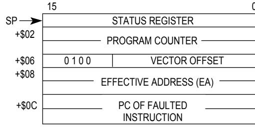

Diagram illustrating the stack frame layout for MC68EC040 and MC68LC040 Floating-Point Unimplemented Stack Frame, Format \$4. The stack grows downwards from the top, indicated by the SP arrow pointing to the left. The frame is 16 words (32 bytes) long, with bit 15 at the top and bit 0 at the bottom.

| Address Offset | Word Description          | Bit 15  | Bit 0 |
|----------------|---------------------------|---------|-------|
| +02            | STATUS REGISTER           |         |       |
| +02            | PROGRAM COUNTER           |         |       |
| +06            | VECTOR OFFSET             | 0 1 0 0 |       |
| +08            | EFFECTIVE ADDRESS (EA)    |         |       |
| +0C            | PC OF FAULTED INSTRUCTION |         |       |

Diagram of MC68EC040 and MC68LC040 Floating-Point Unimplemented Stack Frame, Format \$4

**Figure B-7. MC68EC040 and MC68LC040 Floating-Point Unimplemented Stack Frame, Format \$4**

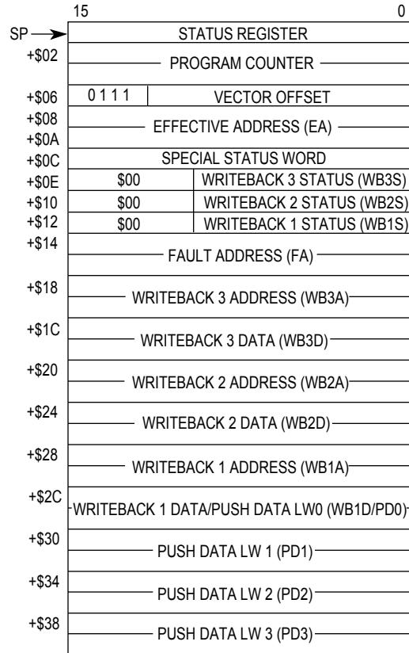

Diagram illustrating the stack frame layout for MC68040 Access Error Stack Frame, Format \$7. The stack grows downwards from the top, indicated by the SP arrow pointing to the left. The frame is 32 words (64 bytes) long, with bit 15 at the top and bit 0 at the bottom.

| Address Offset | Word Description                          | Bit 15  | Bit 0 |
|----------------|-------------------------------------------|---------|-------|
| +02            | STATUS REGISTER                           |         |       |
| +02            | PROGRAM COUNTER                           |         |       |
| +06            | VECTOR OFFSET                             | 0 1 1 1 |       |
| +08            | EFFECTIVE ADDRESS (EA)                    |         |       |
| +0A            | SPECIAL STATUS WORD                       |         |       |
| +0C            | WRITEBACK 3 STATUS (WB3S)                 | \$00    |       |
| +0E            | WRITEBACK 2 STATUS (WB2S)                 | \$00    |       |
| +10            | WRITEBACK 1 STATUS (WB1S)                 | \$00    |       |
| +12            | FAULT ADDRESS (FA)                        |         |       |
| +14            |                                           |         |       |
| +18            | WRITEBACK 3 ADDRESS (WB3A)                |         |       |
| +1C            | WRITEBACK 3 DATA (WB3D)                   |         |       |
| +20            | WRITEBACK 2 ADDRESS (WB2A)                |         |       |
| +24            | WRITEBACK 2 DATA (WB2D)                   |         |       |
| +28            | WRITEBACK 1 ADDRESS (WB1A)                |         |       |
| +2C            | WRITEBACK 1 DATA/PUSH DATA LW0 (WB1D/PD0) |         |       |
| +30            | PUSH DATA LW 1 (PD1)                      |         |       |
| +34            | PUSH DATA LW 2 (PD2)                      |         |       |
| +38            | PUSH DATA LW 3 (PD3)                      |         |       |

Diagram of MC68040 Access Error Stack Frame, Format \$7

**Figure B-8. MC68040 Access Error Stack Frame, Format \$7**


Diagram illustrating the MC68010 Bus and Address Error Stack Frame, Format \$8. The stack frame is shown as a vertical stack of memory locations from address \$02 to \$50, with bit positions 15 to 0 indicated at the top.

| Address | 15 | 0 | Content              |   |                                |
|---------|----|---|----------------------|---|--------------------------------|
| SP →    |    |   | STATUS REGISTER      |   |                                |
| +\$02   |    |   | PROGRAM COUNTER HIGH |   |                                |
|         |    |   | PROGRAM COUNTER LOW  |   |                                |
| +\$06   | 1  | 0 | 0                    | 0 | VECTOR OFFSET                  |
| +\$08   |    |   |                      |   | SPECIAL STATUS WORD            |
|         |    |   |                      |   | FAULT ADDRESS HIGH             |
| +\$0C   |    |   |                      |   | FAULT ADDRESS LOW              |
|         |    |   |                      |   | UNUSED, RESERVED               |
| +\$10   |    |   |                      |   | DATA OUTPUT BUFFER             |
|         |    |   |                      |   | UNUSED, RESERVED               |
| +\$14   |    |   |                      |   | DATA INPUT BUFFER              |
| +\$16   |    |   |                      |   | UNUSED, RESERVED               |
| +\$18   |    |   |                      |   | INSTRUCTION OUTPUT BUFFER      |
| \$1A    |    |   |                      |   | [VERSION]                      |
| +\$50   |    |   |                      |   | [NUMBER]                       |
|         |    |   |                      |   | INTERNAL INFORMATION, 16 WORDS |

MC68010 Bus and Address Error Stack Frame, Format \$8 diagram

NOTE: The stack pointer decrements by 29 words, although only 26 words of information actually write to memory. Motorola reserves the three additional words for future use.

**Figure B-9. MC68010 Bus and Address Error Stack Frame, Format \$8**


Diagram illustrating the MC68020 Bus and MC68030 Coprocessor Mid-Instruction Stack Frame, Format \$9. The stack frame is shown as a vertical stack of memory locations from address \$02 to \$12, with bit positions 15 to 0 indicated at the top.

| Address | 15 | 0 | Content         |   |                     |
|---------|----|---|-----------------|---|---------------------|
| SP →    |    |   | STATUS REGISTER |   |                     |
| +\$02   |    |   | PROGRAM COUNTER |   |                     |
| +\$06   | 1  | 0 | 0               | 1 | VECTOR OFFSET       |
| +\$08   |    |   |                 |   | INSTRUCTION ADDRESS |
| +\$0C   |    |   |                 |   | INTERNAL REGISTERS  |
| +\$12   |    |   |                 |   | 4 WORDS             |

MC68020 Bus and MC68030 Coprocessor Mid-Instruction Stack Frame, Format \$9 diagram

**Figure B-10. MC68020 Bus and MC68030 Coprocessor Mid-Instruction Stack Frame, Format \$9**

![Diagram of the MC68020 and MC68030 Short Bus Cycle Stack Frame, Format $A. The diagram shows a stack frame with addresses from +$02 to +$1E. The stack pointer (SP) points to the top of the frame at address +$02. The frame contains several registers: STATUS REGISTER, PROGRAM COUNTER, VECTOR OFFSET, INTERNAL REGISTER, SPECIAL STATUS REGISTER, INSTRUCTION PIPE STAGE C, INSTRUCTION PIPE STATE B, DATA CYCLE FAULT ADDRESS, INTERNAL REGISTER, INTERNAL REGISTER, DATA OUTPUT BUFFER, INTERNAL REGISTER, and INTERNAL REGISTER. The VECTOR OFFSET at address +$06 contains the binary value 1010.](M68000PRM.images/d17f5c469a96ddc06765b0c99361e999_img.jpg)

|            | 15                       | 0             |
|------------|--------------------------|---------------|
| SP → +\$02 | STATUS REGISTER          |               |
| +\$02      | PROGRAM COUNTER          |               |
| +\$06      | 1 0 1 0                  | VECTOR OFFSET |
| +\$08      | INTERNAL REGISTER        |               |
| +\$0A      | SPECIAL STATUS REGISTER  |               |
| +\$0C      | INSTRUCTION PIPE STAGE C |               |
| +\$0E      | INSTRUCTION PIPE STATE B |               |
| +\$10      | DATA CYCLE FAULT ADDRESS |               |
| +\$12      | INTERNAL REGISTER        |               |
| +\$14      | INTERNAL REGISTER        |               |
| +\$16      | INTERNAL REGISTER        |               |
| +\$18      | DATA OUTPUT BUFFER       |               |
| +\$1A      | INTERNAL REGISTER        |               |
| +\$1C      | INTERNAL REGISTER        |               |
| +\$1E      | INTERNAL REGISTER        |               |

Diagram of the MC68020 and MC68030 Short Bus Cycle Stack Frame, Format \$A. The diagram shows a stack frame with addresses from +\$02 to +\$1E. The stack pointer (SP) points to the top of the frame at address +\$02. The frame contains several registers: STATUS REGISTER, PROGRAM COUNTER, VECTOR OFFSET, INTERNAL REGISTER, SPECIAL STATUS REGISTER, INSTRUCTION PIPE STAGE C, INSTRUCTION PIPE STATE B, DATA CYCLE FAULT ADDRESS, INTERNAL REGISTER, INTERNAL REGISTER, DATA OUTPUT BUFFER, INTERNAL REGISTER, and INTERNAL REGISTER. The VECTOR OFFSET at address +\$06 contains the binary value 1010.

**Figure B-11. MC68020 and MC68030 Short Bus Cycle Stack Frame, Format \$A**

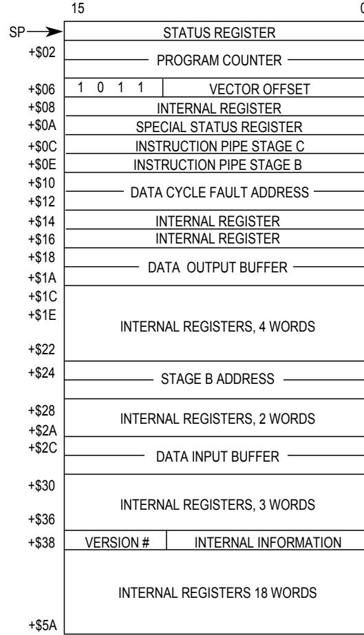

Diagram illustrating the MC68020 and MC68030 Long Bus Cycle Stack Frame, Format \$B. The stack frame is shown as a vertical stack of memory locations from address +\$02 to +\$5A, with bit positions 15 and 0 indicated at the top.

| Address | Content                          |
|---------|----------------------------------|
| +\$02   | STATUS REGISTER                  |
| +\$02   | PROGRAM COUNTER                  |
| +\$06   | 1 0 1 1   VECTOR OFFSET          |
| +\$08   | INTERNAL REGISTER                |
| +\$0A   | SPECIAL STATUS REGISTER          |
| +\$0C   | INSTRUCTION PIPE STAGE C         |
| +\$0E   | INSTRUCTION PIPE STAGE B         |
| +\$10   | DATA CYCLE FAULT ADDRESS         |
| +\$12   | INTERNAL REGISTER                |
| +\$14   | INTERNAL REGISTER                |
| +\$16   | DATA OUTPUT BUFFER               |
| +\$1A   | INTERNAL REGISTERS, 4 WORDS      |
| +\$1C   | STAGE B ADDRESS                  |
| +\$1E   | INTERNAL REGISTERS, 2 WORDS      |
| +\$20   | DATA INPUT BUFFER                |
| +\$22   | INTERNAL REGISTERS, 3 WORDS      |
| +\$24   | VERSION #   INTERNAL INFORMATION |
| +\$26   | INTERNAL REGISTERS 18 WORDS      |
| +\$28   |                                  |
| +\$2A   |                                  |
| +\$2C   |                                  |
| +\$30   |                                  |
| +\$32   |                                  |
| +\$34   |                                  |
| +\$36   |                                  |
| +\$38   |                                  |
| +\$3A   |                                  |
| +\$3C   |                                  |
| +\$3E   |                                  |
| +\$40   |                                  |
| +\$42   |                                  |
| +\$44   |                                  |
| +\$46   |                                  |
| +\$48   |                                  |
| +\$4A   |                                  |
| +\$4C   |                                  |
| +\$4E   |                                  |
| +\$50   |                                  |
| +\$52   |                                  |
| +\$54   |                                  |
| +\$56   |                                  |
| +\$58   |                                  |
| +\$5A   |                                  |

MC68020 and MC68030 Long Bus Cycle Stack Frame, Format \$B diagram

**Figure B-12. MC68020 and MC68030 Long Bus Cycle Stack Frame, Format \$B**
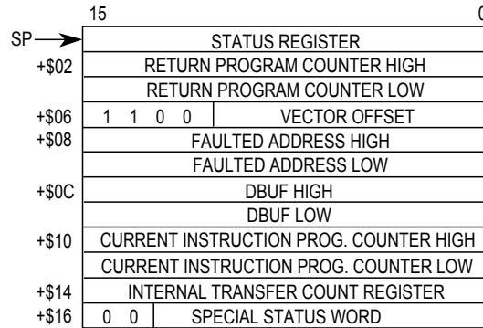

Diagram illustrating the CPU32 Bus Error for Prefetches and Operands Stack Frame, Format \$C. The stack frame is shown as a vertical stack of memory locations from address +\$02 to +\$16, with bit positions 15 and 0 indicated at the top.

| Address | Content                                |
|---------|----------------------------------------|
| +\$02   | STATUS REGISTER                        |
| +\$02   | RETURN PROGRAM COUNTER HIGH            |
| +\$02   | RETURN PROGRAM COUNTER LOW             |
| +\$06   | 1 1 0 0   VECTOR OFFSET                |
| +\$08   | FAULTED ADDRESS HIGH                   |
| +\$08   | FAULTED ADDRESS LOW                    |
| +\$0C   | DBUF HIGH                              |
| +\$0C   | DBUF LOW                               |
| +\$10   | CURRENT INSTRUCTION PROG. COUNTER HIGH |
| +\$10   | CURRENT INSTRUCTION PROG. COUNTER LOW  |
| +\$14   | INTERNAL TRANSFER COUNT REGISTER       |
| +\$16   | 0 0   SPECIAL STATUS WORD              |

CPU32 Bus Error for Prefetches and Operands Stack Frame, Format \$C diagram

**Figure B-13. CPU32 Bus Error for Prefetches and Operands Stack Frame, Format \$C**

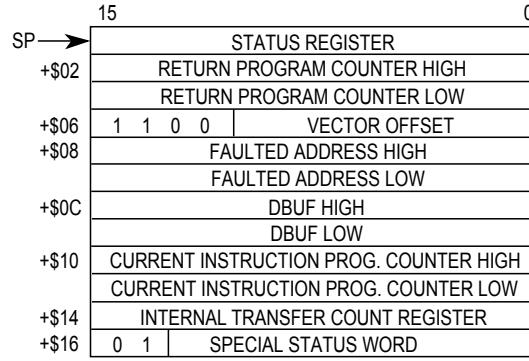

Stack frame diagram for CPU32 Bus Error on MOVEM Operand, Format \$C. The stack pointer (SP) points to the top of the frame. The frame is 17 words long, with addresses ranging from +\$02 to +\$16. The layout is as follows:

| Address | Content                                |
|---------|----------------------------------------|
| SP →    | 15 STATUS REGISTER 0                   |
| +\$02   | RETURN PROGRAM COUNTER HIGH            |
| +\$04   | RETURN PROGRAM COUNTER LOW             |
| +\$06   | 1 1 0 0   VECTOR OFFSET                |
| +\$08   | FAULTED ADDRESS HIGH                   |
| +\$10   | FAULTED ADDRESS LOW                    |
| +\$0C   | DBUF HIGH                              |
| +\$12   | DBUF LOW                               |
| +\$10   | CURRENT INSTRUCTION PROG. COUNTER HIGH |
| +\$12   | CURRENT INSTRUCTION PROG. COUNTER LOW  |
| +\$14   | INTERNAL TRANSFER COUNT REGISTER       |
| +\$16   | 0 1   SPECIAL STATUS WORD              |

CPU32 Bus Error on MOVEM Operand Stack Frame, Format \$C

**Figure B-14. CPU32 Bus Error on MOVEM Operand Stack Frame, Format \$C**

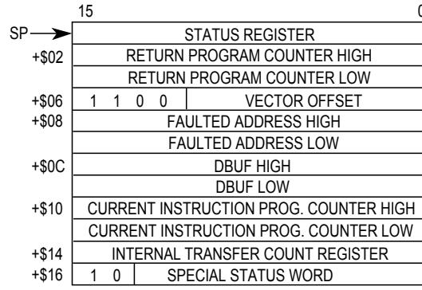

Stack frame diagram for CPU32 Four- and Six-Word Bus Error, Format \$C. The stack pointer (SP) points to the top of the frame. The frame is 17 words long, with addresses ranging from +\$02 to +\$16. The layout is as follows:

| Address | Content                                |
|---------|----------------------------------------|
| SP →    | 15 STATUS REGISTER 0                   |
| +\$02   | RETURN PROGRAM COUNTER HIGH            |
| +\$04   | RETURN PROGRAM COUNTER LOW             |
| +\$06   | 1 1 0 0   VECTOR OFFSET                |
| +\$08   | FAULTED ADDRESS HIGH                   |
| +\$10   | FAULTED ADDRESS LOW                    |
| +\$0C   | DBUF HIGH                              |
| +\$12   | DBUF LOW                               |
| +\$10   | CURRENT INSTRUCTION PROG. COUNTER HIGH |
| +\$12   | CURRENT INSTRUCTION PROG. COUNTER LOW  |
| +\$14   | INTERNAL TRANSFER COUNT REGISTER       |
| +\$16   | 1 0   SPECIAL STATUS WORD              |

CPU32 Four- and Six-Word Bus Error Stack Frame, Format \$C

**Figure B-15. CPU32 Four- and Six-Word Bus Error Stack Frame, Format \$C**

### B.3 FLOATING-POINT STACK FRAMES

Figures B-16 through B-23 illustrate floating-point stack frames for the MC68881/MC68882 and the MC68040.

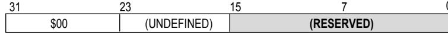

| 31   | 23          | 15         | 7 | 0 |
|------|-------------|------------|---|---|
| \$00 | (UNDEFINED) | (RESERVED) |   |   |

**Figure B-16. MC68881/MC68882 and MC68040 Null Stack Frame**

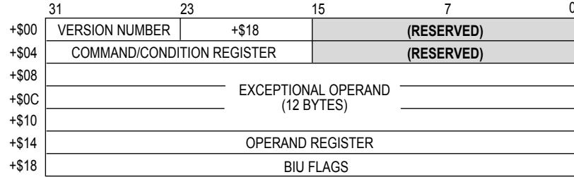

| 31    | 23                             | 15    | 7          | 0 |
|-------|--------------------------------|-------|------------|---|
| +\$00 | VERSION NUMBER                 | +\$18 | (RESERVED) |   |
| +\$04 | COMMAND/CONDITION REGISTER     |       | (RESERVED) |   |
| +\$08 |                                |       |            |   |
| +\$0C | EXCEPTIONAL OPERAND (12 BYTES) |       |            |   |
| +\$10 |                                |       |            |   |
| +\$14 | OPERAND REGISTER               |       |            |   |
| +\$18 | BIU FLAGS                      |       |            |   |

**Figure B-17. MC68881 Idle Stack Frame**

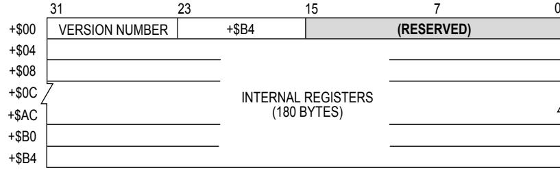

|       | 31                             | 23    | 15 | 7          | 0 |
|-------|--------------------------------|-------|----|------------|---|
| +\$00 | VERSION NUMBER                 | +\$B4 |    | (RESERVED) |   |
| +\$04 |                                |       |    |            |   |
| +\$08 |                                |       |    |            |   |
| +\$0C |                                |       |    |            |   |
| +\$AC | INTERNAL REGISTERS (180 BYTES) |       |    |            |   |
| +\$B0 |                                |       |    |            |   |
| +\$B4 |                                |       |    |            |   |

**Figure B-18. MC68881 Busy Stack Frame**

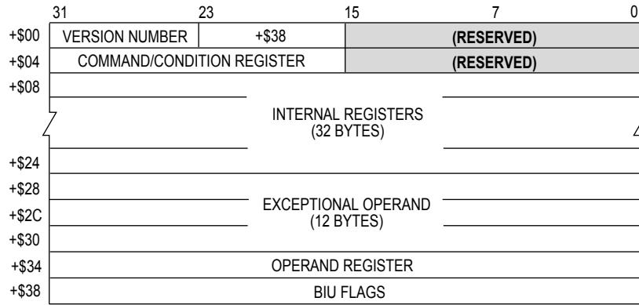

|       | 31                             | 23    | 15         | 7          | 0 |
|-------|--------------------------------|-------|------------|------------|---|
| +\$00 | VERSION NUMBER                 | +\$38 |            | (RESERVED) |   |
| +\$04 | COMMAND/CONDITION REGISTER     |       | (RESERVED) |            |   |
| +\$08 |                                |       |            |            |   |
|       | INTERNAL REGISTERS (32 BYTES)  |       |            |            |   |
| +\$24 |                                |       |            |            |   |
| +\$28 |                                |       |            |            |   |
| +\$2C | EXCEPTIONAL OPERAND (12 BYTES) |       |            |            |   |
| +\$30 |                                |       |            |            |   |
| +\$34 | OPERAND REGISTER               |       |            |            |   |
| +\$38 | BIU FLAGS                      |       |            |            |   |

**Figure B-19. MC68882 Idle Stack Frame**

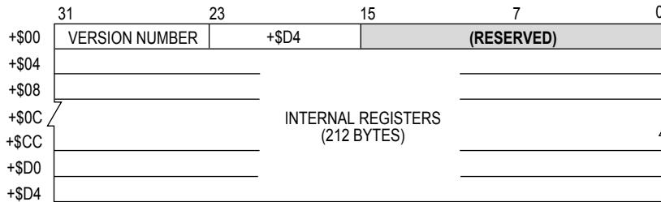

|       | 31                             | 23    | 15 | 7          | 0 |
|-------|--------------------------------|-------|----|------------|---|
| +\$00 | VERSION NUMBER                 | +\$D4 |    | (RESERVED) |   |
| +\$04 |                                |       |    |            |   |
| +\$08 |                                |       |    |            |   |
| +\$0C |                                |       |    |            |   |
| +\$CC | INTERNAL REGISTERS (212 BYTES) |       |    |            |   |
| +\$D0 |                                |       |    |            |   |
| +\$D4 |                                |       |    |            |   |

**Figure B-20. MC68882 Busy Stack Frame**

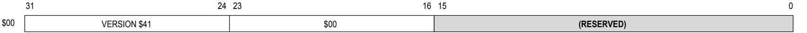

Figure B-21 shows the MC68040 Idle Stack Frame structure. The frame is 32 bits wide, divided into four 8-bit bytes (\$00, \$01, \$02, \$03) from left to right. Bit positions are marked at the top: 31, 24-23, 16-15, and 0.

|      |    |                |       |      |       |            |   |
|------|----|----------------|-------|------|-------|------------|---|
| \$00 | 31 | VERSION = \$41 | 24-23 | \$00 | 16-15 | (RESERVED) | 0 |
|------|----|----------------|-------|------|-------|------------|---|

MC68040 Idle Stack Frame diagram

Figure B-21. MC68040 Idle Stack Frame

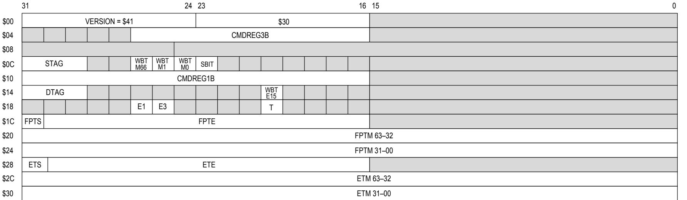

Figure B-22 shows the MC68040 Unimplemented Instruction Stack Frame structure. The frame is 32 bits wide, divided into four 8-bit bytes (\$00, \$01, \$02, \$03) from left to right. Bit positions are marked at the top: 31, 24-23, 16-15, and 0.

|      |      |                |         |          |            |      |   |
|------|------|----------------|---------|----------|------------|------|---|
| \$00 | 31   | VERSION = \$41 | 24-23   | \$30     | 16-15      |      | 0 |
| \$04 |      |                |         | CMDREG3B |            |      |   |
| \$08 |      |                |         |          |            |      |   |
| \$0C | STAG |                | WBT M66 | WBT M1   | WBT M0     | SBIT |   |
| \$10 |      |                |         | CMDREG1B |            |      |   |
| \$14 | DTAG |                |         |          | WBT E15    |      |   |
| \$18 |      |                | E1      | E3       | T          |      |   |
| \$1C | FPTS |                |         | FPTE     |            |      |   |
| \$20 |      |                |         |          | FPTM 63-32 |      |   |
| \$24 |      |                |         |          | FPTM 31-00 |      |   |
| \$28 | ETS  |                |         | ETE      |            |      |   |
| \$2C |      |                |         |          | ETM 63-32  |      |   |
| \$30 |      |                |         |          | ETM 31-00  |      |   |

MC68040 Unimplemented Instruction Stack Frame diagram


A small gray rectangular box representing a reserved field.

Legend for Reserved field

Figure B-22. MC68040 Unimplemented Instruction Stack Frame

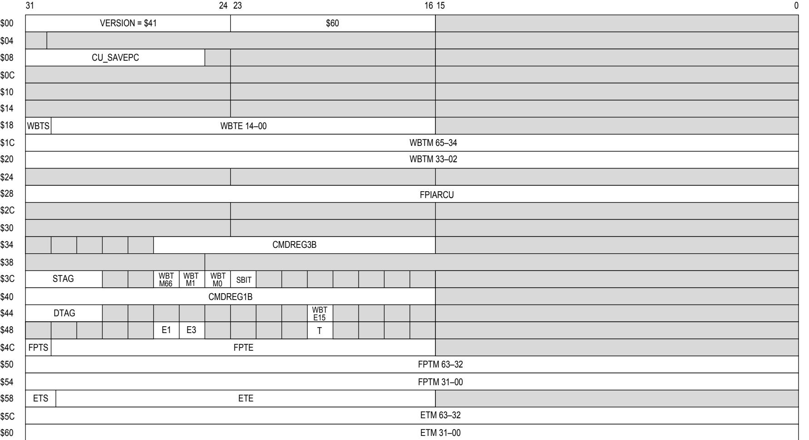

The diagram illustrates the MC68040 Busy Stack Frame, a 64-word structure (addresses \$00 to \$3F) with bit fields and labels. The structure is defined by the following fields:

- Bit Fields (31-0):** 31, 24-23, 16-15, 0.
- Word 0 (\$00):** VERSION = \$41, \$60.
- Word 1 (\$04):** CU\_SAVEPC.
- Word 2 (\$08):** Reserved.
- Word 3 (\$0C):** Reserved.
- Word 4 (\$10):** Reserved.
- Word 5 (\$14):** Reserved.
- Word 6 (\$18):** WBTS, WBTE 14-00.
- Word 7 (\$1C):** Reserved.
- Word 8 (\$20):** Reserved.
- Word 9 (\$24):** Reserved.
- Word 10 (\$28):** Reserved.
- Word 11 (\$2C):** Reserved.
- Word 12 (\$30):** Reserved.
- Word 13 (\$34):** Reserved.
- Word 14 (\$38):** Reserved.
- Word 15 (\$3C):** STAG, WBT M66, WBT M1, WBT M0, SBIT.
- Word 16 (\$40):** Reserved.
- Word 17 (\$44):** Reserved.
- Word 18 (\$48):** DTAG, E1, E3, WBT E15, T.
- Word 19 (\$4C):** FPTS, FPT E.
- Word 20 (\$50):** Reserved.
- Word 21 (\$54):** Reserved.
- Word 22 (\$58):** ETS, ETE.
- Word 23 (\$5C):** Reserved.
- Word 24 (\$60):** Reserved.

Additional labels include: WBTS, WBTE 14-00, WBTM 65-34, WBTM 33-02, FPIARCU, CMDREG3B, CMDREG1B, FPTM 63-32, FPTM 31-00, ETM 63-32, ETM 31-00.

MC68040 Busy Stack Frame diagram showing a 64-word structure with bit fields and labels.

 Reserved

**Figure B-23. MC68040 Busy Stack Frame**

## APPENDIX C S-RECORD OUTPUT FORMAT

The S-record format for output modules is for encoding programs or data files in a printable format for transportation between computer systems. The transportation process can be visually monitored, and the S-records can be easily edited.

### C.1 S-RECORD CONTENT

Visually, S-records are essentially character strings made of several fields that identify the record type, record length, memory address, code/data, and checksum. Each byte of binary data encodes as a two- character hexadecimal number: the first character represents the high- order four bits, and the second character represents the low-order four bits of the byte. Figure C-1 illustrates the five fields that comprise an S-record. Table C-1 lists the composition of each S- record field.

| TYPE | RECORD LENGTH | ADDRESS | CODE/DATA | CHECKSUM |
|------|---------------|---------|-----------|----------|
|------|---------------|---------|-----------|----------|

**Figure C-1. Five Fields of an S-Record**

**Table C-1. Field Composition of an S-Record**

| Field         | Printable Characters | Contents                                                                                                                                                                                                                               |
|---------------|----------------------|----------------------------------------------------------------------------------------------------------------------------------------------------------------------------------------------------------------------------------------|
| Type          | 2                    | S-record type—S0, S1, etc.                                                                                                                                                                                                             |
| Record Length | 2                    | The count of the character pairs in the record, excluding the type and record length.                                                                                                                                                  |
| Address       | 4, 6, or 8           | The 2-, 3-, or 4-byte address at which the data field is to be loaded into memory.                                                                                                                                                     |
| Code/Data     | 0–2n                 | From 0 to n bytes of executable code, memory loadable data, or descriptive information. For compatibility with teletypewriters, some programs may limit the number of bytes to as few as 28 (56 printable characters in the S-record). |
| Checksum      | 2                    | The least significant byte of the one's complement of the sum of the values represented by the pairs of characters making up the record length, address, and the code/data fields.                                                     |

When downloading S-records, each must be terminated with a CR. Additionally, an S-record may have an initial field that fits other data such as line numbers generated by some time-sharing systems. The record length (byte count) and checksum fields ensure transmission accuracy.

## C.2 S-RECORD TYPES

There are eight types of S-records to accommodate the encoding, transportation, and decoding functions. The various Motorola record transportation control programs (e.g. upload, download, etc.), cross assemblers, linkers, and other file creating or debugging programs, only utilize S-records serving the programOs purpose. For more information on support of specific S-records, refer to the userOs manual for that program.

An S-record format module may contain S-records of the following types:

- S0 — The header record for each block of S-records. The code/data field may contain any descriptive information identifying the following block of S-records. Under VERSAdos, the resident linkerOs IDENT command can be used to designate module name, version number, revision number, and description information that will make up the header record. The address field is normally zeros.
- S1 — A record containing code/data and the 2-byte address at which the code/data is to reside.
- S2 — A record containing code/data and the 3-byte address at which the code/data is to reside.
- S3 — A record containing code/data and the 4-byte address at which the code/data is to reside.
- S5 — A record containing the number of S1, S2, and S3 records transmitted in a particular block. This count appears in the address field. There is no code/data field.
- S7 — A termination record for a block of S3 records. The address field may optionally contain the 4-byte address of the instruction to which control is to be passed. There is no code/data field.
- S8 — A termination record for a block of S2 records. The address field may optionally contain the 3-byte address of the instruction to which control is to be passed. There is no code/data field.
- S9 — A termination record for a block of S1 records. The address field may optionally contain the 2-byte address of the instruction to which control is to be passed. Under VERSAdos, the resident linkerOs ENTRY command can be used to specify this address. If this address is not specified, the first entry point specification encountered in the object module input will be used. There is no code/data field.

Each block of S-records uses only one termination record. S7 and S8 records are only active when control is to be passed to a 3- or 4- byte address; otherwise, an S9 is used for termination. Normally, there is only one header record, although it is possible for multiple header records to occur.

### C.3 S-RECORD CREATION

Dump utilities, debuggers, a VERSAdos resident linkage editor, or cross assemblers and linkers produce S-record format programs. On VERSAdos systems, the build load module (MBLM) utility allows an executable load module to be built from S-records. It has a counterpart utility in BUILDS that allows an S-record file to be created from a load module.

Programs are available for downloading or uploading a file in S- record format from a host system to an 8- or 16-bit microprocessor- based system. A typical S-record-format module is printed or displayed as follows:

```
S00600004844521B
S1130000285F245F2212226A000424290008237C2A
S11300100002000800082629001853812341001813
S113002041E900084E42234300182342000824A952
S107003000144ED492
S9030000FC
```

The module has an S0 record, four S1 records, and an S9 record. The following character pairs comprise the S-record-format module.

S0 Record:

- S0 — S-record type S0, indicating that it is a header record.
- 06 — Hexadecimal 06 (decimal 6), indicating that six character pairs (or ASCII bytes) follow.
- 0000—A 4-character, 2-byte address field; zeros in this example.
- 48 — ASCII H
- 44 — ASCII D
- 52 — ASCII R
- 1B — The checksum.

First S1 Record:

- S1 — S-record type S1, indicating that it is a code/data record to be loaded/verified at a 2-byte address.
- 13 — Hexadecimal 13 (decimal 19), indicating that 19 character pairs, representing 19 bytes of binary data, follow.
- 0000—A 4-character, 2-byte address field (hexadecimal address 0000) indicating where the data that follows is to be loaded.

The next 16 character pairs of the first S1 record are the ASCII bytes of the actual program code/data. In this assembly language example, the program's hexadecimal opcodes are sequentially written in the code/data fields of the S1 records.

| Opcode   | Instruction |                          |
|----------|-------------|--------------------------|
| 285F     | MOVE.L      | (A7) +, A4               |
| 245F     | MOVE.L      | (A7) +, A2               |
| 2212     | MOVE.L      | (A2), D1                 |
| 226A0004 | MOVE.L      | 4(A2), A1                |
| 24290008 | MOVE.L      | FUNCTION(A1), D2         |
| 237C     | MOVE.L      | #FORCEFUNC, FUNCTION(A1) |

The rest of this code continues in the remaining S1 record's code/data fields and stores in memory location 0010, etc.

2A — The checksum of the first S1 record.

The second and third S1 records also contain hexadecimal 13 (decimal 19) character pairs and end with checksums 13 and 52, respectively. The fourth S1 record contains 07 character pairs and has a checksum of 92.

S9 Record:

S9 — S-record type S9, indicating that it is a termination record.

03 — Hexadecimal 03, indicating that three character pairs (3 bytes) follow.

0000—The address field, zeros.

FC — The checksum of the S9 record.

Each printable character in an S-record encodes in hexadecimal (ASCII in this example) representation of the binary bits that transmit. Figure C-2 illustrates the sending of the first S1 record. Table C-2 lists the ASCII code for S-records.

| TYPE | RECORD LENGTH |      |      | ADDRESS |      |      |      | CODE/DATA |      |      |      |      |      | CHECKSUM |      |      |      |      |      |      |      |      |      |     |      |      |      |      |
|------|---------------|------|------|---------|------|------|------|-----------|------|------|------|------|------|----------|------|------|------|------|------|------|------|------|------|-----|------|------|------|------|
| S    | 1             | 1    | 3    | 0       | 0    | 0    | 0    | 2         | 8    | 5    | F    | ***  | 2    | A        |      |      |      |      |      |      |      |      |      |     |      |      |      |      |
| 5    | 3             | 3    | 1    | 3       | 1    | 3    | 3    | 3         | 0    | 3    | 0    | 3    | 0    | 3        | 0    | 3    | 2    | 3    | 8    | 3    | 5    | 4    | 6    | *** | 3    | 2    | 4    | 1    |
| 0101 | 0011          | 0011 | 0001 | 0011    | 0001 | 0011 | 0011 | 0011      | 0000 | 0011 | 0000 | 0011 | 0000 | 0011     | 0000 | 0011 | 0010 | 0011 | 1000 | 0011 | 0101 | 0100 | 0110 | *** | 0011 | 0010 | 0100 | 0001 |

**Figure C-2. Transmission of an S1 Record**

**Table C-2. ASCII Code**

| Least Significant Digit | Most Significant Digit |     |    |   |   |   |   |     |
|-------------------------|------------------------|-----|----|---|---|---|---|-----|
|                         | 0                      | 1   | 2  | 3 | 4 | 5 | 6 | 7   |
| 0                       | NUL                    | DLE | SP | 0 | @ | P | ' | p   |
| 1                       | SOH                    | DC1 | !  | 1 | A | Q | a | q   |
| 2                       | STX                    | DC2 | "  | 2 | B | R | b | r   |
| 3                       | ETX                    | DC3 | #  | 3 | C | S | c | s   |
| 4                       | EOT                    | DC4 | \$ | 4 | D | T | d | t   |
| 5                       | ENQ                    | NAK | %  | 5 | E | U | e | u   |
| 6                       | ACK                    | SYN | &  | 6 | F | V | f | v   |
| 7                       | BEL                    | ETB | '  | 7 | G | W | g | w   |
| 8                       | BS                     | CAN | (  | 8 | H | X | h | x   |
| 9                       | HT                     | EM  | )  | 9 | I | Y | i | y   |
| A                       | LF                     | SUB | *  | : | J | Z | j | z   |
| B                       | VT                     | ESC | +  | ; | K | [ | k | {   |
| C                       | FF                     | FS  | ,  | < | L | \ | l |     |
| D                       | CR                     | GS  | -  | = | M | ] | m | }   |
| E                       | SO                     | RS  | .  | > | N | ^ | n | ~   |
| F                       | SI                     | US  | /  | ? | O | _ | o | DEL |


Motorola logo

**How to reach us:**

**USA/EUROPE/Locations Not Listed:** Motorola Literature Distribution;  
P.O. Box 5405, Denver, Colorado 80217. 303-675-2140 or 1-800-441-2447

**Customer Focus Center:** 1-800-521-6274

**MFax™:** RMFAX0@email.sps.mot.com – TOUCHTONE 602-244-6609  
Motorola Fax Back System – US & Canada ONLY 1-800-774-1848  
– <http://sps.motorola.com/mfax/>

**HOME PAGE:** <http://motorola.com/sps/>

Mfax is a trademark of Motorola, Inc.

**JAPAN:** Nippon Motorola Ltd.; SPD, Strategic Planning Office, 141, 4-32-1,  
Nishi-Gotanda, Shagawa-ku, Tokyo, Japan. 03-5487-8488

**ASIA/PACIFIC:** Motorola Semiconductors H.K. Ltd.; 8B Tai Ping Industrial Park,  
51 Ting Kok Road, Tai Po, N.T., Hong Kong. 852-26629298